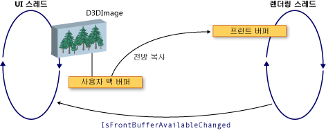

# WPF 및 Direct3D9 상호 운용성
Windows Presentation Foundation (WPF) 응용 프로그램에서 Direct3D9 콘텐츠를 포함할 수 있습니다. 이 항목에서는 wpf 효율적으로 상호 운용 되도록 Direct3D9 콘텐츠를 만드는 방법을 설명 합니다.  
  
> [!NOTE]
>  WPF의 Direct3D9 콘텐츠를 사용할 때는 성능을 고려해 야 하는 합니다. 성능을 최적화 하는 방법에 대 한 자세한 내용은 참조 [Direct3D9 및 WPF 상호 운용성에 대 한 성능 고려 사항](../../../../docs/framework/wpf/advanced/performance-considerations-for-direct3d9-and-wpf-interoperability.md)합니다.  
  
## 디스플레이 버퍼  
 <xref:System.Windows.Interop.D3DImage> 클래스 라고 하는 두 디스플레이 버퍼 관리는 *백 버퍼* 및 *프런트 버퍼*합니다. 백 버퍼가 Direct3D9 화면을 보여 줍니다. 백 버퍼에 대 한 변경에 복사 됩니다 프런트 버퍼 호출 하는 경우는 <xref:System.Windows.Interop.D3DImage.Unlock%2A> 메서드.  
  
 다음 그림 백 버퍼 및 프런트 버퍼 간의 관계를 보여 줍니다.  
  
   
  
## Direct3D9 장치 만들기  
 Direct3D9 콘텐츠를 렌더링 하려면 Direct3D9 장치를 만들어야 합니다. 장치를 만드는 데 사용할 수 있는 Direct3D9 개체 두 개가 `IDirect3D9` 및 `IDirect3D9Ex`합니다. 이러한 개체를 사용 하 여 만들 `IDirect3DDevice9` 및 `IDirect3DDevice9Ex` 장치, 각각.  
  
 다음 방법 중 하나를 호출 하 여 장치를 만듭니다.  
  
-   `IDirect3D9 * Direct3DCreate9(UINT SDKVersion);`  
  
-   `HRESULT Direct3DCreate9Ex(UINT SDKVersion, IDirect3D9Ex **ppD3D);`  
  
 Windows Vista 또는 운영 체제에서 사용 하 여는 `Direct3DCreate9Ex` 메서드 Windows 표시할 드라이버 모델 (WDDM)를 사용 하도록 구성 된 디스플레이 사용 합니다. 사용 된 `Direct3DCreate9` 다른 플랫폼에서 메서드.  
  
### 가용성 Direct3DCreate9Ex 메서드  
 d3d9.dll에는 `Direct3DCreate9Ex` Windows Vista 또는 운영 체제에 대해서만 메서드. 이 기능을 Windows XP에서 직접 연결 하면 응용 프로그램 로드 되지 않습니다. 확인 하려면 여부는 `Direct3DCreate9Ex` 메서드는 지원 DLL을 로드 하 고 프로시저 주소를 찾습니다. 다음 코드를 테스트 하는 방법을 보여 줍니다는 `Direct3DCreate9Ex` 메서드. 전체 코드 예제를 보려면 [연습: WPF의 호스팅에 대 한 Direct3D9 콘텐츠 만들기](../../../../docs/framework/wpf/advanced/walkthrough-creating-direct3d9-content-for-hosting-in-wpf.md)합니다.  
  
 [!code-cpp[System.Windows.Interop.D3DImage#RendererManager_EnsureD3DObjects](../../../../samples/snippets/cpp/VS_Snippets_Wpf/System.Windows.Interop.D3DImage/cpp/renderermanager.cpp#renderermanager_ensured3dobjects)]  
  
### HWND 만들기  
 장치를 만들면 HWND가 필요 합니다. 일반적으로 사용 하는 Direct3D9에 대 한 더미 HWND를 만들어야 합니다. 다음 코드 예제에는 더미 HWND를 만드는 방법을 보여 줍니다.  
  
 [!code-cpp[System.Windows.Interop.D3DImage#RendererManager_EnsureHWND](../../../../samples/snippets/cpp/VS_Snippets_Wpf/System.Windows.Interop.D3DImage/cpp/renderermanager.cpp#renderermanager_ensurehwnd)]  
  
### 현재 매개 변수  
 장치를 만들면 필요는 `D3DPRESENT_PARAMETERS` 구조체 없지만 몇 가지 매개 변수는 중요 합니다. 이러한 매개 변수는 메모리 사용 공간을 최소화 하기 위해 선택 됩니다.  
  
 설정의 `BackBufferHeight` 및 `BackBufferWidth` 필드를 1로 합니다. 0으로 설정 하면 HWND의 차원에 설정 하도록 합니다.  
  
 항상 설정 된 `D3DCREATE_MULTITHREADED` 및 `D3DCREATE_FPU_PRESERVE` 방지 하는 플래그를 Direct3D9와 Direct3D9 FPU 설정을 변경 하지 못하도록 하려면 사용 하는 메모리를 손상 시키고 합니다.  
  
 다음 코드에서는 초기화 하는 방법을 보여 줍니다.는 `D3DPRESENT_PARAMETERS` 구조체입니다.  
  
 [!code-cpp[System.Windows.Interop.D3DImage#Renderer_Init](../../../../samples/snippets/cpp/VS_Snippets_Wpf/System.Windows.Interop.D3DImage/cpp/renderer.cpp#renderer_init)]  
  
## 백 버퍼의 렌더링 대상 만들기  
 에 Direct3D9 내용을 표시 하는 <xref:System.Windows.Interop.D3DImage>, Direct3D9 화면을 만들고 호출 하 여 할당 된 <xref:System.Windows.Interop.D3DImage.SetBackBuffer%2A> 메서드.  
  
### 어댑터 지원 확인  
 화면을 만들기 전에 모든 어댑터 화면 속성이 필요한 지를 확인 합니다. 하나의 어댑터에 렌더링 하는 경우에 시스템의 모든 어댑터에 WPF 창에 표시 수 수 있습니다. 항상 다중 어댑터 구성을 처리 하는 Direct3D9 코드를 작성 해야 하 고 WPF 사용 가능한 어댑터 간의 화면을 이동할 수 있으므로 지원에 대 한 모든 어댑터를 확인 해야 합니다.  
  
 다음 코드 예제에서는 모든 어댑터가 Direct3D9 시스템에서 지 원하는 확인 하는 방법을 보여 줍니다.  
  
 [!code-cpp[System.Windows.Interop.D3DImage#RendererManager_TestSurfaceSettings](../../../../samples/snippets/cpp/VS_Snippets_Wpf/System.Windows.Interop.D3DImage/cpp/renderermanager.cpp#renderermanager_testsurfacesettings)]  
  
### 화면 만들기  
 화면을 만들기 전에 장치 기능 좋은 성능을 대상 운영 체제에서 지원 하는지 확인 합니다. 자세한 내용은 참조 [Direct3D9 및 WPF 상호 운용성에 대 한 성능 고려 사항](../../../../docs/framework/wpf/advanced/performance-considerations-for-direct3d9-and-wpf-interoperability.md)합니다.  
  
 장치 기능을 확인 하는 경우에 화면을 만들 수 있습니다. 다음 코드 예제에서는 렌더링 대상을 만드는 방법을 보여 줍니다.  
  
 [!code-cpp[System.Windows.Interop.D3DImage#Renderer_CreateSurface](../../../../samples/snippets/cpp/VS_Snippets_Wpf/System.Windows.Interop.D3DImage/cpp/renderer.cpp#renderer_createsurface)]  
  
### WDDM  
 Windows Vista 이상의 운영 체제를 WDDM를 사용 하도록 구성 되어 있는에서 렌더링 대상 질감을 만들 및 수준 0 화면을 전달할 수는 <xref:System.Windows.Interop.D3DImage.SetBackBuffer%2A> 메서드. 잠글 수 있는 렌더링 대상 텍스처를 만들 수 없습니다 및 성능은 저하 됩니다 때문에 Windows xp에서는이 방법은 권장 되지 않습니다.  
  
## 장치 상태 처리  
 <xref:System.Windows.Interop.D3DImage> 클래스 라고 하는 두 디스플레이 버퍼 관리는 *백 버퍼* 및 *프런트 버퍼*합니다. 백 버퍼가 Direct3D 화면을 보여 줍니다.  백 버퍼에 대 한 변경에 복사 됩니다 프런트 버퍼 호출 하는 경우는 <xref:System.Windows.Interop.D3DImage.Unlock%2A> 메서드를 하드웨어에 표시 됩니다. 경우에 따라서는 프런트 버퍼 수 없게 됩니다. 이 처럼 가용성 화면 잠금, 전체 화면 전용 Direct3D 응용 프로그램, 사용자 전환 또는 기타 시스템 작업에 의해 발생할 수 있습니다. WPF 응용 프로그램 처리를 통해 알림을 이러한 경우는 <xref:System.Windows.Interop.D3DImage.IsFrontBufferAvailableChanged> 이벤트입니다.  사용 하지 못하게 될 프런트 버퍼에 응용 프로그램의 응답으로 소프트웨어 렌더링 대체 WPF 사용 여부에 따라 달라 집니다. <xref:System.Windows.Interop.D3DImage.SetBackBuffer%2A> 메서드에 WPF 소프트웨어 렌더링으로 다시 속하는지 여부를 지정 하는 매개 변수를 사용 하는 오버 로드 합니다.  
  
 호출 하는 경우는 <xref:System.Windows.Interop.D3DImage.SetBackBuffer%28System.Windows.Interop.D3DResourceType%2CSystem.IntPtr%29> 오버 로드 또는 호출의 <xref:System.Windows.Interop.D3DImage.SetBackBuffer%28System.Windows.Interop.D3DResourceType%2CSystem.IntPtr%2CSystem.Boolean%29> 오버 로드는 `enableSoftwareFallback` 매개 변수 설정 `false`, 프런트 버퍼를 사용할 수 없게 되 고 아무 것도 렌더링 시스템 백 버퍼에 대 한 참조를 해제 표시 합니다. 프런트 버퍼를 사용할 수 있는 다시 렌더링 발생는 <xref:System.Windows.Interop.D3DImage.IsFrontBufferAvailableChanged> WPF 응용 프로그램에 알리는 이벤트를 합니다.  에 대 한 이벤트 처리기를 만들 수는 <xref:System.Windows.Interop.D3DImage.IsFrontBufferAvailableChanged> 유효한 Direct3D 화면을 사용 하 여 다시 렌더링을 다시 시작 하는 이벤트입니다. 호출 해야 렌더링을 다시 시작 하려면 <xref:System.Windows.Interop.D3DImage.SetBackBuffer%2A>합니다.  
  
 호출 하는 경우는 <xref:System.Windows.Interop.D3DImage.SetBackBuffer%28System.Windows.Interop.D3DResourceType%2CSystem.IntPtr%2CSystem.Boolean%29> 오버 로드는 `enableSoftwareFallback` 매개 변수 설정 `true`, 렌더링 시스템을 호출할 필요가 없습니다 이므로 프런트 버퍼를 사용할 수 없을 때 백 버퍼에 대 한 참조를 유지 <xref:System.Windows.Interop.D3DImage.SetBackBuffer%2A> 때 앞 버퍼를 다시 사용할 수 있습니다.  
  
 소프트웨어 렌더링을 사용 하는 경우 여기서 사용자의 장치를 사용할 수 없지만 Direct3D 화면에 대 한 참조를 유지 하는 렌더링 시스템 있을 수 있습니다. Direct3D9 장치를 사용할 수 있는지를 확인 하려면 호출 된 `TestCooperativeLevel` 메서드. Direct3D9Ex 장치 호출을 확인 하 고 `CheckDeviceState` 메서드를 때문에 `TestCooperativeLevel` 메서드는 사용 되지 않으며 항상 성공 했다는 결과가 반환 합니다. 사용자 장치를 사용할 수 있는 경우 호출할 <xref:System.Windows.Interop.D3DImage.SetBackBuffer%2A> 백 버퍼에 대 한 WPF의 참조를 해제 합니다.  장치를 재설정 해야 할 경우 호출 <xref:System.Windows.Interop.D3DImage.SetBackBuffer%2A> 와 `backBuffer` 매개 변수 설정 `null`, 한 다음 호출 <xref:System.Windows.Interop.D3DImage.SetBackBuffer%2A> 사용 하 여 다시 `backBuffer` 유효한 Direct3D 화면으로 설정 합니다.  
  
 호출 된 `Reset` 다중 어댑터 지원을 구현 하는 경우에 유효 하지 않은 장치에서 복구 하는 메서드. 그렇지 않으면, 모든 Direct3D9 인터페이스를 해제 하 고 전체적으로 다시 만듭니다. 어댑터 레이아웃 변경 된 경우에 변경 전에 만들어진 Direct3D9 개체 업데이트 되지 않습니다.  
  
## 크기 조정 처리  
 경우는 <xref:System.Windows.Interop.D3DImage> 표시 됩니다 현재에 따라 조정 된 기본 크기로 이외의 해상도 <xref:System.Windows.Media.RenderOptions.BitmapScalingMode%2A>제외 하 고 <xref:System.Windows.Media.Effects.SamplingMode.Bilinear> 를 대체 하는 <xref:System.Windows.Media.BitmapScalingMode.Fant>합니다.  
  
 새 만들어야 높은 충실도 필요로 하는 경우 화면의 컨테이너는 <xref:System.Windows.Interop.D3DImage> 크기를 변경 합니다.  
  
 세 가지 방법으로 크기 조정을 처리할 수 있습니다.  
  
-   이 레이아웃 시스템에 참여 하 고 크기를 변경할 때 새 화면을 만듭니다. 이 중단 될 수도, 비디오 메모리를 조각화 때문에 화면을 너무 많이 만들지 마십시오.  
  
-   새 화면을 만드는 데 시간이의 고정 된 기간 resize 이벤트가 발생 하지 않은 때까지 기다립니다.  
  
-   만들기는 <xref:System.Windows.Threading.DispatcherTimer> 초당 여러 번 컨테이너 크기를 확인 하 합니다.  
  
## 다중 모니터 최적화  
 렌더링 시스템 이동 하면 성능이 크게 저하 될 수 있습니다는 <xref:System.Windows.Interop.D3DImage> 다른 모니터로 합니다.  
  
 WDDM, 동일한 비디오 모니터 되는 카드를 사용 하 여 `Direct3DCreate9Ex`, 성능이 저하 되지 않습니다. 모니터는 별도 비디오 카드에 있는 경우 성능이 저하 됩니다. Windows xp에서는 항상 성능이 저하 됩니다.  
  
 경우는 <xref:System.Windows.Interop.D3DImage> 좋은 성능을 복원 하려면 해당 어댑터에 새 화면을 만들 수 있습니다 다른 모니터로 이동 합니다.  
  
 성능 저하를 방지 하려면 특히 다중 모니터에 대 한 코드를 작성 합니다. 다음 목록에는 다중 모니터 코드를 작성 하는 방법을 보여 줍니다.  
  
1.  점을 찾습니다는 <xref:System.Windows.Interop.D3DImage> 화면 공간에는 `Visual.ProjectToScreen` 메서드.  
  
2.  사용 하 여는 `MonitorFromPoint` GDI 메서드는 포인트를 표시 하는 모니터를 찾습니다.  
  
3.  사용 하 여는 `IDirect3D9::GetAdapterMonitor` 메서드가 어떤 Direct3D9 어댑터 모니터를 찾을 수 있습니다.  
  
4.  어댑터 백 버퍼를 사용 하 여 어댑터와 동일 하 게 없는 경우 새 백 버퍼에 새 모니터 만들고 할당 하는 <xref:System.Windows.Interop.D3DImage> 백 버퍼입니다.  
  
> [!NOTE]
>  경우는 <xref:System.Windows.Interop.D3DImage> 여러 모니터 성능 WDDM의 경우를 제외 하 고 느린 됩니다 및 `IDirect3D9Ex` 동일한 어댑터에 있습니다. 이러한 상황에서 성능을 향상 시킬 방식은 없습니다.  
  
 다음 코드 예제에는 현재 모니터를 찾는 방법을 보여 줍니다.  
  
 [!code-cpp[System.Windows.Interop.D3DImage#RendererManager_SetAdapter](../../../../samples/snippets/cpp/VS_Snippets_Wpf/System.Windows.Interop.D3DImage/cpp/renderermanager.cpp#renderermanager_setadapter)]  
  
 모니터를 업데이트 하면는 <xref:System.Windows.Interop.D3DImage> 컨테이너의 크기 또는 위치 변경 또는 업데이트를 사용 하 여 모니터는 `DispatcherTimer` 초당를 여러 번 업데이트 하는 합니다.  
  
## WPF 소프트웨어 렌더링  
 WPF는 다음과 같은 경우에는 소프트웨어에는 UI 스레드에서 동기적으로 렌더링합니다.  
  
-   인쇄  
  
-   <xref:System.Windows.Media.Effects.BitmapEffect>  
  
-   <xref:System.Windows.Media.Imaging.RenderTargetBitmap>  
  
 이러한 상황 중 하나가 발생할 때 렌더링 시스템 호출는 <xref:System.Windows.Interop.D3DImage.CopyBackBuffer%2A> 메서드를 하드웨어 버퍼 소프트웨어를에 복사 합니다. 기본 구현 호출은 `GetRenderTargetData` 메서드를 사용 하면 화면과 함께 합니다. 이 호출은 잠금/잠금 해제 패턴 외부에서 발생 하기 때문에 실패할 수 있습니다. 이 경우에 `CopyBackBuffer` 메서드 반환 `null` 및 이미지가 표시 되지 않습니다.  
  
 재정의할 수 있습니다는 <xref:System.Windows.Interop.D3DImage.CopyBackBuffer%2A> 메서드를 기본 구현을 반환 하는 경우 및 `null`, 자리 표시자를 반환할 수 있습니다 <xref:System.Windows.Media.Imaging.BitmapSource>합니다.  
  
 또한 기본 구현을 호출 하는 대신 사용자 지정 소프트웨어 렌더링을 구현할 수 있습니다.  
  
> [!NOTE]
>  소프트웨어에서 WPF가 완전히에 렌더링 하는 경우 <xref:System.Windows.Interop.D3DImage> WPF 프런트 버퍼 없기 때문에 표시 되지 않습니다.  
  
## 참고 항목  
 <xref:System.Windows.Interop.D3DImage>  
 [Direct3D9 및 WPF 상호 운용성을 위한 성능 고려 사항](../../../../docs/framework/wpf/advanced/performance-considerations-for-direct3d9-and-wpf-interoperability.md)  
 [연습: WPF에서 호스팅할 Direct3D9 콘텐츠 만들기](../../../../docs/framework/wpf/advanced/walkthrough-creating-direct3d9-content-for-hosting-in-wpf.md)  
 [연습: WPF에서 Direct3D9 콘텐츠 호스팅](../../../../docs/framework/wpf/advanced/walkthrough-hosting-direct3d9-content-in-wpf.md)
