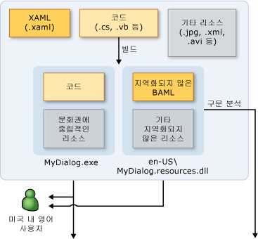
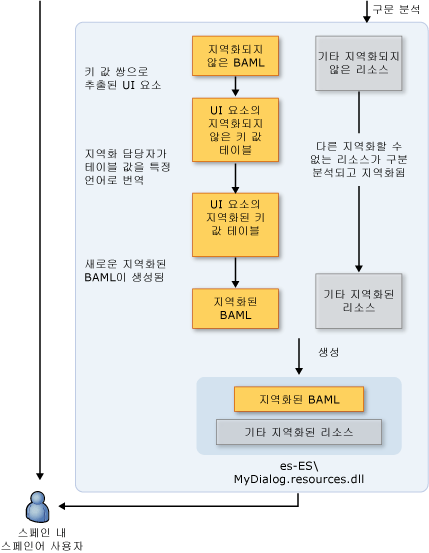

# WPF 전역화 및 지역화 개요
제품을 한 언어로만 제공하면 잠재적 고객 기반이 전 세계 65억 인구의 극히 일부로만 제한됩니다.  전 세계를 대상으로 하는 응용 프로그램을 만들려는 경우 가장 뛰어나고 경제적으로 고객에게 다가갈 수 있는 방법 중 하나는 바로 제품의 비용 효율적인 지역화입니다.  
  
 이 개요에서는 [!INCLUDE[TLA#tla_winclient](../../../../includes/tlasharptla-winclient-md.md)]에서의 전역화 및 지역화를 소개합니다.  전역화는 여러 위치에서 수행되는 응용 프로그램의 디자인 및 개발 작업입니다.  예를 들어 전역화는 여러 문화권의 사용자를 위해 지역화된 사용자 인터페이스와 국가별 데이터를 지원합니다.  [!INCLUDE[TLA2#tla_winclient](../../../../includes/tla2sharptla-winclient-md.md)]에서는 자동 레이아웃, 위성 어셈블리 및 지역화된 특성과 주석을 비롯한 여러 가지 전역화된 디자인 기능을 제공합니다.  
  
 지역화는 응용 프로그램 리소스를 응용 프로그램에서 지원할 각 문화권에 맞는 지역화된 버전으로 번역하는 작업입니다.  [!INCLUDE[TLA2#tla_winclient](../../../../includes/tla2sharptla-winclient-md.md)]에서 지역화를 수행할 때는 <xref:System.Windows.Markup.Localizer> 네임스페이스의 API를 사용합니다. 이러한 API는 [LocBaml Tool 샘플](http://go.microsoft.com/fwlink/?LinkID=160016) 명령줄 도구의 기반이 됩니다.  LocBaml을 빌드하고 사용하는 방법에 대한 자세한 내용은 [응용 프로그램 지역화](../../../../docs/framework/wpf/advanced/how-to-localize-an-application.md)를 참조하십시오.  
  
   
  
## WPF를 위한 최선의 전역화 및 지역화 방법  
 이 단원에서 제공하는 UI 디자인 및 지역화 관련 팁을 참조하면 [!INCLUDE[TLA2#tla_winclient](../../../../includes/tla2sharptla-winclient-md.md)]에서 기본적으로 제공하는 전역화와 지역화 기능을 최대한 활용할 수 있습니다.  
  
### 최선의 WPF UI 디자인 방법  
 [!INCLUDE[TLA2#tla_winclient](../../../../includes/tla2sharptla-winclient-md.md)] 기반 [!INCLUDE[TLA2#tla_ui](../../../../includes/tla2sharptla-ui-md.md)]를 디자인할 때는 다음과 같은 최선의 방법을 구현하는 것을 고려해 보십시오.  
  
-   [!INCLUDE[TLA2#tla_ui](../../../../includes/tla2sharptla-ui-md.md)]를 [!INCLUDE[TLA2#tla_xaml](../../../../includes/tla2sharptla-xaml-md.md)]로 작성합니다. 코드로 [!INCLUDE[TLA2#tla_ui](../../../../includes/tla2sharptla-ui-md.md)]를 작성하는 방식은 피하십시오.  [!INCLUDE[TLA2#tla_xaml](../../../../includes/tla2sharptla-xaml-md.md)]을 사용하여 [!INCLUDE[TLA2#tla_ui](../../../../includes/tla2sharptla-ui-md.md)]를 만들면 기본 제공되는 지역화 API를 통해 노출됩니다.  
  
-   콘텐츠의 레이아웃을 지정할 때 절대적 위치와 고정 크기를 사용하는 것을 지양하고 대신 상대적 크기나 자동 크기 조정을 사용합니다.  
  
    -   <xref:System.Windows.Window.SizeToContent%2A>를 사용하고 너비와 높이는 `Auto`로 설정합니다.  
  
    -   [!INCLUDE[TLA2#tla_ui](../../../../includes/tla2sharptla-ui-md.md)]의 레이아웃을 설정할 때 <xref:System.Windows.Controls.Canvas>를 사용하는 것을 지양합니다.  
  
    -   <xref:System.Windows.Controls.Grid>와 해당 크기 공유 기능을 사용합니다.  
  
-   지역화된 텍스트는 공간을 더 많이 필요로 하는 경우가 많으므로 여분의 공간을 여백으로 남겨 둡니다.  여분의 공간을 통해 여분의 문자를 표현할 수 있습니다.  
  
-   클리핑을 피하기 위해 <xref:System.Windows.Controls.TextBlock>에서 <xref:System.Windows.Controls.TextBlock.TextWrapping%2A>을 사용합니다.  
  
-   **xml:lang** 특성을 설정합니다.  이 특성은 특정 요소 및 해당 자식 요소의 문화권을 설명합니다.  이 속성의 값은 [!INCLUDE[TLA2#tla_winclient](../../../../includes/tla2sharptla-winclient-md.md)]에서 몇 가지 기능의 동작을 변경합니다. 예를 들어 하이픈 넣기, 맞춤법 검사, 숫자 대체, 복잡한 스크립트 셰이핑 및 글꼴 대체의 동작을 변경합니다.  [XAML의 xml:lang 처리](../../../../docs/framework/xaml-services/xml-lang-handling-in-xaml.md) 설정에 대한 자세한 내용은 [WPF의 전역화](../../../../docs/framework/wpf/advanced/globalization-for-wpf.md)를 참조하십시오.  
  
-   여러 언어에 사용되는 글꼴을 더욱 효과적으로 제어할 수 있도록 사용자 지정된 합성 글꼴을 만듭니다.  기본적으로 [!INCLUDE[TLA2#tla_winclient](../../../../includes/tla2sharptla-winclient-md.md)]에서는 Windows\\Fonts 디렉터리에서 GlobalUserInterface.composite 글꼴을 사용합니다.  
  
-   텍스트를 오른쪽에서 왼쪽으로 표시하는 문화권에서 지역화될 수 있는 탐색 응용 프로그램을 만들 때는 모든 페이지의 <xref:System.Windows.FlowDirection>을 명시적으로 설정하여 <xref:System.Windows.Navigation.NavigationWindow>에서 <xref:System.Windows.FlowDirection>을 상속하지 않도록 합니다.  
  
-   브라우저 외부에서 호스팅되는 독립 실행형 탐색 응용 프로그램을 만들 때는 초기 응용 프로그램의 <xref:System.Windows.Application.StartupUri%2A>를 페이지\(예: `<Application StartupUri="NavigationWindow.xaml">`\) 대신 <xref:System.Windows.Navigation.NavigationWindow>로 설정합니다.  이렇게 디자인하면 Windows 및 탐색 모음의 <xref:System.Windows.FlowDirection>을 변경할 수 있습니다.  자세한 내용과 예제를 보려면 [Globalization Homepage 샘플](http://go.microsoft.com/fwlink/?LinkID=159990)을 참조하십시오.  
  
### 최선의 WPF 지역화 방법  
 [!INCLUDE[TLA2#tla_winclient](../../../../includes/tla2sharptla-winclient-md.md)] 기반 응용 프로그램을 지역화할 때는 다음과 같은 최선의 방법을 구현하는 것을 고려해 보십시오.  
  
-   지역화 주석을 사용하여 지역화 담당자에게 컨텍스트를 추가로 제공합니다.  
  
-   요소에서 <xref:System.Windows.Markup.Localizer.BamlLocalizableResourceKey.Uid%2A> 속성을 선택적으로 생략하는 대신 지역화 속성을 사용하여 지역화를 제어합니다.  자세한 내용은 [지역화 특성 및 주석](../../../../docs/framework/wpf/advanced/localization-attributes-and-comments.md)을 참조하십시오.  
  
-   **msbuild \/t:updateuid** 및 **\/t:checkuid**를 사용하여 [!INCLUDE[TLA2#tla_xaml](../../../../includes/tla2sharptla-xaml-md.md)]에서 <xref:System.Windows.Markup.Localizer.BamlLocalizableResourceKey.Uid%2A> 속성을 추가하고 검사합니다.  <xref:System.Windows.Markup.Localizer.BamlLocalizableResourceKey.Uid%2A> 속성을 사용하여 개발된 프로그램과 지역화한 프로그램 간의 변경 사항을 추적합니다. <xref:System.Windows.Markup.Localizer.BamlLocalizableResourceKey.Uid%2A> 속성을 사용하면 개발된 프로그램의 새로운 변경 사항을 지역화하는 데 도움이 됩니다.  [!INCLUDE[TLA2#tla_ui](../../../../includes/tla2sharptla-ui-md.md)]에 <xref:System.Windows.Markup.Localizer.BamlLocalizableResourceKey.Uid%2A> 속성을 수동으로 추가하는 작업은 지루할 뿐만 아니라 정확도도 떨어집니다.  
  
    -   지역화를 시작한 뒤에는 <xref:System.Windows.Markup.Localizer.BamlLocalizableResourceKey.Uid%2A> 속성을 편집하거나 변경하지 마십시오.  
  
    -   <xref:System.Windows.Markup.Localizer.BamlLocalizableResourceKey.Uid%2A> 속성을 중복해서 사용하지 마십시오. 특히 복사 및 붙여넣기 명령을 사용할 때 이 팁을 기억하십시오.  
  
    -   AssemblyInfo.\*에서 `UltimateResourceFallback` 위치를 설정하여 대체에 사용할 적절한 언어를 지정합니다\(예: `[assembly: NeutralResourcesLanguage("en-US",   UltimateResourceFallbackLocation.Satellite)]`\).  
  
         프로젝트 파일에서 `<UICulture>` 태그를 생략하여 주 어셈블리에 소스 언어를 포함하려는 경우 `UltimateResourceFallback` 위치를 위성이 아닌 주 어셈블리로 설정합니다\(예: `[assembly: NeutralResourcesLanguage("en-US", UltimateResourceFallbackLocation.MainAssembly)]`\).  
  
   
## WPF 응용 프로그램 지역화  
 [!INCLUDE[TLA2#tla_winclient](../../../../includes/tla2sharptla-winclient-md.md)] 응용 프로그램을 지역화할 때 사용할 수 있는 몇 가지 옵션이 있습니다.  예를 들어 응용 프로그램의 지역화 가능 리소스를 [!INCLUDE[TLA2#tla_xml](../../../../includes/tla2sharptla-xml-md.md)] 파일에 바인딩하거나, 지역화 가능 텍스트를 resx 테이블에 저장하거나, 지역화 담당자가 [!INCLUDE[TLA#tla_xaml](../../../../includes/tlasharptla-xaml-md.md)] 파일을 사용하도록 할 수 있습니다.  이 단원에서는 BAML 형태의 XAML을 사용하는 지역화 워크플로를 설명합니다. 이 방식에는 다음과 같은 이점이 있습니다.  
  
-   빌드한 후에 지역화할 수 있습니다.  
  
-   이전 버전의 BAML 형태의 XAML을 지역화된 새 버전의 BAML 형태의 XAML로 업데이트할 수 있으므로 개발과 동시에 지역화를 수행할 수 있습니다.  
  
-   BAML 형태의 XAML은 [!INCLUDE[TLA2#tla_xaml](../../../../includes/tla2sharptla-xaml-md.md)]의 컴파일된 형식이기 때문에 원본 소스 요소와 의미 체계의 유효성을 컴파일 타임에 검사할 수 있습니다.  
  
### 지역화 빌드 프로세스  
 [!INCLUDE[TLA2#tla_winclient](../../../../includes/tla2sharptla-winclient-md.md)] 응용 프로그램을 개발할 때 지역화를 위한 빌드 프로세스는 다음과 같습니다.  
  
-   개발자가 [!INCLUDE[TLA2#tla_winclient](../../../../includes/tla2sharptla-winclient-md.md)] 응용 프로그램을 만들고 전역화합니다.  프로젝트 파일에서 개발자는 응용 프로그램 컴파일 시 언어 중립적 주 어셈블리가 생성되도록 `<UICulture>en-US</UICulture>`를 설정합니다. 이 어셈블리에는 지역화 가능한 모든 리소스가 포함된 위성 .resources.dll 파일이 있습니다. 지역화 [!INCLUDE[TLA2#tla_api#plural](../../../../includes/tla2sharptla-apisharpplural-md.md)]에서는 주 어셈블리에서의 추출을 지원하므로 필요하다면 주 어셈블리에서 소스 언어를 유지할 수 있습니다.  
  
-   파일이 빌드로 컴파일될 때 [!INCLUDE[TLA2#tla_xaml](../../../../includes/tla2sharptla-xaml-md.md)]이 BAML 형태의 XAML로 변환됩니다.  문화권에 중립적인 `MyDialog.exe`와 문화권에 종속적인\(영어\) `MyDialog.resources.dll` 파일이 영어권 고객에게 릴리스됩니다.  
  
### 지역화 워크플로  
 지역화 프로세스는 지역화되지 않은 `MyDialog.resources.dll` 파일이 빌드된 뒤에 시작됩니다.  BAML 형태의 XAML에서 [!INCLUDE[TLA2#tla_api#plural](../../../../includes/tla2sharptla-apisharpplural-md.md)]를 통해 원래 [!INCLUDE[TLA2#tla_xaml](../../../../includes/tla2sharptla-xaml-md.md)]의 [!INCLUDE[TLA2#tla_ui](../../../../includes/tla2sharptla-ui-md.md)] 요소 및 속성을 <xref:System.Windows.Markup.Localizer>에서 키\/값 쌍으로 추출합니다.  지역화 담당자는 키\/값 쌍을 사용하여 응용 프로그램을 지역화합니다.  지역화가 완료된 후 새 값에서 새 .resource.dll을 생성할 수 있습니다.  
  
 키\-값 쌍의 키는 개발자가 원본 [!INCLUDE[TLA2#tla_xaml](../../../../includes/tla2sharptla-xaml-md.md)]에 추가하는 `x:Uid` 값입니다.  이러한 `x:Uid` 값을 사용하면 [!INCLUDE[TLA2#tla_api](../../../../includes/tla2sharptla-api-md.md)]에서 지역화 도중 개발자와 지역화 담당자 간에 발생하는 변경 내용을 추적하고 병합할 수 있습니다.  예를 들어 지역화 담당자가 지역화를 시작한 후 개발자가 [!INCLUDE[TLA2#tla_ui](../../../../includes/tla2sharptla-ui-md.md)]를 변경한 경우 손실되는 번역 작업을 최소화하기 위해 개발 변경 사항을 이미 완료된 지역화 작업과 병합할 수 있습니다.  
  
 다음 그래픽은 BAML 형태의 XAML을 기반으로 하는 일반적인 지역화 워크플로를 보여 줍니다.  이 다이어그램에서는 개발자가 응용 프로그램을 영어로 작성하는 것으로 간주합니다.  개발자가 WPF 응용 프로그램을 만들고 전역화합니다.  프로젝트 파일에서 개발자는 `<UICulture>en-US</UICulture>`를 설정하여, 빌드 시 언어 중립적인 주 어셈블리가 모든 지역화 가능 리소스가 포함된 위성 .resources.dll로 생성되도록 합니다.  또는 WPF 지역화 API가 주 어셈블리에서의 추출을 지원하므로 주 어셈블리에서 소스 언어를 유지할 수 있습니다.  빌드 프로세스 후 XAML이 BAML로 컴파일됩니다.  문화권에 중립적인 MyDialog.exe.resources.dll이 영어권 고객에게 제공됩니다.  
  
   
  
   
  
   
## WPF 지역화 예제  
 이 단원에서는 [!INCLUDE[TLA2#tla_winclient](../../../../includes/tla2sharptla-winclient-md.md)] 응용 프로그램을 빌드하고 지역화하는 방법을 이해하는 데 도움이 되도록 지역화된 응용 프로그램의 예제를 소개합니다.  
  
#### 실행 대화 상자 예제  
 다음 그래픽에서는 **실행** 대화 상자 샘플의 출력을 보여 줍니다.  
  
 **영어:**  
  
   
  
 **독일어:**  
  
   
  
 **전역 실행 대화 상자 디자인**  
  
 이 예제에서는 [!INCLUDE[TLA2#tla_winclient](../../../../includes/tla2sharptla-winclient-md.md)] 및 [!INCLUDE[TLA2#tla_xaml](../../../../includes/tla2sharptla-xaml-md.md)]을 사용하여 **실행** 대화 상자를 만듭니다.  이 대화 상자는 [!INCLUDE[TLA#tla_win](../../../../includes/tlasharptla-win-md.md)] 시작 메뉴에서 사용할 수 있는 **실행** 대화 상자와 같습니다.  
  
 전역 대화 상자를 만들 때 주의해야 할 점은 다음과 같습니다.  
  
 **Automatic Layout**  
  
 *Window1.xaml:*  
  
 `<Window SizeToContent="WidthAndHeight">`  
  
 이전 Window 속성이 창의 크기를 콘텐츠 크기에 맞게 자동으로 조정합니다.  이 속성은 지역화한 후 크기가 증가한 콘텐츠가 창에서 잘리는 것을 방지하며, 지역화한 후 콘텐츠 크기가 줄어들 때 생기는 불필요한 공간도 제거합니다.  
  
 `<Grid x:Uid="Grid_1">`  
  
 [!INCLUDE[TLA2#tla_winclient](../../../../includes/tla2sharptla-winclient-md.md)] 지역화 [!INCLUDE[TLA2#tla_api#plural](../../../../includes/tla2sharptla-apisharpplural-md.md)]가 올바르게 작동하려면 <xref:System.Windows.Markup.Localizer.BamlLocalizableResourceKey.Uid%2A> 속성이 필요합니다.  
  
 [!INCLUDE[TLA2#tla_winclient](../../../../includes/tla2sharptla-winclient-md.md)] 지역화 [!INCLUDE[TLA2#tla_api#plural](../../../../includes/tla2sharptla-apisharpplural-md.md)]에서는 이러한 속성을 사용하여 [!INCLUDE[TLA#tla_ui](../../../../includes/tlasharptla-ui-md.md)] 개발 및 지역화 간의 변경 내용을 추적합니다.  <xref:System.Windows.Markup.Localizer.BamlLocalizableResourceKey.Uid%2A> 속성을 사용하면 [!INCLUDE[TLA2#tla_ui](../../../../includes/tla2sharptla-ui-md.md)]의 최신 버전을 [!INCLUDE[TLA2#tla_ui](../../../../includes/tla2sharptla-ui-md.md)]의 이전 지역화와 병합할 수 있습니다.  명령 셸에서 **msbuild \/t:updateuid RunDialog.csproj**를 실행하여 <xref:System.Windows.Markup.Localizer.BamlLocalizableResourceKey.Uid%2A> 속성을 추가합니다.  <xref:System.Windows.Markup.Localizer.BamlLocalizableResourceKey.Uid%2A> 속성을 수동으로 추가하면 시간이 많이 걸리고 정확성도 떨어지므로 이 방법을 권장합니다.  **msbuild \/t:checkuid RunDialog.csproj**를 실행하여 <xref:System.Windows.Markup.Localizer.BamlLocalizableResourceKey.Uid%2A> 속성이 올바르게 설정되었는지 확인할 수 있습니다.  
  
 [!INCLUDE[TLA2#tla_ui](../../../../includes/tla2sharptla-ui-md.md)]는 [!INCLUDE[TLA2#tla_winclient](../../../../includes/tla2sharptla-winclient-md.md)]의 자동 레이아웃이 제공하는 이점을 활용하는 유용한 컨트롤인 <xref:System.Windows.Controls.Grid> 컨트롤을 사용하여 구성됩니다.  대화 상자는 세 개의 행과 다섯 개의 열로 나뉩니다.  고정된 크기가 있는 행과 열 정의는 없으므로 각 셀에 놓이는 [!INCLUDE[TLA2#tla_ui](../../../../includes/tla2sharptla-ui-md.md)] 요소는 지역화 과정에서 크기가 증가하거나 감소될 수 있습니다.  
  
 [!code-xml[GlobalizationRunDialog#GridColumnDef](../../../../samples/snippets/csharp/VS_Snippets_Wpf/GlobalizationRunDialog/CS/Window1.xaml#gridcolumndef)]  
  
 **Open:** 레이블과 <xref:System.Windows.Controls.ComboBox>가 놓이는 처음 두 열이 [!INCLUDE[TLA2#tla_ui](../../../../includes/tla2sharptla-ui-md.md)] 전체 너비의 10퍼센트를 사용합니다.  
  
 [!code-xml[GlobalizationRunDialog#GridColumnDef2](../../../../samples/snippets/csharp/VS_Snippets_Wpf/GlobalizationRunDialog/CS/Window1.xaml#gridcolumndef2)]  
  
 예제에서는 <xref:System.Windows.Controls.Grid>의 공유 크기 조정 기능을 사용합니다.  마지막 세 열은 동일한 <xref:System.Windows.Controls.DefinitionBase.SharedSizeGroup%2A>에 배치되어 이 기능을 활용합니다.  속성의 이름에서 알 수 있듯이 이 속성을 통해 열은 같은 크기를 공유할 수 있습니다.  따라서 “Browse…”를 더 긴 문자열인 “찾아보기…”로 지역화하면 “확인” 단추는 작고 “찾아보기…” 단추는 크게 표시되는 것이 아니라 모든 단추의 너비가 동일하게 커집니다.  
  
 **Xml:lang**  
  
 `Xml:lang="en-US"`  
  
 [!INCLUDE[TLA2#tla_ui](../../../../includes/tla2sharptla-ui-md.md)]의 루트 요소에 배치된 [XAML의 xml:lang 처리](../../../../docs/framework/xaml-services/xml-lang-handling-in-xaml.md)에 유의하십시오.  이 속성은 해당 요소 및 자식의 문화권을 설명합니다.  이 값은 [!INCLUDE[TLA2#tla_winclient](../../../../includes/tla2sharptla-winclient-md.md)]의 여러 기능에서 사용되며 지역화 과정에서 적절하게 변경해야 합니다.  이 값은 단어 하이픈 넣기와 맞춤법 검사에 사용할 언어 사전을 변경합니다.  또한 숫자의 표시 및 글꼴 대체 시스템에서 사용할 글꼴을 선택하는 방법에도 영향을 줍니다.  마지막으로, 속성은 숫자 표시 방식과 복잡한 스크립트에 포함된 텍스트의 모양이 지정되는 방식에 영향을 줍니다.  기본값은 "en\-US"입니다.  
  
 **Building a Satellite Resource Assembly**  
  
 *.csproj:*  
  
 `<UICulture>en-US</UICulture>`  
  
 `UICulture` 값이 추가된 것을 볼 수 있습니다.  이 속성을 en\-US와 같은 유효한 <xref:System.Globalization.CultureInfo> 값으로 설정하고 프로젝트를 빌드하면 지역화 가능한 리소스가 모두 들어 있는 위성 어셈블리가 생성됩니다.  
  
 `<Resource Include="RunIcon.JPG">`  
  
 `<Localizable>False</Localizable>`  
  
 `</Resource>`  
  
 `RunIcon.JPG`는 모든 문화권에서 동일하게 나타나야 하므로 지역화할 필요가 없습니다.  `Localizable`은 위성 어셈블리 대신 언어 중립적 주 어셈블리에 남아 있으므로 `false`로 설정됩니다.  컴파일할 수 없는 모든 리소스는 기본적으로 `Localizable`이 `true`로 설정됩니다.  
  
 **실행 대화 상자 지역화**  
  
 **Parse**  
  
 응용 프로그램을 빌드한 후 지역화의 첫 번째 단계는 위성 어셈블리에서 지역화할 수 있는 리소스를 구문 분석하는 것입니다.  이 항목의 목적에 따라 [LocBaml Tool 샘플](http://go.microsoft.com/fwlink/?LinkID=160016)에 있는 LocBaml 샘플 도구를 사용합니다.  LocBaml은 지역화 프로세스에 적합한 지역화 도구의 빌드에 도움을 주기 위한 샘플 도구입니다.  LocBaml로 **LocBaml \/parse RunDialog.resources.dll \/out:**을 실행하여 구문 분석하고 “RunDialog.resources.dll.CSV” 파일을 생성합니다.  
  
 **Localize**  
  
 유니코드를 지원하는 CSV 편집기 중 적절한 것을 사용하여 이 파일을 편집합니다.  지역화 범주가 “None”인 모든 항목을 필터링합니다.  다음과 같은 항목이 표시되어야 합니다.  
  
||||  
|-|-|-|  
|리소스 키|지역화 범주|값|  
|Button\_1:System.Windows.Controls.Button.$Content|Button|OK|  
|Button\_2:System.Windows.Controls.Button.$Content|Button|Cancel|  
|Button\_3:System.Windows.Controls.Button.$Content|Button|Browse...|  
|ComboBox\_1:System.Windows.Controls.ComboBox.$Content|ComboBox||  
|TextBlock\_1:System.Windows.Controls.TextBlock.$Content|Text|Type the name of a program, folder, document, or Internet resource, and Windows will open it for you.|  
|TextBlock\_2:System.Windows.Controls.TextBlock.$Content|Text|Open:|  
|Window\_1:System.Windows.Window.Title|제목|실행|  
  
 응용 프로그램을 독일어로 지역화하려면 다음과 같이 번역해야 합니다.  
  
||||  
|-|-|-|  
|리소스 키|지역화 범주|값|  
|Button\_1:System.Windows.Controls.Button.$Content|Button|OK|  
|Button\_2:System.Windows.Controls.Button.$Content|Button|Abbrechen|  
|Button\_3:System.Windows.Controls.Button.$Content|Button|Durchsuchen…|  
|ComboBox\_1:System.Windows.Controls.ComboBox.$Content|ComboBox||  
|TextBlock\_1:System.Windows.Controls.TextBlock.$Content|Text|Geben Sie den Namen eines Programms, Ordners, Dokuments oder einer Internetresource an.|  
|TextBlock\_2:System.Windows.Controls.TextBlock.$Content|Text|Öffnen:|  
|Window\_1:System.Windows.Window.Title|제목|실행|  
  
 **Generate**  
  
 지역화의 마지막 단계에서는 새로 지역화된 위성 어셈블리를 만듭니다.  이렇게 하려면 다음 LocBaml 명령을 사용합니다.  
  
 **LocBaml.exe \/generate RunDialog.resources.dll \/trans:RunDialog.resources.dll.CSV \/out: .  \/cul:de\-DE**  
  
 독일어 [!INCLUDE[TLA#tla_mswin](../../../../includes/tlasharptla-mswin-md.md)]에서 이 resources.dll이 주 어셈블리 옆의 ko\-KR 폴더에 있는 경우 en\-US 폴더의 리소스 대신 이 리소스가 자동으로 로드됩니다.  이를 테스트할 [!INCLUDE[TLA#tla_mswin](../../../../includes/tlasharptla-mswin-md.md)] 독일어 버전이 없는 경우에는 문화권을 현재 사용 중인 [!INCLUDE[TLA#tla_mswin](../../../../includes/tlasharptla-mswin-md.md)]의 문화권\(예:  en\-US\)으로 설정하고 원본 resources.dll을 바꾸십시오.  
  
 **Satellite Resource Loading**  
  
|MyDialog.exe|en\-US\\MyDialog.resources.dll|ko\-KR\\MyDialog.resources.dll|  
|------------------|------------------------------------|------------------------------------|  
|코드|원본 영어 BAML|지역화된 BAML|  
|문화권에 중립적인 리소스|영어로 된 기타 리소스|독일어로 지역화된 기타 리소스|  
  
 .NET Framework는 응용 프로그램의 `Thread.CurrentThread.CurrentUICulture`를 기반으로 로드할 위성 리소스 어셈블리를 자동으로 선택합니다.  현재 [!INCLUDE[TLA#tla_mswin](../../../../includes/tlasharptla-mswin-md.md)] OS의 문화권을 기본값으로 사용합니다.  따라서 독일어 [!INCLUDE[TLA#tla_mswin](../../../../includes/tlasharptla-mswin-md.md)]를 사용하는 경우에는 ko\-KR\\MyDialog.resources.dll이 로드되고 영어 [!INCLUDE[TLA#tla_mswin](../../../../includes/tlasharptla-mswin-md.md)]를 사용하는 경우에는 en\-US\\MyDialog.resources.dll이 로드됩니다.  프로젝트의 AssemblyInfo.\*에 NeutralResourcesLanguage를 지정하여 응용 프로그램에 대한 최종 대체 리소스를 설정할 수 있습니다.  예를 들면 다음과 같이 지정할 수 있습니다.  
  
 `[assembly: NeutralResourcesLanguage("en-US", UltimateResourceFallbackLocation.Satellite)]`  
  
 그러면 ko\-KR\\MyDialog.resources.dll 또는 ko\\MyDialog.resources.dll을 모두 사용할 수 없는 경우 en\-US\\MyDialog.resources.dll이 독일어 Windows에 사용됩니다.  
  
### Microsoft 사우디아라비아 홈 페이지  
 다음 그래픽에서는 영어 및 아랍어 홈 페이지를 보여 줍니다.  이러한 그래픽을 생성하는 전체 샘플을 보려면 [Globalization Homepage 샘플](http://go.microsoft.com/fwlink/?LinkID=159990)을 참조하십시오.  
  
 **영어:**  
  
   
  
 **아랍어:**  
  
   
  
### 글로벌 Microsoft 홈 페이지 디자인  
 이 Microsoft 사우디아라비아 웹 사이트 샘플에서는 RightToLeft 언어를 위해 제공되는 전역화 기능을 보여 줍니다.  히브리어 및 아랍어 같은 언어는 오른쪽에서 왼쪽으로 읽기 때문에 [!INCLUDE[TLA2#tla_ui](../../../../includes/tla2sharptla-ui-md.md)]의 레이아웃이 영어와 같이 왼쪽에서 오른쪽으로 읽는 언어와 달라야 할 경우가 많습니다.  왼쪽에서 오른쪽으로 읽는 언어를 오른쪽에서 왼쪽으로 읽는 언어로 또는 그 반대로 지역화하는 작업은 꽤 까다로울 수 있습니다.  [!INCLUDE[TLA2#tla_winclient](../../../../includes/tla2sharptla-winclient-md.md)]는 이러한 지역화를 훨씬 쉽게 수행할 수 있도록 디자인되었습니다.  
  
 **FlowDirection**  
  
 *Homepage.xaml:*  
  
 [!code-xml[GlobalizationHomepage#Homepage](../../../../samples/snippets/csharp/VS_Snippets_Wpf/GlobalizationHomepage/CS/Homepage.xaml#homepage)]  
  
 <xref:System.Windows.Controls.Page>의 <xref:System.Windows.FrameworkElement.FlowDirection%2A> 속성에 유의하십시오.  이 속성을 <xref:System.Windows.FlowDirection>로 변경하면 <xref:System.Windows.Controls.Page> 및 해당 자식 요소의 <xref:System.Windows.FrameworkElement.FlowDirection%2A>이 변경되어 이 [!INCLUDE[TLA2#tla_ui](../../../../includes/tla2sharptla-ui-md.md)]의 레이아웃이 아랍어 사용자에 필요한 것처럼 오른쪽에서 왼쪽이 되도록 대칭 이동됩니다.  모든 요소에 명시적으로 <xref:System.Windows.FrameworkElement.FlowDirection%2A>을 지정하여 상속 동작을 재정의할 수 있습니다.  <xref:System.Windows.FrameworkElement.FlowDirection%2A> 속성은 <xref:System.Windows.FrameworkElement> 또는 문서 관련 요소에서만 사용할 수 있으며 암시적 값 <xref:System.Windows.FlowDirection>를 사용합니다.  
  
 루트 <xref:System.Windows.FrameworkElement.FlowDirection%2A>을 변경하면 배경 그라데이션 브러시도 제대로 대칭 이동됩니다.  
  
 **FlowDirection\="LeftToRight"**  
  
   
  
 **FlowDirection\="RightToLeft"**  
  
   
  
 **패널 및 컨트롤에 고정 크기 사용 피하기**  
  
 Homepage.xaml을 살펴보면 맨 위 <xref:System.Windows.Controls.DockPanel>에서 전체 [!INCLUDE[TLA2#tla_ui](../../../../includes/tla2sharptla-ui-md.md)]에 대해 고정 너비와 높이가 지정된 것 이외에는 고정된 크기가 없음을 알 수 있습니다.  지역화된 텍스트가 소스 텍스트보다 길어서 잘리는 것을 방지하기 위해 고정된 크기를 사용하지 않도록 하십시오.  [!INCLUDE[TLA2#tla_winclient](../../../../includes/tla2sharptla-winclient-md.md)] 패널 및 컨트롤은 포함된 콘텐츠에 따라 자동으로 크기가 조정됩니다.  대부분의 컨트롤에는 최소 및 최대 크기가 있어 더 세밀한 제어를 위해 값을 설정할 수 있습니다\(예:  MinWidth\= "20"\).  <xref:System.Windows.Controls.Grid>를 사용하면 ‘\*’를 사용하여 상대적 너비와 높이를 설정하거나\(예:  Width\= “0.25\*”\) 셀 크기 공유 기능을 사용할 수도 있습니다.  
  
 **지역화 주석**  
  
 콘텐츠가 모호하여 번역하기 어려운 경우도 많이 있습니다.  개발자나 디자이너는 지역화 주석을 통해 지역화 담당자에게 추가적인 컨텍스트 및 주석을 제공할 수 있습니다.  예를 들어 아래의 Localization.Comments에서는 문자 ‘&#124;’의 사용을 명확하게 설명합니다.  
  
 [!code-xml[GlobalizationHomepage#LocalizationComment](../../../../samples/snippets/csharp/VS_Snippets_Wpf/GlobalizationHomepage/CS/Homepage.xaml#localizationcomment)]  
  
 이 주석은 TextBlock\_1의 콘텐츠와 연결되며 LocBaml 도구의 경우\([응용 프로그램 지역화](../../../../docs/framework/wpf/advanced/how-to-localize-an-application.md) 참조\) 출력 .csv 파일에서 TextBlock\_1 행의 여섯 번째 열에서 볼 수 있습니다.  
  
|||||||  
|-|-|-|-|-|-|  
|리소스 키|범주|가독성|수정 가능성|주석|값|  
|TextBlock\_1:System.Windows.Controls.TextBlock.$Content|Text|TRUE|TRUE|This character is used as a decorative rule.|&#124;|  
  
 다음 구문을 사용하여 주석을 요소의 속성 또는 콘텐츠에 배치할 수 있습니다.  
  
 [!code-xml[GlobalizationHomepage#LocalizationCommentsProp](../../../../samples/snippets/csharp/VS_Snippets_Wpf/GlobalizationHomepage/CS/Homepage.xaml#localizationcommentsprop)]  
  
 **지역화 특성**  
  
 개발자 또는 지역화 관리자는 지역화 담당자가 읽고 수정할 수 있는 컨트롤을 필요로 할 수 있습니다.  예를 들어 회사 이름이나 법적 고지문은 번역하지 않아야 할 수 있습니다.  [!INCLUDE[TLA2#tla_winclient](../../../../includes/tla2sharptla-winclient-md.md)]에서는 지역화 도구가 요소를 잠그거나, 숨기거나, 정렬할 때 사용할 수 있는 요소의 콘텐츠나 속성의 가독성, 수정 가능 여부 및 범주를 설정할 수 있는 특성을 제공합니다.  자세한 내용은 <xref:System.Windows.Localization.Attributes%2A>를 참조하십시오.  이 샘플의 목적상 LocBaml 도구는 이러한 특성의 값만 출력합니다.  [!INCLUDE[TLA2#tla_winclient](../../../../includes/tla2sharptla-winclient-md.md)] 컨트롤은 모두 이러한 특성에 대해 기본값을 사용하지만 이를 재정의할 수 있습니다.  예를 들어, 다음 예제에서는 `TextBlock_1`의 기본 지역화 특성을 재정의하여 지역화 담당자가 콘텐츠를 읽을 수는 있지만 수정할 수 없도록 설정합니다.  
  
 [!code-xml[LocalizationComAtt#LocalizationAttributes](../../../../samples/snippets/csharp/VS_Snippets_Wpf/LocalizationComAtt/CSharp/Attributes.xaml#localizationattributes)]  
  
 가독성 및 수정 가능 여부 특성 외에도 [!INCLUDE[TLA2#tla_winclient](../../../../includes/tla2sharptla-winclient-md.md)]에서는 지역화 담당자에게 더 많은 컨텍스트를 제공하기 위해 사용할 수 있는 일반적인 UI 범주\(<xref:System.Windows.LocalizationCategory>\)의 열거형을 제공합니다.  플랫폼 컨트롤에 대한 [!INCLUDE[TLA2#tla_winclient](../../../../includes/tla2sharptla-winclient-md.md)] 기본 범주도 [!INCLUDE[TLA2#tla_xaml](../../../../includes/tla2sharptla-xaml-md.md)]에서 재정의할 수 있습니다.  
  
 [!code-xml[LocalizationComAtt#LocalizationAttributesOverridden](../../../../samples/snippets/csharp/VS_Snippets_Wpf/LocalizationComAtt/CSharp/Attributes.xaml#localizationattributesoverridden)]  
  
 [!INCLUDE[TLA2#tla_winclient](../../../../includes/tla2sharptla-winclient-md.md)]에서 제공하는 기본 지역화 특성은 코드를 통해서도 재정의할 수 있으므로 사용자 지정 컨트롤에 대한 기본값을 올바르게 설정할 수 있습니다.  예를 들면 다음과 같습니다.  
  
 `[Localizability(Readability = Readability.Readable, Modifiability=Modifiability.Unmodifiable, LocalizationCategory.None)]`  
  
 `public class CorporateLogo: TextBlock`  
  
 `{`  
  
 `…`  
  
 `..`  
  
 `.`  
  
 `}`  
  
 [!INCLUDE[TLA2#tla_xaml](../../../../includes/tla2sharptla-xaml-md.md)]에서 설정된 인스턴스별 특성은 사용자 지정 컨트롤의 코드에 설정된 값보다 우선 순위가 높습니다.  특성 및 주석에 대한 자세한 내용은 [지역화 특성 및 주석](../../../../docs/framework/wpf/advanced/localization-attributes-and-comments.md)을 참조하십시오.  
  
 **글꼴 대체 및 복합 글꼴**  
  
 해당 코드 포인트 범위를 지원하지 않는 글꼴을 지정하면 [!INCLUDE[TLA2#tla_winclient](../../../../includes/tla2sharptla-winclient-md.md)]에서는 자동으로 Windows\\Fonts 디렉터리에 있는 Global User Interface.compositefont를 사용하여 지원하는 글꼴로 대체합니다.  복합 글꼴은 다른 글꼴처럼 동작하며 요소의 FontFamily를 설정하여 명시적으로 사용할 수 있습니다\(예:  FontFamily\= "Global User Interface"\).  복합 글꼴을 직접 만들고 특정 코드 포인트 범위와 언어에 사용할 글꼴을 지정하여 글꼴 대체 기본 설정을 직접 지정할 수 있습니다.  
  
 복합 글꼴에 대한 자세한 내용은 <xref:System.Windows.Media.FontFamily>를 참조하십시오.  
  
 **Microsoft 홈 페이지 지역화**  
  
 실행 대화 상자와 동일한 단계를 사용하여 이 응용 프로그램을 지역화할 수 있습니다.  아랍어로 지역화된 .csv 파일이 [Globalization Homepage 샘플](http://go.microsoft.com/fwlink/?LinkID=159990)에서 제공됩니다.