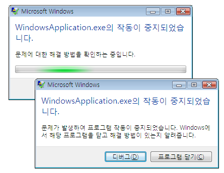
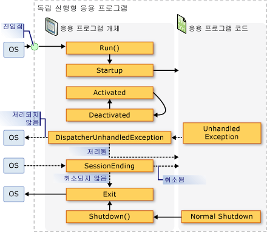
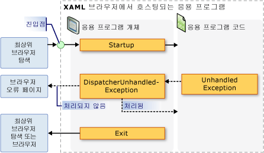

# <a name="application-management-overview"></a><span data-ttu-id="d7794-102">응용 프로그램 관리 개요</span><span class="sxs-lookup"><span data-stu-id="d7794-102">Application Management Overview</span></span>
<span data-ttu-id="d7794-103">모든 응용 프로그램은 응용 프로그램 구현 및 관리에 적용하는 일반적인 기능 집합을 공유하는 경향이 있습니다.</span><span class="sxs-lookup"><span data-stu-id="d7794-103">All applications tend to share a common set of functionality that applies to application implementation and management.</span></span> <span data-ttu-id="d7794-104">이 항목에서는에서 기능의 개요는 <xref:System.Windows.Application> 만들고 응용 프로그램을 관리 하기 위한 클래스입니다.</span><span class="sxs-lookup"><span data-stu-id="d7794-104">This topic provides an overview of the functionality in the <xref:System.Windows.Application> class for creating and managing applications.</span></span>  
   
  
## <a name="the-application-class"></a><span data-ttu-id="d7794-105">Application 클래스</span><span class="sxs-lookup"><span data-stu-id="d7794-105">The Application Class</span></span>  
 <span data-ttu-id="d7794-106">[!INCLUDE[TLA2#tla_wpf](../../../../includes/tla2sharptla-wpf-md.md)], 일반적인 응용 프로그램 범위의 기능에 캡슐화 되어는 <xref:System.Windows.Application> 클래스입니다.</span><span class="sxs-lookup"><span data-stu-id="d7794-106">In [!INCLUDE[TLA2#tla_wpf](../../../../includes/tla2sharptla-wpf-md.md)], common application-scoped functionality is encapsulated in the <xref:System.Windows.Application> class.</span></span> <span data-ttu-id="d7794-107"><xref:System.Windows.Application> 클래스에는 다음과 같은 기능이 포함 됩니다.</span><span class="sxs-lookup"><span data-stu-id="d7794-107">The <xref:System.Windows.Application> class includes the following functionality:</span></span>  
  
-   <span data-ttu-id="d7794-108">응용 프로그램 수명 추적 및 상호 작용</span><span class="sxs-lookup"><span data-stu-id="d7794-108">Tracking and interacting with application lifetime.</span></span>  
  
-   <span data-ttu-id="d7794-109">명령줄 매개 변수 검색 및 처리</span><span class="sxs-lookup"><span data-stu-id="d7794-109">Retrieving and processing command-line parameters.</span></span>  
  
-   <span data-ttu-id="d7794-110">처리되지 않은 예외의 검색 및 응답</span><span class="sxs-lookup"><span data-stu-id="d7794-110">Detecting and responding to unhandled exceptions.</span></span>  
  
-   <span data-ttu-id="d7794-111">응용 프로그램 범위 속성 및 리소스 공유</span><span class="sxs-lookup"><span data-stu-id="d7794-111">Sharing application-scope properties and resources.</span></span>  
  
-   <span data-ttu-id="d7794-112">독립 실행형 응용 프로그램에서 창 관리</span><span class="sxs-lookup"><span data-stu-id="d7794-112">Managing windows in standalone applications.</span></span>  
  
-   <span data-ttu-id="d7794-113">탐색 추적 및 관리</span><span class="sxs-lookup"><span data-stu-id="d7794-113">Tracking and managing navigation.</span></span>  
  
<a name="The_Application_Class"></a>   
## <a name="how-to-perform-common-tasks-using-the-application-class"></a><span data-ttu-id="d7794-114">Application 클래스를 사용하여 일반적인 작업을 수행하는 방법</span><span class="sxs-lookup"><span data-stu-id="d7794-114">How to Perform Common Tasks Using the Application Class</span></span>  
 <span data-ttu-id="d7794-115">모든의 세부 정보에 관심이 없는 경우는 <xref:System.Windows.Application> 클래스, 다음 표에서 몇 가지 일반적인 작업에 대 한 <xref:System.Windows.Application> 방법과 이러한 작업을 수행 합니다.</span><span class="sxs-lookup"><span data-stu-id="d7794-115">If you are not interested in all of the details of the <xref:System.Windows.Application> class, the following table lists some of the common tasks for <xref:System.Windows.Application> and how to accomplish them.</span></span> <span data-ttu-id="d7794-116">관련 API 및 항목을 확인하여 추가 정보 및 샘플 코드를 찾을 수 있습니다.</span><span class="sxs-lookup"><span data-stu-id="d7794-116">By viewing the related API and topics, you can find more information and sample code.</span></span>  
  
|<span data-ttu-id="d7794-117">작업</span><span class="sxs-lookup"><span data-stu-id="d7794-117">Task</span></span>|<span data-ttu-id="d7794-118">방식</span><span class="sxs-lookup"><span data-stu-id="d7794-118">Approach</span></span>|  
|----------|--------------|  
|<span data-ttu-id="d7794-119">현재 응용 프로그램을 나타내는 개체 가져오기</span><span class="sxs-lookup"><span data-stu-id="d7794-119">Get an object that represents the current application</span></span>|<span data-ttu-id="d7794-120"><xref:System.Windows.Application.Current%2A?displayProperty=nameWithType> 속성을 사용합니다.</span><span class="sxs-lookup"><span data-stu-id="d7794-120">Use the <xref:System.Windows.Application.Current%2A?displayProperty=nameWithType> property.</span></span>|  
|<span data-ttu-id="d7794-121">응용 프로그램에 시작 화면 추가</span><span class="sxs-lookup"><span data-stu-id="d7794-121">Add a startup screen to an application</span></span>|<span data-ttu-id="d7794-122">참조 [WPF 응용 프로그램 시작 화면 추가](../../../../docs/framework/wpf/app-development/how-to-add-a-splash-screen-to-a-wpf-application.md)합니다.</span><span class="sxs-lookup"><span data-stu-id="d7794-122">See [Add a Splash Screen to a WPF Application](../../../../docs/framework/wpf/app-development/how-to-add-a-splash-screen-to-a-wpf-application.md).</span></span>|  
|<span data-ttu-id="d7794-123">응용 프로그램 시작</span><span class="sxs-lookup"><span data-stu-id="d7794-123">Start an application</span></span>|<span data-ttu-id="d7794-124"><xref:System.Windows.Application.Run%2A?displayProperty=nameWithType> 메서드를 사용하세요.</span><span class="sxs-lookup"><span data-stu-id="d7794-124">Use the <xref:System.Windows.Application.Run%2A?displayProperty=nameWithType> method.</span></span>|  
|<span data-ttu-id="d7794-125">응용 프로그램 중지</span><span class="sxs-lookup"><span data-stu-id="d7794-125">Stop an application</span></span>|<span data-ttu-id="d7794-126">사용 하 여는 <xref:System.Windows.Application.Shutdown%2A> 의 메서드는 <xref:System.Windows.Application.Current%2A?displayProperty=nameWithType> 개체입니다.</span><span class="sxs-lookup"><span data-stu-id="d7794-126">Use the <xref:System.Windows.Application.Shutdown%2A> method of the <xref:System.Windows.Application.Current%2A?displayProperty=nameWithType> object.</span></span>|  
|<span data-ttu-id="d7794-127">명령줄에서 인수 가져오기</span><span class="sxs-lookup"><span data-stu-id="d7794-127">Get arguments from the command line</span></span>|<span data-ttu-id="d7794-128">처리는 <xref:System.Windows.Application.Startup?displayProperty=nameWithType> 이벤트 및 사용 된 <xref:System.Windows.StartupEventArgs.Args%2A?displayProperty=nameWithType> 속성입니다.</span><span class="sxs-lookup"><span data-stu-id="d7794-128">Handle the <xref:System.Windows.Application.Startup?displayProperty=nameWithType> event and use the <xref:System.Windows.StartupEventArgs.Args%2A?displayProperty=nameWithType> property.</span></span> <span data-ttu-id="d7794-129">예를 들어 참조는 <xref:System.Windows.Application.Startup?displayProperty=nameWithType> 이벤트입니다.</span><span class="sxs-lookup"><span data-stu-id="d7794-129">For an example, see the <xref:System.Windows.Application.Startup?displayProperty=nameWithType> event.</span></span>|  
|<span data-ttu-id="d7794-130">응용 프로그램 종료 코드 가져오기 및 설정</span><span class="sxs-lookup"><span data-stu-id="d7794-130">Get and set the application exit code</span></span>|<span data-ttu-id="d7794-131">설정의 <xref:System.Windows.ExitEventArgs.ApplicationExitCode%2A?displayProperty=nameWithType> 속성에는 <xref:System.Windows.Application.Exit?displayProperty=nameWithType> 호출 또는 이벤트 처리기는 <xref:System.Windows.Application.Shutdown%2A> 메서드와 정수를 전달 합니다.</span><span class="sxs-lookup"><span data-stu-id="d7794-131">Set the <xref:System.Windows.ExitEventArgs.ApplicationExitCode%2A?displayProperty=nameWithType> property in the <xref:System.Windows.Application.Exit?displayProperty=nameWithType> event handler or call the <xref:System.Windows.Application.Shutdown%2A> method and pass in an integer.</span></span>|  
|<span data-ttu-id="d7794-132">처리되지 않은 예외의 검색 및 응답</span><span class="sxs-lookup"><span data-stu-id="d7794-132">Detect and respond to unhandled exceptions</span></span>|<span data-ttu-id="d7794-133">처리는 <xref:System.Windows.Application.DispatcherUnhandledException> 이벤트입니다.</span><span class="sxs-lookup"><span data-stu-id="d7794-133">Handle the <xref:System.Windows.Application.DispatcherUnhandledException> event.</span></span>|  
|<span data-ttu-id="d7794-134">응용 프로그램 범위 리소스 가져오기 및 설정</span><span class="sxs-lookup"><span data-stu-id="d7794-134">Get and set application-scoped resources</span></span>|<span data-ttu-id="d7794-135"><xref:System.Windows.Application.Resources%2A?displayProperty=nameWithType> 속성을 사용합니다.</span><span class="sxs-lookup"><span data-stu-id="d7794-135">Use the <xref:System.Windows.Application.Resources%2A?displayProperty=nameWithType> property.</span></span>|  
|<span data-ttu-id="d7794-136">응용 프로그램 범위 리소스 사전 사용</span><span class="sxs-lookup"><span data-stu-id="d7794-136">Use an application-scope resource dictionary</span></span>|<span data-ttu-id="d7794-137">참조 [응용 프로그램 범위 리소스 사전을 사용 하 여](../../../../docs/framework/wpf/app-development/how-to-use-an-application-scope-resource-dictionary.md)합니다.</span><span class="sxs-lookup"><span data-stu-id="d7794-137">See [Use an Application-Scope Resource Dictionary](../../../../docs/framework/wpf/app-development/how-to-use-an-application-scope-resource-dictionary.md).</span></span>|  
|<span data-ttu-id="d7794-138">응용 프로그램 범위 속성 가져오기 및 설정</span><span class="sxs-lookup"><span data-stu-id="d7794-138">Get and set application-scoped properties</span></span>|<span data-ttu-id="d7794-139"><xref:System.Windows.Application.Properties%2A?displayProperty=nameWithType> 속성을 사용합니다.</span><span class="sxs-lookup"><span data-stu-id="d7794-139">Use the <xref:System.Windows.Application.Properties%2A?displayProperty=nameWithType> property.</span></span>|  
|<span data-ttu-id="d7794-140">응용 프로그램 상태 가져오기 및 저장</span><span class="sxs-lookup"><span data-stu-id="d7794-140">Get and save an application's state</span></span>|<span data-ttu-id="d7794-141">참조 [속성 유지 및 복원 응용 프로그램 범위 응용 프로그램 세션 간에](../../../../docs/framework/wpf/app-development/persist-and-restore-application-scope-properties.md)합니다.</span><span class="sxs-lookup"><span data-stu-id="d7794-141">See [Persist and Restore Application-Scope Properties Across Application Sessions](../../../../docs/framework/wpf/app-development/persist-and-restore-application-scope-properties.md).</span></span>|  
|<span data-ttu-id="d7794-142">리소스 파일, 콘텐츠 파일 및 원본 사이트 파일을 포함하여 비코드 데이터 파일 관리</span><span class="sxs-lookup"><span data-stu-id="d7794-142">Manage non-code data files, including resource files, content files, and site-of-origin files.</span></span>|<span data-ttu-id="d7794-143">참조 [WPF 응용 프로그램 리소스, 내용 및 데이터 파일](../../../../docs/framework/wpf/app-development/wpf-application-resource-content-and-data-files.md)합니다.</span><span class="sxs-lookup"><span data-stu-id="d7794-143">See [WPF Application Resource, Content, and Data Files](../../../../docs/framework/wpf/app-development/wpf-application-resource-content-and-data-files.md).</span></span>|  
|<span data-ttu-id="d7794-144">독립 실행형 응용 프로그램의 창 관리</span><span class="sxs-lookup"><span data-stu-id="d7794-144">Manage windows in standalone applications</span></span>|<span data-ttu-id="d7794-145">[WPF 창 개요](../../../../docs/framework/wpf/app-development/wpf-windows-overview.md)를 참조하세요.</span><span class="sxs-lookup"><span data-stu-id="d7794-145">See [WPF Windows Overview](../../../../docs/framework/wpf/app-development/wpf-windows-overview.md).</span></span>|  
|<span data-ttu-id="d7794-146">탐색 추적 및 관리</span><span class="sxs-lookup"><span data-stu-id="d7794-146">Track and manage navigation</span></span>|<span data-ttu-id="d7794-147">참조 [탐색 개요](../../../../docs/framework/wpf/app-development/navigation-overview.md)합니다.</span><span class="sxs-lookup"><span data-stu-id="d7794-147">See [Navigation Overview](../../../../docs/framework/wpf/app-development/navigation-overview.md).</span></span>|  
  
<a name="The_Application_Definition"></a>   
## <a name="the-application-definition"></a><span data-ttu-id="d7794-148">응용 프로그램 정의</span><span class="sxs-lookup"><span data-stu-id="d7794-148">The Application Definition</span></span>  
 <span data-ttu-id="d7794-149">기능을 활용 하는 <xref:System.Windows.Application> 클래스, 응용 프로그램 정의 구현 해야 합니다.</span><span class="sxs-lookup"><span data-stu-id="d7794-149">To utilize the functionality of the <xref:System.Windows.Application> class, you must implement an application definition.</span></span> <span data-ttu-id="d7794-150">A [!INCLUDE[TLA2#tla_wpf](../../../../includes/tla2sharptla-wpf-md.md)] 응용 프로그램 정의에서 파생 되는 클래스는 <xref:System.Windows.Application> 고가 특별 한 구성 [!INCLUDE[TLA#tla_msbuild](../../../../includes/tlasharptla-msbuild-md.md)] 설정 합니다.</span><span class="sxs-lookup"><span data-stu-id="d7794-150">A [!INCLUDE[TLA2#tla_wpf](../../../../includes/tla2sharptla-wpf-md.md)] application definition is a class that derives from <xref:System.Windows.Application> and is configured with a special [!INCLUDE[TLA#tla_msbuild](../../../../includes/tlasharptla-msbuild-md.md)] setting.</span></span>  
  
### <a name="implementing-an-application-definition"></a><span data-ttu-id="d7794-151">응용 프로그램 정의 구현</span><span class="sxs-lookup"><span data-stu-id="d7794-151">Implementing an Application Definition</span></span>  
 <span data-ttu-id="d7794-152">일반적인 [!INCLUDE[TLA2#tla_wpf](../../../../includes/tla2sharptla-wpf-md.md)] 응용 프로그램 정의 태그와 코드 숨김을 사용 하 여 구현 됩니다.</span><span class="sxs-lookup"><span data-stu-id="d7794-152">A typical [!INCLUDE[TLA2#tla_wpf](../../../../includes/tla2sharptla-wpf-md.md)] application definition is implemented using both markup and code-behind.</span></span> <span data-ttu-id="d7794-153">따라서 코드 숨김에서 응용 프로그램별 동작을 구현하고 이벤트를 처리하는 동시에 태그를 사용하여 응용 프로그램 속성과 리소스를 선언적으로 설정하고 이벤트를 등록할 수 있습니다.</span><span class="sxs-lookup"><span data-stu-id="d7794-153">This allows you to use markup to declaratively set application properties, resources, and register events, while handling events and implementing application-specific behavior in code-behind.</span></span>  
  
 <span data-ttu-id="d7794-154">다음 예제에서는 태그 및 코드 숨김을 모두 사용하여 응용 프로그램 정의를 구현하는 방법을 보여 줍니다.</span><span class="sxs-lookup"><span data-stu-id="d7794-154">The following example shows how to implement an application definition using both markup and code-behind:</span></span>  
  
 [!code-xaml[ApplicationSnippets#ApplicationXAML](../../../../samples/snippets/csharp/VS_Snippets_Wpf/ApplicationSnippets/CSharp/App.xaml#applicationxaml)]  
  
 [!code-csharp[ApplicationSnippets#ApplicationCODEBEHIND](../../../../samples/snippets/csharp/VS_Snippets_Wpf/ApplicationSnippets/CSharp/App.xaml.cs#applicationcodebehind)]
 [!code-vb[ApplicationSnippets#ApplicationCODEBEHIND](../../../../samples/snippets/visualbasic/VS_Snippets_Wpf/ApplicationSnippets/visualbasic/application.xaml.vb#applicationcodebehind)]  
  
 <span data-ttu-id="d7794-155">태그 파일과 코드 숨김 파일이 함께 작동하도록 하려면 다음이 필요합니다.</span><span class="sxs-lookup"><span data-stu-id="d7794-155">To allow a markup file and code-behind file to work together, the following needs to happen:</span></span>  
  
-   <span data-ttu-id="d7794-156">태그에서는 `Application` 요소 포함 되어야 합니다는 `x:Class` 특성입니다.</span><span class="sxs-lookup"><span data-stu-id="d7794-156">In markup, the `Application` element must include the `x:Class` attribute.</span></span> <span data-ttu-id="d7794-157">응용 프로그램을 빌드할 때 `x:Class` 파일 사용 하면 태그에서 [!INCLUDE[TLA2#tla_msbuild](../../../../includes/tla2sharptla-msbuild-md.md)] 만들려는 `partial` 에서 파생 된 클래스 <xref:System.Windows.Application> 변수로 지정 된 이름을 가진는 `x:Class` 특성입니다.</span><span class="sxs-lookup"><span data-stu-id="d7794-157">When the application is built, the existence of `x:Class` in the markup file causes [!INCLUDE[TLA2#tla_msbuild](../../../../includes/tla2sharptla-msbuild-md.md)] to create a `partial` class that derives from <xref:System.Windows.Application> and has the name that is specified by the `x:Class` attribute.</span></span> <span data-ttu-id="d7794-158">이 위해서는 추가 [!INCLUDE[TLA2#tla_xml](../../../../includes/tla2sharptla-xml-md.md)] 에 대 한 네임 스페이스 선언을 [!INCLUDE[TLA2#tla_xaml](../../../../includes/tla2sharptla-xaml-md.md)] 스키마 ( `xmlns:x="http://schemas.microsoft.com/winfx/2006/xaml"` ).</span><span class="sxs-lookup"><span data-stu-id="d7794-158">This requires the addition of an [!INCLUDE[TLA2#tla_xml](../../../../includes/tla2sharptla-xml-md.md)] namespace declaration for the [!INCLUDE[TLA2#tla_xaml](../../../../includes/tla2sharptla-xaml-md.md)] schema ( `xmlns:x="http://schemas.microsoft.com/winfx/2006/xaml"` ).</span></span>  
  
-   <span data-ttu-id="d7794-159">코드 숨김 클래스 여야 합니다는 `partial` 변수로 지정 된 동일한 이름의 클래스는 `x:Class` 태그에서 특성을 마우스에서 파생 되어야 <xref:System.Windows.Application>합니다.</span><span class="sxs-lookup"><span data-stu-id="d7794-159">In code-behind, the class must be a `partial` class with the same name that is specified by the `x:Class` attribute in markup and must derive from <xref:System.Windows.Application>.</span></span> <span data-ttu-id="d7794-160">이렇게 하면 연결 된 코드 숨김 파일이 `partial` 응용 프로그램이 빌드될 때 마크업 파일에 대해 생성 되는 클래스 (참조 [WPF 응용 프로그램 빌드](../../../../docs/framework/wpf/app-development/building-a-wpf-application-wpf.md)).</span><span class="sxs-lookup"><span data-stu-id="d7794-160">This allows the code-behind file to be associated with the `partial` class that is generated for the markup file when the application is built (see [Building a WPF Application](../../../../docs/framework/wpf/app-development/building-a-wpf-application-wpf.md)).</span></span>  
  
> [!NOTE]
>  <span data-ttu-id="d7794-161">새 WPF 응용 프로그램 프로젝트 또는 사용 하 여 WPF 브라우저 응용 프로그램 프로젝트를 만들 때 [!INCLUDE[TLA#tla_visualstu](../../../../includes/tlasharptla-visualstu-md.md)], 응용 프로그램 정의 기본적으로 포함 되 고 태그와 코드 숨김을 사용 하 여 정의 됩니다.</span><span class="sxs-lookup"><span data-stu-id="d7794-161">When you create a new WPF Application project or WPF Browser Application project using [!INCLUDE[TLA#tla_visualstu](../../../../includes/tlasharptla-visualstu-md.md)], an application definition is included by default and is defined using both markup and code-behind.</span></span>  
  
 <span data-ttu-id="d7794-162">이 코드는 응용 프로그램 정의를 구현하는 데 필요한 최소한의 코드이지만,</span><span class="sxs-lookup"><span data-stu-id="d7794-162">This code is the minimum that is required to implement an application definition.</span></span> <span data-ttu-id="d7794-163">그러나 추가 [!INCLUDE[TLA2#tla_msbuild](../../../../includes/tla2sharptla-msbuild-md.md)] 구성으로 빌드하고 응용 프로그램을 실행 하기 전에 응용 프로그램 정의에 설정 해야 합니다.</span><span class="sxs-lookup"><span data-stu-id="d7794-163">However, an additional [!INCLUDE[TLA2#tla_msbuild](../../../../includes/tla2sharptla-msbuild-md.md)] configuration needs to be made to the application definition before building and running the application.</span></span>  
  
### <a name="configuring-the-application-definition-for-msbuild"></a><span data-ttu-id="d7794-164">MSBuild용 응용 프로그램 정의 구성</span><span class="sxs-lookup"><span data-stu-id="d7794-164">Configuring the Application Definition for MSBuild</span></span>  
 <span data-ttu-id="d7794-165">독립 실행형 응용 프로그램 및 [!INCLUDE[TLA#tla_xbap#plural](../../../../includes/tlasharptla-xbapsharpplural-md.md)] 을 실행 하기 전에 특정 수준의 인프라의 구현이 필요 합니다.</span><span class="sxs-lookup"><span data-stu-id="d7794-165">Standalone applications and [!INCLUDE[TLA#tla_xbap#plural](../../../../includes/tlasharptla-xbapsharpplural-md.md)] require the implementation of a certain level of infrastructure before they can run.</span></span> <span data-ttu-id="d7794-166">이 인프라의 가장 중요한 부분은 진입점입니다.</span><span class="sxs-lookup"><span data-stu-id="d7794-166">The most important part of this infrastructure is the entry point.</span></span> <span data-ttu-id="d7794-167">사용자가 응용 프로그램을 시작하면 운영 체제에서는 잘 알려진 응용 프로그램 시작 함수인 진입점을 호출합니다.</span><span class="sxs-lookup"><span data-stu-id="d7794-167">When an application is launched by a user, the operating system calls the entry point, which is a well-known function for starting applications.</span></span>  
  
 <span data-ttu-id="d7794-168">일반적으로는 기술에 따라 개발자가 직접 이 코드 일부나 전체를 작성해야 합니다.</span><span class="sxs-lookup"><span data-stu-id="d7794-168">Traditionally, developers have needed to write some or all of this code for themselves, depending on the technology.</span></span> <span data-ttu-id="d7794-169">그러나 [!INCLUDE[TLA2#tla_wpf](../../../../includes/tla2sharptla-wpf-md.md)] 마크업 파일의 응용 프로그램 정의로 구성 될 때이 코드를 생성 한 [!INCLUDE[TLA2#tla_msbuild](../../../../includes/tla2sharptla-msbuild-md.md)] `ApplicationDefinition` 항목을 다음에 표시 된 대로 [!INCLUDE[TLA2#tla_msbuild](../../../../includes/tla2sharptla-msbuild-md.md)] 프로젝트 파일:</span><span class="sxs-lookup"><span data-stu-id="d7794-169">However, [!INCLUDE[TLA2#tla_wpf](../../../../includes/tla2sharptla-wpf-md.md)] generates this code for you when the markup file of your application definition is configured as an [!INCLUDE[TLA2#tla_msbuild](../../../../includes/tla2sharptla-msbuild-md.md)]`ApplicationDefinition` item, as shown in the following [!INCLUDE[TLA2#tla_msbuild](../../../../includes/tla2sharptla-msbuild-md.md)] project file:</span></span>  
  
```xml  
<Project   
  DefaultTargets="Build"  
                        xmlns="http://schemas.microsoft.com/developer/msbuild/2003">  
  ...  
  <ApplicationDefinition Include="App.xaml" />  
  <Compile Include="App.xaml.cs" />  
  ...  
</Project>  
```  
  
 <span data-ttu-id="d7794-170">로 표시 된 코드를 포함 하는 코드 숨김 파일은 [!INCLUDE[TLA2#tla_msbuild](../../../../includes/tla2sharptla-msbuild-md.md)] `Compile` 항목을 일반적인 합니다.</span><span class="sxs-lookup"><span data-stu-id="d7794-170">Because the code-behind file contains code, it is marked as an [!INCLUDE[TLA2#tla_msbuild](../../../../includes/tla2sharptla-msbuild-md.md)]`Compile` item, as is normal.</span></span>  
  
 <span data-ttu-id="d7794-171">이러한 응용 프로그램 [!INCLUDE[TLA2#tla_msbuild](../../../../includes/tla2sharptla-msbuild-md.md)] 응용 프로그램 정의 태그 및 코드 숨김 파일에 구성을 사용 하면 [!INCLUDE[TLA2#tla_msbuild](../../../../includes/tla2sharptla-msbuild-md.md)] 다음과 같은 코드를 생성 합니다.</span><span class="sxs-lookup"><span data-stu-id="d7794-171">The application of these [!INCLUDE[TLA2#tla_msbuild](../../../../includes/tla2sharptla-msbuild-md.md)] configurations to the markup and code-behind files of an application definition causes [!INCLUDE[TLA2#tla_msbuild](../../../../includes/tla2sharptla-msbuild-md.md)] to generate code like the following:</span></span>  
  
 [!code-csharp[AppDefAugSnippets#AppDefAugCODE1](../../../../samples/snippets/csharp/VS_Snippets_Wpf/AppDefAugSnippets/CSharp/App.cs#appdefaugcode1)]
 [!code-vb[AppDefAugSnippets#AppDefAugCODE1](../../../../samples/snippets/visualbasic/VS_Snippets_Wpf/AppDefAugSnippets/VisualBasic/App.vb#appdefaugcode1)]  
[!code-csharp[AppDefAugSnippets#AppDefAugCODE2](../../../../samples/snippets/csharp/VS_Snippets_Wpf/AppDefAugSnippets/CSharp/App.cs#appdefaugcode2)]
[!code-vb[AppDefAugSnippets#AppDefAugCODE2](../../../../samples/snippets/visualbasic/VS_Snippets_Wpf/AppDefAugSnippets/VisualBasic/App.vb#appdefaugcode2)]  
  
 <span data-ttu-id="d7794-172">결과 코드 진입점 메서드를 포함 하는 추가 인프라 코드를 응용 프로그램 정의 확대 `Main`합니다.</span><span class="sxs-lookup"><span data-stu-id="d7794-172">The resulting code augments your application definition with additional infrastructure code, which includes the entry-point method `Main`.</span></span> <span data-ttu-id="d7794-173"><xref:System.STAThreadAttribute> 특성이 적용 되는 `Main` 함을 나타내려면 메서드 주 [!INCLUDE[TLA2#tla_ui](../../../../includes/tla2sharptla-ui-md.md)] 에 대 한 스레드는 [!INCLUDE[TLA2#tla_wpf](../../../../includes/tla2sharptla-wpf-md.md)] 응용 프로그램에 필요한는 STA 스레드가 [!INCLUDE[TLA2#tla_wpf](../../../../includes/tla2sharptla-wpf-md.md)] 응용 프로그램입니다.</span><span class="sxs-lookup"><span data-stu-id="d7794-173">The <xref:System.STAThreadAttribute> attribute is applied to the `Main` method to indicate that the main [!INCLUDE[TLA2#tla_ui](../../../../includes/tla2sharptla-ui-md.md)] thread for the [!INCLUDE[TLA2#tla_wpf](../../../../includes/tla2sharptla-wpf-md.md)] application is an STA thread, which is required for [!INCLUDE[TLA2#tla_wpf](../../../../includes/tla2sharptla-wpf-md.md)] applications.</span></span> <span data-ttu-id="d7794-174">를 호출할 때는 `Main` 의 새 인스턴스를 만듭니다 `App` 호출 하기 전에 `InitializeComponent` 태그에서 이벤트를 등록 하 고 속성을 설정 하는 메서드 구현 됩니다.</span><span class="sxs-lookup"><span data-stu-id="d7794-174">When called, `Main` creates a new instance of `App` before calling the `InitializeComponent` method to register the events and set the properties that are implemented in markup.</span></span> <span data-ttu-id="d7794-175">때문에 `InitializeComponent` 생성을 명시적으로 호출할 필요가 없습니다 `InitializeComponent` 응용 프로그램 정의 대 한 것 처럼에서 <xref:System.Windows.Controls.Page> 및 <xref:System.Windows.Window> 구현 합니다.</span><span class="sxs-lookup"><span data-stu-id="d7794-175">Because `InitializeComponent` is generated for you, you don't need to explicitly call `InitializeComponent` from an application definition like you do for <xref:System.Windows.Controls.Page> and <xref:System.Windows.Window> implementations.</span></span> <span data-ttu-id="d7794-176">마지막으로 <xref:System.Windows.Application.Run%2A> 메서드는 응용 프로그램을 시작 합니다.</span><span class="sxs-lookup"><span data-stu-id="d7794-176">Finally, the <xref:System.Windows.Application.Run%2A> method is called to start the application.</span></span>  
  
<a name="Getting_the_Current_Application"></a>   
## <a name="getting-the-current-application"></a><span data-ttu-id="d7794-177">현재 응용 프로그램 가져오기</span><span class="sxs-lookup"><span data-stu-id="d7794-177">Getting the Current Application</span></span>  
 <span data-ttu-id="d7794-178">때문에 기능을는 <xref:System.Windows.Application> 클래스는 응용 프로그램에서 공유의 인스턴스가 하나만 있을 수 있습니다는 <xref:System.Windows.Application> 당 클래스 <xref:System.AppDomain>합니다.</span><span class="sxs-lookup"><span data-stu-id="d7794-178">Because the functionality of the <xref:System.Windows.Application> class are shared across an application, there can be only one instance of the <xref:System.Windows.Application> class per <xref:System.AppDomain>.</span></span> <span data-ttu-id="d7794-179">이 적용 하는 <xref:System.Windows.Application> 클래스가 단일 클래스로 구현 되는 (참조 [C#에서 Singleton 구현](http://go.microsoft.com/fwlink/?LinkId=100567))를 자체의 단일 인스턴스를 만들고 제공는 공유 액세스를 사용 하 여는 `static` <xref:System.Windows.Application.Current%2A> 속성입니다.</span><span class="sxs-lookup"><span data-stu-id="d7794-179">To enforce this, the <xref:System.Windows.Application> class is implemented as a singleton class (see [Implementing Singleton in C#](http://go.microsoft.com/fwlink/?LinkId=100567)), which creates a single instance of itself and provides shared access to it with the `static`<xref:System.Windows.Application.Current%2A> property.</span></span>  
  
 <span data-ttu-id="d7794-180">다음 코드에 대 한 참조를 확보 하는 방법을 보여 줍니다는 <xref:System.Windows.Application> 현재에 대 한 개체 <xref:System.AppDomain>합니다.</span><span class="sxs-lookup"><span data-stu-id="d7794-180">The following code shows how to acquire a reference to the <xref:System.Windows.Application> object for the current <xref:System.AppDomain>.</span></span>  
  
 [!code-csharp[ApplicationManagementOverviewSnippets#GetCurrentAppCODE](../../../../samples/snippets/csharp/VS_Snippets_Wpf/ApplicationManagementOverviewSnippets/CSharp/MainWindow.xaml.cs#getcurrentappcode)]
 [!code-vb[ApplicationManagementOverviewSnippets#GetCurrentAppCODE](../../../../samples/snippets/visualbasic/VS_Snippets_Wpf/ApplicationManagementOverviewSnippets/VisualBasic/MainWindow.xaml.vb#getcurrentappcode)]  
  
 <span data-ttu-id="d7794-181"><xref:System.Windows.Application.Current%2A>인스턴스에 대 한 참조 반환은 <xref:System.Windows.Application> 클래스입니다.</span><span class="sxs-lookup"><span data-stu-id="d7794-181"><xref:System.Windows.Application.Current%2A> returns a reference to an instance of the <xref:System.Windows.Application> class.</span></span> <span data-ttu-id="d7794-182">에 대 한 참조를 원하는 경우 프로그램 <xref:System.Windows.Application> 파생 클래스의 값을 캐스팅 해야는 <xref:System.Windows.Application.Current%2A> 속성을 다음 예제와 같이 합니다.</span><span class="sxs-lookup"><span data-stu-id="d7794-182">If you want a reference to your <xref:System.Windows.Application> derived class you must cast the value of the <xref:System.Windows.Application.Current%2A> property, as shown in the following example.</span></span>  
  
 [!code-csharp[ApplicationManagementOverviewSnippets#GetSTCurrentAppCODE](../../../../samples/snippets/csharp/VS_Snippets_Wpf/ApplicationManagementOverviewSnippets/CSharp/MainWindow.xaml.cs#getstcurrentappcode)]
 [!code-vb[ApplicationManagementOverviewSnippets#GetSTCurrentAppCODE](../../../../samples/snippets/visualbasic/VS_Snippets_Wpf/ApplicationManagementOverviewSnippets/VisualBasic/MainWindow.xaml.vb#getstcurrentappcode)]  
  
 <span data-ttu-id="d7794-183">값을 검사할 수 <xref:System.Windows.Application.Current%2A> 수명 중에 언제 든 지 프로그램 <xref:System.Windows.Application> 개체입니다.</span><span class="sxs-lookup"><span data-stu-id="d7794-183">You can inspect the value of <xref:System.Windows.Application.Current%2A> at any point in the lifetime of an <xref:System.Windows.Application> object.</span></span> <span data-ttu-id="d7794-184">하지만 이러한 검사를 수행할 때는 주의해야 합니다.</span><span class="sxs-lookup"><span data-stu-id="d7794-184">However, you should be careful.</span></span> <span data-ttu-id="d7794-185">후의 <xref:System.Windows.Application> 클래스가 인스턴스화되면는 기간이의 상태는 <xref:System.Windows.Application> 개체가 일치 하지 않습니다.</span><span class="sxs-lookup"><span data-stu-id="d7794-185">After the <xref:System.Windows.Application> class is instantiated, there is a period during which the state of the <xref:System.Windows.Application> object is inconsistent.</span></span> <span data-ttu-id="d7794-186">이 기간 동안 <xref:System.Windows.Application> 응용 프로그램 인프라를 설정, 속성을 설정 하 고, 이벤트 등록을 포함 하 여를 실행 하려면 코드에 필요한 다양 한 초기화 작업을 수행 됩니다.</span><span class="sxs-lookup"><span data-stu-id="d7794-186">During this period, <xref:System.Windows.Application> is performing the various initialization tasks that are required by your code to run, including establishing application infrastructure, setting properties, and registering events.</span></span> <span data-ttu-id="d7794-187">사용 하려는 경우는 <xref:System.Windows.Application> 개체에이 기간 동안 코드 수 예기치 않은 결과 다양 한 의존 하는 경우에 특히 <xref:System.Windows.Application> 속성이 설정 되 고 합니다.</span><span class="sxs-lookup"><span data-stu-id="d7794-187">If you try to use the <xref:System.Windows.Application> object during this period, your code may have unexpected results, particularly if it depends on the various <xref:System.Windows.Application> properties being set.</span></span>  
  
 <span data-ttu-id="d7794-188">때 <xref:System.Windows.Application> 초기화 작업을 완료 실제 수명이 시작 합니다.</span><span class="sxs-lookup"><span data-stu-id="d7794-188">When <xref:System.Windows.Application> completes its initialization work, its lifetime truly begins.</span></span>  
  
<a name="Application_Lifetime"></a>   
## <a name="application-lifetime"></a><span data-ttu-id="d7794-189">응용 프로그램 수명</span><span class="sxs-lookup"><span data-stu-id="d7794-189">Application Lifetime</span></span>  
 <span data-ttu-id="d7794-190">수명을 [!INCLUDE[TLA2#tla_wpf](../../../../includes/tla2sharptla-wpf-md.md)] 응용 프로그램에 의해 발생 하는 몇 가지 이벤트로 표시 되어 <xref:System.Windows.Application> 를 응용 프로그램 시작 된 시기를 알려 주는 활성화 및 비활성화 종료 되었습니다.</span><span class="sxs-lookup"><span data-stu-id="d7794-190">The lifetime of a [!INCLUDE[TLA2#tla_wpf](../../../../includes/tla2sharptla-wpf-md.md)] application is marked by several events that are raised by <xref:System.Windows.Application> to let you know when your application has started, has been activated and deactivated, and has been shut down.</span></span>  
  
  
<a name="Splash_Screen"></a>   
### <a name="splash-screen"></a><span data-ttu-id="d7794-191">시작 화면</span><span class="sxs-lookup"><span data-stu-id="d7794-191">Splash Screen</span></span>  
 <span data-ttu-id="d7794-192">부터는 [!INCLUDE[net_v35SP1_short](../../../../includes/net-v35sp1-short-md.md)], 시작 창에서 사용할 이미지를 지정할 수 있습니다 또는 *시작 화면*합니다.</span><span class="sxs-lookup"><span data-stu-id="d7794-192">Starting in the [!INCLUDE[net_v35SP1_short](../../../../includes/net-v35sp1-short-md.md)], you can specify an image to be used in a startup window, or *splash screen*.</span></span> <span data-ttu-id="d7794-193"><xref:System.Windows.SplashScreen> 클래스를 사용 하면 쉽게 응용 프로그램을 로드 하는 동안 시작 창을 표시할 수 있습니다.</span><span class="sxs-lookup"><span data-stu-id="d7794-193">The <xref:System.Windows.SplashScreen> class makes it easy to display a startup window while your application is loading.</span></span> <span data-ttu-id="d7794-194"><xref:System.Windows.SplashScreen> 창이 생성 되어 위에 나와 있는 것 <xref:System.Windows.Application.Run%2A> 호출 됩니다.</span><span class="sxs-lookup"><span data-stu-id="d7794-194">The <xref:System.Windows.SplashScreen> window is created and shown before <xref:System.Windows.Application.Run%2A> is called.</span></span> <span data-ttu-id="d7794-195">자세한 내용은 참조 [응용 프로그램 시작 시](../../../../docs/framework/wpf/advanced/application-startup-time.md) 및 [WPF 응용 프로그램 시작 화면 추가](../../../../docs/framework/wpf/app-development/how-to-add-a-splash-screen-to-a-wpf-application.md)합니다.</span><span class="sxs-lookup"><span data-stu-id="d7794-195">For more information, see [Application Startup Time](../../../../docs/framework/wpf/advanced/application-startup-time.md) and [Add a Splash Screen to a WPF Application](../../../../docs/framework/wpf/app-development/how-to-add-a-splash-screen-to-a-wpf-application.md).</span></span>  
  
<a name="Starting_an_Application"></a>   
### <a name="starting-an-application"></a><span data-ttu-id="d7794-196">응용 프로그램 시작</span><span class="sxs-lookup"><span data-stu-id="d7794-196">Starting an Application</span></span>  
 <span data-ttu-id="d7794-197">후 <xref:System.Windows.Application.Run%2A> 라고 하 고 응용 프로그램 초기화, 응용 프로그램을 실행할 준비가 되었습니다.</span><span class="sxs-lookup"><span data-stu-id="d7794-197">After <xref:System.Windows.Application.Run%2A> is called and the application is initialized, the application is ready to run.</span></span> <span data-ttu-id="d7794-198">이 현재 때 표시 되는 <xref:System.Windows.Application.Startup> 이벤트가 발생 합니다.</span><span class="sxs-lookup"><span data-stu-id="d7794-198">This moment is signified when the <xref:System.Windows.Application.Startup> event is raised:</span></span>  
  
 [!code-csharp[ApplicationStartupSnippets#StartupCODEBEHIND1](../../../../samples/snippets/csharp/VS_Snippets_Wpf/ApplicationStartupSnippets/CSharp/App.xaml.cs#startupcodebehind1)]
 [!code-vb[ApplicationStartupSnippets#StartupCODEBEHIND1](../../../../samples/snippets/visualbasic/VS_Snippets_Wpf/ApplicationStartupSnippets/visualbasic/application.xaml.vb#startupcodebehind1)]  
[!code-csharp[ApplicationStartupSnippets#StartupCODEBEHIND2](../../../../samples/snippets/csharp/VS_Snippets_Wpf/ApplicationStartupSnippets/CSharp/App.xaml.cs#startupcodebehind2)]
[!code-vb[ApplicationStartupSnippets#StartupCODEBEHIND2](../../../../samples/snippets/visualbasic/VS_Snippets_Wpf/ApplicationStartupSnippets/visualbasic/application.xaml.vb#startupcodebehind2)]  
  
 <span data-ttu-id="d7794-199">이 시점에서 응용 프로그램의 수명에서 가장 일반적인 작업을 수행 해야 하는 방법을 설명는 [!INCLUDE[TLA2#tla_ui](../../../../includes/tla2sharptla-ui-md.md)]합니다.</span><span class="sxs-lookup"><span data-stu-id="d7794-199">At this point in an application's lifetime, the most common thing to do is to show a [!INCLUDE[TLA2#tla_ui](../../../../includes/tla2sharptla-ui-md.md)].</span></span>  
  
<a name="Showing_a_User_Interface"></a>   
### <a name="showing-a-user-interface"></a><span data-ttu-id="d7794-200">사용자 인터페이스 표시</span><span class="sxs-lookup"><span data-stu-id="d7794-200">Showing a User Interface</span></span>  
 <span data-ttu-id="d7794-201">대부분의 독립 실행형 [!INCLUDE[TLA2#tla_mswin](../../../../includes/tla2sharptla-mswin-md.md)] 응용 프로그램을 열어는 <xref:System.Windows.Window> 시작할 때 실행 됩니다.</span><span class="sxs-lookup"><span data-stu-id="d7794-201">Most standalone [!INCLUDE[TLA2#tla_mswin](../../../../includes/tla2sharptla-mswin-md.md)] applications open a <xref:System.Windows.Window> when they begin running.</span></span> <span data-ttu-id="d7794-202"><xref:System.Windows.Application.Startup> 다음 코드 에서처럼 이벤트 처리기는이 수행할 수 있는 한 위치입니다.</span><span class="sxs-lookup"><span data-stu-id="d7794-202">The <xref:System.Windows.Application.Startup> event handler is one location from which you can do this, as demonstrated by the following code.</span></span>  
  
 [!code-xaml[AppShowWindowHardSnippets#StartupEventMARKUP](../../../../samples/snippets/csharp/VS_Snippets_Wpf/AppShowWindowHardSnippets/CSharp/App.xaml#startupeventmarkup)]  
  
 [!code-csharp[AppShowWindowHardSnippets#StartupEventCODEBEHIND](../../../../samples/snippets/csharp/VS_Snippets_Wpf/AppShowWindowHardSnippets/CSharp/App.xaml.cs#startupeventcodebehind)]
 [!code-vb[AppShowWindowHardSnippets#StartupEventCODEBEHIND](../../../../samples/snippets/visualbasic/VS_Snippets_Wpf/AppShowWindowHardSnippets/VisualBasic/Application.xaml.vb#startupeventcodebehind)]  
  
> [!NOTE]
>  <span data-ttu-id="d7794-203">첫 번째 <xref:System.Windows.Window> 응용 프로그램이 기본적으로 주 응용 프로그램 창 되는 독립 실행형에서 인스턴스화할 수 있습니다.</span><span class="sxs-lookup"><span data-stu-id="d7794-203">The first <xref:System.Windows.Window> to be instantiated in a standalone application becomes the main application window by default.</span></span> <span data-ttu-id="d7794-204">이 <xref:System.Windows.Window> 개체를 참조 하는 <xref:System.Windows.Application.MainWindow%2A?displayProperty=nameWithType> 속성입니다.</span><span class="sxs-lookup"><span data-stu-id="d7794-204">This <xref:System.Windows.Window> object is referenced by the <xref:System.Windows.Application.MainWindow%2A?displayProperty=nameWithType> property.</span></span> <span data-ttu-id="d7794-205">값은 <xref:System.Windows.Application.MainWindow%2A> 속성 경우 첫 번째 보다 다양 한 창 프로그래밍 방식으로 변경할 수 있습니다 인스턴스화할 <xref:System.Windows.Window> 주 창 이어야 합니다.</span><span class="sxs-lookup"><span data-stu-id="d7794-205">The value of the <xref:System.Windows.Application.MainWindow%2A> property can be changed programmatically if a different window than the first instantiated <xref:System.Windows.Window> should be the main window.</span></span>  
  
 <span data-ttu-id="d7794-206">경우는 [!INCLUDE[TLA2#tla_xbap](../../../../includes/tla2sharptla-xbap-md.md)] 처음 시작 될 가능성이 가장 검색을 시작 합니다는 <xref:System.Windows.Controls.Page>합니다.</span><span class="sxs-lookup"><span data-stu-id="d7794-206">When an [!INCLUDE[TLA2#tla_xbap](../../../../includes/tla2sharptla-xbap-md.md)] first starts, it will most likely navigate to a <xref:System.Windows.Controls.Page>.</span></span> <span data-ttu-id="d7794-207">다음 코드에서 이를 확인할 수 있습니다.</span><span class="sxs-lookup"><span data-stu-id="d7794-207">This is shown in the following code.</span></span>  
  
 [!code-xaml[XBAPAppStartupSnippets#StartupXBAPMARKUP](../../../../samples/snippets/csharp/VS_Snippets_Wpf/XBAPAppStartupSnippets/CSharp/App.xaml#startupxbapmarkup)]  
  
 [!code-csharp[XBAPAppStartupSnippets#StartupXBAPCODEBEHIND](../../../../samples/snippets/csharp/VS_Snippets_Wpf/XBAPAppStartupSnippets/CSharp/App.xaml.cs#startupxbapcodebehind)]
 [!code-vb[XBAPAppStartupSnippets#StartupXBAPCODEBEHIND](../../../../samples/snippets/visualbasic/VS_Snippets_Wpf/XBAPAppStartupSnippets/VisualBasic/Application.xaml.vb#startupxbapcodebehind)]  
  
 <span data-ttu-id="d7794-208">처리 하는 경우 <xref:System.Windows.Application.Startup> 만 <xref:System.Windows.Window> 하거나으로 이동 하는 <xref:System.Windows.Controls.Page>를 설정할 수 있습니다는 `StartupUri` 태그에서 특성을 대신 합니다.</span><span class="sxs-lookup"><span data-stu-id="d7794-208">If you handle <xref:System.Windows.Application.Startup> to only open a <xref:System.Windows.Window> or navigate to a <xref:System.Windows.Controls.Page>, you can set the `StartupUri` attribute in markup instead.</span></span>  
  
 <span data-ttu-id="d7794-209">사용 하는 방법을 보여 주는 다음 예제는 <xref:System.Windows.Application.StartupUri%2A> 열려는 독립 실행형 응용 프로그램에서 한 <xref:System.Windows.Window>합니다.</span><span class="sxs-lookup"><span data-stu-id="d7794-209">The following example shows how to use the <xref:System.Windows.Application.StartupUri%2A> from a standalone application to open a <xref:System.Windows.Window>.</span></span>  
  
 [!code-xaml[ApplicationManagementOverviewSnippets#OverviewStartupUriMARKUP](../../../../samples/snippets/csharp/VS_Snippets_Wpf/ApplicationManagementOverviewSnippets/CSharp/App.xaml#overviewstartupurimarkup)]  
  
 <span data-ttu-id="d7794-210">다음 예제에서는 사용 하는 방법을 보여 줍니다. <xref:System.Windows.Application.StartupUri%2A> 에서 [!INCLUDE[TLA2#tla_xbap](../../../../includes/tla2sharptla-xbap-md.md)] 으로 이동 하는 <xref:System.Windows.Controls.Page>합니다.</span><span class="sxs-lookup"><span data-stu-id="d7794-210">The following example shows how to use <xref:System.Windows.Application.StartupUri%2A> from an [!INCLUDE[TLA2#tla_xbap](../../../../includes/tla2sharptla-xbap-md.md)] to navigate to a <xref:System.Windows.Controls.Page>.</span></span>  
  
 [!code-xaml[PageSnippets#XBAPStartupUriMARKUP](../../../../samples/snippets/csharp/VS_Snippets_Wpf/PageSnippets/CSharp/App.xaml#xbapstartupurimarkup)]  
  
 <span data-ttu-id="d7794-211">이 태그는 창을 여는 이전 코드와 같은 효과를 갖습니다.</span><span class="sxs-lookup"><span data-stu-id="d7794-211">This markup has the same effect as the previous code for opening a window.</span></span>  
  
> [!NOTE]
>  <span data-ttu-id="d7794-212">탐색 모음에 대 한 자세한 내용은 참조 하십시오. [탐색 개요](../../../../docs/framework/wpf/app-development/navigation-overview.md)합니다.</span><span class="sxs-lookup"><span data-stu-id="d7794-212">For more information on navigation, see [Navigation Overview](../../../../docs/framework/wpf/app-development/navigation-overview.md).</span></span>  
  
 <span data-ttu-id="d7794-213">처리는 <xref:System.Windows.Application.Startup> 이벤트를 열려면는 <xref:System.Windows.Window> 기본이 아닌 생성자를 사용 하 여 인스턴스화할 또는 해당 속성을 설정 하거나, 표시 하기 전에 해당 이벤트를 구독할 필요 하거나 모든 명령줄 인수를 처리 해야 하는 경우는 응용 프로그램을 시작할 때 제공 된 합니다.</span><span class="sxs-lookup"><span data-stu-id="d7794-213">You need to handle the <xref:System.Windows.Application.Startup> event to open a <xref:System.Windows.Window> if you need to instantiate it using a non-default constructor, or you need to set its properties or subscribe to its events before showing it, or you need to process any command-line arguments that were supplied when the application was launched.</span></span>  
  
<a name="Processing_Command_Line_Arguments"></a>   
### <a name="processing-command-line-arguments"></a><span data-ttu-id="d7794-214">명령줄 인수 처리</span><span class="sxs-lookup"><span data-stu-id="d7794-214">Processing Command-Line Arguments</span></span>  
 <span data-ttu-id="d7794-215">[!INCLUDE[TLA2#tla_mswin](../../../../includes/tla2sharptla-mswin-md.md)], 명령 프롬프트 또는 바탕 화면에서 독립 실행형 응용 프로그램을 시작할 수 있습니다.</span><span class="sxs-lookup"><span data-stu-id="d7794-215">In [!INCLUDE[TLA2#tla_mswin](../../../../includes/tla2sharptla-mswin-md.md)], standalone applications can be launched from either a command prompt or the desktop.</span></span> <span data-ttu-id="d7794-216">두 경우 모두 명령줄 인수를 응용 프로그램으로 전달할 수 있습니다.</span><span class="sxs-lookup"><span data-stu-id="d7794-216">In both cases, command-line arguments can be passed to the application.</span></span> <span data-ttu-id="d7794-217">다음 예제에서는 단일 명령줄 인수 "/StartMinimized"를 사용하여 시작되는 응용 프로그램을 보여 줍니다.</span><span class="sxs-lookup"><span data-stu-id="d7794-217">The following example shows an application that is launched with a single command-line argument, "/StartMinimized":</span></span>  
  
 `wpfapplication.exe /StartMinimized`  
  
 <span data-ttu-id="d7794-218">응용 프로그램을 초기화 하는 동안 [!INCLUDE[TLA2#tla_wpf](../../../../includes/tla2sharptla-wpf-md.md)] 운영 체제에서 명령줄 인수를 검색 하 고 파이프라인 연산자는 <xref:System.Windows.Application.Startup> 를 통해 이벤트 처리기는 <xref:System.Windows.StartupEventArgs.Args%2A> 의 속성은 <xref:System.Windows.StartupEventArgs> 매개 변수입니다.</span><span class="sxs-lookup"><span data-stu-id="d7794-218">During application initialization, [!INCLUDE[TLA2#tla_wpf](../../../../includes/tla2sharptla-wpf-md.md)] retrieves the command-line arguments from the operating system and passes them to the <xref:System.Windows.Application.Startup> event handler via the <xref:System.Windows.StartupEventArgs.Args%2A> property of the <xref:System.Windows.StartupEventArgs> parameter.</span></span> <span data-ttu-id="d7794-219">다음과 같은 코드를 사용하여 명령줄 인수를 검색하고 저장할 수 있습니다.</span><span class="sxs-lookup"><span data-stu-id="d7794-219">You can retrieve and store the command-line arguments using code like the following.</span></span>  
  
 [!code-xaml[ApplicationStartupSnippets#HandleStartupXAML](../../../../samples/snippets/csharp/VS_Snippets_Wpf/ApplicationStartupSnippets/CSharp/App.xaml#handlestartupxaml)]  
  
 [!code-csharp[ApplicationStartupSnippets#HandleStartupCODEBEHIND](../../../../samples/snippets/csharp/VS_Snippets_Wpf/ApplicationStartupSnippets/CSharp/App.xaml.cs#handlestartupcodebehind)]
 [!code-vb[ApplicationStartupSnippets#HandleStartupCODEBEHIND](../../../../samples/snippets/visualbasic/VS_Snippets_Wpf/ApplicationStartupSnippets/visualbasic/application.xaml.vb#handlestartupcodebehind)]  
  
 <span data-ttu-id="d7794-220">코드 핸들 <xref:System.Windows.Application.Startup> 확인 하려면 여부는 **/StartMinimized** 명령줄 인수가 제공; 열었을 있는 주 창 그렇다면는 <xref:System.Windows.WindowState> 의 <xref:System.Windows.WindowState.Minimized>합니다.</span><span class="sxs-lookup"><span data-stu-id="d7794-220">The code handles <xref:System.Windows.Application.Startup> to check whether the **/StartMinimized** command-line argument was provided; if so, it opens the main window with a <xref:System.Windows.WindowState> of <xref:System.Windows.WindowState.Minimized>.</span></span> <span data-ttu-id="d7794-221">되므로 <xref:System.Windows.Window.WindowState%2A> 속성을 설정 해야 프로그래밍 방식으로 주 <xref:System.Windows.Window> 코드에서 명시적으로 열어야 합니다.</span><span class="sxs-lookup"><span data-stu-id="d7794-221">Note that because the <xref:System.Windows.Window.WindowState%2A> property must be set programmatically, the main <xref:System.Windows.Window> must be opened explicitly in code.</span></span>  
  
 [!INCLUDE[TLA2#tla_xbap#plural](../../../../includes/tla2sharptla-xbapsharpplural-md.md)]<span data-ttu-id="d7794-222">검색 및 사용 하 여 시작 되기 때문에 명령줄 인수를 처리할 수 없는 [!INCLUDE[TLA#tla_clickonce](../../../../includes/tlasharptla-clickonce-md.md)] 배포 (참조 [WPF 응용 프로그램 배포](../../../../docs/framework/wpf/app-development/deploying-a-wpf-application-wpf.md)).</span><span class="sxs-lookup"><span data-stu-id="d7794-222"> cannot retrieve and process command-line arguments because they are launched using [!INCLUDE[TLA#tla_clickonce](../../../../includes/tlasharptla-clickonce-md.md)] deployment (see [Deploying a WPF Application](../../../../docs/framework/wpf/app-development/deploying-a-wpf-application-wpf.md)).</span></span> <span data-ttu-id="d7794-223">그러나 XBAP를 시작하는 데 사용되는 URL에서 쿼리 문자열 매개 변수를 검색하고 처리할 수 있습니다.</span><span class="sxs-lookup"><span data-stu-id="d7794-223">However, they can retrieve and process query string parameters from the URLs that are used to launch them.</span></span>  
  
<a name="Application_Activation_and_Deactivation"></a>   
### <a name="application-activation-and-deactivation"></a><span data-ttu-id="d7794-224">응용 프로그램 활성화 및 비활성화</span><span class="sxs-lookup"><span data-stu-id="d7794-224">Application Activation and Deactivation</span></span>  
 [!INCLUDE[TLA2#tla_mswin](../../../../includes/tla2sharptla-mswin-md.md)]<span data-ttu-id="d7794-225">를 사용하면 응용 프로그램 간을 전환할 수가 있습니다.</span><span class="sxs-lookup"><span data-stu-id="d7794-225"> allows users to switch between applications.</span></span> <span data-ttu-id="d7794-226">가장 일반적인 방법은 ALT+TAB 키 조합을 사용하는 것입니다.</span><span class="sxs-lookup"><span data-stu-id="d7794-226">The most common way is to use the ALT+TAB key combination.</span></span> <span data-ttu-id="d7794-227">응용 프로그램만 전환할 수 있는 표시 되어 있는 경우 <xref:System.Windows.Window> 사용자가 선택할 수 있는 합니다.</span><span class="sxs-lookup"><span data-stu-id="d7794-227">An application can only be switched to if it has a visible <xref:System.Windows.Window> that a user can select.</span></span> <span data-ttu-id="d7794-228">현재 선택 된 <xref:System.Windows.Window> 는 *활성 창* (라고도 *전경 창이*) 이며는 <xref:System.Windows.Window> 사용자 입력을 받는 합니다.</span><span class="sxs-lookup"><span data-stu-id="d7794-228">The currently selected <xref:System.Windows.Window> is the *active window* (also known as the *foreground window*) and is the <xref:System.Windows.Window> that receives user input.</span></span> <span data-ttu-id="d7794-229">활성 창이 있는 응용 프로그램은는 *활성 응용 프로그램* (또는 *포그라운드 응용 프로그램이*).</span><span class="sxs-lookup"><span data-stu-id="d7794-229">The application with the active window is the *active application* (or *foreground application*).</span></span> <span data-ttu-id="d7794-230">다음과 같은 경우에 응용 프로그램이 활성 응용 프로그램이 됩니다.</span><span class="sxs-lookup"><span data-stu-id="d7794-230">An application becomes the active application in the following circumstances:</span></span>  
  
-   <span data-ttu-id="d7794-231">시작 하 고 표시는 <xref:System.Windows.Window>합니다.</span><span class="sxs-lookup"><span data-stu-id="d7794-231">It is launched and shows a <xref:System.Windows.Window>.</span></span>  
  
-   <span data-ttu-id="d7794-232">사용자가을 선택 하 여 다른 응용 프로그램에서 전환는 <xref:System.Windows.Window> 응용 프로그램에 있습니다.</span><span class="sxs-lookup"><span data-stu-id="d7794-232">A user switches from another application by selecting a <xref:System.Windows.Window> in the application.</span></span>  
  
 <span data-ttu-id="d7794-233">처리 하 여 응용 프로그램이 활성화 될 때를 감지할 수 있습니다는 <xref:System.Windows.Application.Activated?displayProperty=nameWithType> 이벤트입니다.</span><span class="sxs-lookup"><span data-stu-id="d7794-233">You can detect when an application becomes active by handling the <xref:System.Windows.Application.Activated?displayProperty=nameWithType> event.</span></span>  
  
 <span data-ttu-id="d7794-234">마찬가지로 다음과 같은 경우에는 응용 프로그램이 비활성화됩니다.</span><span class="sxs-lookup"><span data-stu-id="d7794-234">Likewise, an application can become inactive in the following circumstances:</span></span>  
  
-   <span data-ttu-id="d7794-235">사용자가 현재 응용 프로그램에서 다른 응용 프로그램으로 전환하는 경우</span><span class="sxs-lookup"><span data-stu-id="d7794-235">A user switches to another application from the current one.</span></span>  
  
-   <span data-ttu-id="d7794-236">응용 프로그램이 종료되는 경우</span><span class="sxs-lookup"><span data-stu-id="d7794-236">When the application shuts down.</span></span>  
  
 <span data-ttu-id="d7794-237">처리 하 여 응용 프로그램이 비활성화 될 때를 감지할 수 있습니다는 <xref:System.Windows.Application.Deactivated?displayProperty=nameWithType> 이벤트입니다.</span><span class="sxs-lookup"><span data-stu-id="d7794-237">You can detect when an application becomes inactive by handling the <xref:System.Windows.Application.Deactivated?displayProperty=nameWithType> event.</span></span>  
  
 <span data-ttu-id="d7794-238">다음 코드에서는 처리 하는 방법을 보여 줍니다.는 <xref:System.Windows.Application.Activated> 및 <xref:System.Windows.Application.Deactivated> 응용 프로그램이 활성 상태 인지 확인 하는 이벤트입니다.</span><span class="sxs-lookup"><span data-stu-id="d7794-238">The following code shows how to handle the <xref:System.Windows.Application.Activated> and <xref:System.Windows.Application.Deactivated> events to determine whether an application is active.</span></span>  
  
 [!code-xaml[ApplicationActivationSnippets#DetectActivationStateXAML](../../../../samples/snippets/csharp/VS_Snippets_Wpf/ApplicationActivationSnippets/CSharp/App.xaml#detectactivationstatexaml)]  
  
 [!code-csharp[ApplicationActivationSnippets#DetectActivationStateCODEBEHIND](../../../../samples/snippets/csharp/VS_Snippets_Wpf/ApplicationActivationSnippets/CSharp/App.xaml.cs#detectactivationstatecodebehind)]
 [!code-vb[ApplicationActivationSnippets#DetectActivationStateCODEBEHIND](../../../../samples/snippets/visualbasic/VS_Snippets_Wpf/ApplicationActivationSnippets/visualbasic/application.xaml.vb#detectactivationstatecodebehind)]  
  
 <span data-ttu-id="d7794-239">A <xref:System.Windows.Window> 수도 활성화 및 비활성화 합니다.</span><span class="sxs-lookup"><span data-stu-id="d7794-239">A <xref:System.Windows.Window> can also be activated and deactivated.</span></span> <span data-ttu-id="d7794-240">자세한 내용은 <xref:System.Windows.Window.Activated?displayProperty=nameWithType> 및 <xref:System.Windows.Window.Deactivated?displayProperty=nameWithType>를 참조하세요.</span><span class="sxs-lookup"><span data-stu-id="d7794-240">See <xref:System.Windows.Window.Activated?displayProperty=nameWithType> and <xref:System.Windows.Window.Deactivated?displayProperty=nameWithType> for more information.</span></span>  
  
> [!NOTE]
>  <span data-ttu-id="d7794-241">모두 <xref:System.Windows.Application.Activated?displayProperty=nameWithType> 나 <xref:System.Windows.Application.Deactivated?displayProperty=nameWithType> 에 대해 발생 [!INCLUDE[TLA2#tla_xbap#plural](../../../../includes/tla2sharptla-xbapsharpplural-md.md)]합니다.</span><span class="sxs-lookup"><span data-stu-id="d7794-241">Neither <xref:System.Windows.Application.Activated?displayProperty=nameWithType> nor <xref:System.Windows.Application.Deactivated?displayProperty=nameWithType> is raised for [!INCLUDE[TLA2#tla_xbap#plural](../../../../includes/tla2sharptla-xbapsharpplural-md.md)].</span></span>  
  
<a name="Application_Shutdown"></a>   
### <a name="application-shutdown"></a><span data-ttu-id="d7794-242">응용 프로그램 종료</span><span class="sxs-lookup"><span data-stu-id="d7794-242">Application Shutdown</span></span>  
 <span data-ttu-id="d7794-243">다음과 같은 이유로 응용 프로그램이 종료되면 응용 프로그램 수명이 끝납니다.</span><span class="sxs-lookup"><span data-stu-id="d7794-243">The life of an application ends when it is shut down, which can occur for the following reasons:</span></span>  
  
-   <span data-ttu-id="d7794-244">사용자가 모든 <xref:System.Windows.Window>합니다.</span><span class="sxs-lookup"><span data-stu-id="d7794-244">A user closes every <xref:System.Windows.Window>.</span></span>  
  
-   <span data-ttu-id="d7794-245">사용자가 주 <xref:System.Windows.Window>합니다.</span><span class="sxs-lookup"><span data-stu-id="d7794-245">A user closes the main <xref:System.Windows.Window>.</span></span>  
  
-   <span data-ttu-id="d7794-246">사용자는 [!INCLUDE[TLA2#tla_mswin](../../../../includes/tla2sharptla-mswin-md.md)] 세션 로그 오프 하거나 종료 합니다.</span><span class="sxs-lookup"><span data-stu-id="d7794-246">A user ends the [!INCLUDE[TLA2#tla_mswin](../../../../includes/tla2sharptla-mswin-md.md)] session by logging off or shutting down.</span></span>  
  
-   <span data-ttu-id="d7794-247">응용 프로그램별 조건이 충족된 경우</span><span class="sxs-lookup"><span data-stu-id="d7794-247">An application-specific condition has been met.</span></span>  
  
 <span data-ttu-id="d7794-248">응용 프로그램 종료를 관리할 수 있도록 <xref:System.Windows.Application> 제공는 <xref:System.Windows.Application.Shutdown%2A> 메서드를는 <xref:System.Windows.Application.ShutdownMode%2A> 속성 및 <xref:System.Windows.Application.SessionEnding> 및 <xref:System.Windows.Application.Exit> 이벤트입니다.</span><span class="sxs-lookup"><span data-stu-id="d7794-248">To help you manage application shutdown, <xref:System.Windows.Application> provides the <xref:System.Windows.Application.Shutdown%2A> method, the <xref:System.Windows.Application.ShutdownMode%2A> property, and the <xref:System.Windows.Application.SessionEnding> and <xref:System.Windows.Application.Exit> events.</span></span>  
  
> [!NOTE]
>  <span data-ttu-id="d7794-249"><xref:System.Windows.Application.Shutdown%2A>이 있는 응용 프로그램에서 호출할 수만 <xref:System.Security.Permissions.UIPermission>합니다.</span><span class="sxs-lookup"><span data-stu-id="d7794-249"><xref:System.Windows.Application.Shutdown%2A> can only be called from applications that have <xref:System.Security.Permissions.UIPermission>.</span></span> <span data-ttu-id="d7794-250">독립 실행형 [!INCLUDE[TLA2#tla_wpf](../../../../includes/tla2sharptla-wpf-md.md)] 응용 프로그램에는 항상이 권한을 가집니다.</span><span class="sxs-lookup"><span data-stu-id="d7794-250">Standalone [!INCLUDE[TLA2#tla_wpf](../../../../includes/tla2sharptla-wpf-md.md)] applications always have this permission.</span></span> <span data-ttu-id="d7794-251">그러나 [!INCLUDE[TLA2#tla_xbap#plural](../../../../includes/tla2sharptla-xbapsharpplural-md.md)] 인터넷 영역 부분 신뢰 보안 샌드박스에서 실행 되는 그렇지 않습니다.</span><span class="sxs-lookup"><span data-stu-id="d7794-251">However, [!INCLUDE[TLA2#tla_xbap#plural](../../../../includes/tla2sharptla-xbapsharpplural-md.md)] running in the Internet zone partial-trust security sandbox do not.</span></span>  
  
#### <a name="shutdown-mode"></a><span data-ttu-id="d7794-252">종료 모드</span><span class="sxs-lookup"><span data-stu-id="d7794-252">Shutdown Mode</span></span>  
 <span data-ttu-id="d7794-253">대부분의 응용 프로그램은 모든 창을 닫거나 주 창을 닫으면 종료됩니다.</span><span class="sxs-lookup"><span data-stu-id="d7794-253">Most applications shut down either when all the windows are closed or when the main window is closed.</span></span> <span data-ttu-id="d7794-254">하지만 다른 응용 프로그램과 관련된 조건이 특정 응용 프로그램의 종료 시점을 결정하는 경우가 있습니다.</span><span class="sxs-lookup"><span data-stu-id="d7794-254">Sometimes, however, other application-specific conditions may determine when an application shuts down.</span></span> <span data-ttu-id="d7794-255">응용 프로그램을 설정 하 여 종료 됩니다 조건을 지정할 수 있습니다 <xref:System.Windows.Application.ShutdownMode%2A> 다음 중 하나가 지정 된 <xref:System.Windows.ShutdownMode> 열거형 값:</span><span class="sxs-lookup"><span data-stu-id="d7794-255">You can specify the conditions under which your application will shut down by setting <xref:System.Windows.Application.ShutdownMode%2A> with one of the following <xref:System.Windows.ShutdownMode> enumeration values:</span></span>  
  
-   <xref:System.Windows.ShutdownMode.OnLastWindowClose>  
  
-   <xref:System.Windows.ShutdownMode.OnMainWindowClose>  
  
-   <xref:System.Windows.ShutdownMode.OnExplicitShutdown>  
  
 <span data-ttu-id="d7794-256">기본값 <xref:System.Windows.Application.ShutdownMode%2A> 은 <xref:System.Windows.ShutdownMode.OnLastWindowClose>, 응용 프로그램를 사용자가 응용 프로그램에서 마지막 창의 닫을 때 자동으로 종료 되었음을 의미 합니다.</span><span class="sxs-lookup"><span data-stu-id="d7794-256">The default value of <xref:System.Windows.Application.ShutdownMode%2A> is <xref:System.Windows.ShutdownMode.OnLastWindowClose>, which means that an application automatically shuts down when the last window in the application is closed by the user.</span></span> <span data-ttu-id="d7794-257">그러나 응용 프로그램을 종료 해야 하는 경우 주 창을 닫을 때, [!INCLUDE[TLA2#tla_wpf](../../../../includes/tla2sharptla-wpf-md.md)] 를 자동으로 수행 하는 설정 하면 <xref:System.Windows.Application.ShutdownMode%2A> 를 <xref:System.Windows.ShutdownMode.OnMainWindowClose>합니다.</span><span class="sxs-lookup"><span data-stu-id="d7794-257">However, if your application should be shut down when the main window is closed, [!INCLUDE[TLA2#tla_wpf](../../../../includes/tla2sharptla-wpf-md.md)] automatically does that if you set <xref:System.Windows.Application.ShutdownMode%2A> to <xref:System.Windows.ShutdownMode.OnMainWindowClose>.</span></span> <span data-ttu-id="d7794-258">다음 예제에서 이를 확인할 수 있습니다.</span><span class="sxs-lookup"><span data-stu-id="d7794-258">This is shown in the following example.</span></span>  
  
 [!code-xaml[ApplicationShutdownModeSnippets#OnMainWindowCloseMARKUP](../../../../samples/snippets/csharp/VS_Snippets_Wpf/ApplicationShutdownModeSnippets/CS/Page1.xaml#onmainwindowclosemarkup)]  
  
 <span data-ttu-id="d7794-259">응용 프로그램별 종료 조건이 있는 경우 설정 <xref:System.Windows.Application.ShutdownMode%2A> 를 <xref:System.Windows.ShutdownMode.OnExplicitShutdown>합니다.</span><span class="sxs-lookup"><span data-stu-id="d7794-259">When you have application-specific shutdown conditions, you set <xref:System.Windows.Application.ShutdownMode%2A> to <xref:System.Windows.ShutdownMode.OnExplicitShutdown>.</span></span> <span data-ttu-id="d7794-260">명시적으로 호출 하 여 응용 프로그램을 종료 하려면 작업은이 경우에 <xref:System.Windows.Application.Shutdown%2A> 메서드도 있습니다; 그렇지 않으면 응용 프로그램이 실행 모든 창을 닫은 경우에 계속 됩니다.</span><span class="sxs-lookup"><span data-stu-id="d7794-260">In this case, it is your responsibility to shut an application down by explicitly calling the <xref:System.Windows.Application.Shutdown%2A> method; otherwise, your application will continue running even if all the windows are closed.</span></span> <span data-ttu-id="d7794-261"><xref:System.Windows.Application.Shutdown%2A> 때 암시적으로 호출 됩니다는 <xref:System.Windows.Application.ShutdownMode%2A> 있거나 <xref:System.Windows.ShutdownMode.OnLastWindowClose> 또는 <xref:System.Windows.ShutdownMode.OnMainWindowClose>합니다.</span><span class="sxs-lookup"><span data-stu-id="d7794-261">Note that <xref:System.Windows.Application.Shutdown%2A> is called implicitly when the <xref:System.Windows.Application.ShutdownMode%2A> is either <xref:System.Windows.ShutdownMode.OnLastWindowClose> or <xref:System.Windows.ShutdownMode.OnMainWindowClose>.</span></span>  
  
> [!NOTE]
>  <span data-ttu-id="d7794-262"><xref:System.Windows.Application.ShutdownMode%2A>설정할 수 있습니다는 [!INCLUDE[TLA2#tla_xbap](../../../../includes/tla2sharptla-xbap-md.md)], 되지만 무시 됩니다; [!INCLUDE[TLA2#tla_xbap](../../../../includes/tla2sharptla-xbap-md.md)] 가 항상 종료를 탐색에서 브라우저 또는 브라우저를 호스팅하는 경우는 [!INCLUDE[TLA2#tla_xbap](../../../../includes/tla2sharptla-xbap-md.md)] 닫힙니다.</span><span class="sxs-lookup"><span data-stu-id="d7794-262"><xref:System.Windows.Application.ShutdownMode%2A> can be set from an [!INCLUDE[TLA2#tla_xbap](../../../../includes/tla2sharptla-xbap-md.md)], but it is ignored; an [!INCLUDE[TLA2#tla_xbap](../../../../includes/tla2sharptla-xbap-md.md)] is always shut down when it is navigated away from in a browser or when the browser that hosts the [!INCLUDE[TLA2#tla_xbap](../../../../includes/tla2sharptla-xbap-md.md)] is closed.</span></span> <span data-ttu-id="d7794-263">자세한 내용은 [탐색 개요](../../../../docs/framework/wpf/app-development/navigation-overview.md)를 참조하세요.</span><span class="sxs-lookup"><span data-stu-id="d7794-263">For more information, see [Navigation Overview](../../../../docs/framework/wpf/app-development/navigation-overview.md).</span></span>  
  
#### <a name="session-ending"></a><span data-ttu-id="d7794-264">세션 종료</span><span class="sxs-lookup"><span data-stu-id="d7794-264">Session Ending</span></span>  
 <span data-ttu-id="d7794-265">설명 하는 종료 조건을 <xref:System.Windows.Application.ShutdownMode%2A> 속성 응용 프로그램에 따라 다릅니다.</span><span class="sxs-lookup"><span data-stu-id="d7794-265">The shutdown conditions that are described by the <xref:System.Windows.Application.ShutdownMode%2A> property are specific to an application.</span></span> <span data-ttu-id="d7794-266">하지만 외부 조건에 따라 응용 프로그램이 종료되는 경우도 있습니다.</span><span class="sxs-lookup"><span data-stu-id="d7794-266">In some cases, though, an application may shut down as a result of an external condition.</span></span> <span data-ttu-id="d7794-267">가장 일반적인 외부 상태 종료 하는 경우에 발생는 [!INCLUDE[TLA2#tla_mswin](../../../../includes/tla2sharptla-mswin-md.md)] 다음 작업에 의해 세션:</span><span class="sxs-lookup"><span data-stu-id="d7794-267">The most common external condition occurs when a user ends the [!INCLUDE[TLA2#tla_mswin](../../../../includes/tla2sharptla-mswin-md.md)] session by the following actions:</span></span>  
  
-   <span data-ttu-id="d7794-268">로그오프</span><span class="sxs-lookup"><span data-stu-id="d7794-268">Logging off</span></span>  
  
-   <span data-ttu-id="d7794-269">종료</span><span class="sxs-lookup"><span data-stu-id="d7794-269">Shutting down</span></span>  
  
-   <span data-ttu-id="d7794-270">다시 시작</span><span class="sxs-lookup"><span data-stu-id="d7794-270">Restarting</span></span>  
  
-   <span data-ttu-id="d7794-271">최대 절전 모드</span><span class="sxs-lookup"><span data-stu-id="d7794-271">Hibernating</span></span>  
  
 <span data-ttu-id="d7794-272">시기를 알 수는 [!INCLUDE[TLA2#tla_mswin](../../../../includes/tla2sharptla-mswin-md.md)] 세션이 종료를 처리할 수 있습니다는 <xref:System.Windows.Application.SessionEnding> 이벤트, 다음 예제의 그림과 같이 합니다.</span><span class="sxs-lookup"><span data-stu-id="d7794-272">To detect when a [!INCLUDE[TLA2#tla_mswin](../../../../includes/tla2sharptla-mswin-md.md)] session ends, you can handle the <xref:System.Windows.Application.SessionEnding> event, as illustrated in the following example.</span></span>  
  
 [!code-xaml[ApplicationSessionEndingSnippets#HandlingSessionEndingXAML](../../../../samples/snippets/csharp/VS_Snippets_Wpf/ApplicationSessionEndingSnippets/CSharp/App.xaml#handlingsessionendingxaml)]  
  
 [!code-csharp[ApplicationSessionEndingSnippets#HandlingSessionEndingCODEBEHIND](../../../../samples/snippets/csharp/VS_Snippets_Wpf/ApplicationSessionEndingSnippets/CSharp/App.xaml.cs#handlingsessionendingcodebehind)]
 [!code-vb[ApplicationSessionEndingSnippets#HandlingSessionEndingCODEBEHIND](../../../../samples/snippets/visualbasic/VS_Snippets_Wpf/ApplicationSessionEndingSnippets/visualbasic/application.xaml.vb#handlingsessionendingcodebehind)]  
  
 <span data-ttu-id="d7794-273">이 예제에서는 코드 검사는 <xref:System.Windows.SessionEndingCancelEventArgs.ReasonSessionEnding%2A> 속성 확인 하는 방법을 [!INCLUDE[TLA2#tla_mswin](../../../../includes/tla2sharptla-mswin-md.md)] 세션이 종료 되는 합니다.</span><span class="sxs-lookup"><span data-stu-id="d7794-273">In this example, the code inspects the <xref:System.Windows.SessionEndingCancelEventArgs.ReasonSessionEnding%2A> property to determine how the [!INCLUDE[TLA2#tla_mswin](../../../../includes/tla2sharptla-mswin-md.md)] session is ending.</span></span> <span data-ttu-id="d7794-274">또한 이 값을 사용하여 사용자에게 확인 메시지를 표시합니다.</span><span class="sxs-lookup"><span data-stu-id="d7794-274">It uses this value to display a confirmation message to the user.</span></span> <span data-ttu-id="d7794-275">이 코드를 설정 하는 사용자가을 종료 하려면 세션을 원하지 않을 경우 <xref:System.ComponentModel.CancelEventArgs.Cancel%2A> 를 `true` 방지 하기 위해는 [!INCLUDE[TLA2#tla_mswin](../../../../includes/tla2sharptla-mswin-md.md)] 세션이 종료 됩니다.</span><span class="sxs-lookup"><span data-stu-id="d7794-275">If the user does not want the session to end, the code sets <xref:System.ComponentModel.CancelEventArgs.Cancel%2A> to `true` to prevent the [!INCLUDE[TLA2#tla_mswin](../../../../includes/tla2sharptla-mswin-md.md)] session from ending.</span></span>  
  
> [!NOTE]
>  <span data-ttu-id="d7794-276"><xref:System.Windows.Application.SessionEnding>에 대 한 끝나면 [!INCLUDE[TLA2#tla_xbap#plural](../../../../includes/tla2sharptla-xbapsharpplural-md.md)]합니다.</span><span class="sxs-lookup"><span data-stu-id="d7794-276"><xref:System.Windows.Application.SessionEnding> is not raised for [!INCLUDE[TLA2#tla_xbap#plural](../../../../includes/tla2sharptla-xbapsharpplural-md.md)].</span></span>  
  
#### <a name="exit"></a><span data-ttu-id="d7794-277">종료</span><span class="sxs-lookup"><span data-stu-id="d7794-277">Exit</span></span>  
 <span data-ttu-id="d7794-278">응용 프로그램이 종료될 때 응용 프로그램 상태 유지와 같은 몇 가지 최종 처리를 수행해야 할 경우가 있습니다.</span><span class="sxs-lookup"><span data-stu-id="d7794-278">When an application shuts down, it may need to perform some final processing, such as persisting application state.</span></span> <span data-ttu-id="d7794-279">이러한 상황을 처리할 수 있습니다는 <xref:System.Windows.Application.Exit> 이벤트입니다.</span><span class="sxs-lookup"><span data-stu-id="d7794-279">For these situations, you can handle the <xref:System.Windows.Application.Exit> event.</span></span>  
  
 [!code-xaml[HOWTOApplicationModelSnippets#PersistRestoreAppScopePropertiesXAML1](../../../../samples/snippets/csharp/VS_Snippets_Wpf/HOWTOApplicationModelSnippets/CSharp/App.xaml#persistrestoreappscopepropertiesxaml1)]  
[!code-xaml[HOWTOApplicationModelSnippets#PersistRestoreAppScopePropertiesXAML2](../../../../samples/snippets/csharp/VS_Snippets_Wpf/HOWTOApplicationModelSnippets/CSharp/App.xaml#persistrestoreappscopepropertiesxaml2)]  
  
 [!code-csharp[HOWTOApplicationModelSnippets#PersistAppScopePropertiesCODEBEHIND1](../../../../samples/snippets/csharp/VS_Snippets_Wpf/HOWTOApplicationModelSnippets/CSharp/App.xaml.cs#persistappscopepropertiescodebehind1)]
 [!code-vb[HOWTOApplicationModelSnippets#PersistAppScopePropertiesCODEBEHIND1](../../../../samples/snippets/visualbasic/VS_Snippets_Wpf/HOWTOApplicationModelSnippets/visualbasic/application.xaml.vb#persistappscopepropertiescodebehind1)]  
[!code-csharp[HOWTOApplicationModelSnippets#PersistAppScopePropertiesCODEBEHIND2](../../../../samples/snippets/csharp/VS_Snippets_Wpf/HOWTOApplicationModelSnippets/CSharp/App.xaml.cs#persistappscopepropertiescodebehind2)]
[!code-vb[HOWTOApplicationModelSnippets#PersistAppScopePropertiesCODEBEHIND2](../../../../samples/snippets/visualbasic/VS_Snippets_Wpf/HOWTOApplicationModelSnippets/visualbasic/application.xaml.vb#persistappscopepropertiescodebehind2)]  
  
 <span data-ttu-id="d7794-280">전체 예제를 참조 하십시오. [지속 및 응용 프로그램 세션 간에 응용 프로그램 범위의 속성 복원](../../../../docs/framework/wpf/app-development/persist-and-restore-application-scope-properties.md)합니다.</span><span class="sxs-lookup"><span data-stu-id="d7794-280">For the complete example, see [Persist and Restore Application-Scope Properties Across Application Sessions](../../../../docs/framework/wpf/app-development/persist-and-restore-application-scope-properties.md).</span></span>  
  
 <span data-ttu-id="d7794-281"><xref:System.Windows.Application.Exit>두 독립 실행형 응용 프로그램에 의해 처리 될 수 있습니다 및 [!INCLUDE[TLA2#tla_xbap#plural](../../../../includes/tla2sharptla-xbapsharpplural-md.md)]합니다.</span><span class="sxs-lookup"><span data-stu-id="d7794-281"><xref:System.Windows.Application.Exit> can be handled by both standalone applications and [!INCLUDE[TLA2#tla_xbap#plural](../../../../includes/tla2sharptla-xbapsharpplural-md.md)].</span></span> <span data-ttu-id="d7794-282">에 대 한 [!INCLUDE[TLA2#tla_xbap#plural](../../../../includes/tla2sharptla-xbapsharpplural-md.md)], <xref:System.Windows.Application.Exit> 는 다음과 같은 경우에 있을 때 발생 합니다.</span><span class="sxs-lookup"><span data-stu-id="d7794-282">For [!INCLUDE[TLA2#tla_xbap#plural](../../../../includes/tla2sharptla-xbapsharpplural-md.md)], <xref:System.Windows.Application.Exit> is raised when in the following circumstances:</span></span>  
  
-   <span data-ttu-id="d7794-283">[!INCLUDE[TLA2#tla_xbap](../../../../includes/tla2sharptla-xbap-md.md)] 에서 멀리 이동 하 게 됩니다.</span><span class="sxs-lookup"><span data-stu-id="d7794-283">An [!INCLUDE[TLA2#tla_xbap](../../../../includes/tla2sharptla-xbap-md.md)] is navigated away from.</span></span>  
  
-   <span data-ttu-id="d7794-284">[!INCLUDE[TLA2#tla_ie7](../../../../includes/tla2sharptla-ie7-md.md)]때 호스팅하는 탭의 [!INCLUDE[TLA2#tla_xbap](../../../../includes/tla2sharptla-xbap-md.md)] 닫힙니다.</span><span class="sxs-lookup"><span data-stu-id="d7794-284">In [!INCLUDE[TLA2#tla_ie7](../../../../includes/tla2sharptla-ie7-md.md)], when the tab that is hosting the [!INCLUDE[TLA2#tla_xbap](../../../../includes/tla2sharptla-xbap-md.md)] is closed.</span></span>  
  
-   <span data-ttu-id="d7794-285">브라우저가 닫힌 경우</span><span class="sxs-lookup"><span data-stu-id="d7794-285">When the browser is closed.</span></span>  
  
#### <a name="exit-code"></a><span data-ttu-id="d7794-286">종료 코드</span><span class="sxs-lookup"><span data-stu-id="d7794-286">Exit Code</span></span>  
 <span data-ttu-id="d7794-287">대부분의 경우 응용 프로그램은 운영 체제에서 사용자 요청에 대한 응답으로 시작하게 됩니다.</span><span class="sxs-lookup"><span data-stu-id="d7794-287">Applications are mostly launched by the operating system in response to a user request.</span></span> <span data-ttu-id="d7794-288">하지만 다른 응용 프로그램에서 일부 특정 작업을 수행하기 위해 응용 프로그램을 시작할 수도 있습니다.</span><span class="sxs-lookup"><span data-stu-id="d7794-288">However, an application can be launched by another application to perform some specific task.</span></span> <span data-ttu-id="d7794-289">시작된 응용 프로그램이 종료될 경우 시작하는 응용 프로그램에서 시작된 응용 프로그램이 종료되는 조건을 알고 싶을 수 있습니다.</span><span class="sxs-lookup"><span data-stu-id="d7794-289">When the launched application shuts down, the launching application may want to know the condition under which the launched application shut down.</span></span> <span data-ttu-id="d7794-290">이러한 상황에서는 [!INCLUDE[TLA2#tla_mswin](../../../../includes/tla2sharptla-mswin-md.md)] 응용 프로그램이 응용 프로그램 종료 코드를 반환할 수 있습니다.</span><span class="sxs-lookup"><span data-stu-id="d7794-290">In these situations, [!INCLUDE[TLA2#tla_mswin](../../../../includes/tla2sharptla-mswin-md.md)] allows applications to return an application exit code on shutdown.</span></span> <span data-ttu-id="d7794-291">기본적으로 [!INCLUDE[TLA2#tla_wpf](../../../../includes/tla2sharptla-wpf-md.md)] 응용 프로그램은 종료 코드 값 0을 반환 합니다.</span><span class="sxs-lookup"><span data-stu-id="d7794-291">By default, [!INCLUDE[TLA2#tla_wpf](../../../../includes/tla2sharptla-wpf-md.md)] applications return an exit code value of 0.</span></span>  
  
> [!NOTE]
>  <span data-ttu-id="d7794-292">디버깅할 경우 [!INCLUDE[TLA2#tla_visualstu](../../../../includes/tla2sharptla-visualstu-md.md)], 응용 프로그램 종료 코드에 표시 됩니다는 **출력** 다음과 같은 메시지에 응용 프로그램이 종료 될 때 창:</span><span class="sxs-lookup"><span data-stu-id="d7794-292">When you debug from [!INCLUDE[TLA2#tla_visualstu](../../../../includes/tla2sharptla-visualstu-md.md)], the application exit code is displayed in the     **Output** window when the application shuts down, in a message that looks like the following:</span></span>  
>   
>  `The program '[5340] AWPFApp.vshost.exe: Managed' has exited with code 0 (0x0).`  
>   
>  <span data-ttu-id="d7794-293">열은 **출력** 클릭 하 여 창을 **출력** 에 **보기** 메뉴.</span><span class="sxs-lookup"><span data-stu-id="d7794-293">You open the     **Output** window by clicking     **Output** on the     **View** menu.</span></span>  
  
 <span data-ttu-id="d7794-294">종료 코드를 변경 하려면 호출할 수 있습니다는 <xref:System.Windows.Application.Shutdown%28System.Int32%29> 오버 로드, 종료 코드는 정수 인수를 수락 합니다.</span><span class="sxs-lookup"><span data-stu-id="d7794-294">To change the exit code, you can call the <xref:System.Windows.Application.Shutdown%28System.Int32%29> overload, which accepts an integer argument to be the exit code:</span></span>  
  
 [!code-csharp[ApplicationExitSnippets#AppExitCODE](../../../../samples/snippets/csharp/VS_Snippets_Wpf/ApplicationExitSnippets/CSharp/MainWindow.xaml.cs#appexitcode)]
 [!code-vb[ApplicationExitSnippets#AppExitCODE](../../../../samples/snippets/visualbasic/VS_Snippets_Wpf/ApplicationExitSnippets/visualbasic/mainwindow.xaml.vb#appexitcode)]  
  
 <span data-ttu-id="d7794-295">종료 코드의 값을 감지 하 고, 처리 하 여 변경할 수 있습니다는 <xref:System.Windows.Application.Exit> 이벤트입니다.</span><span class="sxs-lookup"><span data-stu-id="d7794-295">You can detect the value of the exit code, and change it, by handling the <xref:System.Windows.Application.Exit> event.</span></span> <span data-ttu-id="d7794-296"><xref:System.Windows.Application.Exit> 이벤트 처리기가 전달는 <xref:System.Windows.ExitEventArgs> 사용 하 여 종료 코드에 대 한 액세스를 제공 하는 <xref:System.Windows.ExitEventArgs.ApplicationExitCode%2A> 속성입니다.</span><span class="sxs-lookup"><span data-stu-id="d7794-296">The <xref:System.Windows.Application.Exit> event handler is passed an <xref:System.Windows.ExitEventArgs> which provides access to the exit code with the <xref:System.Windows.ExitEventArgs.ApplicationExitCode%2A> property.</span></span> <span data-ttu-id="d7794-297">자세한 내용은 <xref:System.Windows.Application.Exit>을 참조하세요.</span><span class="sxs-lookup"><span data-stu-id="d7794-297">For more information, see <xref:System.Windows.Application.Exit>.</span></span>  
  
> [!NOTE]
>  <span data-ttu-id="d7794-298">두 독립 실행형 응용 프로그램에서 종료 코드를 설정할 수 있습니다 및 [!INCLUDE[TLA2#tla_xbap#plural](../../../../includes/tla2sharptla-xbapsharpplural-md.md)]합니다.</span><span class="sxs-lookup"><span data-stu-id="d7794-298">You can set the exit code in both standalone applications and [!INCLUDE[TLA2#tla_xbap#plural](../../../../includes/tla2sharptla-xbapsharpplural-md.md)].</span></span> <span data-ttu-id="d7794-299">에 대 한 종료 코드 값을 무시 하는 반면 [!INCLUDE[TLA2#tla_xbap#plural](../../../../includes/tla2sharptla-xbapsharpplural-md.md)]합니다.</span><span class="sxs-lookup"><span data-stu-id="d7794-299">However, the exit code value is ignored for [!INCLUDE[TLA2#tla_xbap#plural](../../../../includes/tla2sharptla-xbapsharpplural-md.md)].</span></span>  
  
<a name="Unhandled_Exceptions"></a>   
### <a name="unhandled-exceptions"></a><span data-ttu-id="d7794-300">처리되지 않은 예외</span><span class="sxs-lookup"><span data-stu-id="d7794-300">Unhandled Exceptions</span></span>  
 <span data-ttu-id="d7794-301">원하지 않는 예외를 throw하는 경우와 같이 응용 프로그램이 비정상적인 상황에서 종료되는 경우가 있습니다.</span><span class="sxs-lookup"><span data-stu-id="d7794-301">Sometimes an application may shut down under abnormal conditions, such as when an unanticipated exception is thrown.</span></span> <span data-ttu-id="d7794-302">이런 경우에는 응용 프로그램에 예외를 검색하고 처리할 코드가 없을 수 있습니다.</span><span class="sxs-lookup"><span data-stu-id="d7794-302">In this case, the application may not have the code to detect and process the exception.</span></span> <span data-ttu-id="d7794-303">이런 형식의 예외가 처리되지 않은 예외이며, 응용 프로그램이 닫히기 전에 다음 그림에 표시된 것과 비슷한 알림으로 표시됩니다.</span><span class="sxs-lookup"><span data-stu-id="d7794-303">This type of exception is an unhandled exception; a notification similar to that shown in the following figure is displayed before the application is closed.</span></span>  
  
 <span data-ttu-id="d7794-304"></span><span class="sxs-lookup"><span data-stu-id="d7794-304"></span></span>  
  
 <span data-ttu-id="d7794-305">사용자 환경의 관점에서는 응용 프로그램에서 다음과 같은 작업의 일부 또는 전부를 수행하여 이러한 기본 동작을 방지하는 것이 바람직합니다.</span><span class="sxs-lookup"><span data-stu-id="d7794-305">From the user experience perspective, it is better for an application to avoid this default behavior by doing some or all of the following:</span></span>  
  
-   <span data-ttu-id="d7794-306">사용자에게 친숙한 정보 표시</span><span class="sxs-lookup"><span data-stu-id="d7794-306">Displaying user-friendly information.</span></span>  
  
-   <span data-ttu-id="d7794-307">응용 프로그램을 실행 상태로 유지</span><span class="sxs-lookup"><span data-stu-id="d7794-307">Attempting to keep an application running.</span></span>  
  
-   <span data-ttu-id="d7794-308">, 개발자 기반의 예외 정보를 기록 하는 [!INCLUDE[TLA2#tla_mswin](../../../../includes/tla2sharptla-mswin-md.md)] 이벤트 로그입니다.</span><span class="sxs-lookup"><span data-stu-id="d7794-308">Recording detailed, developer-friendly, exception information in the [!INCLUDE[TLA2#tla_mswin](../../../../includes/tla2sharptla-mswin-md.md)] event log.</span></span>  
  
 <span data-ttu-id="d7794-309">이 지원을 구현에 따라 달라 집니다 처리 되지 않은 예외를 탐지 하 되 어떤는 <xref:System.Windows.Application.DispatcherUnhandledException> 처리 됩니다.</span><span class="sxs-lookup"><span data-stu-id="d7794-309">Implementing this support depends on being able to detect unhandled exceptions, which is what the <xref:System.Windows.Application.DispatcherUnhandledException> event is raised for.</span></span>  
  
 [!code-xaml[ApplicationDispatcherUnhandledExceptionSnippets#HandleDispatcherUnhandledExceptionXAML](../../../../samples/snippets/csharp/VS_Snippets_Wpf/ApplicationDispatcherUnhandledExceptionSnippets/CSharp/App.xaml#handledispatcherunhandledexceptionxaml)]  
  
 [!code-csharp[ApplicationDispatcherUnhandledExceptionSnippets#HandleDispatcherUnhandledExceptionCODEBEHIND1](../../../../samples/snippets/csharp/VS_Snippets_Wpf/ApplicationDispatcherUnhandledExceptionSnippets/CSharp/App.xaml.cs#handledispatcherunhandledexceptioncodebehind1)]
 [!code-vb[ApplicationDispatcherUnhandledExceptionSnippets#HandleDispatcherUnhandledExceptionCODEBEHIND1](../../../../samples/snippets/visualbasic/VS_Snippets_Wpf/ApplicationDispatcherUnhandledExceptionSnippets/visualbasic/application.xaml.vb#handledispatcherunhandledexceptioncodebehind1)]  
[!code-csharp[ApplicationDispatcherUnhandledExceptionSnippets#HandleDispatcherUnhandledExceptionCODEBEHIND2](../../../../samples/snippets/csharp/VS_Snippets_Wpf/ApplicationDispatcherUnhandledExceptionSnippets/CSharp/App.xaml.cs#handledispatcherunhandledexceptioncodebehind2)]
[!code-vb[ApplicationDispatcherUnhandledExceptionSnippets#HandleDispatcherUnhandledExceptionCODEBEHIND2](../../../../samples/snippets/visualbasic/VS_Snippets_Wpf/ApplicationDispatcherUnhandledExceptionSnippets/visualbasic/application.xaml.vb#handledispatcherunhandledexceptioncodebehind2)]  
  
 <span data-ttu-id="d7794-310"><xref:System.Windows.Application.DispatcherUnhandledException> 이벤트 처리기에 전달 되는 <xref:System.Windows.Threading.DispatcherUnhandledExceptionEventArgs> 예외 자체를 포함 하 여 처리 되지 않은 예외에 대 한 컨텍스트 정보를 포함 하는 매개 변수 (<xref:System.Windows.Threading.DispatcherUnhandledExceptionEventArgs.Exception%2A?displayProperty=nameWithType>).</span><span class="sxs-lookup"><span data-stu-id="d7794-310">The <xref:System.Windows.Application.DispatcherUnhandledException> event handler is passed a <xref:System.Windows.Threading.DispatcherUnhandledExceptionEventArgs> parameter that contains contextual information regarding the unhandled exception, including the exception itself (<xref:System.Windows.Threading.DispatcherUnhandledExceptionEventArgs.Exception%2A?displayProperty=nameWithType>).</span></span> <span data-ttu-id="d7794-311">이 정보를 사용하여 예외를 처리하는 방법을 결정할 수 있습니다.</span><span class="sxs-lookup"><span data-stu-id="d7794-311">You can use this information to determine how to handle the exception.</span></span>  
  
 <span data-ttu-id="d7794-312">처리할 때 <xref:System.Windows.Application.DispatcherUnhandledException>를 설정 해야는 <xref:System.Windows.Threading.DispatcherUnhandledExceptionEventArgs.Handled%2A?displayProperty=nameWithType> 속성을 `true`, 그렇지 않으면 [!INCLUDE[TLA2#tla_wpf](../../../../includes/tla2sharptla-wpf-md.md)] 여전히 예외가 처리 되지 것으로 간주 하 고 앞에서 설명한 기본 동작으로 돌아갑니다.</span><span class="sxs-lookup"><span data-stu-id="d7794-312">When you handle <xref:System.Windows.Application.DispatcherUnhandledException>, you should set the <xref:System.Windows.Threading.DispatcherUnhandledExceptionEventArgs.Handled%2A?displayProperty=nameWithType> property to `true`; otherwise, [!INCLUDE[TLA2#tla_wpf](../../../../includes/tla2sharptla-wpf-md.md)] still considers the exception to be unhandled and reverts to the default behavior described earlier.</span></span> <span data-ttu-id="d7794-313">처리 되지 않은 예외가 발생 하는 경우와 <xref:System.Windows.Application.DispatcherUnhandledException> 처리 되지 않은 이벤트 또는 이벤트를 처리 하 고 <xref:System.Windows.Threading.DispatcherUnhandledExceptionEventArgs.Handled%2A> 로 설정 된 `false`, 응용 프로그램이 즉시 종료 합니다.</span><span class="sxs-lookup"><span data-stu-id="d7794-313">If an unhandled exception is raised and either the <xref:System.Windows.Application.DispatcherUnhandledException> event is not handled, or the event is handled and <xref:System.Windows.Threading.DispatcherUnhandledExceptionEventArgs.Handled%2A> is set to `false`, the application shuts down immediately.</span></span> <span data-ttu-id="d7794-314">또한 다른 <xref:System.Windows.Application> 이벤트가 발생 합니다.</span><span class="sxs-lookup"><span data-stu-id="d7794-314">Furthermore, no other <xref:System.Windows.Application> events are raised.</span></span> <span data-ttu-id="d7794-315">따라서 처리할 필요가 <xref:System.Windows.Application.DispatcherUnhandledException> 응용 프로그램에 응용 프로그램이 종료 되기 전에 실행 해야 하는 코드가 있을 경우.</span><span class="sxs-lookup"><span data-stu-id="d7794-315">Consequently, you need to handle <xref:System.Windows.Application.DispatcherUnhandledException> if your application has code that must run before the application shuts down.</span></span>  
  
 <span data-ttu-id="d7794-316">처리되지 않은 예외의 결과로 응용 프로그램이 종료될 수는 있지만 응용 프로그램은 대개 다음 섹션에서 설명하는 것처럼 사용자 요청에 대한 응답으로 종료됩니다.</span><span class="sxs-lookup"><span data-stu-id="d7794-316">Although an application may shut down as a result of an unhandled exception, an application usually shuts down in response to a user request, as discussed in the next section.</span></span>  
  
<a name="Application_Lifetime_Events"></a>   
### <a name="application-lifetime-events"></a><span data-ttu-id="d7794-317">응용 프로그램 수명 이벤트</span><span class="sxs-lookup"><span data-stu-id="d7794-317">Application Lifetime Events</span></span>  
 <span data-ttu-id="d7794-318">독립 실행형 응용 프로그램 및 [!INCLUDE[TLA2#tla_xbap#plural](../../../../includes/tla2sharptla-xbapsharpplural-md.md)] 수명이 동일 필요는 없습니다.</span><span class="sxs-lookup"><span data-stu-id="d7794-318">Standalone applications and [!INCLUDE[TLA2#tla_xbap#plural](../../../../includes/tla2sharptla-xbapsharpplural-md.md)] don't have exactly the same lifetimes.</span></span> <span data-ttu-id="d7794-319">다음 그림에서는 독립 실행형 응용 프로그램 수명에서의 주요 이벤트와 이러한 이벤트가 발생하는 순서를 보여 줍니다.</span><span class="sxs-lookup"><span data-stu-id="d7794-319">The following figure illustrates the key events in the lifetime of a standalone application and shows the sequence in which they are raised.</span></span>  
  
 <span data-ttu-id="d7794-320"></span><span class="sxs-lookup"><span data-stu-id="d7794-320"></span></span>  
  
 <span data-ttu-id="d7794-321">마찬가지로, 다음 그림에 이러한 키 이벤트의 수명 중에 [!INCLUDE[TLA2#tla_xbap](../../../../includes/tla2sharptla-xbap-md.md)], 발생 하는 순서를 보여 줍니다.</span><span class="sxs-lookup"><span data-stu-id="d7794-321">Likewise, the following figure illustrates the key events in the lifetime of an [!INCLUDE[TLA2#tla_xbap](../../../../includes/tla2sharptla-xbap-md.md)], and shows the sequence in which they are raised.</span></span>  
  
 <span data-ttu-id="d7794-322"></span><span class="sxs-lookup"><span data-stu-id="d7794-322"></span></span>  
  
## <a name="see-also"></a><span data-ttu-id="d7794-323">참고 항목</span><span class="sxs-lookup"><span data-stu-id="d7794-323">See Also</span></span>  
 <xref:System.Windows.Application>  
 [<span data-ttu-id="d7794-324">WPF 창 개요</span><span class="sxs-lookup"><span data-stu-id="d7794-324">WPF Windows Overview</span></span>](../../../../docs/framework/wpf/app-development/wpf-windows-overview.md)  
 [<span data-ttu-id="d7794-325">탐색 개요</span><span class="sxs-lookup"><span data-stu-id="d7794-325">Navigation Overview</span></span>](../../../../docs/framework/wpf/app-development/navigation-overview.md)  
 [<span data-ttu-id="d7794-326">WPF 응용 프로그램 리소스, 콘텐츠 및 데이터 파일</span><span class="sxs-lookup"><span data-stu-id="d7794-326">WPF Application Resource, Content, and Data Files</span></span>](../../../../docs/framework/wpf/app-development/wpf-application-resource-content-and-data-files.md)  
 [<span data-ttu-id="d7794-327">WPF의 Pack URI</span><span class="sxs-lookup"><span data-stu-id="d7794-327">Pack URIs in WPF</span></span>](../../../../docs/framework/wpf/app-development/pack-uris-in-wpf.md)  
 [<span data-ttu-id="d7794-328">응용 프로그램 모델: 방법 도움말 항목</span><span class="sxs-lookup"><span data-stu-id="d7794-328">Application Model: How-to Topics</span></span>](http://msdn.microsoft.com/en-us/76771b09-3688-4d1c-8818-9b3f4cf39a30)  
 [<span data-ttu-id="d7794-329">응용 프로그램 개발</span><span class="sxs-lookup"><span data-stu-id="d7794-329">Application Development</span></span>](../../../../docs/framework/wpf/app-development/index.md)
