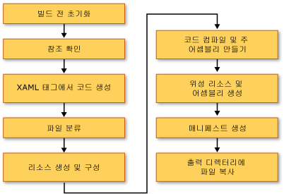

# <a name="building-a-wpf-application-wpf"></a><span data-ttu-id="cab3d-102">WPF 응용 프로그램 빌드(WPF)</span><span class="sxs-lookup"><span data-stu-id="cab3d-102">Building a WPF Application (WPF)</span></span>
[!INCLUDE[TLA#tla_wpf](../../../../includes/tlasharptla-wpf-md.md)]<span data-ttu-id="cab3d-103"> 응용 프로그램을 [!INCLUDE[dnprdnshort](../../../../includes/dnprdnshort-md.md)] 실행 파일(.exe), 라이브러리(.dll) 또는 두 어셈블리 형식의 조합으로 빌드할 수 있습니다.</span><span class="sxs-lookup"><span data-stu-id="cab3d-103"> applications can be built as [!INCLUDE[dnprdnshort](../../../../includes/dnprdnshort-md.md)] executables (.exe), libraries (.dll), or a combination of both types of assemblies.</span></span> <span data-ttu-id="cab3d-104">이 항목에서는 [!INCLUDE[TLA2#tla_wpf](../../../../includes/tla2sharptla-wpf-md.md)] 응용 프로그램을 빌드하는 방법과 빌드 프로세스의 주요 단계에 대해 설명합니다.</span><span class="sxs-lookup"><span data-stu-id="cab3d-104">This topic introduces how to build [!INCLUDE[TLA2#tla_wpf](../../../../includes/tla2sharptla-wpf-md.md)] applications and describes the key steps in the build process.</span></span>  
  
  
<a name="Building_a_WPF_Application_using_Command_Line"></a>   
## <a name="building-a-wpf-application"></a><span data-ttu-id="cab3d-105">WPF 응용 프로그램 빌드</span><span class="sxs-lookup"><span data-stu-id="cab3d-105">Building a WPF Application</span></span>  
 <span data-ttu-id="cab3d-106">다음과 같은 방법으로 WPF 응용 프로그램을 컴파일할 수 있습니다.</span><span class="sxs-lookup"><span data-stu-id="cab3d-106">A WPF application can be compiled in the following ways:</span></span>  
  
-   <span data-ttu-id="cab3d-107">명령줄.</span><span class="sxs-lookup"><span data-stu-id="cab3d-107">Command-line.</span></span> <span data-ttu-id="cab3d-108">응용 프로그램에 코드(XAML 없음)와 응용 프로그램 정의 파일만 포함되어야 합니다.</span><span class="sxs-lookup"><span data-stu-id="cab3d-108">The application must contain only code (no XAML) and an application definition file.</span></span> <span data-ttu-id="cab3d-109">자세한 내용은 [csc.exe를 사용한 명령줄 빌드](~/docs/csharp/language-reference/compiler-options/command-line-building-with-csc-exe.md) 또는 [명령줄에서 빌드(Visual Basic)](~/docs/visual-basic/reference/command-line-compiler/building-from-the-command-line.md)를 참조하세요.</span><span class="sxs-lookup"><span data-stu-id="cab3d-109">For more information, see [Command-line Building With csc.exe](~/docs/csharp/language-reference/compiler-options/command-line-building-with-csc-exe.md) or [Building from the Command Line (Visual Basic)](~/docs/visual-basic/reference/command-line-compiler/building-from-the-command-line.md).</span></span>  
  
-   <span data-ttu-id="cab3d-110">MSBuild(Microsoft Build Engine).</span><span class="sxs-lookup"><span data-stu-id="cab3d-110">Microsoft Build Engine (MSBuild).</span></span> <span data-ttu-id="cab3d-111">응용 프로그램에 코드 및 XAML 파일 외에 MSBuild 프로젝트 파일이 포함되어야 합니다.</span><span class="sxs-lookup"><span data-stu-id="cab3d-111">In addition to the code and XAML files, the application must contain an MSBuild project file.</span></span> <span data-ttu-id="cab3d-112">자세한 내용은 "MSBuild"를 참조하세요.</span><span class="sxs-lookup"><span data-stu-id="cab3d-112">For more information, see "MSBuild".</span></span>  
  
-   <span data-ttu-id="cab3d-113">Visual Studio.</span><span class="sxs-lookup"><span data-stu-id="cab3d-113">Visual Studio.</span></span> <span data-ttu-id="cab3d-114">Visual Studio는 MSBuild를 사용하여 WPF 응용 프로그램을 컴파일하고 UI를 만들기 위한 비주얼 디자이너를 포함하는 통합 개발 환경입니다.</span><span class="sxs-lookup"><span data-stu-id="cab3d-114">Visual Studio is an integrated development environment that compiles WPF applications with MSBuild and includes a visual designer for creating UI.</span></span> <span data-ttu-id="cab3d-115">자세한 내용은 [Visual Studio에서 응용 프로그램 개발](http://msdn.microsoft.com/library/97490c1b-a247-41fb-8f2c-bc4c201eff68) 및 [WPF 디자이너](http://msdn.microsoft.com/library/c6c65214-8411-4e16-b254-163ed4099c26)를 참조하세요.</span><span class="sxs-lookup"><span data-stu-id="cab3d-115">For more information, see [Application Development in Visual Studio](http://msdn.microsoft.com/library/97490c1b-a247-41fb-8f2c-bc4c201eff68) and [WPF Designer](http://msdn.microsoft.com/library/c6c65214-8411-4e16-b254-163ed4099c26).</span></span>  
  
<a name="The_Windows_Presentation_Foundation_Build_Pipeline"></a>   
## <a name="wpf-build-pipeline"></a><span data-ttu-id="cab3d-116">WPF 빌드 파이프라인</span><span class="sxs-lookup"><span data-stu-id="cab3d-116">WPF Build Pipeline</span></span>  
 <span data-ttu-id="cab3d-117">[!INCLUDE[TLA2#tla_wpf](../../../../includes/tla2sharptla-wpf-md.md)] 프로젝트를 빌드할 때 언어별 및 [!INCLUDE[TLA2#tla_wpf](../../../../includes/tla2sharptla-wpf-md.md)]별 대상 조합이 호출됩니다.</span><span class="sxs-lookup"><span data-stu-id="cab3d-117">When a [!INCLUDE[TLA2#tla_wpf](../../../../includes/tla2sharptla-wpf-md.md)] project is built, the combination of language-specific and [!INCLUDE[TLA2#tla_wpf](../../../../includes/tla2sharptla-wpf-md.md)]-specific targets are invoked.</span></span> <span data-ttu-id="cab3d-118">이러한 대상을 실행 중인 프로세스를 빌드 파이프라인이라고 하며 주요 단계는 다음 그림에서와 같이 설명됩니다.</span><span class="sxs-lookup"><span data-stu-id="cab3d-118">The process of executing these targets is called the build pipeline, and the key steps are illustrated by the following figure.</span></span>  
  
 <span data-ttu-id="cab3d-119"></span><span class="sxs-lookup"><span data-stu-id="cab3d-119"></span></span>  
  
<a name="Pre_Build_Initializations"></a>   
### <a name="pre-build-initializations"></a><span data-ttu-id="cab3d-120">빌드 전 초기화</span><span class="sxs-lookup"><span data-stu-id="cab3d-120">Pre-Build Initializations</span></span>  
 <span data-ttu-id="cab3d-121">빌드하기 전에 [!INCLUDE[TLA2#tla_msbuild](../../../../includes/tla2sharptla-msbuild-md.md)]는 다음과 같은 중요 도구 및 라이브러리의 위치를 결정합니다.</span><span class="sxs-lookup"><span data-stu-id="cab3d-121">Before building, [!INCLUDE[TLA2#tla_msbuild](../../../../includes/tla2sharptla-msbuild-md.md)] determines the location of important tools and libraries, including the following:</span></span>  
  
-   <span data-ttu-id="cab3d-122">[!INCLUDE[TLA2#tla_winfx](../../../../includes/tla2sharptla-winfx-md.md)]</span><span class="sxs-lookup"><span data-stu-id="cab3d-122">The [!INCLUDE[TLA2#tla_winfx](../../../../includes/tla2sharptla-winfx-md.md)].</span></span>  
  
-   <span data-ttu-id="cab3d-123">[!INCLUDE[TLA2#tla_wcsdk](../../../../includes/tla2sharptla-wcsdk-md.md)] 디렉터리</span><span class="sxs-lookup"><span data-stu-id="cab3d-123">The [!INCLUDE[TLA2#tla_wcsdk](../../../../includes/tla2sharptla-wcsdk-md.md)] directories.</span></span>  
  
-   <span data-ttu-id="cab3d-124">[!INCLUDE[TLA2#tla_wpf](../../../../includes/tla2sharptla-wpf-md.md)] 참조 어셈블리 위치</span><span class="sxs-lookup"><span data-stu-id="cab3d-124">The location of [!INCLUDE[TLA2#tla_wpf](../../../../includes/tla2sharptla-wpf-md.md)] reference assemblies.</span></span>  
  
-   <span data-ttu-id="cab3d-125">어셈블리 검색 경로의 속성</span><span class="sxs-lookup"><span data-stu-id="cab3d-125">The property for the assembly search paths.</span></span>  
  
 <span data-ttu-id="cab3d-126">[!INCLUDE[TLA2#tla_msbuild](../../../../includes/tla2sharptla-msbuild-md.md)]가 어셈블리를 검색하는 첫 번째 위치는 참조 어셈블리 디렉터리(%ProgramFiles%\Reference Assemblies\Microsoft\Framework\v3.0\\)입니다.</span><span class="sxs-lookup"><span data-stu-id="cab3d-126">The first location where [!INCLUDE[TLA2#tla_msbuild](../../../../includes/tla2sharptla-msbuild-md.md)] searches for assemblies is the reference assembly directory (%ProgramFiles%\Reference Assemblies\Microsoft\Framework\v3.0\\).</span></span> <span data-ttu-id="cab3d-127">이 단계에서 빌드 프로세스는 다양한 속성 및 항목 그룹을 초기화하고 필요한 정리 작업을 수행합니다.</span><span class="sxs-lookup"><span data-stu-id="cab3d-127">During this step, the build process also initializes the various properties and item groups and performs any required cleanup work.</span></span>  
  
<a name="Resolving_references"></a>   
### <a name="resolving-references"></a><span data-ttu-id="cab3d-128">참조 확인</span><span class="sxs-lookup"><span data-stu-id="cab3d-128">Resolving References</span></span>  
 <span data-ttu-id="cab3d-129">빌드 프로세스는 응용 프로그램 프로젝트를 빌드하는 데 필요한 어셈블리를 찾아서 바인딩합니다.</span><span class="sxs-lookup"><span data-stu-id="cab3d-129">The build process locates and binds the assemblies required to build the application project.</span></span> <span data-ttu-id="cab3d-130">이 논리는 `ResolveAssemblyReference` 작업에 포함되어 있습니다.</span><span class="sxs-lookup"><span data-stu-id="cab3d-130">This logic is contained in the `ResolveAssemblyReference` task.</span></span> <span data-ttu-id="cab3d-131">프로젝트 파일에서 `Reference`로 선언된 모든 어셈블리는 시스템에 이미 설치된 어셈블리의 메타데이터 및 검색 경로에 대한 정보와 함께 작업에 제공됩니다.</span><span class="sxs-lookup"><span data-stu-id="cab3d-131">All assemblies declared as `Reference` in the project file are provided to the task along with information on the search paths and metadata on assemblies already installed on the system.</span></span> <span data-ttu-id="cab3d-132">이 작업은 어셈블리를 찾고 설치된 어셈블리의 메타데이터를 사용하여 출력 매니페스트에 표시할 필요 없는 이러한 코어 [!INCLUDE[TLA2#tla_wpf](../../../../includes/tla2sharptla-wpf-md.md)] 어셈블리를 필터링합니다.</span><span class="sxs-lookup"><span data-stu-id="cab3d-132">The task looks up assemblies and uses the installed assembly's metadata to filter out those core [!INCLUDE[TLA2#tla_wpf](../../../../includes/tla2sharptla-wpf-md.md)] assemblies that need not show up in the output manifests.</span></span> <span data-ttu-id="cab3d-133">이 작업의 목적은 ClickOnce 매니페스트에서 중복되는 정보를 방지하는 것입니다.</span><span class="sxs-lookup"><span data-stu-id="cab3d-133">This is done to avoid redundant information in the ClickOnce manifests.</span></span> <span data-ttu-id="cab3d-134">예를 들어 PresentationFramework.dll은 [!INCLUDE[TLA2#tla_wpf](../../../../includes/tla2sharptla-wpf-md.md)]용으로 빌드된 응용 프로그램의 대표로 간주될 수 있고 모든 [!INCLUDE[TLA2#tla_wpf](../../../../includes/tla2sharptla-wpf-md.md)] 어셈블리가 [!INCLUDE[TLA2#tla_winfx](../../../../includes/tla2sharptla-winfx-md.md)]가 설치된 모든 시스템의 동일한 위치에 존재하기 때문에 매니페스트의 모든 [!INCLUDE[TLA2#tla_winfx](../../../../includes/tla2sharptla-winfx-md.md)] 참조 어셈블리에 모든 정보를 포함할 필요가 없습니다.</span><span class="sxs-lookup"><span data-stu-id="cab3d-134">For example, since PresentationFramework.dll can be considered representative of an application built on and for the [!INCLUDE[TLA2#tla_wpf](../../../../includes/tla2sharptla-wpf-md.md)] and moreover since all [!INCLUDE[TLA2#tla_wpf](../../../../includes/tla2sharptla-wpf-md.md)] assemblies exist at the same location on every machine that has the [!INCLUDE[TLA2#tla_winfx](../../../../includes/tla2sharptla-winfx-md.md)] installed, there is no need to include all information on all [!INCLUDE[TLA2#tla_winfx](../../../../includes/tla2sharptla-winfx-md.md)] reference assemblies in the manifests.</span></span>  
  
<a name="Markup_Compilation___Pass_1"></a>   
### <a name="markup-compilationpass-1"></a><span data-ttu-id="cab3d-135">태그 컴파일 - 패스 1</span><span class="sxs-lookup"><span data-stu-id="cab3d-135">Markup Compilation—Pass 1</span></span>  
 <span data-ttu-id="cab3d-136">이 단계에서는 런타임 시 [!INCLUDE[TLA2#tla_xml](../../../../includes/tla2sharptla-xml-md.md)]을 구문 분석하고 속성 값을 검증하는 데 시간을 소비하지 않도록 [!INCLUDE[TLA2#tla_xaml](../../../../includes/tla2sharptla-xaml-md.md)] 파일을 구문 분석 및 컴파일합니다.</span><span class="sxs-lookup"><span data-stu-id="cab3d-136">In this step, [!INCLUDE[TLA2#tla_xaml](../../../../includes/tla2sharptla-xaml-md.md)] files are parsed and compiled so that the runtime does not spend time parsing [!INCLUDE[TLA2#tla_xml](../../../../includes/tla2sharptla-xml-md.md)] and validating property values.</span></span> <span data-ttu-id="cab3d-137">컴파일된 [!INCLUDE[TLA2#tla_xaml](../../../../includes/tla2sharptla-xaml-md.md)] 파일은 사전 토큰화되어 있으므로 런타임 시 이 파일을 로드하면 [!INCLUDE[TLA2#tla_xaml](../../../../includes/tla2sharptla-xaml-md.md)] 파일을 로드하는 것보다 훨씬 속도가 빨라집니다.</span><span class="sxs-lookup"><span data-stu-id="cab3d-137">The compiled [!INCLUDE[TLA2#tla_xaml](../../../../includes/tla2sharptla-xaml-md.md)] file is pre-tokenized so that, at run time, loading it should be much faster than loading a [!INCLUDE[TLA2#tla_xaml](../../../../includes/tla2sharptla-xaml-md.md)] file.</span></span>  
  
 <span data-ttu-id="cab3d-138">이 단계에서 다음 작업은 `Page` 빌드 항목인 모든 [!INCLUDE[TLA2#tla_xaml](../../../../includes/tla2sharptla-xaml-md.md)] 파일에 대해 수행됩니다.</span><span class="sxs-lookup"><span data-stu-id="cab3d-138">During this step, the following activities take place for every [!INCLUDE[TLA2#tla_xaml](../../../../includes/tla2sharptla-xaml-md.md)] file that is a `Page` build item:</span></span>  
  
1.  <span data-ttu-id="cab3d-139">[!INCLUDE[TLA2#tla_xaml](../../../../includes/tla2sharptla-xaml-md.md)] 파일은 태그 컴파일러에 의해 구문 분석됩니다.</span><span class="sxs-lookup"><span data-stu-id="cab3d-139">The [!INCLUDE[TLA2#tla_xaml](../../../../includes/tla2sharptla-xaml-md.md)] file is parsed by the markup compiler.</span></span>  
  
2.  <span data-ttu-id="cab3d-140">컴파일된 표현은 해당 [!INCLUDE[TLA2#tla_xaml](../../../../includes/tla2sharptla-xaml-md.md)]에 대해 만들어져서 obj\Release 폴더에 복사됩니다.</span><span class="sxs-lookup"><span data-stu-id="cab3d-140">A compiled representation is created for that [!INCLUDE[TLA2#tla_xaml](../../../../includes/tla2sharptla-xaml-md.md)] and copied to the obj\Release folder.</span></span>  
  
3.  <span data-ttu-id="cab3d-141">새 partial 클래스의 CodeDOM 표현이 만들어져서 obj\Release 폴더에 복사됩니다.</span><span class="sxs-lookup"><span data-stu-id="cab3d-141">A CodeDOM representation of a new partial class is created and copied to the obj\Release folder.</span></span>  
  
 <span data-ttu-id="cab3d-142">또한 모든 [!INCLUDE[TLA2#tla_xaml](../../../../includes/tla2sharptla-xaml-md.md)] 파일에 대해 언어별 코드 파일이 생성됩니다.</span><span class="sxs-lookup"><span data-stu-id="cab3d-142">In addition, a language-specific code file is generated for every [!INCLUDE[TLA2#tla_xaml](../../../../includes/tla2sharptla-xaml-md.md)] file.</span></span> <span data-ttu-id="cab3d-143">예를 들어 [!INCLUDE[TLA2#tla_visualb](../../../../includes/tla2sharptla-visualb-md.md)] 프로젝트의 Page1.xaml 페이지에 대해 Page1.g.vb가 생성되고, [!INCLUDE[TLA2#tla_cshrp](../../../../includes/tla2sharptla-cshrp-md.md)] 프로젝트의 Page1.xaml 페이지에 대해서는 Page1.g.cs가 생성됩니다.</span><span class="sxs-lookup"><span data-stu-id="cab3d-143">For example, for a Page1.xaml page in a [!INCLUDE[TLA2#tla_visualb](../../../../includes/tla2sharptla-visualb-md.md)] project, a Page1.g.vb is generated; for a Page1.xaml page in a [!INCLUDE[TLA2#tla_cshrp](../../../../includes/tla2sharptla-cshrp-md.md)] project, a Page1.g.cs is generated.</span></span> <span data-ttu-id="cab3d-144">파일 이름에 ".g"가 있으면 파일이 태그 파일(예: `Page` 또는 `Window`)의 최상위 수준 요소에 대한 partial 클래스 선언을 포함하여 생성된 코드라는 의미입니다.</span><span class="sxs-lookup"><span data-stu-id="cab3d-144">The ".g" in the file name indicates the file is generated code that has a partial class declaration for the top-level element of the markup file (such as `Page` or `Window`).</span></span> <span data-ttu-id="cab3d-145">이 클래스는 [!INCLUDE[TLA2#tla_cshrp](../../../../includes/tla2sharptla-cshrp-md.md)]의 `partial` 한정자([!INCLUDE[TLA2#tla_visualb](../../../../includes/tla2sharptla-visualb-md.md)]에서는 `Extends`)를 통해 선언되며 이 한정자는 다른 위치(일반적으로 Page1.xaml.cs의 코드 숨김 파일)에 클래스에 대한 다른 선언이 있음을 나타냅니다.</span><span class="sxs-lookup"><span data-stu-id="cab3d-145">The class is declared with the `partial` modifier in [!INCLUDE[TLA2#tla_cshrp](../../../../includes/tla2sharptla-cshrp-md.md)] (`Extends` in [!INCLUDE[TLA2#tla_visualb](../../../../includes/tla2sharptla-visualb-md.md)]) to indicate there is another declaration for the class elsewhere, usually in the code-behind file Page1.xaml.cs.</span></span>  
  
 <span data-ttu-id="cab3d-146">해당 기본 클래스에서 확장 되는 partial 클래스 (같은 <xref:System.Windows.Controls.Page> 페이지에 대 한) 구현 하 고는 <xref:System.Windows.Markup.IComponentConnector?displayProperty=nameWithType> 인터페이스.</span><span class="sxs-lookup"><span data-stu-id="cab3d-146">The partial class extends from the appropriate base class (such as <xref:System.Windows.Controls.Page> for a page) and implements the <xref:System.Windows.Markup.IComponentConnector?displayProperty=nameWithType> interface.</span></span> <span data-ttu-id="cab3d-147"><xref:System.Windows.Markup.IComponentConnector> 인터페이스에는 구성 요소를 초기화 하 고 이름과 이벤트 내용에 있는 요소를 연결 하는 메서드가 있습니다.</span><span class="sxs-lookup"><span data-stu-id="cab3d-147">The <xref:System.Windows.Markup.IComponentConnector> interface has methods to initialize a component and connect names and events on elements in its content.</span></span> <span data-ttu-id="cab3d-148">결과적으로 생성된 코드 파일에는 다음과 같은 메서드 구현이 있습니다.</span><span class="sxs-lookup"><span data-stu-id="cab3d-148">Consequently, the generated code file has a method implementation like the following:</span></span>  
  
```csharp  
public void InitializeComponent() {  
    if (_contentLoaded) {  
        return;  
    }  
    _contentLoaded = true;  
    System.Uri resourceLocater =   
        new System.Uri(  
            "window1.xaml",   
            System.UriKind.RelativeOrAbsolute);  
    System.Windows.Application.LoadComponent(this, resourceLocater);  
}  
```  
  
```vb  
Public Sub InitializeComponent() _  
  
    If _contentLoaded Then  
        Return  
    End If  
  
    _contentLoaded = True  
    Dim resourceLocater As System.Uri = _  
        New System.Uri("mainwindow.xaml", System.UriKind.Relative)  
  
    System.Windows.Application.LoadComponent(Me, resourceLocater)  
  
End Sub  
```  
  
 <span data-ttu-id="cab3d-149">기본적으로 동일한 태그 컴파일을 실행 <xref:System.AppDomain> 로 [!INCLUDE[TLA2#tla_msbuild](../../../../includes/tla2sharptla-msbuild-md.md)] 엔진입니다.</span><span class="sxs-lookup"><span data-stu-id="cab3d-149">By default, markup compilation runs in the same <xref:System.AppDomain> as the [!INCLUDE[TLA2#tla_msbuild](../../../../includes/tla2sharptla-msbuild-md.md)] engine.</span></span> <span data-ttu-id="cab3d-150">따라서 성능이 크게 향상됩니다.</span><span class="sxs-lookup"><span data-stu-id="cab3d-150">This provides significant performance gains.</span></span> <span data-ttu-id="cab3d-151">이 동작은 `AlwaysCompileMarkupFilesInSeparateDomain` 속성을 통해 전환할 수 있습니다.</span><span class="sxs-lookup"><span data-stu-id="cab3d-151">This behavior can be toggled with the `AlwaysCompileMarkupFilesInSeparateDomain` property.</span></span> <span data-ttu-id="cab3d-152">이 모든 참조 어셈블리를 언로드하는 별도 언로드의 이점이 <xref:System.AppDomain>합니다.</span><span class="sxs-lookup"><span data-stu-id="cab3d-152">This has the advantage of unloading all reference assemblies by unloading the separate <xref:System.AppDomain>.</span></span>  
  
<a name="Pass_2_of_Markup_Compilation"></a>   
### <a name="markup-compilationpass-2"></a><span data-ttu-id="cab3d-153">태그 컴파일 - 패스 2</span><span class="sxs-lookup"><span data-stu-id="cab3d-153">Markup Compilation—Pass 2</span></span>  
 <span data-ttu-id="cab3d-154">일부 [!INCLUDE[TLA2#tla_xaml](../../../../includes/tla2sharptla-xaml-md.md)] 페이지는 태그 컴파일의 패스 1에서 컴파일됩니다.</span><span class="sxs-lookup"><span data-stu-id="cab3d-154">Not all [!INCLUDE[TLA2#tla_xaml](../../../../includes/tla2sharptla-xaml-md.md)] pages are compiled at during pass 1 of markup compilation.</span></span> <span data-ttu-id="cab3d-155">이때 로컬로 정의된 형식 참조(동일한 프로젝트의 코드에서 정의된 형식에 대한 참조)가 있는 [!INCLUDE[TLA2#tla_xaml](../../../../includes/tla2sharptla-xaml-md.md)] 파일은 컴파일에서 제외됩니다.</span><span class="sxs-lookup"><span data-stu-id="cab3d-155">[!INCLUDE[TLA2#tla_xaml](../../../../includes/tla2sharptla-xaml-md.md)] files that have locally defined type references (references to types defined in code elsewhere in the same project) are exempt from compilation at this time.</span></span> <span data-ttu-id="cab3d-156">이는 로컬로 정의된 형식이 소스에만 있어 아직 컴파일되지 않았기 때문입니다.</span><span class="sxs-lookup"><span data-stu-id="cab3d-156">This is because those locally defined types exist only in source and have not yet been compiled.</span></span> <span data-ttu-id="cab3d-157">이를 확인하기 위해 파서는 추론을 사용하여 태그 파일에서 `x:Name`과 같은 항목을 찾습니다.</span><span class="sxs-lookup"><span data-stu-id="cab3d-157">In order to determine this, the parser uses heuristics that involve looking for items such as `x:Name` in the markup file.</span></span> <span data-ttu-id="cab3d-158">이러한 인스턴스를 찾은 경우 코드 파일이 컴파일될 때까지 해당 태그 파일의 컴파일이 연기되며 나중에 두 번째 태그 컴파일 패스가 이러한 파일을 처리합니다.</span><span class="sxs-lookup"><span data-stu-id="cab3d-158">When such an instance is found, that markup file’s compilation is postponed until the code files have been compiled, after which, the second markup compilation pass processes these files.</span></span>  
  
<a name="File_Classification"></a>   
### <a name="file-classification"></a><span data-ttu-id="cab3d-159">파일 분류</span><span class="sxs-lookup"><span data-stu-id="cab3d-159">File Classification</span></span>  
 <span data-ttu-id="cab3d-160">빌드 프로세스는 출력 파일을 배치할 응용 프로그램 어셈블리를 기반으로 다른 리소스 그룹에 출력 파일을 배치합니다.</span><span class="sxs-lookup"><span data-stu-id="cab3d-160">The build process puts output files into different resource groups based on which application assembly they will be placed in.</span></span> <span data-ttu-id="cab3d-161">일반적으로 지역화되지 않은 응용 프로그램에서 `Resource`로 표시된 모든 데이터 파일은 주 어셈블리(실행 파일 또는 라이브러리)에 배치됩니다.</span><span class="sxs-lookup"><span data-stu-id="cab3d-161">In a typical nonlocalized application, all data files marked as `Resource` are placed in the main assembly (executable or library).</span></span> <span data-ttu-id="cab3d-162">프로젝트에서 `UICulture`가 설정된 경우 컴파일된 모든 [!INCLUDE[TLA2#tla_xaml](../../../../includes/tla2sharptla-xaml-md.md)] 파일 및 해당 리소스(특히 언어별로 표시된 리소스)가 위성 리소스 어셈블리에 배치됩니다.</span><span class="sxs-lookup"><span data-stu-id="cab3d-162">When `UICulture` is set in the project, all compiled [!INCLUDE[TLA2#tla_xaml](../../../../includes/tla2sharptla-xaml-md.md)] files and those resources specifically marked as language-specific are placed in the satellite resource assembly.</span></span> <span data-ttu-id="cab3d-163">또한 모든 언어 중립 리소스는 주 어셈블리에 배치됩니다.</span><span class="sxs-lookup"><span data-stu-id="cab3d-163">Furthermore, all language-neutral resources are placed in the main assembly.</span></span> <span data-ttu-id="cab3d-164">빌드 프로세스의 이 단계에서 해당 사항이 결정됩니다.</span><span class="sxs-lookup"><span data-stu-id="cab3d-164">In this step of the build process, that determination is made.</span></span>  
  
 <span data-ttu-id="cab3d-165">프로젝트 파일의 `ApplicationDefinition`, `Page` 및 `Resource` 빌드 작업은 `Localizable` 메타데이터(허용 가능한 값은 `true` 및 `false`)를 통해 보강할 수 있으며 이는 파일이 언어와 관련되었는지 또는 언어 중립적인지 지정합니다.</span><span class="sxs-lookup"><span data-stu-id="cab3d-165">The `ApplicationDefinition`, `Page`, and `Resource` build actions in the project file can be augmented with the `Localizable` metadata (acceptable values are `true` and `false`), which dictates whether the file is language-specific or language-neutral.</span></span>  
  
<a name="Core_Compilation"></a>   
### <a name="core-compilation"></a><span data-ttu-id="cab3d-166">핵심 컴파일</span><span class="sxs-lookup"><span data-stu-id="cab3d-166">Core Compilation</span></span>  
 <span data-ttu-id="cab3d-167">핵심 컴파일 단계에서는 코드 파일을 컴파일합니다.</span><span class="sxs-lookup"><span data-stu-id="cab3d-167">The core compile step involves compilation of code files.</span></span> <span data-ttu-id="cab3d-168">이 작업은 언어별 대상 파일 Microsoft.CSharp.targets 및 Microsoft.VisualBasic.targets의 논리에 의해 오케스트레이션됩니다.</span><span class="sxs-lookup"><span data-stu-id="cab3d-168">This is orchestrated by logic in the language-specific targets files Microsoft.CSharp.targets and Microsoft.VisualBasic.targets.</span></span> <span data-ttu-id="cab3d-169">추론을 통해 태그 컴파일러의 단일 패스로 충분하다고 판단된 경우 주 어셈블리가 생성됩니다.</span><span class="sxs-lookup"><span data-stu-id="cab3d-169">If heuristics have determined that a single pass of the markup compiler is sufficient, then the main assembly is generated.</span></span> <span data-ttu-id="cab3d-170">그러나 프로젝트에서 하나 이상의 [!INCLUDE[TLA2#tla_xaml](../../../../includes/tla2sharptla-xaml-md.md)] 파일에 로컬로 정의된 형식에 대한 참조가 있는 경우 태그 컴파일의 두 번째 패스가 완료된 후 최종 응용 프로그램 어셈블리가 만들어질 수 있도록 임시 .dll 파일이 생성됩니다.</span><span class="sxs-lookup"><span data-stu-id="cab3d-170">However, if one or more [!INCLUDE[TLA2#tla_xaml](../../../../includes/tla2sharptla-xaml-md.md)] files in the project have references to locally defined types, then a temporary .dll file is generated so the final application assemblies may be created after the second pass of markup compilation is complete.</span></span>  
  
<a name="Manifest_generation"></a>   
### <a name="manifest-generation"></a><span data-ttu-id="cab3d-171">매니페스트 생성</span><span class="sxs-lookup"><span data-stu-id="cab3d-171">Manifest Generation</span></span>  
 <span data-ttu-id="cab3d-172">빌드 프로세스의 마지막 단계에서는 모든 응용 프로그램 어셈블리와 콘텐츠 파일이 준비되면 응용 프로그램에 대한 [!INCLUDE[TLA2#tla_clickonce](../../../../includes/tla2sharptla-clickonce-md.md)] 매니페스트가 생성됩니다.</span><span class="sxs-lookup"><span data-stu-id="cab3d-172">At the end of the build process, after all the application assemblies and content files are ready, the [!INCLUDE[TLA2#tla_clickonce](../../../../includes/tla2sharptla-clickonce-md.md)] manifests for the application are generated.</span></span>  
  
 <span data-ttu-id="cab3d-173">배포 매니페스트 파일은 배포 모델, 즉 현재 버전, 업데이트 동작 및 게시자 ID를 디지털 시그니처와 함께 설명합니다.</span><span class="sxs-lookup"><span data-stu-id="cab3d-173">The deployment manifest file describes the deployment model: the current version, update behavior, and publisher identity along with digital signature.</span></span> <span data-ttu-id="cab3d-174">이 매니페스트는 배포를 처리하는 관리자가 작성합니다.</span><span class="sxs-lookup"><span data-stu-id="cab3d-174">This manifest is intended to be authored by administrators who handle deployment.</span></span> <span data-ttu-id="cab3d-175">파일 확장명은 .xbap([!INCLUDE[TLA#tla_xbap#plural](../../../../includes/tlasharptla-xbapsharpplural-md.md)])이며 설치된 응용 프로그램의 경우 .application입니다.</span><span class="sxs-lookup"><span data-stu-id="cab3d-175">The file extension is .xbap (for [!INCLUDE[TLA#tla_xbap#plural](../../../../includes/tlasharptla-xbapsharpplural-md.md)]) and .application for installed applications.</span></span> <span data-ttu-id="cab3d-176">.xbap는 `HostInBrowser` 프로젝트 속성에 의해 지정되며 그 결과 매니페스트는 응용 프로그램이 브라우저에 호스트되는 것으로 식별합니다.</span><span class="sxs-lookup"><span data-stu-id="cab3d-176">The former is dictated by the `HostInBrowser` project property and as a result the manifest identifies the application as browser-hosted.</span></span>  
  
 <span data-ttu-id="cab3d-177">응용 프로그램 매니페스트(.exe.manifest 파일)는 응용 프로그램 어셈블리 및 종속 라이브러리를 설명하고 응용 프로그램에 필요한 사용 권한을 나열합니다.</span><span class="sxs-lookup"><span data-stu-id="cab3d-177">The application manifest (an .exe.manifest file) describes the application assemblies and dependent libraries and lists permissions required by the application.</span></span> <span data-ttu-id="cab3d-178">이 파일은 응용 프로그램 개발자가 작성합니다.</span><span class="sxs-lookup"><span data-stu-id="cab3d-178">This file is intended to be authored by the application developer.</span></span> <span data-ttu-id="cab3d-179">[!INCLUDE[TLA2#tla_clickonce](../../../../includes/tla2sharptla-clickonce-md.md)] 응용 프로그램을 시작하려면 사용자가 응용 프로그램의 배포 매니페스트 파일을 엽니다.</span><span class="sxs-lookup"><span data-stu-id="cab3d-179">In order to launch a [!INCLUDE[TLA2#tla_clickonce](../../../../includes/tla2sharptla-clickonce-md.md)] application, a user opens the application's deployment manifest file.</span></span>  
  
 <span data-ttu-id="cab3d-180">이러한 매니페스트 파일은 [!INCLUDE[TLA2#tla_xbap#plural](../../../../includes/tla2sharptla-xbapsharpplural-md.md)]에 대해 항상 만들어집니다.</span><span class="sxs-lookup"><span data-stu-id="cab3d-180">These manifest files are always created for [!INCLUDE[TLA2#tla_xbap#plural](../../../../includes/tla2sharptla-xbapsharpplural-md.md)].</span></span> <span data-ttu-id="cab3d-181">설치된 응용 프로그램의 경우 프로젝트 파일에서 `GenerateManifests` 속성 값이 `true`로 지정되지 않는 한 만들어지지 않습니다.</span><span class="sxs-lookup"><span data-stu-id="cab3d-181">For installed applications, they are not created unless the `GenerateManifests` property is specified in the project file with value `true`.</span></span>  
  
 [!INCLUDE[TLA2#tla_xbap#plural](../../../../includes/tla2sharptla-xbapsharpplural-md.md)]<span data-ttu-id="cab3d-182">두 개의 추가적인 권한인 일반적인 인터넷 영역 응용 프로그램에 할당 된 사용 권한만 가져오기: <xref:System.Security.Permissions.WebBrowserPermission> 및 <xref:System.Security.Permissions.MediaPermission>합니다.</span><span class="sxs-lookup"><span data-stu-id="cab3d-182"> get two additional permissions over and above those permissions assigned to typical Internet zone applications: <xref:System.Security.Permissions.WebBrowserPermission> and <xref:System.Security.Permissions.MediaPermission>.</span></span> <span data-ttu-id="cab3d-183">[!INCLUDE[TLA2#tla_wpf](../../../../includes/tla2sharptla-wpf-md.md)] 빌드 시스템은 응용 프로그램 매니페스트에서 이러한 사용 권한을 선언합니다.</span><span class="sxs-lookup"><span data-stu-id="cab3d-183">The [!INCLUDE[TLA2#tla_wpf](../../../../includes/tla2sharptla-wpf-md.md)] build system declares those permissions in the application manifest.</span></span>  
  
<a name="Incremental_Build_Support"></a>   
## <a name="incremental-build-support"></a><span data-ttu-id="cab3d-184">증분 빌드 지원</span><span class="sxs-lookup"><span data-stu-id="cab3d-184">Incremental Build Support</span></span>  
 <span data-ttu-id="cab3d-185">[!INCLUDE[TLA2#tla_wpf](../../../../includes/tla2sharptla-wpf-md.md)] 빌드 시스템은 증분 빌드에 대한 지원을 제공합니다.</span><span class="sxs-lookup"><span data-stu-id="cab3d-185">The [!INCLUDE[TLA2#tla_wpf](../../../../includes/tla2sharptla-wpf-md.md)] build system provides support for incremental builds.</span></span> <span data-ttu-id="cab3d-186">태그 또는 코드에 대한 변경 사항을 지능적으로 검색하고 변경 사항의 영향을 받는 아티팩트만 컴파일합니다.</span><span class="sxs-lookup"><span data-stu-id="cab3d-186">It is fairly intelligent about detecting changes made to markup or code, and it compiles only those artifacts affected by the change.</span></span> <span data-ttu-id="cab3d-187">증분 빌드 메커니즘은 다음 파일을 사용합니다.</span><span class="sxs-lookup"><span data-stu-id="cab3d-187">The incremental build mechanism uses the following files:</span></span>  
  
-   <span data-ttu-id="cab3d-188">현재 컴파일러 상태를 유지 관리하는 $(*AssemblyName*)_MarkupCompiler.Cache 파일</span><span class="sxs-lookup"><span data-stu-id="cab3d-188">An $(*AssemblyName*)_MarkupCompiler.Cache file to maintain current compiler state.</span></span>  
  
-   <span data-ttu-id="cab3d-189">로컬로 정의된 형식에 대한 참조가 있는 [!INCLUDE[TLA2#tla_xaml](../../../../includes/tla2sharptla-xaml-md.md)] 파일을 캐시하는 $(*AssemblyName*) _MarkupCompiler.lref 파일</span><span class="sxs-lookup"><span data-stu-id="cab3d-189">An $(*AssemblyName*)_MarkupCompiler.lref file to cache the [!INCLUDE[TLA2#tla_xaml](../../../../includes/tla2sharptla-xaml-md.md)] files with references to locally defined types.</span></span>  
  
 <span data-ttu-id="cab3d-190">다음은 증분 빌드를 제어하는 규칙 집합입니다.</span><span class="sxs-lookup"><span data-stu-id="cab3d-190">The following is a set of rules governing incremental build:</span></span>  
  
-   <span data-ttu-id="cab3d-191">파일은 빌드 시스템이 변경을 검색하는 가장 작은 단위입니다.</span><span class="sxs-lookup"><span data-stu-id="cab3d-191">The file is the smallest unit at which the build system detects change.</span></span> <span data-ttu-id="cab3d-192">따라서 코드 파일의 경우 빌드 시스템에서 형식이 변경되었는지 또는 코드가 추가되었는지 확인할 수 없습니다.</span><span class="sxs-lookup"><span data-stu-id="cab3d-192">So, for a code file, the build system cannot tell if a type was changed or if code was added.</span></span> <span data-ttu-id="cab3d-193">이는 프로젝트 파일도 마찬가지입니다.</span><span class="sxs-lookup"><span data-stu-id="cab3d-193">The same holds for project files.</span></span>  
  
-   <span data-ttu-id="cab3d-194">증분 빌드 메커니즘은 [!INCLUDE[TLA2#tla_xaml](../../../../includes/tla2sharptla-xaml-md.md)] 페이지가 클래스를 정의하거나 다른 클래스를 사용한다는 것을 인식해야 합니다.</span><span class="sxs-lookup"><span data-stu-id="cab3d-194">The incremental build mechanism must be cognizant that a [!INCLUDE[TLA2#tla_xaml](../../../../includes/tla2sharptla-xaml-md.md)] page either defines a class or uses other classes.</span></span>  
  
-   <span data-ttu-id="cab3d-195">`Reference` 항목이 변경된 경우 모든 페이지를 다시 컴파일합니다.</span><span class="sxs-lookup"><span data-stu-id="cab3d-195">If `Reference` entries change, then recompile all pages.</span></span>  
  
-   <span data-ttu-id="cab3d-196">코드 파일이 변경되면 로컬로 정의된 형식 참조가 있는 모든 페이지를 다시 컴파일합니다.</span><span class="sxs-lookup"><span data-stu-id="cab3d-196">If a code file changes, recompile all pages with locally defined type references.</span></span>  
  
-   <span data-ttu-id="cab3d-197">[!INCLUDE[TLA2#tla_xaml](../../../../includes/tla2sharptla-xaml-md.md)] 파일이 변경된 경우:</span><span class="sxs-lookup"><span data-stu-id="cab3d-197">If a [!INCLUDE[TLA2#tla_xaml](../../../../includes/tla2sharptla-xaml-md.md)] file changes:</span></span>  
  
    -   <span data-ttu-id="cab3d-198">프로젝트에서 [!INCLUDE[TLA2#tla_xaml](../../../../includes/tla2sharptla-xaml-md.md)]이 `Page`로 선언된 경우: [!INCLUDE[TLA2#tla_xaml](../../../../includes/tla2sharptla-xaml-md.md)]에 로컬로 정의된 형식 참조가 없는 경우 [!INCLUDE[TLA2#tla_xaml](../../../../includes/tla2sharptla-xaml-md.md)] 및 모든 [!INCLUDE[TLA2#tla_xaml](../../../../includes/tla2sharptla-xaml-md.md)] 페이지를 로컬 참조와 함께 다시 컴파일합니다. [!INCLUDE[TLA2#tla_xaml](../../../../includes/tla2sharptla-xaml-md.md)]에 로컬 참조가 있는 경우 모든 [!INCLUDE[TLA2#tla_xaml](../../../../includes/tla2sharptla-xaml-md.md)] 페이지를 로컬 참조와 함께 다시 컴파일합니다.</span><span class="sxs-lookup"><span data-stu-id="cab3d-198">If [!INCLUDE[TLA2#tla_xaml](../../../../includes/tla2sharptla-xaml-md.md)] is declared as `Page` in the project: if the [!INCLUDE[TLA2#tla_xaml](../../../../includes/tla2sharptla-xaml-md.md)] does not have locally defined type references, recompile that [!INCLUDE[TLA2#tla_xaml](../../../../includes/tla2sharptla-xaml-md.md)] plus all [!INCLUDE[TLA2#tla_xaml](../../../../includes/tla2sharptla-xaml-md.md)] pages with local references; if the [!INCLUDE[TLA2#tla_xaml](../../../../includes/tla2sharptla-xaml-md.md)] has local references, recompile all [!INCLUDE[TLA2#tla_xaml](../../../../includes/tla2sharptla-xaml-md.md)] pages with local references.</span></span>  
  
    -   <span data-ttu-id="cab3d-199">경우 [!INCLUDE[TLA2#tla_xaml](../../../../includes/tla2sharptla-xaml-md.md)] 로 선언 `ApplicationDefinition` 프로젝트의: 모두를 다시 컴파일하십시오 [!INCLUDE[TLA2#tla_xaml](../../../../includes/tla2sharptla-xaml-md.md)] 페이지 (이유: 각 [!INCLUDE[TLA2#tla_xaml](../../../../includes/tla2sharptla-xaml-md.md)] 에 대 한 참조에는 <xref:System.Windows.Application> 변경 있을 수 있는 형식).</span><span class="sxs-lookup"><span data-stu-id="cab3d-199">If [!INCLUDE[TLA2#tla_xaml](../../../../includes/tla2sharptla-xaml-md.md)] is declared as `ApplicationDefinition` in the project: recompile all [!INCLUDE[TLA2#tla_xaml](../../../../includes/tla2sharptla-xaml-md.md)] pages (reason: each [!INCLUDE[TLA2#tla_xaml](../../../../includes/tla2sharptla-xaml-md.md)] has reference to an <xref:System.Windows.Application> type that may have changed).</span></span>  
  
-   <span data-ttu-id="cab3d-200">프로젝트 파일에서 [!INCLUDE[TLA2#tla_xaml](../../../../includes/tla2sharptla-xaml-md.md)] 파일 대신 응용 프로그램 정의로 코드 파일을 선언한 경우:</span><span class="sxs-lookup"><span data-stu-id="cab3d-200">If the project file declares a code file as application definition instead of a [!INCLUDE[TLA2#tla_xaml](../../../../includes/tla2sharptla-xaml-md.md)] file:</span></span>  
  
    -   <span data-ttu-id="cab3d-201">프로젝트 파일의 `ApplicationClassName` 값이 변경되었는지(새로운 응용 프로그램 형식이 있는지) 확인합니다.</span><span class="sxs-lookup"><span data-stu-id="cab3d-201">Check if the `ApplicationClassName` value in the project file has changed (is there a new application type?).</span></span> <span data-ttu-id="cab3d-202">변경된 경우 전체 응용 프로그램을 다시 컴파일합니다.</span><span class="sxs-lookup"><span data-stu-id="cab3d-202">If so, recompile the entire application.</span></span>  
  
    -   <span data-ttu-id="cab3d-203">변경되지 않은 경우 모든 [!INCLUDE[TLA2#tla_xaml](../../../../includes/tla2sharptla-xaml-md.md)] 페이지를 로컬 참조와 함께 다시 컴파일합니다.</span><span class="sxs-lookup"><span data-stu-id="cab3d-203">Otherwise, recompile all [!INCLUDE[TLA2#tla_xaml](../../../../includes/tla2sharptla-xaml-md.md)] pages with local references.</span></span>  
  
-   <span data-ttu-id="cab3d-204">프로젝트 파일이 변경된 경우: 앞에서 설명한 규칙을 모두 적용하고 다시 컴파일해야 할 항목을 확인합니다.</span><span class="sxs-lookup"><span data-stu-id="cab3d-204">If a project file changes: apply all preceding rules and see what needs to be recompiled.</span></span> <span data-ttu-id="cab3d-205">`AssemblyName`, `IntermediateOutputPath`, `RootNamespace` 및 `HostInBrowser` 속성이 변경되면 전체 다시 컴파일됩니다.</span><span class="sxs-lookup"><span data-stu-id="cab3d-205">Changes to the following properties trigger a complete recompile: `AssemblyName`, `IntermediateOutputPath`, `RootNamespace`, and `HostInBrowser`.</span></span>  
  
 <span data-ttu-id="cab3d-206">다시 컴파일 작업은 다음과 같은 시나리오로 수행될 수 있습니다.</span><span class="sxs-lookup"><span data-stu-id="cab3d-206">The following recompile scenarios are possible:</span></span>  
  
-   <span data-ttu-id="cab3d-207">전체 응용 프로그램이 다시 컴파일됩니다.</span><span class="sxs-lookup"><span data-stu-id="cab3d-207">The entire application is recompiled.</span></span>  
  
-   <span data-ttu-id="cab3d-208">로컬로 정의된 형식 참조가 있는 [!INCLUDE[TLA2#tla_xaml](../../../../includes/tla2sharptla-xaml-md.md)] 파일만 다시 컴파일됩니다.</span><span class="sxs-lookup"><span data-stu-id="cab3d-208">Only those [!INCLUDE[TLA2#tla_xaml](../../../../includes/tla2sharptla-xaml-md.md)] files that have locally defined type references are recompiled.</span></span>  
  
-   <span data-ttu-id="cab3d-209">모든 항목이 다시 컴파일되지 않습니다(프로젝트의 모든 항목이 변경되지 않음).</span><span class="sxs-lookup"><span data-stu-id="cab3d-209">Nothing is recompiled (if nothing in the project has changed).</span></span>  
  
## <a name="see-also"></a><span data-ttu-id="cab3d-210">참고 항목</span><span class="sxs-lookup"><span data-stu-id="cab3d-210">See Also</span></span>  
 [<span data-ttu-id="cab3d-211">WPF 응용 프로그램 배포</span><span class="sxs-lookup"><span data-stu-id="cab3d-211">Deploying a WPF Application</span></span>](../../../../docs/framework/wpf/app-development/deploying-a-wpf-application-wpf.md)  
 [<span data-ttu-id="cab3d-212">WPF MSBuild 참조</span><span class="sxs-lookup"><span data-stu-id="cab3d-212">WPF MSBuild Reference</span></span>](/visualstudio/msbuild/wpf-msbuild-reference)  
 [<span data-ttu-id="cab3d-213">WPF의 Pack URI</span><span class="sxs-lookup"><span data-stu-id="cab3d-213">Pack URIs in WPF</span></span>](../../../../docs/framework/wpf/app-development/pack-uris-in-wpf.md)  
 [<span data-ttu-id="cab3d-214">WPF 응용 프로그램 리소스, 콘텐츠 및 데이터 파일</span><span class="sxs-lookup"><span data-stu-id="cab3d-214">WPF Application Resource, Content, and Data Files</span></span>](../../../../docs/framework/wpf/app-development/wpf-application-resource-content-and-data-files.md)
