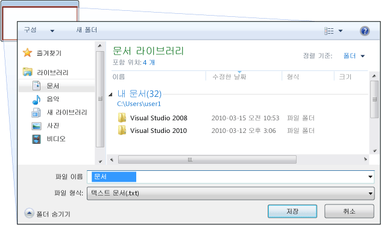
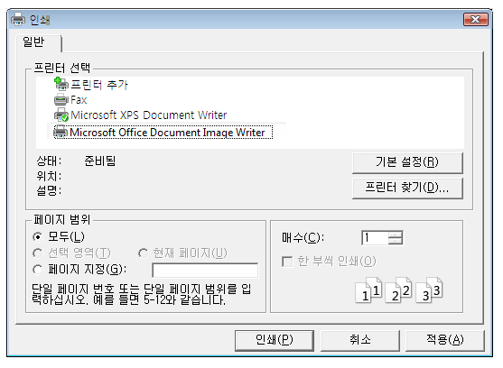

# 대화 상자 개요
독립 실행형 응용 프로그램에는 일반적으로 주 창 표시 기본 데이터는 응용 프로그램이 작동 하 고을 통해 해당 데이터를 처리 하는 기능을 노출 하는 [!INCLUDE[TLA#tla_ui](../../../../includes/tlasharptla-ui-md.md)] 메커니즘 메뉴 모음, 도구 모음 및 상태 표시줄을 선택 합니다. 특수 응용 프로그램에 다음을 수행 하는 창을 추가로 표시할 수도 있습니다.  
  
-   사용자에 게 특정 정보를 표시 합니다.  
  
-   사용자 로부터 정보를 수집 합니다.  
  
-   모두 표시 하 고 정보를 수집 합니다.  
  
 이러한 유형의 창 라고 *대화 상자*, 두 가지 유형이 있습니다 및: 모달 및 모덜리스 합니다.  
  
 A *모달* 함수를 계속 사용자에서 추가 데이터에 필요한 경우에 함수에 의해 대화 상자가 표시 됩니다. 함수 데이터를 수집 하는 모달 대화 상자에 의존 하기 때문에 모달 대화 상자는 또한 사용자가 열려 있는 동안 응용 프로그램에서 다른 창을 활성화할 방지 합니다. 대부분의 경우에서 모달 대화 상자를 통해 사용자 중 하나를 눌러야 모달 대화 상자가 종료 되었음을 알릴 수는 **확인** 또는 **취소** 단추입니다. 키를 눌러는 **확인** 단추를 사용자 데이터를 입력 하는 해당 데이터를 사용 하 여 처리를 계속 하려면 함수를 원한다는 것을 나타냅니다. 키를 눌러는 **취소** 단추 나타냅니다 사용자 함수가 실행을 완전히 되지 않도록 중지 하려고 합니다. 가장 일반적인 예는 모달 대화 상자를 열고, 저장 및 데이터 출력에 표시 됩니다.  
  
 A *모덜리스* 대화 상자, 반면에 사용 해도 사용자에서 파일이 열려 있는 동안 다른 창을 활성화 합니다. 예를 들어 사용자는 문서에서 특정 단어를 찾기 위해가 주 창 종종 열립니다 대화 상자를 찾고 있는 단어는 사용자에 게 확인 합니다. 하지만 이후을 모달 대화 상자가 필요 하지 않습니다, 단어 문서를 편집 하 여 사용자를 금지 하지 않습니다. 모덜리스 대화 상자를 적어도 제공는 **닫습니다** 대화 상자 닫기 및와 같은 특정 기능을 실행 하기 위한 추가 단추를 제공할 수 있습니다는 **다음 찾기** 단추 단어 검색의 찾기 조건과 일치 하는 다음 단어를 합니다.  
  
 [!INCLUDE[TLA#tla_wpf](../../../../includes/tlasharptla-wpf-md.md)]여러 유형의 대화 상자, 메시지 상자, 일반 대화 상자 및 사용자 지정 대화 상자를 포함 하 여 만들 수 있습니다. 이 항목에서는 각, 설명 및 [대화 상자 샘플](http://go.microsoft.com/fwlink/?LinkID=159984) 일치 하는 예제를 제공 합니다.  
  
   
  
   
## 메시지 상자  
 A *메시지 상자* 는 텍스트 정보를 표시 하 고 사용자가 단추와 결정을 내릴 수 있도록 하는 데 사용할 수 있는 대화 상자입니다. 다음 그림은 텍스트 정보를 표시, 질문을 하 고 질문에 대답할 수 있는 세 개의 단추가 있는 사용자를 제공 하는 메시지 상자를 보여 줍니다.  
  
   
  
 메시지 상자를 만들려면 사용 하는 <xref:System.Windows.MessageBox> 클래스입니다.                  <xref:System.Windows.MessageBox> 메시지 상자 텍스트, 제목, 아이콘 및 단추, 다음과 같은 코드를 사용 하 여 구성할 수 있습니다.  
  
 [!code-csharp[DialogBoxesOverviewSnippets#MsgBoxConfigureCODEBEHIND](../../../../samples/snippets/csharp/VS_Snippets_Wpf/DialogBoxesOverviewSnippets/CSharp/Window1.xaml.cs#msgboxconfigurecodebehind)]
 [!code-vb[DialogBoxesOverviewSnippets#MsgBoxConfigureCODEBEHIND](../../../../samples/snippets/visualbasic/VS_Snippets_Wpf/DialogBoxesOverviewSnippets/VisualBasic/window1.xaml.vb#msgboxconfigurecodebehind)]  
  
 호출 하면 메시지 상자를 표시 하려면는 `static` <xref:System.Windows.MessageBox.Show%2A> 메서드를 다음 코드에서와 같이 합니다.  
  
 [!code-csharp[DialogBoxesOverviewSnippets#MsgBoxShowCODEBEHIND](../../../../samples/snippets/csharp/VS_Snippets_Wpf/DialogBoxesOverviewSnippets/CSharp/Window1.xaml.cs#msgboxshowcodebehind)]
 [!code-vb[DialogBoxesOverviewSnippets#MsgBoxShowCODEBEHIND](../../../../samples/snippets/visualbasic/VS_Snippets_Wpf/DialogBoxesOverviewSnippets/VisualBasic/window1.xaml.vb#msgboxshowcodebehind)]  
  
 메시지 상자를 표시 하는 코드를 감지 하 여 사용자의 결정 (눌린 단추)를 처리 합니다. 필요한 경우 코드는 다음 코드에 나와 있는 것 처럼 메시지 상자 결과 검사할 수 있습니다.  
  
 [!code-csharp[DialogBoxesOverviewSnippets#MsgBoxShowAndResultCODEBEHIND1](../../../../samples/snippets/csharp/VS_Snippets_Wpf/DialogBoxesOverviewSnippets/CSharp/Window1.xaml.cs#msgboxshowandresultcodebehind1)]
 [!code-vb[DialogBoxesOverviewSnippets#MsgBoxShowAndResultCODEBEHIND1](../../../../samples/snippets/visualbasic/VS_Snippets_Wpf/DialogBoxesOverviewSnippets/VisualBasic/window1.xaml.vb#msgboxshowandresultcodebehind1)]  
  
 메시지 상자 사용에 대 한 자세한 내용은 참조 하십시오. <xref:System.Windows.MessageBox>, [MessageBox 샘플](http://go.microsoft.com/fwlink/?LinkID=160023), 및 [대화 상자 샘플](http://go.microsoft.com/fwlink/?LinkID=159984)합니다.  
  
 하지만 <xref:System.Windows.MessageBox> 간단한 대화 상자 사용자 환경, 사용을 제공할 수 있습니다 <xref:System.Windows.MessageBox> 창의 부분 신뢰 보안 샌드박스 내에서 실행 되는 응용 프로그램에서 표시 될 수 있는 유일한 형식입니다 (참조 [보안](../../../../docs/framework/wpf/security-wpf.md)), 예: [!INCLUDE[TLA#tla_xbap#plural](../../../../includes/tlasharptla-xbapsharpplural-md.md)]합니다.  
  
 대부분의 대화 상자 표시 및 메시지 상자에 텍스트를 선택 (확인란) 상호 배타적인 선택 (라디오 단추)를 포함 하 여의 결과 보다 더 복잡 한 데이터를 수집 하 고 목록 (목록 상자, 콤보 상자, 드롭 다운 목록 상자) 선택 항목입니다. 이러한 경우를 위해 [!INCLUDE[TLA#tla_wpf](../../../../includes/tlasharptla-wpf-md.md)] 몇 가지 일반적인 대화 상자를 제공 하 고 사용 하는 완전 신뢰로 실행 되는 응용 프로그램에 제한 되지만 사용자가 고유한 대화 상자를 만들 수 있습니다.  
  
   
## 일반 대화 상자  
 [!INCLUDE[TLA#tla_mswin](../../../../includes/tlasharptla-mswin-md.md)]다양 한 파일 열기, 파일, 저장 및 인쇄에 대 한 대화 상자를 포함 하 여 모든 응용 프로그램에 공통 된 다시 사용할 수 있는 대화 상자를 구현 합니다. 사용자 환경을 일관성;는 데 도움이 되는 운영 체제에서 실행 되는 모든 응용 프로그램 간에 공유할 수 있으므로 이러한 대화 상자도 운영 체제에 의해 구현 되는 있습니다. 사용자는 한 응용 프로그램의 운영 체제에서 제공 하는 대화 상자 사용에 익숙한 경우 다른 응용 프로그램에서 해당 대화 상자를 사용 하는 방법을 배울 필요가 없습니다. 이러한 대화 상자는 모든 응용 프로그램에 사용할 수 있고 일관 된 사용자 경험을 제공할 수 있기 때문에 이러한 이라고 *일반 대화 상자*합니다.  
  
 [!INCLUDE[TLA#tla_wpf](../../../../includes/tlasharptla-wpf-md.md)]열려 있는 파일을 저장 파일 및 인쇄 일반 대화 상자를 캡슐화 하 고 독립 실행형 응용 프로그램에서 사용 하 여 관리 되는 클래스로 노출 합니다. 이 항목에서는 각각에 대 한 간략 한 개요를 제공 합니다.  
  
   
### 파일 열기 대화 상자  
 다음 그림에 표시 된 파일 열기 대화 상자를 열려는 파일의 이름을 검색할 파일 열기 기능 사용 됩니다.  
  
   
  
 일반 파일 열기 대화 상자로 구현 되는 <xref:Microsoft.Win32.OpenFileDialog> 클래스 및에 <xref:Microsoft.Win32> 네임 스페이스입니다. 다음 코드에서는 생성, 구성 및 표시 하는 방법과 결과 처리 하는 방법을 보여 줍니다.  
  
 [!code-csharp[DialogBoxesOverviewSnippets#OpenFileDialogBoxCODEBEHIND](../../../../samples/snippets/csharp/VS_Snippets_Wpf/DialogBoxesOverviewSnippets/CSharp/Window1.xaml.cs#openfiledialogboxcodebehind)]
 [!code-vb[DialogBoxesOverviewSnippets#OpenFileDialogBoxCODEBEHIND](../../../../samples/snippets/visualbasic/VS_Snippets_Wpf/DialogBoxesOverviewSnippets/VisualBasic/window1.xaml.vb#openfiledialogboxcodebehind)]  
  
 파일 열기 대화 상자에 대 한 자세한 내용은 참조 하십시오. <xref:Microsoft.Win32.OpenFileDialog?displayProperty=fullName>합니다.  
  
> [!NOTE]
>  <xref:Microsoft.Win32.OpenFileDialog> 부분 신뢰로 실행 되는 응용 프로그램에서 안전 하 게 파일 이름을 검색에 사용할 수 있습니다 (참조 [보안](../../../../docs/framework/wpf/security-wpf.md)).  
  
   
### 파일 저장 대화 상자  
 저장 파일 대화 상자, 다음 그림에 표시 된 저장할 파일의 이름을 검색할 파일 저장 기능 사용 됩니다.  
  
   
  
 파일 저장 대화 상자는 일반적인으로 구현 되는 <xref:Microsoft.Win32.SaveFileDialog> 클래스를에 있는 <xref:Microsoft.Win32> 네임 스페이스입니다. 다음 코드에서는 생성, 구성 및 표시 하는 방법과 결과 처리 하는 방법을 보여 줍니다.  
  
 [!code-csharp[DialogBoxesOverviewSnippets#SaveFileDialogBoxCODEBEHIND](../../../../samples/snippets/csharp/VS_Snippets_Wpf/DialogBoxesOverviewSnippets/CSharp/Window1.xaml.cs#savefiledialogboxcodebehind)]
 [!code-vb[DialogBoxesOverviewSnippets#SaveFileDialogBoxCODEBEHIND](../../../../samples/snippets/visualbasic/VS_Snippets_Wpf/DialogBoxesOverviewSnippets/VisualBasic/window1.xaml.vb#savefiledialogboxcodebehind)]  
  
 저장에 대 한 자세한 내용은 file 대화 상자, 참조 <xref:Microsoft.Win32.SaveFileDialog?displayProperty=fullName>합니다.  
  
   
### 인쇄 대화 상자  
 다음 그림에 표시 된 인쇄 대화 상자를 선택 하 고 구성 하려는 사용자 데이터를 인쇄할 프린터 인쇄 기능 데.  
  
   
  
 일반 인쇄 대화 상자로 구현 되는 <xref:System.Windows.Controls.PrintDialog> 클래스를에 있는 <xref:System.Windows.Controls> 네임 스페이스입니다. 다음 코드 작성, 구성 및 표시 하는 방법을 보여 줍니다.  
  
 [!code-csharp[DialogBoxesOverviewSnippets#PrintDialogBoxCODEBEHIND](../../../../samples/snippets/csharp/VS_Snippets_Wpf/DialogBoxesOverviewSnippets/CSharp/Window1.xaml.cs#printdialogboxcodebehind)]
 [!code-vb[DialogBoxesOverviewSnippets#PrintDialogBoxCODEBEHIND](../../../../samples/snippets/visualbasic/VS_Snippets_Wpf/DialogBoxesOverviewSnippets/VisualBasic/window1.xaml.vb#printdialogboxcodebehind)]  
  
 인쇄 대화 상자에 대 한 자세한 내용은 참조 하십시오. <xref:System.Windows.Controls.PrintDialog?displayProperty=fullName>합니다. 에 대 한 자세한 설명은의 인쇄 [!INCLUDE[TLA2#tla_wpf](../../../../includes/tla2sharptla-wpf-md.md)], 참조 [인쇄 개요](../../../../docs/framework/wpf/advanced/printing-overview.md)합니다.  
  
   
## 사용자 지정 대화 상자  
 일반 대화 상자는 유용 하 가능한 경우에 사용 해야 하는 동안 도메인 관련 대화 상자의 요구 사항을 지원 하지 않습니다. 이러한 경우 사용자 대화 상자를 만들 필요가 있습니다. 살펴보겠지만, 대화 상자에는 특별 한 동작으로 창입니다.                  <xref:System.Windows.Window> 이러한 동작을 구현 하 고, 따라서를 사용 합니다 <xref:System.Windows.Window> 사용자 지정 모달 및 모덜리스 대화 상자를 만들어야 합니다.  
  
   
### 사용자 지정 모달 대화 상자 만들기  
 이 항목에서는 사용 하는 방법을 보여 줍니다. <xref:System.Windows.Window> 일반적인 모달 대화 상자 구현을 만들려면를 사용 하는 `Margins` 예를 들어 대화 상자 (참조 [대화 상자 샘플](http://go.microsoft.com/fwlink/?LinkID=159984)). `Margins` 대화 상자는 다음 그림에 표시 됩니다.  
  
   
  
#### 모달 대화 상자를 구성합니다.  
 일반 대화 상자에 대 한 사용자 인터페이스에는 다음이 포함 됩니다.  
  
-   원하는 데이터를 수집 하는 데 필요한 다양 한 컨트롤입니다.  
  
-   표시는 **확인** 단추 사용자 함수를 반환 대화 상자를 닫으려면 클릭 하 고 처리를 계속 합니다.  
  
-   표시는 **취소** 단추를 사용자가 대화 상자를 닫고 함수 추가 처리를 중지 하려면 클릭 합니다.  
  
-   표시는 **닫기** 제목 표시줄에 단추입니다.  
  
-   아이콘을 표시합니다.  
  
-   Showing                                          **Minimize**,                                          **Maximize**, and                                          **Restore** buttons.  
  
-   표시는 **시스템** 메뉴를 최소화, 최대화, 복원 및 대화 상자를 닫습니다.  
  
-   위와 가운데에 대화 상자를 연 창에 여는 중  
  
-   대화 상자에는 각각 기본 및 최소 모두 설정 해야 하는 너무 작아에서 대화 상자를 방지 하 고 사용자에 게 유용한 기본 크기를 제공 하므로 가능한 경우 크기 조정 가능한 차원 이어야 합니다.  
  
-   ESC 키를 누르면 시키는 바로 가기 키로 구성 되어야 하며는 **취소** 단추를 누른 것입니다. 이렇게 설정 하 여는 <xref:System.Windows.Controls.Button.IsCancel%2A> 의 속성은 **취소** 단추를 `true`합니다.  
  
-   ENTER 또는 RETURN 키를 누르면 시키는 바로 가기 키로 구성 되어야 하며는 **확인** 단추를 누른 것입니다. 이렇게 설정 하 여는 <xref:System.Windows.Controls.Button.IsDefault%2A> 의 속성은 **확인** 단추 `true`합니다.  
  
 다음 코드에서는이 구성을 보여 줍니다.  
  
 [!code-xml[DialogBoxSample#MarginsDialogBoxMainBitsMARKUP1](../../../../samples/snippets/csharp/VS_Snippets_Wpf/DialogBoxSample/CSharp/MarginsDialogBox.xaml#marginsdialogboxmainbitsmarkup1)]  
[!code-xml[DialogBoxSample#MarginsDialogBoxMainBitsMARKUP2](../../../../samples/snippets/csharp/VS_Snippets_Wpf/DialogBoxSample/CSharp/MarginsDialogBox.xaml#marginsdialogboxmainbitsmarkup2)]  
  
 [!code-csharp[DialogBoxSample#MarginsDialogBoxMainBitsCODEBEHIND1](../../../../samples/snippets/csharp/VS_Snippets_Wpf/DialogBoxSample/CSharp/MarginsDialogBox.xaml.cs#marginsdialogboxmainbitscodebehind1)]
 [!code-vb[DialogBoxSample#MarginsDialogBoxMainBitsCODEBEHIND1](../../../../samples/snippets/visualbasic/VS_Snippets_Wpf/DialogBoxSample/VisualBasic/MarginsDialogBox.xaml.vb#marginsdialogboxmainbitscodebehind1)]  
[!code-csharp[DialogBoxSample#MarginsDialogBoxMainBitsCODEBEHIND2](../../../../samples/snippets/csharp/VS_Snippets_Wpf/DialogBoxSample/CSharp/MarginsDialogBox.xaml.cs#marginsdialogboxmainbitscodebehind2)]
[!code-vb[DialogBoxSample#MarginsDialogBoxMainBitsCODEBEHIND2](../../../../samples/snippets/visualbasic/VS_Snippets_Wpf/DialogBoxSample/VisualBasic/MarginsDialogBox.xaml.vb#marginsdialogboxmainbitscodebehind2)]  
  
 대화 상자에 대 한 사용자 환경을 또한 대화 상자는 창의 메뉴 모음으로 확장 합니다. 함수를 계속 하려면 대화 상자를 통해 사용자 상호 작용을 필요로 하는 함수를 실행 하는 메뉴 항목을 다음과 같이 함수에 대 한 메뉴 항목 헤더의 줄임표를 있게 됩니다.  
  
 [!code-xml[DialogBoxSample#MainWindowMarginsDialogBoxMenuItemMARKUP1](../../../../samples/snippets/csharp/VS_Snippets_Wpf/DialogBoxSample/CSharp/MainWindow.xaml#mainwindowmarginsdialogboxmenuitemmarkup1)]  
[!code-xml[DialogBoxSample#MainWindowMarginsDialogBoxMenuItemMARKUP2](../../../../samples/snippets/csharp/VS_Snippets_Wpf/DialogBoxSample/CSharp/MainWindow.xaml#mainwindowmarginsdialogboxmenuitemmarkup2)]  
  
 메뉴 항목 정보 대화 상자를 사용 하는 등 사용자 상호 작용을 요구 하지 않는 대화 상자를 표시 하는 함수를 실행 하는 경우에 줄임표 필요 하지 않습니다.  
  
#### 모달 대화 상자 열기  
 대화 상자는 일반적으로 워드 프로세서에서 문서 여백을 설정 하는 등의 도메인 관련 기능을 수행 하는 메뉴 항목을 선택 하면 사용자의 결과로 표시 됩니다. 추가 대화 상자 관련 구성을 필요로 하지만 대화 상자 창을 표시 하는 것은 보통 창 표시 비슷합니다. 인스턴스화의 전체 프로세스를 구성 및 대화 상자를 열고 다음 코드에 표시 됩니다.  
  
 [!code-csharp[DialogBoxSample#OpenMarginsDialogCODEBEHIND1](../../../../samples/snippets/csharp/VS_Snippets_Wpf/DialogBoxSample/CSharp/MainWindow.xaml.cs#openmarginsdialogcodebehind1)]
 [!code-vb[DialogBoxSample#OpenMarginsDialogCODEBEHIND1](../../../../samples/snippets/visualbasic/VS_Snippets_Wpf/DialogBoxSample/VisualBasic/MainWindow.xaml.vb#openmarginsdialogcodebehind1)]  
[!code-csharp[DialogBoxSample#OpenMarginsDialogCODEBEHIND2](../../../../samples/snippets/csharp/VS_Snippets_Wpf/DialogBoxSample/CSharp/MainWindow.xaml.cs#openmarginsdialogcodebehind2)]
[!code-vb[DialogBoxSample#OpenMarginsDialogCODEBEHIND2](../../../../samples/snippets/visualbasic/VS_Snippets_Wpf/DialogBoxSample/VisualBasic/MainWindow.xaml.vb#openmarginsdialogcodebehind2)]  
[!code-csharp[DialogBoxSample#OpenMarginsDialogCODEBEHIND3](../../../../samples/snippets/csharp/VS_Snippets_Wpf/DialogBoxSample/CSharp/MainWindow.xaml.cs#openmarginsdialogcodebehind3)]
[!code-vb[DialogBoxSample#OpenMarginsDialogCODEBEHIND3](../../../../samples/snippets/visualbasic/VS_Snippets_Wpf/DialogBoxSample/VisualBasic/MainWindow.xaml.vb#openmarginsdialogcodebehind3)]  
[!code-csharp[DialogBoxSample#OpenMarginsDialogCODEBEHIND4](../../../../samples/snippets/csharp/VS_Snippets_Wpf/DialogBoxSample/CSharp/MainWindow.xaml.cs#openmarginsdialogcodebehind4)]
[!code-vb[DialogBoxSample#OpenMarginsDialogCODEBEHIND4](../../../../samples/snippets/visualbasic/VS_Snippets_Wpf/DialogBoxSample/VisualBasic/MainWindow.xaml.vb#openmarginsdialogcodebehind4)]  
  
 여기서는 코드는 기본 정보 (현재 여백) 대화 상자에 전달 합니다. 또한는 <xref:System.Windows.Window.Owner%2A?displayProperty=fullName> 대화 상자를 표시 하는 창에 대 한 참조를 사용 하 여 속성입니다. 일반적으로 모든 대화 상자에 공통 된 창 상태 관련 동작을 제공 하기 위해 대화 상자에 대 한 소유자 항상 설정 해야 (참조 [WPF 창 개요](../../../../docs/framework/wpf/app-development/wpf-windows-overview.md) 에 대 한 자세한 내용은).  
  
> [!NOTE]
>  지원 하기 위해 소유자를 제공 해야 [!INCLUDE[TLA#tla_ui](../../../../includes/tlasharptla-ui-md.md)] 대화 상자에 대 한 자동화 (참조 [UI 자동화 개요](../../../../docs/framework/ui-automation/ui-automation-overview.md)).  
  
 대화 상자를 구성한 후 모달로 표시 됩니다를 호출 하 여는 <xref:System.Windows.Window.ShowDialog%2A> 메서드.  
  
#### 사용자가 제공한 데이터의 유효성 검사  
 대화 상자가 열릴 때 필요한 데이터를 제공 하는 사용자 대화 상자는 다음과 같은 이유로 제공 된 데이터가 유효한 지 확인 해야 합니다.  
  
-   보안의 관점에서 모든 입력 유효성을 검사 해야 합니다.  
  
-   도메인별 관점에서 볼 때 데이터 유효성 검사 예외를 throw 될 수 있는 코드에 의해 처리 되지 않도록 잘못 된 데이터를 방지 합니다.  
  
-   사용자 환경 측면에서 대화 상자를 통해 데이터를 입력할 때 올바르지 않습니다. 사용자를 수 있습니다.  
  
-   성능 측면에서 데이터 유효성 검사는 다중 계층 응용 프로그램에 특히 응용 프로그램은 웹 서비스 또는 서버 기반 데이터베이스의 구성 하는 경우 클라이언트와 응용 프로그램 계층 간에 왕복 횟수를 줄일 수 있습니다.  
  
 에 바인딩된 컨트롤의 유효성을 검사 하려면 [!INCLUDE[TLA2#tla_wpf](../../../../includes/tla2sharptla-wpf-md.md)], 유효성 검사 규칙을 정의 하 여 바인딩을 사용 하 여 연결 해야 합니다. 유효성 검사 규칙을 사용자 지정 클래스에서 파생 되는 <xref:System.Windows.Controls.ValidationRule>합니다. 다음 예제에서는 유효성 검사 규칙을 `MarginValidationRule`, 바인딩된 값이 있는지 검사 하는 <xref:System.Double> 지정된 된 범위 내에 있습니다.  
  
 [!code-csharp[DialogBoxSample#MarginValidationRuleCODE](../../../../samples/snippets/csharp/VS_Snippets_Wpf/DialogBoxSample/CSharp/MarginValidationRule.cs#marginvalidationrulecode)]
 [!code-vb[DialogBoxSample#MarginValidationRuleCODE](../../../../samples/snippets/visualbasic/VS_Snippets_Wpf/DialogBoxSample/VisualBasic/MarginValidationRule.vb#marginvalidationrulecode)]  
  
 이 코드는 유효성 검사 규칙의 유효성 검사 논리를 재정의 하 여 구현 됩니다는 <xref:System.Windows.Controls.ValidationRule.Validate%2A> 데이터의 유효성을 검사 하 고 적절 하 게 반환 하는 방법 <xref:System.Windows.Controls.ValidationResult>합니다.  
  
 유효성 검사 규칙 바인딩된 컨트롤을 연결 하려면 다음 태그를 사용 합니다.  
  
 [!code-xml[DialogBoxSample#MarginsValidationMARKUP1](../../../../samples/snippets/csharp/VS_Snippets_Wpf/DialogBoxSample/CSharp/MarginsDialogBox.xaml#marginsvalidationmarkup1)]  
[!code-xml[DialogBoxSample#MarginsValidationMARKUP2](../../../../samples/snippets/csharp/VS_Snippets_Wpf/DialogBoxSample/CSharp/MarginsDialogBox.xaml#marginsvalidationmarkup2)]  
[!code-xml[DialogBoxSample#MarginsValidationMARKUP3](../../../../samples/snippets/csharp/VS_Snippets_Wpf/DialogBoxSample/CSharp/MarginsDialogBox.xaml#marginsvalidationmarkup3)]  
  
 연결 후에 유효성 검사 규칙, [!INCLUDE[TLA2#tla_wpf](../../../../includes/tla2sharptla-wpf-md.md)] 데이터 바인딩된 컨트롤에 입력 되 면을 자동으로 적용 됩니다. 컨트롤에 잘못 된 데이터가 포함 되어 있으면 [!INCLUDE[TLA2#tla_wpf](../../../../includes/tla2sharptla-wpf-md.md)] 다음 그림에 표시 된 대로 잘못 된 컨트롤 주위에 빨간색 테두리가 표시 됩니다.  
  
   
  
 [!INCLUDE[TLA2#tla_wpf](../../../../includes/tla2sharptla-wpf-md.md)]유효한 데이터를 입력할 때까지 잘못 된 컨트롤에 사용자를 제한 하지 않습니다. 이 좋은 대화 상자, 동작 사용자는 데이터가 올바른지 여부 대화 상자에서 컨트롤을 자유롭게 탐색할 수 있어야 합니다. 그러나이 경우 잘못 된 데이터와 키를 눌러 사용자가 입력할 수는 **확인** 단추입니다. 이러한 이유로 코드에서는 대화의 모든 컨트롤의 유효성을 검사 하려면 상자는 **확인** 처리 하 여 단추를 누르면는 <xref:System.Windows.Controls.Primitives.ButtonBase.Click> 이벤트입니다.  
  
 [!code-csharp[DialogBoxSample#MarginsDialogBoxValidationCODEBEHIND1](../../../../samples/snippets/csharp/VS_Snippets_Wpf/DialogBoxSample/CSharp/MarginsDialogBox.xaml.cs#marginsdialogboxvalidationcodebehind1)]
 [!code-vb[DialogBoxSample#MarginsDialogBoxValidationCODEBEHIND1](../../../../samples/snippets/visualbasic/VS_Snippets_Wpf/DialogBoxSample/VisualBasic/MarginsDialogBox.xaml.vb#marginsdialogboxvalidationcodebehind1)]  
[!code-csharp[DialogBoxSample#MarginsDialogBoxValidationCODEBEHIND2](../../../../samples/snippets/csharp/VS_Snippets_Wpf/DialogBoxSample/CSharp/MarginsDialogBox.xaml.cs#marginsdialogboxvalidationcodebehind2)]
[!code-vb[DialogBoxSample#MarginsDialogBoxValidationCODEBEHIND2](../../../../samples/snippets/visualbasic/VS_Snippets_Wpf/DialogBoxSample/VisualBasic/MarginsDialogBox.xaml.vb#marginsdialogboxvalidationcodebehind2)]  
[!code-csharp[DialogBoxSample#MarginsDialogBoxValidationCODEBEHIND3](../../../../samples/snippets/csharp/VS_Snippets_Wpf/DialogBoxSample/CSharp/MarginsDialogBox.xaml.cs#marginsdialogboxvalidationcodebehind3)]
[!code-vb[DialogBoxSample#MarginsDialogBoxValidationCODEBEHIND3](../../../../samples/snippets/visualbasic/VS_Snippets_Wpf/DialogBoxSample/VisualBasic/MarginsDialogBox.xaml.vb#marginsdialogboxvalidationcodebehind3)]  
  
 이 코드는 창에 모든 종속성 개체를 열거 유효 하지 않은 경우 (의해 반환 된 <xref:System.Windows.Controls.Validation.GetHasError%2A>, 잘못 된 컨트롤이 포커스는 `IsValid` 메서드가 반환 되 `false`, 창 잘못 된 것으로 간주 됩니다.  
  
 대화 상자를 잘못 되 면 안전 하 게 닫습니다을 반환 합니다. 이 과정의 일부로 호출 하는 함수에 결과 반환 해야 합니다.  
  
#### 모달 대화 상자 결과 설정합니다.  
 사용 하 여 대화 상자를 열어 <xref:System.Windows.Window.ShowDialog%2A> 는 근본적으로 메서드 호출 처럼: 사용 하 여 대화 상자를 연 코드 <xref:System.Windows.Window.ShowDialog%2A> 될 때까지 대기 <xref:System.Windows.Window.ShowDialog%2A> 반환 합니다. 때 <xref:System.Windows.Window.ShowDialog%2A> 사용자가 반환 하 고는 호출한 코드 필요한 지 여부에 처리를 계속 하거나 처리를 중지 하려면 따라 여부를 결정 하는 **확인** 단추 또는 **취소** 단추입니다. 이 결정을 위해 대화 상자를 사용자의 선택 항목으로 반환 해야는 <xref:System.Boolean> 에서 반환 되는 값은 <xref:System.Windows.Window.ShowDialog%2A> 메서드.  
  
 경우는 **확인** 단추가 클릭 되 면 <xref:System.Windows.Window.ShowDialog%2A> 반환 해야 `true`합니다. 이렇게 설정 하 여는 <xref:System.Windows.Window.DialogResult%2A> 속성 대화 상자는 **확인** 단추를 클릭 합니다.  
  
 [!code-csharp[DialogBoxSample#MarginsDialogBoxOKResultSetCODEBEHIND1](../../../../samples/snippets/csharp/VS_Snippets_Wpf/DialogBoxSample/CSharp/MarginsDialogBox.xaml.cs#marginsdialogboxokresultsetcodebehind1)]
 [!code-vb[DialogBoxSample#MarginsDialogBoxOKResultSetCODEBEHIND1](../../../../samples/snippets/visualbasic/VS_Snippets_Wpf/DialogBoxSample/VisualBasic/MarginsDialogBox.xaml.vb#marginsdialogboxokresultsetcodebehind1)]  
[!code-csharp[DialogBoxSample#MarginsDialogBoxOKResultSetCODEBEHIND2](../../../../samples/snippets/csharp/VS_Snippets_Wpf/DialogBoxSample/CSharp/MarginsDialogBox.xaml.cs#marginsdialogboxokresultsetcodebehind2)]
[!code-vb[DialogBoxSample#MarginsDialogBoxOKResultSetCODEBEHIND2](../../../../samples/snippets/visualbasic/VS_Snippets_Wpf/DialogBoxSample/VisualBasic/MarginsDialogBox.xaml.vb#marginsdialogboxokresultsetcodebehind2)]  
[!code-csharp[DialogBoxSample#MarginsDialogBoxOKResultSetCODEBEHIND3](../../../../samples/snippets/csharp/VS_Snippets_Wpf/DialogBoxSample/CSharp/MarginsDialogBox.xaml.cs#marginsdialogboxokresultsetcodebehind3)]
[!code-vb[DialogBoxSample#MarginsDialogBoxOKResultSetCODEBEHIND3](../../../../samples/snippets/visualbasic/VS_Snippets_Wpf/DialogBoxSample/VisualBasic/MarginsDialogBox.xaml.vb#marginsdialogboxokresultsetcodebehind3)]  
[!code-csharp[DialogBoxSample#MarginsDialogBoxOKResultSetCODEBEHIND4](../../../../samples/snippets/csharp/VS_Snippets_Wpf/DialogBoxSample/CSharp/MarginsDialogBox.xaml.cs#marginsdialogboxokresultsetcodebehind4)]
[!code-vb[DialogBoxSample#MarginsDialogBoxOKResultSetCODEBEHIND4](../../../../samples/snippets/visualbasic/VS_Snippets_Wpf/DialogBoxSample/VisualBasic/MarginsDialogBox.xaml.vb#marginsdialogboxokresultsetcodebehind4)]  
  
 설정 하는 <xref:System.Windows.Window.DialogResult%2A> 속성으로도 명시적으로 호출할 필요가 없어집니다 하는 창을를 자동으로 닫습니다 인해 <xref:System.Windows.Window.Close%2A>합니다.  
  
 때는 **취소** 단추가 클릭 되 면 <xref:System.Windows.Window.ShowDialog%2A> 반환 해야 `false`, 설정 해야 하는 <xref:System.Windows.Window.DialogResult%2A> 속성입니다.  
  
 [!code-csharp[DialogBoxSample#MarginsDialogBoxCancelResultSetCODEBEHIND1](../../../../samples/snippets/csharp/VS_Snippets_Wpf/DialogBoxSample/CSharp/MarginsDialogBox.xaml.cs#marginsdialogboxcancelresultsetcodebehind1)]
 [!code-vb[DialogBoxSample#MarginsDialogBoxCancelResultSetCODEBEHIND1](../../../../samples/snippets/visualbasic/VS_Snippets_Wpf/DialogBoxSample/VisualBasic/MarginsDialogBox.xaml.vb#marginsdialogboxcancelresultsetcodebehind1)]  
[!code-csharp[DialogBoxSample#MarginsDialogBoxCancelResultSetCODEBEHIND2](../../../../samples/snippets/csharp/VS_Snippets_Wpf/DialogBoxSample/CSharp/MarginsDialogBox.xaml.cs#marginsdialogboxcancelresultsetcodebehind2)]
[!code-vb[DialogBoxSample#MarginsDialogBoxCancelResultSetCODEBEHIND2](../../../../samples/snippets/visualbasic/VS_Snippets_Wpf/DialogBoxSample/VisualBasic/MarginsDialogBox.xaml.vb#marginsdialogboxcancelresultsetcodebehind2)]  
[!code-csharp[DialogBoxSample#MarginsDialogBoxCancelResultSetCODEBEHIND3](../../../../samples/snippets/csharp/VS_Snippets_Wpf/DialogBoxSample/CSharp/MarginsDialogBox.xaml.cs#marginsdialogboxcancelresultsetcodebehind3)]
[!code-vb[DialogBoxSample#MarginsDialogBoxCancelResultSetCODEBEHIND3](../../../../samples/snippets/visualbasic/VS_Snippets_Wpf/DialogBoxSample/VisualBasic/MarginsDialogBox.xaml.vb#marginsdialogboxcancelresultsetcodebehind3)]  
  
 단추의 <xref:System.Windows.Controls.Button.IsCancel%2A> 속성이 `true` 누르면 중 하나는 **취소** 단추를 클릭 하거나 ESC 키를 <xref:System.Windows.Window.DialogResult%2A> 로 자동 설정 됩니다 `false`합니다. 다음 태그는 것과 동일한 효과가 처리할 필요 없이 앞의 코드는 <xref:System.Windows.Controls.Primitives.ButtonBase.Click> 이벤트입니다.  
  
 [!code-xml[DialogBoxSample#MarginsDialogDefaultCancelMARKUP](../../../../samples/snippets/csharp/VS_Snippets_Wpf/DialogBoxSample/CSharp/MarginsDialogBox.xaml#marginsdialogdefaultcancelmarkup)]  
  
 대화 상자가 자동으로 반환 합니다. `false` 누를 때는 **닫기** 제목 표시줄에 단추를 선택 하거나 선택 하는 **닫기** 에서 메뉴 항목의 **시스템** 메뉴.  
  
#### 모달 대화 상자에서 반환 된 데이터를 처리 합니다.  
 때 <xref:System.Windows.Window.DialogResult%2A> 설정 대화 상자에 함수 결과 얻을 수 대화 상자를 검사 하 여는 <xref:System.Windows.Window.DialogResult%2A> 속성 때 <xref:System.Windows.Window.ShowDialog%2A> 를 반환 합니다.  
  
 [!code-csharp[DialogBoxSample#OpenMarginsDialogProcessReturnCODEBEHIND1](../../../../samples/snippets/csharp/VS_Snippets_Wpf/DialogBoxSample/CSharp/MainWindow.xaml.cs#openmarginsdialogprocessreturncodebehind1)]
 [!code-vb[DialogBoxSample#OpenMarginsDialogProcessReturnCODEBEHIND1](../../../../samples/snippets/visualbasic/VS_Snippets_Wpf/DialogBoxSample/VisualBasic/MainWindow.xaml.vb#openmarginsdialogprocessreturncodebehind1)]  
[!code-csharp[DialogBoxSample#OpenMarginsDialogProcessReturnCODEBEHIND2](../../../../samples/snippets/csharp/VS_Snippets_Wpf/DialogBoxSample/CSharp/MainWindow.xaml.cs#openmarginsdialogprocessreturncodebehind2)]
[!code-vb[DialogBoxSample#OpenMarginsDialogProcessReturnCODEBEHIND2](../../../../samples/snippets/visualbasic/VS_Snippets_Wpf/DialogBoxSample/VisualBasic/MainWindow.xaml.vb#openmarginsdialogprocessreturncodebehind2)]  
[!code-csharp[DialogBoxSample#OpenMarginsDialogProcessReturnCODEBEHIND3](../../../../samples/snippets/csharp/VS_Snippets_Wpf/DialogBoxSample/CSharp/MainWindow.xaml.cs#openmarginsdialogprocessreturncodebehind3)]
[!code-vb[DialogBoxSample#OpenMarginsDialogProcessReturnCODEBEHIND3](../../../../samples/snippets/visualbasic/VS_Snippets_Wpf/DialogBoxSample/VisualBasic/MainWindow.xaml.vb#openmarginsdialogprocessreturncodebehind3)]  
[!code-csharp[DialogBoxSample#OpenMarginsDialogProcessReturnCODEBEHIND4](../../../../samples/snippets/csharp/VS_Snippets_Wpf/DialogBoxSample/CSharp/MainWindow.xaml.cs#openmarginsdialogprocessreturncodebehind4)]
[!code-vb[DialogBoxSample#OpenMarginsDialogProcessReturnCODEBEHIND4](../../../../samples/snippets/visualbasic/VS_Snippets_Wpf/DialogBoxSample/VisualBasic/MainWindow.xaml.vb#openmarginsdialogprocessreturncodebehind4)]  
  
 대화 상자 결과가 `true`, 함수를 검색 하 여 사용자가 제공한 데이터를 처리 한 신호로 사용 합니다.  
  
> [!NOTE]
>  후 <xref:System.Windows.Window.ShowDialog%2A> 가 반환 되는 대화 상자를 다시 열 수 없습니다. 대신, 새 인스턴스를 만들고 해야 합니다.  
  
 대화 상자 결과가 `false`, 함수는 처리를 적절 하 게 끝내 야 합니다.  
  
   
### 사용자 지정 모덜리스 대화 상자 만들기  
 모덜리스 대화 상자에서 다음 그림과 같은 찾기 대화 상자와 같은 모양이 동일 기본 모달 대화 상자로 합니다.  
  
   
  
 그러나 다음 섹션에 설명 된 대로 동작은 약간 다릅니다.  
  
#### 모덜리스 대화 상자 열기  
 모덜리스 대화 상자를 호출 하 여 열릴는 <xref:System.Windows.Window.Show%2A> 메서드.  
  
 [!code-xml[DialogBoxSample#OpenFindDialogMARKUP1](../../../../samples/snippets/csharp/VS_Snippets_Wpf/DialogBoxSample/CSharp/MainWindow.xaml#openfinddialogmarkup1)]  
  
 [!code-csharp[DialogBoxSample#OpenFindDialogCODEBEHIND1](../../../../samples/snippets/csharp/VS_Snippets_Wpf/DialogBoxSample/CSharp/MainWindow.xaml.cs#openfinddialogcodebehind1)]
 [!code-vb[DialogBoxSample#OpenFindDialogCODEBEHIND1](../../../../samples/snippets/visualbasic/VS_Snippets_Wpf/DialogBoxSample/VisualBasic/MainWindow.xaml.vb#openfinddialogcodebehind1)]  
[!code-csharp[DialogBoxSample#OpenFindDialogCODEBEHIND2](../../../../samples/snippets/csharp/VS_Snippets_Wpf/DialogBoxSample/CSharp/MainWindow.xaml.cs#openfinddialogcodebehind2)]
[!code-vb[DialogBoxSample#OpenFindDialogCODEBEHIND2](../../../../samples/snippets/visualbasic/VS_Snippets_Wpf/DialogBoxSample/VisualBasic/MainWindow.xaml.vb#openfinddialogcodebehind2)]  
[!code-csharp[DialogBoxSample#OpenFindDialogCODEBEHIND3](../../../../samples/snippets/csharp/VS_Snippets_Wpf/DialogBoxSample/CSharp/MainWindow.xaml.cs#openfinddialogcodebehind3)]
[!code-vb[DialogBoxSample#OpenFindDialogCODEBEHIND3](../../../../samples/snippets/visualbasic/VS_Snippets_Wpf/DialogBoxSample/VisualBasic/MainWindow.xaml.vb#openfinddialogcodebehind3)]  
  
 와 달리 <xref:System.Windows.Window.ShowDialog%2A>, <xref:System.Windows.Window.Show%2A> 즉시 반환 합니다. 따라서 호출 창 모덜리스 대화 상자가 닫힐 때 고, 따라서 모르는 대화 상자 결과 확인 하거나 추가 처리를 위해 대화 상자에서 데이터를 가져올 때 알 수 없습니다. 대신, 대화 상자는 데이터 처리에 대 한 호출 창을 반환 하는 대체 방법을 만들어야 해야 합니다.  
  
#### 모덜리스 대화 상자에서 반환 된 데이터를 처리 합니다.  
 이 예제는 `FindDialogBox` 하나 이상의 찾기에 대 한 특정 빈도 없이 검색 되는 텍스트에 따라 주 창에 결과 반환할 수 있습니다. 모달 대화 상자와 마찬가지로 모덜리스 대화 상자는 속성을 사용 하 여 결과 반환할 수 있습니다. 그러나 대화 상자를 소유 하는 창의 해당 속성을 확인 하는 시기를 알고 있어야 합니다. 한 가지 방법은이 사용 하도록 설정 하는 텍스트가 발견 될 때마다 발생 하는 이벤트를 구현 하는 대화 상자입니다.                                  `FindDialogBox`구현 하는 `TextFoundEvent` 는 먼저가이 목적을 위해 대리자를 요구 합니다.  
  
 [!code-csharp[DialogBoxSample#TextFoundEventHandlerCODE](../../../../samples/snippets/csharp/VS_Snippets_Wpf/DialogBoxSample/CSharp/TextFoundEventHandler.cs#textfoundeventhandlercode)]
 [!code-vb[DialogBoxSample#TextFoundEventHandlerCODE](../../../../samples/snippets/visualbasic/VS_Snippets_Wpf/DialogBoxSample/VisualBasic/TextFoundEventHandler.vb#textfoundeventhandlercode)]  
  
 Using the                                  `TextFoundEventHandler` delegate,                                  `FindDialogBox` implements the                                  `TextFoundEvent`.  
  
 [!code-csharp[DialogBoxSample#TextFoundEventCODEBEHIND1](../../../../samples/snippets/csharp/VS_Snippets_Wpf/DialogBoxSample/CSharp/FindDialogBox.xaml.cs#textfoundeventcodebehind1)]
 [!code-vb[DialogBoxSample#TextFoundEventCODEBEHIND1](../../../../samples/snippets/visualbasic/VS_Snippets_Wpf/DialogBoxSample/VisualBasic/FindDialogBox.xaml.vb#textfoundeventcodebehind1)]  
[!code-csharp[DialogBoxSample#TextFoundEventCODEBEHIND2](../../../../samples/snippets/csharp/VS_Snippets_Wpf/DialogBoxSample/CSharp/FindDialogBox.xaml.cs#textfoundeventcodebehind2)]
[!code-vb[DialogBoxSample#TextFoundEventCODEBEHIND2](../../../../samples/snippets/visualbasic/VS_Snippets_Wpf/DialogBoxSample/VisualBasic/FindDialogBox.xaml.vb#textfoundeventcodebehind2)]  
  
 따라서 `Find` 검색 결과 발견 되 면 이벤트를 발생 시킬 수 있습니다.  
  
 [!code-csharp[DialogBoxSample#TextFoundEventRaiseCODEBEHIND1](../../../../samples/snippets/csharp/VS_Snippets_Wpf/DialogBoxSample/CSharp/FindDialogBox.xaml.cs#textfoundeventraisecodebehind1)]
 [!code-vb[DialogBoxSample#TextFoundEventRaiseCODEBEHIND1](../../../../samples/snippets/visualbasic/VS_Snippets_Wpf/DialogBoxSample/VisualBasic/FindDialogBox.xaml.vb#textfoundeventraisecodebehind1)]  
[!code-csharp[DialogBoxSample#TextFoundEventRaiseCODEBEHIND2](../../../../samples/snippets/csharp/VS_Snippets_Wpf/DialogBoxSample/CSharp/FindDialogBox.xaml.cs#textfoundeventraisecodebehind2)]
[!code-vb[DialogBoxSample#TextFoundEventRaiseCODEBEHIND2](../../../../samples/snippets/visualbasic/VS_Snippets_Wpf/DialogBoxSample/VisualBasic/FindDialogBox.xaml.vb#textfoundeventraisecodebehind2)]  
[!code-csharp[DialogBoxSample#TextFoundEventRaiseCODEBEHIND3](../../../../samples/snippets/csharp/VS_Snippets_Wpf/DialogBoxSample/CSharp/FindDialogBox.xaml.cs#textfoundeventraisecodebehind3)]
[!code-vb[DialogBoxSample#TextFoundEventRaiseCODEBEHIND3](../../../../samples/snippets/visualbasic/VS_Snippets_Wpf/DialogBoxSample/VisualBasic/FindDialogBox.xaml.vb#textfoundeventraisecodebehind3)]  
[!code-csharp[DialogBoxSample#TextFoundEventRaiseCODEBEHIND4](../../../../samples/snippets/csharp/VS_Snippets_Wpf/DialogBoxSample/CSharp/FindDialogBox.xaml.cs#textfoundeventraisecodebehind4)]
[!code-vb[DialogBoxSample#TextFoundEventRaiseCODEBEHIND4](../../../../samples/snippets/visualbasic/VS_Snippets_Wpf/DialogBoxSample/VisualBasic/FindDialogBox.xaml.vb#textfoundeventraisecodebehind4)]  
[!code-csharp[DialogBoxSample#TextFoundEventRaiseCODEBEHIND5](../../../../samples/snippets/csharp/VS_Snippets_Wpf/DialogBoxSample/CSharp/FindDialogBox.xaml.cs#textfoundeventraisecodebehind5)]
[!code-vb[DialogBoxSample#TextFoundEventRaiseCODEBEHIND5](../../../../samples/snippets/visualbasic/VS_Snippets_Wpf/DialogBoxSample/VisualBasic/FindDialogBox.xaml.vb#textfoundeventraisecodebehind5)]  
  
 그런 다음 소유자 창에 등록 하 고이 이벤트 처리를 해야 합니다.  
  
 [!code-csharp[DialogBoxSample#OpenFindDialogResultCODEBEHIND1](../../../../samples/snippets/csharp/VS_Snippets_Wpf/DialogBoxSample/CSharp/MainWindow.xaml.cs#openfinddialogresultcodebehind1)]
 [!code-vb[DialogBoxSample#OpenFindDialogResultCODEBEHIND1](../../../../samples/snippets/visualbasic/VS_Snippets_Wpf/DialogBoxSample/VisualBasic/MainWindow.xaml.vb#openfinddialogresultcodebehind1)]  
[!code-csharp[DialogBoxSample#OpenFindDialogResultCODEBEHIND2](../../../../samples/snippets/csharp/VS_Snippets_Wpf/DialogBoxSample/CSharp/MainWindow.xaml.cs#openfinddialogresultcodebehind2)]
[!code-vb[DialogBoxSample#OpenFindDialogResultCODEBEHIND2](../../../../samples/snippets/visualbasic/VS_Snippets_Wpf/DialogBoxSample/VisualBasic/MainWindow.xaml.vb#openfinddialogresultcodebehind2)]  
  
#### 모덜리스 대화 상자 닫기  
 때문에 <xref:System.Windows.Window.DialogResult%2A> 시스템을 사용 하는 모덜리스 대화 상자를 닫을 수 설정 하지 않아도 다음을 포함 한 메커니즘을 제공 합니다.  
  
-   클릭 하 여 **닫기** 제목 표시줄에 단추입니다.  
  
-   ALT + f&4;를 누릅니다.  
  
-   Choosing                                          **Close** from the                                          **System** menu.  
  
 코드를 호출할 수 또는 <xref:System.Windows.Window.Close%2A> 때는 **닫기** 단추를 클릭 합니다.  
  
 [!code-csharp[DialogBoxSample#FindDialogCloseCODEBEHIND1](../../../../samples/snippets/csharp/VS_Snippets_Wpf/DialogBoxSample/CSharp/FindDialogBox.xaml.cs#finddialogclosecodebehind1)]
 [!code-vb[DialogBoxSample#FindDialogCloseCODEBEHIND1](../../../../samples/snippets/visualbasic/VS_Snippets_Wpf/DialogBoxSample/VisualBasic/FindDialogBox.xaml.vb#finddialogclosecodebehind1)]  
[!code-csharp[DialogBoxSample#FindDialogCloseCODEBEHIND2](../../../../samples/snippets/csharp/VS_Snippets_Wpf/DialogBoxSample/CSharp/FindDialogBox.xaml.cs#finddialogclosecodebehind2)]
[!code-vb[DialogBoxSample#FindDialogCloseCODEBEHIND2](../../../../samples/snippets/visualbasic/VS_Snippets_Wpf/DialogBoxSample/VisualBasic/FindDialogBox.xaml.vb#finddialogclosecodebehind2)]  
  
## 참고 항목  
 [Popup 개요](../../../../docs/framework/wpf/controls/popup-overview.md)   
 [대화 상자 샘플](http://go.microsoft.com/fwlink/?LinkID=159984)   
 [ColorPicker 사용자 지정 컨트롤 샘플](http://go.microsoft.com/fwlink/?LinkID=159977)