# 탐색 개요
[!INCLUDE[TLA#tla_wpf](../../../../includes/tlasharptla-wpf-md.md)] 두 가지 유형의 응용 프로그램에서 사용할 수 있는 브라우저 스타일 탐색을 지 원하는: 독립 실행형 응용 프로그램 및 [!INCLUDE[TLA#tla_xbap#plural](../../../../includes/tlasharptla-xbapsharpplural-md.md)]합니다. 콘텐츠 탐색을 위한 [!INCLUDE[TLA2#tla_wpf](../../../../includes/tla2sharptla-wpf-md.md)] 제공는 <xref:System.Windows.Controls.Page> 클래스입니다. 하나를 탐색할 수 <xref:System.Windows.Controls.Page> 다른 선언적으로 사용 하 여는 <xref:System.Windows.Documents.Hyperlink>, 또는 사용 하 여 프로그래밍 방식으로 <xref:System.Windows.Navigation.NavigationService>합니다. [!INCLUDE[TLA2#tla_wpf](../../../../includes/tla2sharptla-wpf-md.md)]는 저널을 사용하여 탐색했던 페이지를 기억했다가 다시 해당 페이지로 돌아옵니다.  
  
 <xref:System.Windows.Controls.Page><xref:System.Windows.Documents.Hyperlink>, <xref:System.Windows.Navigation.NavigationService>, 및 저널은에서 제공 하는 탐색 지원의 핵심 [!INCLUDE[TLA2#tla_wpf](../../../../includes/tla2sharptla-wpf-md.md)]합니다. 이 개요에 느슨한 탐색을 포함 하는 고급 탐색 지원을 다루기 전에이 기능을 자세히 탐색 [!INCLUDE[TLA#tla_xaml](../../../../includes/tlasharptla-xaml-md.md)] 파일, [!INCLUDE[TLA#tla_html](../../../../includes/tlasharptla-html-md.md)] 파일 및 개체입니다.  
  
> [!NOTE]
>  이 항목의 "브라우저" 이라는 용어만 호스팅할 수 있는 브라우저 [!INCLUDE[TLA2#tla_wpf](../../../../includes/tla2sharptla-wpf-md.md)] 하며 현재 응용 프로그램 [!INCLUDE[TLA#tla_ie](../../../../includes/tlasharptla-ie-md.md)] 및 Firefox 합니다. 특정 [!INCLUDE[TLA2#tla_wpf](../../../../includes/tla2sharptla-wpf-md.md)] 기능이 특정 브라우저 에서만 지원 되는, 브라우저 버전을 명시 합니다.  
   
     
## WPF 응용 프로그램에서 탐색  
 이 항목에서는 주요 탐색 기능에 대 한 개요를 제공 [!INCLUDE[TLA2#tla_wpf](../../../../includes/tla2sharptla-wpf-md.md)]합니다. 이러한 기능은 독립 실행형 응용 프로그램에서 모두 사용할 수 있는 및 [!INCLUDE[TLA2#tla_xbap#plural](../../../../includes/tla2sharptla-xbapsharpplural-md.md)]이 항목에서는의 컨텍스트 내에서 제공 되지만, 한 [!INCLUDE[TLA2#tla_xbap](../../../../includes/tla2sharptla-xbap-md.md)]합니다.  
  
> [!NOTE]
>  이 항목을 빌드 및 배포 방법에 설명 하지 않습니다 [!INCLUDE[TLA2#tla_xbap#plural](../../../../includes/tla2sharptla-xbapsharpplural-md.md)]합니다. 대 한 자세한 내용은 [!INCLUDE[TLA2#tla_xbap#plural](../../../../includes/tla2sharptla-xbapsharpplural-md.md)], 참조 [WPF XAML 브라우저 응용 프로그램 개요](../../../../docs/framework/wpf/app-development/wpf-xaml-browser-applications-overview.md)합니다.  
  
 이 섹션에서는 다음과 같은 탐색 측면에 대해 설명합니다.  
  
-   [페이지 구현](#CreatingAXAMLPage)  
  
-   [시작 페이지 구성](#Configuring_a_Start_Page)  
  
-   [호스트 창 제목, 너비 및 높이 구성](#ConfiguringAXAMLPage)  
  
-   [하이퍼링크 탐색](#NavigatingBetweenXAMLPages)  
  
-   [조각 탐색](#FragmentNavigation)  
  
-   [탐색 서비스](#NavigationService)  
  
-   [탐색 서비스를 사용하여 프로그래밍 방식으로 탐색](#Programmatic_Navigation_with_the_Navigation_Service)  
  
-   [탐색 수명](#Navigation_Lifetime)  
  
-   [저널을 사용하여 탐색 기억](#NavigationHistory)  
  
-   [페이지 수명 및 저널](#PageLifetime)  
  
-   [탐색 기록을 사용하여 콘텐츠 상태 유지](#RetainingContentStateWithNavigationHistory)  
  
-   [쿠키](#Cookies)  
  
-   [구조적 탐색](#Structured_Navigation)  
  
   
### 페이지 구현  
 [!INCLUDE[TLA2#tla_wpf](../../../../includes/tla2sharptla-wpf-md.md)],.NET Framework 개체, 사용자 지정 개체, 열거형 값, 사용자 정의 컨트롤을 포함 하는 여러 개의 콘텐츠 형식을 이동 [!INCLUDE[TLA2#tla_xaml](../../../../includes/tla2sharptla-xaml-md.md)] 파일, 및 [!INCLUDE[TLA#tla_html](../../../../includes/tlasharptla-html-md.md)] 파일입니다. 그러나 있습니다를 사용 하 여 패키지 콘텐츠 하는 가장 일반적이 고 편리한 방법은 임을 <xref:System.Windows.Controls.Page>합니다. 또한 <xref:System.Windows.Controls.Page> 모양을 개선 하 고 개발을 단순화 하는 탐색 관련 기능도 구현 합니다.  
  
 사용 하 여 <xref:System.Windows.Controls.Page>를 선언적으로의 탐색 가능한 페이지를 구현할 수 [!INCLUDE[TLA2#tla_xaml](../../../../includes/tla2sharptla-xaml-md.md)] 하면 다음과 같은 태그를 사용 하 여 콘텐츠입니다.  
  
 [!code-xaml[NavigationOverviewSnippets#Page1XAML](../../../../samples/snippets/csharp/VS_Snippets_Wpf/NavigationOverviewSnippets/CSharp/Page1.xaml#page1xaml)]  
  
 A <xref:System.Windows.Controls.Page> 에 구현 되는 [!INCLUDE[TLA2#tla_xaml](../../../../includes/tla2sharptla-xaml-md.md)] 태그에 `Page` 루트 요소로으로 이루어지며는 [!INCLUDE[TLA2#tla_wpf](../../../../includes/tla2sharptla-wpf-md.md)] [!INCLUDE[TLA#tla_xml](../../../../includes/tlasharptla-xml-md.md)] 네임 스페이스 선언 합니다. `Page` 요소를 탐색 하 고 표시 하는 콘텐츠를 포함 합니다. 설정 하 여 콘텐츠를 추가할는 `Page.Content` 속성 요소 태그를 다음에 표시 된 대로 합니다.  
  
 [!code-xaml[NavigationOverviewSnippets#Page2XAML](../../../../samples/snippets/csharp/VS_Snippets_Wpf/NavigationOverviewSnippets/CSharp/Page2.xaml#page2xaml)]  
  
 `Page.Content`는 하나의 자식 요소만 포함할 수 있습니다. 앞의 예제에서 콘텐츠는 단일 문자열 “Hello, Page!”입니다. 실제로 일반적으로 사용 하는 레이아웃 컨트롤 자식 요소로 (참조 [레이아웃](../../../../docs/framework/wpf/advanced/layout.md)) 추가 하 고 콘텐츠를 작성 합니다.  
  
 자식 요소는 `Page` 요소 내용의 간주 되는 <xref:System.Windows.Controls.Page> 따라서 명시적 사용 하려면 필요 하지 않습니다 `Page.Content` 선언 합니다. 다음 태그는 이전 샘플을 선언적으로 구현한 것입니다.  
  
 [!code-xaml[NavigationOverviewSnippets#Page3XAML](../../../../samples/snippets/csharp/VS_Snippets_Wpf/NavigationOverviewSnippets/CSharp/Page3.xaml#page3xaml)]  
  
 이 경우 `Page.Content` 의 자식 요소와 자동으로 설정 됩니다는 `Page` 요소입니다. 자세한 내용은 [WPF 콘텐츠 모델](../../../../docs/framework/wpf/controls/wpf-content-model.md)을 참조하세요.  
  
 태그 전용 <xref:System.Windows.Controls.Page> 콘텐츠를 표시 하는 데 유용 합니다. 그러나 한 <xref:System.Windows.Controls.Page> 수도 표시 컨트롤을 페이지와 상호 작용 하는 사용자가을 수 있습니다 및 이벤트를 처리 하 고 응용 프로그램 논리를 호출 함으로써 사용자 상호 작용에 응답할 수 있습니다. 대화형 <xref:System.Windows.Controls.Page> 다음 예제와 같이 태그 및 코드 숨김의 조합을 사용 하 여 구현 됩니다.  
  
 [!code-xaml[XBAPAppDefSnippets#HomePageMARKUP](../../../../samples/snippets/csharp/VS_Snippets_Wpf/XBAPAppDefSnippets/CSharp/HomePage.xaml#homepagemarkup)]  
  
 [!code-csharp[XBAPAppDefSnippets#HomePageCODEBEHIND](../../../../samples/snippets/csharp/VS_Snippets_Wpf/XBAPAppDefSnippets/CSharp/HomePage.xaml.cs#homepagecodebehind)]
 [!code-vb[XBAPAppDefSnippets#HomePageCODEBEHIND](../../../../samples/snippets/visualbasic/VS_Snippets_Wpf/XBAPAppDefSnippets/VisualBasic/HomePage.xaml.vb#homepagecodebehind)]  
  
 태그 파일 및 코드 숨김 파일을 함께 사용하려면 다음과 같은 구성이 필요합니다.  
  
-   태그에서는 `Page` 요소 포함 되어야 합니다는 `x:Class` 특성입니다. 응용 프로그램을 빌드할 때 `x:Class` 파일 사용 하면 태그에서 [!INCLUDE[TLA#tla_msbuild](../../../../includes/tlasharptla-msbuild-md.md)] 만들려는 `partial` 에서 파생 된 클래스 <xref:System.Windows.Controls.Page> 변수로 지정 된 이름을 가진는 `x:Class` 특성입니다. 이 위해서는 추가 [!INCLUDE[TLA2#tla_xml](../../../../includes/tla2sharptla-xml-md.md)] 에 대 한 네임 스페이스 선언을 [!INCLUDE[TLA2#tla_xaml](../../../../includes/tla2sharptla-xaml-md.md)] 스키마 ( `xmlns:x="http://schemas.microsoft.com/winfx/2006/xaml"` ). 생성 된 `partial` 클래스 구현 `InitializeComponent`, 이벤트를 등록 하 고 속성을 설정 하는 호출 되는 태그에서 구현 합니다.  
  
-   코드 숨김 클래스 여야 합니다는 `partial` 변수로 지정 된 동일한 이름의 클래스는 `x:Class` 태그에서 특성에서 파생 되어야 <xref:System.Windows.Controls.Page>합니다. 이렇게 하면 연결 된 코드 숨김 파일이 `partial` 응용 프로그램이 빌드될 때 마크업 파일에 대해 생성 되는 클래스 (참조 [WPF 응용 프로그램 빌드](../../../../docs/framework/wpf/app-development/building-a-wpf-application-wpf.md)).  
  
-   코드 숨김에서 <xref:System.Windows.Controls.Page> 클래스가 호출 하는 생성자를 구현 해야 합니다는 `InitializeComponent` 메서드. `InitializeComponent` 구현 파일에서 생성 된 태그에서 `partial` 클래스를 이벤트 등록 및 태그에 정의 된 속성을 설정 합니다.  
  
> [!NOTE]
>  추가 하는 경우 새 <xref:System.Windows.Controls.Page> 사용 하 여 프로젝트를 [!INCLUDE[TLA#tla_visualstu](../../../../includes/tlasharptla-visualstu-md.md)], <xref:System.Windows.Controls.Page> 는 태그와 코드 숨김을 사용 하 여 구현에 따라 이러한 태그 및 코드 숨김 파일 간의 연결을 만들기 위해 필요한 구성을 포함 여기에서 설명 합니다.  
  
 있으면는 <xref:System.Windows.Controls.Page>를 이동할 수 있습니다. 첫 번째 지정 하려면 <xref:System.Windows.Controls.Page> 응용 프로그램으로 이동, 시작을 구성 해야 할 <xref:System.Windows.Controls.Page>합니다.  
  
   
### 시작 페이지 구성  
 [!INCLUDE[TLA2#tla_xbap#plural](../../../../includes/tla2sharptla-xbapsharpplural-md.md)]를 사용하려면 브라우저에 특정 규모의 응용 프로그램 인프라가 호스트되어야 합니다. [!INCLUDE[TLA2#tla_wpf](../../../../includes/tla2sharptla-wpf-md.md)], <xref:System.Windows.Application> 클래스는 필수 응용 프로그램 인프라를 설정 하는 응용 프로그램 정의의 일부 (참조 [응용 프로그램 관리 개요](../../../../docs/framework/wpf/app-development/application-management-overview.md)).  
  
 응용 프로그램 정의 일반적으로 태그와 코드 숨김으로 구성 하는 태그 파일과 함께 사용 하 여 구현 된 [!INCLUDE[TLA2#tla_msbuild](../../../../includes/tla2sharptla-msbuild-md.md)] `ApplicationDefinition` 항목입니다. 다음은 응용 프로그램에 대 한 정의 [!INCLUDE[TLA2#tla_xbap](../../../../includes/tla2sharptla-xbap-md.md)]합니다.  
  
 [!code-xaml[XBAPAppDefSnippets#XBAPApplicationDefinitionMARKUP](../../../../samples/snippets/csharp/VS_Snippets_Wpf/XBAPAppDefSnippets/CSharp/App.xaml#xbapapplicationdefinitionmarkup)]  
  
 [!code-csharp[XBAPAppDefSnippets#XBAPApplicationDefinitionCODEBEHIND](../../../../samples/snippets/csharp/VS_Snippets_Wpf/XBAPAppDefSnippets/CSharp/App.xaml.cs#xbapapplicationdefinitioncodebehind)]
 [!code-vb[XBAPAppDefSnippets#XBAPApplicationDefinitionCODEBEHIND](../../../../samples/snippets/visualbasic/VS_Snippets_Wpf/XBAPAppDefSnippets/VisualBasic/Application.xaml.vb#xbapapplicationdefinitioncodebehind)]  
  
 [!INCLUDE[TLA2#tla_xbap](../../../../includes/tla2sharptla-xbap-md.md)] 시작 정보를 지정 하는 응용 프로그램 정의 사용할 수 <xref:System.Windows.Controls.Page>, 즉는 <xref:System.Windows.Controls.Page> 때 자동으로 로드 되는 [!INCLUDE[TLA2#tla_xbap](../../../../includes/tla2sharptla-xbap-md.md)] 시작 됩니다. 설정 하 여이 작업을 수행는 <xref:System.Windows.Application.StartupUri%2A> 속성으로는 [!INCLUDE[TLA#tla_uri](../../../../includes/tlasharptla-uri-md.md)] 원하는 대 한 <xref:System.Windows.Controls.Page>합니다.  
  
> [!NOTE]
>  대부분의 경우에는 <xref:System.Windows.Controls.Page> 컴파일 중 하나 또는 응용 프로그램을 사용 하 여 배포 합니다. 이러한 경우에는 [!INCLUDE[TLA2#tla_uri](../../../../includes/tla2sharptla-uri-md.md)] 식별 하는 <xref:System.Windows.Controls.Page> 는 팩 [!INCLUDE[TLA2#tla_uri](../../../../includes/tla2sharptla-uri-md.md)], 변수인는 [!INCLUDE[TLA2#tla_uri](../../../../includes/tla2sharptla-uri-md.md)] 를 준수 하는 *팩* 구성표입니다. 팩 [!INCLUDE[TLA2#tla_uri#plural](../../../../includes/tla2sharptla-urisharpplural-md.md)] 설명에서 추가로 [WPF의 Pack Uri](../../../../docs/framework/wpf/app-development/pack-uris-in-wpf.md)합니다. 아래에 설명된 http 체계를 사용하여 콘텐츠를 탐색할 수도 있습니다.  
  
 설정할 수 있습니다 <xref:System.Windows.Application.StartupUri%2A> 다음 예제와 같이 태그에서 선언적으로 합니다.  
  
 [!code-xaml[NavigationOverviewSnippets#XBAPApplicationDefinitionMARKUP](../../../../samples/snippets/csharp/VS_Snippets_Wpf/NavigationOverviewSnippets/CSharp/App.xaml#xbapapplicationdefinitionmarkup)]  
  
 이 예제는 `StartupUri` 특성이 상대 팩으로 설정 된 [!INCLUDE[TLA2#tla_uri](../../../../includes/tla2sharptla-uri-md.md)] 식별 하는 부분으로 구성 되어 있습니다. 경우는 [!INCLUDE[TLA2#tla_xbap](../../../../includes/tla2sharptla-xbap-md.md)] 은 시작 부분으로 구성 되어 자동으로 이동 하 게 되 고 표시 합니다. 이 보여 주는 다음 그림에서는 확인할는 [!INCLUDE[TLA2#tla_xbap](../../../../includes/tla2sharptla-xbap-md.md)] 웹 서버에서 시작 된 합니다.  
  
 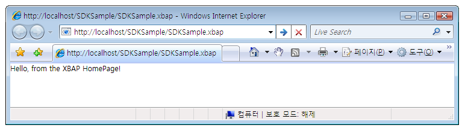  
  
> [!NOTE]
>  개발 및 배포에 대 한 자세한 내용은 [!INCLUDE[TLA2#tla_xbap#plural](../../../../includes/tla2sharptla-xbapsharpplural-md.md)], 참조 [WPF XAML 브라우저 응용 프로그램 개요](../../../../docs/framework/wpf/app-development/wpf-xaml-browser-applications-overview.md) 및 [WPF 응용 프로그램 배포](../../../../docs/framework/wpf/app-development/deploying-a-wpf-application-wpf.md)합니다.  
  
   
### 호스트 창 제목, 너비 및 높이 구성  
 위의 그림에서 알 수 있습니다는 한 가지 브라우저와 탭 패널의 제목이 된다는 점입니다는 [!INCLUDE[TLA2#tla_uri](../../../../includes/tla2sharptla-uri-md.md)] 에 대 한는 [!INCLUDE[TLA2#tla_xbap](../../../../includes/tla2sharptla-xbap-md.md)]합니다. 이 제목은 길이가 길며 모양이나 정보 제공 측면 모두에서 그다지 유용하지 않습니다. 이러한 이유로 <xref:System.Windows.Controls.Page> 제목을 설정 하 여 변경할 수 있는 방법을 제공는 <xref:System.Windows.Controls.Page.WindowTitle%2A> 속성입니다. 설정 하 여 브라우저 창의 높이 너비를 구성할 수는 또한 <xref:System.Windows.Controls.Page.WindowWidth%2A> 및 <xref:System.Windows.Controls.Page.WindowHeight%2A>각각.  
  
 <xref:System.Windows.Controls.Page.WindowTitle%2A><xref:System.Windows.Controls.Page.WindowWidth%2A>, 및 <xref:System.Windows.Controls.Page.WindowHeight%2A> 에서 설정할 수 있습니다 선언적으로 태그를 다음 예제와 같이 합니다.  
  
 [!code-xaml[NavigationOverviewSnippets#HomePageMARKUP](../../../../samples/snippets/csharp/VS_Snippets_Wpf/NavigationOverviewSnippets/CSharp/HomePage.xaml#homepagemarkup)]  
  
 결과는 다음 그림에 나와 있습니다.  
  
   
  
   
### 하이퍼링크 탐색  
 일반적인 [!INCLUDE[TLA2#tla_xbap](../../../../includes/tla2sharptla-xbap-md.md)] 여러 페이지로 구성 됩니다. 사용 하는 다른 페이지 간에 탐색 하는 가장 간단한 방법은 <xref:System.Windows.Documents.Hyperlink>합니다. 선언적으로 추가할 수는 <xref:System.Windows.Documents.Hyperlink> 에 <xref:System.Windows.Controls.Page> 를 사용 하 여는 `Hyperlink` 다음 태그에 표시 된 요소입니다.  
  
 [!code-xaml[NavigationOverviewSnippets#HyperlinkXAML1](../../../../samples/snippets/csharp/VS_Snippets_Wpf/NavigationOverviewSnippets/CSharp/PageWithHyperlink.xaml#hyperlinkxaml1)]  
[!code-xaml[NavigationOverviewSnippets#HyperlinkXAML2](../../../../samples/snippets/csharp/VS_Snippets_Wpf/NavigationOverviewSnippets/CSharp/PageWithHyperlink.xaml#hyperlinkxaml2)]  
[!code-xaml[NavigationOverviewSnippets#HyperlinkXAML3](../../../../samples/snippets/csharp/VS_Snippets_Wpf/NavigationOverviewSnippets/CSharp/PageWithHyperlink.xaml#hyperlinkxaml3)]  
  
 A `Hyperlink` 요소는 다음이 필요 합니다.  
  
-   팩 [!INCLUDE[TLA2#tla_uri](../../../../includes/tla2sharptla-uri-md.md)] 의 <xref:System.Windows.Controls.Page> 찾을 지정 된 대로 `NavigateUri` 특성입니다.  
  
-   텍스트와 이미지 같은 탐색을 시작 하는 사용자가 클릭할 수 콘텐츠 (콘텐츠에 대 한 하 여 `Hyperlink` 요소 수 포함 된 참조 하십시오 <xref:System.Windows.Documents.Hyperlink>) 합니다.  
  
 다음 그림에서는 한 [!INCLUDE[TLA2#tla_xbap](../../../../includes/tla2sharptla-xbap-md.md)] 와 <xref:System.Windows.Controls.Page> 올려진는 <xref:System.Windows.Documents.Hyperlink>합니다.  
  
 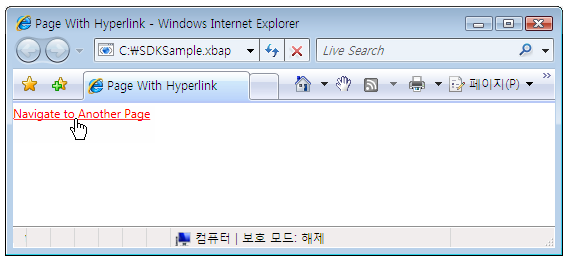  
  
 와 마찬가지로를 클릭 하는 <xref:System.Windows.Documents.Hyperlink> 하면는 [!INCLUDE[TLA2#tla_xbap](../../../../includes/tla2sharptla-xbap-md.md)] 으로 이동 하는 <xref:System.Windows.Controls.Page> 으로 식별 되는 `NavigateUri` 특성입니다. 또한는 [!INCLUDE[TLA2#tla_xbap](../../../../includes/tla2sharptla-xbap-md.md)] 이전 항목을 추가 <xref:System.Windows.Controls.Page> 최근 페이지 목록에 [!INCLUDE[TLA2#tla_ie](../../../../includes/tla2sharptla-ie-md.md)]합니다. 다음 그림에서 이를 확인할 수 있습니다.  
  
 ![[뒤로] 및 [앞으로] 단추](../../../../docs/framework/wpf/app-development/media/navigationoverviewfigure4.png "NavigationOverviewFigure4")  
  
 하나에서 탐색을 지원할 뿐만 아니라 <xref:System.Windows.Controls.Page> 다른 <xref:System.Windows.Documents.Hyperlink> 조각 탐색도 지원 합니다.  
  
   
### 조각 탐색  
 *조각 탐색* 에서 콘텐츠 조각 탐색은 현재 <xref:System.Windows.Controls.Page> 또는 다른 <xref:System.Windows.Controls.Page>합니다. [!INCLUDE[TLA2#tla_wpf](../../../../includes/tla2sharptla-wpf-md.md)], 콘텐츠 조각이 명명된 된 요소에 포함 된 내용입니다. 명명된 된 요소를 가진 요소가 해당 `Name` 특성이 설정 합니다. 다음 태그는 명명 된 표시 `TextBlock` 콘텐츠 조각을 포함 하는 요소입니다.  
  
 [!code-xaml[NavigationOverviewSnippets#PageWithContentFragmentsMARKUP1](../../../../samples/snippets/csharp/VS_Snippets_Wpf/NavigationOverviewSnippets/CSharp/PageWithFragments.xaml#pagewithcontentfragmentsmarkup1)]  
[!code-xaml[NavigationOverviewSnippets#PageWithContentFragmentsMARKUP2](../../../../samples/snippets/csharp/VS_Snippets_Wpf/NavigationOverviewSnippets/CSharp/PageWithFragments.xaml#pagewithcontentfragmentsmarkup2)]  
[!code-xaml[NavigationOverviewSnippets#PageWithContentFragmentsMARKUP3](../../../../samples/snippets/csharp/VS_Snippets_Wpf/NavigationOverviewSnippets/CSharp/PageWithFragments.xaml#pagewithcontentfragmentsmarkup3)]  
  
 에 대 한는 <xref:System.Windows.Documents.Hyperlink> 콘텐츠 조각 탐색 하는 `NavigateUri` 특성에서 다음을 포함 해야 합니다.  
  
-   [!INCLUDE[TLA2#tla_uri](../../../../includes/tla2sharptla-uri-md.md)] 의 <xref:System.Windows.Controls.Page> 콘텐츠 조각이 이동할 수 있습니다.  
  
-   “#” 문자입니다.  
  
-   요소 이름에서 <xref:System.Windows.Controls.Page> 콘텐츠 조각을 포함 하는 합니다.  
  
 조각 [!INCLUDE[TLA2#tla_uri](../../../../includes/tla2sharptla-uri-md.md)] 형식은 다음과 같습니다.  
  
 *PageURI* `#` *ElementName*  
  
 다음 예를 보여 줍니다.는 `Hyperlink` 콘텐츠 조각 탐색 하도록 구성 된 합니다.  
  
 [!code-xaml[NavigationOverviewSnippets#PageThatNavigatesXAML1](../../../../samples/snippets/csharp/VS_Snippets_Wpf/NavigationOverviewSnippets/CSharp/PageThatNavigatesToFragment.xaml#pagethatnavigatesxaml1)]  
[!code-xaml[NavigationOverviewSnippets#PageThatNavigatesXAML2](../../../../samples/snippets/csharp/VS_Snippets_Wpf/NavigationOverviewSnippets/CSharp/PageThatNavigatesToFragment.xaml#pagethatnavigatesxaml2)]  
[!code-xaml[NavigationOverviewSnippets#PageThatNavigatesXAML3](../../../../samples/snippets/csharp/VS_Snippets_Wpf/NavigationOverviewSnippets/CSharp/PageThatNavigatesToFragment.xaml#pagethatnavigatesxaml3)]  
  
> [!NOTE]
>  이 섹션에서는 기본 조각 탐색 구현에서 설명 [!INCLUDE[TLA2#tla_wpf](../../../../includes/tla2sharptla-wpf-md.md)]합니다. [!INCLUDE[TLA2#tla_wpf](../../../../includes/tla2sharptla-wpf-md.md)] 부분적으로 처리를 필요로 하는 사용자 고유의 조각 탐색 체계를 구현할 수 있습니다는 <xref:System.Windows.Navigation.NavigationService.FragmentNavigation?displayProperty=nameWithType> 이벤트입니다.  
  
> [!IMPORTANT]
>  느슨한의 조각으로 이동할 수 있습니다 [!INCLUDE[TLA2#tla_xaml](../../../../includes/tla2sharptla-xaml-md.md)] 페이지 (태그 전용 [!INCLUDE[TLA2#tla_xaml](../../../../includes/tla2sharptla-xaml-md.md)] 확장명이 `Page` 루트 요소로)를 통해 페이지를 찾아볼 수 있는 경우에 [!INCLUDE[TLA2#tla_http](../../../../includes/tla2sharptla-http-md.md)]합니다.  
>   
>  그러나 느슨한 [!INCLUDE[TLA2#tla_xaml](../../../../includes/tla2sharptla-xaml-md.md)] 페이지 자체 조각을 탐색할 수 있습니다.  
  
   
### 탐색 서비스  
 동안 <xref:System.Windows.Documents.Hyperlink> 사용자가을 특정 탐색 시작 하도록 허용 <xref:System.Windows.Controls.Page>를 찾아서 페이지 다운로드 작업을 수행한는 <xref:System.Windows.Navigation.NavigationService> 클래스. 기본적으로, <xref:System.Windows.Navigation.NavigationService> 와 같은 클라이언트 코드를 대신 하 여 탐색 요청을 처리 하는 기능을 제공 된 <xref:System.Windows.Documents.Hyperlink>합니다. 또한 <xref:System.Windows.Navigation.NavigationService> 를 추적 하 고 탐색 요청에 영향을 주는 상위 수준 지원을 구현 합니다.  
  
 경우는 <xref:System.Windows.Documents.Hyperlink> 를 클릭 하면 [!INCLUDE[TLA2#tla_wpf](../../../../includes/tla2sharptla-wpf-md.md)] 호출 <xref:System.Windows.Navigation.NavigationService.Navigate%2A?displayProperty=nameWithType> 을 찾아 다운로드는 <xref:System.Windows.Controls.Page> 지정 팩 [!INCLUDE[TLA2#tla_uri](../../../../includes/tla2sharptla-uri-md.md)]합니다. 다운로드 한 <xref:System.Windows.Controls.Page> 루트 개체가 있는 다운로드 한의 인스턴스인 개체 트리를 변환할 <xref:System.Windows.Controls.Page>합니다. 루트에 대 한 참조 <xref:System.Windows.Controls.Page> 에 개체가 보관 되어는 <xref:System.Windows.Navigation.NavigationService.Content%2A?displayProperty=nameWithType> 속성입니다. 팩 [!INCLUDE[TLA2#tla_uri](../../../../includes/tla2sharptla-uri-md.md)] 탐색 된 콘텐츠에 저장 됩니다에 대 한는 <xref:System.Windows.Navigation.NavigationService.Source%2A?displayProperty=nameWithType> 속성을 동안는 <xref:System.Windows.Navigation.NavigationService.CurrentSource%2A?displayProperty=nameWithType> pack 저장 [!INCLUDE[TLA2#tla_uri](../../../../includes/tla2sharptla-uri-md.md)] 탐색 된 마지막 페이지에 대 한 합니다.  
  
> [!NOTE]
>  에 대 한 수는 [!INCLUDE[TLA2#tla_wpf](../../../../includes/tla2sharptla-wpf-md.md)] 응용 프로그램을 두 개 이상을 가질 현재 활성 <xref:System.Windows.Navigation.NavigationService>합니다. 자세한 내용은 참조 [탐색 호스트](#Navigation_Hosts) 이 항목의 뒷부분에 나오는 합니다.  
  
   
### 탐색 서비스를 사용하여 프로그래밍 방식으로 탐색  
 에 대 한 알 필요가 없습니다 <xref:System.Windows.Navigation.NavigationService> 탐색에 태그를 사용 하 여 선언적으로 구현 된 경우 <xref:System.Windows.Documents.Hyperlink>때문에, <xref:System.Windows.Documents.Hyperlink> 사용 하 여는 <xref:System.Windows.Navigation.NavigationService> 사용자 대신 합니다. 즉, 직접 또는 간접 부모 같으면는 <xref:System.Windows.Documents.Hyperlink> 탐색 호스트 (참조 [탐색 호스트](#Navigation_Hosts)), <xref:System.Windows.Documents.Hyperlink> 찾아 탐색 호스트 탐색 서비스를 사용 하 여 처리 하는 작업을 할 수 있습니다는 탐색 요청입니다.  
  
 그러나 경우가 있습니다 사용할 필요가 <xref:System.Windows.Navigation.NavigationService> 를 직접 다음을 포함 한:  
  
-   인스턴스화하 해야 하는 경우는 <xref:System.Windows.Controls.Page> 기본이 아닌 생성자를 사용 하 여 합니다.  
  
-   속성을 설정 해야 하는 경우는 <xref:System.Windows.Controls.Page> 이동 하기 전에.  
  
-   경우는 <xref:System.Windows.Controls.Page> 필요한 탐색만 결정할 수 있도록 런타임에 합니다.  
  
 프로그래밍 방식으로 호출 하 여 탐색을 시작 하는 코드를 작성 해야 이러한 경우에는 <xref:System.Windows.Navigation.NavigationService.Navigate%2A> 의 메서드는 <xref:System.Windows.Navigation.NavigationService> 개체입니다. 가져오기에 대 한 참조를 필요로 하는 <xref:System.Windows.Navigation.NavigationService>합니다.  
  
#### NavigationService에 대한 참조 가져오기  
 설명 하는 이유로 [탐색 호스트](#Navigation_Hosts) 섹션은 [!INCLUDE[TLA2#tla_wpf](../../../../includes/tla2sharptla-wpf-md.md)] 응용 프로그램에서 둘 이상의 <xref:System.Windows.Navigation.NavigationService>합니다. 즉, 코드를 찾는 방법을 <xref:System.Windows.Navigation.NavigationService>,이 일반적으로 <xref:System.Windows.Navigation.NavigationService> 현재 탐색 <xref:System.Windows.Controls.Page>합니다. 에 대 한 참조를 가져올 수 있습니다는 <xref:System.Windows.Navigation.NavigationService> 호출 하 여는 `static` <xref:System.Windows.Navigation.NavigationService.GetNavigationService%2A?displayProperty=nameWithType> 메서드. 가져오려는 <xref:System.Windows.Navigation.NavigationService> 탐색 하는 특정 <xref:System.Windows.Controls.Page>에 대 한 참조는 <xref:System.Windows.Controls.Page> 의 인수로 <xref:System.Windows.Navigation.NavigationService.GetNavigationService%2A> 메서드. 다음 코드를 가져오는 방법을 보여 줍니다는 <xref:System.Windows.Navigation.NavigationService> 현재 <xref:System.Windows.Controls.Page>합니다.  
  
 [!code-csharp[NavigationOverviewSnippets#GetNSCODEBEHIND1](../../../../samples/snippets/csharp/VS_Snippets_Wpf/NavigationOverviewSnippets/CSharp/GetNSPage.xaml.cs#getnscodebehind1)]  
[!code-csharp[NavigationOverviewSnippets#GetNSCODEBEHIND2](../../../../samples/snippets/csharp/VS_Snippets_Wpf/NavigationOverviewSnippets/CSharp/GetNSPage.xaml.cs#getnscodebehind2)]
[!code-vb[NavigationOverviewSnippets#GetNSCODEBEHIND2](../../../../samples/snippets/visualbasic/VS_Snippets_Wpf/NavigationOverviewSnippets/VisualBasic/GetNSPage.xaml.vb#getnscodebehind2)]  
  
 찾기에 대 한 바로 가기로 <xref:System.Windows.Navigation.NavigationService> 에 대 한는 <xref:System.Windows.Controls.Page>, <xref:System.Windows.Controls.Page> 구현 하는 <xref:System.Windows.Controls.Page.NavigationService%2A> 속성입니다. 다음 예제에서 이를 확인할 수 있습니다.  
  
 [!code-csharp[NavigationOverviewSnippets#GetNSShortcutCODEBEHIND1](../../../../samples/snippets/csharp/VS_Snippets_Wpf/NavigationOverviewSnippets/CSharp/GetNSPageShortCut.xaml.cs#getnsshortcutcodebehind1)]  
[!code-csharp[NavigationOverviewSnippets#GetNSShortcutCODEBEHIND2](../../../../samples/snippets/csharp/VS_Snippets_Wpf/NavigationOverviewSnippets/CSharp/GetNSPageShortCut.xaml.cs#getnsshortcutcodebehind2)]
[!code-vb[NavigationOverviewSnippets#GetNSShortcutCODEBEHIND2](../../../../samples/snippets/visualbasic/VS_Snippets_Wpf/NavigationOverviewSnippets/VisualBasic/GetNSPageShortCut.xaml.vb#getnsshortcutcodebehind2)]  
  
> [!NOTE]
>  A <xref:System.Windows.Controls.Page> 에 대 한 참조를 가져올 수만 해당 <xref:System.Windows.Navigation.NavigationService> 때 <xref:System.Windows.Controls.Page> 발생는 <xref:System.Windows.FrameworkElement.Loaded> 이벤트 합니다.  
  
#### 프로그래밍 방식으로 Page 개체 탐색  
 사용 하는 방법을 보여 주는 다음 예제는 <xref:System.Windows.Navigation.NavigationService> 으로 프로그래밍 방식으로 이동 하는 <xref:System.Windows.Controls.Page>합니다. 프로그래밍 방식 탐색이 필요 하기 때문에 <xref:System.Windows.Controls.Page> 즉 탐색 중인 인스턴스화할 수를 단일 기본이 아닌 생성자를 사용 하 여 합니다. <xref:System.Windows.Controls.Page> 기본이 아닌 생성자와 함께 다음 태그와 코드에 표시 됩니다.  
  
 [!code-xaml[NavigationOverviewSnippets#PageWithNonDefaultConstructorXAML](../../../../samples/snippets/csharp/VS_Snippets_Wpf/NavigationOverviewSnippets/CSharp/PageWithNonDefaultConstructor.xaml#pagewithnondefaultconstructorxaml)]  
  
 [!code-csharp[NavigationOverviewSnippets#PageWithNonDefaultConstructorCODEBEHIND](../../../../samples/snippets/csharp/VS_Snippets_Wpf/NavigationOverviewSnippets/CSharp/PageWithNonDefaultConstructor.xaml.cs#pagewithnondefaultconstructorcodebehind)]
 [!code-vb[NavigationOverviewSnippets#PageWithNonDefaultConstructorCODEBEHIND](../../../../samples/snippets/visualbasic/VS_Snippets_Wpf/NavigationOverviewSnippets/VisualBasic/PageWithNonDefaultConstructor.xaml.vb#pagewithnondefaultconstructorcodebehind)]  
  
 <xref:System.Windows.Controls.Page> 를 탐색 하 고 <xref:System.Windows.Controls.Page> 기본이 아닌 생성자와 함께 다음 태그와 코드에 표시 됩니다.  
  
 [!code-xaml[NavigationOverviewSnippets#NSNavigationPageXAML](../../../../samples/snippets/csharp/VS_Snippets_Wpf/NavigationOverviewSnippets/CSharp/NSNavigationPage.xaml#nsnavigationpagexaml)]  
  
 [!code-csharp[NavigationOverviewSnippets#NSNavigationPageCODEBEHIND](../../../../samples/snippets/csharp/VS_Snippets_Wpf/NavigationOverviewSnippets/CSharp/NSNavigationPage.xaml.cs#nsnavigationpagecodebehind)]
 [!code-vb[NavigationOverviewSnippets#NSNavigationPageCODEBEHIND](../../../../samples/snippets/visualbasic/VS_Snippets_Wpf/NavigationOverviewSnippets/VisualBasic/NSNavigationPage.xaml.vb#nsnavigationpagecodebehind)]  
  
 때는 <xref:System.Windows.Documents.Hyperlink> 이 <xref:System.Windows.Controls.Page> 은 클릭 하면 탐색을 시작 인스턴스화는 <xref:System.Windows.Controls.Page> 폴더로 이동 하는 기본이 아닌 생성자를 사용 하 고 호출 하는 <xref:System.Windows.Navigation.NavigationService.Navigate%2A?displayProperty=nameWithType> 메서드. <xref:System.Windows.Navigation.NavigationService.Navigate%2A> 개체에 대 한 참조를 허용 하는 <xref:System.Windows.Navigation.NavigationService> 팩 하는 대신,로 이동 됩니다 [!INCLUDE[TLA2#tla_uri](../../../../includes/tla2sharptla-uri-md.md)]합니다.  
  
#### Pack URI를 사용하여 프로그래밍 방식으로 탐색  
 팩을 생성 하는 경우 [!INCLUDE[TLA2#tla_uri](../../../../includes/tla2sharptla-uri-md.md)] 프로그래밍 방식으로 (팩을만 확인할 수 있습니다 때 [!INCLUDE[TLA2#tla_uri](../../../../includes/tla2sharptla-uri-md.md)] 런타임에만 예를 들어)를 사용할 수 있습니다는 <xref:System.Windows.Navigation.NavigationService.Navigate%2A?displayProperty=nameWithType> 메서드. 다음 예제에서 이를 확인할 수 있습니다.  
  
 [!code-xaml[NavigationOverviewSnippets#NSUriNavigationPageXAML](../../../../samples/snippets/csharp/VS_Snippets_Wpf/NavigationOverviewSnippets/CSharp/NSUriNavigationPage.xaml#nsurinavigationpagexaml)]  
  
 [!code-csharp[NavigationOverviewSnippets#NSUriNavigationPageCODEBEHIND](../../../../samples/snippets/csharp/VS_Snippets_Wpf/NavigationOverviewSnippets/CSharp/NSUriNavigationPage.xaml.cs#nsurinavigationpagecodebehind)]
 [!code-vb[NavigationOverviewSnippets#NSUriNavigationPageCODEBEHIND](../../../../samples/snippets/visualbasic/VS_Snippets_Wpf/NavigationOverviewSnippets/VisualBasic/NSUriNavigationPage.xaml.vb#nsurinavigationpagecodebehind)]  
  
#### 현재 페이지 새로 고침  
 A <xref:System.Windows.Controls.Page> 동일한 팩 있으면 다운로드 되지 [!INCLUDE[TLA2#tla_uri](../../../../includes/tla2sharptla-uri-md.md)] 팩과 [!INCLUDE[TLA2#tla_uri](../../../../includes/tla2sharptla-uri-md.md)] 에 저장 된는 <xref:System.Windows.Navigation.NavigationService.Source%2A?displayProperty=nameWithType> 속성입니다. 강제로 [!INCLUDE[TLA2#tla_wpf](../../../../includes/tla2sharptla-wpf-md.md)] 현재 페이지를 다시 다운로드 해 호출할 수 있습니다는 <xref:System.Windows.Navigation.NavigationService.Refresh%2A?displayProperty=nameWithType> 메서드를 다음 예제와 같이 합니다.  
  
 [!code-xaml[NavigationOverviewSnippets#NSRefreshNavigationPageXAML1](../../../../samples/snippets/csharp/VS_Snippets_Wpf/NavigationOverviewSnippets/CSharp/NSRefreshNavigationPage.xaml#nsrefreshnavigationpagexaml1)]  
  
 [!code-csharp[NavigationOverviewSnippets#NSRefreshNavigationPageCODEBEHIND1](../../../../samples/snippets/csharp/VS_Snippets_Wpf/NavigationOverviewSnippets/CSharp/NSRefreshNavigationPage.xaml.cs#nsrefreshnavigationpagecodebehind1)]
 [!code-vb[NavigationOverviewSnippets#NSRefreshNavigationPageCODEBEHIND1](../../../../samples/snippets/visualbasic/VS_Snippets_Wpf/NavigationOverviewSnippets/VisualBasic/NSRefreshNavigationPage.xaml.vb#nsrefreshnavigationpagecodebehind1)]  
[!code-csharp[NavigationOverviewSnippets#NSRefreshNavigationPageCODEBEHIND2](../../../../samples/snippets/csharp/VS_Snippets_Wpf/NavigationOverviewSnippets/CSharp/NSRefreshNavigationPage.xaml.cs#nsrefreshnavigationpagecodebehind2)]
[!code-vb[NavigationOverviewSnippets#NSRefreshNavigationPageCODEBEHIND2](../../../../samples/snippets/visualbasic/VS_Snippets_Wpf/NavigationOverviewSnippets/VisualBasic/NSRefreshNavigationPage.xaml.vb#nsrefreshnavigationpagecodebehind2)]  
  
   
### 탐색 수명  
 지금까지 본 것처럼 탐색을 시작하는 방법은 여러 가지가 있습니다. 탐색을 시작을 추적 하 고 구현 하는 다음 이벤트를 사용 하 여 탐색에 영향을 줄 수 탐색 진행 중에서 상태인 동안 <xref:System.Windows.Navigation.NavigationService>:  
  
-   <xref:System.Windows.Navigation.NavigationService.Navigating>. 새 탐색이 요청되면 발생합니다. 탐색을 취소하는 데 사용될 수 있습니다.  
  
-   <xref:System.Windows.Navigation.NavigationService.NavigationProgress>. 탐색 진행 정보를 제공하기 위해 다운로드하는 동안 정기적으로 발생합니다.  
  
-   <xref:System.Windows.Navigation.NavigationService.Navigated>. 페이지를 찾아서 다운로드할 때 발생합니다.  
  
-   <xref:System.Windows.Navigation.NavigationService.NavigationStopped>. 탐색이 중지 될 때 발생 합니다. (호출 하 여 <xref:System.Windows.Navigation.NavigationService.StopLoading%2A>), 새 탐색 요청 될 경우에 현재 탐색 진행 중인 동안 또는 합니다.  
  
-   <xref:System.Windows.Navigation.NavigationService.NavigationFailed>. 요청된 콘텐츠를 탐색하는 동안 오류가 있으면 발생합니다.  
  
-   <xref:System.Windows.Navigation.NavigationService.LoadCompleted>. 탐색된 콘텐츠가 로드 및 구문 분석되고 렌더링을 시작할 때 발생합니다.  
  
-   <xref:System.Windows.Navigation.NavigationService.FragmentNavigation>. 다음과 같이 콘텐츠 조각에 대한 탐색이 시작될 때 발생합니다.  
  
    -   원하는 조각이 현재 콘텐츠에 있는 경우 즉시  
  
    -   소스 콘텐츠를 로드한 후 다른 콘텐츠에 원하는 조각이 있는 경우  
  
 탐색 이벤트는 다음 그림과 같이 순서대로 발생합니다.  
  
 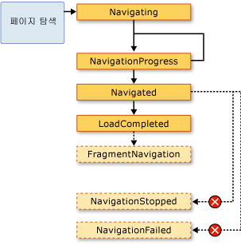  
  
 일반적으로 <xref:System.Windows.Controls.Page> 이러한 이벤트는 관련이 없습니다. 프로그램과 응용 프로그램 관련 될 하 고, 따라서 이러한 이벤트는 또한에서 되었을 가능성이 <xref:System.Windows.Application> 클래스:  
  
-   <xref:System.Windows.Application.Navigating?displayProperty=nameWithType>  
  
-   <xref:System.Windows.Application.NavigationProgress?displayProperty=nameWithType>  
  
-   <xref:System.Windows.Application.Navigated?displayProperty=nameWithType>  
  
-   <xref:System.Windows.Application.NavigationFailed?displayProperty=nameWithType>  
  
-   <xref:System.Windows.Application.NavigationStopped?displayProperty=nameWithType>  
  
-   <xref:System.Windows.Application.LoadCompleted?displayProperty=nameWithType>  
  
-   <xref:System.Windows.Application.FragmentNavigation?displayProperty=nameWithType>  
  
 때마다 <xref:System.Windows.Navigation.NavigationService> 이벤트를 발생 시킨는 <xref:System.Windows.Application> 클래스에 해당 하는 이벤트를 발생 시킵니다. <xref:System.Windows.Controls.Frame> 및 <xref:System.Windows.Navigation.NavigationWindow> 해당 범위 내의 탐색을 검색 하려면 동일한 이벤트를 제공 합니다.  
  
 일부 경우에는 <xref:System.Windows.Controls.Page> 이러한 이벤트에 관심이 있을 수도 있습니다. 예를 들어 한 <xref:System.Windows.Controls.Page> 처리할 수 있습니다는 <xref:System.Windows.Navigation.NavigationService.Navigating?displayProperty=nameWithType> 자체 탐색을 취소할지 여부를 결정 하기 위해 이벤트입니다. 다음 예제에서 이를 확인할 수 있습니다.  
  
 [!code-xaml[NavigationOverviewSnippets#CancelNavigationPageXAML](../../../../samples/snippets/csharp/VS_Snippets_Wpf/NavigationOverviewSnippets/CSharp/CancelNavigationPage.xaml#cancelnavigationpagexaml)]  
  
 [!code-csharp[NavigationOverviewSnippets#CancelNavigationPageCODEBEHIND](../../../../samples/snippets/csharp/VS_Snippets_Wpf/NavigationOverviewSnippets/CSharp/CancelNavigationPage.xaml.cs#cancelnavigationpagecodebehind)]
 [!code-vb[NavigationOverviewSnippets#CancelNavigationPageCODEBEHIND](../../../../samples/snippets/visualbasic/VS_Snippets_Wpf/NavigationOverviewSnippets/VisualBasic/CancelNavigationPage.xaml.vb#cancelnavigationpagecodebehind)]  
  
 으로 탐색 이벤트 처리기를 등록 하는 경우는 <xref:System.Windows.Controls.Page>, 앞의 예제 처럼도 등록을 취소 해야 이벤트 처리기입니다. 이렇게 하지 않으면 있을 수 있습니다는 방법에 대해 부작용 [!INCLUDE[TLA2#tla_wpf](../../../../includes/tla2sharptla-wpf-md.md)] 탐색 기억 <xref:System.Windows.Controls.Page> 저널을 사용 하 여 탐색 합니다.  
  
   
### 저널을 사용하여 탐색 기억  
 [!INCLUDE[TLA2#tla_wpf](../../../../includes/tla2sharptla-wpf-md.md)]는 두 개의 스택(뒤로 스택 및 앞으로 스택)을 사용하여 탐색한 페이지를 기억합니다. 현재에서 이동할 때 <xref:System.Windows.Controls.Page> 새 <xref:System.Windows.Controls.Page> 또는 기존 전달 <xref:System.Windows.Controls.Page>, 현재 <xref:System.Windows.Controls.Page> 에 추가 되는 *백 스택에*합니다. 현재에서 이동할 때 <xref:System.Windows.Controls.Page> 하는 이전 <xref:System.Windows.Controls.Page>, 현재 <xref:System.Windows.Controls.Page> 에 추가 되는 *정방향 스택에*합니다. 뒤로 스택, 앞으로 스택 및 이들을 관리하는 기능을 총칭하여 저널이라고 합니다. 백 스택 및 정방향 스택에 각 항목은의 인스턴스는 <xref:System.Windows.Navigation.JournalEntry> 클래스 라고 하 고는 *업무 일지 항목*합니다.  
  
#### Internet Explorer에서 저널 탐색  
 저널 동일 하 게 작동 개념적으로 방식으로 **다시** 및 **앞으로** 단추 [!INCLUDE[TLA2#tla_ie](../../../../includes/tla2sharptla-ie-md.md)] 않습니다. 다음 그림을 참조하세요.  
  
 ![[뒤로] 및 [앞으로] 단추](../../../../docs/framework/wpf/app-development/media/navigationoverviewfigure4.png "NavigationOverviewFigure4")  
  
 에 대 한 [!INCLUDE[TLA2#tla_xbap#plural](../../../../includes/tla2sharptla-xbapsharpplural-md.md)] 에서 호스팅되는 [!INCLUDE[TLA2#tla_ie](../../../../includes/tla2sharptla-ie-md.md)], [!INCLUDE[TLA2#tla_wpf](../../../../includes/tla2sharptla-wpf-md.md)] 탐색에는 저널 통합 [!INCLUDE[TLA2#tla_ui](../../../../includes/tla2sharptla-ui-md.md)] 의 [!INCLUDE[TLA2#tla_ie](../../../../includes/tla2sharptla-ie-md.md)]합니다. 따라서 사용자 페이지를 탐색할 수 있습니다는 [!INCLUDE[TLA2#tla_xbap](../../../../includes/tla2sharptla-xbap-md.md)] 를 사용 하 여는 **다시**, **앞으로**, 및 **최신 페이지** 단추 [!INCLUDE[TLA2#tla_ie](../../../../includes/tla2sharptla-ie-md.md)]합니다. 업무 일지에 통합 되지 않은 [!INCLUDE[TLA2#tla_ie6](../../../../includes/tla2sharptla-ie6-md.md)] 은 같은 방식으로 [!INCLUDE[TLA2#tla_ie7](../../../../includes/tla2sharptla-ie7-md.md)] 또는 Internet Explorer 8입니다. 대신, [!INCLUDE[TLA2#tla_wpf](../../../../includes/tla2sharptla-wpf-md.md)] 대체 탐색 렌더링 [!INCLUDE[TLA2#tla_ui](../../../../includes/tla2sharptla-ui-md.md)]합니다.  
  
> [!IMPORTANT]
>  [!INCLUDE[TLA2#tla_ie](../../../../includes/tla2sharptla-ie-md.md)], 사용자에서 멀리 이동, 다시로 [!INCLUDE[TLA2#tla_xbap](../../../../includes/tla2sharptla-xbap-md.md)], 업무 일지에 활성 상태로 유지 된 페이지에 대 한 업무 일지 항목만 유지 됩니다. 페이지를 활성 상태로 유지에 논의 알려면 [페이지 수명 및 저널](#PageLifetime) 이 항목의 뒷부분에 나오는 합니다.  
  
 기본적으로 각각에 대 한 텍스트 <xref:System.Windows.Controls.Page> 에 표시 되는 **최신 페이지** 목록이 [!INCLUDE[TLA2#tla_ie](../../../../includes/tla2sharptla-ie-md.md)] 는 [!INCLUDE[TLA2#tla_uri](../../../../includes/tla2sharptla-uri-md.md)] 에 대 한는 <xref:System.Windows.Controls.Page>합니다. 대부분의 경우 이는 사용자에게 특히 의미가 없습니다. 다행히도 다음 옵션 중 하나를 사용하여 텍스트를 변경할 수 있습니다.  
  
1.  첨부 된 `JournalEntry.Name` 특성 값입니다.  
  
2.  `Page.Title` 특성 값입니다.  
  
3.  `Page.WindowTitle` 특성 값 및 [!INCLUDE[TLA2#tla_uri](../../../../includes/tla2sharptla-uri-md.md)] 현재 <xref:System.Windows.Controls.Page>합니다.  
  
4.  현재 [!INCLUDE[TLA2#tla_uri](../../../../includes/tla2sharptla-uri-md.md)]에 대한 <xref:System.Windows.Controls.Page>입니다. (기본값)  
  
 옵션이 나열되는 순서는 텍스트를 찾는 우선 순위와 일치합니다. 예를 들어 경우 `JournalEntry.Name` 설정, 다른 값은 무시 됩니다.  
  
 다음 예제에서는 `Page.Title` 업무 일지 항목에 대 한 표시 되는 텍스트를 변경할 특성입니다.  
  
 [!code-xaml[NavigationOverviewSnippets#PageTitleMARKUP1](../../../../samples/snippets/csharp/VS_Snippets_Wpf/NavigationOverviewSnippets/CSharp/PageWithTitle.xaml#pagetitlemarkup1)]  
[!code-xaml[NavigationOverviewSnippets#PageTitleMARKUP2](../../../../samples/snippets/csharp/VS_Snippets_Wpf/NavigationOverviewSnippets/CSharp/PageWithTitle.xaml#pagetitlemarkup2)]  
  
 [!code-csharp[NavigationOverviewSnippets#PageTitleCODEBEHIND1](../../../../samples/snippets/csharp/VS_Snippets_Wpf/NavigationOverviewSnippets/CSharp/PageWithTitle.xaml.cs#pagetitlecodebehind1)]
 [!code-vb[NavigationOverviewSnippets#PageTitleCODEBEHIND1](../../../../samples/snippets/visualbasic/VS_Snippets_Wpf/NavigationOverviewSnippets/VisualBasic/PageWithTitle.xaml.vb#pagetitlecodebehind1)]  
[!code-csharp[NavigationOverviewSnippets#PageTitleCODEBEHIND2](../../../../samples/snippets/csharp/VS_Snippets_Wpf/NavigationOverviewSnippets/CSharp/PageWithTitle.xaml.cs#pagetitlecodebehind2)]
[!code-vb[NavigationOverviewSnippets#PageTitleCODEBEHIND2](../../../../samples/snippets/visualbasic/VS_Snippets_Wpf/NavigationOverviewSnippets/VisualBasic/PageWithTitle.xaml.vb#pagetitlecodebehind2)]  
  
#### WPF를 사용하여 저널 탐색  
 사용자를 사용 하 여 업무 일지를 탐색할 수 있지만 **다시**, **앞으로**, 및 **최신 페이지** 에 [!INCLUDE[TLA2#tla_ie](../../../../includes/tla2sharptla-ie-md.md)]를 모두 사용 하 여 저널을 탐색할 수 있습니다 제공 하는 선언적 방법과 프로그래밍 메커니즘 [!INCLUDE[TLA2#tla_wpf](../../../../includes/tla2sharptla-wpf-md.md)]합니다. 이 작업을 수행 하는 이유는 사용자 지정 탐색을 제공 하기 [!INCLUDE[TLA2#tla_ui#plural](../../../../includes/tla2sharptla-uisharpplural-md.md)] 페이지에 있습니다.  
  
 저널 탐색 지원에 의해 노출 되는 탐색 명령을 사용 하 여 선언적으로 추가할 수 있습니다 <xref:System.Windows.Input.NavigationCommands>합니다. 다음 예제에서는 사용 하는 `BrowseBack` 탐색 명령입니다.  
  
 [!code-xaml[NavigationOverviewSnippets#NavigationCommandsPageXAML1](../../../../samples/snippets/csharp/VS_Snippets_Wpf/NavigationOverviewSnippets/CSharp/NavigationCommandsPage.xaml#navigationcommandspagexaml1)]  
[!code-xaml[NavigationOverviewSnippets#NavigationCommandsPageXAML2](../../../../samples/snippets/csharp/VS_Snippets_Wpf/NavigationOverviewSnippets/CSharp/NavigationCommandsPage.xaml#navigationcommandspagexaml2)]  
[!code-xaml[NavigationOverviewSnippets#NavigationCommandsPageXAML3](../../../../samples/snippets/csharp/VS_Snippets_Wpf/NavigationOverviewSnippets/CSharp/NavigationCommandsPage.xaml#navigationcommandspagexaml3)]  
[!code-xaml[NavigationOverviewSnippets#NavigationCommandsPageXAML4](../../../../samples/snippets/csharp/VS_Snippets_Wpf/NavigationOverviewSnippets/CSharp/NavigationCommandsPage.xaml#navigationcommandspagexaml4)]  
  
 저널의 다음 멤버 중 하나를 사용 하 여 프로그래밍 방식으로 탐색할 수 있습니다는 <xref:System.Windows.Navigation.NavigationService> 클래스:  
  
-   <xref:System.Windows.Navigation.NavigationService.GoBack%2A>  
  
-   <xref:System.Windows.Navigation.NavigationService.GoForward%2A>  
  
-   <xref:System.Windows.Navigation.NavigationService.CanGoBack%2A>  
  
-   <xref:System.Windows.Navigation.NavigationService.CanGoForward%2A>  
  
 업무 일지에 설명 된 대로 프로그래밍 조작할 수도 있습니다 [탐색 기록 콘텐츠 상태를 유지](#RetainingContentStateWithNavigationHistory) 이 항목의 뒷부분에 나오는 합니다.  
  
   
### 페이지 수명 및 저널  
 고려는 [!INCLUDE[TLA2#tla_xbap](../../../../includes/tla2sharptla-xbap-md.md)] 풍부한 콘텐츠를 포함 하는 여러 페이지가 포함 된 그래픽, 애니메이션 및 미디어를 포함 합니다. 이와 같은 페이지의 메모리 사용량은 특히 비디오 및 오디오 미디어가 사용될 경우 매우 클 수 있습니다. 저널은 페이지 탐색, 되었던 "기억" 하는 [!INCLUDE[TLA2#tla_xbap](../../../../includes/tla2sharptla-xbap-md.md)] 빠르게 꽤 많은 메모리를 소비할 수 있습니다.  
  
 이러한 이유로 기본 저널의 동작은 저장할 <xref:System.Windows.Controls.Page> 에 대 한 참조를 사용 하지 않고 각 업무 일지 항목의 메타 데이터는 <xref:System.Windows.Controls.Page> 개체입니다. 업무 일지 항목을 탐색할 때 해당 <xref:System.Windows.Controls.Page> 메타 데이터의 지정 된 새 인스턴스를 만드는 데 사용 되 <xref:System.Windows.Controls.Page>합니다. 결과적으로 각 <xref:System.Windows.Controls.Page> 를 탐색 하는 다음 그림에서 설명 하는 수명이 있습니다.  
  
 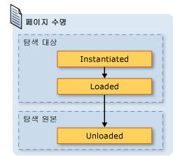  
  
 메모리 사용에 대 한 기본 저널링 동작을 사용 하 여 절약할 수 있습니다, 페이지당 렌더링 성능을 줄어들 수 있습니다. 재초기화를 <xref:System.Windows.Controls.Page> 시간이 많이 내용이 많은 경우에 특히 될 수 있습니다. 유지 해야 할 경우 한 <xref:System.Windows.Controls.Page> 인스턴스, 업무 일지에 이렇게 하는 두 가지 기술을에 그릴 수 있습니다. 먼저, 프로그래밍 방식으로 이동할 수는 <xref:System.Windows.Controls.Page> 호출 하 여 개체는 <xref:System.Windows.Navigation.NavigationService.Navigate%2A?displayProperty=nameWithType> 메서드.  
  
 둘째, 되도록 지정할 수 있습니다 [!INCLUDE[TLA2#tla_wpf](../../../../includes/tla2sharptla-wpf-md.md)] 의 인스턴스를 유지 한 <xref:System.Windows.Controls.Page> 설정 하 여 업무 일지에는 <xref:System.Windows.Controls.Page.KeepAlive%2A> 속성을 `true` (기본값은 `false`). 설정할 수 있습니다 다음 예에서 같이 <xref:System.Windows.Controls.Page.KeepAlive%2A> 태그에서 선언적으로 합니다.  
  
 [!code-xaml[NavigationOverviewSnippets#KeepAlivePageXAML](../../../../samples/snippets/csharp/VS_Snippets_Wpf/NavigationOverviewSnippets/CSharp/KeepAlivePage.xaml#keepalivepagexaml)]  
  
 수명을 <xref:System.Windows.Controls.Page> 즉 활성화가 유지 되지 않는 약간 다릅니다. 처음으로 <xref:System.Windows.Controls.Page> 유지 되는 연결 유지를 탐색 하는, 마찬가지로 인스턴스화된는 <xref:System.Windows.Controls.Page> 활성 상태로 유지 되지 않는 합니다. 그러나 때문에의 인스턴스는 <xref:System.Windows.Controls.Page> 보존 되는 업무 일지에 인스턴스화되지 않습니다 다시에 대 한 업무 일지에 남아 있는 기간과 같습니다. 따라서 경우는 <xref:System.Windows.Controls.Page> 될 때마다 호출 하는 초기화 논리에는 <xref:System.Windows.Controls.Page> 탐색, 해야에서 이동 하 고 생성자에 대 한 처리기에는 <xref:System.Windows.FrameworkElement.Loaded> 이벤트입니다. 다음 그림에 나와 있는 것 처럼는 <xref:System.Windows.FrameworkElement.Loaded> 및 <xref:System.Windows.FrameworkElement.Unloaded> 이벤트는 여전히 될 때마다 발생 한 <xref:System.Windows.Controls.Page> 에서 각각 탐색 합니다.  
  
 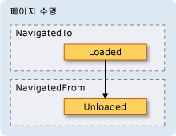  
  
 경우는 <xref:System.Windows.Controls.Page> 은 활성 상태로 유지 되지 해야 다음 중 하나:  
  
-   이 페이지 또는 이 페이지의 일부에 대한 참조 저장  
  
-   이벤트 처리기를 이 페이지에서 구현되지 않는 이벤트에 등록  
  
 강제 하는 참조를 생성은이 중 하나를 수행 하는 <xref:System.Windows.Controls.Page> 가 저널에서 제거 된 후에 메모리에 보존 될 수 있습니다.  
  
 일반적으로 기본 높여야 <xref:System.Windows.Controls.Page> 동작을 유지 하지 않는 한 <xref:System.Windows.Controls.Page> 연결 유지 합니다. 그러나 이는 다음 절에서 설명하는 상태 의미와 관련이 있습니다.  
  
   
### 탐색 기록을 사용하여 콘텐츠 상태 유지  
 경우는 <xref:System.Windows.Controls.Page> 활성 상태로 유지 되는 사용자에서 멀리 이동 하면, 다시로 데이터를 어떻게 될까요 사용자 로부터 데이터를 수집 하는 컨트롤이 <xref:System.Windows.Controls.Page>? 경험을 바탕으로 사용자는 이전에 입력한 데이터가 표시될 것이라고 예상합니다. 그러나 때문에의 새 인스턴스는 <xref:System.Windows.Controls.Page> 각 탐색을 다시 인스턴스화되어 수집 된 데이터는 시간 및 데이터 손실 되는 컨트롤을 사용 하 여 만들어집니다.  
  
 다행히 저널 간에 데이터를 기억 하기 위해 지원에는 <xref:System.Windows.Controls.Page> 컨트롤 데이터를 포함 하 여 탐색 합니다. 특히, 각각에 대 한 업무 일지 항목 <xref:System.Windows.Controls.Page> 관련 된 임시 컨테이너 역할을 <xref:System.Windows.Controls.Page> 상태입니다. 다음 단계는 이러한 지원이 사용 되는 방법을 설명 때는 <xref:System.Windows.Controls.Page> 에서 탐색:  
  
1.  현재에 대 한 항목이 <xref:System.Windows.Controls.Page> 업무 일지에 추가 됩니다.  
  
2.  상태는 <xref:System.Windows.Controls.Page> 백 스택에 추가 되는 해당 페이지에 대 한 업무 일지 항목와 함께 저장 됩니다.  
  
3.  새 <xref:System.Windows.Controls.Page> 을 탐색 합니다.  
  
 때 페이지 <xref:System.Windows.Controls.Page> 는 뒤로 탐색 하는 저널을 사용 하는 다음 단계가 수행:  
  
1.  <xref:System.Windows.Controls.Page> (백 스택에 상위 업무 일지 항목) 인스턴스화됩니다.  
  
2.  <xref:System.Windows.Controls.Page> 에 대 한 업무 일지 항목으로 저장 된 상태와 새로 고쳐지고는 <xref:System.Windows.Controls.Page>합니다.  
  
3.  <xref:System.Windows.Controls.Page> 다시 탐색 합니다.  
  
 [!INCLUDE[TLA2#tla_wpf](../../../../includes/tla2sharptla-wpf-md.md)] 다음 컨트롤에서 사용 되는 경우 자동으로이 지원을 사용 하 여 한 <xref:System.Windows.Controls.Page>:  
  
-   <xref:System.Windows.Controls.CheckBox>  
  
-   <xref:System.Windows.Controls.ComboBox>  
  
-   <xref:System.Windows.Controls.Expander>  
  
-   <xref:System.Windows.Controls.Frame>  
  
-   <xref:System.Windows.Controls.ListBox>  
  
-   <xref:System.Windows.Controls.ListBoxItem>  
  
-   <xref:System.Windows.Controls.MenuItem>  
  
-   <xref:System.Windows.Controls.ProgressBar>  
  
-   <xref:System.Windows.Controls.RadioButton>  
  
-   <xref:System.Windows.Controls.Slider>  
  
-   <xref:System.Windows.Controls.TabControl>  
  
-   <xref:System.Windows.Controls.TabItem>  
  
-   <xref:System.Windows.Controls.TextBox>  
  
 경우는 <xref:System.Windows.Controls.Page> 사용 하 여 이러한 컨트롤을 통해 데이터에 입력 한 기억 됩니다 <xref:System.Windows.Controls.Page> 탐색에 나타난 것 처럼는 **좋아하는 색** <xref:System.Windows.Controls.ListBox> 다음 그림과에서 합니다.  
  
   
  
 경우는 <xref:System.Windows.Controls.Page> 앞의 목록에 없는 컨트롤을 포함 하거나 간에 상태를 기억 하기 저널 발생 하는 코드를 작성 해야 하는 상태는 사용자 지정 개체에 저장 되어, <xref:System.Windows.Controls.Page> 탐색 합니다.  
  
 상태에서 작은 조각 점을 염두에 두어야 하는 경우 <xref:System.Windows.Controls.Page> 탐색 종속성 속성을 사용할 수 있습니다 (참조 <xref:System.Windows.DependencyProperty>)으로 구성 되는 <xref:System.Windows.FrameworkPropertyMetadata.Journal%2A?displayProperty=nameWithType> 메타 데이터 플래그입니다.  
  
 경우 상태는 프로그램 <xref:System.Windows.Controls.Page> 검색 간에 기억해 야 할 데이터의 여러 부분으로 구성 하는 경우가 더 적은 코드는 단일 클래스에 상태를 캡슐화 하 고 구현를 많이 사용는 <xref:System.Windows.Navigation.IProvideCustomContentState> 인터페이스입니다.  
  
 단일의 다양 한 상태를 통해 탐색 해야 <xref:System.Windows.Controls.Page>에서 이동 하지 않아도 <xref:System.Windows.Controls.Page> 에서는 자체 <xref:System.Windows.Navigation.IProvideCustomContentState> 및 <xref:System.Windows.Navigation.NavigationService.AddBackEntry%2A?displayProperty=nameWithType>합니다.  
  
   
### 쿠키  
 다른 방식으로 [!INCLUDE[TLA2#tla_wpf](../../../../includes/tla2sharptla-wpf-md.md)] 응용 프로그램 데이터를 저장할 수, 생성 되는 쿠키, 업데이트, 이며를 사용 하 여 삭제할는 <xref:System.Windows.Application.SetCookie%2A> 및 <xref:System.Windows.Application.GetCookie%2A> 메서드. 만들 수 있는 [!INCLUDE[TLA2#tla_wpf](../../../../includes/tla2sharptla-wpf-md.md)] 은 동일한 쿠키 다른 유형의 웹 응용 프로그램 사용 되며 다음 쿠키 응용 프로그램에서 클라이언트 컴퓨터에서 세션 중 이나 응용 프로그램 세션 간에 저장 된 데이터의 임의 부분입니다. 쿠키 데이터는 일반적으로 다음과 같은 이름/값 쌍 형식을 사용합니다.  
  
 *이름* `=` *값*  
  
 데이터를 전달 하는 경우 <xref:System.Windows.Application.SetCookie%2A>와 함께 <xref:System.Uri> 쿠키를 설정 해야 하는 위치의 쿠키 메모리에 만들어지고 에서만 사용 가능 하면 현재 응용 프로그램 세션 기간에 대 한 합니다. 이러한 종류의 쿠키 라고는 *세션 쿠키*합니다.  
  
 응용 프로그램 세션 간에 쿠키를 저장하려면 다음 형식을 사용하여 쿠키에 만료 날짜를 추가해야 합니다.  
  
 *이름* `=` *값* `; expires=DAY, DD-MMM-YYYY HH:MM:SS GMT`  
  
 쿠키의 만료 날짜와 현재에 저장 됩니다 [!INCLUDE[TLA#tla_mswin](../../../../includes/tlasharptla-mswin-md.md)] 쿠키가 만료 될 때까지 설치의 임시 인터넷 파일 폴더입니다. 이러한 쿠키는 라고는 *영구 쿠키* 응용 프로그램 세션 간에 지속 되기 때문에 있습니다.  
  
 세션 및 영구 쿠키를 모두 호출 하 여 검색할는 <xref:System.Windows.Application.GetCookie%2A> 전달 하는 메서드는 <xref:System.Uri> 의 쿠키와 설정 된 위치는 <xref:System.Windows.Application.SetCookie%2A> 메서드.  
  
 다음은 쿠키에서 지원 되는 방식 중 몇 [!INCLUDE[TLA2#tla_wpf](../../../../includes/tla2sharptla-wpf-md.md)]:  
  
-   [!INCLUDE[TLA2#tla_wpf](../../../../includes/tla2sharptla-wpf-md.md)] 독립 실행형 응용 프로그램 및 [!INCLUDE[TLA2#tla_xbap#plural](../../../../includes/tla2sharptla-xbapsharpplural-md.md)] 모두 만들고 수 쿠키를 관리 합니다.  
  
-   에 의해 만들어진 쿠키는 [!INCLUDE[TLA2#tla_xbap](../../../../includes/tla2sharptla-xbap-md.md)] 브라우저에서 액세스할 수 있습니다.  
  
-   동일한 도메인의 [!INCLUDE[TLA2#tla_xbap#plural](../../../../includes/tla2sharptla-xbapsharpplural-md.md)]에서 쿠키를 만들고 공유할 수 있습니다.  
  
-   [!INCLUDE[TLA2#tla_xbap#plural](../../../../includes/tla2sharptla-xbapsharpplural-md.md)] 및 [!INCLUDE[TLA2#tla_html](../../../../includes/tla2sharptla-html-md.md)] 동일한 도메인 페이지에서에서 만들고 쿠키를 공유할 수 있습니다.  
  
-   쿠키가 디스패치 됩니다 때 [!INCLUDE[TLA2#tla_xbap#plural](../../../../includes/tla2sharptla-xbapsharpplural-md.md)] 및 느슨한 [!INCLUDE[TLA2#tla_xaml](../../../../includes/tla2sharptla-xaml-md.md)] 페이지 웹 요청을 확인 합니다.  
  
-   최상위 둘 다 [!INCLUDE[TLA2#tla_xbap#plural](../../../../includes/tla2sharptla-xbapsharpplural-md.md)] 및 [!INCLUDE[TLA2#tla_xbap#plural](../../../../includes/tla2sharptla-xbapsharpplural-md.md)] 에서 호스트 IFRAME 쿠키에 액세스할 수 있습니다.  
  
-   쿠키 지원을 [!INCLUDE[TLA2#tla_wpf](../../../../includes/tla2sharptla-wpf-md.md)] 모든 지원 되는 브라우저에 대해 동일 합니다.  
  
-   [!INCLUDE[TLA2#tla_ie](../../../../includes/tla2sharptla-ie-md.md)], 쿠키에 관련 된 P3P 정책에 의해 적용 됩니다 [!INCLUDE[TLA2#tla_wpf](../../../../includes/tla2sharptla-wpf-md.md)], 자사 및 타사에 대해 특히 [!INCLUDE[TLA2#tla_xbap#plural](../../../../includes/tla2sharptla-xbapsharpplural-md.md)]합니다.  
  
   
### 구조적 탐색  
 하나에서 데이터를 전달 하는 경우 <xref:System.Windows.Controls.Page> 다른 있습니다 인수로 전달할 수는 데이터의 기본이 아닌 생성자에는 <xref:System.Windows.Controls.Page>합니다. 이 기법을 사용 하면 유지 해야 한다는 참고는 <xref:System.Windows.Controls.Page> 로 이동; 연결 유지 하는 경우, 다음에 <xref:System.Windows.Controls.Page>, [!INCLUDE[TLA2#tla_wpf](../../../../includes/tla2sharptla-wpf-md.md)] 다시 인스턴스화합니다는 <xref:System.Windows.Controls.Page> 기본 생성자를 사용 하 여 합니다.  
  
 또는 사용자 <xref:System.Windows.Controls.Page> 전달 해야 하는 데이터와 설정 된 속성을 구현할 수 있습니다. 하지만 항이 복잡 해질 때는 <xref:System.Windows.Controls.Page> 해야 다시 데이터를 전달 하는 <xref:System.Windows.Controls.Page> 탐색 하 합니다. 이 문제는 탐색을 보장 하는 메커니즘을 지원 하지 않습니다 기본적으로 <xref:System.Windows.Controls.Page> 에서 탐색 한 후에 반환 됩니다. 기본적으로 탐색은 호출/반환 의미 체계를 지원하지 않습니다. 이 문제를 해결 하려면 [!INCLUDE[TLA2#tla_wpf](../../../../includes/tla2sharptla-wpf-md.md)] 제공는 <xref:System.Windows.Navigation.PageFunction%601> 되어 있는지 확인 하는 데 사용할 수 있는 클래스는 <xref:System.Windows.Controls.Page> 예측 가능 하 고 구조화 된 방식에 반환 됩니다. 자세한 내용은 참조 [구조적 탐색 개요](../../../../docs/framework/wpf/app-development/structured-navigation-overview.md)합니다.  
  
   
## NavigationWindow 클래스  
 지금까지 탐색 가능한 콘텐츠로 응용 프로그램을 빌드하는 데 가장 많이 사용되는 탐색 서비스 영역을 살펴보았습니다. 이러한 서비스의 컨텍스트에서 설명한 [!INCLUDE[TLA2#tla_xbap#plural](../../../../includes/tla2sharptla-xbapsharpplural-md.md)]로 제한 되지 않지만, [!INCLUDE[TLA2#tla_xbap#plural](../../../../includes/tla2sharptla-xbapsharpplural-md.md)]합니다. 최신 운영 체제와 Windows 응용 프로그램은 독립 실행형 응용 프로그램에 브라우저 스타일 탐색을 통합 최근 사용자의 브라우저 환경을 활용 합니다. 일반적인 예는 다음과 같습니다.  
  
-   **단어 동의어 사전**: 선택한 단어를 탐색합니다.  
  
-   **파일 탐색기**: 파일 및 폴더를 탐색합니다.  
  
-   **마법사**: 복잡한 작업을 여러 페이지로 나누어 탐색할 수 있습니다. 예로 Windows 기능 추가 및 제거를 처리 하는 Windows 구성 요소 마법사.  
  
 브라우저 스타일에 탐색을 통합 독립 실행형 응용 프로그램을 사용할 수 있습니다는 <xref:System.Windows.Navigation.NavigationWindow> 클래스입니다. <xref:System.Windows.Navigation.NavigationWindow> 파생 <xref:System.Windows.Window> 사용 하도록 확장 탐색에 대 한 동일한 지원을 있는 [!INCLUDE[TLA2#tla_xbap#plural](../../../../includes/tla2sharptla-xbapsharpplural-md.md)] 제공 합니다. 사용할 수 있습니다 <xref:System.Windows.Navigation.NavigationWindow> 독립 실행형 응용 프로그램의 주 창 또는 대화 상자와 같은 보조 창으로 합니다.  
  
 구현 하는 <xref:System.Windows.Navigation.NavigationWindow>의 최상위 클래스와 마찬가지로, [!INCLUDE[TLA2#tla_wpf](../../../../includes/tla2sharptla-wpf-md.md)] (<xref:System.Windows.Window>, <xref:System.Windows.Controls.Page>등), 태그 및 코드 숨김의 조합을 사용 합니다. 다음 예제에서 이를 확인할 수 있습니다.  
  
 [!code-xaml[IntroToNavNavigationWindowSnippets#NavigationWindowMARKUP](../../../../samples/snippets/csharp/VS_Snippets_Wpf/IntroToNavNavigationWindowSnippets/CSharp/MainWindow.xaml#navigationwindowmarkup)]  
  
 [!code-csharp[IntroToNavNavigationWindowSnippets#NavigationWindowCODEBEHIND](../../../../samples/snippets/csharp/VS_Snippets_Wpf/IntroToNavNavigationWindowSnippets/CSharp/MainWindow.xaml.cs#navigationwindowcodebehind)]
 [!code-vb[IntroToNavNavigationWindowSnippets#NavigationWindowCODEBEHIND](../../../../samples/snippets/visualbasic/VS_Snippets_Wpf/IntroToNavNavigationWindowSnippets/VisualBasic/MainWindow.xaml.vb#navigationwindowcodebehind)]  
  
 이 코드에서는 <xref:System.Windows.Navigation.NavigationWindow> 를 자동으로 탐색 하는 <xref:System.Windows.Controls.Page> (부분으로 구성 되어) 때는 <xref:System.Windows.Navigation.NavigationWindow> 열립니다. 경우는 <xref:System.Windows.Navigation.NavigationWindow> 주 응용 프로그램 창에는 사용할 수 있습니다는 `StartupUri` 특성을 응용 프로그램을 시작 합니다. 다음 태그에서 이를 확인할 수 있습니다.  
  
 [!code-xaml[IntroToNavNavigationWindowSnippets#AppLaunchNavWindow](../../../../samples/snippets/csharp/VS_Snippets_Wpf/IntroToNavNavigationWindowSnippets/CSharp/App.xaml#applaunchnavwindow)]  
  
 다음 그림에서는 <xref:System.Windows.Navigation.NavigationWindow> 독립 실행형 응용 프로그램의 주 창으로 합니다.  
  
   
  
 그림에서는 함을 확인할 수 있습니다는 <xref:System.Windows.Navigation.NavigationWindow> 설정 되지 않은 경우에 한 title에는 <xref:System.Windows.Navigation.NavigationWindow> 앞의 예제에서 구현 코드. 대신, 제목을 사용 하 여 설정 되는 <xref:System.Windows.Controls.Page.WindowTitle%2A> 다음 코드에 나와 있는 속성입니다.  
  
 [!code-xaml[IntroToNavNavigationWindowSnippets#HomePageMARKUP1](../../../../samples/snippets/csharp/VS_Snippets_Wpf/IntroToNavNavigationWindowSnippets/CSharp/HomePage.xaml#homepagemarkup1)]  
[!code-xaml[IntroToNavNavigationWindowSnippets#HomePageMARKUP2](../../../../samples/snippets/csharp/VS_Snippets_Wpf/IntroToNavNavigationWindowSnippets/CSharp/HomePage.xaml#homepagemarkup2)]  
  
 설정의 <xref:System.Windows.Controls.Page.WindowWidth%2A> 및 <xref:System.Windows.Controls.Page.WindowHeight%2A> 속성도 영향을 줍니다는 <xref:System.Windows.Navigation.NavigationWindow>합니다.  
  
 사용자 고유의 구현 일반적으로 <xref:System.Windows.Navigation.NavigationWindow> 의 동작이 나 모양을 사용자 지정 해야 합니다. 두 방법을 모두 사용하지 않으려면 바로 가기를 사용할 수 있습니다. 팩을 지정 하는 경우 [!INCLUDE[TLA2#tla_uri](../../../../includes/tla2sharptla-uri-md.md)] 의 <xref:System.Windows.Controls.Page> 로 <xref:System.Windows.Application.StartupUri%2A> 독립 실행형 응용 프로그램에서는 <xref:System.Windows.Application> 자동으로 만듭니다는 <xref:System.Windows.Navigation.NavigationWindow> 호스트에는 <xref:System.Windows.Controls.Page>합니다. 다음 태그에서는 이 기능을 설정하는 방법을 보여 줍니다.  
  
 [!code-xaml[IntroToNavNavigationWindowSnippets#AppLaunchPage](../../../../samples/snippets/csharp/VS_Snippets_Wpf/IntroToNavNavigationWindowSnippets/CSharp/AnotherApp.xaml#applaunchpage)]  
  
 되도록 대화 상자와 같은 보조 응용 프로그램 창의 원하는 <xref:System.Windows.Navigation.NavigationWindow>를 열려는 다음 예제에서 코드를 사용할 수 있습니다.  
  
 [!code-csharp[IntroToNavNavigationWindowSnippets#CreateNWDialogBox](../../../../samples/snippets/csharp/VS_Snippets_Wpf/IntroToNavNavigationWindowSnippets/CSharp/DialogOwnerWindow.xaml.cs#createnwdialogbox)]
 [!code-vb[IntroToNavNavigationWindowSnippets#CreateNWDialogBox](../../../../samples/snippets/visualbasic/VS_Snippets_Wpf/IntroToNavNavigationWindowSnippets/VisualBasic/DialogOwnerWindow.xaml.vb#createnwdialogbox)]  
  
 다음 그림에서는 결과를 보여 줍니다.  
  
   
  
 볼 수 있듯이 <xref:System.Windows.Navigation.NavigationWindow> 표시 [!INCLUDE[TLA2#tla_ie](../../../../includes/tla2sharptla-ie-md.md)]-스타일 **다시** 및 **앞으로** 저널을 탐색할 수 있도록 하는 단추입니다. 이러한 단추는 다음 그림에 나와 있는 것처럼 동일한 사용자 환경을 제공합니다.  
  
   
  
 페이지에 자신의 저널 탐색 지원 및 UI를 제공 하는 경우 숨길 수 있습니다는 **다시** 및 **앞으로** 표시 단추 <xref:System.Windows.Navigation.NavigationWindow> 의 값을 설정 하 여는 <xref:System.Windows.Navigation.NavigationWindow.ShowsNavigationUI%2A> 속성`false`.  
  
 또는에서 사용자 지정 지원을 사용할 수 있습니다 [!INCLUDE[TLA2#tla_wpf](../../../../includes/tla2sharptla-wpf-md.md)] 바꾸려면는 [!INCLUDE[TLA2#tla_ui](../../../../includes/tla2sharptla-ui-md.md)] 의 <xref:System.Windows.Navigation.NavigationWindow> 자체입니다.  
  
   
## Frame 클래스  
 두 브라우저 및 <xref:System.Windows.Navigation.NavigationWindow> 해당 호스트 탐색 가능한 콘텐츠는 창입니다. 응용 프로그램의 콘텐츠가 전체 창에서 호스트될 필요가 없는 경우가 있습니다. 대신, 이러한 콘텐츠는 다른 콘텐츠 내에 호스트됩니다. 사용 하 여 다른 콘텐츠 탐색 가능한 콘텐츠를 삽입할 수 있습니다는 <xref:System.Windows.Controls.Frame> 클래스입니다. <xref:System.Windows.Controls.Frame> 동일한 기능을 제공할 <xref:System.Windows.Navigation.NavigationWindow> 및 [!INCLUDE[TLA2#tla_xbap#plural](../../../../includes/tla2sharptla-xbapsharpplural-md.md)]합니다.  
  
 추가 하는 방법을 보여 주는 다음 예제는 <xref:System.Windows.Controls.Frame> 에 <xref:System.Windows.Controls.Page> 선언적으로 사용 하 여는 `Frame` 요소입니다.  
  
 [!code-xaml[NavigationOverviewSnippets#FrameHostPageXAML1](../../../../samples/snippets/csharp/VS_Snippets_Wpf/NavigationOverviewSnippets/CSharp/FrameHostPage.xaml#framehostpagexaml1)]  
[!code-xaml[NavigationOverviewSnippets#FrameHostPageXAML2](../../../../samples/snippets/csharp/VS_Snippets_Wpf/NavigationOverviewSnippets/CSharp/FrameHostPage.xaml#framehostpagexaml2)]  
[!code-xaml[NavigationOverviewSnippets#FrameHostPageXAML3](../../../../samples/snippets/csharp/VS_Snippets_Wpf/NavigationOverviewSnippets/CSharp/FrameHostPage.xaml#framehostpagexaml3)]  
  
 설정 하는이 태그는 `Source` 특성은 `Frame` 팩으로 요소 [!INCLUDE[TLA2#tla_uri](../../../../includes/tla2sharptla-uri-md.md)] 에 대 한는 <xref:System.Windows.Controls.Page> 하는 <xref:System.Windows.Controls.Frame> 탐색을 처음 수행 해야 합니다. 다음 그림에서는 한 [!INCLUDE[TLA2#tla_xbap](../../../../includes/tla2sharptla-xbap-md.md)] 와 <xref:System.Windows.Controls.Page> 올려진는 <xref:System.Windows.Controls.Frame> 여러 페이지 간에 탐색 하는입니다.  
  
 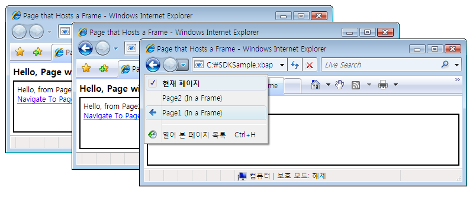  
  
 사용 하 여만 없는 <xref:System.Windows.Controls.Frame> 의 콘텐츠 안에 <xref:System.Windows.Controls.Page>합니다. 호스트에 공통적으로 적용 이기도 한 <xref:System.Windows.Controls.Frame> 의 콘텐츠 안에 <xref:System.Windows.Window>합니다.  
  
 기본적으로 <xref:System.Windows.Controls.Frame> 만 다른 저널 없는 경우에는 자체 저널을 사용 합니다. 경우는 <xref:System.Windows.Controls.Frame> 하나 내에서 호스팅되는 콘텐츠의 일부인는 <xref:System.Windows.Navigation.NavigationWindow> 또는 [!INCLUDE[TLA2#tla_xbap](../../../../includes/tla2sharptla-xbap-md.md)], <xref:System.Windows.Controls.Frame> 에 속하는 저널을 사용 하 여는 <xref:System.Windows.Navigation.NavigationWindow> 또는 [!INCLUDE[TLA2#tla_xbap](../../../../includes/tla2sharptla-xbap-md.md)]합니다. 경우에 따라 하지만 <xref:System.Windows.Controls.Frame> 자체 저널을 담당 해야 할 수 있습니다. 호스팅되는 페이지 내에서 저널 탐색할 수 있도록 하는 작업을 수행 하는 이유는 <xref:System.Windows.Controls.Frame>합니다. 다음 그림에서 이를 확인할 수 있습니다.  
  
 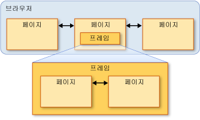  
  
 이 경우 구성할 수 있습니다는 <xref:System.Windows.Controls.Frame> 설정 하 여 자체 저널을 사용 하는 <xref:System.Windows.Controls.Frame.JournalOwnership%2A> 의 속성은 <xref:System.Windows.Controls.Frame> 를 <xref:System.Windows.Navigation.JournalOwnership.OwnsJournal>합니다. 다음 태그에서 이를 확인할 수 있습니다.  
  
 [!code-xaml[NavigationOverviewSnippets#FrameHostPageOwnJournalXAML1](../../../../samples/snippets/csharp/VS_Snippets_Wpf/NavigationOverviewSnippets/CSharp/FrameHostPageOwnJournal.xaml#framehostpageownjournalxaml1)]  
[!code-xaml[NavigationOverviewSnippets#FrameHostPageOwnJournalXAML2](../../../../samples/snippets/csharp/VS_Snippets_Wpf/NavigationOverviewSnippets/CSharp/FrameHostPageOwnJournal.xaml#framehostpageownjournalxaml2)]  
[!code-xaml[NavigationOverviewSnippets#FrameHostPageOwnJournalXAML3](../../../../samples/snippets/csharp/VS_Snippets_Wpf/NavigationOverviewSnippets/CSharp/FrameHostPageOwnJournal.xaml#framehostpageownjournalxaml3)]  
  
 다음 그림은 내 탐색의 효과 <xref:System.Windows.Controls.Frame> 자체 저널을 사용 하 여 합니다.  
  
 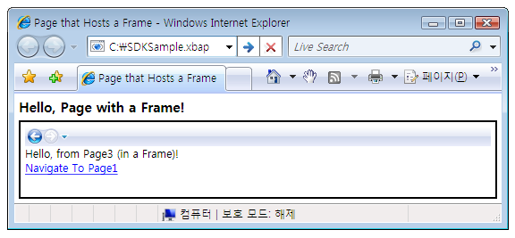  
  
 업무 일지 항목 탐색 하 여 표시 되는 공지 [!INCLUDE[TLA2#tla_ui](../../../../includes/tla2sharptla-ui-md.md)] 에 <xref:System.Windows.Controls.Frame>가 아닌 [!INCLUDE[TLA2#tla_ie](../../../../includes/tla2sharptla-ie-md.md)]합니다.  
  
> [!NOTE]
>  경우는 <xref:System.Windows.Controls.Frame> 에 호스트 된 콘텐츠 중 일부는 <xref:System.Windows.Window>, <xref:System.Windows.Controls.Frame> 자체 저널을 사용 하 여 결과적으로, 자체 탐색을 표시 [!INCLUDE[TLA2#tla_ui](../../../../includes/tla2sharptla-ui-md.md)]합니다.  
  
 사용자 환경에서 요구 하는 경우는 <xref:System.Windows.Controls.Frame> 탐색을 표시 하지 않고 자체 저널을 제공 하기 [!INCLUDE[TLA2#tla_ui](../../../../includes/tla2sharptla-ui-md.md)], 탐색을 숨길 수 있습니다 [!INCLUDE[TLA2#tla_ui](../../../../includes/tla2sharptla-ui-md.md)] 설정 하 여는 <xref:System.Windows.Controls.Frame.NavigationUIVisibility%2A> 를 <xref:System.Windows.Visibility.Hidden>합니다. 다음 태그에서 이를 확인할 수 있습니다.  
  
 [!code-xaml[NavigationOverviewSnippets#FrameHostPageHidesUIXAML1](../../../../samples/snippets/csharp/VS_Snippets_Wpf/NavigationOverviewSnippets/CSharp/FrameHostPageOwnHiddenJournal.xaml#framehostpagehidesuixaml1)]  
[!code-xaml[NavigationOverviewSnippets#FrameHostPageHidesUIXAML2](../../../../samples/snippets/csharp/VS_Snippets_Wpf/NavigationOverviewSnippets/CSharp/FrameHostPageOwnHiddenJournal.xaml#framehostpagehidesuixaml2)]  
[!code-xaml[NavigationOverviewSnippets#FrameHostPageHidesUIXAML3](../../../../samples/snippets/csharp/VS_Snippets_Wpf/NavigationOverviewSnippets/CSharp/FrameHostPageOwnHiddenJournal.xaml#framehostpagehidesuixaml3)]  
  
   
## 탐색 호스트  
 <xref:System.Windows.Controls.Frame> 및 <xref:System.Windows.Navigation.NavigationWindow> 탐색 호스트 이라고 하는 클래스입니다. A *탐색 호스트* 로 이동 하 고 콘텐츠를 표시할 수 있는 클래스입니다. 이를 위해 각 탐색 호스트에서 사용 하는 자체 <xref:System.Windows.Navigation.NavigationService> 와 저널 합니다. 다음 그림은 탐색 호스트의 기본 구성을 보여 줍니다.  
  
   
  
 기본적으로,이 통해 <xref:System.Windows.Navigation.NavigationWindow> 및 <xref:System.Windows.Controls.Frame> 탐색 지원 하는 동일한 제공 하는 [!INCLUDE[TLA2#tla_xbap](../../../../includes/tla2sharptla-xbap-md.md)] 브라우저에서 호스팅되는 경우 제공 합니다.  
  
 사용 하 여 외에도 <xref:System.Windows.Navigation.NavigationService> 및 저널에 동일한 멤버를 구현 하는 호스트를 탐색 하는 <xref:System.Windows.Navigation.NavigationService> 구현 합니다. 다음 그림에서 이를 확인할 수 있습니다.  
  
 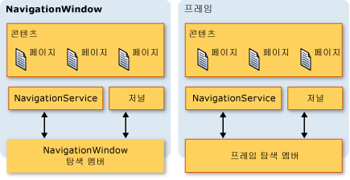  
  
 이를 통해 직접 탐색 지원을 프로그래밍할 수 있습니다. 사용자 지정 탐색을 제공 하는 경우이 고려할 수 있습니다 [!INCLUDE[TLA2#tla_ui](../../../../includes/tla2sharptla-ui-md.md)] 에 대 한는 <xref:System.Windows.Controls.Frame> 에 호스트 되는 <xref:System.Windows.Window>합니다. 두 유형 모두 포함 하 여 추가, 탐색 관련 멤버를 구현 하는 또한 `BackStack` (<xref:System.Windows.Navigation.NavigationWindow.BackStack%2A?displayProperty=nameWithType>, <xref:System.Windows.Controls.Frame.BackStack%2A?displayProperty=nameWithType>) 및 `ForwardStack` (<xref:System.Windows.Navigation.NavigationWindow.ForwardStack%2A?displayProperty=nameWithType>, <xref:System.Windows.Controls.Frame.ForwardStack%2A?displayProperty=nameWithType>), 뒤쪽에 업무 일지 항목을 열거 하는 데 사용할 수 있는 스택 및 전달 스택, 각각.  
  
 앞서 언급했듯이 응용 프로그램에는 둘 이상의 저널이 있을 수 있습니다. 다음 그림은 이러한 상황이 발생할 수 있는 예제를 제공합니다.  
  
   
  
   
## XAML 페이지 이외의 콘텐츠 탐색  
 이 항목 전반 <xref:System.Windows.Controls.Page> 및 팩 [!INCLUDE[TLA2#tla_xbap#plural](../../../../includes/tla2sharptla-xbapsharpplural-md.md)] 의 다양 한 탐색 기능을 보여 주기 위해 사용 된 [!INCLUDE[TLA2#tla_wpf](../../../../includes/tla2sharptla-wpf-md.md)]합니다. 그러나 한 <xref:System.Windows.Controls.Page> 즉 응용 프로그램으로 컴파일되는 탐색할 수 있는 콘텐츠 및 팩의 유일한 종류 하지 [!INCLUDE[TLA2#tla_xbap#plural](../../../../includes/tla2sharptla-xbapsharpplural-md.md)] 콘텐츠를 식별 하는 유일한 방법이 아닙니다.  
  
 느슨한를 탐색할 수이 섹션에서 보여 주듯이, [!INCLUDE[TLA2#tla_xaml](../../../../includes/tla2sharptla-xaml-md.md)] 파일, [!INCLUDE[TLA2#tla_html](../../../../includes/tla2sharptla-html-md.md)] 파일 및 개체입니다.  
  
   
### XAML 사용 완화 파일 탐색  
 느슨한 [!INCLUDE[TLA2#tla_xaml](../../../../includes/tla2sharptla-xaml-md.md)] 파일은 다음 특징을 갖는 파일:  
  
-   만 포함 [!INCLUDE[TLA2#tla_xaml](../../../../includes/tla2sharptla-xaml-md.md)] (즉, 코드).  
  
-   적절한 네임스페이스 선언이 있습니다.  
  
-   .xaml 파일 이름 확장명이 있습니다.  
  
 예를 들어 느슨한으로 저장 되는 다음 콘텐츠 [!INCLUDE[TLA2#tla_xaml](../../../../includes/tla2sharptla-xaml-md.md)] Person.xaml 파일입니다.  
  
 [!code-xaml[NavigationOverviewSnippets#LooseXAML](../../../../samples/snippets/csharp/VS_Snippets_Wpf/NavigationOverviewSnippets/CSharp/Person.xaml#loosexaml)]  
  
 파일을 두 번 클릭하면 브라우저가 열리고 콘텐츠를 탐색 및 표시합니다. 다음 그림에서 이를 확인할 수 있습니다.  
  
 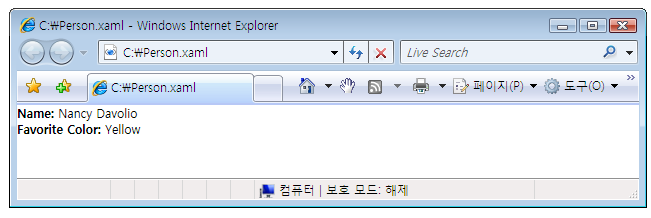  
  
 느슨한 표시할 수 있습니다 [!INCLUDE[TLA2#tla_xaml](../../../../includes/tla2sharptla-xaml-md.md)] 다음에서 파일:  
  
-   로컬 컴퓨터, 인트라넷 또는 인터넷의 웹 사이트  
  
-   A [!INCLUDE[TLA#tla_unc](../../../../includes/tlasharptla-unc-md.md)] 파일 공유 합니다.  
  
-   로컬 디스크  
  
 느슨한 [!INCLUDE[TLA2#tla_xaml](../../../../includes/tla2sharptla-xaml-md.md)] 브라우저의 즐겨찾기 목록에 파일을 추가할 수 있습니다 또는 브라우저의 홈 페이지 수입니다.  
  
> [!NOTE]
>  게시 및 느슨하게 시작 하는 방법에 대 한 자세한 내용은 [!INCLUDE[TLA2#tla_xaml](../../../../includes/tla2sharptla-xaml-md.md)] 페이지 참조 [WPF 응용 프로그램 배포](../../../../docs/framework/wpf/app-development/deploying-a-wpf-application-wpf.md)합니다.  
  
 느슨한에 대해 하나의 제한 [!INCLUDE[TLA2#tla_xaml](../../../../includes/tla2sharptla-xaml-md.md)] 안전 하 게 부분 신뢰에서 실행 하는 콘텐츠를 호스팅할만 수는 있습니다. 예를 들어 `Window` 느슨한의 루트 요소가 될 수 없습니다 [!INCLUDE[TLA2#tla_xaml](../../../../includes/tla2sharptla-xaml-md.md)] 파일입니다. 자세한 내용은 [WPF 부분 신뢰 보안](../../../../docs/framework/wpf/wpf-partial-trust-security.md)을 참조하세요.  
  
   
### 프레임을 사용하여 HTML 파일 탐색  
 탐색할 수를 예상 대로 [!INCLUDE[TLA2#tla_html](../../../../includes/tla2sharptla-html-md.md)]합니다. 제공 하기만 한 [!INCLUDE[TLA2#tla_uri](../../../../includes/tla2sharptla-uri-md.md)] http 체계를 사용 하는 합니다. 예를 들어, 다음 [!INCLUDE[TLA2#tla_xaml](../../../../includes/tla2sharptla-xaml-md.md)] 표시는 <xref:System.Windows.Controls.Frame> 를 탐색 하는 [!INCLUDE[TLA2#tla_html](../../../../includes/tla2sharptla-html-md.md)] 페이지.  
  
 [!code-xaml[NavigationOverviewSnippets#FrameHtmlNavMARKUP](../../../../samples/snippets/csharp/VS_Snippets_Wpf/NavigationOverviewSnippets/CSharp/FrameHTMLNavPage.xaml#framehtmlnavmarkup)]  
  
 로 이동 [!INCLUDE[TLA2#tla_html](../../../../includes/tla2sharptla-html-md.md)] 특수 권한이 필요 합니다. 예를 들어에서 탐색할 수 없습니다는 [!INCLUDE[TLA2#tla_xbap](../../../../includes/tla2sharptla-xbap-md.md)] 인터넷 영역 부분 신뢰 보안 샌드박스에서 실행 되 고입니다. 자세한 내용은 [WPF 부분 신뢰 보안](../../../../docs/framework/wpf/wpf-partial-trust-security.md)을 참조하세요.  
  
   
### WebBrowser 컨트롤을 사용하여 HTML 파일 탐색  
 <xref:System.Windows.Controls.WebBrowser> 지원 [!INCLUDE[TLA2#tla_html](../../../../includes/tla2sharptla-html-md.md)] 문서 호스팅, 탐색 및 스크립트/관리 되는 코드 상호 운용성. 자세한 내용은 관련 항목는 <xref:System.Windows.Controls.WebBrowser> 컨트롤을 참조 <xref:System.Windows.Controls.WebBrowser>합니다.  
  
 마찬가지로 <xref:System.Windows.Controls.Frame>탐색 하려면, [!INCLUDE[TLA2#tla_html](../../../../includes/tla2sharptla-html-md.md)] 를 사용 하 여 <xref:System.Windows.Controls.WebBrowser> 특수 권한이 필요 합니다. 예를 들어 부분 신뢰 응용 프로그램에서 탐색할 수 있습니다에 [!INCLUDE[TLA2#tla_html](../../../../includes/tla2sharptla-html-md.md)] 원본 사이트에 있습니다. 자세한 내용은 [WPF 부분 신뢰 보안](../../../../docs/framework/wpf/wpf-partial-trust-security.md)을 참조하세요.  
  
   
### 사용자 지정 개체 탐색  
 해당 데이터를 표시 하는 한 가지 방법은 만드는 것으로 사용자 지정 개체 저장 된 데이터에 있는 경우는 <xref:System.Windows.Controls.Page> 해당 개체에 바인딩되는 콘텐츠로 (참조 [데이터 바인딩 개요](../../../../docs/framework/wpf/data/data-binding-overview.md)). 개체를 표시하기 위해 전체 페이지를 만드는 오버헤드가 필요하지 않으면 페이지를 직접 탐색할 수 있습니다.  
  
 고려는 `Person` 다음 코드에서 구현 되는 클래스입니다.  
  
 [!code-csharp[NavigateToObjectSnippets#PersonClassCODE](../../../../samples/snippets/csharp/VS_Snippets_Wpf/NavigateToObjectSnippets/CSharp/Person.cs#personclasscode)]
 [!code-vb[NavigateToObjectSnippets#PersonClassCODE](../../../../samples/snippets/visualbasic/VS_Snippets_Wpf/NavigateToObjectSnippets/VisualBasic/Person.vb#personclasscode)]  
  
 호출 것을 이동 하려면는 <xref:System.Windows.Navigation.NavigationWindow.Navigate%2A?displayProperty=nameWithType> 메서드를 다음 코드 에서처럼 합니다.  
  
 [!code-xaml[NavigateToObjectSnippets#PageThatNavsToObject1](../../../../samples/snippets/csharp/VS_Snippets_Wpf/NavigateToObjectSnippets/CSharp/HomePage.xaml#pagethatnavstoobject1)]  
[!code-xaml[NavigateToObjectSnippets#PageThatNavsToObject2](../../../../samples/snippets/csharp/VS_Snippets_Wpf/NavigateToObjectSnippets/CSharp/HomePage.xaml#pagethatnavstoobject2)]  
[!code-xaml[NavigateToObjectSnippets#PageThatNavsToObject3](../../../../samples/snippets/csharp/VS_Snippets_Wpf/NavigateToObjectSnippets/CSharp/HomePage.xaml#pagethatnavstoobject3)]  
  
 [!code-csharp[NavigateToObjectSnippets#PageThatNavsToObjectCODEBEHIND](../../../../samples/snippets/csharp/VS_Snippets_Wpf/NavigateToObjectSnippets/CSharp/HomePage.xaml.cs#pagethatnavstoobjectcodebehind)]
 [!code-vb[NavigateToObjectSnippets#PageThatNavsToObjectCODEBEHIND](../../../../samples/snippets/visualbasic/VS_Snippets_Wpf/NavigateToObjectSnippets/VisualBasic/HomePage.xaml.vb#pagethatnavstoobjectcodebehind)]  
  
 다음 그림에서는 결과를 보여 줍니다.  
  
 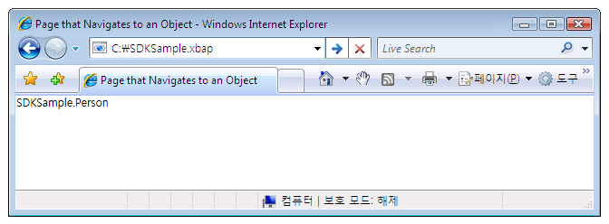  
  
 이 그림에서 유용한 콘텐츠가 표시되지 않는 것을 볼 수 있습니다. 실제로 표시 되는 값은 반환 값의는 `ToString` 에 대 한 메서드는 **사람** 기본적으로이 유일한; 개체 값입니다 [!INCLUDE[TLA2#tla_wpf](../../../../includes/tla2sharptla-wpf-md.md)] 개체를 나타내는 데 사용할 수 있습니다. 재정의 `ToString` 를 계속 하지만 보다 의미 있는 정보를 반환 하는 메서드는 문자열 값을만 이어야 합니다. 사용할 수의 프레젠테이션 기능을 활용 하는 중 한 가지 방법은 [!INCLUDE[TLA2#tla_wpf](../../../../includes/tla2sharptla-wpf-md.md)] 데이터 템플릿을 사용 하는 것입니다. 데이터 템플릿을 구현할 수 있는 [!INCLUDE[TLA2#tla_wpf](../../../../includes/tla2sharptla-wpf-md.md)] 특정 유형의 개체와 연결할 수 있습니다. 다음 코드에 대 한 데이터 템플릿을 보여 줍니다.는 `Person` 개체입니다.  
  
 [!code-xaml[NavigateToObjectSnippets#DataTemplateMARKUP](../../../../samples/snippets/csharp/VS_Snippets_Wpf/NavigateToObjectSnippets/CSharp/App.xaml#datatemplatemarkup)]  
  
 데이터 템플릿을 연관 여기서는 `Person` 형식을 사용 하 여는 `x:Type` 태그 확장에는 `DataType` 특성입니다. 데이터 템플릿을 다음 바인딩합니다 `TextBlock` 요소 (참조 <xref:System.Windows.Controls.TextBlock>)의 속성에는 `Person` 클래스입니다. 다음 그림에서는의 업데이트 된 모양을 `Person` 개체입니다.  
  
 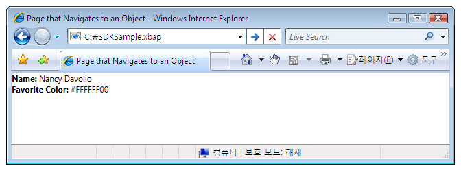  
  
 이 기술의 장점은 데이터 템플릿을 다시 사용하여 응용 프로그램의 어디에서든 일관적으로 개체를 표시할 수 있다는 점입니다.  
  
 데이터 템플릿에 대 한 자세한 내용은 참조 하십시오. [데이터 템플릿 개요](../../../../docs/framework/wpf/data/data-templating-overview.md)합니다.  
  
   
## 보안  
 [!INCLUDE[TLA2#tla_wpf](../../../../includes/tla2sharptla-wpf-md.md)] 탐색 지원을 통해 [!INCLUDE[TLA2#tla_xbap#plural](../../../../includes/tla2sharptla-xbapsharpplural-md.md)] 사용 하면 응용 프로그램 콘텐츠를 호스트 제 3 자 인터넷에서 탐색할 수 있습니다. 응용 프로그램 및 사용자를 모두 해로운 동작을 방지 하기 위해 [!INCLUDE[TLA2#tla_wpf](../../../../includes/tla2sharptla-wpf-md.md)] 다양 한 보안 기능에 설명 된 제공 [보안](../../../../docs/framework/wpf/security-wpf.md) 및 [WPF 부분 신뢰 보안](../../../../docs/framework/wpf/wpf-partial-trust-security.md)합니다.  
  
## 참고 항목  
 <xref:System.Windows.Application.SetCookie%2A>  
 <xref:System.Windows.Application.GetCookie%2A>  
 [응용 프로그램 관리 개요](../../../../docs/framework/wpf/app-development/application-management-overview.md)  
 [WPF의 Pack URI](../../../../docs/framework/wpf/app-development/pack-uris-in-wpf.md)  
 [구조적 탐색 개요](../../../../docs/framework/wpf/app-development/structured-navigation-overview.md)  
 [탐색 토폴로지 개요](../../../../docs/framework/wpf/app-development/navigation-topologies-overview.md)  
 [방법 항목](../../../../docs/framework/wpf/app-development/navigation-how-to-topics.md)  
 [WPF 응용 프로그램 배포](../../../../docs/framework/wpf/app-development/deploying-a-wpf-application-wpf.md)
