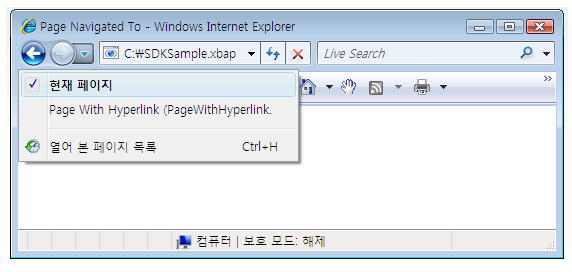

# 탐색 개요
[!INCLUDE[TLA#tla_wpf](../../../../includes/tlasharptla-wpf-md.md)]는 독립 실행형 응용 프로그램과 [!INCLUDE[TLA#tla_xbap#plural](../../../../includes/tlasharptla-xbapsharpplural-md.md)]라는 두 유형의 응용 프로그램에서 사용할 수 있는 브라우저 스타일의 탐색을 지원합니다. [!INCLUDE[TLA2#tla_wpf](../../../../includes/tla2sharptla-wpf-md.md)]는 탐색 가능하도록 콘텐츠를 패키지하기 위해 <xref:System.Windows.Controls.Page> 클래스를 제공합니다.  <xref:System.Windows.Documents.Hyperlink>를 사용하여 선언적으로 <xref:System.Windows.Controls.Page> 간에 탐색하거나 <xref:System.Windows.Navigation.NavigationService>를 사용하여 프로그래밍 방식으로 탐색할 수 있습니다. [!INCLUDE[TLA2#tla_wpf](../../../../includes/tla2sharptla-wpf-md.md)]는 저널을 사용하여 탐색하기 전의 페이지를 기억하여 해당 페이지로 다시 탐색합니다.  
  
 <xref:System.Windows.Controls.Page>, <xref:System.Windows.Documents.Hyperlink>, <xref:System.Windows.Navigation.NavigationService> 및 저널은 [!INCLUDE[TLA2#tla_wpf](../../../../includes/tla2sharptla-wpf-md.md)]에서 제공하는 탐색 지원의 핵심 요소입니다.  이 개요에서는 느슨한 [!INCLUDE[TLA#tla_xaml](../../../../includes/tlasharptla-xaml-md.md)] 파일, [!INCLUDE[TLA#tla_html](../../../../includes/tlasharptla-html-md.md)] 파일 및 개체로의 탐색을 포함한 고급 탐색 지원을 다루기 전에 이 기능을 자세히 살펴봅니다.  
  
> [!NOTE]
>  이 항목에서 "브라우저"라는 용어는 [!INCLUDE[TLA2#tla_wpf](../../../../includes/tla2sharptla-wpf-md.md)] 응용 프로그램을 호스팅할 수 있는 브라우저만 지칭하며 현재 [!INCLUDE[TLA#tla_ie](../../../../includes/tlasharptla-ie-md.md)] 및 Firefox가 해당됩니다.  특정 [!INCLUDE[TLA2#tla_wpf](../../../../includes/tla2sharptla-wpf-md.md)] 기능이 특정 브라우저에서만 지원되는 경우에는 브라우저 버전을 명시합니다.  
  
   
  
   
## WPF 응용 프로그램에서 탐색  
 이 항목에서는 [!INCLUDE[TLA2#tla_wpf](../../../../includes/tla2sharptla-wpf-md.md)]의 주요 탐색 기능에 대한 개요를 제공합니다.  이러한 기능은 독립 실행형 응용 프로그램과 [!INCLUDE[TLA2#tla_xbap#plural](../../../../includes/tla2sharptla-xbapsharpplural-md.md)] 모두에 사용할 수 있지만 이 항목에서는 [!INCLUDE[TLA2#tla_xbap](../../../../includes/tla2sharptla-xbap-md.md)]와 관련해서만 설명합니다.  
  
> [!NOTE]
>  이 항목에서는 [!INCLUDE[TLA2#tla_xbap#plural](../../../../includes/tla2sharptla-xbapsharpplural-md.md)]의 빌드 및 배포 방법은 다루지 않습니다.  [!INCLUDE[TLA2#tla_xbap#plural](../../../../includes/tla2sharptla-xbapsharpplural-md.md)]에 대한 자세한 내용은 [WPF XAML 브라우저 응용 프로그램 개요](../../../../docs/framework/wpf/app-development/wpf-xaml-browser-applications-overview.md)를 참조하십시오.  
  
 이 단원에서는 탐색과 관련된 다음 사항에 대해 설명하고 그에 대한 예제를 제공합니다.  
  
-   [페이지 구현](#CreatingAXAMLPage)  
  
-   [시작 페이지 구성](#Configuring_a_Start_Page)  
  
-   [호스트 창의 제목, 너비 및 높이 구성](#ConfiguringAXAMLPage)  
  
-   [하이퍼링크 탐색](#NavigatingBetweenXAMLPages)  
  
-   [조각 탐색](#FragmentNavigation)  
  
-   [탐색 서비스](#NavigationService)  
  
-   [탐색 서비스를 사용한 프로그래밍 방식 탐색](#Programmatic_Navigation_with_the_Navigation_Service)  
  
-   [탐색 수명](#Navigation_Lifetime)  
  
-   [저널을 사용하여 탐색 기억](#NavigationHistory)  
  
-   [페이지 수명 및 저널](#PageLifetime)  
  
-   [탐색 기록으로 콘텐츠 상태 유지](#RetainingContentStateWithNavigationHistory)  
  
-   [쿠키](#Cookies)  
  
-   [구조적 탐색](#Structured_Navigation)  
  
   
### 페이지 구현  
 [!INCLUDE[TLA2#tla_wpf](../../../../includes/tla2sharptla-wpf-md.md)]에서는 [!INCLUDE[TLA2#tla_winfx](../../../../includes/tla2sharptla-winfx-md.md)] 개체, 사용자 지정 개체, 열거형 값, 사용자 컨트롤, [!INCLUDE[TLA2#tla_xaml](../../../../includes/tla2sharptla-xaml-md.md)] 파일 및 [!INCLUDE[TLA#tla_html](../../../../includes/tlasharptla-html-md.md)] 파일을 포함한 몇 가지 콘텐츠 형식을 탐색할 수 있습니다.  그러나 콘텐츠를 패키지하는 가장 일반적이고 편리한 방법은 <xref:System.Windows.Controls.Page>를 사용하는 것입니다.  또한 <xref:System.Windows.Controls.Page>는 탐색 관련 기능을 구현하여 모양을 개선하고 개발을 단순화합니다.  
  
 <xref:System.Windows.Controls.Page>를 사용하면 다음과 같은 태그를 사용하여 탐색 가능한 [!INCLUDE[TLA2#tla_xaml](../../../../includes/tla2sharptla-xaml-md.md)] 콘텐츠 페이지를 선언적으로 구현할 수 있습니다.  
  
 [!code-xml[NavigationOverviewSnippets#Page1XAML](../../../../samples/snippets/csharp/VS_Snippets_Wpf/NavigationOverviewSnippets/CSharp/Page1.xaml#page1xaml)]  
  
 [!INCLUDE[TLA2#tla_xaml](../../../../includes/tla2sharptla-xaml-md.md)] 태그에서 구현되는 <xref:System.Windows.Controls.Page>에는 루트 요소로 `Page`가 사용되며 [!INCLUDE[TLA2#tla_wpf](../../../../includes/tla2sharptla-wpf-md.md)] [!INCLUDE[TLA#tla_xml](../../../../includes/tlasharptla-xml-md.md)] 네임스페이스 선언이 필요합니다.  `Page` 요소에는 탐색하고 표시하려고 하는 콘텐츠가 포함됩니다.  다음 태그에서처럼 `Page.Content` 속성 요소를 설정하여 콘텐츠를 추가합니다.  
  
 [!code-xml[NavigationOverviewSnippets#Page2XAML](../../../../samples/snippets/csharp/VS_Snippets_Wpf/NavigationOverviewSnippets/CSharp/Page2.xaml#page2xaml)]  
  
 `Page.Content`에는 자식 요소가 하나만 포함될 수 있습니다. 앞의 예제에서 콘텐츠는 "Hello, Page\!"라는 단일 문자열입니다. 실제로는 일반적으로 레이아웃 컨트롤을 자식 요소로 사용하여\([레이아웃](../../../../docs/framework/wpf/advanced/layout.md) 참조\) 콘텐츠를 추가하고 작성합니다.  
  
 `Page` 요소의 자식 요소는 <xref:System.Windows.Controls.Page>의 콘텐츠로 고려되므로 결과적으로 명시적 `Page.Content` 선언을 사용할 필요가 없습니다.  다음 태그는 이전 샘플을 선언적으로 구현한 것입니다.  
  
 [!code-xml[NavigationOverviewSnippets#Page3XAML](../../../../samples/snippets/csharp/VS_Snippets_Wpf/NavigationOverviewSnippets/CSharp/Page3.xaml#page3xaml)]  
  
 이 경우에는 `Page.Content`가 자동으로 `Page` 요소의 자식 요소로 설정됩니다.  자세한 내용은 [WPF 콘텐츠 모델](../../../../docs/framework/wpf/controls/wpf-content-model.md)을 참조하십시오.  
  
 태그 전용 <xref:System.Windows.Controls.Page>는 콘텐츠 표시에 유용합니다.  하지만 <xref:System.Windows.Controls.Page>는 사용자가 페이지와 상호 작용하는 데 사용할 수 있는 컨트롤도 표시할 수 있으며 이벤트를 처리하고 응용 프로그램 논리를 호출하여 사용자 상호 작용에 응답할 수 있습니다.  대화형 <xref:System.Windows.Controls.Page>는 다음 예제에서처럼 태그와 코드 숨김을 함께 사용하여 구현합니다.  
  
 [!code-xml[XBAPAppDefSnippets#HomePageMARKUP](../../../../samples/snippets/csharp/VS_Snippets_Wpf/XBAPAppDefSnippets/CSharp/HomePage.xaml#homepagemarkup)]  
  
 [!code-csharp[XBAPAppDefSnippets#HomePageCODEBEHIND](../../../../samples/snippets/csharp/VS_Snippets_Wpf/XBAPAppDefSnippets/CSharp/HomePage.xaml.cs#homepagecodebehind)]
 [!code-vb[XBAPAppDefSnippets#HomePageCODEBEHIND](../../../../samples/snippets/visualbasic/VS_Snippets_Wpf/XBAPAppDefSnippets/VisualBasic/HomePage.xaml.vb#homepagecodebehind)]  
  
 태그 파일과 코드 숨김 파일이 함께 작동하도록 하려면 다음 구성이 필요합니다.  
  
-   태그에서 `Page` 요소에 `x:Class` 특성이 포함되어야 합니다.  응용 프로그램을 빌드할 때 태그 파일에 `x:Class`가 있으면 [!INCLUDE[TLA#tla_msbuild](../../../../includes/tlasharptla-msbuild-md.md)]에서는 <xref:System.Windows.Controls.Page>에서 파생되며 `x:Class` 특성에 의해 이름이 지정되는 `partial` 클래스를 만듭니다.  이를 위해서는 [!INCLUDE[TLA2#tla_xaml](../../../../includes/tla2sharptla-xaml-md.md)] 스키마에 대한 [!INCLUDE[TLA2#tla_xml](../../../../includes/tla2sharptla-xml-md.md)] 네임스페이스 선언을 추가해야 합니다\(`xmlns:x="http://schemas.microsoft.com/winfx/2006/xaml"`\).  생성된 `partial` 클래스는 이벤트 등록을 위해 호출되고 태그에서 구현되는 속성을 설정하는 `InitializeComponent`를 구현합니다.  
  
-   코드 숨김에서 클래스는 태그의 `x:Class` 특성으로 지정되는 이름과 이름이 같은 `partial` 클래스여야 하며 <xref:System.Windows.Controls.Page>에서 파생되어야 합니다.  이를 통해 응용 프로그램 빌드 시 태그 파일에 대해 생성되는 `partial` 클래스와 코드 숨김 파일을 연결할 수 있습니다\([WPF 응용 프로그램 만들기](../../../../docs/framework/wpf/app-development/building-a-wpf-application-wpf.md) 참조\).  
  
-   코드 숨김에서 <xref:System.Windows.Controls.Page> 클래스는 `InitializeComponent` 메서드를 호출하는 생성자를 구현해야 합니다.  `InitializeComponent`는 태그 파일에서 생성된 `partial` 클래스에 의해 구현되어 이벤트를 등록하고 태그에 정의된 속성을 설정합니다.  
  
> [!NOTE]
>  [!INCLUDE[TLA#tla_visualstu](../../../../includes/tlasharptla-visualstu-md.md)]를 사용하여 프로젝트에 새 <xref:System.Windows.Controls.Page>를 추가하면 <xref:System.Windows.Controls.Page>는 태그와 코드 숨김을 모두 사용하여 구현되며, 태그와 코드 숨김 파일 사이를 연결하기 위해서는 여기서 설명하는 것과 같은 구성 작업이 필요합니다.  
  
 <xref:System.Windows.Controls.Page>가 구현되면 이를 탐색할 수 있습니다.  응용 프로그램이 탐색할 첫 번째 <xref:System.Windows.Controls.Page>를 지정하려면 시작 <xref:System.Windows.Controls.Page>를 구성해야 합니다.  
  
   
### 시작 페이지 구성  
 [!INCLUDE[TLA2#tla_xbap#plural](../../../../includes/tla2sharptla-xbapsharpplural-md.md)]를 사용하려면 브라우저에서 어느 정도의 응용 프로그램 인프라를 호스팅해야 합니다.  [!INCLUDE[TLA2#tla_wpf](../../../../includes/tla2sharptla-wpf-md.md)]에서 <xref:System.Windows.Application> 클래스는 필요한 응용 프로그램 인프라를 설정하는 응용 프로그램 정의의 일부입니다\([응용 프로그램 관리 개요](../../../../docs/framework/wpf/app-development/application-management-overview.md) 참조\).  
  
 응용 프로그램 정의는 일반적으로 태그와 코드 숨김 모두를 사용하여 구현되며 태그 파일은 [!INCLUDE[TLA2#tla_msbuild](../../../../includes/tla2sharptla-msbuild-md.md)] `ApplicationDefinition` 항목으로 구성됩니다. 다음은 [!INCLUDE[TLA2#tla_xbap](../../../../includes/tla2sharptla-xbap-md.md)]에 대한 응용 프로그램 정의입니다.  
  
 [!code-xml[XBAPAppDefSnippets#XBAPApplicationDefinitionMARKUP](../../../../samples/snippets/csharp/VS_Snippets_Wpf/XBAPAppDefSnippets/CSharp/App.xaml#xbapapplicationdefinitionmarkup)]  
  
 [!code-csharp[XBAPAppDefSnippets#XBAPApplicationDefinitionCODEBEHIND](../../../../samples/snippets/csharp/VS_Snippets_Wpf/XBAPAppDefSnippets/CSharp/App.xaml.cs#xbapapplicationdefinitioncodebehind)]
 [!code-vb[XBAPAppDefSnippets#XBAPApplicationDefinitionCODEBEHIND](../../../../samples/snippets/visualbasic/VS_Snippets_Wpf/XBAPAppDefSnippets/VisualBasic/Application.xaml.vb#xbapapplicationdefinitioncodebehind)]  
  
 [!INCLUDE[TLA2#tla_xbap](../../../../includes/tla2sharptla-xbap-md.md)]는 응용 프로그램 정의를 사용하여 시작 <xref:System.Windows.Controls.Page>를 지정하며 이 페이지는 [!INCLUDE[TLA2#tla_xbap](../../../../includes/tla2sharptla-xbap-md.md)]가 시작될 때 자동으로 로드되는 <xref:System.Windows.Controls.Page>입니다.  이렇게 하려면 원하는 <xref:System.Windows.Controls.Page>에 대한 [!INCLUDE[TLA#tla_uri](../../../../includes/tlasharptla-uri-md.md)]로 <xref:System.Windows.Application.StartupUri%2A> 속성을 설정합니다.  
  
> [!NOTE]
>  대개의 경우 <xref:System.Windows.Controls.Page>는 응용 프로그램으로 컴파일되거나 응용 프로그램과 함께 배포됩니다.  이 경우 <xref:System.Windows.Controls.Page>를 식별하는 [!INCLUDE[TLA2#tla_uri](../../../../includes/tla2sharptla-uri-md.md)]는 pack [!INCLUDE[TLA2#tla_uri](../../../../includes/tla2sharptla-uri-md.md)]이며 이는 *pack* 체계를 따르는 [!INCLUDE[TLA2#tla_uri](../../../../includes/tla2sharptla-uri-md.md)]입니다.  pack [!INCLUDE[TLA2#tla_uri#plural](../../../../includes/tla2sharptla-urisharpplural-md.md)]에 대해서는 [WPF의 Pack URI](../../../../docs/framework/wpf/app-development/pack-uris-in-wpf.md)에서 자세히 다룹니다. 아래에서 설명하는 http 체계를 사용하여 콘텐츠를 탐색할 수도 있습니다.  
  
 다음 예제에서처럼 <xref:System.Windows.Application.StartupUri%2A>를 태그에서 선언적으로 설정할 수 있습니다.  
  
 [!code-xml[NavigationOverviewSnippets#XBAPApplicationDefinitionMARKUP](../../../../samples/snippets/csharp/VS_Snippets_Wpf/NavigationOverviewSnippets/CSharp/App.xaml#xbapapplicationdefinitionmarkup)]  
  
 이 예제에서 `StartupUri` 특성은 HomePage.xaml을 식별하는 관련 pack [!INCLUDE[TLA2#tla_uri](../../../../includes/tla2sharptla-uri-md.md)]로 설정됩니다.  [!INCLUDE[TLA2#tla_xbap](../../../../includes/tla2sharptla-xbap-md.md)]가 시작되면 HomePage.xaml이 자동으로 탐색되어 표시됩니다.  웹 서버에서 시작된 [!INCLUDE[TLA2#tla_xbap](../../../../includes/tla2sharptla-xbap-md.md)]를 보여 주는 다음 그림에서 이를 확인할 수 있습니다.  
  
   
  
> [!NOTE]
>  [!INCLUDE[TLA2#tla_xbap#plural](../../../../includes/tla2sharptla-xbapsharpplural-md.md)]의 개발과 배포에 대한 자세한 내용은 [WPF XAML 브라우저 응용 프로그램 개요](../../../../docs/framework/wpf/app-development/wpf-xaml-browser-applications-overview.md) 및 [WPF 응용 프로그램 배포](../../../../docs/framework/wpf/app-development/deploying-a-wpf-application-wpf.md)를 참조하십시오.  
  
   
### 호스트 창의 제목, 너비 및 높이 구성  
 이전 그림에서 브라우저 및 탭 패널의 제목이 모두 [!INCLUDE[TLA2#tla_xbap](../../../../includes/tla2sharptla-xbap-md.md)]의 [!INCLUDE[TLA2#tla_uri](../../../../includes/tla2sharptla-uri-md.md)]임을 알 수 있습니다.  이 제목은 길이가 길며 모양이나 정보 제공 측면 모두에서 그다지 유용하지 않습니다.  이런 이유 때문에 <xref:System.Windows.Controls.Page>는 <xref:System.Windows.Controls.Page.WindowTitle%2A> 속성을 설정하여 제목을 변경할 수 있는 방법을 제공합니다.  또한 <xref:System.Windows.Controls.Page.WindowWidth%2A> 및 <xref:System.Windows.Controls.Page.WindowHeight%2A>를 설정하여 각각 브라우저 창의 너비와 높이를 구성할 수 있습니다.  
  
 다음 예제에서처럼 <xref:System.Windows.Controls.Page.WindowTitle%2A>, <xref:System.Windows.Controls.Page.WindowWidth%2A> 및 <xref:System.Windows.Controls.Page.WindowHeight%2A>를 태그에서 선언적으로 설정할 수 있습니다.  
  
 [!code-xml[NavigationOverviewSnippets#HomePageMARKUP](../../../../samples/snippets/csharp/VS_Snippets_Wpf/NavigationOverviewSnippets/CSharp/HomePage.xaml#homepagemarkup)]  
  
 다음 그림에서는 앞의 예제를 실행한 결과를 보여 줍니다.  
  
   
  
   
### 하이퍼링크 탐색  
 일반적으로 [!INCLUDE[TLA2#tla_xbap](../../../../includes/tla2sharptla-xbap-md.md)]는 몇 개의 페이지로 구성됩니다.  한 페이지에서 다른 페이지로 탐색하는 가장 간단한 방법은 <xref:System.Windows.Documents.Hyperlink>를 사용하는 것입니다.  다음 태그에서 볼 수 있듯이 `Hyperlink` 요소를 사용하여 <xref:System.Windows.Controls.Page>에 <xref:System.Windows.Documents.Hyperlink>를 선언적으로 추가할 수 있습니다.  
  
 [!code-xml[NavigationOverviewSnippets#HyperlinkXAML1](../../../../samples/snippets/csharp/VS_Snippets_Wpf/NavigationOverviewSnippets/CSharp/PageWithHyperlink.xaml#hyperlinkxaml1)]  
[!code-xml[NavigationOverviewSnippets#HyperlinkXAML2](../../../../samples/snippets/csharp/VS_Snippets_Wpf/NavigationOverviewSnippets/CSharp/PageWithHyperlink.xaml#hyperlinkxaml2)]  
[!code-xml[NavigationOverviewSnippets#HyperlinkXAML3](../../../../samples/snippets/csharp/VS_Snippets_Wpf/NavigationOverviewSnippets/CSharp/PageWithHyperlink.xaml#hyperlinkxaml3)]  
  
 `Hyperlink` 요소에는 다음이 필요합니다.  
  
-   탐색할 <xref:System.Windows.Controls.Page>의 pack [!INCLUDE[TLA2#tla_uri](../../../../includes/tla2sharptla-uri-md.md)]\(`NavigateUri` 특성으로 지정\)  
  
-   텍스트와 이미지처럼 사용자가 탐색을 시작하기 위해 클릭할 수 있는 콘텐츠\(`Hyperlink` 요소에 포함될 수 있는 콘텐츠에 대해서는 <xref:System.Windows.Documents.Hyperlink> 참조\)  
  
 다음 그림에서는 <xref:System.Windows.Documents.Hyperlink>가 있는 <xref:System.Windows.Controls.Page>를 사용한 [!INCLUDE[TLA2#tla_xbap](../../../../includes/tla2sharptla-xbap-md.md)]를 보여 줍니다.  
  
   
  
 여기서 예상할 수 있듯이 <xref:System.Windows.Documents.Hyperlink>를 클릭하면 [!INCLUDE[TLA2#tla_xbap](../../../../includes/tla2sharptla-xbap-md.md)]는 `NavigateUri` 특성으로 식별되는 <xref:System.Windows.Controls.Page>를 탐색합니다.  또한 [!INCLUDE[TLA2#tla_xbap](../../../../includes/tla2sharptla-xbap-md.md)]는 이전 <xref:System.Windows.Controls.Page>의 항목을 [!INCLUDE[TLA2#tla_ie](../../../../includes/tla2sharptla-ie-md.md)]의 최신 페이지 목록에 추가합니다.  다음 그림에서 이를 확인할 수 있습니다.  
  
   
  
 <xref:System.Windows.Documents.Hyperlink>는 <xref:System.Windows.Controls.Page>에서 다른 페이지로의 탐색을 지원할 뿐만 아니라 조각 탐색도 지원합니다.  
  
   
### 조각 탐색  
 *조각 탐색*은 현재 <xref:System.Windows.Controls.Page> 또는 다른 <xref:System.Windows.Controls.Page>의 콘텐츠 조각으로의 탐색입니다.  [!INCLUDE[TLA2#tla_wpf](../../../../includes/tla2sharptla-wpf-md.md)]에서 콘텐츠 조각은 명명된 요소에 포함된 콘텐츠입니다.  명명된 요소는 `Name` 특성이 설정된 요소입니다.  다음 태그에서 콘텐츠 조각이 포함된 명명된 `TextBlock` 요소를 볼 수 있습니다.  
  
 [!code-xml[NavigationOverviewSnippets#PageWithContentFragmentsMARKUP1](../../../../samples/snippets/csharp/VS_Snippets_Wpf/NavigationOverviewSnippets/CSharp/PageWithFragments.xaml#pagewithcontentfragmentsmarkup1)]  
[!code-xml[NavigationOverviewSnippets#PageWithContentFragmentsMARKUP2](../../../../samples/snippets/csharp/VS_Snippets_Wpf/NavigationOverviewSnippets/CSharp/PageWithFragments.xaml#pagewithcontentfragmentsmarkup2)]  
[!code-xml[NavigationOverviewSnippets#PageWithContentFragmentsMARKUP3](../../../../samples/snippets/csharp/VS_Snippets_Wpf/NavigationOverviewSnippets/CSharp/PageWithFragments.xaml#pagewithcontentfragmentsmarkup3)]  
  
 <xref:System.Windows.Documents.Hyperlink>가 콘텐츠 조각을 탐색하려면 `NavigateUri` 특성에 다음이 포함되어야 합니다.  
  
-   탐색할 콘텐츠 조각이 있는 <xref:System.Windows.Controls.Page>의 [!INCLUDE[TLA2#tla_uri](../../../../includes/tla2sharptla-uri-md.md)]  
  
-   "\#" 문자  
  
-   콘텐츠 조각이 들어 있는 <xref:System.Windows.Controls.Page>의 요소 이름  
  
 조각 [!INCLUDE[TLA2#tla_uri](../../../../includes/tla2sharptla-uri-md.md)]의 형식은 다음과 같습니다.  
  
 *PageURI* `#` *ElementName*  
  
 다음은 콘텐츠 조각을 탐색하도록 구성된 `Hyperlink`의 예제입니다.  
  
 [!code-xml[NavigationOverviewSnippets#PageThatNavigatesXAML1](../../../../samples/snippets/csharp/VS_Snippets_Wpf/NavigationOverviewSnippets/CSharp/PageThatNavigatesToFragment.xaml#pagethatnavigatesxaml1)]  
[!code-xml[NavigationOverviewSnippets#PageThatNavigatesXAML2](../../../../samples/snippets/csharp/VS_Snippets_Wpf/NavigationOverviewSnippets/CSharp/PageThatNavigatesToFragment.xaml#pagethatnavigatesxaml2)]  
[!code-xml[NavigationOverviewSnippets#PageThatNavigatesXAML3](../../../../samples/snippets/csharp/VS_Snippets_Wpf/NavigationOverviewSnippets/CSharp/PageThatNavigatesToFragment.xaml#pagethatnavigatesxaml3)]  
  
> [!NOTE]
>  이 단원에서는 [!INCLUDE[TLA2#tla_wpf](../../../../includes/tla2sharptla-wpf-md.md)]의 기본 조각 탐색 구현에 대해 설명합니다.  [!INCLUDE[TLA2#tla_wpf](../../../../includes/tla2sharptla-wpf-md.md)]에서는 부분적으로 <xref:System.Windows.Navigation.NavigationService.FragmentNavigation?displayProperty=fullName> 이벤트 처리가 필요한 자체 조각 탐색 체계를 구현할 수도 있습니다.  
  
> [!IMPORTANT]
>  [!INCLUDE[TLA2#tla_http](../../../../includes/tla2sharptla-http-md.md)]를 통해 페이지를 탐색할 수 있는 경우에만 느슨한 [!INCLUDE[TLA2#tla_xaml](../../../../includes/tla2sharptla-xaml-md.md)] 페이지\(`Page`가 루트 요소인 태그 전용 [!INCLUDE[TLA2#tla_xaml](../../../../includes/tla2sharptla-xaml-md.md)] 파일\)에서 조각을 탐색할 수 있습니다.  
>   
>  그러나 느슨한 [!INCLUDE[TLA2#tla_xaml](../../../../includes/tla2sharptla-xaml-md.md)] 페이지는 고유한 조각을 탐색할 수 있습니다.  
  
   
### 탐색 서비스  
 <xref:System.Windows.Documents.Hyperlink>를 사용하여 사용자는 특정 <xref:System.Windows.Controls.Page>로의 탐색을 시작할 수 있지만 페이지를 찾고 다운로드하는 작업은 <xref:System.Windows.Navigation.NavigationService> 클래스가 수행합니다.  기본적으로 <xref:System.Windows.Navigation.NavigationService>가 <xref:System.Windows.Documents.Hyperlink>와 같은 클라이언트 코드 대신 탐색 요청을 처리하는 기능을 제공합니다.  또한 <xref:System.Windows.Navigation.NavigationService>는 탐색 요청을 추적하고 이에 영향을 주기 위한 더 높은 수준의 지원을 구현합니다.  
  
 <xref:System.Windows.Documents.Hyperlink>를 클릭하면 [!INCLUDE[TLA2#tla_wpf](../../../../includes/tla2sharptla-wpf-md.md)]는 <xref:System.Windows.Navigation.NavigationService.Navigate%2A?displayProperty=fullName>를 호출하여 지정한 pack [!INCLUDE[TLA2#tla_uri](../../../../includes/tla2sharptla-uri-md.md)]에서 <xref:System.Windows.Controls.Page>를 찾고 다운로드합니다.  다운로드된 <xref:System.Windows.Controls.Page>는 루트 개체가 다운로드된 <xref:System.Windows.Controls.Page>의 인스턴스인 개체 트리로 변환됩니다.  루트 <xref:System.Windows.Controls.Page> 개체에 대한 참조는 <xref:System.Windows.Navigation.NavigationService.Content%2A?displayProperty=fullName> 속성에 저장됩니다.  탐색된 콘텐츠의 Pack [!INCLUDE[TLA2#tla_uri](../../../../includes/tla2sharptla-uri-md.md)]는 <xref:System.Windows.Navigation.NavigationService.Source%2A?displayProperty=fullName> 속성에 저장되고 <xref:System.Windows.Navigation.NavigationService.CurrentSource%2A?displayProperty=fullName>에는 최근에 탐색한 페이지의 Pack [!INCLUDE[TLA2#tla_uri](../../../../includes/tla2sharptla-uri-md.md)]가 저장됩니다.  
  
> [!NOTE]
>  [!INCLUDE[TLA2#tla_wpf](../../../../includes/tla2sharptla-wpf-md.md)] 응용 프로그램에는 현재 활성화된 <xref:System.Windows.Navigation.NavigationService>가 여러 개 있을 수 있습니다.  자세한 내용은 이 항목 뒷부분의 [탐색 호스트](#Navigation_Hosts)를 참조하십시오.  
  
   
### 탐색 서비스를 사용한 프로그래밍 방식 탐색  
 <xref:System.Windows.Documents.Hyperlink>에서 사용자 대신 <xref:System.Windows.Navigation.NavigationService>를 사용하기 때문에 <xref:System.Windows.Documents.Hyperlink>를 사용하여 탐색을 태그에서 선언적으로 구현하는 경우에는 <xref:System.Windows.Navigation.NavigationService>에 대해 알 필요가 없습니다.  즉, <xref:System.Windows.Documents.Hyperlink>의 직접 또는 간접 부모가 탐색 호스트이면\([탐색 호스트](#Navigation_Hosts) 참조\) <xref:System.Windows.Documents.Hyperlink>는 탐색 호스트의 탐색 서비스를 찾고 이를 사용하여 탐색 요청을 처리할 수 있습니다.  
  
 하지만 다음과 같이 <xref:System.Windows.Navigation.NavigationService>를 직접 사용해야 하는 경우가 있습니다.  
  
-   기본값이 아닌 생성자를 사용하여 <xref:System.Windows.Controls.Page>를 인스턴스화해야 하는 경우  
  
-   탐색하기 전에 <xref:System.Windows.Controls.Page>에 대한 속성을 설정해야 하는 경우  
  
-   탐색해야 할 <xref:System.Windows.Controls.Page>를 런타임에만 알 수 있는 경우  
  
 이러한 상황에서는 <xref:System.Windows.Navigation.NavigationService> 개체의 <xref:System.Windows.Navigation.NavigationService.Navigate%2A> 메서드를 호출하여 탐색을 프로그래밍 방식으로 시작하는 코드를 작성해야 합니다.  이렇게 하려면 <xref:System.Windows.Navigation.NavigationService>에 대한 참조를 가져와야 합니다.  
  
#### NavigationService에 대한 참조 가져오기  
 [탐색 호스트](#Navigation_Hosts) 단원에서 다룬 이유 때문에 [!INCLUDE[TLA2#tla_wpf](../../../../includes/tla2sharptla-wpf-md.md)] 응용 프로그램에는 둘 이상의 <xref:System.Windows.Navigation.NavigationService>가 있을 수 있습니다.  즉, 일반적으로 현재 <xref:System.Windows.Controls.Page>를 탐색한 <xref:System.Windows.Navigation.NavigationService>인 <xref:System.Windows.Navigation.NavigationService>를 찾을 방법을 코드에 지정해야 합니다. `static` <xref:System.Windows.Navigation.NavigationService.GetNavigationService%2A?displayProperty=fullName> 메서드를 호출하여 <xref:System.Windows.Navigation.NavigationService>에 대한 참조를 가져올 수 있습니다.  특정 <xref:System.Windows.Controls.Page>를 탐색한 <xref:System.Windows.Navigation.NavigationService>를 가져오려면 <xref:System.Windows.Controls.Page>에 대한 참조를 <xref:System.Windows.Navigation.NavigationService.GetNavigationService%2A> 메서드의 인수로 전달합니다.  다음 코드에서는 현재 <xref:System.Windows.Controls.Page>에 대한 <xref:System.Windows.Navigation.NavigationService>를 가져오는 방법을 보여 줍니다.  
  
 [!code-csharp[NavigationOverviewSnippets#GetNSCODEBEHIND1](../../../../samples/snippets/csharp/VS_Snippets_Wpf/NavigationOverviewSnippets/CSharp/GetNSPage.xaml.cs#getnscodebehind1)]  
[!code-csharp[NavigationOverviewSnippets#GetNSCODEBEHIND2](../../../../samples/snippets/csharp/VS_Snippets_Wpf/NavigationOverviewSnippets/CSharp/GetNSPage.xaml.cs#getnscodebehind2)]
[!code-vb[NavigationOverviewSnippets#GetNSCODEBEHIND2](../../../../samples/snippets/visualbasic/VS_Snippets_Wpf/NavigationOverviewSnippets/VisualBasic/GetNSPage.xaml.vb#getnscodebehind2)]  
  
 <xref:System.Windows.Controls.Page>에 대한 <xref:System.Windows.Navigation.NavigationService>를 쉽게 찾기 위해 <xref:System.Windows.Controls.Page>는 <xref:System.Windows.Controls.Page.NavigationService%2A> 속성을 구현합니다.  다음 예제에서 이를 확인할 수 있습니다.  
  
 [!code-csharp[NavigationOverviewSnippets#GetNSShortcutCODEBEHIND1](../../../../samples/snippets/csharp/VS_Snippets_Wpf/NavigationOverviewSnippets/CSharp/GetNSPageShortCut.xaml.cs#getnsshortcutcodebehind1)]  
[!code-csharp[NavigationOverviewSnippets#GetNSShortcutCODEBEHIND2](../../../../samples/snippets/csharp/VS_Snippets_Wpf/NavigationOverviewSnippets/CSharp/GetNSPageShortCut.xaml.cs#getnsshortcutcodebehind2)]
[!code-vb[NavigationOverviewSnippets#GetNSShortcutCODEBEHIND2](../../../../samples/snippets/visualbasic/VS_Snippets_Wpf/NavigationOverviewSnippets/VisualBasic/GetNSPageShortCut.xaml.vb#getnsshortcutcodebehind2)]  
  
> [!NOTE]
>  <xref:System.Windows.Controls.Page>는 <xref:System.Windows.Controls.Page>에서 <xref:System.Windows.FrameworkElement.Loaded> 이벤트가 발생한 경우에만 <xref:System.Windows.Navigation.NavigationService>에 대한 참조를 가져올 수 있습니다.  
  
#### 프로그래밍 방식으로 페이지 개체 탐색  
 다음 예제에서는 <xref:System.Windows.Navigation.NavigationService>를 사용하여 프로그래밍 방식으로 <xref:System.Windows.Controls.Page>를 탐색하는 방법을 보여 줍니다.  탐색할 <xref:System.Windows.Controls.Page>는 하나의 기본값이 아닌 생성자를 사용해야 인스턴스화할 수 있기 때문에 프로그래밍 방식 탐색이 필요합니다.  기본값이 아닌 생성자를 사용하는 <xref:System.Windows.Controls.Page>는 다음 태그와 코드에서 볼 수 있습니다.  
  
 [!code-xml[NavigationOverviewSnippets#PageWithNonDefaultConstructorXAML](../../../../samples/snippets/csharp/VS_Snippets_Wpf/NavigationOverviewSnippets/CSharp/PageWithNonDefaultConstructor.xaml#pagewithnondefaultconstructorxaml)]  
  
 [!code-csharp[NavigationOverviewSnippets#PageWithNonDefaultConstructorCODEBEHIND](../../../../samples/snippets/csharp/VS_Snippets_Wpf/NavigationOverviewSnippets/CSharp/PageWithNonDefaultConstructor.xaml.cs#pagewithnondefaultconstructorcodebehind)]
 [!code-vb[NavigationOverviewSnippets#PageWithNonDefaultConstructorCODEBEHIND](../../../../samples/snippets/visualbasic/VS_Snippets_Wpf/NavigationOverviewSnippets/VisualBasic/PageWithNonDefaultConstructor.xaml.vb#pagewithnondefaultconstructorcodebehind)]  
  
 기본값이 아닌 생성자로 <xref:System.Windows.Controls.Page>를 탐색하는 <xref:System.Windows.Controls.Page>는 다음 태그와 코드에서 볼 수 있습니다.  
  
 [!code-xml[NavigationOverviewSnippets#NSNavigationPageXAML](../../../../samples/snippets/csharp/VS_Snippets_Wpf/NavigationOverviewSnippets/CSharp/NSNavigationPage.xaml#nsnavigationpagexaml)]  
  
 [!code-csharp[NavigationOverviewSnippets#NSNavigationPageCODEBEHIND](../../../../samples/snippets/csharp/VS_Snippets_Wpf/NavigationOverviewSnippets/CSharp/NSNavigationPage.xaml.cs#nsnavigationpagecodebehind)]
 [!code-vb[NavigationOverviewSnippets#NSNavigationPageCODEBEHIND](../../../../samples/snippets/visualbasic/VS_Snippets_Wpf/NavigationOverviewSnippets/VisualBasic/NSNavigationPage.xaml.vb#nsnavigationpagecodebehind)]  
  
 이 <xref:System.Windows.Controls.Page>에서 <xref:System.Windows.Documents.Hyperlink>를 클릭하면 <xref:System.Windows.Controls.Page>를 인스턴스화하여 기본값이 아닌 생성자를 통해 탐색하고 <xref:System.Windows.Navigation.NavigationService.Navigate%2A?displayProperty=fullName> 메서드를 호출하여 탐색을 시작합니다.  <xref:System.Windows.Navigation.NavigationService.Navigate%2A>는 Pack [!INCLUDE[TLA2#tla_uri](../../../../includes/tla2sharptla-uri-md.md)]가 아니라 <xref:System.Windows.Navigation.NavigationService>가 탐색할 개체에 대한 참조를 받습니다.  
  
#### pack URI를 사용하여 프로그래밍 방식으로 탐색  
 pack [!INCLUDE[TLA2#tla_uri](../../../../includes/tla2sharptla-uri-md.md)]를 프로그래밍 방식으로 생성하려면\(예를 들어 런타임에만 pack [!INCLUDE[TLA2#tla_uri](../../../../includes/tla2sharptla-uri-md.md)]를 확인할 수 있는 경우\) <xref:System.Windows.Navigation.NavigationService.Navigate%2A?displayProperty=fullName> 메서드를 사용할 수 있습니다.  다음 예제에서 이를 확인할 수 있습니다.  
  
 [!code-xml[NavigationOverviewSnippets#NSUriNavigationPageXAML](../../../../samples/snippets/csharp/VS_Snippets_Wpf/NavigationOverviewSnippets/CSharp/NSUriNavigationPage.xaml#nsurinavigationpagexaml)]  
  
 [!code-csharp[NavigationOverviewSnippets#NSUriNavigationPageCODEBEHIND](../../../../samples/snippets/csharp/VS_Snippets_Wpf/NavigationOverviewSnippets/CSharp/NSUriNavigationPage.xaml.cs#nsurinavigationpagecodebehind)]
 [!code-vb[NavigationOverviewSnippets#NSUriNavigationPageCODEBEHIND](../../../../samples/snippets/visualbasic/VS_Snippets_Wpf/NavigationOverviewSnippets/VisualBasic/NSUriNavigationPage.xaml.vb#nsurinavigationpagecodebehind)]  
  
#### 현재 페이지 새로 고침  
 pack [!INCLUDE[TLA2#tla_uri](../../../../includes/tla2sharptla-uri-md.md)]가 <xref:System.Windows.Navigation.NavigationService.Source%2A?displayProperty=fullName> 속성에 저장된 pack [!INCLUDE[TLA2#tla_uri](../../../../includes/tla2sharptla-uri-md.md)]와 같은 <xref:System.Windows.Controls.Page>는 다운로드되지 않습니다.  [!INCLUDE[TLA2#tla_wpf](../../../../includes/tla2sharptla-wpf-md.md)]가 현재 페이지를 다시 다운로드하도록 하려면 다음 예제에서처럼 <xref:System.Windows.Navigation.NavigationService.Refresh%2A?displayProperty=fullName> 메서드를 호출하면 됩니다.  
  
 [!code-xml[NavigationOverviewSnippets#NSRefreshNavigationPageXAML1](../../../../samples/snippets/csharp/VS_Snippets_Wpf/NavigationOverviewSnippets/CSharp/NSRefreshNavigationPage.xaml#nsrefreshnavigationpagexaml1)]  
  
 [!code-csharp[NavigationOverviewSnippets#NSRefreshNavigationPageCODEBEHIND1](../../../../samples/snippets/csharp/VS_Snippets_Wpf/NavigationOverviewSnippets/CSharp/NSRefreshNavigationPage.xaml.cs#nsrefreshnavigationpagecodebehind1)]
 [!code-vb[NavigationOverviewSnippets#NSRefreshNavigationPageCODEBEHIND1](../../../../samples/snippets/visualbasic/VS_Snippets_Wpf/NavigationOverviewSnippets/VisualBasic/NSRefreshNavigationPage.xaml.vb#nsrefreshnavigationpagecodebehind1)]  
[!code-csharp[NavigationOverviewSnippets#NSRefreshNavigationPageCODEBEHIND2](../../../../samples/snippets/csharp/VS_Snippets_Wpf/NavigationOverviewSnippets/CSharp/NSRefreshNavigationPage.xaml.cs#nsrefreshnavigationpagecodebehind2)]
[!code-vb[NavigationOverviewSnippets#NSRefreshNavigationPageCODEBEHIND2](../../../../samples/snippets/visualbasic/VS_Snippets_Wpf/NavigationOverviewSnippets/VisualBasic/NSRefreshNavigationPage.xaml.vb#nsrefreshnavigationpagecodebehind2)]  
  
   
### 탐색 수명  
 지금까지 살펴본 것처럼 탐색을 시작하는 방법에는 여러 가지가 있습니다.  탐색이 시작될 때와 탐색이 진행 중일 때는 <xref:System.Windows.Navigation.NavigationService>로 구현되는 다음 이벤트를 사용하여 탐색을 추적하고 탐색에 영향을 줄 수 있습니다.  
  
-   <xref:System.Windows.Navigation.NavigationService.Navigating>.  새 탐색이 요청될 때 발생합니다.  탐색을 취소할 때 사용할 수 있습니다.  
  
-   <xref:System.Windows.Navigation.NavigationService.NavigationProgress>.  다운로드 도중 탐색 진행률 정보를 제공하기 위해 주기적으로 발생합니다.  
  
-   <xref:System.Windows.Navigation.NavigationService.Navigated>.  페이지를 찾아서 다운로드할 때 발생합니다.  
  
-   <xref:System.Windows.Navigation.NavigationService.NavigationStopped>.  <xref:System.Windows.Navigation.NavigationService.StopLoading%2A>을 호출하여 탐색이 중지되었거나 현재 탐색이 진행 중인데 새 탐색이 요청될 때 발생합니다.  
  
-   <xref:System.Windows.Navigation.NavigationService.NavigationFailed>.  요청된 콘텐츠로 이동하면서 오류가 발생한 경우에 발생합니다.  
  
-   <xref:System.Windows.Navigation.NavigationService.LoadCompleted>.  탐색된 콘텐츠가 로드 및 구문 분석되어 렌더링되기 시작할 때 발생합니다.  
  
-   <xref:System.Windows.Navigation.NavigationService.FragmentNavigation>.  콘텐츠 조각을 탐색할 때 발생합니다. 발생하는 시점은 다음과 같습니다.  
  
    -   원하는 조각이 현재 콘텐츠에 있는 경우에는 즉시  
  
    -   원하는 조각이 다른 콘텐츠에 있는 경우에는 소스 콘텐츠가 로드된 후  
  
 탐색 이벤트는 다음 그림에 표시된 순서대로 발생합니다.  
  
   
  
 일반적으로 <xref:System.Windows.Controls.Page>는 이러한 이벤트와는 관련이 없습니다.  응용 프로그램과 관련될 가능성이 더 크며, 이런 이유 때문에 이러한 이벤트는 <xref:System.Windows.Application> 클래스에 의해 발생하기도 합니다.  
  
-   <xref:System.Windows.Application.Navigating?displayProperty=fullName>  
  
-   <xref:System.Windows.Application.NavigationProgress?displayProperty=fullName>  
  
-   <xref:System.Windows.Application.Navigated?displayProperty=fullName>  
  
-   <xref:System.Windows.Application.NavigationFailed?displayProperty=fullName>  
  
-   <xref:System.Windows.Application.NavigationStopped?displayProperty=fullName>  
  
-   <xref:System.Windows.Application.LoadCompleted?displayProperty=fullName>  
  
-   <xref:System.Windows.Application.FragmentNavigation?displayProperty=fullName>  
  
 <xref:System.Windows.Navigation.NavigationService>가 이벤트를 발생시킬 때마다 <xref:System.Windows.Application> 클래스가 해당 이벤트를 발생시킵니다.  <xref:System.Windows.Controls.Frame> 및 <xref:System.Windows.Navigation.NavigationWindow>는 각 범위 내에서 탐색을 감지하기 위한 동일한 이벤트를 제공합니다.  
  
 경우에 따라 <xref:System.Windows.Controls.Page>에 이러한 이벤트가 필요할 수 있습니다.  예를 들어 <xref:System.Windows.Controls.Page>는 탐색을 취소할지 여부를 결정하기 위해 <xref:System.Windows.Navigation.NavigationService.Navigating?displayProperty=fullName> 이벤트를 처리할 수 있습니다.  다음 예제에서 이를 확인할 수 있습니다.  
  
 [!code-xml[NavigationOverviewSnippets#CancelNavigationPageXAML](../../../../samples/snippets/csharp/VS_Snippets_Wpf/NavigationOverviewSnippets/CSharp/CancelNavigationPage.xaml#cancelnavigationpagexaml)]  
  
 [!code-csharp[NavigationOverviewSnippets#CancelNavigationPageCODEBEHIND](../../../../samples/snippets/csharp/VS_Snippets_Wpf/NavigationOverviewSnippets/CSharp/CancelNavigationPage.xaml.cs#cancelnavigationpagecodebehind)]
 [!code-vb[NavigationOverviewSnippets#CancelNavigationPageCODEBEHIND](../../../../samples/snippets/visualbasic/VS_Snippets_Wpf/NavigationOverviewSnippets/VisualBasic/CancelNavigationPage.xaml.vb#cancelnavigationpagecodebehind)]  
  
 앞의 예제에서처럼 처리기를 <xref:System.Windows.Controls.Page>의 탐색 이벤트에 대해 등록한 경우 이벤트 처리기를 등록 해제해야 합니다.  등록 해제하지 않으면 [!INCLUDE[TLA2#tla_wpf](../../../../includes/tla2sharptla-wpf-md.md)] 탐색이 저널을 사용하여 <xref:System.Windows.Controls.Page> 탐색을 기억하는 방식과 관련하여 예기치 않은 결과가 발생할 수 있습니다.  
  
   
### 저널을 사용하여 탐색 기억  
 [!INCLUDE[TLA2#tla_wpf](../../../../includes/tla2sharptla-wpf-md.md)]는 백 스택 및 정방향 스택의 두 스택을 사용하여 사용자가 탐색한 페이지를 기억합니다.  현재 <xref:System.Windows.Controls.Page>에서 새 <xref:System.Windows.Controls.Page>로 탐색하거나 기존 <xref:System.Windows.Controls.Page>로 이동하면 현재 <xref:System.Windows.Controls.Page>가 *백 스택*에 추가됩니다.  현재 <xref:System.Windows.Controls.Page>에서 다시 이전 <xref:System.Windows.Controls.Page>로 탐색하면 현재 <xref:System.Windows.Controls.Page>가 *정방향 스택*에 추가됩니다.  백 스택, 정방향 스택 및 이를 관리하는 기능을 통칭하여 저널이라고 합니다.  백 스택과 정방향 스택의 각 항목은 <xref:System.Windows.Navigation.JournalEntry> 클래스의 인스턴스이며 *저널 항목*이라고 합니다.  
  
#### Internet Explorer에서 저널 탐색  
 개념적으로 보면 저널은 [!INCLUDE[TLA2#tla_ie](../../../../includes/tla2sharptla-ie-md.md)]의 **뒤로** 및 **앞으로** 단추와 같은 방식으로 작동합니다.  다음 그림에서 이를 확인할 수 있습니다.  
  
   
  
 [!INCLUDE[TLA2#tla_ie](../../../../includes/tla2sharptla-ie-md.md)]에서 호스팅되는 [!INCLUDE[TLA2#tla_xbap#plural](../../../../includes/tla2sharptla-xbapsharpplural-md.md)]의 경우 [!INCLUDE[TLA2#tla_wpf](../../../../includes/tla2sharptla-wpf-md.md)]는 저널을 [!INCLUDE[TLA2#tla_ie](../../../../includes/tla2sharptla-ie-md.md)]의 탐색 [!INCLUDE[TLA2#tla_ui](../../../../includes/tla2sharptla-ui-md.md)]에 통합합니다.  이를 통해 사용자는 [!INCLUDE[TLA2#tla_ie](../../../../includes/tla2sharptla-ie-md.md)]의 **뒤로**, **앞으로** 및 **최신 페이지** 단추를 사용하여 [!INCLUDE[TLA2#tla_xbap](../../../../includes/tla2sharptla-xbap-md.md)]에서 페이지를 탐색할 수 있습니다. [!INCLUDE[TLA2#tla_ie6](../../../../includes/tla2sharptla-ie6-md.md)]에는 저널이 [!INCLUDE[TLA2#tla_ie7](../../../../includes/tla2sharptla-ie7-md.md)] 또는 Internet Explorer 8에서와 같은 방식으로 통합되지 않습니다.  대신 [!INCLUDE[TLA2#tla_wpf](../../../../includes/tla2sharptla-wpf-md.md)]가 대체 탐색 [!INCLUDE[TLA2#tla_ui](../../../../includes/tla2sharptla-ui-md.md)]를 렌더링합니다.  
  
> [!IMPORTANT]
>  [!INCLUDE[TLA2#tla_ie](../../../../includes/tla2sharptla-ie-md.md)]에서는 사용자가 [!INCLUDE[TLA2#tla_xbap](../../../../includes/tla2sharptla-xbap-md.md)] 내외부로 탐색하면 활성 상태가 아닌 페이지에 대한 저널 항목만 저널에 유지됩니다.  페이지 활성화 유지에 대한 자세한 내용은 이 항목 뒷부분의 [페이지 수명 및 저널](#PageLifetime)을 참조하십시오.  
  
 기본적으로 [!INCLUDE[TLA2#tla_ie](../../../../includes/tla2sharptla-ie-md.md)]의 **최신 페이지** 목록에 나타나는 각 <xref:System.Windows.Controls.Page>에 대한 텍스트는 <xref:System.Windows.Controls.Page>의 [!INCLUDE[TLA2#tla_uri](../../../../includes/tla2sharptla-uri-md.md)]입니다.  하지만 이러한 텍스트가 사용자에게는 그다지 유용하지 않습니다.  다행히 다음 옵션 중 하나를 사용하여 이 텍스트를 변경할 수 있습니다.  
  
1.  연결된 `JournalEntry.Name` 특성 값  
  
2.  `Page.Title` 특성 값  
  
3.  `Page.WindowTitle` 특성 값과 현재 <xref:System.Windows.Controls.Page>에 대한 [!INCLUDE[TLA2#tla_uri](../../../../includes/tla2sharptla-uri-md.md)]  
  
4.  현재 <xref:System.Windows.Controls.Page>에 대한 [!INCLUDE[TLA2#tla_uri](../../../../includes/tla2sharptla-uri-md.md)].  \(기본값\)  
  
 옵션이 나열된 순서는 텍스트 검색 우선 순위의 순서와 같습니다.  예를 들어 `JournalEntry.Name`을 설정하면 다른 값은 무시됩니다.  
  
 다음 예제에서는 `Page.Title` 특성을 사용하여 저널 항목에 대해 나타나는 텍스트를 변경합니다.  
  
 [!code-xml[NavigationOverviewSnippets#PageTitleMARKUP1](../../../../samples/snippets/csharp/VS_Snippets_Wpf/NavigationOverviewSnippets/CSharp/PageWithTitle.xaml#pagetitlemarkup1)]  
[!code-xml[NavigationOverviewSnippets#PageTitleMARKUP2](../../../../samples/snippets/csharp/VS_Snippets_Wpf/NavigationOverviewSnippets/CSharp/PageWithTitle.xaml#pagetitlemarkup2)]  
  
 [!code-csharp[NavigationOverviewSnippets#PageTitleCODEBEHIND1](../../../../samples/snippets/csharp/VS_Snippets_Wpf/NavigationOverviewSnippets/CSharp/PageWithTitle.xaml.cs#pagetitlecodebehind1)]
 [!code-vb[NavigationOverviewSnippets#PageTitleCODEBEHIND1](../../../../samples/snippets/visualbasic/VS_Snippets_Wpf/NavigationOverviewSnippets/VisualBasic/PageWithTitle.xaml.vb#pagetitlecodebehind1)]  
[!code-csharp[NavigationOverviewSnippets#PageTitleCODEBEHIND2](../../../../samples/snippets/csharp/VS_Snippets_Wpf/NavigationOverviewSnippets/CSharp/PageWithTitle.xaml.cs#pagetitlecodebehind2)]
[!code-vb[NavigationOverviewSnippets#PageTitleCODEBEHIND2](../../../../samples/snippets/visualbasic/VS_Snippets_Wpf/NavigationOverviewSnippets/VisualBasic/PageWithTitle.xaml.vb#pagetitlecodebehind2)]  
  
#### WPF를 사용하여 저널 탐색  
 사용자는 [!INCLUDE[TLA2#tla_ie](../../../../includes/tla2sharptla-ie-md.md)]에서 **뒤로**, **앞으로** 및 **최신 페이지**를 사용하여 저널을 탐색할 수 있지만 개발자는 [!INCLUDE[TLA2#tla_wpf](../../../../includes/tla2sharptla-wpf-md.md)]에서 제공하는 프로그래밍 방식과 선언적 방식을 모두 사용하여 저널을 탐색할 수 있습니다.  저널을 프로그래밍 방식과 선언적 방식으로 탐색하는 이유는 페이지에 사용자 지정 탐색 [!INCLUDE[TLA2#tla_ui#plural](../../../../includes/tla2sharptla-uisharpplural-md.md)]를 제공하기 위해서입니다.  
  
 <xref:System.Windows.Input.NavigationCommands>로 노출되는 탐색 명령을 사용하여 저널 탐색 지원을 선언적으로 추가할 수 있습니다.  다음 예제에서는 `BrowseBack` 탐색 명령을 사용하는 방법을 보여 줍니다.  
  
 [!code-xml[NavigationOverviewSnippets#NavigationCommandsPageXAML1](../../../../samples/snippets/csharp/VS_Snippets_Wpf/NavigationOverviewSnippets/CSharp/NavigationCommandsPage.xaml#navigationcommandspagexaml1)]  
[!code-xml[NavigationOverviewSnippets#NavigationCommandsPageXAML2](../../../../samples/snippets/csharp/VS_Snippets_Wpf/NavigationOverviewSnippets/CSharp/NavigationCommandsPage.xaml#navigationcommandspagexaml2)]  
[!code-xml[NavigationOverviewSnippets#NavigationCommandsPageXAML3](../../../../samples/snippets/csharp/VS_Snippets_Wpf/NavigationOverviewSnippets/CSharp/NavigationCommandsPage.xaml#navigationcommandspagexaml3)]  
[!code-xml[NavigationOverviewSnippets#NavigationCommandsPageXAML4](../../../../samples/snippets/csharp/VS_Snippets_Wpf/NavigationOverviewSnippets/CSharp/NavigationCommandsPage.xaml#navigationcommandspagexaml4)]  
  
 <xref:System.Windows.Navigation.NavigationService> 클래스의 다음 멤버 중 하나를 사용하여 저널을 프로그래밍 방식으로 탐색할 수 있습니다.  
  
-   <xref:System.Windows.Navigation.NavigationService.GoBack%2A>  
  
-   <xref:System.Windows.Navigation.NavigationService.GoForward%2A>  
  
-   <xref:System.Windows.Navigation.NavigationService.CanGoBack%2A>  
  
-   <xref:System.Windows.Navigation.NavigationService.CanGoForward%2A>  
  
 또한 이 항목 뒷부분의 [탐색 기록으로 콘텐츠 상태 유지](#RetainingContentStateWithNavigationHistory)의 설명대로 저널을 프로그래밍 방식으로 조작할 수도 있습니다.  
  
   
### 페이지 수명 및 저널  
 그래픽, 애니메이션 및 미디어가 포함된 풍부한 콘텐츠가 들어 있는 페이지 몇 개가 있는 [!INCLUDE[TLA2#tla_xbap](../../../../includes/tla2sharptla-xbap-md.md)]를 고려해 보겠습니다.  이러한 페이지가 차지하는 메모리 공간 크기는 꽤 클 수 있으며 특히 비디오나 오디오 미디어가 사용되는 경우에는 더욱 그렇습니다.  저널은 사용자가 탐색한 페이지를 "기억"한다는 점을 고려하면 이러한 [!INCLUDE[TLA2#tla_xbap](../../../../includes/tla2sharptla-xbap-md.md)]는 꽤 많은 메모리를 빠르게 소비할 수 있습니다.  
  
 이런 이유 때문에 저널은 기본적으로 <xref:System.Windows.Controls.Page> 개체에 대한 참조가 아니라 각 저널 항목에 <xref:System.Windows.Controls.Page> 메타데이터를 저장합니다.  저널 항목을 탐색하면 해당 <xref:System.Windows.Controls.Page> 메타데이터를 사용하여 지정된 <xref:System.Windows.Controls.Page>의 새 인스턴스를 만듭니다.  그 결과 탐색되는 각 <xref:System.Windows.Controls.Page>에는 다음 그림에서 설명하는 수명이 있습니다.  
  
   
  
 기본 저널링 동작을 사용하면 메모리 소비를 줄일 수 있지만 페이지당 렌더링 성능이 저하될 수 있습니다. 특히 콘텐츠가 많은 경우에는 <xref:System.Windows.Controls.Page>의 재초기화에 시간이 많이 걸릴 수 있습니다.  <xref:System.Windows.Controls.Page> 인스턴스를 저널에 유지해야 하는 경우에는 두 가지 방법을 사용할 수 있습니다.  첫 번째로, <xref:System.Windows.Navigation.NavigationService.Navigate%2A?displayProperty=fullName> 메서드를 호출하여 프로그래밍 방식으로 <xref:System.Windows.Controls.Page> 개체를 탐색할 수 있습니다.  
  
 두 번째로, <xref:System.Windows.Controls.Page.KeepAlive%2A> 속성을 `true`로 설정하여\(기본값은 `false`\) [!INCLUDE[TLA2#tla_wpf](../../../../includes/tla2sharptla-wpf-md.md)]가 저널에 <xref:System.Windows.Controls.Page>의 인스턴스를 유지하도록 지정할 수 있습니다.  다음 예제에서처럼 <xref:System.Windows.Controls.Page.KeepAlive%2A>를 태그에서 선언적으로 설정할 수 있습니다.  
  
 [!code-xml[NavigationOverviewSnippets#KeepAlivePageXAML](../../../../samples/snippets/csharp/VS_Snippets_Wpf/NavigationOverviewSnippets/CSharp/KeepAlivePage.xaml#keepalivepagexaml)]  
  
 활성화가 유지되는 <xref:System.Windows.Controls.Page>의 수명은 그렇지 않은 경우와 약간 다릅니다.  활성화가 유지되는 <xref:System.Windows.Controls.Page>를 처음 탐색하면 활성화가 유지되지 않는 <xref:System.Windows.Controls.Page>와 동일하게 인스턴스화됩니다.  하지만 <xref:System.Windows.Controls.Page>의 인스턴스가 저널에 유지되기 때문에 저널에 있는 동안에는 다시 인스턴스화되지 않습니다.  결과적으로 <xref:System.Windows.Controls.Page>를 탐색할 때마다 호출되어야 하는 초기화 논리가 <xref:System.Windows.Controls.Page>에 있는 경우에는 이를 생성자에서 <xref:System.Windows.FrameworkElement.Loaded> 이벤트에 대한 처리기로 이동해야 합니다.  다음 그림에서 볼 수 있듯이 <xref:System.Windows.FrameworkElement.Loaded> 및 <xref:System.Windows.FrameworkElement.Unloaded> 이벤트는 <xref:System.Windows.Controls.Page>를 탐색하거나 여기에서 다른 페이지로 탐색할 때마다 계속 발생합니다.  
  
   
  
 <xref:System.Windows.Controls.Page>가 활성 상태로 유지되지 않는 경우에는 다음을 수행하지 않아도 됩니다.  
  
-   이 페이지 또는 이 페이지의 일부에 대한 참조 저장  
  
-   이벤트 처리기를 이 페이지에서 구현되지 않는 이벤트에 등록  
  
 이 두 가지 중 하나를 수행하면 <xref:System.Windows.Controls.Page>가 저널에서 제거된 뒤에도 메모리에 유지되도록 하는 참조가 만들어집니다.  
  
 일반적으로 <xref:System.Windows.Controls.Page>의 활성 상태를 유지하지 않는 <xref:System.Windows.Controls.Page>의 기본 동작을 선호합니다.  하지만 이러한 기본 동작은 다음 단원에서 설명하는 상태 문제가 있습니다.  
  
   
### 탐색 기록으로 콘텐츠 상태 유지  
 <xref:System.Windows.Controls.Page>가 활성 상태로 유지되지 않으며 사용자로부터 데이터를 수집하는 컨트롤이 있는 경우 사용자가 <xref:System.Windows.Controls.Page>에서 다른 곳으로 탐색했다 다시 돌아오면 데이터는 어떻게 될까요?  사용자 경험으로 보면 사용자는 이전에 입력한 데이터를 볼 수 있어야 합니다.  하지만 탐색할 때마다 <xref:System.Windows.Controls.Page>의 새 인스턴스가 만들어지므로 데이터를 수집한 컨트롤이 다시 인스턴스화되어 데이터가 손실됩니다.  
  
 다행히 저널은 컨트롤 데이터를 포함한 데이터를 <xref:System.Windows.Controls.Page> 탐색 간에 기억할 수 있는 기능을 지원합니다.  특히 각 <xref:System.Windows.Controls.Page>에 대한 저널 항목은 연결된 <xref:System.Windows.Controls.Page> 상태의 임시 컨테이너 역할을 합니다.  다음 단계는 <xref:System.Windows.Controls.Page>에서 다른 곳으로 탐색할 때 이 지원이 사용되는 방식을 개괄적으로 보여 줍니다.  
  
1.  현재 <xref:System.Windows.Controls.Page>에 대한 항목이 저널에 추가됩니다.  
  
2.  <xref:System.Windows.Controls.Page>의 상태가 해당 페이지의 저널 항목과 함께 저장되고 백 스택에 추가됩니다.  
  
3.  새 <xref:System.Windows.Controls.Page>를 탐색합니다.  
  
 <xref:System.Windows.Controls.Page> 페이지를 다시 탐색하면 저널을 사용하여 다음 단계가 수행됩니다.  
  
1.  <xref:System.Windows.Controls.Page>\(백 스택의 최상위 저널 항목\)가 인스턴스화됩니다.  
  
2.  <xref:System.Windows.Controls.Page>를 <xref:System.Windows.Controls.Page>에 대한 저널 항목과 함께 저장된 상태로 새로 고칩니다.  
  
3.  <xref:System.Windows.Controls.Page>를 다시 탐색합니다.  
  
 [!INCLUDE[TLA2#tla_wpf](../../../../includes/tla2sharptla-wpf-md.md)]는 <xref:System.Windows.Controls.Page>에서 다음 컨트롤이 사용될 때 자동으로 이 지원을 사용합니다.  
  
-   <xref:System.Windows.Controls.CheckBox>  
  
-   <xref:System.Windows.Controls.ComboBox>  
  
-   <xref:System.Windows.Controls.Expander>  
  
-   <xref:System.Windows.Controls.Frame>  
  
-   <xref:System.Windows.Controls.ListBox>  
  
-   <xref:System.Windows.Controls.ListBoxItem>  
  
-   <xref:System.Windows.Controls.MenuItem>  
  
-   <xref:System.Windows.Controls.ProgressBar>  
  
-   <xref:System.Windows.Controls.RadioButton>  
  
-   <xref:System.Windows.Controls.Slider>  
  
-   <xref:System.Windows.Controls.TabControl>  
  
-   <xref:System.Windows.Controls.TabItem>  
  
-   <xref:System.Windows.Controls.TextBox>  
  
 <xref:System.Windows.Controls.Page>가 이러한 컨트롤을 사용하면 여기에 입력된 데이터는 <xref:System.Windows.Controls.Page> 탐색 간에 기억됩니다. 다음 그림의 **Favorite Color** <xref:System.Windows.Controls.ListBox>를 통해 이를 확인할 수 있습니다.  
  
   
  
 <xref:System.Windows.Controls.Page>에 이전 목록의 컨트롤 이외의 컨트롤이 있거나 상태가 사용자 지정 개체에 저장된 경우에는 저널이 상태를 <xref:System.Windows.Controls.Page> 탐색 간에 기억하도록 하는 코드를 작성해야 합니다.  
  
 <xref:System.Windows.Controls.Page> 탐색 간에 소량의 상태를 기억해야 하는 경우에는 <xref:System.Windows.FrameworkPropertyMetadata.Journal%2A?displayProperty=fullName> 메타데이터 플래그로 구성된 종속성 속성\(<xref:System.Windows.DependencyProperty> 참조\)을 사용할 수 있습니다.  
  
 <xref:System.Windows.Controls.Page>가 탐색 간에 기억해야 하는 상태가 여러 데이터로 구성된 경우에는 하나의 클래스에 상태를 캡슐화하고 <xref:System.Windows.Navigation.IProvideCustomContentState> 인터페이스를 구현하는 방법이 코드를 덜 사용하는 방법입니다.  
  
 <xref:System.Windows.Controls.Page> 자체에서 외부로 탐색하지 않고 단일 <xref:System.Windows.Controls.Page>의 여러 상태를 탐색해야 하는 경우에는 <xref:System.Windows.Navigation.IProvideCustomContentState> 및 <xref:System.Windows.Navigation.NavigationService.AddBackEntry%2A?displayProperty=fullName>를 사용할 수 있습니다.  
  
   
### 쿠키  
 [!INCLUDE[TLA2#tla_wpf](../../../../includes/tla2sharptla-wpf-md.md)] 응용 프로그램이 데이터를 저장할 수 있는 다른 방법은 <xref:System.Windows.Application.SetCookie%2A> 및 <xref:System.Windows.Application.GetCookie%2A> 메서드를 사용하여 만들고, 업데이트하고, 삭제할 수 있는 쿠키를 사용하는 방법입니다.  [!INCLUDE[TLA2#tla_wpf](../../../../includes/tla2sharptla-wpf-md.md)]에서 만들 수 있는 쿠키는 다른 유형의 웹 응용 프로그램에 사용되는 쿠키와 같습니다. 쿠키는 응용 프로그램 세션 도중 또는 사이에 응용 프로그램이 클라이언트 시스템에 저장하는 임의의 데이터입니다.  쿠키 데이터는 일반적으로 다음과 같은 이름\/값 쌍의 형태를 가집니다.  
  
 *Name* `=` *Value*  
  
 쿠키를 설정할 위치의 <xref:System.Uri>와 함께 데이터가 <xref:System.Windows.Application.SetCookie%2A>에 전달되면 쿠키가 메모리 내에서 만들어지며 이는 현재 응용 프로그램 세션의 기간 동안에만 사용 가능합니다.  이러한 유형의 쿠키를 *세션 쿠키*라고 합니다.  
  
 응용 프로그램 세션 간에 쿠키를 저장하려면 다음 형식을 사용하여 쿠키에 만료 날짜를 추가해야 합니다.  
  
 *NAME* `=` *VALUE* `; expires=DAY, DD-MMM-YYYY HH:MM:SS GMT`  
  
 만료 날짜가 설정된 쿠키는 쿠키가 만료될 때까지 현재 [!INCLUDE[TLA#tla_mswin](../../../../includes/tlasharptla-mswin-md.md)] 설치의 Temporary Internet Files 폴더에 저장됩니다.  이러한 쿠키는 응용 프로그램 세션 간에 지속되므로 *영구 쿠키*라고 합니다.  
  
 쿠키가 <xref:System.Windows.Application.SetCookie%2A> 메서드로 설정된 위치의 <xref:System.Uri>를 전달하여 <xref:System.Windows.Application.GetCookie%2A> 메서드를 호출하면 세션 쿠키와 영구 쿠키를 모두 검색할 수 있습니다.  
  
 다음은 [!INCLUDE[TLA2#tla_wpf](../../../../includes/tla2sharptla-wpf-md.md)]에서 쿠키가 지원되는 몇 가지 방법입니다.  
  
-   [!INCLUDE[TLA2#tla_wpf](../../../../includes/tla2sharptla-wpf-md.md)] 독립 실행형 응용 프로그램과 [!INCLUDE[TLA2#tla_xbap#plural](../../../../includes/tla2sharptla-xbapsharpplural-md.md)] 모두 쿠키를 만들고 관리할 수 있습니다.  
  
-   [!INCLUDE[TLA2#tla_xbap](../../../../includes/tla2sharptla-xbap-md.md)]에서 만들어진 쿠키는 브라우저에서 액세스할 수 있습니다.  
  
-   같은 도메인의 [!INCLUDE[TLA2#tla_xbap#plural](../../../../includes/tla2sharptla-xbapsharpplural-md.md)]는 쿠키를 만들고 공유할 수 있습니다.  
  
-   같은 도메인의 [!INCLUDE[TLA2#tla_xbap#plural](../../../../includes/tla2sharptla-xbapsharpplural-md.md)] 및 [!INCLUDE[TLA2#tla_html](../../../../includes/tla2sharptla-html-md.md)] 페이지는 쿠키를 만들고 공유할 수 있습니다.  
  
-   [!INCLUDE[TLA2#tla_xbap#plural](../../../../includes/tla2sharptla-xbapsharpplural-md.md)] 및 느슨한 [!INCLUDE[TLA2#tla_xaml](../../../../includes/tla2sharptla-xaml-md.md)] 페이지가 웹 요청을 실행하면 쿠키가 디스패치됩니다.  
  
-   최상위 [!INCLUDE[TLA2#tla_xbap#plural](../../../../includes/tla2sharptla-xbapsharpplural-md.md)] 및 IFRAMES에서 호스팅되는 [!INCLUDE[TLA2#tla_xbap#plural](../../../../includes/tla2sharptla-xbapsharpplural-md.md)] 모두 쿠키에 액세스할 수 있습니다.  
  
-   [!INCLUDE[TLA2#tla_wpf](../../../../includes/tla2sharptla-wpf-md.md)]에서의 쿠키 지원은 모든 지원 브라우저에 대해 동일합니다.  
  
-   [!INCLUDE[TLA2#tla_ie](../../../../includes/tla2sharptla-ie-md.md)]에서 쿠키와 관련된 P3P 정책은 특히 자사 및 타사 [!INCLUDE[TLA2#tla_xbap#plural](../../../../includes/tla2sharptla-xbapsharpplural-md.md)]와 관련하여 [!INCLUDE[TLA2#tla_wpf](../../../../includes/tla2sharptla-wpf-md.md)]에 의해 준수됩니다.  
  
   
### 구조적 탐색  
 데이터를 한 <xref:System.Windows.Controls.Page>에서 다른 페이지로 전달해야 하는 경우에는 데이터를 <xref:System.Windows.Controls.Page>의 기본값이 아닌 생성자에 인수로 전달할 수 있습니다.  이 방법을 사용하는 경우에는 <xref:System.Windows.Controls.Page>를 활성 상태로 유지해야 합니다. 그렇지 않으면 다음에 <xref:System.Windows.Controls.Page>를 탐색할 때 [!INCLUDE[TLA2#tla_wpf](../../../../includes/tla2sharptla-wpf-md.md)]에서 기본 생성자를 사용하여 <xref:System.Windows.Controls.Page>를 다시 인스턴스화합니다.  
  
 또는 <xref:System.Windows.Controls.Page>는 전달해야 하는 데이터로 설정된 속성을 구현할 수 있습니다.  하지만 <xref:System.Windows.Controls.Page>가 해당 페이지를 탐색한 <xref:System.Windows.Controls.Page>에 다시 데이터를 전달해야 할 경우에는 상항이 복잡해질 수 있습니다.  여기서 문제는 <xref:System.Windows.Controls.Page>에서 탐색한 후 이 페이지로 되돌아오도록 보장하는 메커니즘을 탐색에서 기본적으로 지원하지 않는다는 점입니다.  기본적으로 탐색은 호출\/반환 의미를 지원하지 않습니다.  이 문제를 해결하기 위해 [!INCLUDE[TLA2#tla_wpf](../../../../includes/tla2sharptla-wpf-md.md)]는 <xref:System.Windows.Controls.Page>가 예측 가능하고 구조화된 방식으로 반환되도록 하기 위해 사용할 수 있는 <xref:System.Windows.Navigation.PageFunction%601> 클래스를 제공합니다.  자세한 내용은 [구조적 탐색 개요](../../../../docs/framework/wpf/app-development/structured-navigation-overview.md)를 참조하십시오.  
  
   
## NavigationWindow 클래스  
 지금까지 탐색 가능한 콘텐츠와 함께 응용 프로그램을 빌드하는 데 많이 사용하는 탐색 서비스에 대한 전반적인 내용을 살펴보았습니다.  이러한 서비스를 [!INCLUDE[TLA2#tla_xbap#plural](../../../../includes/tla2sharptla-xbapsharpplural-md.md)]와 관련하여 살펴보았지만 [!INCLUDE[TLA2#tla_xbap#plural](../../../../includes/tla2sharptla-xbapsharpplural-md.md)]에만 해당되는 것은 아닙니다.  최신 운영 체제와 [!INCLUDE[TLA2#tla_mswin](../../../../includes/tla2sharptla-mswin-md.md)] 응용 프로그램에서는 최근 사용자의 브라우저 환경이 갖는 이점을 활용하여 독립 실행형 응용 프로그램에 브라우저 스타일의 탐색을 통합합니다. 몇 가지 예를 들면 다음과 같습니다.  
  
-   **동의어 사전**: 선택한 단어를 탐색합니다.  
  
-   **파일 탐색기**: 파일 및 폴더를 탐색합니다.  
  
-   **마법사**: 복잡한 작업을 서로 간 탐색할 수 있는 여러 페이지로 나눕니다.  [!INCLUDE[TLA2#tla_mswin](../../../../includes/tla2sharptla-mswin-md.md)] 기능의 추가와 제거를 처리하는 Windows 구성 요소 마법사를 예로 들 수 있습니다.  
  
 브라우저 스타일의 탐색을 독립 실행형 응용 프로그램에 통합하려면 <xref:System.Windows.Navigation.NavigationWindow> 클래스를 사용하면 됩니다.  <xref:System.Windows.Navigation.NavigationWindow>는 <xref:System.Windows.Window>에서 파생되며 [!INCLUDE[TLA2#tla_xbap#plural](../../../../includes/tla2sharptla-xbapsharpplural-md.md)]에서 제공하는 탐색 지원 기능을 통해 확장됩니다. <xref:System.Windows.Navigation.NavigationWindow>를 독립 실행형 응용 프로그램의 주 창 또는 대화 상자와 같은 보조 창으로 사용할 수 있습니다.  
  
 <xref:System.Windows.Navigation.NavigationWindow>를 구현하려면 [!INCLUDE[TLA2#tla_wpf](../../../../includes/tla2sharptla-wpf-md.md)]의 최상위 클래스\(<xref:System.Windows.Window>, <xref:System.Windows.Controls.Page> 등\)에서처럼 태그와 코드 숨김을 함께 사용합니다.  다음 예제에서 이를 확인할 수 있습니다.  
  
 [!code-xml[IntroToNavNavigationWindowSnippets#NavigationWindowMARKUP](../../../../samples/snippets/csharp/VS_Snippets_Wpf/IntroToNavNavigationWindowSnippets/CSharp/MainWindow.xaml#navigationwindowmarkup)]  
  
 [!code-csharp[IntroToNavNavigationWindowSnippets#NavigationWindowCODEBEHIND](../../../../samples/snippets/csharp/VS_Snippets_Wpf/IntroToNavNavigationWindowSnippets/CSharp/MainWindow.xaml.cs#navigationwindowcodebehind)]
 [!code-vb[IntroToNavNavigationWindowSnippets#NavigationWindowCODEBEHIND](../../../../samples/snippets/visualbasic/VS_Snippets_Wpf/IntroToNavNavigationWindowSnippets/VisualBasic/MainWindow.xaml.vb#navigationwindowcodebehind)]  
  
 이 코드에서는 <xref:System.Windows.Navigation.NavigationWindow>가 열리면 자동으로 <xref:System.Windows.Controls.Page>\(HomePage.xaml\)를 탐색하는 <xref:System.Windows.Navigation.NavigationWindow>를 만듭니다.  <xref:System.Windows.Navigation.NavigationWindow>가 주 응용 프로그램 창인 경우 `StartupUri` 특성을 사용하여 창을 시작할 수 있습니다.  다음 태그에서 이를 확인할 수 있습니다.  
  
 [!code-xml[IntroToNavNavigationWindowSnippets#AppLaunchNavWindow](../../../../samples/snippets/csharp/VS_Snippets_Wpf/IntroToNavNavigationWindowSnippets/CSharp/App.xaml#applaunchnavwindow)]  
  
 다음 그림에서는 독립 실행형 응용 프로그램의 주 창인 <xref:System.Windows.Navigation.NavigationWindow>를 보여 줍니다.  
  
   
  
 이전 예제에서 <xref:System.Windows.Navigation.NavigationWindow> 구현 코드에 <xref:System.Windows.Navigation.NavigationWindow>의 제목을 설정하지 않았지만 그림에서는 제목을 볼 수 있습니다.  이 제목은 다음 코드에서 볼 수 있는 <xref:System.Windows.Controls.Page.WindowTitle%2A> 속성을 사용하여 설정됩니다.  
  
 [!code-xml[IntroToNavNavigationWindowSnippets#HomePageMARKUP1](../../../../samples/snippets/csharp/VS_Snippets_Wpf/IntroToNavNavigationWindowSnippets/CSharp/HomePage.xaml#homepagemarkup1)]  
[!code-xml[IntroToNavNavigationWindowSnippets#HomePageMARKUP2](../../../../samples/snippets/csharp/VS_Snippets_Wpf/IntroToNavNavigationWindowSnippets/CSharp/HomePage.xaml#homepagemarkup2)]  
  
 <xref:System.Windows.Controls.Page.WindowWidth%2A> 및 <xref:System.Windows.Controls.Page.WindowHeight%2A> 속성을 설정하면 <xref:System.Windows.Navigation.NavigationWindow>에도 영향을 미칩니다.  
  
 대개의 경우 <xref:System.Windows.Navigation.NavigationWindow>의 동작이나 모양을 사용자 지정해야 할 때 이를 자체적으로 구현합니다.  동작이나 모양을 사용자 지정할 필요가 없는 경우에는 바로 가기를 사용할 수 있습니다.  <xref:System.Windows.Controls.Page>의 pack [!INCLUDE[TLA2#tla_uri](../../../../includes/tla2sharptla-uri-md.md)]를 독립 실행형 응용 프로그램에서 <xref:System.Windows.Application.StartupUri%2A>로 지정하면 <xref:System.Windows.Application>에서 자동으로 <xref:System.Windows.Controls.Page>를 호스팅할 <xref:System.Windows.Navigation.NavigationWindow>를 만듭니다.  다음 태그에서 그 방법을 볼 수 있습니다.  
  
 [!code-xml[IntroToNavNavigationWindowSnippets#AppLaunchPage](../../../../samples/snippets/csharp/VS_Snippets_Wpf/IntroToNavNavigationWindowSnippets/CSharp/AnotherApp.xaml#applaunchpage)]  
  
 대화 상자와 같은 보조 응용 프로그램 창이 <xref:System.Windows.Navigation.NavigationWindow>가 되도록 하려면 다음 예제의 코드를 사용하여 해당 창을 열 수 있습니다.  
  
 [!code-csharp[IntroToNavNavigationWindowSnippets#CreateNWDialogBox](../../../../samples/snippets/csharp/VS_Snippets_Wpf/IntroToNavNavigationWindowSnippets/CSharp/DialogOwnerWindow.xaml.cs#createnwdialogbox)]
 [!code-vb[IntroToNavNavigationWindowSnippets#CreateNWDialogBox](../../../../samples/snippets/visualbasic/VS_Snippets_Wpf/IntroToNavNavigationWindowSnippets/VisualBasic/DialogOwnerWindow.xaml.vb#createnwdialogbox)]  
  
 다음 그림에서는 앞의 예제를 실행한 결과를 보여 줍니다.  
  
   
  
 여기서 볼 수 있듯이 <xref:System.Windows.Navigation.NavigationWindow>에는 사용자가 저널을 탐색할 수 있는 [!INCLUDE[TLA2#tla_ie](../../../../includes/tla2sharptla-ie-md.md)] 스타일의 **Back** 및 **Forward** 단추가 표시됩니다.  이러한 단추는 다음 그림에서처럼 동일한 사용자 환경을 제공합니다.  
  
   
  
 페이지에서 자체 저널 탐색 지원과 UI를 제공하는 경우에는 <xref:System.Windows.Navigation.NavigationWindow.ShowsNavigationUI%2A> 속성 값을 `false`로 설정하여 <xref:System.Windows.Navigation.NavigationWindow>에서 표시하는 **Back** 및 **Forward** 단추를 숨길 수 있습니다.  
  
 또는 [!INCLUDE[TLA2#tla_wpf](../../../../includes/tla2sharptla-wpf-md.md)]에서 사용자 지정 지원을 통해 <xref:System.Windows.Navigation.NavigationWindow> 자체의 [!INCLUDE[TLA2#tla_ui](../../../../includes/tla2sharptla-ui-md.md)]를 바꿀 수 있습니다.  
  
   
## Frame 클래스  
 브라우저와 <xref:System.Windows.Navigation.NavigationWindow>는 모두 탐색 가능한 콘텐츠를 호스팅하는 창입니다.  경우에 따라 응용 프로그램에는 전체 창에서 호스팅할 필요가 없는 콘텐츠가 있습니다.  대신, 이러한 콘텐츠는 다른 콘텐츠 안에 호스팅됩니다.  <xref:System.Windows.Controls.Frame> 클래스를 사용하면 탐색 가능한 콘텐츠를 다른 콘텐츠 안에 넣을 수 있습니다.  <xref:System.Windows.Controls.Frame>은 <xref:System.Windows.Navigation.NavigationWindow> 및 [!INCLUDE[TLA2#tla_xbap#plural](../../../../includes/tla2sharptla-xbapsharpplural-md.md)]와 동일한 지원을 제공합니다.  
  
 다음 예제에서는 `Frame` 요소를 사용하여 <xref:System.Windows.Controls.Frame>을 <xref:System.Windows.Controls.Page>에 선언적으로 추가하는 방법을 보여 줍니다.  
  
 [!code-xml[NavigationOverviewSnippets#FrameHostPageXAML1](../../../../samples/snippets/csharp/VS_Snippets_Wpf/NavigationOverviewSnippets/CSharp/FrameHostPage.xaml#framehostpagexaml1)]  
[!code-xml[NavigationOverviewSnippets#FrameHostPageXAML2](../../../../samples/snippets/csharp/VS_Snippets_Wpf/NavigationOverviewSnippets/CSharp/FrameHostPage.xaml#framehostpagexaml2)]  
[!code-xml[NavigationOverviewSnippets#FrameHostPageXAML3](../../../../samples/snippets/csharp/VS_Snippets_Wpf/NavigationOverviewSnippets/CSharp/FrameHostPage.xaml#framehostpagexaml3)]  
  
 이 태그는 `Frame` 요소의 `Source` 특성을 <xref:System.Windows.Controls.Frame>이 처음에 탐색해야 하는 <xref:System.Windows.Controls.Page>에 대한 pack [!INCLUDE[TLA2#tla_uri](../../../../includes/tla2sharptla-uri-md.md)]로 설정합니다.  다음 그림은 여러 페이지 간에 탐색한 <xref:System.Windows.Controls.Frame>이 추가된 <xref:System.Windows.Controls.Page>가 있는 [!INCLUDE[TLA2#tla_xbap](../../../../includes/tla2sharptla-xbap-md.md)]를 보여 줍니다.  
  
   
  
 <xref:System.Windows.Controls.Frame>을 <xref:System.Windows.Controls.Page>의 콘텐츠 안에서만 사용할 수 있는 것은 아닙니다.  <xref:System.Windows.Controls.Frame>을 <xref:System.Windows.Window>의 콘텐츠 안에 호스팅하는 경우도 많습니다.  
  
 기본적으로 <xref:System.Windows.Controls.Frame>은 다른 저널이 없는 경우에만 자체 저널을 사용합니다.  <xref:System.Windows.Controls.Frame>이 <xref:System.Windows.Navigation.NavigationWindow> 또는 [!INCLUDE[TLA2#tla_xbap](../../../../includes/tla2sharptla-xbap-md.md)] 안에 호스팅되는 콘텐츠의 일부인 경우 <xref:System.Windows.Controls.Frame>은 <xref:System.Windows.Navigation.NavigationWindow> 또는 [!INCLUDE[TLA2#tla_xbap](../../../../includes/tla2sharptla-xbap-md.md)]에 속한 저널을 사용합니다. 하지만 <xref:System.Windows.Controls.Frame>이 자체 저널을 사용해야 하는 경우도 있습니다.  이렇게 하는 이유 중 하나는 <xref:System.Windows.Controls.Frame>에서 호스팅되는 페이지 내에서의 저널 탐색을 허용하기 위한 것입니다.  다음 그림에서 이에 대해 볼 수 있습니다.  
  
   
  
 이 경우 <xref:System.Windows.Controls.Frame>의 <xref:System.Windows.Controls.Frame.JournalOwnership%2A> 속성을 <xref:System.Windows.Navigation.JournalOwnership>로 설정하여 자체 저널을 사용하도록 <xref:System.Windows.Controls.Frame>을 구성할 수 있습니다.  다음 태그에서 이를 확인할 수 있습니다.  
  
 [!code-xml[NavigationOverviewSnippets#FrameHostPageOwnJournalXAML1](../../../../samples/snippets/csharp/VS_Snippets_Wpf/NavigationOverviewSnippets/CSharp/FrameHostPageOwnJournal.xaml#framehostpageownjournalxaml1)]  
[!code-xml[NavigationOverviewSnippets#FrameHostPageOwnJournalXAML2](../../../../samples/snippets/csharp/VS_Snippets_Wpf/NavigationOverviewSnippets/CSharp/FrameHostPageOwnJournal.xaml#framehostpageownjournalxaml2)]  
[!code-xml[NavigationOverviewSnippets#FrameHostPageOwnJournalXAML3](../../../../samples/snippets/csharp/VS_Snippets_Wpf/NavigationOverviewSnippets/CSharp/FrameHostPageOwnJournal.xaml#framehostpageownjournalxaml3)]  
  
 다음 그림에서는 자체 저널을 사용하는 <xref:System.Windows.Controls.Frame> 안에서 탐색할 때의 영향을 보여 줍니다.  
  
   
  
 저널 항목이 [!INCLUDE[TLA2#tla_ie](../../../../includes/tla2sharptla-ie-md.md)]에 의해서가 아니라 <xref:System.Windows.Controls.Frame>의 탐색 [!INCLUDE[TLA2#tla_ui](../../../../includes/tla2sharptla-ui-md.md)]에 의해 표시된다는 점에 유의하십시오.  
  
> [!NOTE]
>  <xref:System.Windows.Controls.Frame>이 <xref:System.Windows.Window>에서 호스팅되는 콘텐츠의 일부인 경우 <xref:System.Windows.Controls.Frame>은 자체 저널을 사용하므로 자체 탐색 [!INCLUDE[TLA2#tla_ui](../../../../includes/tla2sharptla-ui-md.md)]를 표시합니다.  
  
 사용자 환경에서 <xref:System.Windows.Controls.Frame>이 탐색 [!INCLUDE[TLA2#tla_ui](../../../../includes/tla2sharptla-ui-md.md)]를 표시하지 않고 자체 저널을 제공해야 하는 경우에는 <xref:System.Windows.Controls.Frame.NavigationUIVisibility%2A>를 <xref:System.Windows.Visibility>으로 설정하여 탐색 [!INCLUDE[TLA2#tla_ui](../../../../includes/tla2sharptla-ui-md.md)]를 숨길 수 있습니다.  다음 태그에서 이를 확인할 수 있습니다.  
  
 [!code-xml[NavigationOverviewSnippets#FrameHostPageHidesUIXAML1](../../../../samples/snippets/csharp/VS_Snippets_Wpf/NavigationOverviewSnippets/CSharp/FrameHostPageOwnHiddenJournal.xaml#framehostpagehidesuixaml1)]  
[!code-xml[NavigationOverviewSnippets#FrameHostPageHidesUIXAML2](../../../../samples/snippets/csharp/VS_Snippets_Wpf/NavigationOverviewSnippets/CSharp/FrameHostPageOwnHiddenJournal.xaml#framehostpagehidesuixaml2)]  
[!code-xml[NavigationOverviewSnippets#FrameHostPageHidesUIXAML3](../../../../samples/snippets/csharp/VS_Snippets_Wpf/NavigationOverviewSnippets/CSharp/FrameHostPageOwnHiddenJournal.xaml#framehostpagehidesuixaml3)]  
  
   
## 탐색 호스트  
 <xref:System.Windows.Controls.Frame> 및 <xref:System.Windows.Navigation.NavigationWindow>는 탐색 호스트라고 하는 클래스입니다.  *탐색 호스트*는 콘텐츠를 탐색하고 표시할 수 있는 클래스입니다.  이를 위해 각 탐색 호스트는 자체 <xref:System.Windows.Navigation.NavigationService> 및 저널을 사용합니다.  다음 그림에서 탐색 호스트의 기본 생성을 볼 수 있습니다.  
  
   
  
 기본적으로 이를 통해 <xref:System.Windows.Navigation.NavigationWindow> 및 <xref:System.Windows.Controls.Frame>은 [!INCLUDE[TLA2#tla_xbap](../../../../includes/tla2sharptla-xbap-md.md)]가 브라우저에서 호스팅될 때 제공하는 것과 같은 탐색 지원을 제공합니다.  
  
 <xref:System.Windows.Navigation.NavigationService>와 저널을 사용하는 것 이외에도 탐색 호스트는 <xref:System.Windows.Navigation.NavigationService>가 구현하는 것과 같은 멤버를 구현합니다.  다음 그림에서 이에 대해 볼 수 있습니다.  
  
   
  
 따라서 멤버에 대해 직접 탐색 지원을 프로그래밍할 수 있습니다.  <xref:System.Windows.Window>에서 호스팅되는 <xref:System.Windows.Controls.Frame>에 대한 사용자 지정 탐색 [!INCLUDE[TLA2#tla_ui](../../../../includes/tla2sharptla-ui-md.md)]를 제공해야 하는 경우에 이 방법을 고려할 수 있습니다. 또한 두 유형 모두 각각 백 스택 및 정방향 스택에서 저널 항목을 열거할 수 있는 `BackStack`\(<xref:System.Windows.Navigation.NavigationWindow.BackStack%2A?displayProperty=fullName>, <xref:System.Windows.Controls.Frame.BackStack%2A?displayProperty=fullName>\) 및 `ForwardStack`\(<xref:System.Windows.Navigation.NavigationWindow.ForwardStack%2A?displayProperty=fullName>, <xref:System.Windows.Controls.Frame.ForwardStack%2A?displayProperty=fullName>\)을 포함한 추가적인 탐색 관련 멤버를 구현합니다.  
  
 앞서 말했듯이 응용 프로그램 안에는 둘 이상의 저널이 존재할 수 있습니다.  다음 그림에서는 이러한 경우에 대한 예제를 제공합니다.  
  
   
  
   
## XAML 페이지 이외의 콘텐츠 탐색  
 이 항목 전체에서 <xref:System.Windows.Controls.Page> 및 pack [!INCLUDE[TLA2#tla_xbap#plural](../../../../includes/tla2sharptla-xbapsharpplural-md.md)]를 사용하여 [!INCLUDE[TLA2#tla_wpf](../../../../includes/tla2sharptla-wpf-md.md)]의 다양한 탐색 기능을 소개했습니다.  하지만 응용 프로그램으로 컴파일되는 <xref:System.Windows.Controls.Page>만 탐색할 수 있는 유일한 콘텐츠 형식이 아니며 pack [!INCLUDE[TLA2#tla_xbap#plural](../../../../includes/tla2sharptla-xbapsharpplural-md.md)]만 콘텐츠를 식별하는 유일한 방법이 아닙니다.  
  
 이 단원에서 설명했듯이 느슨한 [!INCLUDE[TLA2#tla_xaml](../../../../includes/tla2sharptla-xaml-md.md)] 파일, [!INCLUDE[TLA2#tla_html](../../../../includes/tla2sharptla-html-md.md)] 파일 및 개체도 탐색할 수 있습니다.  
  
   
### 느슨한 XAML 파일 탐색  
 느슨한 [!INCLUDE[TLA2#tla_xaml](../../../../includes/tla2sharptla-xaml-md.md)] 파일은 다음 특성을 가진 파일입니다.  
  
-   [!INCLUDE[TLA2#tla_xaml](../../../../includes/tla2sharptla-xaml-md.md)]만 포함됩니다. 즉, 코드가 없습니다.  
  
-   적절한 네임스페이스 선언이 있습니다.  
  
-   파일 확장명이 .xaml입니다.  
  
 느슨한 [!INCLUDE[TLA2#tla_xaml](../../../../includes/tla2sharptla-xaml-md.md)] 파일인 Person.xaml로 저장되는 다음 콘텐츠를 예로 들어보겠습니다.  
  
 [!code-xml[NavigationOverviewSnippets#LooseXAML](../../../../samples/snippets/csharp/VS_Snippets_Wpf/NavigationOverviewSnippets/CSharp/Person.xaml#loosexaml)]  
  
 파일을 두 번 클릭하면 브라우저가 열리고 콘텐츠가 탐색되어 표시됩니다.  다음 그림에서 이를 확인할 수 있습니다.  
  
   
  
 다음 위치의 느슨한 [!INCLUDE[TLA2#tla_xaml](../../../../includes/tla2sharptla-xaml-md.md)] 파일을 표시할 수 있습니다.  
  
-   로컬 시스템, 인트라넷 또는 인터넷의 웹 사이트  
  
-   [!INCLUDE[TLA#tla_unc](../../../../includes/tlasharptla-unc-md.md)] 파일 공유  
  
-   로컬 디스크  
  
 느슨한 [!INCLUDE[TLA2#tla_xaml](../../../../includes/tla2sharptla-xaml-md.md)] 파일은 브라우저의 즐겨찾기에 추가되거나 브라우저의 홈 페이지로 설정될 수 있습니다.  
  
> [!NOTE]
>  느슨한 [!INCLUDE[TLA2#tla_xaml](../../../../includes/tla2sharptla-xaml-md.md)] 페이지의 게시 및 시작에 대한 자세한 내용은 [WPF 응용 프로그램 배포](../../../../docs/framework/wpf/app-development/deploying-a-wpf-application-wpf.md)를 참조하십시오.  
  
 느슨한 [!INCLUDE[TLA2#tla_xaml](../../../../includes/tla2sharptla-xaml-md.md)]과 관련된 한 가지 제한 사항은 부분 신뢰에서 실행하기에 안전한 콘텐츠만 호스팅할 수 있다는 점입니다.  예를 들어 `Window`는 느슨한 [!INCLUDE[TLA2#tla_xaml](../../../../includes/tla2sharptla-xaml-md.md)] 파일의 루트 요소가 될 수 없습니다.  자세한 내용은 [WPF 부분 신뢰 보안](../../../../docs/framework/wpf/wpf-partial-trust-security.md)을 참조하십시오.  
  
   
### 프레임을 사용하여 HTML 파일 탐색  
 예상할 수 있듯이 [!INCLUDE[TLA2#tla_html](../../../../includes/tla2sharptla-html-md.md)]도 탐색할 수 있습니다.  http 체계를 사용하는 [!INCLUDE[TLA2#tla_uri](../../../../includes/tla2sharptla-uri-md.md)]를 제공하기만 하면 됩니다.  예를 들어 다음 [!INCLUDE[TLA2#tla_xaml](../../../../includes/tla2sharptla-xaml-md.md)]은 [!INCLUDE[TLA2#tla_html](../../../../includes/tla2sharptla-html-md.md)] 페이지를 탐색하는 <xref:System.Windows.Controls.Frame>을 보여 줍니다.  
  
 [!code-xml[NavigationOverviewSnippets#FrameHtmlNavMARKUP](../../../../samples/snippets/csharp/VS_Snippets_Wpf/NavigationOverviewSnippets/CSharp/FrameHTMLNavPage.xaml#framehtmlnavmarkup)]  
  
 [!INCLUDE[TLA2#tla_html](../../../../includes/tla2sharptla-html-md.md)]를 탐색하려면 특별한 권한이 필요합니다.  예를 들어 인터넷 영역 부분 신뢰 보안 샌드박스에서 실행되고 있는 [!INCLUDE[TLA2#tla_xbap](../../../../includes/tla2sharptla-xbap-md.md)]에서는 탐색할 수 없습니다. 자세한 내용은 [WPF 부분 신뢰 보안](../../../../docs/framework/wpf/wpf-partial-trust-security.md)을 참조하십시오.  
  
   
### WebBrowser 컨트롤을 사용하여 HTML 파일 탐색  
 <xref:System.Windows.Controls.WebBrowser> 컨트롤에서는 [!INCLUDE[TLA2#tla_html](../../../../includes/tla2sharptla-html-md.md)] 문서 호스팅, 탐색 및 스크립트\/관리 코드 상호 운용성을 지원합니다.  <xref:System.Windows.Controls.WebBrowser> 컨트롤에 대한 자세한 내용은 <xref:System.Windows.Controls.WebBrowser>를 참조하십시오.  
  
 <xref:System.Windows.Controls.Frame>과 마찬가지로 <xref:System.Windows.Controls.WebBrowser>를 사용하여 [!INCLUDE[TLA2#tla_html](../../../../includes/tla2sharptla-html-md.md)]을 탐색하려면 별도의 권한이 필요합니다.  예를 들어 부분 신뢰 응용 프로그램에서는 원본 사이트의 [!INCLUDE[TLA2#tla_html](../../../../includes/tla2sharptla-html-md.md)]만 탐색할 수 있습니다.  자세한 내용은 [WPF 부분 신뢰 보안](../../../../docs/framework/wpf/wpf-partial-trust-security.md)을 참조하십시오.  
  
   
### 사용자 지정 개체 탐색  
 사용자 지정 개체로 저장된 데이터가 있는 경우 이 데이터를 표시하는 한 가지 방법은 이 개체에 바인딩된 콘텐츠가 있는 <xref:System.Windows.Controls.Page>를 만드는 것입니다\([데이터 바인딩 개요](../../../../docs/framework/wpf/data/data-binding-overview.md) 참조\).  개체를 표시하기 위해 전체 페이지를 만드는 수고를 하지 않으려면 해당 개체를 곧바로 탐색하면 됩니다.  
  
 다음 코드에서 구현된 `Person` 클래스를 살펴보십시오.  
  
 [!code-csharp[NavigateToObjectSnippets#PersonClassCODE](../../../../samples/snippets/csharp/VS_Snippets_Wpf/NavigateToObjectSnippets/CSharp/Person.cs#personclasscode)]
 [!code-vb[NavigateToObjectSnippets#PersonClassCODE](../../../../samples/snippets/visualbasic/VS_Snippets_Wpf/NavigateToObjectSnippets/VisualBasic/Person.vb#personclasscode)]  
  
 이를 탐색하려면 다음 코드에서처럼 <xref:System.Windows.Navigation.NavigationWindow.Navigate%2A?displayProperty=fullName> 메서드를 호출합니다.  
  
 [!code-xml[NavigateToObjectSnippets#PageThatNavsToObject1](../../../../samples/snippets/csharp/VS_Snippets_Wpf/NavigateToObjectSnippets/CSharp/HomePage.xaml#pagethatnavstoobject1)]  
[!code-xml[NavigateToObjectSnippets#PageThatNavsToObject2](../../../../samples/snippets/csharp/VS_Snippets_Wpf/NavigateToObjectSnippets/CSharp/HomePage.xaml#pagethatnavstoobject2)]  
[!code-xml[NavigateToObjectSnippets#PageThatNavsToObject3](../../../../samples/snippets/csharp/VS_Snippets_Wpf/NavigateToObjectSnippets/CSharp/HomePage.xaml#pagethatnavstoobject3)]  
  
 [!code-csharp[NavigateToObjectSnippets#PageThatNavsToObjectCODEBEHIND](../../../../samples/snippets/csharp/VS_Snippets_Wpf/NavigateToObjectSnippets/CSharp/HomePage.xaml.cs#pagethatnavstoobjectcodebehind)]
 [!code-vb[NavigateToObjectSnippets#PageThatNavsToObjectCODEBEHIND](../../../../samples/snippets/visualbasic/VS_Snippets_Wpf/NavigateToObjectSnippets/VisualBasic/HomePage.xaml.vb#pagethatnavstoobjectcodebehind)]  
  
 다음 그림에서는 앞의 예제를 실행한 결과를 보여 줍니다.  
  
   
  
 이 그림에서는 유용한 내용이 표시되지 않음을 볼 수 있습니다.  사실 표시되는 값은 **Person** 개체에 대한 `ToString` 메서드의 반환 값입니다. 기본적으로 [!INCLUDE[TLA2#tla_wpf](../../../../includes/tla2sharptla-wpf-md.md)]가 개체를 나타내기 위해서는 이 값만 사용할 수 있습니다.  `ToString` 메서드를 재정의하여 더 유용한 정보를 반환할 수 있지만 이 경우에도 문자열 값에 한정됩니다.  [!INCLUDE[TLA2#tla_wpf](../../../../includes/tla2sharptla-wpf-md.md)]의 표현 기능이 제공하는 장점을 활용할 수 있는 한 가지 방법은 데이터 템플릿을 사용하는 방법입니다.  [!INCLUDE[TLA2#tla_wpf](../../../../includes/tla2sharptla-wpf-md.md)]가 특정 형식의 개체와 연결할 수 있는 데이터 템플릿을 구현할 수 있습니다.  다음 코드에서는 `Person` 개체에 대한 데이터 템플릿을 보여 줍니다.  
  
 [!code-xml[NavigateToObjectSnippets#DataTemplateMARKUP](../../../../samples/snippets/csharp/VS_Snippets_Wpf/NavigateToObjectSnippets/CSharp/App.xaml#datatemplatemarkup)]  
  
 여기에서 데이터 템플릿은 `DataType` 특성에서 `x:Type` 태그 확장을 사용하여 `Person` 형식과 연결됩니다.  그런 다음 데이터 템플릿은 `TextBlock` 요소\(<xref:System.Windows.Controls.TextBlock> 참조\)를 `Person` 클래스의 속성에 바인딩합니다.  다음 그림에서는 `Person` 개체의 업데이트된 모양을 보여 줍니다.  
  
   
  
 이 방법의 장점은 데이터 템플릿을 재사용하여 개체를 응용 프로그램의 모든 위치에서 일관되게 표시할 수 있다는 점입니다.  
  
 데이터 템플릿에 대한 자세한 내용은 [데이터 템플릿 개요](../../../../docs/framework/wpf/data/data-templating-overview.md)를 참조하십시오.  
  
   
## 보안  
 [!INCLUDE[TLA2#tla_xbap#plural](../../../../includes/tla2sharptla-xbapsharpplural-md.md)]는 [!INCLUDE[TLA2#tla_wpf](../../../../includes/tla2sharptla-wpf-md.md)] 탐색 지원을 통해 인터넷에서 탐색할 수 있으며 응용 프로그램이 타사 콘텐츠를 호스팅할 수 있습니다.  응용 프로그램과 사용자가 해로운 동작을 하지 못하도록 하기 위해 [!INCLUDE[TLA2#tla_wpf](../../../../includes/tla2sharptla-wpf-md.md)]는 [보안](../../../../docs/framework/wpf/security-wpf.md) 및 [WPF 부분 신뢰 보안](../../../../docs/framework/wpf/wpf-partial-trust-security.md)에서 다루는 여러 보안 기능을 제공합니다.  
  
## 참고 항목  
 <xref:System.Windows.Application.SetCookie%2A>   
 <xref:System.Windows.Application.GetCookie%2A>   
 [응용 프로그램 관리 개요](../../../../docs/framework/wpf/app-development/application-management-overview.md)   
 [WPF의 Pack URI](../../../../docs/framework/wpf/app-development/pack-uris-in-wpf.md)   
 [구조적 탐색 개요](../../../../docs/framework/wpf/app-development/structured-navigation-overview.md)   
 [탐색 토폴로지 개요](../../../../docs/framework/wpf/app-development/navigation-topologies-overview.md)   
 [방법 항목](../../../../docs/framework/wpf/app-development/navigation-how-to-topics.md)   
 [WPF 응용 프로그램 배포](../../../../docs/framework/wpf/app-development/deploying-a-wpf-application-wpf.md)