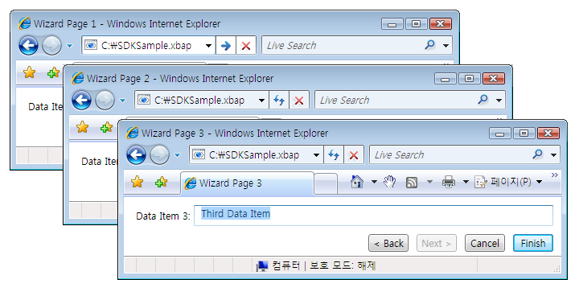
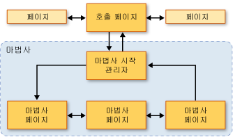
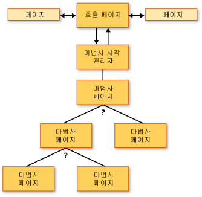
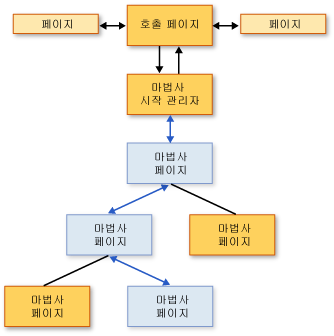
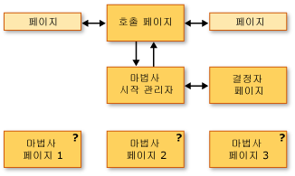
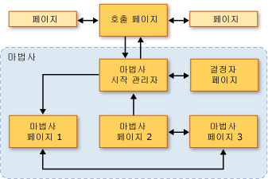

# 탐색 토폴로지 개요
 이 개요에서는 [!INCLUDE[TLA2#tla_wpf](../../../../includes/tla2sharptla-wpf-md.md)]의 탐색 토폴로지를 소개합니다.  세 가지의 일반적인 탐색 토폴로지와 샘플을 차례로 설명합니다.  
  
> [!NOTE]
>  이 항목을 읽기 전에 먼저 페이지 함수를 사용하는 [!INCLUDE[TLA2#tla_wpf](../../../../includes/tla2sharptla-wpf-md.md)]의 구조적 탐색에 대한 개념을 이해하고 있어야 합니다.  이 항목에 대한 자세한 내용은 [구조적 탐색 개요](../../../../docs/framework/wpf/app-development/structured-navigation-overview.md)를 참조하십시오.  
  
 이 항목에는 다음과 같은 단원이 포함되어 있습니다.  
  
-   [탐색 토폴로지](#Navigation_Topologies)  
  
-   [구조적 탐색 토폴로지](#Structured_Navigation_Topologies)  
  
-   [고정 선형 토폴로지 탐색](#Navigation_over_a_Fixed_Linear_Topology)  
  
-   [고정된 계층적 토폴로지 동적 탐색](#Dynamic_Navigation_over_a_Fixed_Hierarchical_Topology)  
  
-   [동적 생성 토폴로지 탐색](#Navigation_over_a_Dynamically_Generated_Topology)  
  
   
## 탐색 토폴로지  
 [!INCLUDE[TLA2#tla_wpf](../../../../includes/tla2sharptla-wpf-md.md)]에서 일반적으로 탐색은 페이지\(<xref:System.Windows.Controls.Page>\) 및 클릭이 발생하면 다른 페이지로 이동하는 하이퍼링크\(<xref:System.Windows.Documents.Hyperlink>\)로 구성됩니다.  탐색되는 페이지는 [!INCLUDE[TLA#tla_uri#plural](../../../../includes/tlasharptla-urisharpplural-md.md)]로 식별할 수 있습니다. 자세한 내용은 [WPF의 Pack URI](../../../../docs/framework/wpf/app-development/pack-uris-in-wpf.md)를 참조하십시오.  다음 간단한 예제에서는 페이지, 하이퍼링크 및 [!INCLUDE[TLA#tla_uri#plural](../../../../includes/tlasharptla-urisharpplural-md.md)]를 보여 줍니다.  
  
 [!code-xml[NavigationTopologiesOverviewSnippets#Page1](../../../../samples/snippets/csharp/VS_Snippets_Wpf/NavigationTopologiesOverviewSnippets/CS/Page1.xaml#page1)]  
  
 [!code-xml[NavigationTopologiesOverviewSnippets#Page2](../../../../samples/snippets/csharp/VS_Snippets_Wpf/NavigationTopologiesOverviewSnippets/CS/Page2.xaml#page2)]  
  
 이러한 페이지는 *탐색 토폴로지*에 따라 정렬되며 토폴로지 구조는 페이지 간의 탐색 방법에 의해 결정됩니다.  이러한 특정 탐색 토폴로지는 간단한 시나리오에 적합하기는 하지만 탐색에 복잡한 토폴로지가 필요할 수 있으며 일부는 응용 프로그램이 실행되고 있을 때에만 정의할 수 있는 것도 있습니다.  
  
 이 항목에서는 가장 일반적인 탐색 토폴로지인 *고정 선형* 토폴로지, *고정된 계층적* 토폴로지 및 *동적 생성* 토폴로지에 대해 설명합니다.  다음 그림과 같이 [!INCLUDE[TLA2#tla_ui](../../../../includes/tla2sharptla-ui-md.md)]가 포함된 샘플을 사용한 각각의 탐색 토폴로지를 보여 줍니다.  
  
   
  
   
## 구조적 탐색 토폴로지  
 탐색 토폴로지에는 크게 두 가지 형식이 있습니다.  
  
-   **고정 토폴로지**: 컴파일될 때 정의되고 런타임에 변경되지 않습니다.  고정 토폴로지는 선형 순서 또는 계층적 순서로 고정된 페이지를 순서대로 탐색할 때 유용합니다.  
  
-   **동적 토폴로지**: 사용자, 응용 프로그램 또는 시스템으로부터 수집된 입력을 기반으로 런타임에 정의됩니다.  동적 토폴로지는 서로 다른 순서로 페이지를 탐색할 때 유용합니다.  
  
 페이지를 사용하여 탐색 토폴로지를 만들 수도 있지만 페이지 함수가 토폴로지 페이지를 통해 데이터를 주고 받는 기능을 단순하게 해주는 추가 기능을 제공하므로 샘플에서는 페이지 함수를 사용합니다.  
  
   
## 고정 선형 토폴로지 탐색  
 고정 선형 토폴로지는 고정된 순서로 하나 이상의 마법사 페이지를 탐색할 수 있는 마법사 구조와 비슷합니다.  다음 그림에서는 고정 선형 토폴로지를 사용하는 마법사의 고급 구조와 흐름을 보여 줍니다.  
  
   
  
 고정 선형 토폴로지를 통한 일반적인 탐색 기능은 다음과 같습니다.  
  
-   호출 페이지에서 시작 관리자 페이지로 이동하며 시작 관리자 페이지는 마법사를 시작하고 첫 번째 마법사 페이지로 이동합니다.  호출 페이지가 첫 번째 마법사 페이지를 직접 호출할 수 있으므로 시작 관리자 페이지\([!INCLUDE[TLA2#tla_ui](../../../../includes/tla2sharptla-ui-md.md)]가 없는 <xref:System.Windows.Navigation.PageFunction%601>\)가 필요하지 않습니다.  그러나 시작 관리자 페이지를 사용하면 특히, 초기화가 복잡한 경우 마법사 초기화를 단순화할 수 있습니다.  
  
-   뒤로 단추와 앞으로 단추 또는 하이퍼링크를 사용하여 페이지를 탐색할 수 있습니다.  
  
-   저널을 사용하여 페이지를 탐색할 수 있습니다.  
  
-   취소 단추를 눌러 모든 마법사 페이지의 마법사를 취소할 수 있습니다.  
  
-   마침 단추를 눌러 마지막 마법사 페이지에서 마법사를 수락할 수 있습니다.  
  
-   마법사가 취소되면 마법사는 적절한 결과를 반환하고 데이터는 반환하지 않습니다.  
  
-   사용자가 마법사를 수락하면 마법사는 적절한 결과를 반환하고 수집한 데이터를 반환합니다.  
  
-   마법사가 완료\(수락 또는 취소\)되면 마법사를 구성하는 페이지가 저널에서 제거됩니다.  이로 인해 마법사의 각 인스턴스가 분리되어 발생 가능한 데이터 또는 상태 오류를 방지할 수 있습니다.  
  
   
## 고정된 계층적 토폴로지 동적 탐색  
 다음 그림과 같이 일부 응용 프로그램에서는 페이지를 사용하여 둘 이상의 다른 페이지로 이동할 수 있습니다.  
  
   
  
 이러한 구조를 고정된 계층적 토폴로지라고 하며 계층을 이동하는 순서는 응용 프로그램 또는 사용자에 의해 런타임에 결정됩니다.  런타임에 둘 이상의 다른 페이지로 이동할 수 있게 해주는 계층의 각 페이지는 어느 페이지로 이동할 것인지 결정하는 데 필요한 데이터를 수집합니다.  다음 그림에서는 앞의 그림을 기반으로 한 여러 가지 가능한 탐색 순서 중 하나를 보여 줍니다.  
  
   
  
 고정된 계층적 구조에서 탐색되는 페이지의 순서가 런타임에 결정된다고 해도 사용자 경험은 고정 선형 토폴로지의 사용자 경험과 동일합니다.  
  
-   호출 페이지에서 시작 관리자 페이지로 이동하며 시작 관리자 페이지는 마법사를 시작하고 첫 번째 마법사 페이지로 이동합니다.  호출 페이지가 첫 번째 마법사 페이지를 직접 호출할 수 있으므로 시작 관리자 페이지\([!INCLUDE[TLA2#tla_ui](../../../../includes/tla2sharptla-ui-md.md)]가 없는 <xref:System.Windows.Navigation.PageFunction%601>\)가 필요하지 않습니다.  그러나 시작 관리자 페이지를 사용하면 특히, 초기화가 복잡한 경우 마법사 초기화를 단순화할 수 있습니다.  
  
-   뒤로 단추와 앞으로 단추 또는 하이퍼링크를 사용하여 페이지를 탐색할 수 있습니다.  
  
-   저널을 사용하여 페이지를 탐색할 수 있습니다.  
  
-   역방향으로 저널을 탐색하는 경우 탐색 순서를 변경할 수 있습니다.  
  
-   취소 단추를 눌러 모든 마법사 페이지의 마법사를 취소할 수 있습니다.  
  
-   마침 단추를 눌러 마지막 마법사 페이지에서 마법사를 수락할 수 있습니다.  
  
-   마법사가 취소되면 마법사는 적절한 결과를 반환하고 데이터는 반환하지 않습니다.  
  
-   사용자가 마법사를 수락하면 마법사는 적절한 결과를 반환하고 수집한 데이터를 반환합니다.  
  
-   마법사가 완료\(수락 또는 취소\)되면 마법사를 구성하는 페이지가 저널에서 제거됩니다.  이로 인해 마법사의 각 인스턴스가 분리되어 발생 가능한 데이터 또는 상태 오류를 방지할 수 있습니다.  
  
   
## 동적 생성 토폴로지 탐색  
 일부 응용 프로그램에서 둘 이상의 페이지를 탐색하는 순서는 사용자, 응용 프로그램 또는 외부 데이터인지에 따라 런타임에만 결정될 수 있습니다.  다음 그림에서는 탐색 순서가 결정되지 않은 페이지 집합을 보여 줍니다.  
  
   
  
 다음 그림에서는 런타임에 사용자가 선택한 탐색 순서를 보여 줍니다.  
  
   
  
 이러한 탐색 순서를 동적 생성 토폴로지라고 합니다.  사용자 경험은 다른 탐색 토폴로지에서와 마찬가지로 동일합니다.  
  
-   호출 페이지에서 시작 관리자 페이지로 이동하며 시작 관리자 페이지는 마법사를 시작하고 첫 번째 마법사 페이지로 이동합니다.  호출 페이지가 첫 번째 마법사 페이지를 직접 호출할 수 있으므로 시작 관리자 페이지\([!INCLUDE[TLA2#tla_ui](../../../../includes/tla2sharptla-ui-md.md)]가 없는 <xref:System.Windows.Navigation.PageFunction%601>\)가 필요하지 않습니다.  그러나 시작 관리자 페이지를 사용하면 특히, 초기화가 복잡한 경우 마법사 초기화를 단순화할 수 있습니다.  
  
-   뒤로 단추와 앞으로 단추 또는 하이퍼링크를 사용하여 페이지를 탐색할 수 있습니다.  
  
-   저널을 사용하여 페이지를 탐색할 수 있습니다.  
  
-   취소 단추를 눌러 모든 마법사 페이지의 마법사를 취소할 수 있습니다.  
  
-   마침 단추를 눌러 마지막 마법사 페이지에서 마법사를 수락할 수 있습니다.  
  
-   마법사가 취소되면 마법사는 적절한 결과를 반환하고 데이터는 반환하지 않습니다.  
  
-   사용자가 마법사를 수락하면 마법사는 적절한 결과를 반환하고 수집한 데이터를 반환합니다.  
  
-   마법사가 완료\(수락 또는 취소\)되면 마법사를 구성하는 페이지가 저널에서 제거됩니다.  이로 인해 마법사의 각 인스턴스가 분리되어 발생 가능한 데이터 또는 상태 오류를 방지할 수 있습니다.  
  
## 참고 항목  
 <xref:System.Windows.Controls.Page>   
 <xref:System.Windows.Navigation.PageFunction%601>   
 <xref:System.Windows.Navigation.NavigationService>   
 [구조적 탐색 개요](../../../../docs/framework/wpf/app-development/structured-navigation-overview.md)