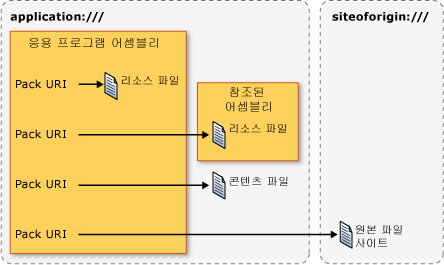

# <a name="pack-uris-in-wpf"></a>WPF의 Pack URI
[!INCLUDE[TLA#tla_wpf](../../../../includes/tlasharptla-wpf-md.md)], [!INCLUDE[TLA#tla_uri#plural](../../../../includes/tlasharptla-urisharpplural-md.md)] 식별 하 고 다음을 포함 한 다양 한 방식 파일을 로드 하는 데 사용 됩니다.  
  
-   지정 하는 [!INCLUDE[TLA#tla_ui](../../../../includes/tlasharptla-ui-md.md)] 표시할 때 응용 프로그램이 처음 시작 합니다.  
  
-   이미지 로드  
  
-   페이지 탐색  
  
-   비실행 데이터 파일 로드  
  
 또한 [!INCLUDE[TLA2#tla_uri#plural](../../../../includes/tla2sharptla-urisharpplural-md.md)] 식별 하 고 다양 한 다음을 포함 한 위치에서에서 파일을 로드 데 사용할 수 있습니다.  
  
-   현재 어셈블리입니다.  
  
-   참조된 어셈블리  
  
-   어셈블리에 상대적인 위치  
  
-   응용 프로그램의 원본 사이트  
  
 식별 하 고 이러한 위치에서 이러한 종류의 파일을 로드에 대 한 일관 된 메커니즘을 제공 하려면 [!INCLUDE[TLA2#tla_wpf](../../../../includes/tla2sharptla-wpf-md.md)] 의 확장성을 이용는 *pack URI 체계*합니다. 이 항목의 체계의 개요를 제공, 팩을 생성 하는 방법에 설명 [!INCLUDE[TLA2#tla_uri#plural](../../../../includes/tla2sharptla-urisharpplural-md.md)] 는 다양 한 시나리오에 대 한 설명 absolute 및 relative [!INCLUDE[TLA2#tla_uri#plural](../../../../includes/tla2sharptla-urisharpplural-md.md)] 및 [!INCLUDE[TLA2#tla_uri](../../../../includes/tla2sharptla-uri-md.md)] 팩을 사용 하는 방법을 보여 주는 하기 전에 해결 [!INCLUDE[TLA2#tla_uri#plural](../../../../includes/tla2sharptla-urisharpplural-md.md)] 두 태그에서 및 코드입니다.  
  
  
<a name="The_Pack_URI_Scheme"></a>   
## <a name="the-pack-uri-scheme"></a>Pack URI 체계  
 팩 [!INCLUDE[TLA2#tla_uri](../../../../includes/tla2sharptla-uri-md.md)] 체계를 사용 하 여는 [Open Packaging Conventions](http://go.microsoft.com/fwlink/?LinkID=71255) 을 구성 하 고 내용을 식별 하는 모델을 설명 하는 (OPC) 사양입니다. 패키지 및 파트를이 모델의 주요 요소는 여기서는 *패키지* 인지 논리적 컨테이너 하나에 대 한 더 많은 논리 *부분*합니다. 다음 그림에서는 이 개념을 보여 줍니다.  
  
   
  
 OPC 사양 파트를 식별 하려면 RFC 2396의 확장성을 이용 (식별자 URI (Uniform Resource): 일반 구문을) pack을 정의 하려면 [!INCLUDE[TLA2#tla_uri](../../../../includes/tla2sharptla-uri-md.md)] 구성표입니다.  
  
 지정한 구성표는 [!INCLUDE[TLA2#tla_uri](../../../../includes/tla2sharptla-uri-md.md)] 접두사로; 정의 http, ftp 및 파일은 잘 알려진 예입니다. 팩 [!INCLUDE[TLA2#tla_uri](../../../../includes/tla2sharptla-uri-md.md)] 체계 "pack"을 사용 하 여 해당 스키마 및 두 개의 구성 요소가 포함 되어: 기관과 경로입니다. 다음은 팩 형식 [!INCLUDE[TLA2#tla_uri](../../../../includes/tla2sharptla-uri-md.md)]합니다.  
  
 팩: / /*기관*/*경로*
  
 *기관* 일부 포함 된 패키지의 유형을 지정 하는 동안는 *경로* 파트 패키지 내에서 위치를 지정 합니다.  
  
 다음 그림에서는 이 개념을 보여 줍니다.  
  
   
  
 패키지와 파트는 응용 프로그램 및 파일과 유사합니다. 즉, 응용 프로그램(패키지)은 다음을 비롯한 하나 이상의 파일(파트)을 포함할 수 있습니다.  
  
-   로컬 어셈블리로 컴파일되는 리소스 파일  
  
-   참조된 어셈블리로 컴파일되는 리소스 파일  
  
-   참조하는 어셈블리로 컴파일되는 리소스 파일  
  
-   콘텐츠 파일  
  
-   원본 사이트 파일  
  
 이러한 종류의 파일을 액세스 하려면 [!INCLUDE[TLA2#tla_wpf](../../../../includes/tla2sharptla-wpf-md.md)] 두 인증 기관과 지원: 응용 프로그램: / / / 및 siteoforigin: / / /입니다. application:/// 인증 기관은 리소스 및 콘텐츠 파일을 비롯하여 컴파일 시 알려진 응용 프로그램 데이터 파일을 식별합니다. siteoforigin:/// 인증 기관은 원본 사이트 파일을 식별합니다. 다음 그림에서는 각 인증 기관의 범위를 보여 줍니다.  
  
   
  
> [!NOTE]
>  팩의 인증 기관 구성 요소가 [!INCLUDE[TLA2#tla_uri](../../../../includes/tla2sharptla-uri-md.md)] 포함 된 [!INCLUDE[TLA2#tla_uri](../../../../includes/tla2sharptla-uri-md.md)] 패키지를 가리키는 하 고 RFC 2396 따라야 합니다. 또한 “/” 문자를 “,” 문자로 바꾸고 “%” 및 “?” 같은 예약 문자는 이스케이프해야 합니다. 자세한 내용은 OPC를 참조하세요.  
  
 다음 섹션에서는 팩을 생성 하는 방법을 설명 [!INCLUDE[TLA2#tla_uri#plural](../../../../includes/tla2sharptla-urisharpplural-md.md)] 리소스, 내용 및 원본 파일의 사이트 식별 하는 데 적절 한 경로와 함께에서이 두 인증 기관과 사용 하 여 합니다.  
  
<a name="Resource_File_Pack_URIs___Local_Assembly"></a>   
## <a name="resource-file-pack-uris"></a>리소스 파일 Pack URI  
 리소스 파일으로 구성 된 [!INCLUDE[TLA2#tla_msbuild](../../../../includes/tla2sharptla-msbuild-md.md)] `Resource` 항목 및 어셈블리에 컴파일됩니다. [!INCLUDE[TLA2#tla_wpf](../../../../includes/tla2sharptla-wpf-md.md)]팩의 생성을 지원 [!INCLUDE[TLA2#tla_uri#plural](../../../../includes/tla2sharptla-urisharpplural-md.md)] 로컬 어셈블리로 컴파일된 되거나 로컬 어셈블리에서 참조 되는 어셈블리로 컴파일된 리소스 파일을 식별 하는 데 사용 하는 합니다.  
  
<a name="Local_Assembly_Resource_File"></a>   
### <a name="local-assembly-resource-file"></a>로컬 어셈블리 리소스 파일  
 팩 [!INCLUDE[TLA2#tla_uri](../../../../includes/tla2sharptla-uri-md.md)] 리소스에 대 한 로컬 어셈블리로 컴파일된 파일 다음 기관과 경로 사용 합니다.  
  
-   **인증 기관**: application:///  
  
-   **경로**: 로컬 어셈블리 프로젝트 폴더 루트에 상대적인 경로를 포함한 리소스 파일의 이름  
  
 다음 예제에서는 팩 [!INCLUDE[TLA2#tla_uri](../../../../includes/tla2sharptla-uri-md.md)] 에 대 한는 [!INCLUDE[TLA2#tla_xaml](../../../../includes/tla2sharptla-xaml-md.md)] 로컬 어셈블리의 프로젝트 폴더의 루트에 있는 리소스 파일입니다.  
  
 `pack://application:,,,/ResourceFile.xaml`  
  
 다음 예제에서는 팩 [!INCLUDE[TLA2#tla_uri](../../../../includes/tla2sharptla-uri-md.md)] 에 대 한는 [!INCLUDE[TLA2#tla_xaml](../../../../includes/tla2sharptla-xaml-md.md)] 로컬 어셈블리의 프로젝트 폴더의 하위 폴더에 있는 리소스 파일입니다.  
  
 `pack://application:,,,/Subfolder/ResourceFile.xaml`  
  
<a name="Resource_File_Pack_URIs___Referenced_Assembly"></a>   
### <a name="referenced-assembly-resource-file"></a>참조된 어셈블리 리소스 파일  
 팩 [!INCLUDE[TLA2#tla_uri](../../../../includes/tla2sharptla-uri-md.md)] 리소스에 대 한 파일 참조 어셈블리로 컴파일되는 다음 기관과 경로 사용 합니다.  
  
-   **인증 기관**: application:///  
  
-   **경로**: 참조된 어셈블리로 컴파일되는 리소스 파일의 이름. 경로는 다음 형식을 따라야 합니다.  
  
     *AssemblyShortName*{*; 버전*] {*; PublicKey*]; component /*경로*  
  
    -   **AssemblyShortName**: 참조된 어셈블리에 대한 약식 이름  
  
    -   **;Version**[옵션]: 리소스 파일을 포함하는 참조된 어셈블리의 버전. 동일한 약식 이름을 갖는 두 개 이상의 참조된 어셈블리가 로드된 경우 사용됩니다.  
  
    -   **;PublicKey**[옵션]: 참조된 어셈블리를 서명하는 데 사용된 공개 키. 동일한 약식 이름을 갖는 두 개 이상의 참조된 어셈블리가 로드된 경우 사용됩니다.  
  
    -   **;component**: 참조되는 어셈블리가 로컬 어셈블리에서 참조된다는 것을 지정  
  
    -   **/Path**: 참조된 어셈블리 프로젝트 폴더의 루트에 상대적인 경로를 포함한 리소스 파일의 이름  
  
 다음 예제에서는 팩 [!INCLUDE[TLA2#tla_uri](../../../../includes/tla2sharptla-uri-md.md)] 에 대 한 한 [!INCLUDE[TLA2#tla_xaml](../../../../includes/tla2sharptla-xaml-md.md)] 참조 된 어셈블리의 프로젝트 폴더의 루트에 있는 리소스 파일입니다.  
  
 `pack://application:,,,/ReferencedAssembly;component/ResourceFile.xaml`  
  
 다음 예제에서는 팩 [!INCLUDE[TLA2#tla_uri](../../../../includes/tla2sharptla-uri-md.md)] 에 대 한 한 [!INCLUDE[TLA2#tla_xaml](../../../../includes/tla2sharptla-xaml-md.md)] 참조 된 어셈블리의 프로젝트 폴더의 하위 폴더에 있는 리소스 파일입니다.  
  
 `pack://application:,,,/ReferencedAssembly;component/Subfolder/ResourceFile.xaml`  
  
 다음 예제에서는 팩 [!INCLUDE[TLA2#tla_uri](../../../../includes/tla2sharptla-uri-md.md)] 에 대 한 한 [!INCLUDE[TLA2#tla_xaml](../../../../includes/tla2sharptla-xaml-md.md)] 참조 되는 버전 별로 어셈블리의 프로젝트 폴더의 루트 폴더에 있는 리소스 파일입니다.  
  
 `pack://application:,,,/ReferencedAssembly;v1.0.0.1;component/ResourceFile.xaml`  
  
 pack [!INCLUDE[TLA2#tla_uri](../../../../includes/tla2sharptla-uri-md.md)] 구문 참조 어셈블리 리소스 파일에 대 한 응용 프로그램 에서만 사용할 수 있습니다: / / / 기관입니다. 예를 들어 다음에서 지원 되지 않습니다 [!INCLUDE[TLA2#tla_wpf](../../../../includes/tla2sharptla-wpf-md.md)]합니다.  
  
 `pack://siteoforigin:,,,/SomeAssembly;component/ResourceFile.xaml`  
  
<a name="Content_File_Pack_URIs"></a>   
## <a name="content-file-pack-uris"></a>콘텐츠 파일 Pack URI  
 팩 [!INCLUDE[TLA2#tla_uri](../../../../includes/tla2sharptla-uri-md.md)] 콘텐츠 파일은 다음 인증 기관과 경로 사용 하 여:  
  
-   **인증 기관**: application:///  
  
-   **경로**: 응용 프로그램의 주 실행 가능 어셈블리의 파일 시스템 위치에 상대적인 경로를 포함한 콘텐츠 파일의 이름  
  
 다음 예제에서는 팩 [!INCLUDE[TLA2#tla_uri](../../../../includes/tla2sharptla-uri-md.md)] 에 대 한는 [!INCLUDE[TLA2#tla_xaml](../../../../includes/tla2sharptla-xaml-md.md)] 실행 가능한 어셈블리와 같은 폴더에 있는 콘텐츠 파일을 합니다.  
  
 `pack://application:,,,/ContentFile.xaml`  
  
 다음 예제에서는 팩 [!INCLUDE[TLA2#tla_uri](../../../../includes/tla2sharptla-uri-md.md)] 에 대 한는 [!INCLUDE[TLA2#tla_xaml](../../../../includes/tla2sharptla-xaml-md.md)] 응용 프로그램의 실행 가능한 어셈블리에 상대적인 하위 폴더에 있는 콘텐츠 파일을 합니다.  
  
 `pack://application:,,,/Subfolder/ContentFile.xaml`  
  
> [!NOTE]
>  [!INCLUDE[TLA2#tla_html](../../../../includes/tla2sharptla-html-md.md)] 콘텐츠 파일은 탐색할 수 없습니다. [!INCLUDE[TLA2#tla_uri](../../../../includes/tla2sharptla-uri-md.md)] 구성표 탐색을 지원 [!INCLUDE[TLA2#tla_html](../../../../includes/tla2sharptla-html-md.md)] 있는 파일을 원본 사이트에 있습니다.  
  
<a name="The_siteoforigin_____Authority"></a>   
## <a name="site-of-origin-pack-uris"></a>원본 사이트 Pack URI  
 팩 [!INCLUDE[TLA2#tla_uri](../../../../includes/tla2sharptla-uri-md.md)] 원본 사이트에 대 한 파일 다음 기관과 경로 사용 합니다.  
  
-   **인증 기관**: siteoforigin:///  
  
-   **경로**: 실행 가능 어셈블리가 시작된 위치에 상대적인 경로를 포함한 원본 사이트 파일의 이름  
  
 다음 예제에서는 팩 [!INCLUDE[TLA2#tla_uri](../../../../includes/tla2sharptla-uri-md.md)] 에 대 한는 [!INCLUDE[TLA2#tla_xaml](../../../../includes/tla2sharptla-xaml-md.md)] 원본 사이트 파일을 실행 가능한 어셈블리가 시작 된 위치에 저장 합니다.  
  
 `pack://siteoforigin:,,,/SiteOfOriginFile.xaml`  
  
 다음 예제에서는 팩 [!INCLUDE[TLA2#tla_uri](../../../../includes/tla2sharptla-uri-md.md)] 에 대 한는 [!INCLUDE[TLA2#tla_xaml](../../../../includes/tla2sharptla-xaml-md.md)] 원본 사이트 파일을 응용 프로그램의 실행 가능한 어셈블리 시작 위치에 상대적인 하위 폴더에 저장 합니다.  
  
 `pack://siteoforigin:,,,/Subfolder/SiteOfOriginFile.xaml`  
  
<a name="Page_Files"></a>   
## <a name="page-files"></a>페이지 파일  
 [!INCLUDE[TLA2#tla_xaml](../../../../includes/tla2sharptla-xaml-md.md)]으로 구성 된 파일 [!INCLUDE[TLA2#tla_msbuild](../../../../includes/tla2sharptla-msbuild-md.md)] `Page` 항목 리소스 파일과 마찬가지로 어셈블리로 컴파일됩니다. 따라서 [!INCLUDE[TLA2#tla_msbuild](../../../../includes/tla2sharptla-msbuild-md.md)] `Page` 팩을 사용 하 여 항목을 식별할 수 있습니다 [!INCLUDE[TLA2#tla_uri#plural](../../../../includes/tla2sharptla-urisharpplural-md.md)] 리소스 파일에 대 한 합니다.  
  
 유형의 [!INCLUDE[TLA2#tla_xaml](../../../../includes/tla2sharptla-xaml-md.md)] 가 일반적으로 구성 하는 파일 [!INCLUDE[TLA2#tla_msbuild](../../../../includes/tla2sharptla-msbuild-md.md)] `Page` 항목은 해당 루트 요소에 따라 다음 중 하나:  
  
-   <xref:System.Windows.Window?displayProperty=nameWithType>  
  
-   <xref:System.Windows.Controls.Page?displayProperty=nameWithType>  
  
-   <xref:System.Windows.Navigation.PageFunction%601?displayProperty=nameWithType>  
  
-   <xref:System.Windows.ResourceDictionary?displayProperty=nameWithType>  
  
-   <xref:System.Windows.Documents.FlowDocument?displayProperty=nameWithType>  
  
-   <xref:System.Windows.Controls.UserControl?displayProperty=nameWithType>  
  
<a name="Absolute_vs_Relative_Pack_URIs"></a>   
## <a name="absolute-vs-relative-pack-uris"></a>절대 및 상대 Pack URI  
 정규화 된 팩 [!INCLUDE[TLA2#tla_uri](../../../../includes/tla2sharptla-uri-md.md)] 체계, 기관, 및 경로 포함 절대 팩 이라고 [!INCLUDE[TLA2#tla_uri](../../../../includes/tla2sharptla-uri-md.md)]합니다. 개발자를 위한 단순화 된 버전으로 [!INCLUDE[TLA2#tla_xaml](../../../../includes/tla2sharptla-xaml-md.md)] 요소 일반적으로 설정할 수 있도록 적절 한 특성 상대 팩 [!INCLUDE[TLA2#tla_uri](../../../../includes/tla2sharptla-uri-md.md)]만 경로 포함 하 합니다.  
  
 예를 들어 다음과 같은 절대 pack [!INCLUDE[TLA2#tla_uri](../../../../includes/tla2sharptla-uri-md.md)] 로컬 어셈블리에 리소스 파일에 대 한 합니다.  
  
 `pack://application:,,,/ResourceFile.xaml`  
  
 상대 팩 [!INCLUDE[TLA2#tla_uri](../../../../includes/tla2sharptla-uri-md.md)] 이 리소스를 참조 하는 파일에는 다음 것입니다.  
  
 `/ResourceFile.xaml`  
  
> [!NOTE]
>  원본 사이트 파일의 어셈블리와 연결 되어 있지 않으므로 있습니다만 참조할 수 절대 팩 [!INCLUDE[TLA2#tla_uri#plural](../../../../includes/tla2sharptla-urisharpplural-md.md)]합니다.  
  
 기본적으로 상대 팩 [!INCLUDE[TLA2#tla_uri](../../../../includes/tla2sharptla-uri-md.md)] 태그 또는 참조를 포함 하는 코드의 위치에 상대적인 것으로 간주 됩니다. 그러나 앞에 백슬래시를 사용 하는 경우 상대 pack [!INCLUDE[TLA2#tla_uri](../../../../includes/tla2sharptla-uri-md.md)] 참조는 응용 프로그램의 루트를 기준으로 간주 됩니다. 예를 들어 다음과 같은 프로젝트 구조를 가정해 봅니다.  
  
 `App.xaml`  
  
 `Page2.xaml`  
  
 `\SubFolder`  
  
 `+ Page1.xaml`  
  
 `+ Page2.xaml`  
  
 Page1.xaml 포함 되어 있는 경우는 [!INCLUDE[TLA2#tla_uri](../../../../includes/tla2sharptla-uri-md.md)] 참조 하는 *루트*\SubFolder\Page2.xaml, 참조가 다음 상대 팩을 사용할 수 [!INCLUDE[TLA2#tla_uri](../../../../includes/tla2sharptla-uri-md.md)]합니다.  
  
 `Page2.xaml`  
  
 Page1.xaml 포함 되어 있는 경우는 [!INCLUDE[TLA2#tla_uri](../../../../includes/tla2sharptla-uri-md.md)] 참조 하는 *루트*\Page2.xaml, 참조가 다음 상대 팩을 사용할 수 [!INCLUDE[TLA2#tla_uri](../../../../includes/tla2sharptla-uri-md.md)]합니다.  
  
 `/Page2.xaml`  
  
<a name="Pack_URI_Resolution"></a>   
## <a name="pack-uri-resolution"></a>Pack URI 확인  
 팩 형식을 [!INCLUDE[TLA2#tla_uri#plural](../../../../includes/tla2sharptla-urisharpplural-md.md)] 팩용 수는 [!INCLUDE[TLA2#tla_uri#plural](../../../../includes/tla2sharptla-urisharpplural-md.md)] 여러 가지 유형의 파일을 동일 하 게 보입니다. 예를 들어 다음과 같은 절대 pack [!INCLUDE[TLA2#tla_uri](../../../../includes/tla2sharptla-uri-md.md)]합니다.  
  
 `pack://application:,,,/ResourceOrContentFile.xaml`  
  
 이 절대 팩 [!INCLUDE[TLA2#tla_uri](../../../../includes/tla2sharptla-uri-md.md)] 로컬 어셈블리에 리소스 파일 또는 콘텐츠 파일을 참조할 수 있습니다. 다음 상대에도 마찬가지입니다 [!INCLUDE[TLA2#tla_uri](../../../../includes/tla2sharptla-uri-md.md)]합니다.  
  
 `/ResourceOrContentFile.xaml`  
  
 유형의 파일을 확인 하기 위해 한 팩 [!INCLUDE[TLA2#tla_uri](../../../../includes/tla2sharptla-uri-md.md)] 참조 하 [!INCLUDE[TLA2#tla_wpf](../../../../includes/tla2sharptla-wpf-md.md)] 해결 [!INCLUDE[TLA2#tla_uri#plural](../../../../includes/tla2sharptla-urisharpplural-md.md)] 로컬 어셈블리 및 다음과 같은 추론을 사용 하 여 콘텐츠 파일에서 리소스 파일:  
  
1.  어셈블리 메타 데이터에 대 한 프로브는 <xref:System.Windows.Resources.AssemblyAssociatedContentFileAttribute> pack 일치 하는 특성 [!INCLUDE[TLA2#tla_uri](../../../../includes/tla2sharptla-uri-md.md)]합니다.  
  
2.  경우는 <xref:System.Windows.Resources.AssemblyAssociatedContentFileAttribute> , 특성이 있으면 해당 팩의 경로 [!INCLUDE[TLA2#tla_uri](../../../../includes/tla2sharptla-uri-md.md)] 콘텐츠 파일을 참조 합니다.  
  
3.  경우는 <xref:System.Windows.Resources.AssemblyAssociatedContentFileAttribute> 로컬 어셈블리로 컴파일되는 리소스 파일 집합을 검색, 특성을 찾을 수 없습니다.  
  
4.  리소스 파일 팩의 경로 일치 하는 경우 [!INCLUDE[TLA2#tla_uri](../../../../includes/tla2sharptla-uri-md.md)] 발견 되 면 팩 경로 [!INCLUDE[TLA2#tla_uri](../../../../includes/tla2sharptla-uri-md.md)] 리소스 파일을 참조 합니다.  
  
5.  리소스가 없는 경우, 내부적으로 생성 <xref:System.Uri> 올바르지 않습니다.  
  
 [!INCLUDE[TLA2#tla_uri](../../../../includes/tla2sharptla-uri-md.md)]해결 방법에 대 한 적용 되지 않습니다 [!INCLUDE[TLA2#tla_uri#plural](../../../../includes/tla2sharptla-urisharpplural-md.md)] 하는 다음을 참조 하십시오.  
  
-   참조 된 어셈블리의 콘텐츠 파일:이 파일 형식에서 지원 되지 않습니다 [!INCLUDE[TLA2#tla_wpf](../../../../includes/tla2sharptla-wpf-md.md)]합니다.  
  
-   참조 된 어셈블리에 포함 된 파일: [!INCLUDE[TLA2#tla_uri#plural](../../../../includes/tla2sharptla-urisharpplural-md.md)] 을 식별 하는 참조 된 어셈블리의 이름을 둘 다 포함 되어 있으므로 고유 및 `;component` 접미사입니다.  
  
-   원본 사이트 파일: [!INCLUDE[TLA2#tla_uri#plural](../../../../includes/tla2sharptla-urisharpplural-md.md)] 식별 하는 팩으로 식별할 수 있는 파일만 되기 때문에 고유 [!INCLUDE[TLA2#tla_uri#plural](../../../../includes/tla2sharptla-urisharpplural-md.md)] 는 siteoforigin를 포함 하는: / / / 기관입니다.  
  
 압축 하는 한 가지 단순화 [!INCLUDE[TLA2#tla_uri](../../../../includes/tla2sharptla-uri-md.md)] 확인을 사용 하면 코드가 리소스 및 콘텐츠 파일의 위치와 다소 독립적일 수 있습니다. 예를 들어, 된 콘텐츠 파일에서 팩 다시 구성 되는 로컬 어셈블리에 리소스 파일의 경우 [!INCLUDE[TLA2#tla_uri](../../../../includes/tla2sharptla-uri-md.md)] 리소스 동일 하 게 유지, 마찬가지로 pack을 사용 하는 코드에 대 한 [!INCLUDE[TLA2#tla_uri](../../../../includes/tla2sharptla-uri-md.md)]합니다.  
  
<a name="Programming_with_Pack_URIs"></a>   
## <a name="programming-with-pack-uris"></a>Pack URI를 사용한 프로그래밍  
 많은 [!INCLUDE[TLA2#tla_wpf](../../../../includes/tla2sharptla-wpf-md.md)] 팩 설정 될 수 있는 속성을 구현 하는 클래스 [!INCLUDE[TLA2#tla_uri#plural](../../../../includes/tla2sharptla-urisharpplural-md.md)]를 포함 하 여:  
  
-   <xref:System.Windows.Application.StartupUri%2A?displayProperty=nameWithType>  
  
-   <xref:System.Windows.Controls.Frame.Source%2A?displayProperty=nameWithType>  
  
-   <xref:System.Windows.Navigation.NavigationWindow.Source%2A?displayProperty=nameWithType>  
  
-   <xref:System.Windows.Documents.Hyperlink.NavigateUri%2A?displayProperty=nameWithType>  
  
-   <xref:System.Windows.Window.Icon%2A?displayProperty=nameWithType>  
  
-   <xref:System.Windows.Controls.Image.Source%2A?displayProperty=nameWithType>  
  
 이러한 속성을 태그와 코드 모두에서 설정할 수 있습니다. 이 섹션에서는 두 경우에 대한 기본 구조를 설명한 다음 일반적인 시나리오 예제를 보여 줍니다.  
  
<a name="Using_Pack_URIs_in_Markup"></a>   
### <a name="using-pack-uris-in-markup"></a>태그에서 Pack URI 사용  
 팩 [!INCLUDE[TLA2#tla_uri](../../../../includes/tla2sharptla-uri-md.md)] 에서 팩을 사용 하 여 특성의 요소를 설정 하 여 태그에 지정 된 [!INCLUDE[TLA2#tla_uri](../../../../includes/tla2sharptla-uri-md.md)]합니다. 예:  
  
 `<element attribute="pack://application:,,,/File.xaml" />`  
  
 표 1은 다양 한 절대 팩 [!INCLUDE[TLA2#tla_uri#plural](../../../../includes/tla2sharptla-urisharpplural-md.md)] 태그에서 지정할 수 있는 합니다.  
  
 표 1: 태그의 절대 Pack URI  
  
|파일|절대 팩[!INCLUDE[TLA2#tla_uri](../../../../includes/tla2sharptla-uri-md.md)]|  
|----------|-------------------------------------------------------------------------------------------------------------------------|  
|리소스 파일 - 로컬 어셈블리|`"pack://application:,,,/ResourceFile.xaml"`|  
|하위 폴더의 리소스 파일 - 로컬 어셈블리|`"pack://application:,,,/Subfolder/ResourceFile.xaml"`|  
|리소스 파일 - 참조된 어셈블리|`"pack://application:,,,/ReferencedAssembly;component/ResourceFile.xaml"`|  
|참조된 어셈블리의 하위 폴더에 있는 리소스 파일|`"pack://application:,,,/ReferencedAssembly;component/Subfolder/ResourceFile.xaml"`|  
|버전이 있는 참조된 어셈블리의 리소스 파일|`"pack://application:,,,/ReferencedAssembly;v1.0.0.0;component/ResourceFile.xaml"`|  
|콘텐츠 파일|`"pack://application:,,,/ContentFile.xaml"`|  
|하위 폴더의 콘텐츠 파일|`"pack://application:,,,/Subfolder/ContentFile.xaml"`|  
|원본 사이트 파일|`"pack://siteoforigin:,,,/SOOFile.xaml"`|  
|하위 폴더의 원본 사이트 파일|`"pack://siteoforigin:,,,/Subfolder/SOOFile.xaml"`|  
  
 표 2에서는 다양 한 상대 pack [!INCLUDE[TLA2#tla_uri#plural](../../../../includes/tla2sharptla-urisharpplural-md.md)] 태그에서 지정할 수 있는 합니다.  
  
 표 2: 태그의 상대 Pack URI  
  
|파일|상대 팩[!INCLUDE[TLA2#tla_uri](../../../../includes/tla2sharptla-uri-md.md)]|  
|----------|-------------------------------------------------------------------------------------------------------------------------|  
|로컬 어셈블리의 리소스 파일|`"/ResourceFile.xaml"`|  
|로컬 어셈블리의 하위 폴더에 있는 리소스 파일|`"/Subfolder/ResourceFile.xaml"`|  
|참조된 어셈블리의 리소스 파일|`"/ReferencedAssembly;component/ResourceFile.xaml"`|  
|참조된 어셈블리의 하위 폴더에 있는 리소스 파일|`"/ReferencedAssembly;component/Subfolder/ResourceFile.xaml"`|  
|콘텐츠 파일|`"/ContentFile.xaml"`|  
|하위 폴더의 콘텐츠 파일|`"/Subfolder/ContentFile.xaml"`|  
  
<a name="Using_Pack_URIs_in_Code"></a>   
### <a name="using-pack-uris-in-code"></a>코드에서 Pack URI 사용  
 팩을 지정 [!INCLUDE[TLA2#tla_uri](../../../../includes/tla2sharptla-uri-md.md)] 인스턴스화하여 코드에는 <xref:System.Uri> pack 전달과 클래스 [!INCLUDE[TLA2#tla_uri](../../../../includes/tla2sharptla-uri-md.md)] 생성자에 매개 변수로 합니다. 다음 예제를 통해 볼 수 있습니다.  
  
```csharp  
Uri uri = new Uri("pack://application:,,,/File.xaml");  
```  
  
 기본적으로는 <xref:System.Uri> 클래스 고려 팩 [!INCLUDE[TLA2#tla_uri#plural](../../../../includes/tla2sharptla-urisharpplural-md.md)] 절대적으로 합니다. 인스턴스가 예외가 발생 하는 따라서는 <xref:System.Uri> 상대 팩 클래스를 만들 [!INCLUDE[TLA2#tla_uri](../../../../includes/tla2sharptla-uri-md.md)]합니다.  
  
```csharp  
Uri uri = new Uri("/File.xaml");  
```  
  
 다행히는 <xref:System.Uri.%23ctor%28System.String%2CSystem.UriKind%29> 오버 로드는 <xref:System.Uri> 형식의 매개 변수를 허용 하는 클래스 생성자 <xref:System.UriKind> 지정할 수 있도록 여부는 팩 [!INCLUDE[TLA2#tla_uri](../../../../includes/tla2sharptla-uri-md.md)] 은 절대 또는 상대 합니다.  
  
```csharp  
// Absolute URI (default)  
Uri absoluteUri = new Uri("pack://application:,,,/File.xaml", UriKind.Absolute);  
// Relative URI  
Uri relativeUri = new Uri("/File.xaml",   
                        UriKind.Relative);  
```  
  
 만 지정 해야 <xref:System.UriKind.Absolute> 또는 <xref:System.UriKind.Relative> 되었음을 확인 하 고 있는 경우 제공 된 팩 [!INCLUDE[TLA2#tla_uri](../../../../includes/tla2sharptla-uri-md.md)] 은 둘 중 하나입니다. 팩 유형 알지 못하는 경우 [!INCLUDE[TLA2#tla_uri](../../../../includes/tla2sharptla-uri-md.md)] 사용 되는, 사용자가을 팩을 입력 하는 경우 같은 [!INCLUDE[TLA2#tla_uri](../../../../includes/tla2sharptla-uri-md.md)] 실행 시 사용 하 여 <xref:System.UriKind.RelativeOrAbsolute> 대신 합니다.  
  
```csharp  
// Relative or Absolute URI provided by user via a text box  
TextBox userProvidedUriTextBox = new TextBox();  
Uri uri = new Uri(userProvidedUriTextBox.Text, UriKind.RelativeOrAbsolute);  
```  
  
 표 3에서는 다양 한 상대 pack [!INCLUDE[TLA2#tla_uri#plural](../../../../includes/tla2sharptla-urisharpplural-md.md)] 를 사용 하 여 코드에서 지정할 수 있는 <xref:System.Uri?displayProperty=nameWithType>합니다.  
  
 표 3: 코드의 절대 Pack URI  
  
|파일|절대 팩[!INCLUDE[TLA2#tla_uri](../../../../includes/tla2sharptla-uri-md.md)]|  
|----------|-------------------------------------------------------------------------------------------------------------------------|  
|리소스 파일 - 로컬 어셈블리|`Uri uri = new Uri("pack://application:,,,/ResourceFile.xaml", UriKind.Absolute);`|  
|하위 폴더의 리소스 파일 - 로컬 어셈블리|`Uri uri = new Uri("pack://application:,,,/Subfolder/ResourceFile.xaml", UriKind.Absolute);`|  
|리소스 파일 - 참조된 어셈블리|`Uri uri = new Uri("pack://application:,,,/ReferencedAssembly;component/ResourceFile.xaml", UriKind.Absolute);`|  
|참조된 어셈블리의 하위 폴더에 있는 리소스 파일|`Uri uri = new Uri("pack://application:,,,/ReferencedAssembly;component/Subfolder/ResourceFile.xaml", UriKind.Absolute);`|  
|버전이 있는 참조된 어셈블리의 리소스 파일|`Uri uri = new Uri("pack://application:,,,/ReferencedAssembly;v1.0.0.0;component/ResourceFile.xaml", UriKind.Absolute);`|  
|콘텐츠 파일|`Uri uri = new Uri("pack://application:,,,/ContentFile.xaml", UriKind.Absolute);`|  
|하위 폴더의 콘텐츠 파일|`Uri uri = new Uri("pack://application:,,,/Subfolder/ContentFile.xaml", UriKind.Absolute);`|  
|원본 사이트 파일|`Uri uri = new Uri("pack://siteoforigin:,,,/SOOFile.xaml", UriKind.Absolute);`|  
|하위 폴더의 원본 사이트 파일|`Uri uri = new Uri("pack://siteoforigin:,,,/Subfolder/SOOFile.xaml", UriKind.Absolute);`|  
  
 표 4에서는 다양 한 상대 pack [!INCLUDE[TLA2#tla_uri#plural](../../../../includes/tla2sharptla-urisharpplural-md.md)] 사용 하 여 코드에서 지정할 수 있는 <xref:System.Uri?displayProperty=nameWithType>합니다.  
  
 표 4: 코드의 상대 Pack URI  
  
|파일|상대 팩[!INCLUDE[TLA2#tla_uri](../../../../includes/tla2sharptla-uri-md.md)]|  
|----------|-------------------------------------------------------------------------------------------------------------------------|  
|리소스 파일 - 로컬 어셈블리|`Uri uri = new Uri("/ResourceFile.xaml", UriKind.Relative);`|  
|하위 폴더의 리소스 파일 - 로컬 어셈블리|`Uri uri = new Uri("/Subfolder/ResourceFile.xaml", UriKind.Relative);`|  
|리소스 파일 - 참조된 어셈블리|`Uri uri = new Uri("/ReferencedAssembly;component/ResourceFile.xaml", UriKind.Relative);`|  
|하위 폴더의 리소스 파일 - 참조된 어셈블리|`Uri uri = new Uri("/ReferencedAssembly;component/Subfolder/ResourceFile.xaml", UriKind.Relative);`|  
|콘텐츠 파일|`Uri uri = new Uri("/ContentFile.xaml", UriKind.Relative);`|  
|하위 폴더의 콘텐츠 파일|`Uri uri = new Uri("/Subfolder/ContentFile.xaml", UriKind.Relative);`|  
  
<a name="Common_Pack_URI_Scenarios"></a>   
### <a name="common-pack-uri-scenarios"></a>일반적인 Pack URI 시나리오  
 앞의 섹션에서는 팩을 생성 하는 방법을 살펴보았습니다 [!INCLUDE[TLA2#tla_uri#plural](../../../../includes/tla2sharptla-urisharpplural-md.md)] 리소스, 내용 및 원본 사이트 파일을 식별할 수 있습니다. [!INCLUDE[TLA2#tla_wpf](../../../../includes/tla2sharptla-wpf-md.md)], 이러한 구성은 다양 한 방식으로에 사용 되 고 다음 섹션에서는 몇 가지 일반적인 사용을 설명 합니다.  
  
<a name="Specifying_the_UI_to_Show_when_an_Application_Starts"></a>   
#### <a name="specifying-the-ui-to-show-when-an-application-starts"></a>응용 프로그램을 시작할 때 표시되는 UI 지정  
 <xref:System.Windows.Application.StartupUri%2A>첫 번째 지정 [!INCLUDE[TLA2#tla_ui](../../../../includes/tla2sharptla-ui-md.md)] 때 표시 되는 [!INCLUDE[TLA2#tla_wpf](../../../../includes/tla2sharptla-wpf-md.md)] 응용 프로그램이 시작 됩니다. 독립 실행형 응용 프로그램의 [!INCLUDE[TLA2#tla_ui](../../../../includes/tla2sharptla-ui-md.md)] 다음 예제와 같이 창 일 수 있습니다.  
  
 [!code-xaml[PackURIOverviewSnippets#StartupUriWindow](../../../../samples/snippets/csharp/VS_Snippets_Wpf/PackURIOverviewSnippets/CS/Copy of App.xaml#startupuriwindow)]  
  
 독립 실행형 응용 프로그램 및 [!INCLUDE[TLA#tla_xbap#plural](../../../../includes/tlasharptla-xbapsharpplural-md.md)] 다음 예제와 같이 초기 UI로 페이지를 지정할 수도 있습니다.  
  
 [!code-xaml[PackURIOverviewSnippets#StartupUriPage](../../../../samples/snippets/csharp/VS_Snippets_Wpf/PackURIOverviewSnippets/CS/App.xaml#startupuripage)]  
  
 응용 프로그램은 독립 실행형 응용 프로그램 및 한 페이지를 지정 하는 경우 <xref:System.Windows.Application.StartupUri%2A>, [!INCLUDE[TLA2#tla_wpf](../../../../includes/tla2sharptla-wpf-md.md)] 열립니다는 <xref:System.Windows.Navigation.NavigationWindow> 페이지를 호스팅합니다. 에 대 한 [!INCLUDE[TLA2#tla_xbap#plural](../../../../includes/tla2sharptla-xbapsharpplural-md.md)], 페이지 호스트 브라우저에 표시 됩니다.  
  
<a name="Navigating_to_a_Page"></a>   
#### <a name="navigating-to-a-page"></a>페이지 탐색  
 다음 예제에서는 페이지를 탐색하는 방법을 보여 줍니다.  
  
 [!code-xaml[NavigationOverviewSnippets#HyperlinkXAML1](../../../../samples/snippets/csharp/VS_Snippets_Wpf/NavigationOverviewSnippets/CSharp/PageWithHyperlink.xaml#hyperlinkxaml1)]  
[!code-xaml[NavigationOverviewSnippets#HyperlinkXAML2](../../../../samples/snippets/csharp/VS_Snippets_Wpf/NavigationOverviewSnippets/CSharp/PageWithHyperlink.xaml#hyperlinkxaml2)]  
[!code-xaml[NavigationOverviewSnippets#HyperlinkXAML3](../../../../samples/snippets/csharp/VS_Snippets_Wpf/NavigationOverviewSnippets/CSharp/PageWithHyperlink.xaml#hyperlinkxaml3)]  
  
 탐색 하는 다양 한 방법에 대 한 자세한 내용은 [!INCLUDE[TLA2#tla_wpf](../../../../includes/tla2sharptla-wpf-md.md)], 참조 [탐색 개요](../../../../docs/framework/wpf/app-development/navigation-overview.md)합니다.  
  
<a name="Specifying_a_Window_Icon"></a>   
#### <a name="specifying-a-window-icon"></a>창 아이콘 지정  
 다음 예제에서는 URI를 사용하여 창 아이콘을 지정하는 방법을 보여 줍니다.  
  
 [!code-xaml[WindowIconSnippets#WindowIconSetXAML](../../../../samples/snippets/xaml/VS_Snippets_Wpf/WindowIconSnippets/XAML/MainWindow.xaml#windowiconsetxaml)]  
  
 자세한 내용은 <xref:System.Windows.Window.Icon%2A>을 참조하십시오.  
  
<a name="Loading_Image__Audio__and_Video_Files"></a>   
#### <a name="loading-image-audio-and-video-files"></a>이미지, 오디오 및 비디오 파일 로드  
 [!INCLUDE[TLA2#tla_wpf](../../../../includes/tla2sharptla-wpf-md.md)]응용 프로그램을 다양 한 미디어 유형으로는 모두 식별 하 고 수와 사용 하는 데 [!INCLUDE[TLA2#tla_uri#plural](../../../../includes/tla2sharptla-urisharpplural-md.md)]다음 예제에 표시 된 것 처럼 합니다.  
  
 [!code-xaml[MediaPlayerVideoSample#VideoPackURIAtSOO](../../../../samples/snippets/csharp/VS_Snippets_Wpf/MediaPlayerVideoSample/CS/HomePage.xaml#videopackuriatsoo)]  
  
 [!code-xaml[MediaPlayerAudioSample#AudioPackURIAtSOO](../../../../samples/snippets/csharp/VS_Snippets_Wpf/MediaPlayerAudioSample/CS/HomePage.xaml#audiopackuriatsoo)]  
  
 [!code-xaml[ImageSample#ImagePackURIContent](../../../../samples/snippets/csharp/VS_Snippets_Wpf/ImageSample/CS/HomePage.xaml#imagepackuricontent)]  
  
 미디어 콘텐츠를 사용한 작업에 대 한 자세한 내용은 참조 하십시오. [그래픽 및 멀티미디어](../../../../docs/framework/wpf/graphics-multimedia/index.md)합니다.  
  
<a name="Loading_a_Resource_Dictionary_from_the_Site_of_Origin"></a>   
#### <a name="loading-a-resource-dictionary-from-the-site-of-origin"></a>원본 사이트에서 리소스 사전 로드  
 리소스 사전 (<xref:System.Windows.ResourceDictionary>) 응용 프로그램 테마를 지 원하는 데 사용할 수 있습니다. 테마를 만들고 관리하는 한 가지 방법은 응용 프로그램의 원본 사이트에 위치한 리소스 사전으로 여러 개의 테마를 만드는 것입니다. 이렇게 하면 응용 프로그램을 다시 컴파일하여 배포할 필요 없이 테마를 추가하고 업데이트할 수 있습니다. 이러한 리소스 사전을 식별할 수 있고 팩을 사용 하 여 로드 [!INCLUDE[TLA2#tla_uri#plural](../../../../includes/tla2sharptla-urisharpplural-md.md)], 다음 예제에 나와 있는 합니다.  
  
 [!code-xaml[ResourceDictionarySnippets#ResourceDictionaryPackURI](../../../../samples/snippets/csharp/VS_Snippets_Wpf/ResourceDictionarySnippets/CS/App.xaml#resourcedictionarypackuri)]  
  
 테마에 대 한 개요에 대 한 [!INCLUDE[TLA2#tla_wpf](../../../../includes/tla2sharptla-wpf-md.md)], 참조 [스타일 및 템플릿](../../../../docs/framework/wpf/controls/styling-and-templating.md)합니다.  
  
## <a name="see-also"></a>참고 항목  
 [WPF 응용 프로그램 리소스, 콘텐츠 및 데이터 파일](../../../../docs/framework/wpf/app-development/wpf-application-resource-content-and-data-files.md)
