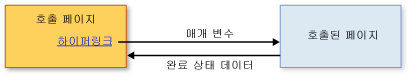

# 구조적 탐색 개요
[!INCLUDE[TLA#tla_xbap](../../../../includes/tlasharptla-xbap-md.md)], <xref:System.Windows.Controls.Frame> 또는 <xref:System.Windows.Navigation.NavigationWindow>에서 호스팅될 수 있는 콘텐츠는 Pack [!INCLUDE[TLA#tla_uri#plural](../../../../includes/tlasharptla-urisharpplural-md.md)]로 식별되고 하이퍼링크를 통해 탐색 가능한 페이지로 구성됩니다.  페이지의 구조 및 하이퍼링크로 정의되는 페이지 탐색 방법을 탐색 토폴로지라고 합니다.  이러한 토폴로지는 다양한 종류의 응용 프로그램, 특히 문서를 탐색하는 응용 프로그램에 적합합니다.  이러한 응용 프로그램에서 사용자는 각 페이지에 대한 아무런 정보 없이 특정 페이지에서 다른 페이지를 탐색할 수 있습니다.  
  
 그러나 페이지에 탐색 시점 정보가 필요한 다른 종류의 응용 프로그램도 있습니다.  예를 들어 인사 관리 응용 프로그램에 회사의 모든 직원이 나열된 "직원 목록" 페이지가 있다고 가정해 보겠습니다.  이 페이지에서는 하이퍼링크를 클릭하여 새 직원을 추가할 수도 있습니다.  하이퍼링크를 클릭하면 "직원 추가" 페이지로 이동하여 새 직원에 대한 정보를 수집한 후 "직원 목록" 페이지로 돌아가 새 직원을 만들고 목록을 업데이트할 수 있습니다.  이러한 스타일의 탐색은 메서드를 호출하여 처리 작업을 수행한 후 값을 반환하는 구조적 프로그래밍과 유사합니다.  이러한 이유로 이러한 스타일의 탐색을 *구조적 탐색*이라고 합니다.  
  
 <xref:System.Windows.Controls.Page> 클래스는 구조적 탐색을 지원하지 않습니다.  대신 <xref:System.Windows.Controls.Page>에서 <xref:System.Windows.Navigation.PageFunction%601> 클래스가 파생되어 구조적 탐색에 필요한 기본 생성자를 제공합니다.  이 항목에서는 <xref:System.Windows.Navigation.PageFunction%601>을 사용하여 구조적 탐색을 설정하는 방법을 보여 줍니다.  
  
   
  
   
## 구조적 탐색  
 구조적 탐색에서 특정 페이지가 다른 페이지를 호출하는 경우 다음 동작의 일부 또는 전체가 수행되어야 합니다.  
  
-   호출 페이지가 호출 대상 페이지를 탐색하고, 호출 대상 페이지에 필요한 매개 변수를 선택적으로 전달합니다.  
  
-   호출 페이지를 사용하는 작업을 완료하면 호출 대상 페이지는 호출 페이지로 돌아가고 선택적으로 다음과 같은 작업을 수행합니다.  
  
    -   호출 페이지가 완료된 방법을 설명하는 상태 정보를 반환합니다\(예: 사용자가 OK 단추 또는 Cancel 단추를 눌렀는지 여부\).  
  
    -   사용자로부터 수집한 데이터를 반환합니다\(예: 새 직원 정보\).  
  
-   호출 페이지가 호출 대상 페이지로 돌아가면 호출 대상 페이지의 각 인스턴스를 구분하기 위해 호출 대상 페이지가 탐색 기록에서 제거됩니다.  
  
 다음 그림에서는 이러한 동작을 보여 줍니다.  
  
   
  
 <xref:System.Windows.Navigation.PageFunction%601>을 호출 대상 페이지로 사용하여 이러한 동작을 구현할 수 있습니다.  
  
   
## PageFunction을 통한 구조적 탐색  
 이 항목에서는 <xref:System.Windows.Navigation.PageFunction%601> 하나로 구성된 구조적 탐색의 기본 기술을 구현하는 방법을 보여 줍니다.  이 샘플에서 <xref:System.Windows.Controls.Page>는 <xref:System.Windows.Navigation.PageFunction%601>을 호출하여 사용자로부터 <xref:System.String> 값을 받은 후 해당 값을 반환합니다.  
  
### 호출 페이지 만들기  
 <xref:System.Windows.Navigation.PageFunction%601>을 호출하는 페이지는 <xref:System.Windows.Controls.Page> 또는 <xref:System.Windows.Navigation.PageFunction%601>일 수 있습니다.  이 예제에서 호출 페이지는 다음 코드에 나와 있는 것과 같이 <xref:System.Windows.Controls.Page>입니다.  
  
 [!code-xml[StructuredNavigationSample#CallingPageDefaultMARKUP1](../../../../samples/snippets/csharp/VS_Snippets_Wpf/StructuredNavigationSample/CSharp/CallingPage.xaml#callingpagedefaultmarkup1)]  
[!code-xml[StructuredNavigationSample#CallingPageDefaultMARKUP2](../../../../samples/snippets/csharp/VS_Snippets_Wpf/StructuredNavigationSample/CSharp/CallingPage.xaml#callingpagedefaultmarkup2)]  
  
 [!code-csharp[StructuredNavigationSample#CallingPageDefaultCODEBEHIND1](../../../../samples/snippets/csharp/VS_Snippets_Wpf/StructuredNavigationSample/CSharp/CallingPage.xaml.cs#callingpagedefaultcodebehind1)]
 [!code-vb[StructuredNavigationSample#CallingPageDefaultCODEBEHIND1](../../../../samples/snippets/visualbasic/VS_Snippets_Wpf/StructuredNavigationSample/VisualBasic/CallingPage.xaml.vb#callingpagedefaultcodebehind1)]  
[!code-csharp[StructuredNavigationSample#CallingPageDefaultCODEBEHIND2](../../../../samples/snippets/csharp/VS_Snippets_Wpf/StructuredNavigationSample/CSharp/CallingPage.xaml.cs#callingpagedefaultcodebehind2)]
[!code-vb[StructuredNavigationSample#CallingPageDefaultCODEBEHIND2](../../../../samples/snippets/visualbasic/VS_Snippets_Wpf/StructuredNavigationSample/VisualBasic/CallingPage.xaml.vb#callingpagedefaultcodebehind2)]  
[!code-csharp[StructuredNavigationSample#CallingPageDefaultCODEBEHIND3](../../../../samples/snippets/csharp/VS_Snippets_Wpf/StructuredNavigationSample/CSharp/CallingPage.xaml.cs#callingpagedefaultcodebehind3)]
[!code-vb[StructuredNavigationSample#CallingPageDefaultCODEBEHIND3](../../../../samples/snippets/visualbasic/VS_Snippets_Wpf/StructuredNavigationSample/VisualBasic/CallingPage.xaml.vb#callingpagedefaultcodebehind3)]  
  
### 호출할 페이지 함수 만들기  
 호출 페이지는 호출 대상 페이지를 사용하여 사용자로부터 데이터를 수집하여 반환할 수 있기 때문에 <xref:System.Windows.Navigation.PageFunction%601>은 제네릭 클래스로 구현되고, 이 클래스의 형식 인수는 호출 대상 페이지가 반환할 값의 형식을 지정합니다.  다음 코드에서는 <xref:System.Windows.Navigation.PageFunction%601>을 사용하여 구현되고 <xref:System.String>을 반환하는 호출 대상 페이지의 초기 구현을 보여 줍니다.  
  
 [!code-xml[StructuredNavigationSample#CalledPageFunctionMARKUP](../../../../samples/snippets/csharp/VS_Snippets_Wpf/StructuredNavigationSample/CSharp/CalledPageFunction.xaml#calledpagefunctionmarkup)]  
  
 [!code-csharp[StructuredNavigationSample#CalledPageFunctionCODEBEHIND1](../../../../samples/snippets/csharp/VS_Snippets_Wpf/StructuredNavigationSample/CSharp/CalledPageFunction.xaml.cs#calledpagefunctioncodebehind1)]
 [!code-vb[StructuredNavigationSample#CalledPageFunctionCODEBEHIND1](../../../../samples/snippets/visualbasic/VS_Snippets_Wpf/StructuredNavigationSample/VisualBasic/CalledPageFunction.xaml.vb#calledpagefunctioncodebehind1)]  
[!code-csharp[StructuredNavigationSample#CalledPageFunctionCODEBEHIND2](../../../../samples/snippets/csharp/VS_Snippets_Wpf/StructuredNavigationSample/CSharp/CalledPageFunction.xaml.cs#calledpagefunctioncodebehind2)]
[!code-vb[StructuredNavigationSample#CalledPageFunctionCODEBEHIND2](../../../../samples/snippets/visualbasic/VS_Snippets_Wpf/StructuredNavigationSample/VisualBasic/CalledPageFunction.xaml.vb#calledpagefunctioncodebehind2)]  
  
 <xref:System.Windows.Navigation.PageFunction%601> 선언은 형식 인수가 추가된다는 점을 제외하고는 <xref:System.Windows.Controls.Page> 선언과 유사합니다.  코드 예제에서 알 수 있듯이 형식 인수는 `x:TypeArguments` 특성을 사용하여 [!INCLUDE[TLA2#tla_xaml](../../../../includes/tla2sharptla-xaml-md.md)] 태그에도 지정되고, 표준 제네릭 형식 인수 구문을 사용하여 숨김 코드에도 지정됩니다.  
  
 [!INCLUDE[dnprdnshort](../../../../includes/dnprdnshort-md.md)] 클래스만 형식 인수로 사용할 수 있는 것은 아닙니다.  <xref:System.Windows.Navigation.PageFunction%601>을 호출하여 사용자 지정 형식으로 추상화된 도메인별 데이터를 수집할 수도 있습니다.  다음 코드에서는 사용자 지정 형식을 <xref:System.Windows.Navigation.PageFunction%601>의 형식 인수로 사용하는 방법을 보여 줍니다.  
  
 [!code-csharp[CustomTypePageFunctionSnippets#CustomTypeCODE1](../../../../samples/snippets/csharp/VS_Snippets_Wpf/CustomTypePageFunctionSnippets/CSharp/CustomType.cs#customtypecode1)]
 [!code-vb[CustomTypePageFunctionSnippets#CustomTypeCODE1](../../../../samples/snippets/visualbasic/VS_Snippets_Wpf/CustomTypePageFunctionSnippets/VisualBasic/CustomType.vb#customtypecode1)]  
[!code-csharp[CustomTypePageFunctionSnippets#CustomTypeCODE2](../../../../samples/snippets/csharp/VS_Snippets_Wpf/CustomTypePageFunctionSnippets/CSharp/CustomType.cs#customtypecode2)]
[!code-vb[CustomTypePageFunctionSnippets#CustomTypeCODE2](../../../../samples/snippets/visualbasic/VS_Snippets_Wpf/CustomTypePageFunctionSnippets/VisualBasic/CustomType.vb#customtypecode2)]  
  
 [!code-xml[CustomTypePageFunctionSnippets#CustomTypePageFunctionMARKUP1](../../../../samples/snippets/csharp/VS_Snippets_Wpf/CustomTypePageFunctionSnippets/CSharp/CustomTypePageFunction.xaml#customtypepagefunctionmarkup1)]  
[!code-xml[CustomTypePageFunctionSnippets#CustomTypePageFunctionMARKUP2](../../../../samples/snippets/csharp/VS_Snippets_Wpf/CustomTypePageFunctionSnippets/CSharp/CustomTypePageFunction.xaml#customtypepagefunctionmarkup2)]  
  
 [!code-csharp[CustomTypePageFunctionSnippets#CustomTypePageFunctionCODEBEHIND1](../../../../samples/snippets/csharp/VS_Snippets_Wpf/CustomTypePageFunctionSnippets/CSharp/CustomTypePageFunction.xaml.cs#customtypepagefunctioncodebehind1)]
 [!code-vb[CustomTypePageFunctionSnippets#CustomTypePageFunctionCODEBEHIND1](../../../../samples/snippets/visualbasic/VS_Snippets_Wpf/CustomTypePageFunctionSnippets/VisualBasic/CustomTypePageFunction.xaml.vb#customtypepagefunctioncodebehind1)]  
  
  
 <xref:System.Windows.Navigation.PageFunction%601>의 형식 인수는 호출 페이지와 호출 대상 페이지 사이의 통신 기반을 제공합니다. 자세한 내용은 다음 단원에서 설명합니다.  
  
 다음 단원에서 설명하겠지만 <xref:System.Windows.Navigation.PageFunction%601> 선언을 통해 식별되는 형식은 <xref:System.Windows.Navigation.PageFunction%601>에서 호출 페이지로 데이터를 반환하는 데 매우 중요한 역할을 합니다.  
  
### PageFunction 호출 및 매개 변수 전달  
 페이지를 호출하려면 호출 페이지는 호출 대상 페이지를 인스턴스화하고 <xref:System.Windows.Navigation.NavigationService.Navigate%2A> 메서드를 사용하여 해당 페이지를 탐색해야 합니다.  이렇게 하면 호출 페이지는 호출 대상 페이지에 초기 데이터\(예: 호출 대상 페이지에서 수집하는 데이터의 기본값\)를 전달할 수 있습니다.  
  
 다음 코드에서는 호출 페이지에서 전달된 매개 변수를 받으며 기본이 아닌 생성자를 사용하는 호출 대상 페이지를 보여 줍니다.  
  
 [!code-csharp[StructuredNavigationSample#AcceptsInitialDataCODEBEHIND1](../../../../samples/snippets/csharp/VS_Snippets_Wpf/StructuredNavigationSample/CSharp/CalledPageFunction.xaml.cs#acceptsinitialdatacodebehind1)]
 [!code-vb[StructuredNavigationSample#AcceptsInitialDataCODEBEHIND1](../../../../samples/snippets/visualbasic/VS_Snippets_Wpf/StructuredNavigationSample/VisualBasic/CalledPageFunction.xaml.vb#acceptsinitialdatacodebehind1)]  
[!code-csharp[StructuredNavigationSample#AcceptsInitialDataCODEBEHIND2](../../../../samples/snippets/csharp/VS_Snippets_Wpf/StructuredNavigationSample/CSharp/CalledPageFunction.xaml.cs#acceptsinitialdatacodebehind2)]
[!code-vb[StructuredNavigationSample#AcceptsInitialDataCODEBEHIND2](../../../../samples/snippets/visualbasic/VS_Snippets_Wpf/StructuredNavigationSample/VisualBasic/CalledPageFunction.xaml.vb#acceptsinitialdatacodebehind2)]  
[!code-csharp[StructuredNavigationSample#AcceptsInitialDataCODEBEHIND3](../../../../samples/snippets/csharp/VS_Snippets_Wpf/StructuredNavigationSample/CSharp/CalledPageFunction.xaml.cs#acceptsinitialdatacodebehind3)]
[!code-vb[StructuredNavigationSample#AcceptsInitialDataCODEBEHIND3](../../../../samples/snippets/visualbasic/VS_Snippets_Wpf/StructuredNavigationSample/VisualBasic/CalledPageFunction.xaml.vb#acceptsinitialdatacodebehind3)]  
[!code-csharp[StructuredNavigationSample#AcceptsInitialDataCODEBEHIND4](../../../../samples/snippets/csharp/VS_Snippets_Wpf/StructuredNavigationSample/CSharp/CalledPageFunction.xaml.cs#acceptsinitialdatacodebehind4)]
[!code-vb[StructuredNavigationSample#AcceptsInitialDataCODEBEHIND4](../../../../samples/snippets/visualbasic/VS_Snippets_Wpf/StructuredNavigationSample/VisualBasic/CalledPageFunction.xaml.vb#acceptsinitialdatacodebehind4)]  
  
 다음 코드에서는 호출 대상 페이지를 인스턴스화하고 초기 문자열 값을 이 페이지에 전달하기 위해 <xref:System.Windows.Documents.Hyperlink>의 <xref:System.Windows.Documents.Hyperlink.Click> 이벤트를 처리하는 호출 페이지를 보여 줍니다.  
  
 [!code-xml[StructuredNavigationSample#PassingDataMARKUP2](../../../../samples/snippets/csharp/VS_Snippets_Wpf/StructuredNavigationSample/CSharp/CallingPage.xaml#passingdatamarkup2)]  
[!code-csharp[StructuredNavigationSample#PassingDataCODEBEHIND1](../../../../samples/snippets/csharp/VS_Snippets_Wpf/StructuredNavigationSample/CSharp/CallingPage.xaml.cs#passingdatacodebehind1)]
[!code-vb[StructuredNavigationSample#PassingDataCODEBEHIND1](../../../../samples/snippets/visualbasic/VS_Snippets_Wpf/StructuredNavigationSample/VisualBasic/CallingPage.xaml.vb#passingdatacodebehind1)]  
[!code-csharp[StructuredNavigationSample#PassingDataCODEBEHIND2](../../../../samples/snippets/csharp/VS_Snippets_Wpf/StructuredNavigationSample/CSharp/CallingPage.xaml.cs#passingdatacodebehind2)]
[!code-vb[StructuredNavigationSample#PassingDataCODEBEHIND2](../../../../samples/snippets/visualbasic/VS_Snippets_Wpf/StructuredNavigationSample/VisualBasic/CallingPage.xaml.vb#passingdatacodebehind2)]  
[!code-csharp[StructuredNavigationSample#PassingDataCODEBEHIND3](../../../../samples/snippets/csharp/VS_Snippets_Wpf/StructuredNavigationSample/CSharp/CallingPage.xaml.cs#passingdatacodebehind3)]
[!code-vb[StructuredNavigationSample#PassingDataCODEBEHIND3](../../../../samples/snippets/visualbasic/VS_Snippets_Wpf/StructuredNavigationSample/VisualBasic/CallingPage.xaml.vb#passingdatacodebehind3)]  
  
 호출 대상 페이지에 매개 변수를 전달하는 대신  다음과 같이 할 수 있습니다.  
  
-   호출 페이지에서 다음을 수행합니다.  
  
    1.  기본 생성자를 사용하여 호출 대상 <xref:System.Windows.Navigation.PageFunction%601>을 인스턴스화합니다.  
  
    2.  매개 변수를 <xref:System.Windows.Application.Properties%2A>에 저장합니다.  
  
    3.  호출 대상 <xref:System.Windows.Navigation.PageFunction%601>을 탐색합니다.  
  
-   호출 대상 <xref:System.Windows.Navigation.PageFunction%601>에서 다음을 수행합니다.  
  
    -   <xref:System.Windows.Application.Properties%2A>에 저장된 매개 변수를 검색하고 사용합니다.  
  
 잠시 후에 설명하겠지만 호출 대상 페이지에서 반환하는 데이터를 수집하려면 여전히 코드를 사용하여 호출 대상 페이지를 인스턴스화하고 탐색해야 합니다.  이러한 이유 때문에 <xref:System.Windows.Navigation.PageFunction%601>을 유지해야 합니다. 그렇지 않으면 다음에 <xref:System.Windows.Navigation.PageFunction%601>을 탐색할 때 [!INCLUDE[TLA2#tla_wpf](../../../../includes/tla2sharptla-wpf-md.md)]에서 기본 생성자를 사용하여 <xref:System.Windows.Navigation.PageFunction%601>을 인스턴스화합니다.  
  
 그러나 호출 대상 페이지가 돌아가려면 호출 페이지에서 검색할 수 있는 데이터를 반환해야 합니다.  
  
### 호출 페이지로 작업 결과 및 작업 데이터 반환  
 사용자가 호출 대상 페이지 사용을 마치면 호출 대상 페이지가 돌아가야 합니다. 이 예제에서는 OK 또는 Cancel 단추를 눌러 호출 대상 페이지 사용을 마쳤는지 알릴 수 있습니다.  호출 페이지는 호출 대상 페이지를 사용하여 사용자로부터 데이터를 수집했기 때문에 호출 페이지에는 두 가지 종류의 정보가 필요합니다.  
  
1.  호출 대상 페이지를 취소했는지 여부. 이 예제에서는 OK 단추 또는 Cancel 단추를 눌러 호출 대상 페이지에서 수행한 작업을 취소하거나 승인할 수 있습니다.  이 정보를 통해 호출 페이지는 사용자로부터 수집한 데이터를 처리해야 할지 여부를 결정할 수 있습니다.  
  
2.  사용자가 제공한 데이터  
  
 <xref:System.Windows.Navigation.PageFunction%601>은 <xref:System.Windows.Navigation.PageFunction%601.OnReturn%2A> 메서드를 구현하여 정보를 반환합니다.  다음 코드에서는 이 메서드를 호출하는 방법을 보여 줍니다.  
  
 [!code-csharp[StructuredNavigationSample#ReturnCODEBEHIND1](../../../../samples/snippets/csharp/VS_Snippets_Wpf/StructuredNavigationSample/CSharp/CalledPageFunction.xaml.cs#returncodebehind1)]
 [!code-vb[StructuredNavigationSample#ReturnCODEBEHIND1](../../../../samples/snippets/visualbasic/VS_Snippets_Wpf/StructuredNavigationSample/VisualBasic/CalledPageFunction.xaml.vb#returncodebehind1)]  
[!code-csharp[StructuredNavigationSample#ReturnCODEBEHIND2](../../../../samples/snippets/csharp/VS_Snippets_Wpf/StructuredNavigationSample/CSharp/CalledPageFunction.xaml.cs#returncodebehind2)]
[!code-vb[StructuredNavigationSample#ReturnCODEBEHIND2](../../../../samples/snippets/visualbasic/VS_Snippets_Wpf/StructuredNavigationSample/VisualBasic/CalledPageFunction.xaml.vb#returncodebehind2)]  
  
 이 예제의 경우 사용자가 Cancel 단추를 누르면 호출 페이지에 `null` 값이 반환되고,  OK 단추를 누르면 사용자가 입력한 문자열 값이 반환됩니다.  <xref:System.Windows.Navigation.PageFunction%601.OnReturn%2A>은 데이터를 호출 페이지에 반환하기 위해 호출하는 `protected` `virtual` 메서드입니다.  데이터는 <xref:System.Windows.Navigation.ReturnEventArgs%601.Result%2A>의 반환 값 형식을 지정하는 형식 인수가 포함된 제네릭 <xref:System.Windows.Navigation.ReturnEventArgs%601> 형식의 인스턴스에 패키지되어야 합니다.  이렇게 할 경우 특정 형식 인수를 사용하여 <xref:System.Windows.Navigation.PageFunction%601>을 선언하면 <xref:System.Windows.Navigation.PageFunction%601>에서 해당 형식 인수로 지정된 형식의 인스턴스를 반환합니다.  이 예제에서는 형식 인수 및 반환 값의 형식이 <xref:System.String>입니다.  
  
 <xref:System.Windows.Navigation.PageFunction%601.OnReturn%2A>을 호출하면 호출 페이지가 <xref:System.Windows.Navigation.PageFunction%601>의 반환 값을 어떤 방법으로든 검색해야 합니다.  이러한 이유로 <xref:System.Windows.Navigation.PageFunction%601>은 호출 페이지에서 처리할 <xref:System.Windows.Navigation.PageFunction%601.Return> 이벤트를 구현합니다.  <xref:System.Windows.Navigation.PageFunction%601.OnReturn%2A>을 호출하면 <xref:System.Windows.Navigation.PageFunction%601.Return>이 발생하여 호출 페이지가 알림을 받도록 <xref:System.Windows.Navigation.PageFunction%601.Return>에 등록할 수 있습니다.  
  
 [!code-csharp[StructuredNavigationSample#ProcessResultCODEBEHIND1](../../../../samples/snippets/csharp/VS_Snippets_Wpf/StructuredNavigationSample/CSharp/CallingPage.xaml.cs#processresultcodebehind1)]
 [!code-vb[StructuredNavigationSample#ProcessResultCODEBEHIND1](../../../../samples/snippets/visualbasic/VS_Snippets_Wpf/StructuredNavigationSample/VisualBasic/CallingPage.xaml.vb#processresultcodebehind1)]  
[!code-csharp[StructuredNavigationSample#ProcessResultCODEBEHIND2](../../../../samples/snippets/csharp/VS_Snippets_Wpf/StructuredNavigationSample/CSharp/CallingPage.xaml.cs#processresultcodebehind2)]
[!code-vb[StructuredNavigationSample#ProcessResultCODEBEHIND2](../../../../samples/snippets/visualbasic/VS_Snippets_Wpf/StructuredNavigationSample/VisualBasic/CallingPage.xaml.vb#processresultcodebehind2)]  
  
### 작업 완료 시 작업 페이지 제거  
 호출 대상 페이지가 돌아가는 경우 사용자가 호출 대상 페이지를 취소하지 않았으면 호출 페이지가 사용자가 제공하고 호출 대상 페이지에서 반환한 데이터를 처리합니다.  일반적으로 이러한 방식의 데이터 수집은 격리된 작업입니다. 따라서 호출 대상 페이지가 돌아가면 호출 페이지에서는 더 많은 데이터를 캡처하기 위해 새 호출 페이지를 만들고 탐색해야 합니다.  
  
 그러나 호출 대상 페이지를 [저널](GTMT)에서 제거하지 않으면 사용자가 호출 페이지의 이전 인스턴스를 다시 탐색할 수 있습니다.  <xref:System.Windows.Navigation.PageFunction%601>을 [저널](GTMT)에 유지할지 여부는 <xref:System.Windows.Navigation.PageFunctionBase.RemoveFromJournal%2A> 속성을 통해 결정됩니다.  <xref:System.Windows.Navigation.PageFunctionBase.RemoveFromJournal%2A>은 기본적으로 `true`로 설정되기 때문에 페이지 함수는 <xref:System.Windows.Navigation.PageFunction%601.OnReturn%2A>이 호출되면 자동으로 제거됩니다.  <xref:System.Windows.Navigation.PageFunction%601.OnReturn%2A>이 호출된 이후에도 탐색 기록에 페이지 함수를 유지하려면 <xref:System.Windows.Navigation.PageFunctionBase.RemoveFromJournal%2A>을 `false`로 설정해야 합니다.  
  
   
## 다른 종류의 구조적 탐색  
 이 항목에서는 호출\/반환 구조적 탐색을 지원하는 가장 기본적인 <xref:System.Windows.Navigation.PageFunction%601> 사용 방법에 대해 설명합니다.  이를 기초로 하여 복잡한 형식의 구조적 탐색을 만들 수 있습니다.  
  
 예를 들어 호출 페이지에서 사용자로부터 충분한 데이터를 수집하거나 작업을 수행하기 위해 여러 페이지를 사용해야 하는 경우도 있습니다.  이와 같이 여러 페이지를 사용하는 경우를 "마법사"라고 합니다.  
  
 응용 프로그램의 탐색 토폴로지가 복잡하여 구조적 탐색을 사용해야만 응용 프로그램이 효과적으로 작동하는 경우도 있습니다.  자세한 내용은 [탐색 토폴로지 개요](../../../../docs/framework/wpf/app-development/navigation-topologies-overview.md)를 참조하십시오.  
  
## 참고 항목  
 <xref:System.Windows.Navigation.PageFunction%601>   
 <xref:System.Windows.Navigation.NavigationService>   
 [탐색 토폴로지 개요](../../../../docs/framework/wpf/app-development/navigation-topologies-overview.md)