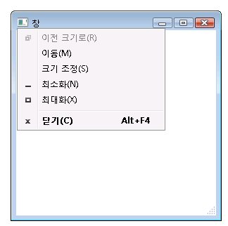
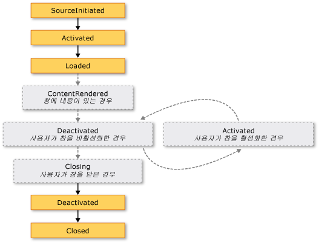
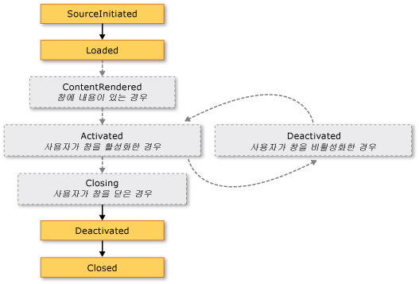

# <a name="wpf-windows-overview"></a><span data-ttu-id="9a88e-102">WPF 창 개요</span><span class="sxs-lookup"><span data-stu-id="9a88e-102">WPF Windows Overview</span></span>
<span data-ttu-id="9a88e-103">사용자는 창을 통해 [!INCLUDE[TLA#tla_wpf](../../../../includes/tlasharptla-wpf-md.md)] 독립 실행형 응용 프로그램과 상호 작용합니다.</span><span class="sxs-lookup"><span data-stu-id="9a88e-103">Users interact with [!INCLUDE[TLA#tla_wpf](../../../../includes/tlasharptla-wpf-md.md)] standalone applications through windows.</span></span> <span data-ttu-id="9a88e-104">창의 기본 용도는 데이터를 시각화하는 콘텐츠를 호스트하고 사용자가 데이터와 상호 작용할 수 있도록 하는 것입니다.</span><span class="sxs-lookup"><span data-stu-id="9a88e-104">The primary purpose of a window is to host content that visualizes data and enables users to interact with data.</span></span> <span data-ttu-id="9a88e-105">독립 실행형 [!INCLUDE[TLA2#tla_wpf](../../../../includes/tla2sharptla-wpf-md.md)] 응용 프로그램은 고유 창을 사용 하 여 제공 된 <xref:System.Windows.Window> 클래스입니다.</span><span class="sxs-lookup"><span data-stu-id="9a88e-105">Standalone [!INCLUDE[TLA2#tla_wpf](../../../../includes/tla2sharptla-wpf-md.md)] applications provide their own windows by using the <xref:System.Windows.Window> class.</span></span> <span data-ttu-id="9a88e-106">이 항목에서는 소개 <xref:System.Windows.Window> 독립 실행형 응용 프로그램에는 창을 만들고 관리의 기본 개념을 다루기 전에 합니다.</span><span class="sxs-lookup"><span data-stu-id="9a88e-106">This topic introduces <xref:System.Windows.Window> before covering the fundamentals of creating and managing windows in standalone applications.</span></span>  
  
> [!NOTE]
>  <span data-ttu-id="9a88e-107">브라우저에서 호스팅되 [!INCLUDE[TLA2#tla_wpf](../../../../includes/tla2sharptla-wpf-md.md)] 응용 프로그램을 만들 [!INCLUDE[TLA#tla_xbap#plural](../../../../includes/tlasharptla-xbapsharpplural-md.md)] 및 느슨한 [!INCLUDE[TLA#tla_xaml](../../../../includes/tlasharptla-xaml-md.md)] 페이지가 고유 창을 제공 하지 않습니다.</span><span class="sxs-lookup"><span data-stu-id="9a88e-107">Browser-hosted [!INCLUDE[TLA2#tla_wpf](../../../../includes/tla2sharptla-wpf-md.md)] applications, including [!INCLUDE[TLA#tla_xbap#plural](../../../../includes/tlasharptla-xbapsharpplural-md.md)] and loose [!INCLUDE[TLA#tla_xaml](../../../../includes/tlasharptla-xaml-md.md)] pages, don't provide their own windows.</span></span> <span data-ttu-id="9a88e-108">제공 하는 창에서 호스트 되는 대신, [!INCLUDE[TLA#tla_iegeneric](../../../../includes/tlasharptla-iegeneric-md.md)]합니다.</span><span class="sxs-lookup"><span data-stu-id="9a88e-108">Instead, they are hosted in windows provided by [!INCLUDE[TLA#tla_iegeneric](../../../../includes/tlasharptla-iegeneric-md.md)].</span></span> <span data-ttu-id="9a88e-109">참조 [WPF XAML 브라우저 응용 프로그램 개요](../../../../docs/framework/wpf/app-development/wpf-xaml-browser-applications-overview.md)합니다.</span><span class="sxs-lookup"><span data-stu-id="9a88e-109">See [WPF XAML Browser Applications Overview](../../../../docs/framework/wpf/app-development/wpf-xaml-browser-applications-overview.md).</span></span>  
  
  
<a name="TheWindowClass"></a>   
## <a name="the-window-class"></a><span data-ttu-id="9a88e-110">Window 클래스</span><span class="sxs-lookup"><span data-stu-id="9a88e-110">The Window Class</span></span>  
 <span data-ttu-id="9a88e-111">다음 그림에서는 창을 구성하는 부분을 보여 줍니다.</span><span class="sxs-lookup"><span data-stu-id="9a88e-111">The following figure illustrates the constituent parts of a window.</span></span>  
  
 <span data-ttu-id="9a88e-112"></span><span class="sxs-lookup"><span data-stu-id="9a88e-112"></span></span>  
  
 <span data-ttu-id="9a88e-113">창은 비클라이언트 영역과 클라이언트 영역의 두 영역으로 나뉩니다.</span><span class="sxs-lookup"><span data-stu-id="9a88e-113">A window is divided into two areas: the non-client area and client area.</span></span>  
  
 <span data-ttu-id="9a88e-114">*비클라이언트 영역* 창에 의해 구현 됩니다 [!INCLUDE[TLA2#tla_wpf](../../../../includes/tla2sharptla-wpf-md.md)] 다음을 포함 한 대부분의 창을에 공통 된 창의 각 부분을 포함 합니다.</span><span class="sxs-lookup"><span data-stu-id="9a88e-114">The *non-client area* of a window is implemented by [!INCLUDE[TLA2#tla_wpf](../../../../includes/tla2sharptla-wpf-md.md)] and includes the parts of a window that are common to most windows, including the following:</span></span>  
  
-   <span data-ttu-id="9a88e-115">테두리.</span><span class="sxs-lookup"><span data-stu-id="9a88e-115">A border.</span></span>  
  
-   <span data-ttu-id="9a88e-116">제목 표시줄.</span><span class="sxs-lookup"><span data-stu-id="9a88e-116">A title bar.</span></span>  
  
-   <span data-ttu-id="9a88e-117">아이콘.</span><span class="sxs-lookup"><span data-stu-id="9a88e-117">An icon.</span></span>  
  
-   <span data-ttu-id="9a88e-118">최소화, 최대화 및 복원 단추.</span><span class="sxs-lookup"><span data-stu-id="9a88e-118">Minimize, Maximize, and Restore buttons.</span></span>  
  
-   <span data-ttu-id="9a88e-119">닫기 단추.</span><span class="sxs-lookup"><span data-stu-id="9a88e-119">A Close button.</span></span>  
  
-   <span data-ttu-id="9a88e-120">사용자가 창을 최소화, 최대화, 복원, 이동, 크기 조정 및 닫을 수 있는 메뉴 항목이 들어 있는 시스템 메뉴.</span><span class="sxs-lookup"><span data-stu-id="9a88e-120">A System menu with menu items that allow users to minimize, maximize, restore, move, resize, and close a window.</span></span>  
  
 <span data-ttu-id="9a88e-121">*클라이언트 영역* 창의 창의 비클라이언트 영역 내에서 영역 및 개발자가 컨트롤, 메뉴 모음 및 도구 모음 등의 응용 프로그램 관련 콘텐츠를 추가 하는 데 사용 됩니다.</span><span class="sxs-lookup"><span data-stu-id="9a88e-121">The *client area* of a window is the area within a window's non-client area and is used by developers to add application-specific content, such as menu bars, tool bars, and controls.</span></span>  
  
 <span data-ttu-id="9a88e-122">[!INCLUDE[TLA2#tla_wpf](../../../../includes/tla2sharptla-wpf-md.md)], 창에 의해 캡슐화 됩니다는 <xref:System.Windows.Window> 에서 다음을 수행 하는 데 사용 하는 클래스:</span><span class="sxs-lookup"><span data-stu-id="9a88e-122">In [!INCLUDE[TLA2#tla_wpf](../../../../includes/tla2sharptla-wpf-md.md)], a window is encapsulated by the <xref:System.Windows.Window> class that you use to do the following:</span></span>  
  
-   <span data-ttu-id="9a88e-123">창을 표시합니다.</span><span class="sxs-lookup"><span data-stu-id="9a88e-123">Display a window.</span></span>  
  
-   <span data-ttu-id="9a88e-124">창의 크기, 위치 및 모양을 구성합니다.</span><span class="sxs-lookup"><span data-stu-id="9a88e-124">Configure the size, position, and appearance of a window.</span></span>  
  
-   <span data-ttu-id="9a88e-125">응용 프로그램별 콘텐츠를 호스팅합니다.</span><span class="sxs-lookup"><span data-stu-id="9a88e-125">Host application-specific content.</span></span>  
  
-   <span data-ttu-id="9a88e-126">창의 수명을 관리합니다.</span><span class="sxs-lookup"><span data-stu-id="9a88e-126">Manage the lifetime of a window.</span></span>  
  
<a name="DefiningAWindow"></a>   
## <a name="implementing-a-window"></a><span data-ttu-id="9a88e-127">창 구현</span><span class="sxs-lookup"><span data-stu-id="9a88e-127">Implementing a Window</span></span>  
 <span data-ttu-id="9a88e-128">일반적인 창 구현의 모양과 동작을 구성 됩니다. 여기서 *모양* 사용자에 게 창이 표시 되는 모양을 정의 하 고 *동작* 창 함수 사용자가 조작 하는 방법을 정의 함께 합니다.</span><span class="sxs-lookup"><span data-stu-id="9a88e-128">The implementation of a typical window comprises both appearance and behavior, where *appearance* defines how a window looks to users and *behavior* defines the way a window functions as users interact with it.</span></span> <span data-ttu-id="9a88e-129">[!INCLUDE[TLA2#tla_wpf](../../../../includes/tla2sharptla-wpf-md.md)], 모양을 구현할 수 있습니다 및 동작을 사용 하 여 창을 코딩 하거나 또는 [!INCLUDE[TLA2#tla_xaml](../../../../includes/tla2sharptla-xaml-md.md)] 태그입니다.</span><span class="sxs-lookup"><span data-stu-id="9a88e-129">In [!INCLUDE[TLA2#tla_wpf](../../../../includes/tla2sharptla-wpf-md.md)], you can implement the appearance and behavior of a window using either code or [!INCLUDE[TLA2#tla_xaml](../../../../includes/tla2sharptla-xaml-md.md)] markup.</span></span>  
  
 <span data-ttu-id="9a88e-130">그러나 일반적으로 창의 모양을 사용 하 여 구현 [!INCLUDE[TLA2#tla_xaml](../../../../includes/tla2sharptla-xaml-md.md)] 태그 및 해당 동작은 구현 됩니다 코드 숨김을 사용 하 여 다음 예제와 같이 합니다.</span><span class="sxs-lookup"><span data-stu-id="9a88e-130">In general, however, the appearance of a window is implemented using [!INCLUDE[TLA2#tla_xaml](../../../../includes/tla2sharptla-xaml-md.md)] markup, and its behavior is implemented using code-behind, as shown in the following example.</span></span>  
  
 [!code-xaml[WindowsOverviewSnippets#MarkupAndCodeBehindWindowMARKUP](../../../../samples/snippets/csharp/VS_Snippets_Wpf/WindowsOverviewSnippets/CSharp/MarkupAndCodeBehindWindow.xaml#markupandcodebehindwindowmarkup)]  
  
 [!code-csharp[WindowsOverviewSnippets#MarkupAndCodeBehindWindowCODEBEHIND](../../../../samples/snippets/csharp/VS_Snippets_Wpf/WindowsOverviewSnippets/CSharp/MarkupAndCodeBehindWindow.xaml.cs#markupandcodebehindwindowcodebehind)]
 [!code-vb[WindowsOverviewSnippets#MarkupAndCodeBehindWindowCODEBEHIND](../../../../samples/snippets/visualbasic/VS_Snippets_Wpf/WindowsOverviewSnippets/VisualBasic/MarkupAndCodeBehindWindow.xaml.vb#markupandcodebehindwindowcodebehind)]  
  
 <span data-ttu-id="9a88e-131">사용 하도록 설정 하려면 한 [!INCLUDE[TLA2#tla_xaml](../../../../includes/tla2sharptla-xaml-md.md)] 마크업 파일 및 코드 숨김 파일을 함께 사용 하려면 다음이 필요 합니다.</span><span class="sxs-lookup"><span data-stu-id="9a88e-131">To enable a [!INCLUDE[TLA2#tla_xaml](../../../../includes/tla2sharptla-xaml-md.md)] markup file and code-behind file to work together, the following are required:</span></span>  
  
-   <span data-ttu-id="9a88e-132">태그에서는 `Window` 요소 포함 되어야 합니다는 `x:Class` 특성입니다.</span><span class="sxs-lookup"><span data-stu-id="9a88e-132">In markup, the `Window` element must include the `x:Class` attribute.</span></span> <span data-ttu-id="9a88e-133">응용 프로그램을 빌드할 때 `x:Class` 파일 사용 하면 태그에서 [!INCLUDE[TLA#tla_msbuild](../../../../includes/tlasharptla-msbuild-md.md)] 만들려는 `partial` 에서 파생 된 클래스 <xref:System.Windows.Window> 변수로 지정 된 이름을 가진는 `x:Class` 특성입니다.</span><span class="sxs-lookup"><span data-stu-id="9a88e-133">When the application is built, the existence of `x:Class` in the markup file causes [!INCLUDE[TLA#tla_msbuild](../../../../includes/tlasharptla-msbuild-md.md)] to create a `partial` class that derives from <xref:System.Windows.Window> and has the name that is specified by the `x:Class` attribute.</span></span> <span data-ttu-id="9a88e-134">이 위해서는 추가 [!INCLUDE[TLA2#tla_xml](../../../../includes/tla2sharptla-xml-md.md)] 에 대 한 네임 스페이스 선언을 [!INCLUDE[TLA2#tla_xaml](../../../../includes/tla2sharptla-xaml-md.md)] 스키마 ( `xmlns:x="http://schemas.microsoft.com/winfx/2006/xaml"` ).</span><span class="sxs-lookup"><span data-stu-id="9a88e-134">This requires the addition of an [!INCLUDE[TLA2#tla_xml](../../../../includes/tla2sharptla-xml-md.md)] namespace declaration for the [!INCLUDE[TLA2#tla_xaml](../../../../includes/tla2sharptla-xaml-md.md)] schema ( `xmlns:x="http://schemas.microsoft.com/winfx/2006/xaml"` ).</span></span> <span data-ttu-id="9a88e-135">생성 된 `partial` 클래스가 구현 하는 `InitializeComponent` 메서드를 이벤트를 등록 하 고 태그에서 구현 되는 속성을 설정 하기 위해 호출 됩니다.</span><span class="sxs-lookup"><span data-stu-id="9a88e-135">The generated `partial` class implements the `InitializeComponent` method, which is called to register the events and set the properties that are implemented in markup.</span></span>  
  
-   <span data-ttu-id="9a88e-136">코드 숨김 클래스 여야 합니다는 `partial` 변수로 지정 된 동일한 이름의 클래스는 `x:Class` 태그에서 특성에서 파생 되어야 <xref:System.Windows.Window>합니다.</span><span class="sxs-lookup"><span data-stu-id="9a88e-136">In code-behind, the class must be a `partial` class with the same name that is specified by the `x:Class` attribute in markup, and it must derive from <xref:System.Windows.Window>.</span></span> <span data-ttu-id="9a88e-137">이렇게 하면 연결 된 코드 숨김 파일이 `partial` 응용 프로그램이 빌드될 때 마크업 파일에 대해 생성 되는 클래스 (참조 [WPF 응용 프로그램 빌드](../../../../docs/framework/wpf/app-development/building-a-wpf-application-wpf.md)).</span><span class="sxs-lookup"><span data-stu-id="9a88e-137">This allows the code-behind file to be associated with the `partial` class that is generated for the markup file when the application is built (see [Building a WPF Application](../../../../docs/framework/wpf/app-development/building-a-wpf-application-wpf.md)).</span></span>  
  
-   <span data-ttu-id="9a88e-138">코드 숨김에서 <xref:System.Windows.Window> 클래스가 호출 하는 생성자를 구현 해야 합니다는 `InitializeComponent` 메서드.</span><span class="sxs-lookup"><span data-stu-id="9a88e-138">In code-behind, the <xref:System.Windows.Window> class must implement a constructor that calls the `InitializeComponent` method.</span></span> <span data-ttu-id="9a88e-139">`InitializeComponent` 구현 파일에서 생성 된 태그에서 `partial` 클래스를 이벤트 등록 및 태그에 정의 된 속성을 설정 합니다.</span><span class="sxs-lookup"><span data-stu-id="9a88e-139">`InitializeComponent` is implemented by the markup file's generated `partial` class to register events and set properties that are defined in markup.</span></span>  
  
> [!NOTE]
>  <span data-ttu-id="9a88e-140">추가 하는 경우 새 <xref:System.Windows.Window> 를 사용 하 여 프로젝트에 [!INCLUDE[TLA#tla_visualstu](../../../../includes/tlasharptla-visualstu-md.md)], <xref:System.Windows.Window> 태그와 코드 숨김을 사용 하 여 구현 되 고으로 태그와 코드 숨김 파일 간의 연결을 만드는 데 필요한 구성을 포함 여기에서 설명 합니다.</span><span class="sxs-lookup"><span data-stu-id="9a88e-140">When you add a new <xref:System.Windows.Window> to your project by using [!INCLUDE[TLA#tla_visualstu](../../../../includes/tlasharptla-visualstu-md.md)], the <xref:System.Windows.Window> is implemented using both markup and code-behind, and includes the necessary configuration to create the association between the markup and code-behind files as described here.</span></span>  
  
 <span data-ttu-id="9a88e-141">이 구성을 사용 모양을 정의 하 고 창에 집중할 수 있습니다 [!INCLUDE[TLA2#tla_xaml](../../../../includes/tla2sharptla-xaml-md.md)] 태그와 코드 숨김의 동작을 구현 합니다.</span><span class="sxs-lookup"><span data-stu-id="9a88e-141">With this configuration in place, you can focus on defining the appearance of the window in [!INCLUDE[TLA2#tla_xaml](../../../../includes/tla2sharptla-xaml-md.md)] markup and implementing its behavior in code-behind.</span></span> <span data-ttu-id="9a88e-142">다음 예제에서 구현 되는 단추가 있는 창 [!INCLUDE[TLA2#tla_xaml](../../../../includes/tla2sharptla-xaml-md.md)] 태그 및 단추에 대 한 이벤트 처리기 <xref:System.Windows.Controls.Primitives.ButtonBase.Click> 코드 숨김에서 구현 된 이벤트입니다.</span><span class="sxs-lookup"><span data-stu-id="9a88e-142">The following example shows a window with a button, implemented in [!INCLUDE[TLA2#tla_xaml](../../../../includes/tla2sharptla-xaml-md.md)] markup, and an event handler for the button's <xref:System.Windows.Controls.Primitives.ButtonBase.Click> event, implemented in code-behind.</span></span>  
  
 [!code-xaml[WindowsOverviewWindowWithButtonSnippets#MarkupAndCodeBehindWindowMARKUP](../../../../samples/snippets/csharp/VS_Snippets_Wpf/WindowsOverviewWindowWithButtonSnippets/CSharp/MarkupAndCodeBehindWindow.xaml#markupandcodebehindwindowmarkup)]  
  
 [!code-csharp[WindowsOverviewWindowWithButtonSnippets#MarkupAndCodeBehindWindowCODEBEHIND](../../../../samples/snippets/csharp/VS_Snippets_Wpf/WindowsOverviewWindowWithButtonSnippets/CSharp/MarkupAndCodeBehindWindow.xaml.cs#markupandcodebehindwindowcodebehind)]
 [!code-vb[WindowsOverviewWindowWithButtonSnippets#MarkupAndCodeBehindWindowCODEBEHIND](../../../../samples/snippets/visualbasic/VS_Snippets_Wpf/WindowsOverviewWindowWithButtonSnippets/VisualBasic/MarkupAndCodeBehindWindow.xaml.vb#markupandcodebehindwindowcodebehind)]  
  
<a name="ConfiguringWindowForMSBuild"></a>   
## <a name="configuring-a-window-definition-for-msbuild"></a><span data-ttu-id="9a88e-143">MSBuild에 대해 창 정의 구성</span><span class="sxs-lookup"><span data-stu-id="9a88e-143">Configuring a Window Definition for MSBuild</span></span>  
 <span data-ttu-id="9a88e-144">사용자가 창을 구현 하는 방법은 구성에 대 한 결정 [!INCLUDE[TLA2#tla_msbuild](../../../../includes/tla2sharptla-msbuild-md.md)]합니다.</span><span class="sxs-lookup"><span data-stu-id="9a88e-144">How you implement your window determines how it is configured for [!INCLUDE[TLA2#tla_msbuild](../../../../includes/tla2sharptla-msbuild-md.md)].</span></span> <span data-ttu-id="9a88e-145">모두 사용 하 여 정의 된 창에 대 한 [!INCLUDE[TLA2#tla_xaml](../../../../includes/tla2sharptla-xaml-md.md)] 태그 및 코드 숨김:</span><span class="sxs-lookup"><span data-stu-id="9a88e-145">For a window that is defined using both [!INCLUDE[TLA2#tla_xaml](../../../../includes/tla2sharptla-xaml-md.md)] markup and code-behind:</span></span>  
  
-   [!INCLUDE[TLA2#tla_xaml](../../../../includes/tla2sharptla-xaml-md.md)]<span data-ttu-id="9a88e-146"> 태그 파일으로 구성 된 [!INCLUDE[TLA2#tla_msbuild](../../../../includes/tla2sharptla-msbuild-md.md)] `Page` 항목입니다.</span><span class="sxs-lookup"><span data-stu-id="9a88e-146"> markup files are configured as [!INCLUDE[TLA2#tla_msbuild](../../../../includes/tla2sharptla-msbuild-md.md)]`Page` items.</span></span>  
  
-   <span data-ttu-id="9a88e-147">코드 숨김 파일으로 구성 된 [!INCLUDE[TLA2#tla_msbuild](../../../../includes/tla2sharptla-msbuild-md.md)] `Compile` 항목입니다.</span><span class="sxs-lookup"><span data-stu-id="9a88e-147">Code-behind files are configured as [!INCLUDE[TLA2#tla_msbuild](../../../../includes/tla2sharptla-msbuild-md.md)]`Compile` items.</span></span>  
  
 <span data-ttu-id="9a88e-148">다음에는 나타내지 [!INCLUDE[TLA2#tla_msbuild](../../../../includes/tla2sharptla-msbuild-md.md)] 프로젝트 파일입니다.</span><span class="sxs-lookup"><span data-stu-id="9a88e-148">This is shown in the following [!INCLUDE[TLA2#tla_msbuild](../../../../includes/tla2sharptla-msbuild-md.md)] project file.</span></span>  
  
```xml  
<Project ...  
                xmlns="http://schemas.microsoft.com/developer/msbuild/2003">  
    ...  
    <Page Include="MarkupAndCodeBehindWindow.xaml" />  
    <Compile Include=" MarkupAndCodeBehindWindow.xaml.cs" />  
    ...  
</Project>  
```  
  
 <span data-ttu-id="9a88e-149">빌드에 대 한 내용은 [!INCLUDE[TLA2#tla_wpf](../../../../includes/tla2sharptla-wpf-md.md)] 응용 프로그램 참조 [WPF 응용 프로그램 빌드](../../../../docs/framework/wpf/app-development/building-a-wpf-application-wpf.md)합니다.</span><span class="sxs-lookup"><span data-stu-id="9a88e-149">For information about building [!INCLUDE[TLA2#tla_wpf](../../../../includes/tla2sharptla-wpf-md.md)] applications, see [Building a WPF Application](../../../../docs/framework/wpf/app-development/building-a-wpf-application-wpf.md).</span></span>  
  
<a name="WindowLifetime"></a>   
## <a name="window-lifetime"></a><span data-ttu-id="9a88e-150">창 수명</span><span class="sxs-lookup"><span data-stu-id="9a88e-150">Window Lifetime</span></span>  
 <span data-ttu-id="9a88e-151">다른 클래스와 마찬가지로 창에는 창이 열린 후 처음 인스턴스화될 때 시작하여, 열린 후 활성화 및 비활성화되고 최종적으로 닫힐 때까지의 기간인 수명이 있습니다.</span><span class="sxs-lookup"><span data-stu-id="9a88e-151">As with any class, a window has a lifetime that begins when it is first instantiated, after which it is opened, activated and deactivated, and eventually closed.</span></span>  
  
  
<a name="Opening_a_Window"></a>   
### <a name="opening-a-window"></a><span data-ttu-id="9a88e-152">창 열기</span><span class="sxs-lookup"><span data-stu-id="9a88e-152">Opening a Window</span></span>  
 <span data-ttu-id="9a88e-153">창을 열려면 먼저 다음 예제에서 설명하는 것처럼 창의 인스턴스를 만듭니다.</span><span class="sxs-lookup"><span data-stu-id="9a88e-153">To open a window, you first create an instance of it, which is demonstrated in the following example.</span></span>  
  
 [!code-xaml[WindowsOverviewStartupEventSnippets#AppMARKUP](../../../../samples/snippets/csharp/VS_Snippets_Wpf/WindowsOverviewStartupEventSnippets/CSharp/App.xaml#appmarkup)]  
  
 [!code-csharp[WindowsOverviewStartupEventSnippets#AppCODEBEHIND](../../../../samples/snippets/csharp/VS_Snippets_Wpf/WindowsOverviewStartupEventSnippets/CSharp/App.xaml.cs#appcodebehind)]  
  
 <span data-ttu-id="9a88e-154">이 예제에서는 `MarkupAndCodeBehindWindow` 응용 프로그램이 시작 되 면 발생 하는 경우 인스턴스화될 때는 <xref:System.Windows.Application.Startup> 이벤트가 발생 합니다.</span><span class="sxs-lookup"><span data-stu-id="9a88e-154">In this example, the `MarkupAndCodeBehindWindow` is instantiated when the application starts, which occurs when the <xref:System.Windows.Application.Startup> event is raised.</span></span>  
  
 <span data-ttu-id="9a88e-155">에 대 한 참조에서 관리 되는 창의 목록에 자동으로 추가 됩니다 창이 인스턴스화되면는 <xref:System.Windows.Application> 개체 (참조 <xref:System.Windows.Application.Windows%2A?displayProperty=nameWithType>).</span><span class="sxs-lookup"><span data-stu-id="9a88e-155">When a window is instantiated, a reference to it is automatically added to a list of windows that is managed by the <xref:System.Windows.Application> object (see <xref:System.Windows.Application.Windows%2A?displayProperty=nameWithType>).</span></span> <span data-ttu-id="9a88e-156">또한 인스턴스화할 첫 번째 창, 기본적으로 설정 하 여 <xref:System.Windows.Application> 주 응용 프로그램 창으로 (참조 <xref:System.Windows.Application.MainWindow%2A?displayProperty=nameWithType>).</span><span class="sxs-lookup"><span data-stu-id="9a88e-156">Additionally, the first window to be instantiated is, by default, set by <xref:System.Windows.Application> as the main application window (see <xref:System.Windows.Application.MainWindow%2A?displayProperty=nameWithType>).</span></span>  
  
 <span data-ttu-id="9a88e-157">마지막 호출 하 여는 <xref:System.Windows.Window.Show%2A> 메서드가 결과 다음 그림에 나와 있습니다.</span><span class="sxs-lookup"><span data-stu-id="9a88e-157">The window is finally opened by calling the <xref:System.Windows.Window.Show%2A> method; the result is shown in the following figure.</span></span>  
  
 <span data-ttu-id="9a88e-158"></span><span class="sxs-lookup"><span data-stu-id="9a88e-158"></span></span>  
  
 <span data-ttu-id="9a88e-159">호출 하 여 열려 있는 창을 <xref:System.Windows.Window.Show%2A> 는 모덜리스 창 응용 프로그램을 사용자가 동일한 응용 프로그램에서 다른 창을 활성화를 허용 하는 모드에서 작동 하는 것을 의미 합니다.</span><span class="sxs-lookup"><span data-stu-id="9a88e-159">A window that is opened by calling <xref:System.Windows.Window.Show%2A> is a modeless window, which means that the application operates in a mode that allows users to activate other windows in the same application.</span></span>  
  
> [!NOTE]
>  <span data-ttu-id="9a88e-160"><xref:System.Windows.Window.ShowDialog%2A> 예: 대화 상자 창이 열리며 해당 모달 형식으로 호출 됩니다.</span><span class="sxs-lookup"><span data-stu-id="9a88e-160"><xref:System.Windows.Window.ShowDialog%2A> is called to open windows such as dialog boxes modally.</span></span> <span data-ttu-id="9a88e-161">참조 [대화 상자 개요](../../../../docs/framework/wpf/app-development/dialog-boxes-overview.md) 자세한 정보에 대 한 합니다.</span><span class="sxs-lookup"><span data-stu-id="9a88e-161">See [Dialog Boxes Overview](../../../../docs/framework/wpf/app-development/dialog-boxes-overview.md) for more information.</span></span>  
  
 <span data-ttu-id="9a88e-162">때 <xref:System.Windows.Window.Show%2A> 은 호출 창이 초기화 작업을 수행한 사용자 입력을 받을 수 있는 인프라를 설정 표시 되기 전에 합니다.</span><span class="sxs-lookup"><span data-stu-id="9a88e-162">When <xref:System.Windows.Window.Show%2A> is called, a window performs initialization work before it is shown to establish infrastructure that allows it to receive user input.</span></span> <span data-ttu-id="9a88e-163">창이 초기화 될 때는 <xref:System.Windows.Window.SourceInitialized> 이벤트가 발생 하 고 창을 표시 합니다.</span><span class="sxs-lookup"><span data-stu-id="9a88e-163">When the window is initialized, the <xref:System.Windows.Window.SourceInitialized> event is raised and the window is shown.</span></span>  
  
 <span data-ttu-id="9a88e-164">가기로 <xref:System.Windows.Application.StartupUri%2A> 응용 프로그램이 시작 될 때 자동으로 열려 있는 첫 번째 창을 지정로 설정할 수 있습니다.</span><span class="sxs-lookup"><span data-stu-id="9a88e-164">As a shortcut, <xref:System.Windows.Application.StartupUri%2A> can be set to specify the first window that is opened automatically when an application starts.</span></span>  
  
 [!code-xaml[WindowsOverviewSnippets#ApplicationStartupUriMARKUP](../../../../samples/snippets/csharp/VS_Snippets_Wpf/WindowsOverviewSnippets/CSharp/App.xaml#applicationstartupurimarkup)]  
  
 <span data-ttu-id="9a88e-165">응용 프로그램이 시작 되 면 값에 의해 지정 된 창의 <xref:System.Windows.Application.StartupUri%2A> 열릴 호출 하 여 창을 열려면 모덜리스; 내부적으로 해당 <xref:System.Windows.Window.Show%2A> 메서드.</span><span class="sxs-lookup"><span data-stu-id="9a88e-165">When the application starts, the window specified by the value of <xref:System.Windows.Application.StartupUri%2A> is opened modelessly; internally, the window is opened by calling its <xref:System.Windows.Window.Show%2A> method.</span></span>  
  
<a name="Ownership"></a>   
#### <a name="window-ownership"></a><span data-ttu-id="9a88e-166">창 소유권</span><span class="sxs-lookup"><span data-stu-id="9a88e-166">Window Ownership</span></span>  
 <span data-ttu-id="9a88e-167">사용 하 여 열려 있는 창에서 <xref:System.Windows.Window.Show%2A> 메서드를 만든 창에는 암시적 관계가 설정 되어 있지 않으면 사용자가 다른 상관 없이 두 창 중 하나에서 다음을 수행할 수 있도록 즉 어느 창 상호 작용할 수 있습니다.</span><span class="sxs-lookup"><span data-stu-id="9a88e-167">A window that is opened by using the <xref:System.Windows.Window.Show%2A> method does not have an implicit relationship with the window that created it; users can interact with either window independently of the other, which means that either window can do the following:</span></span>  
  
-   <span data-ttu-id="9a88e-168">다른 처리 (창 중 하나에 없는 경우 해당 <xref:System.Windows.Window.Topmost%2A> 속성이로 설정 `true`).</span><span class="sxs-lookup"><span data-stu-id="9a88e-168">Cover the other (unless one of the windows has its <xref:System.Windows.Window.Topmost%2A> property set to `true`).</span></span>  
  
-   <span data-ttu-id="9a88e-169">다른 창에 영향을 주지 않고 최소화, 최대화 및 복원합니다.</span><span class="sxs-lookup"><span data-stu-id="9a88e-169">Be minimized, maximized, and restored without affecting the other.</span></span>  
  
 <span data-ttu-id="9a88e-170">일부 창은 해당 창을 여는 창과의 관계를 필요로 합니다.</span><span class="sxs-lookup"><span data-stu-id="9a88e-170">Some windows require a relationship with the window that opens them.</span></span> <span data-ttu-id="9a88e-171">예를 들어 한 [!INCLUDE[TLA#tla_ide](../../../../includes/tlasharptla-ide-md.md)] 속성 창과 도구 창 생성에 사용 되는 창에 일반적인 동작은 해당 응용 프로그램 열 수 있습니다.</span><span class="sxs-lookup"><span data-stu-id="9a88e-171">For example, an [!INCLUDE[TLA#tla_ide](../../../../includes/tlasharptla-ide-md.md)] application may open property windows and tool windows whose typical behavior is to cover the window that creates them.</span></span> <span data-ttu-id="9a88e-172">또한 이러한 창은 항상 해당 창을 만든 창과 함께 닫히고, 최소화되고, 최대화되고, 복원되어야 합니다.</span><span class="sxs-lookup"><span data-stu-id="9a88e-172">Furthermore, such windows should always close, minimize, maximize, and restore in concert with the window that created them.</span></span> <span data-ttu-id="9a88e-173">창을 두 개를 늘려 이러한 관계를 설정할 수 *자체* 다른, 설정 하 여 및는 <xref:System.Windows.Window.Owner%2A> 속성의는 *창을 소유* 에 대 한 참조는 *소유자 창*합니다.</span><span class="sxs-lookup"><span data-stu-id="9a88e-173">Such a relationship can be established by making one window *own* another, and is achieved by setting the <xref:System.Windows.Window.Owner%2A> property of the *owned window* with a reference to the *owner window*.</span></span> <span data-ttu-id="9a88e-174">다음 예제에서 이를 확인할 수 있습니다.</span><span class="sxs-lookup"><span data-stu-id="9a88e-174">This is shown in the following example.</span></span>  
  
 [!code-csharp[WindowOwnerOwnedWindowsSnippets#SetWindowOwnerCODE](../../../../samples/snippets/csharp/VS_Snippets_Wpf/WindowOwnerOwnedWindowsSnippets/CSharp/MainWindow.xaml.cs#setwindowownercode)]
 [!code-vb[WindowOwnerOwnedWindowsSnippets#SetWindowOwnerCODE](../../../../samples/snippets/visualbasic/VS_Snippets_Wpf/WindowOwnerOwnedWindowsSnippets/visualbasic/mainwindow.xaml.vb#setwindowownercode)]  
  
 <span data-ttu-id="9a88e-175">소유권이 설정된 후:</span><span class="sxs-lookup"><span data-stu-id="9a88e-175">After ownership is established:</span></span>  
  
-   <span data-ttu-id="9a88e-176">소유 창을의 값을 검사 하 여 해당 소유자 창을 참조할 수는 <xref:System.Windows.Window.Owner%2A> 속성입니다.</span><span class="sxs-lookup"><span data-stu-id="9a88e-176">The owned window can reference its owner window by inspecting the value of its <xref:System.Windows.Window.Owner%2A> property.</span></span>  
  
-   <span data-ttu-id="9a88e-177">소유자 창이 소유한의 값을 검사 하 여 모든 창을 검색할 수는 <xref:System.Windows.Window.OwnedWindows%2A> 속성입니다.</span><span class="sxs-lookup"><span data-stu-id="9a88e-177">The owner window can discover all the windows it owns by inspecting the value of its <xref:System.Windows.Window.OwnedWindows%2A> property.</span></span>  
  
<a name="Preventing"></a>   
#### <a name="preventing-window-activation"></a><span data-ttu-id="9a88e-178">창 활성화 방지</span><span class="sxs-lookup"><span data-stu-id="9a88e-178">Preventing Window Activation</span></span>  
 <span data-ttu-id="9a88e-179">예: 인터넷 메신저 스타일 응용 프로그램의 대화 창, 전자 메일 응용 프로그램의 알림 창이 표시 될 때 windows를 활성화 하지 않아야 여기서 시나리오가 있습니다.</span><span class="sxs-lookup"><span data-stu-id="9a88e-179">There are scenarios where windows should not be activated when shown, such as conversation windows of an Internet messenger-style application or notification windows of an email application.</span></span>  
  
 <span data-ttu-id="9a88e-180">응용 프로그램에 표시 될 때 활성화 하지 않아야 하는 창을 경우 설정할 수 있습니다는 <xref:System.Windows.Window.ShowActivated%2A> 속성을 `false` 호출 하기 전에 <xref:System.Windows.Window.Show%2A> 메서드를 처음으로 합니다.</span><span class="sxs-lookup"><span data-stu-id="9a88e-180">If your application has a window that shouldn't be activated when shown, you can set its <xref:System.Windows.Window.ShowActivated%2A> property to `false` before calling the <xref:System.Windows.Window.Show%2A> method for the first time.</span></span> <span data-ttu-id="9a88e-181">이렇게 하면 다음과 같은 결과가 나타납니다.</span><span class="sxs-lookup"><span data-stu-id="9a88e-181">As a consequence:</span></span>  
  
-   <span data-ttu-id="9a88e-182">창이 활성화되지 않습니다.</span><span class="sxs-lookup"><span data-stu-id="9a88e-182">The window is not activated.</span></span>  
  
-   <span data-ttu-id="9a88e-183">창의 <xref:System.Windows.Window.Activated> 이벤트가 발생 하지 않습니다.</span><span class="sxs-lookup"><span data-stu-id="9a88e-183">The window's <xref:System.Windows.Window.Activated> event is not raised.</span></span>  
  
-   <span data-ttu-id="9a88e-184">현재 활성 창이 활성 상태로 유지됩니다.</span><span class="sxs-lookup"><span data-stu-id="9a88e-184">The currently activated window remains activated.</span></span>  
  
 <span data-ttu-id="9a88e-185">그러나 사용자가 클라이언트 영역이나 비클라이언트 영역을 클릭하여 창을 활성화하면 해당 창이 활성화됩니다.</span><span class="sxs-lookup"><span data-stu-id="9a88e-185">The window will become activated, however, as soon as the user activates it by clicking either the client or non-client area.</span></span> <span data-ttu-id="9a88e-186">이 경우:</span><span class="sxs-lookup"><span data-stu-id="9a88e-186">In this case:</span></span>  
  
-   <span data-ttu-id="9a88e-187">창이 활성화됩니다.</span><span class="sxs-lookup"><span data-stu-id="9a88e-187">The window is activated.</span></span>  
  
-   <span data-ttu-id="9a88e-188">창의 <xref:System.Windows.Window.Activated> 이벤트가 발생 합니다.</span><span class="sxs-lookup"><span data-stu-id="9a88e-188">The window's <xref:System.Windows.Window.Activated> event is raised.</span></span>  
  
-   <span data-ttu-id="9a88e-189">이전에 활성 상태였던 창이 비활성화됩니다.</span><span class="sxs-lookup"><span data-stu-id="9a88e-189">The previously activated window is deactivated.</span></span>  
  
-   <span data-ttu-id="9a88e-190">창의 <xref:System.Windows.Window.Deactivated> 및 <xref:System.Windows.Window.Activated> 사용자 작업에 대 한 응답에서 예상 대로 이벤트 이후에 발생 합니다.</span><span class="sxs-lookup"><span data-stu-id="9a88e-190">The window's <xref:System.Windows.Window.Deactivated> and <xref:System.Windows.Window.Activated> events are subsequently raised as expected in response to user actions.</span></span>  
  
<a name="Window_Activation"></a>   
### <a name="window-activation"></a><span data-ttu-id="9a88e-191">창 활성화</span><span class="sxs-lookup"><span data-stu-id="9a88e-191">Window Activation</span></span>  
 <span data-ttu-id="9a88e-192">활성 창 창이 처음 열릴 때 됩니다 (으로 경우를 제외 <xref:System.Windows.Window.ShowActivated%2A> 로 설정 `false`).</span><span class="sxs-lookup"><span data-stu-id="9a88e-192">When a window is first opened, it becomes the active window (unless it is shown with <xref:System.Windows.Window.ShowActivated%2A> set to `false`).</span></span> <span data-ttu-id="9a88e-193">*활성 창* 현재 키 입력 및 마우스 클릭 등의 사용자 입력을 캡처하고 창입니다.</span><span class="sxs-lookup"><span data-stu-id="9a88e-193">The *active window* is the window that is currently capturing user input, such as key strokes and mouse clicks.</span></span> <span data-ttu-id="9a88e-194">창이 활성화 되 면 발생는 <xref:System.Windows.Window.Activated> 이벤트입니다.</span><span class="sxs-lookup"><span data-stu-id="9a88e-194">When a window becomes active, it raises the <xref:System.Windows.Window.Activated> event.</span></span>  
  
> [!NOTE]
>  <span data-ttu-id="9a88e-195">창이 처음 열릴 때의 <xref:System.Windows.FrameworkElement.Loaded> 및 <xref:System.Windows.Window.ContentRendered> 후에 발생 하는 <xref:System.Windows.Window.Activated> 이벤트가 발생 합니다.</span><span class="sxs-lookup"><span data-stu-id="9a88e-195">When a window is first opened, the <xref:System.Windows.FrameworkElement.Loaded> and <xref:System.Windows.Window.ContentRendered> events are raised only after the <xref:System.Windows.Window.Activated> event is raised.</span></span> <span data-ttu-id="9a88e-196">이 점을 고려 창을 간주할 수 있습니다 때 열리는 <xref:System.Windows.Window.ContentRendered> 발생 합니다.</span><span class="sxs-lookup"><span data-stu-id="9a88e-196">With this in mind, a window can effectively be considered opened when <xref:System.Windows.Window.ContentRendered> is raised.</span></span>  
  
 <span data-ttu-id="9a88e-197">창이 활성 창이 되면 사용자는 같은 응용 프로그램의 다른 창을 활성화하거나 다른 응용 프로그램을 활성화할 수 있습니다.</span><span class="sxs-lookup"><span data-stu-id="9a88e-197">After a window becomes active, a user can activate another window in the same application, or activate another application.</span></span> <span data-ttu-id="9a88e-198">현재 활성 창의 비활성화 되 고 시킵니다에 도달 하면는 <xref:System.Windows.Window.Deactivated> 이벤트입니다.</span><span class="sxs-lookup"><span data-stu-id="9a88e-198">When that happens, the currently active window becomes deactivated and raises the <xref:System.Windows.Window.Deactivated> event.</span></span> <span data-ttu-id="9a88e-199">마찬가지로, 사용자가 현재 비활성화 창 선택, 창 다시 활성화 되 고 <xref:System.Windows.Window.Activated> 발생 합니다.</span><span class="sxs-lookup"><span data-stu-id="9a88e-199">Likewise, when the user selects a currently deactivated window, the window becomes active again and <xref:System.Windows.Window.Activated> is raised.</span></span>  
  
 <span data-ttu-id="9a88e-200">처리 하는 일반적인 이유 중 하나 <xref:System.Windows.Window.Activated> 및 <xref:System.Windows.Window.Deactivated> 가 구현 창이 활성화 된 경우에 실행할 수 있는 기능을 사용 하지 않도록 설정 합니다.</span><span class="sxs-lookup"><span data-stu-id="9a88e-200">One common reason to handle <xref:System.Windows.Window.Activated> and <xref:System.Windows.Window.Deactivated> is to enable and disable functionality that can only run when a window is active.</span></span> <span data-ttu-id="9a88e-201">예를 들어 일부 창은 게임 및 비디오 플레이어를 포함하여 지속적인 사용자의 입력이나 주의가 필요한 대화식 콘텐츠를 표시합니다.</span><span class="sxs-lookup"><span data-stu-id="9a88e-201">For example, some windows display interactive content that requires constant user input or attention, including games and video players.</span></span> <span data-ttu-id="9a88e-202">다음 예제는 간단한 비디오 플레이어를 처리 하는 방법을 보여 주는 <xref:System.Windows.Window.Activated> 및 <xref:System.Windows.Window.Deactivated> 이 동작을 구현 합니다.</span><span class="sxs-lookup"><span data-stu-id="9a88e-202">The following example is a simplified video player that demonstrates how to handle <xref:System.Windows.Window.Activated> and <xref:System.Windows.Window.Deactivated> to implement this behavior.</span></span>  
  
 [!code-xaml[WindowsOverviewSnippets#ActivationDeactivationMARKUP](../../../../samples/snippets/csharp/VS_Snippets_Wpf/WindowsOverviewSnippets/CSharp/CustomMediaPlayerWindow.xaml#activationdeactivationmarkup)]  
  
 [!code-csharp[WindowsOverviewSnippets#ActivationDeactivationCODEBEHIND](../../../../samples/snippets/csharp/VS_Snippets_Wpf/WindowsOverviewSnippets/CSharp/CustomMediaPlayerWindow.xaml.cs#activationdeactivationcodebehind)]
 [!code-vb[WindowsOverviewSnippets#ActivationDeactivationCODEBEHIND](../../../../samples/snippets/visualbasic/VS_Snippets_Wpf/WindowsOverviewSnippets/VisualBasic/CustomMediaPlayerWindow.xaml.vb#activationdeactivationcodebehind)]  
  
 <span data-ttu-id="9a88e-203">다른 형식의 응용 프로그램은 창이 비활성화되었을 때 계속 백그라운드에서 코드를 실행할 수 있습니다.</span><span class="sxs-lookup"><span data-stu-id="9a88e-203">Other types of applications may still run code in the background when a window is deactivated.</span></span> <span data-ttu-id="9a88e-204">예를 들어 메일 클라이언트는 사용자가 다른 응용 프로그램을 사용하고 있을 때 메일 서버를 계속 폴링할 수 있습니다.</span><span class="sxs-lookup"><span data-stu-id="9a88e-204">For example, a mail client may continue polling the mail server while the user is using other applications.</span></span> <span data-ttu-id="9a88e-205">이러한 응용 프로그램에는 기본 창이 비활성화되었을 때 다른 동작 또는 추가 동작을 제공하기도 합니다.</span><span class="sxs-lookup"><span data-stu-id="9a88e-205">Applications like these often provide different or additional behavior while the main window is deactivated.</span></span> <span data-ttu-id="9a88e-206">메일 프로그램의 경우에 이것은 새 메일 항목을 받은 편지함에 추가하고 시스템 트레이에 알림 아이콘을 추가하는 작업을 의미할 수 있습니다.</span><span class="sxs-lookup"><span data-stu-id="9a88e-206">With respect to the mail program, this may mean both adding the new mail item to the inbox and adding a notification icon to the system tray.</span></span> <span data-ttu-id="9a88e-207">알림 아이콘 메일 창이 검사 하 여 확인할 수 있는 활성 상태가 아닐 때에 표시 하면는 <xref:System.Windows.Window.IsActive%2A> 속성입니다.</span><span class="sxs-lookup"><span data-stu-id="9a88e-207">A notification icon need only be displayed when the mail window isn't active, which can be determined by inspecting the <xref:System.Windows.Window.IsActive%2A> property.</span></span>  
  
 <span data-ttu-id="9a88e-208">창을 호출 하 여 더 신속 사용자에 게 할 수는 백그라운드 작업이 완료 되 면 <xref:System.Windows.Window.Activate%2A> 메서드.</span><span class="sxs-lookup"><span data-stu-id="9a88e-208">If a background task completes, a window may want to notify the user more urgently by calling <xref:System.Windows.Window.Activate%2A> method.</span></span> <span data-ttu-id="9a88e-209">사용자가 상호 작용 하는 경우 다른 응용 프로그램 활성화 <xref:System.Windows.Window.Activate%2A> 창의 작업 표시줄 단추가 깜박이 호출 됩니다.</span><span class="sxs-lookup"><span data-stu-id="9a88e-209">If the user is interacting with another application activated when <xref:System.Windows.Window.Activate%2A> is called, the window's taskbar button flashes.</span></span> <span data-ttu-id="9a88e-210">사용자가 현재 응용 프로그램 상호 작용을 하는 경우 호출 <xref:System.Windows.Window.Activate%2A> 창을를 포그라운드로 전환 됩니다.</span><span class="sxs-lookup"><span data-stu-id="9a88e-210">If a user is interacting with the current application, calling <xref:System.Windows.Window.Activate%2A> will bring the window to the foreground.</span></span>  
  
> [!NOTE]
>  <span data-ttu-id="9a88e-211">응용 프로그램 범위 활성화를 사용 하 여 처리할 수 있습니다는 <xref:System.Windows.Application.Activated?displayProperty=nameWithType> 및 <xref:System.Windows.Application.Deactivated?displayProperty=nameWithType> 이벤트입니다.</span><span class="sxs-lookup"><span data-stu-id="9a88e-211">You can handle application-scope activation using the <xref:System.Windows.Application.Activated?displayProperty=nameWithType> and <xref:System.Windows.Application.Deactivated?displayProperty=nameWithType> events.</span></span>  
  
<a name="Closing_a_Window"></a>   
### <a name="closing-a-window"></a><span data-ttu-id="9a88e-212">창 닫기</span><span class="sxs-lookup"><span data-stu-id="9a88e-212">Closing a Window</span></span>  
 <span data-ttu-id="9a88e-213">창의 수명은 사용자가 창을 닫을 때 끝나게 됩니다.</span><span class="sxs-lookup"><span data-stu-id="9a88e-213">The life of a window starts coming to an end when a user closes it.</span></span> <span data-ttu-id="9a88e-214">창은 다음을 포함하여 비클라이언트 영역의 요소를 사용하여 닫을 수 있습니다.</span><span class="sxs-lookup"><span data-stu-id="9a88e-214">A window can be closed by using elements in the non-client area, including the following:</span></span>  
  
-   <span data-ttu-id="9a88e-215">**닫기** 의 항목은 **시스템** 메뉴.</span><span class="sxs-lookup"><span data-stu-id="9a88e-215">The **Close** item of the **System** menu.</span></span>  
  
-   <span data-ttu-id="9a88e-216">ALT+F4 누르기.</span><span class="sxs-lookup"><span data-stu-id="9a88e-216">Pressing ALT+F4.</span></span>  
  
-   <span data-ttu-id="9a88e-217">키를 누르면는 **닫기** 단추입니다.</span><span class="sxs-lookup"><span data-stu-id="9a88e-217">Pressing the **Close** button.</span></span>  
  
 <span data-ttu-id="9a88e-218">클라이언트 영역에 창을 닫기 위한 추가적인 메커니즘을 제공할 수 있으며 이 메커니즘에는 일반적으로 다음이 포함됩니다.</span><span class="sxs-lookup"><span data-stu-id="9a88e-218">You can provide additional mechanisms to the client area to close a window, the more common of which include the following:</span></span>  
  
-   <span data-ttu-id="9a88e-219">**종료** 항목에 **파일** 일반적으로 기본 응용 프로그램 창에 대 한 메뉴입니다.</span><span class="sxs-lookup"><span data-stu-id="9a88e-219">An **Exit** item in the **File** menu, typically for main application windows.</span></span>  
  
-   <span data-ttu-id="9a88e-220">A **닫기** 항목에 **파일** 보조 응용 프로그램 창에 일반적으로 메뉴.</span><span class="sxs-lookup"><span data-stu-id="9a88e-220">A **Close** item in the **File** menu, typically on a secondary application window.</span></span>  
  
-   <span data-ttu-id="9a88e-221">A **취소** 단추, 일반적으로 모달 대화 상자.</span><span class="sxs-lookup"><span data-stu-id="9a88e-221">A **Cancel** button, typically on a modal dialog box.</span></span>  
  
-   <span data-ttu-id="9a88e-222">A **닫기** 단추, 일반적으로 모덜리스 대화 상자.</span><span class="sxs-lookup"><span data-stu-id="9a88e-222">A **Close** button, typically on a modeless dialog box.</span></span>  
  
 <span data-ttu-id="9a88e-223">호출 해야 이러한 사용자 지정 메커니즘 중 하나에 대 한 응답에서 창의 닫으려면는 <xref:System.Windows.Window.Close%2A> 메서드.</span><span class="sxs-lookup"><span data-stu-id="9a88e-223">To close a window in response to one of these custom mechanisms, you need to call the <xref:System.Windows.Window.Close%2A> method.</span></span> <span data-ttu-id="9a88e-224">다음 예제에서는 선택 하 여 창을 닫을 수 있는 기능을 구현 하는 **종료** 에 **파일** 메뉴.</span><span class="sxs-lookup"><span data-stu-id="9a88e-224">The following example implements the ability to close a window by choosing the **Exit** on the **File** menu.</span></span>  
  
 [!code-xaml[WindowsOverviewSnippets#WindowWithFileExitMARKUP](../../../../samples/snippets/csharp/VS_Snippets_Wpf/WindowsOverviewSnippets/CSharp/WindowWithFileExit.xaml#windowwithfileexitmarkup)]  
  
 [!code-csharp[WindowsOverviewSnippets#WindowWithFileExitCODEBEHIND](../../../../samples/snippets/csharp/VS_Snippets_Wpf/WindowsOverviewSnippets/CSharp/WindowWithFileExit.xaml.cs#windowwithfileexitcodebehind)]
 [!code-vb[WindowsOverviewSnippets#WindowWithFileExitCODEBEHIND](../../../../samples/snippets/visualbasic/VS_Snippets_Wpf/WindowsOverviewSnippets/VisualBasic/WindowWithFileExit.xaml.vb#windowwithfileexitcodebehind)]  
  
 <span data-ttu-id="9a88e-225">두 개의 이벤트를 발생 창이 닫히면: <xref:System.Windows.Window.Closing> 및 <xref:System.Windows.Window.Closed>합니다.</span><span class="sxs-lookup"><span data-stu-id="9a88e-225">When a window closes, it raises two events: <xref:System.Windows.Window.Closing> and <xref:System.Windows.Window.Closed>.</span></span>  
  
 <span data-ttu-id="9a88e-226"><xref:System.Windows.Window.Closing> 창이 닫히고 창을 여 닫기를 방지할 수 있는 메커니즘을 제공 하기 전에 발생 합니다.</span><span class="sxs-lookup"><span data-stu-id="9a88e-226"><xref:System.Windows.Window.Closing> is raised before the window closes, and it provides a mechanism by which window closure can be prevented.</span></span> <span data-ttu-id="9a88e-227">대개 창이 닫히면 안 되는 한 가지 이유는 창 콘텐츠에 수정된 데이터가 있는 경우입니다.</span><span class="sxs-lookup"><span data-stu-id="9a88e-227">One common reason to prevent window closure is if window content contains modified data.</span></span> <span data-ttu-id="9a88e-228">이 경우에는 <xref:System.Windows.Window.Closing> 데이터가 커밋되지 않았는지 여부와 데이터를 저장 하지 않고 창을 닫고 계속할 것인지 아니면 창 닫기를 취소를 사용자에 게 하려는 경우를 결정 하는 이벤트를 처리할 수 있습니다.</span><span class="sxs-lookup"><span data-stu-id="9a88e-228">In this situation, the <xref:System.Windows.Window.Closing> event can be handled to determine whether data is dirty and, if so, to ask the user whether to either continue closing the window without saving the data or to cancel window closure.</span></span> <span data-ttu-id="9a88e-229">다음 예제에서는 처리의 주요 측면은 <xref:System.Windows.Window.Closing>합니다.</span><span class="sxs-lookup"><span data-stu-id="9a88e-229">The following example shows the key aspects of handling <xref:System.Windows.Window.Closing>.</span></span>  
  
 [!code-csharp[WindowClosingSnippets](../../../../samples/snippets/csharp/VS_Snippets_Wpf/WindowClosingSnippets/CSharp/DataWindow.xaml.cs)]
 [!code-vb[WindowClosingSnippets](../../../../samples/snippets/visualbasic/VS_Snippets_Wpf/WindowClosingSnippets/visualbasic/datawindow.xaml.vb)]  
 
  
 <span data-ttu-id="9a88e-230"><xref:System.Windows.Window.Closing> 이벤트 처리기가 전달는 <xref:System.ComponentModel.CancelEventArgs>, 구현 하는 `Boolean` <xref:System.ComponentModel.CancelEventArgs.Cancel%2A> 로 설정 하는 속성 `true` 창을 닫는 하지 못하도록 합니다.</span><span class="sxs-lookup"><span data-stu-id="9a88e-230">The <xref:System.Windows.Window.Closing> event handler is passed a <xref:System.ComponentModel.CancelEventArgs>, which implements the `Boolean`<xref:System.ComponentModel.CancelEventArgs.Cancel%2A> property that you set to `true` to prevent a window from closing.</span></span>  
  
 <span data-ttu-id="9a88e-231">경우 <xref:System.Windows.Window.Closing> 처리 되지 않은 또는 처리는 되었지만 취소 되지 않은, 창이 닫힙니다.</span><span class="sxs-lookup"><span data-stu-id="9a88e-231">If <xref:System.Windows.Window.Closing> is not handled, or it is handled but not canceled, the window will close.</span></span> <span data-ttu-id="9a88e-232">창이 실제로 닫히기 바로 전에 <xref:System.Windows.Window.Closed> 발생 합니다.</span><span class="sxs-lookup"><span data-stu-id="9a88e-232">Just before a window actually closes, <xref:System.Windows.Window.Closed> is raised.</span></span> <span data-ttu-id="9a88e-233">이 시점에서는 창 닫기를 방지할 수 없습니다.</span><span class="sxs-lookup"><span data-stu-id="9a88e-233">At this point, a window cannot be prevented from closing.</span></span>  
  
> [!NOTE]
>  <span data-ttu-id="9a88e-234">기본 응용 프로그램 창을 닫을 때 자동으로 종료 하도록 응용 프로그램을 구성할 수 있습니다 (참조 <xref:System.Windows.Application.MainWindow%2A>) 또는 마지막 창이 닫힙니다.</span><span class="sxs-lookup"><span data-stu-id="9a88e-234">An application can be configured to shut down automatically when either the main application window closes (see <xref:System.Windows.Application.MainWindow%2A>) or the last window closes.</span></span> <span data-ttu-id="9a88e-235">자세한 내용은 <xref:System.Windows.Application.ShutdownMode%2A>를 참조하세요.</span><span class="sxs-lookup"><span data-stu-id="9a88e-235">For details, see <xref:System.Windows.Application.ShutdownMode%2A>.</span></span>  
  
 <span data-ttu-id="9a88e-236">창의 클라이언트 및 비클라이언트 영역에서 제공 하는 메커니즘을 통해 명시적으로 닫을 수 있지만, 창의 닫을 수도 있습니다 암시적으로 응용 프로그램의 다른 부분에는 동작의 결과로 또는 [!INCLUDE[TLA#tla_mswin](../../../../includes/tlasharptla-mswin-md.md)], 다음을 포함 하 여:</span><span class="sxs-lookup"><span data-stu-id="9a88e-236">While a window can be explicitly closed through mechanisms provided in the non-client and client areas, a window can also be implicitly closed as a result of behavior in other parts of the application or [!INCLUDE[TLA#tla_mswin](../../../../includes/tlasharptla-mswin-md.md)], including the following:</span></span>  
  
-   <span data-ttu-id="9a88e-237">사용자가 로그 오프 하거나 Windows를 종료 합니다.</span><span class="sxs-lookup"><span data-stu-id="9a88e-237">A user logs off or shuts down Windows.</span></span>  
  
-   <span data-ttu-id="9a88e-238">창의 소유자 닫습니다 (참조 <xref:System.Windows.Window.Owner%2A>).</span><span class="sxs-lookup"><span data-stu-id="9a88e-238">A window's owner closes (see <xref:System.Windows.Window.Owner%2A>).</span></span>  
  
-   <span data-ttu-id="9a88e-239">기본 응용 프로그램 창이 닫혀 있는 및 <xref:System.Windows.Application.ShutdownMode%2A> 은 <xref:System.Windows.ShutdownMode.OnMainWindowClose>합니다.</span><span class="sxs-lookup"><span data-stu-id="9a88e-239">The main application window is closed and <xref:System.Windows.Application.ShutdownMode%2A> is <xref:System.Windows.ShutdownMode.OnMainWindowClose>.</span></span>  
  
-   <span data-ttu-id="9a88e-240"><xref:System.Windows.Application.Shutdown%2A>가 호출된 경우</span><span class="sxs-lookup"><span data-stu-id="9a88e-240"><xref:System.Windows.Application.Shutdown%2A> is called.</span></span>  
  
> [!NOTE]
>  <span data-ttu-id="9a88e-241">창을 닫은 뒤에는 다시 열 수 없습니다.</span><span class="sxs-lookup"><span data-stu-id="9a88e-241">A window cannot be reopened after it is closed.</span></span>  
  
<a name="Window_Lifetime_Events"></a>   
### <a name="window-lifetime-events"></a><span data-ttu-id="9a88e-242">창 수명 이벤트</span><span class="sxs-lookup"><span data-stu-id="9a88e-242">Window Lifetime Events</span></span>  
 <span data-ttu-id="9a88e-243">다음 그림에서는 창의 수명에서 발생하는 주요 이벤트를 순서대로 보여 줍니다.</span><span class="sxs-lookup"><span data-stu-id="9a88e-243">The following illustration shows the sequence of the principal events in the lifetime of a window.</span></span>  
  
 <span data-ttu-id="9a88e-244"></span><span class="sxs-lookup"><span data-stu-id="9a88e-244"></span></span>  
  
 <span data-ttu-id="9a88e-245">다음 그림 않고 표시 하는 창 유효 기간에는 주요 이벤트 시퀀스를 보여 줍니다 (<xref:System.Windows.Window.ShowActivated%2A> 로 설정 되어 `false` 창이 표시 되기 전에).</span><span class="sxs-lookup"><span data-stu-id="9a88e-245">The following illustration shows the sequence of the principal events in the lifetime of a window that is shown without activation (<xref:System.Windows.Window.ShowActivated%2A> is set to `false` before the window is shown).</span></span>  
  
 <span data-ttu-id="9a88e-246"></span><span class="sxs-lookup"><span data-stu-id="9a88e-246"></span></span>  
  
<a name="WindowLocation"></a>   
## <a name="window-location"></a><span data-ttu-id="9a88e-247">창 위치</span><span class="sxs-lookup"><span data-stu-id="9a88e-247">Window Location</span></span>  
 <span data-ttu-id="9a88e-248">창은 열릴 때 바탕 화면에 상대적인 x 및 y 크기의 위치를 가집니다.</span><span class="sxs-lookup"><span data-stu-id="9a88e-248">While a window is open, it has a location in the x and y dimensions relative to the desktop.</span></span> <span data-ttu-id="9a88e-249">이 위치를 검사 하 여 확인할 수 있습니다는 <xref:System.Windows.Window.Left%2A> 및 <xref:System.Windows.Window.Top%2A> 속성을 각각.</span><span class="sxs-lookup"><span data-stu-id="9a88e-249">This location can be determined by inspecting the <xref:System.Windows.Window.Left%2A> and <xref:System.Windows.Window.Top%2A> properties, respectively.</span></span> <span data-ttu-id="9a88e-250">이 속성을 설정하여 창의 위치를 변경할 수 있습니다.</span><span class="sxs-lookup"><span data-stu-id="9a88e-250">You can set these properties to change the location of the window.</span></span>  
  
 <span data-ttu-id="9a88e-251">초기 위치를 지정할 수도 있습니다는 <xref:System.Windows.Window> 처음 나타날 때 설정 하 여는 <xref:System.Windows.Window.WindowStartupLocation%2A> 다음 중 하나를 사용 하 여 속성 <xref:System.Windows.WindowStartupLocation> 열거형 값:</span><span class="sxs-lookup"><span data-stu-id="9a88e-251">You can also specify the initial location of a <xref:System.Windows.Window> when it first appears by setting the <xref:System.Windows.Window.WindowStartupLocation%2A> property with one of the following <xref:System.Windows.WindowStartupLocation> enumeration values:</span></span>  
  
-   <span data-ttu-id="9a88e-252"><xref:System.Windows.WindowStartupLocation.CenterOwner>(기본값)</span><span class="sxs-lookup"><span data-stu-id="9a88e-252"><xref:System.Windows.WindowStartupLocation.CenterOwner> (default)</span></span>  
  
-   <xref:System.Windows.WindowStartupLocation.CenterScreen>  
  
-   <xref:System.Windows.WindowStartupLocation.Manual>  
  
 <span data-ttu-id="9a88e-253">시작 위치로 지정 된 경우 <xref:System.Windows.WindowStartupLocation.Manual>, 및 <xref:System.Windows.Window.Left%2A> 및 <xref:System.Windows.Window.Top%2A> 속성이 설정 되지 않은 <xref:System.Windows.Window> 위치에 대 한 기간에 게 표시 합니다.</span><span class="sxs-lookup"><span data-stu-id="9a88e-253">If the startup location is specified as <xref:System.Windows.WindowStartupLocation.Manual>, and the <xref:System.Windows.Window.Left%2A> and <xref:System.Windows.Window.Top%2A> properties have not been set, <xref:System.Windows.Window> will ask Windows for a location to appear in.</span></span>  
  
<a name="Topmost_Windows_and_Z_Order"></a>   
### <a name="topmost-windows-and-z-order"></a><span data-ttu-id="9a88e-254">최상위 창 및 Z 순서</span><span class="sxs-lookup"><span data-stu-id="9a88e-254">Topmost Windows and Z-Order</span></span>  
 <span data-ttu-id="9a88e-255">창에는 x 및 y 위치 이외에도 다른 창과 상대적인 수직 위치를 결정하는 z 차원의 위치도 있습니다.</span><span class="sxs-lookup"><span data-stu-id="9a88e-255">Besides having an x and y location, a window also has a location in the z dimension, which determines its vertical position with respect to other windows.</span></span> <span data-ttu-id="9a88e-256">이를 창의 z 순서라고 하며 여기에는 일반 z 순서와 최상위 z 순서의 두 가지 유형이 있습니다.</span><span class="sxs-lookup"><span data-stu-id="9a88e-256">This is known as the window's z-order, and there are two types: normal z-order and topmost z-order.</span></span> <span data-ttu-id="9a88e-257">창의 위치는 *일반 z 순서* 현재 활성 상태 인지 여부에 의해 결정 됩니다.</span><span class="sxs-lookup"><span data-stu-id="9a88e-257">The location of a window in the *normal z-order* is determined by whether it is currently active or not.</span></span> <span data-ttu-id="9a88e-258">기본적으로 창은 일반 z 순서로 배치됩니다.</span><span class="sxs-lookup"><span data-stu-id="9a88e-258">By default, a window is located in the normal z-order.</span></span> <span data-ttu-id="9a88e-259">창의 위치는 *최상위 z 순서* 현재 활성화 되었는지 여부에 따라 결정 됩니다.</span><span class="sxs-lookup"><span data-stu-id="9a88e-259">The location of a window in the *topmost z-order* is also determined by whether it is currently active or not.</span></span> <span data-ttu-id="9a88e-260">최상위 z 수준의 창은 항상 일반 z 순서 창의 위에 위치합니다.</span><span class="sxs-lookup"><span data-stu-id="9a88e-260">Furthermore, windows in the topmost z-order are always located above windows in the normal z-order.</span></span> <span data-ttu-id="9a88e-261">설정 하 여 창의 맨 위 z 순서에 있는 해당 <xref:System.Windows.Window.Topmost%2A> 속성을 `true`합니다.</span><span class="sxs-lookup"><span data-stu-id="9a88e-261">A window is located in the topmost z-order by setting its <xref:System.Windows.Window.Topmost%2A> property to `true`.</span></span>  
  
 [!code-xaml[WindowsOverviewSnippets#TopmostWindowMARKUP1](../../../../samples/snippets/csharp/VS_Snippets_Wpf/WindowsOverviewSnippets/CSharp/TopmostWindow.xaml#topmostwindowmarkup1)]  
  
 <span data-ttu-id="9a88e-262">각 z 순서 안에서는 현재 활성화된 창이 같은 z 순서를 가진 다른 모든 창 위에 나타납니다.</span><span class="sxs-lookup"><span data-stu-id="9a88e-262">Within each z-order, the currently active window appears above all other windows in the same z-order.</span></span>  
  
<a name="WindowSize"></a>   
## <a name="window-size"></a><span data-ttu-id="9a88e-263">창 크기</span><span class="sxs-lookup"><span data-stu-id="9a88e-263">Window Size</span></span>  
 <span data-ttu-id="9a88e-264">바탕 화면 위치 이외 창에 다양 한 width 및 height 속성을 포함 하 여 여러 속성에 의해 결정 되는 크기 및 <xref:System.Windows.Window.SizeToContent%2A>합니다.</span><span class="sxs-lookup"><span data-stu-id="9a88e-264">Besides having a desktop location, a window has a size that is determined by several properties, including the various width and height properties and <xref:System.Windows.Window.SizeToContent%2A>.</span></span>  
  
 <span data-ttu-id="9a88e-265"><xref:System.Windows.FrameworkElement.MinWidth%2A><xref:System.Windows.FrameworkElement.Width%2A>, 및 <xref:System.Windows.FrameworkElement.MaxWidth%2A> 창 수명 동안 있을 수 있습니다 및 다음 예제와 같이 구성 된 너비의 범위를 관리 하는 데 사용 됩니다.</span><span class="sxs-lookup"><span data-stu-id="9a88e-265"><xref:System.Windows.FrameworkElement.MinWidth%2A>, <xref:System.Windows.FrameworkElement.Width%2A>, and <xref:System.Windows.FrameworkElement.MaxWidth%2A> are used to manage the range of widths that a window can have during its lifetime, and are configured as shown in the following example.</span></span>  
  
 [!code-xaml[WindowsOverviewSnippets#WidthWindowMARKUP1](../../../../samples/snippets/csharp/VS_Snippets_Wpf/WindowsOverviewSnippets/CSharp/WidthWindow.xaml#widthwindowmarkup1)]  
  
 <span data-ttu-id="9a88e-266">관리 하는 창 높이 <xref:System.Windows.FrameworkElement.MinHeight%2A>, <xref:System.Windows.FrameworkElement.Height%2A>, 및 <xref:System.Windows.FrameworkElement.MaxHeight%2A>, 다음 예제와 같이 구성 됩니다.</span><span class="sxs-lookup"><span data-stu-id="9a88e-266">Window height is managed by <xref:System.Windows.FrameworkElement.MinHeight%2A>, <xref:System.Windows.FrameworkElement.Height%2A>, and <xref:System.Windows.FrameworkElement.MaxHeight%2A>, and are configured as shown in the following example.</span></span>  
  
 [!code-xaml[WindowsOverviewSnippets#HeightWindowMARKUP1](../../../../samples/snippets/csharp/VS_Snippets_Wpf/WindowsOverviewSnippets/CSharp/HeightWindow.xaml#heightwindowmarkup1)]  
  
 <span data-ttu-id="9a88e-267">다양한 너비 값과 높이 값이 각각 범위를 지정하고 있기 때문에, 크기 조정 가능한 창의 너비와 높이는 지정한 범위 내에서 임의의 크기로 설정될 수 있습니다.</span><span class="sxs-lookup"><span data-stu-id="9a88e-267">Because the various width values and height values each specify a range, it is possible for the width and height of a resizable window to be anywhere within the specified range for the respective dimension.</span></span> <span data-ttu-id="9a88e-268">현재 너비 및 높이 검색 하려면 검사 <xref:System.Windows.FrameworkElement.ActualWidth%2A> 및 <xref:System.Windows.FrameworkElement.ActualHeight%2A>각각.</span><span class="sxs-lookup"><span data-stu-id="9a88e-268">To detect its current width and height, inspect <xref:System.Windows.FrameworkElement.ActualWidth%2A> and <xref:System.Windows.FrameworkElement.ActualHeight%2A>, respectively.</span></span>  
  
 <span data-ttu-id="9a88e-269">너비와 높이 창의 원하는 경우 창 크기에 맞는 크기의 콘텐츠를 사용할 수 있습니다는 <xref:System.Windows.Window.SizeToContent%2A> 속성에는 다음 값입니다.</span><span class="sxs-lookup"><span data-stu-id="9a88e-269">If you'd like the width and height of your window to have a size that fits to the size of the window's content, you can use the <xref:System.Windows.Window.SizeToContent%2A> property, which has the following values:</span></span>  
  
-   <span data-ttu-id="9a88e-270"><xref:System.Windows.SizeToContent.Manual>.</span><span class="sxs-lookup"><span data-stu-id="9a88e-270"><xref:System.Windows.SizeToContent.Manual>.</span></span> <span data-ttu-id="9a88e-271">아무런 영향이 없습니다(기본값).</span><span class="sxs-lookup"><span data-stu-id="9a88e-271">No effect (default).</span></span>  
  
-   <span data-ttu-id="9a88e-272"><xref:System.Windows.SizeToContent.Width>.</span><span class="sxs-lookup"><span data-stu-id="9a88e-272"><xref:System.Windows.SizeToContent.Width>.</span></span> <span data-ttu-id="9a88e-273">콘텐츠 너비에 맞추기 <xref:System.Windows.FrameworkElement.MinWidth%2A> 및 <xref:System.Windows.FrameworkElement.MaxWidth%2A> 콘텐츠의 너비입니다.</span><span class="sxs-lookup"><span data-stu-id="9a88e-273">Fit to content width, which has the same effect as setting both <xref:System.Windows.FrameworkElement.MinWidth%2A> and <xref:System.Windows.FrameworkElement.MaxWidth%2A> to the width of the content.</span></span>  
  
-   <span data-ttu-id="9a88e-274"><xref:System.Windows.SizeToContent.Height>.</span><span class="sxs-lookup"><span data-stu-id="9a88e-274"><xref:System.Windows.SizeToContent.Height>.</span></span> <span data-ttu-id="9a88e-275">콘텐츠 높이 맞게 <xref:System.Windows.FrameworkElement.MinHeight%2A> 및 <xref:System.Windows.FrameworkElement.MaxHeight%2A> 콘텐츠의 높이입니다.</span><span class="sxs-lookup"><span data-stu-id="9a88e-275">Fit to content height, which has the same effect as setting both <xref:System.Windows.FrameworkElement.MinHeight%2A> and <xref:System.Windows.FrameworkElement.MaxHeight%2A> to the height of the content.</span></span>  
  
-   <span data-ttu-id="9a88e-276"><xref:System.Windows.SizeToContent.WidthAndHeight>.</span><span class="sxs-lookup"><span data-stu-id="9a88e-276"><xref:System.Windows.SizeToContent.WidthAndHeight>.</span></span> <span data-ttu-id="9a88e-277">콘텐츠 너비와 높이 모두 설정 것과 동일한 결과가에 맞추기 <xref:System.Windows.FrameworkElement.MinHeight%2A> 및 <xref:System.Windows.FrameworkElement.MaxHeight%2A> 내용 및 설정을의 높이 <xref:System.Windows.FrameworkElement.MinWidth%2A> 및 <xref:System.Windows.FrameworkElement.MaxWidth%2A> 콘텐츠 너비에 있습니다.</span><span class="sxs-lookup"><span data-stu-id="9a88e-277">Fit to content width and height, which has the same effect as setting both <xref:System.Windows.FrameworkElement.MinHeight%2A> and <xref:System.Windows.FrameworkElement.MaxHeight%2A> to the height of the content, and setting both <xref:System.Windows.FrameworkElement.MinWidth%2A> and <xref:System.Windows.FrameworkElement.MaxWidth%2A> to the width of the content.</span></span>  
  
 <span data-ttu-id="9a88e-278">다음 예는 창이 처음 표시될 때 콘텐츠에 맞도록 수직 및 수평으로 크기를 자동으로 조정하는 창을 보여 줍니다.</span><span class="sxs-lookup"><span data-stu-id="9a88e-278">The following example shows a window that automatically sizes to fit its content, both vertically and horizontally, when first shown.</span></span>  
  
 [!code-xaml[WindowsOverviewSnippets#SizeToContentWindowMARKUP1](../../../../samples/snippets/csharp/VS_Snippets_Wpf/WindowsOverviewSnippets/CSharp/SizeToContentWindow.xaml#sizetocontentwindowmarkup1)]  
  
 <span data-ttu-id="9a88e-279">설정 하는 방법을 보여 주는 다음 예제는 <xref:System.Windows.Window.SizeToContent%2A> 창의 내용에 맞게 크기 조정 하는 방법을 지정 하는 코드에서 속성입니다.</span><span class="sxs-lookup"><span data-stu-id="9a88e-279">The following example shows how to set the <xref:System.Windows.Window.SizeToContent%2A> property in code to specify how a window resizes to fit its content    .</span></span>
  
 [!code-csharp[HOWTOWindowManagementSnippets#SetWindowSizeToContentPropertyCODE](../../../../samples/snippets/csharp/VS_Snippets_Wpf/HOWTOWindowManagementSnippets/CSharp/MainWindow.xaml.cs#setwindowsizetocontentpropertycode)]
 [!code-vb[HOWTOWindowManagementSnippets#SetWindowSizeToContentPropertyCODE](../../../../samples/snippets/visualbasic/VS_Snippets_Wpf/HOWTOWindowManagementSnippets/visualbasic/mainwindow.xaml.vb#setwindowsizetocontentpropertycode)]  
  
<a name="OrderOfPrecedence"></a>   
## <a name="order-of-precedence-for-sizing-properties"></a><span data-ttu-id="9a88e-280">크기 조정 속성에 대한 우선 순위 순서</span><span class="sxs-lookup"><span data-stu-id="9a88e-280">Order of Precedence for Sizing Properties</span></span>  
 <span data-ttu-id="9a88e-281">기본적으로 창의 다양한 크기 속성이 결합되어 크기 조정 가능한 창의 너비와 높이의 범위가 정의됩니다.</span><span class="sxs-lookup"><span data-stu-id="9a88e-281">Essentially, the various sizes properties of a window combine to define the range of width and height for a resizable window.</span></span> <span data-ttu-id="9a88e-282">유효한 범위는 유지 관리 하려면 <xref:System.Windows.Window> 의 우선 순위는 다음 순서를 사용 하 여 크기 속성의 값을 평가 합니다.</span><span class="sxs-lookup"><span data-stu-id="9a88e-282">To ensure a valid range is maintained, <xref:System.Windows.Window> evaluates the values of the size properties using the following orders of precedence.</span></span>  
  
 <span data-ttu-id="9a88e-283">**높이 속성:**</span><span class="sxs-lookup"><span data-stu-id="9a88e-283">**For Height Properties:**</span></span>  
  
1.  <xref:System.Windows.FrameworkElement.MinHeight%2A?displayProperty=nameWithType> >  
  
2.  <xref:System.Windows.FrameworkElement.MaxHeight%2A?displayProperty=nameWithType> >  
  
3.  <xref:System.Windows.SizeToContent.Height?displayProperty=nameWithType>/<xref:System.Windows.SizeToContent.WidthAndHeight?displayProperty=nameWithType> >  
  
4.  <xref:System.Windows.FrameworkElement.Height%2A?displayProperty=nameWithType>  
  
 <span data-ttu-id="9a88e-284">**너비 속성:**</span><span class="sxs-lookup"><span data-stu-id="9a88e-284">**For Width Properties:**</span></span>  
  
1.  <xref:System.Windows.FrameworkElement.MinWidth%2A?displayProperty=nameWithType> >  
  
2.  <xref:System.Windows.FrameworkElement.MaxWidth%2A?displayProperty=nameWithType> >  
  
3.  <xref:System.Windows.SizeToContent.Width?displayProperty=nameWithType>/<xref:System.Windows.SizeToContent.WidthAndHeight?displayProperty=nameWithType> >  
  
4.  <xref:System.Windows.FrameworkElement.Width%2A?displayProperty=nameWithType>  
  
 <span data-ttu-id="9a88e-285">우선 순위는 창 크기를 확인할 수도 최대화 되었을으로 관리 되는 경우는 <xref:System.Windows.Window.WindowState%2A> 속성입니다.</span><span class="sxs-lookup"><span data-stu-id="9a88e-285">The order of precedence can also determine the size of a window when it is maximized, which is managed with the <xref:System.Windows.Window.WindowState%2A> property.</span></span>  
  
<a name="WindowState"></a>   
## <a name="window-state"></a><span data-ttu-id="9a88e-286">창 상태</span><span class="sxs-lookup"><span data-stu-id="9a88e-286">Window State</span></span>  
 <span data-ttu-id="9a88e-287">크기 조정 가능한 창의 수명은 표준, 최소화 및 최대화의 세 가지 상태를 가질 수 있습니다.</span><span class="sxs-lookup"><span data-stu-id="9a88e-287">During the lifetime of a resizable window, it can have three states: normal, minimized, and maximized.</span></span> <span data-ttu-id="9a88e-288">포함 된 창이 *일반* 상태가 창의 기본 상태입니다.</span><span class="sxs-lookup"><span data-stu-id="9a88e-288">A window with a *normal* state is the default state of a window.</span></span> <span data-ttu-id="9a88e-289">크기 조정 가능 창이 표준 상태인 경우 사용자는 크기 조정 그립이나 테두리를 사용하여 창을 이동하고 크기 조정할 수 있습니다.</span><span class="sxs-lookup"><span data-stu-id="9a88e-289">A window with this state allows a user to move and resize it by using a resize grip or the border, if it is resizable.</span></span>  
  
 <span data-ttu-id="9a88e-290">포함 된 창이 *최소화* 상태 작업 표시줄 단추를 축소 경우 <xref:System.Windows.Window.ShowInTaskbar%2A> 로 설정 되어 `true`, 그렇지 않으면 축소 가능한 최소 크기를 수 있으며 바탕 화면의 왼쪽 아래 모퉁이에 스스로 재배치 되 합니다.</span><span class="sxs-lookup"><span data-stu-id="9a88e-290">A window with a *minimized* state collapses to its task bar button if <xref:System.Windows.Window.ShowInTaskbar%2A> is set to `true`; otherwise, it collapses to the smallest possible size it can be and relocates itself to the bottom-left corner of the desktop.</span></span> <span data-ttu-id="9a88e-291">이러한 최소화된 창 유형은 테두리나 크기 조정 그립을 사용하여 크기 조정할 수 없습니다. 하지만 작업 표시줄에 표시되지 않은 최소화된 창은 바탕 화면에서 끌 수 있습니다.</span><span class="sxs-lookup"><span data-stu-id="9a88e-291">Neither type of minimized window can be resized using a border or resize grip, although a minimized window that isn't shown in the task bar can be dragged around the desktop.</span></span>  
  
 <span data-ttu-id="9a88e-292">포함 된 창이 *최대화* 정도로 될 수 있습니다 최대 크기로 확장 상태가 해당 <xref:System.Windows.FrameworkElement.MaxWidth%2A>, <xref:System.Windows.FrameworkElement.MaxHeight%2A>, 및 <xref:System.Windows.Window.SizeToContent%2A> 속성에 지정 합니다.</span><span class="sxs-lookup"><span data-stu-id="9a88e-292">A window with a *maximized* state expands to the maximum size it can be, which will only be as large as its <xref:System.Windows.FrameworkElement.MaxWidth%2A>, <xref:System.Windows.FrameworkElement.MaxHeight%2A>, and <xref:System.Windows.Window.SizeToContent%2A> properties dictate.</span></span> <span data-ttu-id="9a88e-293">최소화된 창과 마찬가지로 최대화된 창은 크기 조정 그립을 사용하거나 테두리를 끌어서 크기 조정할 수 없습니다.</span><span class="sxs-lookup"><span data-stu-id="9a88e-293">Like a minimized window, a maximized window cannot be resized by using a resize grip or by dragging the border.</span></span>  
  
> [!NOTE]
>  <span data-ttu-id="9a88e-294">값은 <xref:System.Windows.Window.Top%2A>, <xref:System.Windows.Window.Left%2A>, <xref:System.Windows.FrameworkElement.Width%2A>, 및 <xref:System.Windows.FrameworkElement.Height%2A> 창이 현재 최대화 또는 최소화 하는 경우에 항상 정상 상태에 대 한 값을 나타내는 창의 속성입니다.</span><span class="sxs-lookup"><span data-stu-id="9a88e-294">The values of the <xref:System.Windows.Window.Top%2A>, <xref:System.Windows.Window.Left%2A>, <xref:System.Windows.FrameworkElement.Width%2A>, and <xref:System.Windows.FrameworkElement.Height%2A> properties of a window always represent the values for the normal state, even when the window is currently maximized or minimized.</span></span>  
  
 <span data-ttu-id="9a88e-295">창의 상태를 설정 하 여 구성할 수 있습니다는 <xref:System.Windows.Window.WindowState%2A> 속성에서 다음 중 하나를 가질 수 있는 <xref:System.Windows.WindowState> 열거형 값:</span><span class="sxs-lookup"><span data-stu-id="9a88e-295">The state of a window can be configured by setting its <xref:System.Windows.Window.WindowState%2A> property, which can have one of the following <xref:System.Windows.WindowState> enumeration values:</span></span>  
  
-   <span data-ttu-id="9a88e-296"><xref:System.Windows.WindowState.Normal>(기본값)</span><span class="sxs-lookup"><span data-stu-id="9a88e-296"><xref:System.Windows.WindowState.Normal> (default)</span></span>  
  
-   <xref:System.Windows.WindowState.Maximized>  
  
-   <xref:System.Windows.WindowState.Minimized>  
  
 <span data-ttu-id="9a88e-297">다음 예제에서는 열릴 때 최대화되어 표시되는 창을 만드는 방법을 보여 줍니다.</span><span class="sxs-lookup"><span data-stu-id="9a88e-297">The following example shows how to create a window that is shown as maximized when it opens.</span></span>  
  
 [!code-xaml[WindowsOverviewSnippets#WindowStateWindowMARKUP1](../../../../samples/snippets/csharp/VS_Snippets_Wpf/WindowsOverviewSnippets/CSharp/WindowStateWindow.xaml#windowstatewindowmarkup1)]  
  
 <span data-ttu-id="9a88e-298">일반적으로 설정 해야 <xref:System.Windows.Window.WindowState%2A> 창의 초기 상태를 구성할 수 있습니다.</span><span class="sxs-lookup"><span data-stu-id="9a88e-298">In general, you should set <xref:System.Windows.Window.WindowState%2A> to configure the initial state of a window.</span></span> <span data-ttu-id="9a88e-299">크기 조정 가능한 창이 표시되면 사용자는 창의 제목 표시줄에서 최소화, 최대화 및 복원 단추를 눌러 창 상태를 변경할 수 있습니다.</span><span class="sxs-lookup"><span data-stu-id="9a88e-299">Once a resizable window is shown, users can press the minimize, maximize, and restore buttons on the window's title bar to change the window state.</span></span>  
  
<a name="WindowAppearance"></a>   
## <a name="window-appearance"></a><span data-ttu-id="9a88e-300">창 모양</span><span class="sxs-lookup"><span data-stu-id="9a88e-300">Window Appearance</span></span>  
 <span data-ttu-id="9a88e-301">단추, 레이블 및 텍스트 상자와 같은 창 특정 콘텐츠를 창에 추가하여 창의 클라이언트 영역의 모양을 변경할 수 있습니다.</span><span class="sxs-lookup"><span data-stu-id="9a88e-301">You change the appearance of the client area of a window by adding window-specific content to it, such as buttons, labels, and text boxes.</span></span> <span data-ttu-id="9a88e-302">비클라이언트 영역을 구성 하려면 <xref:System.Windows.Window> 포함 하는 몇 가지 속성이 제공 <xref:System.Windows.Window.Icon%2A> 창의 아이콘을 설정 하 고 <xref:System.Windows.Window.Title%2A> 제목을 설정 하 합니다.</span><span class="sxs-lookup"><span data-stu-id="9a88e-302">To configure the non-client area, <xref:System.Windows.Window> provides several properties, which include <xref:System.Windows.Window.Icon%2A> to set a window's icon and <xref:System.Windows.Window.Title%2A> to set its title.</span></span>  
  
 <span data-ttu-id="9a88e-303">또한 창의 크기 조정 모드, 창 스타일 및 바탕 화면 작업 표시줄에 단추로 표시될 것인지 여부를 구성하여 비클라이언트 영역 테두리의 모양과 동작을 변경할 수도 있습니다.</span><span class="sxs-lookup"><span data-stu-id="9a88e-303">You can also change the appearance and behavior of non-client area border by configuring a window's resize mode, window style, and whether it appears as a button in the desktop task bar.</span></span>  
  
  
<a name="Resize_Mode"></a>   
### <a name="resize-mode"></a><span data-ttu-id="9a88e-304">크기 조정 모드</span><span class="sxs-lookup"><span data-stu-id="9a88e-304">Resize Mode</span></span>  
 <span data-ttu-id="9a88e-305">에 따라는 <xref:System.Windows.Window.WindowStyle%2A> 제어할 수 속성을 어떻게 (및 경우) 사용자가 창의 크기를 조정할 수 있습니다.</span><span class="sxs-lookup"><span data-stu-id="9a88e-305">Depending on the <xref:System.Windows.Window.WindowStyle%2A> property, you can control how (and if) users can resize the window.</span></span> <span data-ttu-id="9a88e-306">사용자는 창 테두리를 끌어 마우스를 사용 하는지 여부는 다양 한 창 스타일 여부가 **최소화**, **최대화**, 및 **크기를 조정** 단추 비클라이언트 영역에 표시 하 고, 나타나는 경우, 사용할 수 있는지 여부.</span><span class="sxs-lookup"><span data-stu-id="9a88e-306">The choice of window style affects whether a user can resize the window by dragging its border with the mouse, whether the **Minimize**, **Maximize**, and **Resize** buttons appear on the non-client area, and, if they do appear, whether they are enabled.</span></span>  
  
 <span data-ttu-id="9a88e-307">설정 하 여 창 크기 조정 하는 방법을 구성할 수 있습니다는 <xref:System.Windows.Window.ResizeMode%2A> 다음 중 하나일 수 있는 속성 <xref:System.Windows.ResizeMode> 열거형 값:</span><span class="sxs-lookup"><span data-stu-id="9a88e-307">You can configure how a window resizes by setting its <xref:System.Windows.Window.ResizeMode%2A> property, which can be one of the following <xref:System.Windows.ResizeMode> enumeration values:</span></span>  
  
-   <xref:System.Windows.ResizeMode.NoResize>  
  
-   <xref:System.Windows.ResizeMode.CanMinimize>  
  
-   <span data-ttu-id="9a88e-308"><xref:System.Windows.ResizeMode.CanResize>(기본값)</span><span class="sxs-lookup"><span data-stu-id="9a88e-308"><xref:System.Windows.ResizeMode.CanResize> (default)</span></span>  
  
-   <xref:System.Windows.ResizeMode.CanResizeWithGrip>  
  
 <span data-ttu-id="9a88e-309">와 마찬가지로 <xref:System.Windows.Window.WindowStyle%2A>, 창 크기 조정 모드에서 설정 가능성이 합니다 즉의 수명 동안 변경 될 가능성이 없는 [!INCLUDE[TLA2#tla_xaml](../../../../includes/tla2sharptla-xaml-md.md)] 태그입니다.</span><span class="sxs-lookup"><span data-stu-id="9a88e-309">As with <xref:System.Windows.Window.WindowStyle%2A>, the resize mode of a window is unlikely to change during its lifetime, which means that you'll most likely set it from [!INCLUDE[TLA2#tla_xaml](../../../../includes/tla2sharptla-xaml-md.md)] markup.</span></span>  
  
 [!code-xaml[WindowsOverviewSnippets#ResizeModeWindowMARKUP1](../../../../samples/snippets/csharp/VS_Snippets_Wpf/WindowsOverviewSnippets/CSharp/ResizeModeWindow.xaml#resizemodewindowmarkup1)]  
  
 <span data-ttu-id="9a88e-310">창이 최대화 되었는지 여부를 감지할 수는 최소화 또는 검사 하 여 복원 된 <xref:System.Windows.Window.WindowState%2A> 속성입니다.</span><span class="sxs-lookup"><span data-stu-id="9a88e-310">Note that you can detect whether a window is maximized, minimized, or restored by inspecting the <xref:System.Windows.Window.WindowState%2A> property.</span></span>  
  
<a name="Window_Style"></a>   
### <a name="window-style"></a><span data-ttu-id="9a88e-311">창 스타일</span><span class="sxs-lookup"><span data-stu-id="9a88e-311">Window Style</span></span>  
 <span data-ttu-id="9a88e-312">창의 비클라이언트 영역에서 노출되는 테두리는 대부분의 응용 프로그램에 적합합니다.</span><span class="sxs-lookup"><span data-stu-id="9a88e-312">The border that is exposed from the non-client area of a window is suitable for most applications.</span></span> <span data-ttu-id="9a88e-313">하지만 창의 유형에 따라 다른 유형의 테두리가 필요하거나 테두리가 전혀 필요 없는 경우가 있습니다.</span><span class="sxs-lookup"><span data-stu-id="9a88e-313">However, there are circumstances where different types of borders are needed, or no borders are needed at all, depending on the type of window.</span></span>  
  
 <span data-ttu-id="9a88e-314">창 테두리의 유형을 제어 하려면 가져옵니다, 설정한 해당 <xref:System.Windows.Window.WindowStyle%2A> 의 다음 값 중 하나를 사용 하 여 속성의 <xref:System.Windows.WindowStyle> 열거형:</span><span class="sxs-lookup"><span data-stu-id="9a88e-314">To control what type of border a window gets, you set its <xref:System.Windows.Window.WindowStyle%2A> property with one of the following values of the <xref:System.Windows.WindowStyle> enumeration:</span></span>  
  
-   <xref:System.Windows.WindowStyle.None>  
  
-   <span data-ttu-id="9a88e-315"><xref:System.Windows.WindowStyle.SingleBorderWindow>(기본값)</span><span class="sxs-lookup"><span data-stu-id="9a88e-315"><xref:System.Windows.WindowStyle.SingleBorderWindow> (default)</span></span>  
  
-   <xref:System.Windows.WindowStyle.ThreeDBorderWindow>  
  
-   <xref:System.Windows.WindowStyle.ToolWindow>  
  
 <span data-ttu-id="9a88e-316">이러한 창 스타일의 효과는 다음 그림에서 볼 수 있습니다.</span><span class="sxs-lookup"><span data-stu-id="9a88e-316">The effect of these window styles are illustrated in the following figure.</span></span>  
  
 <span data-ttu-id="9a88e-317"></span><span class="sxs-lookup"><span data-stu-id="9a88e-317"></span></span>  
  
 <span data-ttu-id="9a88e-318">설정할 수 있습니다 <xref:System.Windows.Window.WindowStyle%2A> 중 하나를 사용 하 여 [!INCLUDE[TLA2#tla_xaml](../../../../includes/tla2sharptla-xaml-md.md)] 태그 또는 코드가; 창의 수명 동안 변경 될 가능성이 없기 때문에 대개 구성한를 사용 하 여 [!INCLUDE[TLA2#tla_xaml](../../../../includes/tla2sharptla-xaml-md.md)] 태그입니다.</span><span class="sxs-lookup"><span data-stu-id="9a88e-318">You can set <xref:System.Windows.Window.WindowStyle%2A> using either [!INCLUDE[TLA2#tla_xaml](../../../../includes/tla2sharptla-xaml-md.md)] markup or code; because it is unlikely to change during the lifetime of a window, you will most likely configure it using [!INCLUDE[TLA2#tla_xaml](../../../../includes/tla2sharptla-xaml-md.md)] markup.</span></span>  
  
 [!code-xaml[WindowsOverviewSnippets#WindowStyleWindowMARKUP1](../../../../samples/snippets/csharp/VS_Snippets_Wpf/WindowsOverviewSnippets/CSharp/WindowStyleWindow.xaml#windowstylewindowmarkup1)]  
  
#### <a name="non-rectangular-window-style"></a><span data-ttu-id="9a88e-319">사각형이 아닌 창 스타일</span><span class="sxs-lookup"><span data-stu-id="9a88e-319">Non-Rectangular Window Style</span></span>  
 <span data-ttu-id="9a88e-320">경우가 있을 있는 테두리 스타일 <xref:System.Windows.Window.WindowStyle%2A> 사용 하면 권한이 없는 사용할 수 있습니다.</span><span class="sxs-lookup"><span data-stu-id="9a88e-320">There are also situations where the border styles that <xref:System.Windows.Window.WindowStyle%2A> allows you to have are not sufficient.</span></span> <span data-ttu-id="9a88e-321">예를 들어 응용 프로그램을 만드는 사각형이 아닌 테두리가 있는 같은 경우가 [!INCLUDE[TLA#tla_wmp](../../../../includes/tlasharptla-wmp-md.md)] 사용 합니다.</span><span class="sxs-lookup"><span data-stu-id="9a88e-321">For example, you may want to create an application with a non-rectangular border, like [!INCLUDE[TLA#tla_wmp](../../../../includes/tlasharptla-wmp-md.md)] uses.</span></span>  
  
 <span data-ttu-id="9a88e-322">예를 들어 다음 그림과 같은 말 상자 창을 고려해 보겠습니다.</span><span class="sxs-lookup"><span data-stu-id="9a88e-322">For example, consider the speech bubble window shown in the following figure.</span></span>  
  
 <span data-ttu-id="9a88e-323"></span><span class="sxs-lookup"><span data-stu-id="9a88e-323"></span></span>  
  
 <span data-ttu-id="9a88e-324">이러한 형식의 설정 하 여 만들 수 있습니다는 <xref:System.Windows.Window.WindowStyle%2A> 속성을 <xref:System.Windows.WindowStyle.None>, 특별 한를 사용 하 여이 지원 하 고 <xref:System.Windows.Window> 에 투명도 대 한 합니다.</span><span class="sxs-lookup"><span data-stu-id="9a88e-324">This type of window can be created by setting the <xref:System.Windows.Window.WindowStyle%2A> property to <xref:System.Windows.WindowStyle.None>, and by using special support that <xref:System.Windows.Window> has for transparency.</span></span>  
  
 [!code-xaml[WindowsOverviewSnippets#TransparentWindowMARKUP1](../../../../samples/snippets/csharp/VS_Snippets_Wpf/WindowsOverviewSnippets/CSharp/TransparentWindow.xaml#transparentwindowmarkup1)]  
  
 <span data-ttu-id="9a88e-325">값을 조합하여 사용하면 창이 완전히 투명하게 렌더링됩니다.</span><span class="sxs-lookup"><span data-stu-id="9a88e-325">This combination of values instructs the window to render completely transparent.</span></span> <span data-ttu-id="9a88e-326">이 상태에서는 창의 비클라이언트 영역 표시(닫기 메뉴, 최소화, 최대화 및 복원 단추 등)를 사용할 수 없습니다.</span><span class="sxs-lookup"><span data-stu-id="9a88e-326">In this state, the window's non-client area adornments (the Close menu, Minimize, Maximize, and Restore buttons, and so on) cannot be used.</span></span> <span data-ttu-id="9a88e-327">따라서 직접 제공해야 합니다.</span><span class="sxs-lookup"><span data-stu-id="9a88e-327">Consequently, you need to provide your own.</span></span>  
  
<a name="Task_Bar_Presence"></a>   
### <a name="task-bar-presence"></a><span data-ttu-id="9a88e-328">작업 표시줄 표시</span><span class="sxs-lookup"><span data-stu-id="9a88e-328">Task Bar Presence</span></span>  
 <span data-ttu-id="9a88e-329">창의 기본 모양에는 다음 그림에서 볼 수 있는 것처럼 작업 표시줄 단추가 포함됩니다.</span><span class="sxs-lookup"><span data-stu-id="9a88e-329">The default appearance of a window includes a task bar button, like the one shown in the following figure.</span></span>  
  
 <span data-ttu-id="9a88e-330"></span><span class="sxs-lookup"><span data-stu-id="9a88e-330"></span></span>  
  
 <span data-ttu-id="9a88e-331">일부 유형의 windows 메시지 상자 대화 상자 등의 작업 표시줄 단추가 없는 (참조 [대화 상자 개요](../../../../docs/framework/wpf/app-development/dialog-boxes-overview.md)).</span><span class="sxs-lookup"><span data-stu-id="9a88e-331">Some types of windows don't have a task bar button, such as message boxes and dialog boxes (see [Dialog Boxes Overview](../../../../docs/framework/wpf/app-development/dialog-boxes-overview.md)).</span></span> <span data-ttu-id="9a88e-332">설정 하 여 창의 작업 표시줄 단추가 표시 되는지 여부를 제어할 수 있습니다는 <xref:System.Windows.Window.ShowInTaskbar%2A> 속성 (`true` 기본적으로).</span><span class="sxs-lookup"><span data-stu-id="9a88e-332">You can control whether the task bar button for a window is shown by setting the <xref:System.Windows.Window.ShowInTaskbar%2A> property (`true` by default).</span></span>  
  
 [!code-xaml[WindowsOverviewSnippets#ShowInTaskbarWindowMARKUP1](../../../../samples/snippets/csharp/VS_Snippets_Wpf/WindowsOverviewSnippets/CSharp/ShowInTaskbarWindow.xaml#showintaskbarwindowmarkup1)]  
  
<a name="SecurityConsiderations"></a>   
## <a name="security-considerations"></a><span data-ttu-id="9a88e-333">보안 고려 사항</span><span class="sxs-lookup"><span data-stu-id="9a88e-333">Security Considerations</span></span>  
 <span data-ttu-id="9a88e-334"><xref:System.Windows.Window> 필요한 `UnmanagedCode` 인스턴스화할 수 있는 보안 권한이 있습니다.</span><span class="sxs-lookup"><span data-stu-id="9a88e-334"><xref:System.Windows.Window> requires `UnmanagedCode` security permission to be instantiated.</span></span> <span data-ttu-id="9a88e-335">로컬 시스템에 설치되어 실행되는 응용 프로그램의 경우에는 응용 프로그램에 허용된 권한 집합에 속합니다.</span><span class="sxs-lookup"><span data-stu-id="9a88e-335">For applications installed on and launched from the local machine, this falls within the set of permissions that are granted to the application.</span></span>  
  
 <span data-ttu-id="9a88e-336">그러나이 벗어난 인터넷 또는 로컬 인트라넷 영역 사용 하 여 실행 응용 프로그램에 부여 된 권한 집합이 [!INCLUDE[TLA#tla_clickonce](../../../../includes/tlasharptla-clickonce-md.md)]합니다.</span><span class="sxs-lookup"><span data-stu-id="9a88e-336">However, this falls outside the set of permissions granted to applications that are launched from the Internet or Local intranet zone using [!INCLUDE[TLA#tla_clickonce](../../../../includes/tlasharptla-clickonce-md.md)].</span></span> <span data-ttu-id="9a88e-337">사용자가을 받을 따라서는 [!INCLUDE[TLA2#tla_clickonce](../../../../includes/tla2sharptla-clickonce-md.md)] 보안 경고의 권한 집합을 완전 신뢰 응용 프로그램을 승격 해야 합니다.</span><span class="sxs-lookup"><span data-stu-id="9a88e-337">Consequently, users will receive a [!INCLUDE[TLA2#tla_clickonce](../../../../includes/tla2sharptla-clickonce-md.md)] security warning and will need to elevate the permission set for the application to full trust.</span></span>  
  
 <span data-ttu-id="9a88e-338">또한 [!INCLUDE[TLA2#tla_xbap#plural](../../../../includes/tla2sharptla-xbapsharpplural-md.md)] 기본적으로 창 또는 대화 상자를 표시할 수 없습니다.</span><span class="sxs-lookup"><span data-stu-id="9a88e-338">Additionally, [!INCLUDE[TLA2#tla_xbap#plural](../../../../includes/tla2sharptla-xbapsharpplural-md.md)] cannot show windows or dialog boxes by default.</span></span> <span data-ttu-id="9a88e-339">독립 실행형 응용 프로그램에 대 한 보안 고려 사항에 논의 알려면 [WPF 보안 전략-플랫폼 보안](../../../../docs/framework/wpf/wpf-security-strategy-platform-security.md)합니다.</span><span class="sxs-lookup"><span data-stu-id="9a88e-339">For a discussion on standalone application security considerations, see [WPF Security Strategy - Platform Security](../../../../docs/framework/wpf/wpf-security-strategy-platform-security.md).</span></span>  
  
<a name="Other_Types_of_Windows"></a>   
## <a name="other-types-of-windows"></a><span data-ttu-id="9a88e-340">다른 유형의 창</span><span class="sxs-lookup"><span data-stu-id="9a88e-340">Other Types of Windows</span></span>  
 <span data-ttu-id="9a88e-341"><xref:System.Windows.Navigation.NavigationWindow> 탐색 가능한 콘텐츠를 호스트 하도록 설계 된 창이입니다.</span><span class="sxs-lookup"><span data-stu-id="9a88e-341"><xref:System.Windows.Navigation.NavigationWindow> is a window that is designed to host navigable content.</span></span> <span data-ttu-id="9a88e-342">자세한 내용은 참조 [탐색 개요](../../../../docs/framework/wpf/app-development/navigation-overview.md)).</span><span class="sxs-lookup"><span data-stu-id="9a88e-342">For more information, see [Navigation Overview](../../../../docs/framework/wpf/app-development/navigation-overview.md)).</span></span>  
  
 <span data-ttu-id="9a88e-343">대화 상자는 기능 수행을 위해 사용자로부터 정보를 수집할 때 많이 사용됩니다.</span><span class="sxs-lookup"><span data-stu-id="9a88e-343">Dialog boxes are windows that are often used to gather information from a user to complete a function.</span></span> <span data-ttu-id="9a88e-344">예를 들어 사용자가을 경우 파일을 열는 **파일 열기** 대화 상자가 사용자 로부터 파일 이름을 가져올 응용 프로그램에서 일반적으로 표시 됩니다.</span><span class="sxs-lookup"><span data-stu-id="9a88e-344">For example, when a user wants to open a file, the **Open File** dialog box is usually displayed by an application to get the file name from the user.</span></span> <span data-ttu-id="9a88e-345">자세한 내용은 [대화 상자 개요](../../../../docs/framework/wpf/app-development/dialog-boxes-overview.md)를 참조하세요.</span><span class="sxs-lookup"><span data-stu-id="9a88e-345">For more information, see [Dialog Boxes Overview](../../../../docs/framework/wpf/app-development/dialog-boxes-overview.md).</span></span>  
  
## <a name="see-also"></a><span data-ttu-id="9a88e-346">참고 항목</span><span class="sxs-lookup"><span data-stu-id="9a88e-346">See Also</span></span>  
 <xref:System.Windows.Window>  
 <xref:System.Windows.MessageBox>  
 <xref:System.Windows.Navigation.NavigationWindow>  
 <xref:System.Windows.Application>  
 [<span data-ttu-id="9a88e-347">대화 상자 개요</span><span class="sxs-lookup"><span data-stu-id="9a88e-347">Dialog Boxes Overview</span></span>](../../../../docs/framework/wpf/app-development/dialog-boxes-overview.md)  
 [<span data-ttu-id="9a88e-348">WPF 응용 프로그램 빌드</span><span class="sxs-lookup"><span data-stu-id="9a88e-348">Building a WPF Application</span></span>](../../../../docs/framework/wpf/app-development/building-a-wpf-application-wpf.md)
