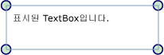

# 표시기 개요
표시기는 특수 한 유형의 <xref:System.Windows.FrameworkElement>, 사용자에 게 시각적 표시를 제공 하는 데 사용 합니다. 표시기는 다른 용도로 요소에 기능 핸들을 추가하거나 컨트롤에 대한 상태 정보를 제공하는 데 사용할 수 있습니다.  
  
  
  
   
## 표시기 정보  
 <xref:System.Windows.Documents.Adorner> 사용자 지정 <xref:System.Windows.FrameworkElement> 에 바인딩되는 <xref:System.Windows.UIElement>합니다. 표시기에서 렌더링 됩니다는 <xref:System.Windows.Documents.AdornerLayer>, 변수인 표면 렌더링은 항상 맨 위에 표시 된 요소 또는 표시 된 요소 컬렉션입니다. 표시기의 렌더링의 렌더링 별개인는 <xref:System.Windows.UIElement> 표시기에 바인딩되는 합니다. 표시기는 일반적으로 표시한 요소의 왼쪽 위에 있는 표준 2차원 좌표 원점을 사용하여, 바인딩되어 있는 요소에 상대적으로 배치됩니다.  
  
 표시기에 대한 일반 응용 프로그램은 다음과 같습니다.  
  
-   추가 기능에 대 한 핸들을 <xref:System.Windows.UIElement> 을 요소 (예: 크기 조정, 회전, 위치를 변경)에 특정 한 방식으로 조작할 수 있도록 하는입니다.  
  
-   다양한 상태를 나타내거나 다양한 이벤트에 대한 응답으로 시각적 피드백을 제공합니다.  
  
-   에 시각적 데코레이션 오버레이 <xref:System.Windows.UIElement>합니다.  
  
-   시각적으로 마스킹 또는의 전체 또는 일부를 재정의 한 <xref:System.Windows.UIElement>합니다.  
  
 [!INCLUDE[TLA#tla_winclient](../../../../includes/tlasharptla-winclient-md.md)]는 시각적 요소를 표시하는 기본 프레임워크를 제공합니다. 다음 표에 개체 및 해당 용도를 표시할 때 사용되는 기본 유형이 나와 있습니다. 다음은 여러 사용법의 예입니다.  
  
|||  
|-|-|  
|<xref:System.Windows.Documents.Adorner>|모든 구체적인 표시기 구현이 상속받는 추상 기본 클래스입니다.|  
|<xref:System.Windows.Documents.AdornerLayer>|하나 이상의 표시한 요소의 표시기에 대한 렌더링 계층을 나타내는 클래스입니다.|  
|<xref:System.Windows.Documents.AdornerDecorator>|표시기 계층이 요소 컬렉션에 연결될 수 있도록 하는 클래스입니다.|  
  
   
## 사용자 지정 표시기 구현  
 [!INCLUDE[TLA#tla_winclient](../../../../includes/tlasharptla-winclient-md.md)]에서 제공하는 표시기 프레임워크는 기본적으로 사용자 지정 표시기의 생성을 지원하는 데 사용됩니다. 추상에서 상속 되는 클래스를 구현 하 여 사용자 지정 표시기 만들어집니다 <xref:System.Windows.Documents.Adorner> 클래스입니다.  
  
> [!NOTE]
>  부모는 <xref:System.Windows.Documents.Adorner> 는 <xref:System.Windows.Documents.AdornerLayer> 렌더링 하는 <xref:System.Windows.Documents.Adorner>, 표시 되는 요소가 없습니다.  
  
 다음 예제에서는 간단한 표시기를 구현하는 클래스를 보여 줍니다. 예제에서는 표시기의 모서리를 간단히 보여는 <xref:System.Windows.UIElement> 원으로 합니다.  
  
 [!code-csharp[Adorners_SimpleCircleAdorner#_SimpleCircleAdornerBody](../../../../samples/snippets/csharp/VS_Snippets_Wpf/Adorners_SimpleCircleAdorner/CSharp/Window1.xaml.cs#_simplecircleadornerbody)]
 [!code-vb[Adorners_SimpleCircleAdorner#_SimpleCircleAdornerBody](../../../../samples/snippets/visualbasic/VS_Snippets_Wpf/Adorners_SimpleCircleAdorner/VisualBasic/Window1.xaml.vb#_simplecircleadornerbody)]  
  
 다음 이미지는 적용할 SimpleCircleAdorner 표시는 <xref:System.Windows.Controls.TextBox>합니다.  
  
   
  
   
## 표시기에 대한 렌더링 동작  
 표시기에는 고유 렌더링 동작이 포함되어 있지 않음에 유의해야 합니다. 표시기를 렌더링하는 것은 표시기 구현자의 책임입니다.   렌더링 동작을 구현할 일반적으로 재정의 하는 <xref:System.Windows.UIElement.OnRender%2A> 메서드 및 사용법 하나 이상의 <xref:System.Windows.Media.DrawingContext> 개체 (위의 예제에 표시 된) 하는 대로 필요에 따라 표시기의 시각적 요소를 렌더링 합니다.  
  
> [!NOTE]
>  표시기 계층에 배치된 모든 개체는 설정한 스타일의 나머지 부분 맨 위에 렌더링됩니다. 즉, 표시기는 시각적으로 항상 맨 위에 있으며 z-순서를 사용하여 재정의할 수 없습니다.  
  
   
## 이벤트 및 적중 횟수 테스트  
 다른 모든 마찬가지로 입력된 이벤트를 수신 하는 표시기 <xref:System.Windows.FrameworkElement>합니다.  표시기 입력된 이벤트를 받는 표시기에 표시 되는 요소 보다 더 높은 z 순서 항상 있어서 (같은 <xref:System.Windows.UIElement.Drop> 또는 <xref:System.Windows.UIElement.MouseMove>) 요소를 표시할 기본에 대 한 것일 수 있습니다.  표시기는 특정 입력 이벤트를 수신하고 이벤트를 다시 발생시켜 표시한 기본 요소에 전달할 수 있습니다.  
  
 표시기 아래에서 요소 통과 적중 테스트를 사용 하려면 적중 횟수 테스트 설정 <xref:System.Windows.UIElement.IsHitTestVisible%2A> 속성을 **false** 표시기에 있습니다.  적중 횟수 테스트에 대한 자세한 내용은   
  
 [시각적 계층에서 적중 횟수 테스트](../../../../docs/framework/wpf/graphics-multimedia/hit-testing-in-the-visual-layer.md)를 참조하세요.  
  
   
## 단일 UIElement 표시  
 표시기를 특정 바인딩할 <xref:System.Windows.UIElement>, 다음이 단계를 수행 합니다.  
  
1.  정적 메서드를 호출 <xref:System.Windows.Documents.AdornerLayer.GetAdornerLayer%2A> 가져오려는 <xref:System.Windows.Documents.AdornerLayer> 개체에 대 한는 <xref:System.Windows.UIElement> 표시 될 있습니다. <xref:System.Windows.Documents.AdornerLayer.GetAdornerLayer%2A> 지정 된 위치에서 시작 하는 시각적 트리를 따라 <xref:System.Windows.UIElement>, 찾은 첫 번째 표시기 계층을 반환 합니다. (표시기 계층이 없으면 메서드가 null을 반환합니다.)  
  
2.  호출 된 <xref:System.Windows.Documents.AdornerLayer.Add%2A> 대상에 표시기를 바인딩할 메서드를 <xref:System.Windows.UIElement>합니다.  
  
 다음 예에서는 바인딩합니다 (위에 표시 된)를 SimpleCircleAdorner는 <xref:System.Windows.Controls.TextBox> 라는 *myTextBox*합니다.  
  
 [!code-csharp[Adorners_SimpleCircleAdorner#_AdornSingleElement](../../../../samples/snippets/csharp/VS_Snippets_Wpf/Adorners_SimpleCircleAdorner/CSharp/Window1.xaml.cs#_adornsingleelement)]
 [!code-vb[Adorners_SimpleCircleAdorner#_AdornSingleElement](../../../../samples/snippets/visualbasic/VS_Snippets_Wpf/Adorners_SimpleCircleAdorner/VisualBasic/Window1.xaml.vb#_adornsingleelement)]  
  
> [!NOTE]
>  [!INCLUDE[TLA#tla_xaml](../../../../includes/tlasharptla-xaml-md.md)]를 사용하여 표시기를 다른 요소에 바인딩하는 것은 현재 지원되지 않습니다.  
  
   
## 패널의 자식 표시  
 표시기의 자식 항목에 바인딩하는 <xref:System.Windows.Controls.Panel>, 다음이 단계를 수행 합니다.  
  
1.  호출 된 `static` 메서드 <xref:System.Windows.Documents.AdornerLayer.GetAdornerLayer%2A> 표시 수의 자식 요소에 대 한 표시기 계층을 찾으려고 합니다.  
  
2.  부모 요소와 호출의 자식을 열거는 <xref:System.Windows.Documents.AdornerLayer.Add%2A> 표시기 각 자식 요소를 바인딩하는 메서드.  
  
 다음 예에서는 바인딩합니다 (위에 표시 된)의 자식에 SimpleCircleAdorner는 <xref:System.Windows.Controls.StackPanel> 라는 *myStackPanel*합니다.  
  
 [!code-csharp[Adorners_SimpleCircleAdorner#_AdornChildren](../../../../samples/snippets/csharp/VS_Snippets_Wpf/Adorners_SimpleCircleAdorner/CSharp/Window1.xaml.cs#_adornchildren)]
 [!code-vb[Adorners_SimpleCircleAdorner#_AdornChildren](../../../../samples/snippets/visualbasic/VS_Snippets_Wpf/Adorners_SimpleCircleAdorner/VisualBasic/Window1.xaml.vb#_adornchildren)]  
  
## 참고 항목  
 <xref:System.Windows.Media.AdornerHitTestResult>  
 [WPF에서 Shape 및 기본 그리기 개요](../../../../docs/framework/wpf/graphics-multimedia/shapes-and-basic-drawing-in-wpf-overview.md)  
 [이미지, 그림 및 시각적 표시로 그리기](../../../../docs/framework/wpf/graphics-multimedia/painting-with-images-drawings-and-visuals.md)  
 [Drawing 개체 개요](../../../../docs/framework/wpf/graphics-multimedia/drawing-objects-overview.md)  
 [방법 항목](../../../../docs/framework/wpf/controls/adorners-how-to-topics.md)
