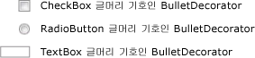

# BulletDecorator
<xref:System.Windows.Controls.Primitives.BulletDecorator> 다음 두 가지 콘텐츠 속성이: <xref:System.Windows.Controls.Primitives.BulletDecorator.Bullet%2A> 및 <xref:System.Windows.Controls.Decorator.Child%2A>합니다. <xref:System.Windows.Controls.Primitives.BulletDecorator.Bullet%2A> 속성 정의 <xref:System.Windows.UIElement> 글머리 기호로 사용 하도록 합니다. <xref:System.Windows.Controls.Decorator.Child%2A> 속성 정의 <xref:System.Windows.UIElement> 시각적 글머리 기호도 정렬 하는 합니다.  
  
 다음 그림과 사용 하는 컨트롤의 예로 <xref:System.Windows.Controls.Primitives.BulletDecorator>합니다.  
  
   
  
## 참조  
 <xref:System.Windows.Controls.Primitives.BulletDecorator>
