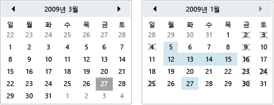

# 일정
달력 사용자를 시각적 일정 표시를 사용 하 여 날짜를 선택할 수 있습니다.  
  
 A <xref:System.Windows.Controls.Calendar> 컨트롤의 드롭다운 부분으로 또는 자체적으로 사용할 수는 <xref:System.Windows.Controls.DatePicker> 제어 합니다. 자세한 내용은 <xref:System.Windows.Controls.DatePicker>을 참조하세요.  
  
 다음 그림은 두 개의 <xref:System.Windows.Controls.Calendar> 보여 한 하지 않고 제어 합니다.  
  
   
달력 컨트롤  
  
 다음 표에서 일반적으로 연결 된 작업에 대 한 정보를 제공는 <xref:System.Windows.Controls.Calendar>합니다.  
  
|작업|구현|  
|----------|--------------------|  
|날짜를 지정 하는 선택할 수 없습니다.|<xref:System.Windows.Controls.Calendar.BlackoutDates%2A> 속성을 사용합니다.|  
|있어야는 <xref:System.Windows.Controls.Calendar> 한 달, 전체 연도 또는 10 년을 표시 합니다.|설정의 <xref:System.Windows.Controls.Calendar.DisplayMode%2A> 속성 월, 연도 또는 10 년을 합니다.|  
|날짜를 선택할 수 있는지 여부, 날짜, 범위 또는 여러 날짜 범위를 지정 합니다.|사용 하 여 <xref:System.Windows.Controls.Calendar.SelectionMode%2A>합니다.|  
|날짜 범위를 지정 하는 <xref:System.Windows.Controls.Calendar> 표시 됩니다.|사용 하 여 <xref:System.Windows.Controls.Calendar.DisplayDateStart%2A> 및 <xref:System.Windows.Controls.Calendar.DisplayDateEnd%2A> 속성입니다.|  
|현재 날짜를 강조 하는지 여부를 지정 합니다.|<xref:System.Windows.Controls.Calendar.IsTodayHighlighted%2A> 속성을 사용합니다. 기본적으로 <xref:System.Windows.Controls.Calendar.IsTodayHighlighted%2A> 은 `true`합니다.|  
|크기를 변경는 <xref:System.Windows.Controls.Calendar>합니다.|사용 하 여 한 <xref:System.Windows.Controls.Viewbox> 설정 또는 <xref:System.Windows.FrameworkElement.LayoutTransform%2A> 속성을는 <xref:System.Windows.Media.ScaleTransform>합니다. 설정한 경우에 <xref:System.Windows.FrameworkElement.Width%2A> 및 <xref:System.Windows.FrameworkElement.Height%2A> 의 속성은 <xref:System.Windows.Controls.Calendar>, 실제 달력의 크기를 변경 하지 않습니다.|  
  
 <xref:System.Windows.Controls.Calendar> 컨트롤은 마우스 또는 키보드를 사용 하 여 기본 탐색을 제공 합니다. 다음 표에서 키보드 탐색을 요약 합니다.  
  
|키 조합|<xref:System.Windows.Controls.Calendar.DisplayMode%2A>|작업|  
|---------------------|-----------------------------------------------------------------------------------------------------------------------------------------------------------|------------|  
|화살표|<xref:System.Windows.Controls.CalendarMode.Month>|변경 된 <xref:System.Windows.Controls.Calendar.SelectedDate%2A> 속성 경우는 <xref:System.Windows.Controls.Calendar.SelectionMode%2A> 속성으로 설정 되지 않은 <xref:System.Windows.Controls.CalendarSelectionMode.None>합니다.|  
|화살표|<xref:System.Windows.Controls.CalendarMode.Year>|변경 된 <xref:System.Windows.Controls.Calendar.DisplayDate%2A> 속성입니다. <xref:System.Windows.Controls.Calendar.SelectedDate%2A> 변경 되지 않습니다.|  
|화살표|<xref:System.Windows.Controls.CalendarMode.Decade>|연도 변경는 <xref:System.Windows.Controls.Calendar.DisplayDate%2A>합니다. <xref:System.Windows.Controls.Calendar.SelectedDate%2A> 변경 되지 않습니다.|  
|SHIFT + 화살표|<xref:System.Windows.Controls.CalendarMode.Month>|경우 <xref:System.Windows.Controls.Calendar.SelectionMode%2A> 로 설정 되지 않은 <xref:System.Windows.Controls.CalendarSelectionMode.SingleDate> 또는 <xref:System.Windows.Controls.CalendarSelectionMode.None>, 선택 된 날짜의 범위를 확장 합니다.|  
|홈|<xref:System.Windows.Controls.CalendarMode.Month>|변경 된 <xref:System.Windows.Controls.Calendar.SelectedDate%2A> 현재 달의 첫째 날에 있습니다.|  
|홈|<xref:System.Windows.Controls.CalendarMode.Year>|변경 된 <xref:System.Windows.Controls.Calendar.DisplayDate%2A> 연도의 첫 번째 월입니다. <xref:System.Windows.Controls.Calendar.SelectedDate%2A> 변경 되지 않습니다.|  
|홈|<xref:System.Windows.Controls.CalendarMode.Decade>|연도 변경는 <xref:System.Windows.Controls.Calendar.DisplayDate%2A> 는 10 년의 첫 번째는 연도입니다. <xref:System.Windows.Controls.Calendar.SelectedDate%2A> 변경 되지 않습니다.|  
|End |<xref:System.Windows.Controls.CalendarMode.Month>|변경 된 <xref:System.Windows.Controls.Calendar.SelectedDate%2A> 현재 달의 마지막 날입니다.|  
|End |<xref:System.Windows.Controls.CalendarMode.Year>|변경 된 <xref:System.Windows.Controls.Calendar.DisplayDate%2A> 연도의 지난 달에 있습니다. <xref:System.Windows.Controls.Calendar.SelectedDate%2A> 변경 되지 않습니다.|  
|End |<xref:System.Windows.Controls.CalendarMode.Decade>|연도 변경는 <xref:System.Windows.Controls.Calendar.DisplayDate%2A> 는 10 년의 마지막 연도입니다. <xref:System.Windows.Controls.Calendar.SelectedDate%2A> 변경 되지 않습니다.|  
|Ctrl+위쪽 화살표|임의의 값|다음 전환 큰 <xref:System.Windows.Controls.Calendar.DisplayMode%2A>합니다. 경우 <xref:System.Windows.Controls.Calendar.DisplayMode%2A> 이미 <xref:System.Windows.Controls.CalendarMode.Decade>, 작업이 없습니다.|  
|Ctrl+아래쪽 화살표|임의의 값|다음 전환 작은 <xref:System.Windows.Controls.Calendar.DisplayMode%2A>합니다. 경우 <xref:System.Windows.Controls.Calendar.DisplayMode%2A> 이미 <xref:System.Windows.Controls.CalendarMode.Month>, 작업이 없습니다.|  
|스페이스바 또는 ENTER|<xref:System.Windows.Controls.CalendarMode.Year> 또는 <xref:System.Windows.Controls.CalendarMode.Decade>|스위치 <xref:System.Windows.Controls.Calendar.DisplayMode%2A> 에 <xref:System.Windows.Controls.CalendarMode.Month> 또는 <xref:System.Windows.Controls.CalendarMode.Year> 포커스가 지정 된 항목으로 표시 합니다.|  
  
## 참고 항목  
 [컨트롤](../../../../docs/framework/wpf/controls/index.md)  
 [스타일 지정 및 템플릿](../../../../docs/framework/wpf/controls/styling-and-templating.md)
