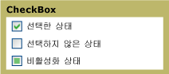

# CheckBox
응용 프로그램의 [!INCLUDE[TLA#tla_ui](../../../../includes/tlasharptla-ui-md.md)]에 <xref:System.Windows.Controls.CheckBox>를 사용하여 사용자가 선택하거나 선택을 취소할 수 있는 옵션임을 나타낼 수 있습니다.  하나의 확인란을 사용하거나 두 개 이상의 확인란을 그룹화할 수 있습니다.  
  
 다음 그래픽에서는 <xref:System.Windows.Controls.CheckBox>의 여러 상태를 보여 줍니다.  
  
   
여러 가지 상태의 CheckBox 컨트롤  
  
## 참조  
 <xref:System.Windows.Controls.CheckBox>  
 <xref:System.Windows.Controls.RadioButton>  
 <xref:System.Windows.Controls.Primitives.ButtonBase>  
 <xref:System.Windows.Controls.Primitives.RepeatButton>  
  
## 관련 단원