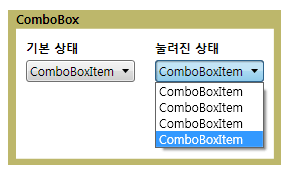

# ComboBox
<xref:System.Windows.Controls.ComboBox> 컨트롤 옵션 목록이 있는 사용자에 게 표시 합니다. 목록이 표시 하 고 숨겨진 컨트롤 확장 되 고 축소 됩니다. 해당 기본 상태인 유일한 선택 표시 목록 축소 됩니다. 사용자 옵션의 전체 목록을 확인 하는 단추를 클릭 합니다.  
  
 다음 그림에서는 한 <xref:System.Windows.Controls.ComboBox> 서로 다른 상태에 있습니다.  
  
   
축소 및 확장  
  
## 섹션 내용  
 [방법: 한 ComboBoxItem 가져오기](http://msdn.microsoft.com/en-us/8a0d2622-64b6-41fc-bf80-9669a1eacb53)  
  
## 참조  
 <xref:System.Windows.Controls.ComboBox>
