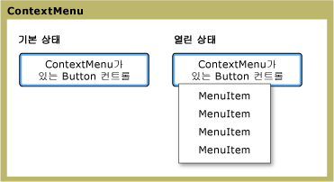

# ContextMenu
<xref:System.Windows.Controls.ContextMenu> 표시 하는 컨트롤을 사용 하면 한 <xref:System.Windows.Controls.Menu> 컨트롤의 컨텍스트에 고유 합니다. 일반적으로 <xref:System.Windows.Controls.ContextMenu> 에 노출 되는 [!INCLUDE[TLA#tla_ui](../../../../includes/tlasharptla-ui-md.md)] 또는 키보드의 메뉴 단추를 마우스 오른쪽 단추를 통해 합니다.  
  
 다음 그림은 한 <xref:System.Windows.Controls.ContextMenu> 두 개의 서로 다른 상태에: 기본 상태와 열려 있는 상태입니다. 기본 상태에서 컨트롤 축소 됩니다. 부모 메뉴의 위에 마우스 오른쪽 단추를 누르면 컨트롤을 확장 하 고 메뉴 항목이 표시 됩니다.  
  
   
다양 한 상태의 ContextMenu  
  
## 섹션 내용  
 [ContextMenu 개요](../../../../docs/framework/wpf/controls/contextmenu-overview.md)  
  
## 참조  
 <xref:System.Windows.Controls.ContextMenu>  
  
## 관련 단원
