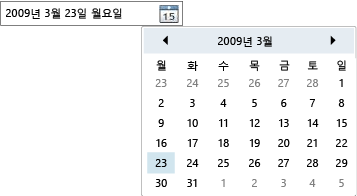

# DatePicker
<xref:System.Windows.Controls.DatePicker> 컨트롤을 사용 하면 날짜를 입력 하거나 텍스트 필드에 또는 드롭 다운을 사용 하 여 <xref:System.Windows.Controls.Calendar> 제어 합니다.  
  
 다음 그림에서는 한 <xref:System.Windows.Controls.DatePicker>합니다.  
  
   
DatePicker 컨트롤  
  
 대부분의 <xref:System.Windows.Controls.DatePicker> 컨트롤의 속성은 해당 기본 제공 관리 하기 위한 <xref:System.Windows.Controls.Calendar>, 및 함수에 해당 하는 속성에 동일 하 게 <xref:System.Windows.Controls.Calendar>합니다. 특히는 <xref:System.Windows.Controls.DatePicker.IsTodayHighlighted%2A?displayProperty=nameWithType>, <xref:System.Windows.Controls.DatePicker.FirstDayOfWeek%2A?displayProperty=nameWithType>, <xref:System.Windows.Controls.DatePicker.BlackoutDates%2A?displayProperty=nameWithType>, <xref:System.Windows.Controls.DatePicker.DisplayDateStart%2A?displayProperty=nameWithType>, <xref:System.Windows.Controls.DatePicker.DisplayDateEnd%2A?displayProperty=nameWithType>, <xref:System.Windows.Controls.DatePicker.DisplayDate%2A?displayProperty=nameWithType>, 및 <xref:System.Windows.Controls.DatePicker.SelectedDate%2A?displayProperty=nameWithType> 속성 동일 하 게 작동 자신의 <xref:System.Windows.Controls.Calendar> 대응 합니다. 자세한 내용은 <xref:System.Windows.Controls.Calendar>을 참조하세요.  
  
 사용자가 날짜를 설정 하는 텍스트 필드에 직접 입력할 수는 <xref:System.Windows.Controls.DatePicker.Text%2A> 속성입니다. 경우는 <xref:System.Windows.Controls.DatePicker> 유효한 날짜를 입력 한 문자열을 변환할 수 없는 <xref:System.Windows.Controls.DatePicker.DateValidationError> 이벤트가 발생 합니다. 기본적으로이 대 한 이벤트 처리기 하지만 예외를 발생 시키는 <xref:System.Windows.Controls.DatePicker.DateValidationError> 설정할 수는 <xref:System.Windows.Controls.DatePickerDateValidationErrorEventArgs.ThrowException%2A> 속성을 `false` 및 예외가 발생 하지 않게 합니다.  
  
## 참고 항목  
 [컨트롤](../../../../docs/framework/wpf/controls/index.md)  
 [스타일 지정 및 템플릿](../../../../docs/framework/wpf/controls/styling-and-templating.md)
