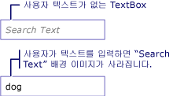

# 방법: TextBox에 워터마크 추가
다음 예제에서는의 유용성는 <xref:System.Windows.Controls.TextBox> 내부의 설명 배경 이미지를 표시 하 여는 <xref:System.Windows.Controls.TextBox> 이미지 제거 되는 지점에 사용자가 텍스트를 입력 될 때까지 합니다. 또한 사용자가 입력 내용을 제거 하는 경우 배경 이미지가 다시 복원 됩니다. 아래 그림을 참조 하십시오.  
  
   
  
> [!NOTE]
>  대신 다음 단순히 조작이 예제에는 배경 이미지를 사용 하는 이유는 <xref:System.Windows.Controls.TextBox.Text%2A> 속성 <xref:System.Windows.Controls.TextBox>은 데이터 바인딩을 사용할 배경 이미지를 방해 하지 것입니다.  
  
## 예제  
 [!code-xaml[TextBoxMiscSnippets_snip#TextBoxBackgroundExampleWholePage](../../../../samples/snippets/csharp/VS_Snippets_Wpf/TextBoxMiscSnippets_snip/csharp/textbox_with_background_image.xaml#textboxbackgroundexamplewholepage)]  
  
 [!code-csharp[TextBoxMiscSnippets_snip#TextBoxBackgroundCodeExampleWholePage](../../../../samples/snippets/csharp/VS_Snippets_Wpf/TextBoxMiscSnippets_snip/csharp/textbox_with_background_image.xaml.cs#textboxbackgroundcodeexamplewholepage)]
 [!code-vb[TextBoxMiscSnippets_snip#TextBoxBackgroundCodeExampleWholePage](../../../../samples/snippets/visualbasic/VS_Snippets_Wpf/TextBoxMiscSnippets_snip/visualbasic/textbox_with_background_image.xaml.vb#textboxbackgroundcodeexamplewholepage)]  
  
## 참고 항목  
 [TextBox 개요](../../../../docs/framework/wpf/controls/textbox-overview.md)  
 [RichTextBox 개요](../../../../docs/framework/wpf/controls/richtextbox-overview.md)
