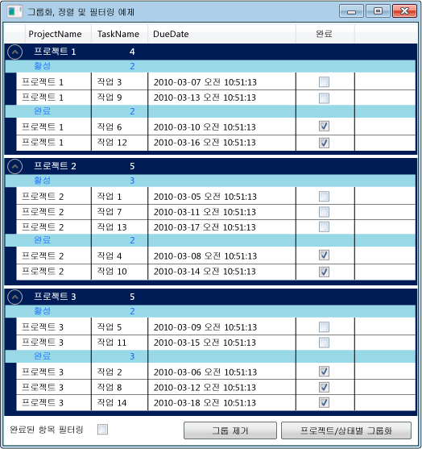

# 방법: DataGrid 컨트롤에서 데이터 그룹화, 정렬 및 필터링
경우에 따라 <xref:System.Windows.Controls.DataGrid>에서 데이터를 그룹화, 정렬 및 필터링하여 다양한 방식으로 보는 것이 유용할 수 있습니다.  <xref:System.Windows.Controls.DataGrid>에서 데이터를 그룹화, 정렬 및 필터링하려면 이러한 함수를 지원하는 <xref:System.Windows.Data.CollectionView>에 바인딩합니다.  그런 다음 내부 소스 데이터에 영향을 주지 않고 <xref:System.Windows.Data.CollectionView>에서 데이터에 대한 작업을 수행할 수 있습니다.  컬렉션 뷰의 변경 사항은 <xref:System.Windows.Controls.DataGrid> UI\(사용자 인터페이스\)에 반영됩니다.  
  
 <xref:System.Windows.Data.CollectionView> 클래스는 <xref:System.Collections.IEnumerable> 인터페이스를 구현하는 데이터 소스에 그룹화 및 정렬 기능을 제공합니다.  <xref:System.Windows.Data.CollectionViewSource> 클래스를 사용하면 XAML에서 <xref:System.Windows.Data.CollectionView>의 속성을 설정할 수 있습니다.  
  
 이 예제에서 `Task` 개체의 컬렉션은 <xref:System.Windows.Data.CollectionViewSource>에 바인딩됩니다.  <xref:System.Windows.Data.CollectionViewSource>는 <xref:System.Windows.Controls.DataGrid>의 <xref:System.Windows.Controls.ItemsControl.ItemsSource%2A>로 사용됩니다.  그룹화, 정렬 및 필터링은 <xref:System.Windows.Data.CollectionViewSource>에서 수행되며 <xref:System.Windows.Controls.DataGrid> UI에 표시됩니다.  
  
   
DataGrid에서 그룹화된 데이터  
  
## CollectionViewSource를 ItemsSource로 사용  
 <xref:System.Windows.Controls.DataGrid> 컨트롤에서 데이터를 그룹화, 정렬 및 필터링하려면 이러한 함수를 지원하는 <xref:System.Windows.Data.CollectionView>에 <xref:System.Windows.Controls.DataGrid>를 바인딩합니다.  이 예제에서는 <xref:System.Windows.Controls.DataGrid>가 `Task` 개체의 <xref:System.Collections.Generic.List%601>에 대해 이러한 함수를 제공하는 <xref:System.Windows.Data.CollectionViewSource>에 바인딩됩니다.  
  
#### DataGrid를 CollectionViewSource에 바인딩하려면  
  
1.  <xref:System.Collections.IEnumerable> 인터페이스를 구현하는 데이터 컬렉션을 만듭니다.  
  
     <xref:System.Collections.Generic.List%601>을 사용하여 컬렉션을 만드는 경우 <xref:System.Collections.Generic.List%601>의 인스턴스를 인스턴스화하는 대신 <xref:System.Collections.Generic.List%601>에서 상속되는 새 클래스를 만들어야 합니다.  이렇게 하면 XAML에서 데이터를 컬렉션에 바인딩할 수 있습니다.  
  
    > [!NOTE]
    >  컬렉션의 개체는 <xref:System.Windows.Controls.DataGrid>가 속성 변경 및 편집 내용에 제대로 응답하도록 하기 위해 <xref:System.ComponentModel.INotifyPropertyChanged> 변경된 인터페이스 및 <xref:System.ComponentModel.IEditableObject> 인터페이스를 구현해야 합니다.  자세한 내용은 [속성 변경 알림 구현](../../../../docs/framework/wpf/data/how-to-implement-property-change-notification.md)을 참조하십시오.  
  
     [!code-csharp[DataGrid_GroupSortFilter#101](../../../../samples/snippets/csharp/VS_Snippets_Wpf/DataGrid_GroupSortFilter/CS/MainWindow.xaml.cs#101)]
     [!code-vb[DataGrid_GroupSortFilter#101](../../../../samples/snippets/visualbasic/VS_Snippets_Wpf/DataGrid_GroupSortFilter/VB/MainWindow.xaml.vb#101)]  
  
2.  XAML에서 컬렉션 클래스의 인스턴스를 만들고 [x:Key 지시문](../../../../docs/framework/xaml-services/x-key-directive.md)을 설정합니다.  
  
3.  XAML에서 <xref:System.Windows.Data.CollectionViewSource> 클래스의 인스턴스를 만들고, [x:Key 지시문](../../../../docs/framework/xaml-services/x-key-directive.md)를 설정하고, 컬렉션 클래스의 인스턴스를 <xref:System.Windows.Data.CollectionViewSource.Source%2A>로 설정합니다.  
  
     [!code-xml[DataGrid_GroupSortFilter#201](../../../../samples/snippets/csharp/VS_Snippets_Wpf/DataGrid_GroupSortFilter/CS/WindowSnips1.xaml#201)]  
  
4.  <xref:System.Windows.Controls.DataGrid> 클래스의 인스턴스를 만들고 <xref:System.Windows.Controls.ItemsControl.ItemsSource%2A> 속성을 <xref:System.Windows.Data.CollectionViewSource>로 설정합니다.  
  
     [!code-xml[DataGrid_GroupSortFilter#002](../../../../samples/snippets/csharp/VS_Snippets_Wpf/DataGrid_GroupSortFilter/CS/MainWindow.xaml#002)]  
  
5.  코드에서 <xref:System.Windows.Data.CollectionViewSource>에 액세스하려면 <xref:System.Windows.Data.CollectionViewSource.GetDefaultView%2A> 메서드를 사용하여 <xref:System.Windows.Data.CollectionViewSource>에 대한 참조를 가져옵니다.  
  
     [!code-csharp[DataGrid_GroupSortFilter#102](../../../../samples/snippets/csharp/VS_Snippets_Wpf/DataGrid_GroupSortFilter/CS/MainWindow.xaml.cs#102)]
     [!code-vb[DataGrid_GroupSortFilter#102](../../../../samples/snippets/visualbasic/VS_Snippets_Wpf/DataGrid_GroupSortFilter/VB/MainWindow.xaml.vb#102)]  
  
## DataGrid에서 항목 그룹화  
 <xref:System.Windows.Controls.DataGrid>에서 항목이 그룹화되는 방법을 지정하려면 <xref:System.Windows.Data.PropertyGroupDescription> 형식을 사용하여 소스 뷰에서 항목을 그룹화합니다.  
  
#### XAML을 사용하여 DataGrid에서 항목을 그룹화하려면  
  
1.  그룹화 기준 속성을 지정하는 <xref:System.Windows.Data.PropertyGroupDescription>을 만듭니다.  XAML 또는 코드에서 속성을 지정할 수 있습니다.  
  
    1.  XAML에서 <xref:System.Windows.Data.PropertyGroupDescription.PropertyName%2A>을 그룹화할 기준이 되는 속성의 이름으로 설정합니다.  
  
    2.  코드에서 그룹화할 기준이 되는 속성의 이름을 생성자에게 전달합니다.  
  
2.  <xref:System.Windows.Data.PropertyGroupDescription>을 <xref:System.Windows.Data.CollectionViewSource.GroupDescriptions%2A?displayProperty=fullName> 컬렉션에 추가합니다.  
  
3.  <xref:System.Windows.Data.PropertyGroupDescription>의 추가 인스턴스를 <xref:System.Windows.Data.CollectionViewSource.GroupDescriptions%2A> 컬렉션에 추가하여 더 많은 그룹화 수준을 추가합니다.  
  
     [!code-xml[DataGrid_GroupSortFilter#012](../../../../samples/snippets/csharp/VS_Snippets_Wpf/DataGrid_GroupSortFilter/CS/MainWindow.xaml#012)]  
  
     [!code-csharp[DataGrid_GroupSortFilter#112](../../../../samples/snippets/csharp/VS_Snippets_Wpf/DataGrid_GroupSortFilter/CS/MainWindow.xaml.cs#112)]
     [!code-vb[DataGrid_GroupSortFilter#112](../../../../samples/snippets/visualbasic/VS_Snippets_Wpf/DataGrid_GroupSortFilter/VB/MainWindow.xaml.vb#112)]  
  
4.  그룹을 제거하려면 <xref:System.Windows.Data.CollectionViewSource.GroupDescriptions%2A> 컬렉션에서 <xref:System.Windows.Data.PropertyGroupDescription>을 제거합니다.  
  
5.  모든 그룹을 제거하려면 <xref:System.Windows.Data.CollectionViewSource.GroupDescriptions%2A> 컬렉션의 <xref:System.Collections.ObjectModel.Collection%601.Clear%2A> 메서드를 호출합니다.  
  
     [!code-csharp[DataGrid_GroupSortFilter#114](../../../../samples/snippets/csharp/VS_Snippets_Wpf/DataGrid_GroupSortFilter/CS/MainWindow.xaml.cs#114)]
     [!code-vb[DataGrid_GroupSortFilter#114](../../../../samples/snippets/visualbasic/VS_Snippets_Wpf/DataGrid_GroupSortFilter/VB/MainWindow.xaml.vb#114)]  
  
 항목이 <xref:System.Windows.Controls.DataGrid>에 그룹화되어 있으면 각 그룹의 모양을 지정하는 <xref:System.Windows.Controls.GroupStyle>을 정의할 수 있습니다.  DataGrid의 <xref:System.Windows.Controls.ItemsControl.GroupStyle%2A> 컬렉션에 <xref:System.Windows.Controls.GroupStyle>을 추가하여 이를 적용합니다.  여러 그룹화 수준이 있는 경우 각 그룹 수준에 서로 다른 스타일을 적용할 수 있습니다.  스타일은 정의된 순서대로 적용됩니다.  예를 들어 두 가지 스타일을 정의한 경우 첫 번째 스타일이 최상위 행 그룹에 적용됩니다.  두 번째 스타일은 두 번째 수준 및 그 하위 수준의 모든 행 그룹에 적용됩니다.  <xref:System.Windows.Controls.GroupStyle>의 <xref:System.Windows.FrameworkElement.DataContext%2A>는 그룹이 나타내는 <xref:System.Windows.Data.CollectionViewGroup>입니다.  
  
#### 행 그룹 머리글의 모양을 변경하려면  
  
1.  행 그룹의 모양을 정의하는 <xref:System.Windows.Controls.GroupStyle>을 만듭니다.  
  
2.  <xref:System.Windows.Controls.GroupStyle>을 `<DataGrid.GroupStyle>` 태그 안에 넣습니다.  
  
     [!code-xml[DataGrid_GroupSortFilter#003](../../../../samples/snippets/csharp/VS_Snippets_Wpf/DataGrid_GroupSortFilter/CS/MainWindow.xaml#003)]  
  
## DataGrid에서 항목 정렬  
 <xref:System.Windows.Controls.DataGrid>에서 항목이 정렬되는 방법을 지정하려면 <xref:System.ComponentModel.SortDescription> 형식을 사용하여 소스 뷰에서 항목을 정렬합니다.  
  
#### DataGrid에서 항목을 정렬하려면  
  
1.  정렬 기준 속성을 지정하는 <xref:System.ComponentModel.SortDescription>을 만듭니다.  XAML 또는 코드에서 속성을 지정할 수 있습니다.  
  
    1.  XAML에서 <xref:System.ComponentModel.SortDescription.PropertyName%2A>을 정렬 기준이 되는 속성의 이름으로 설정합니다.  
  
    2.  코드에서 정렬 기준이 되는 속성의 이름 및 <xref:System.ComponentModel.ListSortDirection>을 생성자에게 전달합니다.  
  
2.  <xref:System.Windows.Data.CollectionViewSource.SortDescriptions%2A?displayProperty=fullName> 컬렉션에 <xref:System.ComponentModel.SortDescription>을 추가합니다.  
  
3.  <xref:System.ComponentModel.SortDescription>의 추가 인스턴스를 <xref:System.Windows.Data.CollectionViewSource.SortDescriptions%2A> 컬렉션에 추가하여 추가 속성을 기준으로 정렬합니다.  
  
     [!code-xml[DataGrid_GroupSortFilter#011](../../../../samples/snippets/csharp/VS_Snippets_Wpf/DataGrid_GroupSortFilter/CS/MainWindow.xaml#011)]  
  
     [!code-csharp[DataGrid_GroupSortFilter#211](../../../../samples/snippets/csharp/VS_Snippets_Wpf/DataGrid_GroupSortFilter/CS/WindowSnips1.xaml.cs#211)]
     [!code-vb[DataGrid_GroupSortFilter#211](../../../../samples/snippets/visualbasic/VS_Snippets_Wpf/DataGrid_GroupSortFilter/VB/MainWindow.xaml.vb#211)]  
  
## DataGrid에서 항목을 필터링하려면  
 <xref:System.Windows.Controls.DataGrid>에서 <xref:System.Windows.Data.CollectionViewSource>를 사용하여 항목을 필터링하려면 <xref:System.Windows.Data.CollectionViewSource.Filter?displayProperty=fullName> 이벤트에 대한 처리기에 필터링 논리를 제공합니다.  
  
#### DataGrid에서 항목을 필터링하려면  
  
1.  <xref:System.Windows.Data.CollectionViewSource.Filter?displayProperty=fullName> 이벤트에 대한 처리기를 추가합니다.  
  
2.  <xref:System.Windows.Data.CollectionViewSource.Filter> 이벤트 처리기에서 필터링 논리를 정의합니다.  
  
     뷰를 새로 고칠 때마다 필터가 적용됩니다.  
  
     [!code-xml[DataGrid_GroupSortFilter#013](../../../../samples/snippets/csharp/VS_Snippets_Wpf/DataGrid_GroupSortFilter/CS/MainWindow.xaml#013)]  
  
     [!code-csharp[DataGrid_GroupSortFilter#113](../../../../samples/snippets/csharp/VS_Snippets_Wpf/DataGrid_GroupSortFilter/CS/MainWindow.xaml.cs#113)]
     [!code-vb[DataGrid_GroupSortFilter#113](../../../../samples/snippets/visualbasic/VS_Snippets_Wpf/DataGrid_GroupSortFilter/VB/MainWindow.xaml.vb#113)]  
  
 또한 <xref:System.Windows.Controls.DataGrid>에서 항목을 필터링하려면 필터링 논리를 제공하는 메서드를 만들고 <xref:System.Windows.Data.CollectionView.Filter%2A?displayProperty=fullName> 속성을 설정하여 필터를 적용합니다.  이 메서드의 예제는 [뷰에서 데이터 필터링](../../../../docs/framework/wpf/data/how-to-filter-data-in-a-view.md)을 참조하십시오.  
  
## 예제  
 다음 예제에서는 <xref:System.Windows.Data.CollectionViewSource>에서 `Task` 데이터를 그룹화, 정렬 및 필터링하고, <xref:System.Windows.Controls.DataGrid>에 그룹화, 정렬 및 필터링된 `Task` 데이터를 표시하는 방법을 보여 줍니다.  <xref:System.Windows.Data.CollectionViewSource>는 <xref:System.Windows.Controls.DataGrid>의 <xref:System.Windows.Controls.ItemsControl.ItemsSource%2A>로 사용됩니다.  그룹화, 정렬 및 필터링은 <xref:System.Windows.Data.CollectionViewSource>에서 수행되며 <xref:System.Windows.Controls.DataGrid> UI에 표시됩니다.  
  
 이 예제를 테스트하려면 DGGroupSortFilterExample 이름을 프로젝트 이름과 일치하도록 조정해야 합니다.  Visual Basic을 사용하는 경우에는 <xref:System.Windows.Window>의 클래스 이름을 다음과 같이 변경해야 합니다.  
  
 `<Window x:Class="MainWindow"`  
  
 [!code-xml[DataGrid_GroupSortFilter#000](../../../../samples/snippets/csharp/VS_Snippets_Wpf/DataGrid_GroupSortFilter/CS/MainWindow.xaml#000)]  
  
 [!code-csharp[DataGrid_GroupSortFilter#100](../../../../samples/snippets/csharp/VS_Snippets_Wpf/DataGrid_GroupSortFilter/CS/MainWindow.xaml.cs#100)]
 [!code-vb[DataGrid_GroupSortFilter#100](../../../../samples/snippets/visualbasic/VS_Snippets_Wpf/DataGrid_GroupSortFilter/VB/MainWindow.xaml.vb#100)]  
  
## 코드 컴파일  
  
## 강력한 프로그래밍  
  
## .NET Framework 보안  
  
## 참고 항목  
 [데이터 바인딩 개요](../../../../docs/framework/wpf/data/data-binding-overview.md)   
 [ObservableCollection 만들기 및 바인딩](../../../../docs/framework/wpf/data/how-to-create-and-bind-to-an-observablecollection.md)   
 [뷰에서 데이터 필터링](../../../../docs/framework/wpf/data/how-to-filter-data-in-a-view.md)   
 [뷰의 데이터 정렬](../../../../docs/framework/wpf/data/how-to-sort-data-in-a-view.md)   
 [XAML에서 뷰를 사용하여 데이터 정렬 및 그룹화](../../../../docs/framework/wpf/data/how-to-sort-and-group-data-using-a-view-in-xaml.md)