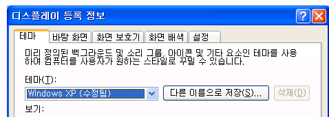

# 레이블
<xref:System.Windows.Controls.Label> 컨트롤의 정보는 일반적으로 제공 된 [!INCLUDE[TLA#tla_ui](../../../../includes/tlasharptla-ui-md.md)]합니다.  지금까지 <xref:System.Windows.Controls.Label> 만 텍스트 요소가 포함 되어 있는 하지만 없기 때문에 <xref:System.Windows.Controls.Label> 함께 제공 되는 [!INCLUDE[TLA#tla_winclient](../../../../includes/tlasharptla-winclient-md.md)] 는 <xref:System.Windows.Controls.ContentControl>, 텍스트를 포함할 수 있습니다 또는 <xref:System.Windows.UIElement>합니다.  
  
 A <xref:System.Windows.Controls.Label> 선택 키에 대 한 기능 및 시각적 지원을 제공 합니다. 와 같은 빠른 키보드로 컨트롤에 액세스할 수 있도록 자주 사용 되는 <xref:System.Windows.Controls.TextBox>합니다. 할당 하는 <xref:System.Windows.Controls.Label> 에 <xref:System.Windows.Controls.Control>설정는 <xref:System.Windows.Controls.Label.Target%2A?displayProperty=nameWithType> 속성 선택 키를 누를 때 포커스를 받아야 하는 컨트롤을 합니다.  
  
 다음 그림에서는 한 <xref:System.Windows.Controls.Label> "테마"을 대상으로 하는 <xref:System.Windows.Controls.ComboBox>합니다.  사용자가 누르면는 <xref:System.Windows.Controls.ComboBox> 포커스를 받습니다.  자세한 내용은 참조 [하는 방법: 레이블의 대상 속성으로 설정](http://msdn.microsoft.com/library/b24c6977-ebcb-4855-a9bb-3fd4435af8f8)합니다.  
  
   
  
## 섹션 내용  
 [방법: 레이블의 대상 속성 설정](http://msdn.microsoft.com/library/b24c6977-ebcb-4855-a9bb-3fd4435af8f8)  
  
## 참조  
 <xref:System.Windows.Controls.Label>
