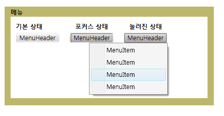

# 메뉴
<xref:System.Windows.Controls.Menu>는 명령이나 이벤트 처리기와 연결된 요소를 계층적으로 구성할 수 있는 컨트롤입니다.  각 <xref:System.Windows.Controls.Menu>는 여러 개의 <xref:System.Windows.Controls.MenuItem> 컨트롤을 포함할 수 있습니다.  각 <xref:System.Windows.Controls.MenuItem>은 명령을 호출하거나 `Click` 이벤트 처리기를 호출할 수 있습니다.  또한 <xref:System.Windows.Controls.MenuItem>은 여러 개의 <xref:System.Windows.Controls.MenuItem> 요소를 자식으로 가질 수 있으므로 하위 메뉴를 형성할 수 있습니다.  
  
 다음 그림에서는 메뉴 컨트롤의 세 가지 상태를 보여 줍니다.  기본 상태는 <xref:System.Windows.Controls.Menu> 위에 마우스 포인터 같은 장치가 없는 상태입니다.  마우스 포인터가 <xref:System.Windows.Controls.Menu> 위로 이동하면 포커스 상태가 발생하고 <xref:System.Windows.Controls.Menu> 위에서 마우스 단추를 클릭하면 누름 상태가 발생합니다.  
  
   
여러 가지 상태의 메뉴  
  
## 단원 내용  
 [Menu 개요](../../../../docs/framework/wpf/controls/menu-overview.md)  
  
## 참조  
 <xref:System.Windows.Controls.Menu>  
 <xref:System.Windows.Controls.MenuItem>  
 <xref:System.Windows.Controls.Primitives.MenuBase>  
 <xref:System.Windows.Controls.ContextMenu>  
  
## 관련 단원