# Popup 배치 동작
A <xref:System.Windows.Controls.Primitives.Popup> 컨트롤은 응용 프로그램 위에 배치 되는 별도 창에 콘텐츠를 표시 합니다. 위치를 지정할 수는 <xref:System.Windows.Controls.Primitives.Popup> 컨트롤, 마우스 또는 사용 하 여 화면을 기준으로 <xref:System.Windows.Controls.Primitives.Popup.PlacementTarget%2A>, <xref:System.Windows.Controls.Primitives.Popup.Placement%2A>, <xref:System.Windows.Controls.Primitives.Popup.PlacementRectangle%2A>, <xref:System.Windows.Controls.Primitives.Popup.HorizontalOffset%2A>, 및 <xref:System.Windows.Controls.Primitives.Popup.VerticalOffset%2A> 속성입니다.  이러한 속성의 위치를 지정 하는 유연성을 제공 하기 위해 함께 작동는 <xref:System.Windows.Controls.Primitives.Popup>합니다.  
  
> [!NOTE]
>  <xref:System.Windows.Controls.ToolTip> 및 <xref:System.Windows.Controls.ContextMenu> 클래스 또한 이러한 다섯 가지 속성을 정의 하 고 유사 하 게 동작 합니다.  
  
   
  
   
## 팝업 위치 지정  
 배치는 <xref:System.Windows.Controls.Primitives.Popup> 기준으로 지정할 수는 <xref:System.Windows.UIElement> 또는 전체 화면입니다.  다음 예제에서는 네 개를 만듭니다 <xref:System.Windows.Controls.Primitives.Popup> 기준으로 하는 컨트롤을 <xref:System.Windows.UIElement>-이 경우 이미지에 있습니다. 모든는 <xref:System.Windows.Controls.Primitives.Popup> 컨트롤도 <xref:System.Windows.Controls.Primitives.Popup.PlacementTarget%2A> 속성으로 설정 `image1`, 되지만 각 <xref:System.Windows.Controls.Primitives.Popup> 배치 속성에 대 한 다른 값을 가진 합니다.  
  
 [!code-xml[PopupPositionSnippet#3](../../../../samples/snippets/csharp/VS_Snippets_Wpf/PopupPositionSnippet/CS/Window1.xaml#3)]  
  
 다음 그림에서는 이미지 및 <xref:System.Windows.Controls.Primitives.Popup> 컨트롤  
  
   
네 개의 팝업을 사용 하 여 이미지  
  
 설정 하는 방법을 보여 주는 간단한 예제는 <xref:System.Windows.Controls.Primitives.Popup.PlacementTarget%2A> 및 <xref:System.Windows.Controls.Primitives.Popup.Placement%2A> 속성을 사용 하 여는 <xref:System.Windows.Controls.Primitives.Popup.PlacementRectangle%2A>, <xref:System.Windows.Controls.Primitives.Popup.HorizontalOffset%2A>, 및 <xref:System.Windows.Controls.Primitives.Popup.VerticalOffset%2A> 속성을 where을 훨씬 더 많은으로 제어할 수는 <xref:System.Windows.Controls.Primitives.Popup> 배치 됩니다.  
  
   
## 용어의 정의: 팝업 분석  
 다음 용어는 이해 하는 데에서 유용 방법을 <xref:System.Windows.Controls.Primitives.Popup.PlacementTarget%2A>, <xref:System.Windows.Controls.Primitives.Popup.Placement%2A>, <xref:System.Windows.Controls.Primitives.Popup.PlacementRectangle%2A>, <xref:System.Windows.Controls.Primitives.Popup.HorizontalOffset%2A>, 및 <xref:System.Windows.Controls.Primitives.Popup.VerticalOffset%2A> 서로 관련 속성 및 <xref:System.Windows.Controls.Primitives.Popup>:  
  
-   대상 개체  
  
-   대상 영역  
  
-   대상 원점  
  
-   팝업 맞춤 지점  
  
 이러한 용어의 다양 한 측면을 참조 하는 편리한 방법을 제공 된 <xref:System.Windows.Controls.Primitives.Popup> 와 연결 된 컨트롤입니다.  
  
### 대상 개체  
 *대상 개체* 요소 하는 <xref:System.Windows.Controls.Primitives.Popup> 연관 됩니다. 하는 경우는 <xref:System.Windows.Controls.Primitives.Popup.PlacementTarget%2A> 속성이 설정 되어 있으면 대상 개체를 지정 합니다.  경우 <xref:System.Windows.Controls.Primitives.Popup.PlacementTarget%2A> 설정 되지 않은 경우 및 <xref:System.Windows.Controls.Primitives.Popup> 부모가 부모는 대상 개체입니다.  없을 경우 없는 <xref:System.Windows.Controls.Primitives.Popup.PlacementTarget%2A> 값과 부모가 없는 대상 개체가 없는 및 <xref:System.Windows.Controls.Primitives.Popup> 화면을 기준으로 배치 됩니다.  
  
 다음 예제에서는 한 <xref:System.Windows.Controls.Primitives.Popup> 의 자식인은 <xref:System.Windows.Controls.Canvas>합니다.  이 예제를 설정 하지 않는 <xref:System.Windows.Controls.Primitives.Popup.PlacementTarget%2A> 속성에는 <xref:System.Windows.Controls.Primitives.Popup>합니다. 기본값 <xref:System.Windows.Controls.Primitives.Popup.Placement%2A> 는 <xref:System.Windows.Controls.Primitives.PlacementMode?displayProperty=fullName>이므로 <xref:System.Windows.Controls.Primitives.Popup> 아래에 표시 된 <xref:System.Windows.Controls.Canvas>.  
  
 [!code-xml[PopupPositionSnippet#1](../../../../samples/snippets/csharp/VS_Snippets_Wpf/PopupPositionSnippet/CS/Window1.xaml#1)]  
  
 다음 그림에 나와 있는 <xref:System.Windows.Controls.Primitives.Popup> 기준으로 배치 된 <xref:System.Windows.Controls.Canvas>합니다.  
  
   
Placementtarget이 없는 팝업  
  
 다음 예제에서는 <xref:System.Windows.Controls.Primitives.Popup> 의 자식인은 <xref:System.Windows.Controls.Canvas>, 되지만이 이번에는 <xref:System.Windows.Controls.Primitives.Popup.PlacementTarget%2A> 로 설정 된 `ellipse1`이므로 아래 팝업이 표시 되는 <xref:System.Windows.Shapes.Ellipse>합니다.  
  
 [!code-xml[PopupPositionSnippet#2](../../../../samples/snippets/csharp/VS_Snippets_Wpf/PopupPositionSnippet/CS/Window1.xaml#2)]  
  
 다음 그림에 나와 있는 <xref:System.Windows.Controls.Primitives.Popup> 상대적으로 배치 되는 <xref:System.Windows.Shapes.Ellipse>합니다.  
  
   
Placementtarget이 팝업  
  
> [!NOTE]
>  에 대 한 <xref:System.Windows.Controls.ToolTip>의 기본값 <xref:System.Windows.Controls.Primitives.Popup.Placement%2A> 는 <xref:System.Windows.Controls.Primitives.PlacementMode>합니다.  에 대 한 <xref:System.Windows.Controls.ContextMenu>의 기본값 <xref:System.Windows.Controls.Primitives.Popup.Placement%2A> 는 <xref:System.Windows.Controls.Primitives.PlacementMode>합니다. 이러한 값의 뒷부분에서 설명, "어떻게 속성 함께 작동 합니다."  
  
### 대상 영역  
 *영역 대상* 화면에 있는 영역 하는 <xref:System.Windows.Controls.Primitives.Popup> 기준으로 합니다. 이전 예제에서는 <xref:System.Windows.Controls.Primitives.Popup> 경우도 있지만 대상 개체의 경계에 맞춰집니다는 <xref:System.Windows.Controls.Primitives.Popup> 다른 범위에 정렬 됩니다 경우에는 <xref:System.Windows.Controls.Primitives.Popup> 에 대상 개체가 있습니다.  하는 경우는 <xref:System.Windows.Controls.Primitives.Popup.PlacementRectangle%2A> 속성이 설정 되어 있으면 대상 영역에는 대상 개체의 경계와 다릅니다.  
  
 다음 예제에서는 두 개의 <xref:System.Windows.Controls.Canvas> 개의 개체는 <xref:System.Windows.Shapes.Rectangle> 및 <xref:System.Windows.Controls.Primitives.Popup>합니다.  두 경우 모두의 대상 개체는 <xref:System.Windows.Controls.Primitives.Popup> 는 <xref:System.Windows.Controls.Canvas>합니다. <xref:System.Windows.Controls.Primitives.Popup> 첫 번째에서 <xref:System.Windows.Controls.Canvas> 에 <xref:System.Windows.Controls.Primitives.Popup.PlacementRectangle%2A> 으로 설정의 <xref:System.Windows.Rect.X%2A>, <xref:System.Windows.Rect.Y%2A>, <xref:System.Windows.Rect.Width%2A>, 및 <xref:System.Windows.Rect.Height%2A> 속성이 각각 50, 50, 50에서 100으로 설정 합니다. <xref:System.Windows.Controls.Primitives.Popup> 두 번째에서 <xref:System.Windows.Controls.Canvas> 없는 <xref:System.Windows.Controls.Primitives.Popup.PlacementRectangle%2A> 설정 합니다.  결과적으로, 첫 번째 <xref:System.Windows.Controls.Primitives.Popup> 아래에 배치 되는 <xref:System.Windows.Controls.Primitives.Popup.PlacementRectangle%2A> 및 두 번째 <xref:System.Windows.Controls.Primitives.Popup> 아래에 배치는 <xref:System.Windows.Controls.Canvas>. 각 <xref:System.Windows.Controls.Canvas> 도 포함 되어는 <xref:System.Windows.Shapes.Rectangle> 동일한 범위의는 <xref:System.Windows.Controls.Primitives.Popup.PlacementRectangle%2A> 첫 번째 <xref:System.Windows.Controls.Primitives.Popup>합니다.  <xref:System.Windows.Controls.Primitives.Popup.PlacementRectangle%2A> 응용 프로그램에 표시 되는 요소를 만들지 않습니다 만듭니다는 <xref:System.Windows.Shapes.Rectangle> 를 나타내는 <xref:System.Windows.Controls.Primitives.Popup.PlacementRectangle%2A>합니다.  
  
 [!code-xml[PopupPositionSnippet#4](../../../../samples/snippets/csharp/VS_Snippets_Wpf/PopupPositionSnippet/CS/Window1.xaml#4)]  
  
 다음 그림에서는 위 예의 결과 보여 줍니다.  
  
   
PlacementRectangle이 있을 때와 없을 때의 팝업  
  
### 대상 원점 및 팝업 맞춤 지점  
 *원본 대상* 및 *팝업 맞춤 지점* 은 대상 영역 및 팝업 참조 지점 각각 위치 지정에 사용 되는 합니다. 사용할 수는 <xref:System.Windows.Controls.Primitives.Popup.HorizontalOffset%2A> 및 <xref:System.Windows.Controls.Primitives.Popup.VerticalOffset%2A> 대상 영역에서 팝업을 오프셋 하는 속성입니다.  <xref:System.Windows.Controls.Primitives.Popup.HorizontalOffset%2A> 및 <xref:System.Windows.Controls.Primitives.Popup.VerticalOffset%2A> 은 대상 원점과 팝업 맞춤 지점 기준으로 합니다. 값은 <xref:System.Windows.Controls.Primitives.Popup.Placement%2A> 속성 대상 원점 및 팝업 맞춤 지점 있는 위치를 결정 합니다.  
  
 다음 예제에서는 한 <xref:System.Windows.Controls.Primitives.Popup> 설정 하 고는 <xref:System.Windows.Controls.Primitives.Popup.HorizontalOffset%2A> 및 <xref:System.Windows.Controls.Primitives.Popup.VerticalOffset%2A> 속성을 20입니다.  <xref:System.Windows.Controls.Primitives.Popup.Placement%2A> 속성이 <xref:System.Windows.Controls.Primitives.PlacementMode> (기본값), 따라서 대상 원점이 대상 영역의 맨 아래 왼쪽 모서리 이며 팝업 맞춤 지점의 왼쪽 위 모서리는 <xref:System.Windows.Controls.Primitives.Popup>합니다.  
  
 [!code-xml[PopupPositionSnippet#5](../../../../samples/snippets/csharp/VS_Snippets_Wpf/PopupPositionSnippet/CS/Window1.xaml#5)]  
  
 다음 그림에서는 위 예의 결과 보여 줍니다.  
  
 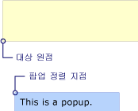  
HorizontalOffset 및 VerticalOffset의 팝업  
  
   
## 속성은 함께 사용 하는 방법  
 값 <xref:System.Windows.Controls.Primitives.Popup.PlacementTarget%2A>, <xref:System.Windows.Controls.Primitives.Popup.PlacementRectangle%2A>, 및 <xref:System.Windows.Controls.Primitives.Popup.Placement%2A> 올바른 대상 영역, 대상 원점 및 팝업 맞춤 지점 파악 하려면 함께 고려해 야 합니다.  예를 들어 하는 경우의 값 <xref:System.Windows.Controls.Primitives.Popup.Placement%2A> 는 <xref:System.Windows.Controls.Primitives.PlacementMode>, 대상 개체가 없는 <xref:System.Windows.Controls.Primitives.Popup.PlacementRectangle%2A> 무시 됩니다 대상 영역에 마우스 포인터의 범위 이며 합니다. 반면에 경우 <xref:System.Windows.Controls.Primitives.Popup.Placement%2A> 는 <xref:System.Windows.Controls.Primitives.PlacementMode>, <xref:System.Windows.Controls.Primitives.Popup.PlacementTarget%2A> 대상 개체를 결정 하는 부모 또는 및 <xref:System.Windows.Controls.Primitives.Popup.PlacementRectangle%2A> 대상 영역을 결정 합니다.  
  
 다음 표에서 대상 개체, 대상 영역, 대상 원점 및 팝업 맞춤 지점에 설명 하 고 나타냅니다 여부 <xref:System.Windows.Controls.Primitives.Popup.PlacementTarget%2A> 및 <xref:System.Windows.Controls.Primitives.Popup.PlacementRectangle%2A> 각에 사용 되는 <xref:System.Windows.Controls.Primitives.PlacementMode> 열거형 값입니다.  
  
|PlacementMode|대상 개체|대상 영역|대상 원점|팝업 맞춤 지점|  
|-------------------|-------------------|-----------------|-------------------|---------------------------|  
|<xref:System.Windows.Controls.Primitives.PlacementMode>|해당 사항 없음. <xref:System.Windows.Controls.Primitives.Popup.PlacementTarget%2A> 무시 됩니다.|화면 또는 <xref:System.Windows.Controls.Primitives.Popup.PlacementRectangle%2A> 설정 된 경우.  <xref:System.Windows.Controls.Primitives.Popup.PlacementRectangle%2A> 화면 상대적입니다.|대상 영역의 왼쪽 위 모퉁이입니다.|왼쪽 위 모서리는 <xref:System.Windows.Controls.Primitives.Popup>합니다.|  
|<xref:System.Windows.Controls.Primitives.PlacementMode>|해당 사항 없음. <xref:System.Windows.Controls.Primitives.Popup.PlacementTarget%2A> 무시 됩니다.|화면 또는 <xref:System.Windows.Controls.Primitives.Popup.PlacementRectangle%2A> 설정 된 경우.  <xref:System.Windows.Controls.Primitives.Popup.PlacementRectangle%2A> 화면 상대적입니다.|대상 영역의 왼쪽 위 모퉁이입니다.|왼쪽 위 모서리는 <xref:System.Windows.Controls.Primitives.Popup>합니다.|  
|<xref:System.Windows.Controls.Primitives.PlacementMode>|<xref:System.Windows.Controls.Primitives.Popup.PlacementTarget%2A> 또는 부모입니다.|대상 개체 또는 <xref:System.Windows.Controls.Primitives.Popup.PlacementRectangle%2A> 설정 된 경우.  <xref:System.Windows.Controls.Primitives.Popup.PlacementRectangle%2A> 는 대상 개체를 기준으로 합니다.|대상 영역의 맨 아래 왼쪽 모서리입니다.|왼쪽 위 모서리는 <xref:System.Windows.Controls.Primitives.Popup>합니다.|  
|<xref:System.Windows.Controls.Primitives.PlacementMode>|<xref:System.Windows.Controls.Primitives.Popup.PlacementTarget%2A> 또는 부모입니다.|대상 개체 또는 <xref:System.Windows.Controls.Primitives.Popup.PlacementRectangle%2A> 설정 된 경우.  <xref:System.Windows.Controls.Primitives.Popup.PlacementRectangle%2A> 는 대상 개체를 기준으로 합니다.|대상 영역의 중심입니다.|중심은 <xref:System.Windows.Controls.Primitives.Popup>합니다.|  
|<xref:System.Windows.Controls.Primitives.PlacementMode>|<xref:System.Windows.Controls.Primitives.Popup.PlacementTarget%2A> 또는 부모입니다.|대상 개체 또는 <xref:System.Windows.Controls.Primitives.Popup.PlacementRectangle%2A> 설정 된 경우.  <xref:System.Windows.Controls.Primitives.Popup.PlacementRectangle%2A> 는 대상 개체를 기준으로 합니다.|으로 정의 되는 <xref:System.Windows.Controls.Primitives.CustomPopupPlacementCallback>합니다.|으로 정의 되는 <xref:System.Windows.Controls.Primitives.CustomPopupPlacementCallback>합니다.|  
|<xref:System.Windows.Controls.Primitives.PlacementMode>|<xref:System.Windows.Controls.Primitives.Popup.PlacementTarget%2A> 또는 부모입니다.|대상 개체 또는 <xref:System.Windows.Controls.Primitives.Popup.PlacementRectangle%2A> 설정 된 경우.  <xref:System.Windows.Controls.Primitives.Popup.PlacementRectangle%2A> 는 대상 개체를 기준으로 합니다.|대상 영역의 왼쪽 위 모퉁이입니다.|오른쪽 위 모서리는 <xref:System.Windows.Controls.Primitives.Popup>합니다.|  
|<xref:System.Windows.Controls.Primitives.PlacementMode>|해당 사항 없음. <xref:System.Windows.Controls.Primitives.Popup.PlacementTarget%2A> 무시 됩니다.|마우스 포인터의 범위입니다. <xref:System.Windows.Controls.Primitives.Popup.PlacementRectangle%2A> 무시 됩니다.|대상 영역의 맨 아래 왼쪽 모서리입니다.|왼쪽 위 모서리는 <xref:System.Windows.Controls.Primitives.Popup>합니다.|  
|<xref:System.Windows.Controls.Primitives.PlacementMode>|해당 사항 없음. <xref:System.Windows.Controls.Primitives.Popup.PlacementTarget%2A> 무시 됩니다.|마우스 포인터의 범위입니다. <xref:System.Windows.Controls.Primitives.Popup.PlacementRectangle%2A> 무시 됩니다.|대상 영역의 왼쪽 위 모퉁이입니다.|왼쪽 위 모서리는 <xref:System.Windows.Controls.Primitives.Popup>합니다.|  
|<xref:System.Windows.Controls.Primitives.PlacementMode>|<xref:System.Windows.Controls.Primitives.Popup.PlacementTarget%2A> 또는 부모입니다.|대상 개체 또는 <xref:System.Windows.Controls.Primitives.Popup.PlacementRectangle%2A> 설정 된 경우.  <xref:System.Windows.Controls.Primitives.Popup.PlacementRectangle%2A> 는 대상 개체를 기준으로 합니다.|대상 영역의 왼쪽 위 모퉁이입니다.|왼쪽 위 모서리는 <xref:System.Windows.Controls.Primitives.Popup>합니다.|  
|<xref:System.Windows.Controls.Primitives.PlacementMode>|<xref:System.Windows.Controls.Primitives.Popup.PlacementTarget%2A> 또는 부모입니다.|대상 개체 또는 <xref:System.Windows.Controls.Primitives.Popup.PlacementRectangle%2A> 설정 된 경우.  <xref:System.Windows.Controls.Primitives.Popup.PlacementRectangle%2A> 는 대상 개체를 기준으로 합니다.|대상 영역의 왼쪽 위 모퉁이입니다.|왼쪽 위 모서리는 <xref:System.Windows.Controls.Primitives.Popup>합니다.|  
|<xref:System.Windows.Controls.Primitives.PlacementMode>|<xref:System.Windows.Controls.Primitives.Popup.PlacementTarget%2A> 또는 부모입니다.|대상 개체 또는 <xref:System.Windows.Controls.Primitives.Popup.PlacementRectangle%2A> 설정 된 경우.  <xref:System.Windows.Controls.Primitives.Popup.PlacementRectangle%2A> 는 대상 개체를 기준으로 합니다.|대상 영역의 오른쪽 위 모퉁이입니다.|왼쪽 위 모서리는 <xref:System.Windows.Controls.Primitives.Popup>합니다.|  
|<xref:System.Windows.Controls.Primitives.PlacementMode>|<xref:System.Windows.Controls.Primitives.Popup.PlacementTarget%2A> 또는 부모입니다.|대상 개체 또는 <xref:System.Windows.Controls.Primitives.Popup.PlacementRectangle%2A> 설정 된 경우.  <xref:System.Windows.Controls.Primitives.Popup.PlacementRectangle%2A> 는 대상 개체를 기준으로 합니다.|대상 영역의 왼쪽 위 모퉁이입니다.|왼쪽 아래 모서리에서 <xref:System.Windows.Controls.Primitives.Popup>합니다.|  
  
 다음 그림에 나온은 <xref:System.Windows.Controls.Primitives.Popup>, 각 대상 영역, 대상 원점 및 팝업 맞춤 지점 <xref:System.Windows.Controls.Primitives.PlacementMode> 값입니다. 각 도형에 있는 대상 영역은 노랑 및 <xref:System.Windows.Controls.Primitives.Popup> 는 파란색입니다.  
  
 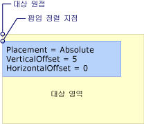  
Absolute 또는 AbsolutePoint 배치는  
  
 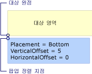  
배치는 아래쪽  
  
 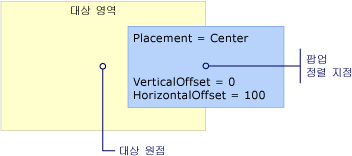  
배치는 센터  
  
 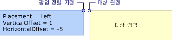  
배치는 왼쪽  
  
 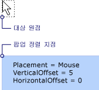  
배치는 마우스  
  
 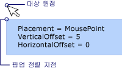  
MousePoint 배치 작업은  
  
   
Relative 또는 RelativePoint 배치는  
  
 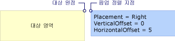  
배치는 오른쪽  
  
 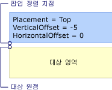  
배치는 위쪽  
  
   
## 팝업 화면 가장자리를 발견 하는 경우  
 보안상의 이유로 <xref:System.Windows.Controls.Primitives.Popup> 화면 가장자리에 의해 숨겨질 수 없습니다. 다음 세 가지 중 하나에 해당할 때는 <xref:System.Windows.Controls.Primitives.Popup> 화면 가장자리에서 발생 합니다.  
  
-   팝업을 모호 하 게 하는 화면 가장자리를 따라 이동 자체는 <xref:System.Windows.Controls.Primitives.Popup>합니다.  
  
-   팝업 다른 팝업 맞춤 지점을 사용 합니다.  
  
-   팝업이 다른 대상 원점 및 팝업 맞춤 지점을 사용 합니다.  
  
 이러한 옵션은 더 자세히 설명 나중에이 섹션에 있습니다.  
  
 동작은 <xref:System.Windows.Controls.Primitives.Popup> 화면 가장자리의 값에 따라 발견 한 경우는 <xref:System.Windows.Controls.Primitives.Popup.Placement%2A> 속성 및 화면 팝업에서 발생 하는 가장자리입니다. 다음 표에서 동작을 요약 때는 <xref:System.Windows.Controls.Primitives.Popup> 각 화면 가장자리를 만나는 <xref:System.Windows.Controls.Primitives.PlacementMode> 값입니다.  
  
|PlacementMode|위쪽 가장자리|아래쪽 가장자리|왼쪽된 가장자리|오른쪽 가장자리|  
|-------------------|--------------|-----------------|---------------|----------------|  
|<xref:System.Windows.Controls.Primitives.PlacementMode>|위쪽 가장자리에 맞춥니다.|아래쪽 가장자리에 맞춥니다.|왼쪽된 가장자리에 맞춥니다.|오른쪽 가장자리에 맞춥니다.|  
|<xref:System.Windows.Controls.Primitives.PlacementMode>|위쪽 가장자리에 맞춥니다.|팝업 맞춤 지점 왼쪽 아래 모퉁이로 변경의 <xref:System.Windows.Controls.Primitives.Popup>합니다.|왼쪽된 가장자리에 맞춥니다.|팝업 맞춤 지점 변경의 오른쪽 위 모서리는 <xref:System.Windows.Controls.Primitives.Popup>합니다.|  
|<xref:System.Windows.Controls.Primitives.PlacementMode>|위쪽 가장자리에 맞춥니다.|대상 원점 대상 영역의 왼쪽 위 모퉁이를 변경 하 고 팝업 맞춤 지점 왼쪽 아래 모퉁이로 변경의 <xref:System.Windows.Controls.Primitives.Popup>합니다.|왼쪽된 가장자리에 맞춥니다.|오른쪽 가장자리에 맞춥니다.|  
|<xref:System.Windows.Controls.Primitives.PlacementMode>|위쪽 가장자리에 맞춥니다.|아래쪽 가장자리에 맞춥니다.|왼쪽된 가장자리에 맞춥니다.|오른쪽 가장자리에 맞춥니다.|  
|<xref:System.Windows.Controls.Primitives.PlacementMode>|위쪽 가장자리에 맞춥니다.|아래쪽 가장자리에 맞춥니다.|대상 원점 대상 영역의 오른쪽 위 모퉁이를 변경 하 고 팝업 맞춤 지점 왼쪽 위 모퉁이로 변경의 <xref:System.Windows.Controls.Primitives.Popup>합니다.|오른쪽 가장자리에 맞춥니다.|  
|<xref:System.Windows.Controls.Primitives.PlacementMode>|위쪽 가장자리에 맞춥니다.|대상 원점 대상 영역 (마우스 포인터의 범위)의 왼쪽 위 모퉁이를 변경 하 고 팝업 맞춤 지점 왼쪽 아래 모퉁이로 변경의 <xref:System.Windows.Controls.Primitives.Popup>합니다.|왼쪽된 가장자리에 맞춥니다.|오른쪽 가장자리에 맞춥니다.|  
|<xref:System.Windows.Controls.Primitives.PlacementMode>|위쪽 가장자리에 맞춥니다.|팝업 맞춤 지점 왼쪽 아래 모퉁이로 변경의 <xref:System.Windows.Controls.Primitives.Popup>합니다.|왼쪽된 가장자리에 맞춥니다.|팝업 맞춤 지점의 팝업의 오른쪽 위 모퉁이에 바뀝니다.|  
|<xref:System.Windows.Controls.Primitives.PlacementMode>|위쪽 가장자리에 맞춥니다.|아래쪽 가장자리에 맞춥니다.|왼쪽된 가장자리에 맞춥니다.|오른쪽 가장자리에 맞춥니다.|  
|<xref:System.Windows.Controls.Primitives.PlacementMode>|위쪽 가장자리에 맞춥니다.|팝업 맞춤 지점 왼쪽 아래 모퉁이로 변경의 <xref:System.Windows.Controls.Primitives.Popup>합니다.|왼쪽된 가장자리에 맞춥니다.|팝업 맞춤 지점의 팝업의 오른쪽 위 모퉁이에 바뀝니다.|  
|<xref:System.Windows.Controls.Primitives.PlacementMode>|위쪽 가장자리에 맞춥니다.|아래쪽 가장자리에 맞춥니다.|왼쪽된 가장자리에 맞춥니다.|대상 원점 대상 영역의 왼쪽 위 모퉁이에 변경 되 고 팝업 맞춤 지점의 오른쪽 위 모서리에 변경 된 <xref:System.Windows.Controls.Primitives.Popup>합니다.|  
|<xref:System.Windows.Controls.Primitives.PlacementMode>|대상 원점이 대상 영역의 왼쪽 아래 모퉁이로 변경 하 고 팝업 맞춤 지점 변경의 왼쪽 위 모퉁이에 <xref:System.Windows.Controls.Primitives.Popup>합니다. 실제로이 경우와 동일 하 게는 <xref:System.Windows.Controls.Primitives.Popup.Placement%2A> 는 <xref:System.Windows.Controls.Primitives.PlacementMode>합니다.|아래쪽 가장자리에 맞춥니다.|왼쪽된 가장자리에 맞춥니다.|오른쪽 가장자리에 맞춥니다.|  
  
### 화면 가장자리에 맞춤  
 A <xref:System.Windows.Controls.Primitives.Popup> 맞출 수는 화면 가장자리에 따라서 자체의 위치를 변경 하 여 전체 <xref:System.Windows.Controls.Primitives.Popup> 화면에 표시 됩니다.  대상 원점 및 팝업 맞춤 지점 사이의 거리의 값에서과 다 수 일이 발생 하는 경우 <xref:System.Windows.Controls.Primitives.Popup.HorizontalOffset%2A> 및 <xref:System.Windows.Controls.Primitives.Popup.VerticalOffset%2A>합니다. 때 <xref:System.Windows.Controls.Primitives.Popup.Placement%2A> 는 <xref:System.Windows.Controls.Primitives.PlacementMode>, <xref:System.Windows.Controls.Primitives.PlacementMode>, 또는 <xref:System.Windows.Controls.Primitives.PlacementMode>, <xref:System.Windows.Controls.Primitives.Popup> 모든 화면 가장자리에 맞춰 정렬 합니다.  예를 들어 한 <xref:System.Windows.Controls.Primitives.Popup> 가 <xref:System.Windows.Controls.Primitives.Popup.Placement%2A> 로 설정 <xref:System.Windows.Controls.Primitives.PlacementMode> 및 <xref:System.Windows.Controls.Primitives.Popup.VerticalOffset%2A> 100으로 설정 합니다.  화면 아래쪽 가장자리의 전체 또는 일부를 숨기는 경우는 <xref:System.Windows.Controls.Primitives.Popup>, <xref:System.Windows.Controls.Primitives.Popup> 자체적 화면과 대상 원점 및 팝업 사이의 세로 거리의 아래쪽 가장자리 맞춤 지점이 100 미만입니다. 다음 그림을 보여 줍니다.  
  
 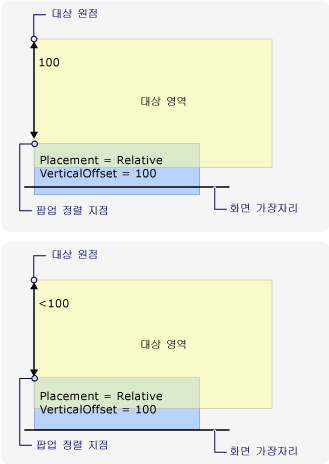  
화면 가장자리에 맞춰진 팝업  
  
### 팝업 맞춤 지점 변경  
 경우 <xref:System.Windows.Controls.Primitives.Popup.Placement%2A> 는 <xref:System.Windows.Controls.Primitives.PlacementMode>, <xref:System.Windows.Controls.Primitives.PlacementMode>, 또는 <xref:System.Windows.Controls.Primitives.PlacementMode>, 아래쪽 또는 오른쪽 화면 가장자리로 팝업 발견할 때 팝업 맞춤 지점 변경 합니다.  
  
 다음 그림 것을 보여 줍니다는 아래쪽 화면 가장자리로 전체 또는 일부의 경우는 <xref:System.Windows.Controls.Primitives.Popup>, 팝업 맞춤 지점은의 왼쪽 아래 모퉁이 <xref:System.Windows.Controls.Primitives.Popup>합니다.  
  
 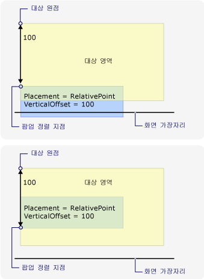  
화면 아래쪽 가장자리와 변경 하는 팝업 맞춤 지점  
  
 다음 그림을 보여 줍니다는 <xref:System.Windows.Controls.Primitives.Popup> 숨겨져 오른쪽 화면 가장자리로 팝업 맞춤 지점은의 오른쪽 위 모퉁이 <xref:System.Windows.Controls.Primitives.Popup>합니다.  
  
 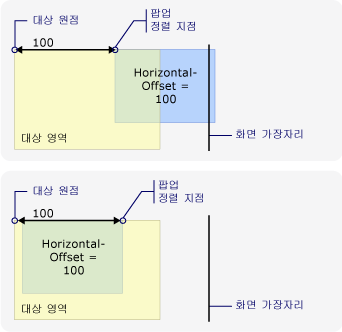  
화면의 오른쪽 가장자리와 변경 하는 팝업 맞춤 지점  
  
 경우는 <xref:System.Windows.Controls.Primitives.Popup> 아래쪽과 오른쪽 화면 가장자리 발견 팝업 맞춤 지점은의 오른쪽 아래 모퉁이 <xref:System.Windows.Controls.Primitives.Popup>합니다.  
  
### 대상 원점 및 팝업 맞춤 지점 변경  
 때 <xref:System.Windows.Controls.Primitives.Popup.Placement%2A> 는 <xref:System.Windows.Controls.Primitives.PlacementMode>, <xref:System.Windows.Controls.Primitives.PlacementMode>, <xref:System.Windows.Controls.Primitives.PlacementMode>, <xref:System.Windows.Controls.Primitives.PlacementMode>, 또는 <xref:System.Windows.Controls.Primitives.PlacementMode>, 특정 화면 가장자리가 발견 되 면 대상 원점 및 팝업 맞춤 지점이 변경 합니다.  위치 변경을 발생 하는 화면 가장자리에 따라 달라 집니다는 <xref:System.Windows.Controls.Primitives.PlacementMode> 값입니다.  
  
 다음 그림에서는 해당 <xref:System.Windows.Controls.Primitives.Popup.Placement%2A> 는 <xref:System.Windows.Controls.Primitives.PlacementMode> 및 <xref:System.Windows.Controls.Primitives.Popup> 아래쪽 화면 가장자리로 발견 대상 원본이 대상 영역의 왼쪽 위 모퉁이 팝업 맞춤 지점은의 왼쪽 아래 모퉁이 <xref:System.Windows.Controls.Primitives.Popup>.  
  
 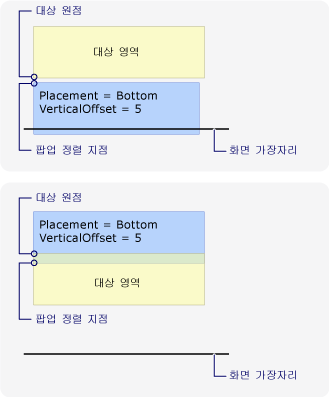  
배치는 아래쪽의 팝업 화면 아래쪽 가장자리를 발견 한  
  
 다음 그림을 보여 줍니다 <xref:System.Windows.Controls.Primitives.Popup.Placement%2A> 는 <xref:System.Windows.Controls.Primitives.PlacementMode> 및 <xref:System.Windows.Controls.Primitives.Popup> 화면 왼쪽된 가장자리와 만나는 대상 원점이 대상 영역의 오른쪽 위 모퉁이 이며 팝업 맞춤 지점의 왼쪽 위 모서리는 <xref:System.Windows.Controls.Primitives.Popup>합니다.  
  
 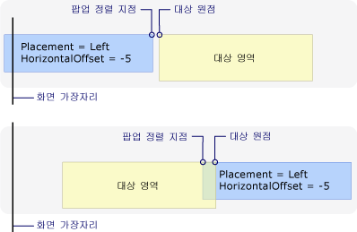  
배치는 왼쪽이 고 팝업에서 화면 왼쪽된 가장자리  
  
 다음 그림을 보여 줍니다 <xref:System.Windows.Controls.Primitives.Popup.Placement%2A> 는 <xref:System.Windows.Controls.Primitives.PlacementMode> 및 <xref:System.Windows.Controls.Primitives.Popup> 오른쪽 화면 가장자리로 발견 대상 원점이 대상 영역의 왼쪽 위 모퉁이 이며 팝업 맞춤 지점의 오른쪽 위 모서리는 <xref:System.Windows.Controls.Primitives.Popup>합니다.  
  
 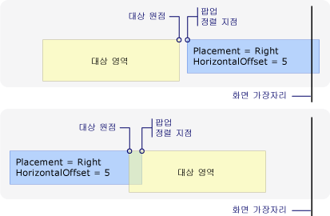  
배치는 오른쪽이 고 팝업 화면 오른쪽 가장자리에서  
  
 다음 그림에서는 해당 <xref:System.Windows.Controls.Primitives.Popup.Placement%2A> 는 <xref:System.Windows.Controls.Primitives.PlacementMode> 및 <xref:System.Windows.Controls.Primitives.Popup> 위쪽 화면 가장자리로 발견 대상 원본이 대상 영역의 맨 아래 왼쪽 모서리 및 팝업 맞춤 지점은의 왼쪽 위 모퉁이 <xref:System.Windows.Controls.Primitives.Popup>합니다.  
  
 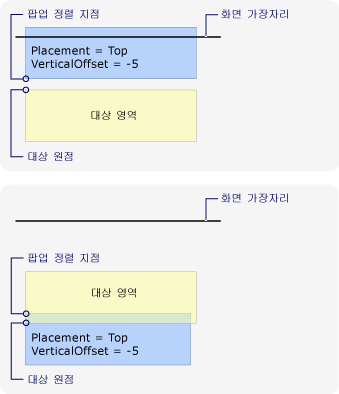  
배치는 위쪽 팝업 화면 위쪽 가장자리를 발견 한  
  
 다음 그림을 보여 줍니다 <xref:System.Windows.Controls.Primitives.Popup.Placement%2A> 는 <xref:System.Windows.Controls.Primitives.PlacementMode> 및 <xref:System.Windows.Controls.Primitives.Popup> 화면 아래쪽 가장자리와 만나는 대상 원점이 대상 영역 (마우스 포인터의 범위)의 왼쪽 맨 위 이며 팝업 맞춤 지점의 왼쪽 아래 모서리는 <xref:System.Windows.Controls.Primitives.Popup>합니다.  
  
   
배치는 마우스 팝업 화면 아래쪽 가장자리를 발견 한  
  
### 사용자 지정 팝업 배치  
 대상 원점 및 팝업 맞춤 지점 설정 하 여 사용자 지정할 수는 <xref:System.Windows.Controls.Primitives.Popup.Placement%2A> 속성을 <xref:System.Windows.Controls.Primitives.PlacementMode>합니다. 그런 다음 정의 <xref:System.Windows.Controls.Primitives.CustomPopupPlacementCallback> 대리자에 대 한 가능한 배치 지점과 기본 축 (기본 설정의 순서로)의 집합을 반환 하는 <xref:System.Windows.Controls.Primitives.Popup>합니다. 가장 큰 부분을 표시 하는 지점이 고 <xref:System.Windows.Controls.Primitives.Popup> 을 선택 합니다.  위치는 <xref:System.Windows.Controls.Primitives.Popup> 자동으로 조정 하는 경우는 <xref:System.Windows.Controls.Primitives.Popup> 화면 가장자리에 의해 숨겨집니다. 예를 들어 참조 [사용자 지정 팝업 위치 지정](../../../../docs/framework/wpf/controls/how-to-specify-a-custom-popup-position.md)합니다.  
  
## 참고 항목  
 [팝업 배치 샘플](http://go.microsoft.com/fwlink/?LinkID=160032)