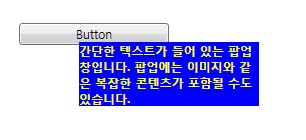

# Popup
<xref:System.Windows.Controls.Primitives.Popup> 컨트롤 현재 응용 프로그램 창 위에 배치 되는 별도 창에서 콘텐츠를 표시 합니다.  
  
 다음 그림에서는 한 <xref:System.Windows.Controls.Primitives.Popup> 제어와 관련 하 여 배치 되는 <xref:System.Windows.Controls.Button> 즉 부모입니다.  
  
   
  
## 섹션 내용  
 [팝업 개요](../../../../docs/framework/wpf/controls/popup-overview.md)  
 [팝업 배치 동작](../../../../docs/framework/wpf/controls/popup-placement-behavior.md)  
 [방법 항목](../../../../docs/framework/wpf/controls/popup-how-to-topics.md)  
  
## 참조  
 <xref:System.Windows.Controls.Primitives.Popup>  
  
## 관련 단원
