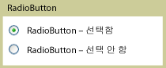

# RadioButton
<xref:System.Windows.Controls.RadioButton> 컨트롤은 일반적으로 함께 그룹화되어 여러 옵션 중 하나를 선택할 수 있는 형식으로 제공됩니다. 말하자면 한 번에 하나의 단추만 선택할 수 있는 것입니다.  
  
 다음 그림에서는 <xref:System.Windows.Controls.RadioButton> 컨트롤의 예제를 보여 줍니다.  
  
   
일반적인 RadioButton  
  
## 참조  
 <xref:System.Windows.Controls.Primitives.ToggleButton>  
  
## 관련 단원