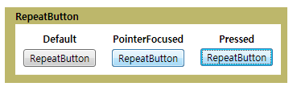

# RepeatButtonRepeatButton
<xref:System.Windows.Controls.Primitives.RepeatButton> 는 비슷합니다는 <xref:System.Windows.Controls.Button>합니다.The <xref:System.Windows.Controls.Primitives.RepeatButton> is similar to a <xref:System.Windows.Controls.Button>. 그러나 <xref:System.Windows.Controls.Primitives.RepeatButton> 요소 제어할 수 있습니다 시기 및 방법을 <xref:System.Windows.Controls.Primitives.ButtonBase.Click> 이벤트가 발생 합니다.However, <xref:System.Windows.Controls.Primitives.RepeatButton> elements give you control over when and how the <xref:System.Windows.Controls.Primitives.ButtonBase.Click> event occurs.  
  
 다음 그림에는 반복 단추 컨트롤, 기본값, PointerFocused, 및-Pressed의 세 가지 상태의 예가 나와 있습니다.The following graphic shows an example of the three states of a repeat button control, Default, PointerFocused, and Pressed. 기본 상태를 표시 하는 첫 번째 단추는 <xref:System.Windows.Controls.Primitives.RepeatButton>합니다.The first button shows the default state of the <xref:System.Windows.Controls.Primitives.RepeatButton>. 두 번째 포커스를 받으면 마우스 포인터를 단추 위로 가져갈 때 단추의 모양을 변경 하는 방법을 보여 줍니다.The second shows how the appearance of the button changes when the mouse pointer hovers over the button, giving it focus. 마지막 단추의 모양을 표시는 <xref:System.Windows.Controls.Primitives.RepeatButton> 컨트롤 위에 마우스 단추를 누를 때.The last button shows the appearance of the <xref:System.Windows.Controls.Primitives.RepeatButton> when the user presses the mouse button over the control.  
  
   
일반적인 RepeatButtonTypical RepeatButton  
  
## 단원 내용In This Section  
  
## 참조Reference  
 <xref:System.Windows.Controls.Primitives.RepeatButton>  
  
## 관련 단원Related Sections
