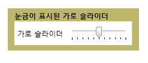

# Slider
<xref:System.Windows.Controls.Slider>를 사용하면 <xref:System.Windows.Controls.Primitives.Thumb>을 <xref:System.Windows.Controls.Primitives.Track>을 따라 이동하여 값 범위에서 선택할 수 있습니다.  
  
 다음 그림에서는 가로 <xref:System.Windows.Controls.Slider> 컨트롤의 예제를 보여 줍니다.  
  
   
  
## 단원 내용  
 [슬라이더의 틱 사용자 지정](../../../../docs/framework/wpf/controls/how-to-customize-the-ticks-on-a-slider.md)  
  
## 참조  
 <xref:System.Windows.Controls.Slider>  
 <xref:System.Windows.Controls.Primitives.Track>  
 <xref:System.Windows.Controls.Primitives.Thumb>