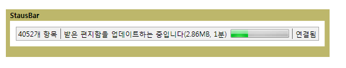

# StatusBarStatusBar
A <xref:System.Windows.Controls.Primitives.StatusBar> 응용 프로그램 상태 정보를 표시할 수 있는 창 맨 아래에 수평 영역입니다.A <xref:System.Windows.Controls.Primitives.StatusBar> is a horizontal area at the bottom of a window where an application can display status information.  
  
 다음 그림의 예가 나와 <xref:System.Windows.Controls.Primitives.StatusBar>합니다.The following illustration shows an example of a <xref:System.Windows.Controls.Primitives.StatusBar>.  
  
   
  
## 섹션 내용In This Section  
  
## 참조Reference  
 <xref:System.Windows.Controls.Primitives.StatusBar>  
  <xref:System.Windows.Controls.Primitives.StatusBarItem>  
  
## 관련 단원Related Sections
