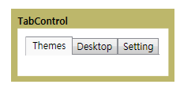

# TabControl
<xref:System.Windows.Controls.TabControl> 요소에서 해당 탭을 선택 하 여 개별 페이지의 콘텐츠를 표시 합니다. 각 탭에는 <xref:System.Windows.Controls.TabItem>합니다.  
  
 다음 그림에서는 한 <xref:System.Windows.Controls.TabControl>합니다.  
  
   
일반적인 TabControl  
  
## 참조  
 <xref:System.Windows.Controls.TabControl>  
  <xref:System.Windows.Controls.TabItem>  
  
## 관련 단원
