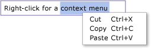

# TextBox 개요TextBox Overview
<xref:System.Windows.Controls.TextBox> 클래스 표시 하거나 서식 없는 텍스트를 편집할 수 있습니다.The <xref:System.Windows.Controls.TextBox> class enables you to display or edit unformatted text. 일반적인 용도 <xref:System.Windows.Controls.TextBox> 형태로 서식 없는 텍스트를 편집 합니다.A common use of a <xref:System.Windows.Controls.TextBox> is editing unformatted text in a form. 예를 들어 사용자의 이름, 전화 번호에 대 한 요청 양식 등 사용 <xref:System.Windows.Controls.TextBox> 텍스트 입력에 대 한 제어 합니다.For example, a form asking for the user's name, phone number, etc would use <xref:System.Windows.Controls.TextBox> controls for text input. 이 항목에서는 소개는 <xref:System.Windows.Controls.TextBox> 모두에서 사용 하는 방법의 예제를 제공 하 고 클래스 [!INCLUDE[TLA#tla_xaml](../../../../includes/tlasharptla-xaml-md.md)] 및 C#입니다.This topic introduces the <xref:System.Windows.Controls.TextBox> class and provides examples of how to use it in both [!INCLUDE[TLA#tla_xaml](../../../../includes/tlasharptla-xaml-md.md)] and C#.  
  
 
  
   
## TextBox 또는 RichTextBox?TextBox or RichTextBox?  
 둘 다 <xref:System.Windows.Controls.TextBox> 및 <xref:System.Windows.Controls.RichTextBox> 사용자가을 입력 텍스트를 허용 하지만 두 개의 서로 다른 시나리오에 사용 됩니다.Both <xref:System.Windows.Controls.TextBox> and <xref:System.Windows.Controls.RichTextBox> allow users to input text but the two controls are used for different scenarios. A <xref:System.Windows.Controls.TextBox> 적은 시스템 리소스를 필요 없으면 <xref:System.Windows.Controls.RichTextBox> 없으므로 이상적인 경우에 일반 텍스트를 편집 해야 합니다. (예: 폼에 사용).A <xref:System.Windows.Controls.TextBox> requires less system resources then a <xref:System.Windows.Controls.RichTextBox> so it is ideal when only plain text needs to be edited (i.e., usage in a form). A <xref:System.Windows.Controls.RichTextBox> 하는 것이 서식 있는 텍스트, 이미지, 테이블을 편집 하려면 사용자에 대 한 필요한 또는 기타 지원 되는 경우 콘텐츠입니다.A <xref:System.Windows.Controls.RichTextBox> is a better choice when it is necessary for the user to edit formatted text, images, tables, or other supported content. 예를 들어, 문서, 문서 또는 서식, 필요한 블로그 편집 이미지, 등을 사용 하 여 훌륭하게 수행할는 <xref:System.Windows.Controls.RichTextBox>합니다.For example, editing a document, article, or blog that requires formatting, images, etc is best accomplished using a <xref:System.Windows.Controls.RichTextBox>. 아래 테이블의 기본 기능을 요약 <xref:System.Windows.Controls.TextBox> 및 <xref:System.Windows.Controls.TextBox>합니다.The table below summarizes the primary features of <xref:System.Windows.Controls.TextBox> and <xref:System.Windows.Controls.TextBox>.  
  
|ControlControl|실시간 맞춤법 검사Real-time Spellchecking|상황에 맞는 메뉴Context Menu|서식 명령 처럼 <xref:System.Windows.Documents.EditingCommands.ToggleBold%2A> (Ctr + B)Formatting commands like <xref:System.Windows.Documents.EditingCommands.ToggleBold%2A> (Ctr+B)|<xref:System.Windows.Documents.FlowDocument> 이미지, 단락, 테이블 등과 같은 콘텐츠입니다.<xref:System.Windows.Documents.FlowDocument> content like images, paragraphs, tables, etc.|  
|-------------|------------------------------|------------------|------------------------------------------------------------------------------------------------------------------------------------------------------------------------------------------------------|--------------------------------------------------------------------------------------------------------------------------------------------------------------------------------------------------|  
|<xref:System.Windows.Controls.TextBox>|예Yes|예Yes|아니요No|아니요.No.|  
|<xref:System.Windows.Controls.RichTextBox>|예Yes|예Yes|예([RichTextBox 개요](../../../../docs/framework/wpf/controls/richtextbox-overview.md) 참조)Yes (see [RichTextBox Overview](../../../../docs/framework/wpf/controls/richtextbox-overview.md))|예([RichTextBox 개요](../../../../docs/framework/wpf/controls/richtextbox-overview.md) 참조)Yes (see [RichTextBox Overview](../../../../docs/framework/wpf/controls/richtextbox-overview.md))|  
  
> [!NOTE]
>  하지만 <xref:System.Windows.Controls.TextBox> 와 같은 명령 서식 관련 편집을 지원 하지 않습니다 <xref:System.Windows.Documents.EditingCommands.ToggleBold%2A> (Ctr + B)와 같은 많은 기본 명령은 두 컨트롤 모두에서 지원 됩니다 <xref:System.Windows.Documents.EditingCommands.MoveToLineEnd%2A>합니다.Although <xref:System.Windows.Controls.TextBox> does not support formatting related editing commands like <xref:System.Windows.Documents.EditingCommands.ToggleBold%2A> (Ctr+B), many basic commands are supported by both controls such as <xref:System.Windows.Documents.EditingCommands.MoveToLineEnd%2A>. 자세한 내용은 <xref:System.Windows.Documents.EditingCommands>를 참조하세요.See <xref:System.Windows.Documents.EditingCommands> for more information.  
  
 지 원하는 기능 <xref:System.Windows.Controls.TextBox> 아래 섹션에 설명 되어 있습니다.Features supported by <xref:System.Windows.Controls.TextBox> are covered in the sections below. 에 대 한 자세한 내용은 <xref:System.Windows.Controls.RichTextBox>, 참조 [RichTextBox 개요](../../../../docs/framework/wpf/controls/richtextbox-overview.md)합니다.For more information about <xref:System.Windows.Controls.RichTextBox>, see [RichTextBox Overview](../../../../docs/framework/wpf/controls/richtextbox-overview.md).  
  
### 실시간 맞춤법 검사Real-time Spellchecking  
 실시간 맞춤법 검사를 사용 하도록 설정할 수는 <xref:System.Windows.Controls.TextBox> 또는 <xref:System.Windows.Controls.RichTextBox>합니다.You can enable real-time spellchecking in a <xref:System.Windows.Controls.TextBox> or <xref:System.Windows.Controls.RichTextBox>. 맞춤법 검사 기능이 켜져 있으면 맞춤법이 틀린 단어 밑에 빨간색 선이 나타납니다(아래 그림 참조).When spellchecking is turned on, a red line appears underneath any misspelled words (see picture below).  
  
   
  
 맞춤법 검사를 사용하도록 설정하는 방법에 대한 자세한 내용은 [텍스트 편집 컨트롤에서 맞춤법 검사 사용](../../../../docs/framework/wpf/controls/how-to-enable-spell-checking-in-a-text-editing-control.md)을 참조하세요.See [Enable Spell Checking in a Text Editing Control](../../../../docs/framework/wpf/controls/how-to-enable-spell-checking-in-a-text-editing-control.md) to learn how to enable spellchecking.  
  
### 상황에 맞는 메뉴Context Menu  
 기본적으로 둘 다 <xref:System.Windows.Controls.TextBox> 및 <xref:System.Windows.Controls.RichTextBox> 컨트롤 내부에 단추로 클릭할 때 표시 되는 상황에 맞는 메뉴를 가질 수 있습니다.By default, both <xref:System.Windows.Controls.TextBox> and <xref:System.Windows.Controls.RichTextBox> have a context menu that appears when a user right-clicks inside the control. 상황에 맞는 메뉴를 통해 사용자는 항목을 잘라내거나, 복사하거나, 붙여넣을 수 있습니다(아래 그림 참조).The context menu allows the user to cut, copy, or paste (see picture below).  
  
   
  
 자체적인 사용자 지정 상황에 맞는 메뉴를 만들어 기본 동작을 재정의할 수 있습니다.You can create your own custom context menu to override the default behavior. 자세한 내용은 [TextBox에 사용자 지정 컨텍스트 메뉴 사용](../../../../docs/framework/wpf/controls/how-to-use-a-custom-context-menu-with-a-textbox.md)을 참조하세요.See [Use a Custom Context Menu with a TextBox](../../../../docs/framework/wpf/controls/how-to-use-a-custom-context-menu-with-a-textbox.md) for more information.  
  
   
## TextBox 만들기Creating TextBoxes  
 A <xref:System.Windows.Controls.TextBox> 여러 줄으로 구성 하거나 높이에서 한 줄 수 있습니다.A <xref:System.Windows.Controls.TextBox> can be a single line in height or comprise multiple lines. 한 줄 <xref:System.Windows.Controls.TextBox> 가장 적합 한 작은 양의 일반 텍스트 (즉, 입력하는 데 가장 적합합니다.A single line <xref:System.Windows.Controls.TextBox> is best for inputting small amounts of plain text (i.e. "Name", "Phone Number", etc. in a form). 다음 예제에는 한 줄을 만드는 방법을 보여 줍니다 <xref:System.Windows.Controls.TextBox>합니다.The following example shows how to create a single line <xref:System.Windows.Controls.TextBox>.  
  
 [!code-xaml[TextBoxMiscSnippets_snip#BasicTextBoxExampleWholePage](../../../../samples/snippets/csharp/VS_Snippets_Wpf/TextBoxMiscSnippets_snip/csharp/basictextboxexample.xaml#basictextboxexamplewholepage)]  
  
 만들 수도 있습니다는 <xref:System.Windows.Controls.TextBox> 사용자를 여러 줄의 텍스트를 입력할 수 있도록 합니다.You can also create a <xref:System.Windows.Controls.TextBox> that allows the user to enter multiple lines of text. 예를 들어 폼 약력 사용자의 요청 되 면는 사용 하려는 <xref:System.Windows.Controls.TextBox> 지 원하는 여러 줄의 텍스트입니다.For example, if your form asked for a biographical sketch of the user, you would want to use a <xref:System.Windows.Controls.TextBox> that supports multiple lines of text. 다음 예제에서는 사용 하는 방법을 보여 줍니다. [!INCLUDE[TLA#tla_xaml](../../../../includes/tlasharptla-xaml-md.md)] 정의 하는 <xref:System.Windows.Controls.TextBox> 컨트롤이 여러 줄의 텍스트를 수용 하기 위해 자동으로 확장 합니다.The following example shows how to use [!INCLUDE[TLA#tla_xaml](../../../../includes/tlasharptla-xaml-md.md)] to define a <xref:System.Windows.Controls.TextBox> control that automatically expands to accommodate multiple lines of text.  
  
 [!code-xaml[TextBox_MiscCode#_MultilineTextBoxXAML](../../../../samples/snippets/csharp/VS_Snippets_Wpf/TextBox_MiscCode/CSharp/Window1.xaml#_multilinetextboxxaml)]  
  
 설정의 <xref:System.Windows.Controls.TextBox.TextWrapping%2A> 특성을 `Wrap` 새 텍스트가 때 줄의 가장자리는 <xref:System.Windows.Controls.TextBox> 컨트롤은에 도달 하면 자동으로 확장 되는 <xref:System.Windows.Controls.TextBox> 필요 하면 새 줄을 위한 공간을 포함 하는 컨트롤입니다.Setting the <xref:System.Windows.Controls.TextBox.TextWrapping%2A> attribute to `Wrap` causes text to wrap to a new line when the edge of the <xref:System.Windows.Controls.TextBox> control is reached, automatically expanding the <xref:System.Windows.Controls.TextBox> control to include room for a new line, if necessary.  
  
 설정의 <xref:System.Windows.Controls.Primitives.TextBoxBase.AcceptsReturn%2A> 특성을 `true` 다시 한 번 자동으로 확장 되 RETURN 키를 누를 때 삽입할 새 줄의 <xref:System.Windows.Controls.TextBox> 필요 하면 새 줄을 위한 공간을 포함 합니다.Setting the <xref:System.Windows.Controls.Primitives.TextBoxBase.AcceptsReturn%2A> attribute to `true` causes a new line to be inserted when the RETURN key is pressed, once again automatically expanding the <xref:System.Windows.Controls.TextBox> to include room for a new line, if necessary.  
  
 <xref:System.Windows.Controls.Primitives.TextBoxBase.VerticalScrollBarVisibility%2A> 스크롤 막대를 추가 하는 특성은 <xref:System.Windows.Controls.TextBox>되도록의 내용을 <xref:System.Windows.Controls.TextBox> if 스크롤할 수는 <xref:System.Windows.Controls.TextBox> 프레임 또는 포함 하는 창의 크기를 넘어 확장 합니다.The <xref:System.Windows.Controls.Primitives.TextBoxBase.VerticalScrollBarVisibility%2A> attribute adds a scroll bar to the <xref:System.Windows.Controls.TextBox>, so that the contents of the <xref:System.Windows.Controls.TextBox> can be scrolled through if the <xref:System.Windows.Controls.TextBox> expands beyond the size of the frame or window that encloses it.  
  
 사용과 관련 된 서로 다른 작업에 대 한 자세한 내용은 <xref:System.Windows.Controls.TextBox>, 참조 [방법 도움말 항목](../../../../docs/framework/wpf/controls/textbox-how-to-topics.md)합니다.For more information on different tasks associated with using a <xref:System.Windows.Controls.TextBox>, see [How-to Topics](../../../../docs/framework/wpf/controls/textbox-how-to-topics.md).  
  
   
## 콘텐츠가 변경되는 시점 감지Detect When Content Changes  
 일반적으로 <xref:System.Windows.Controls.Primitives.TextBoxBase.TextChanged> 이벤트 감지 하는 데 사용 해야의 텍스트는 <xref:System.Windows.Controls.TextBox> 또는 <xref:System.Windows.Controls.RichTextBox> 변경 아니라 <xref:System.Windows.UIElement.KeyDown> 예상 대로 합니다.Usually the <xref:System.Windows.Controls.Primitives.TextBoxBase.TextChanged> event should be used to detect whenever the text in a <xref:System.Windows.Controls.TextBox> or <xref:System.Windows.Controls.RichTextBox> changes, rather then <xref:System.Windows.UIElement.KeyDown> as you might expect. 예제를 보려면 [TextBox에서 텍스트가 변경되는 시점 감지](../../../../docs/framework/wpf/controls/how-to-detect-when-text-in-a-textbox-has-changed.md)를 참조하세요.See [Detect When Text in a TextBox Has Changed](../../../../docs/framework/wpf/controls/how-to-detect-when-text-in-a-textbox-has-changed.md) for an example.  
  
## 참고 항목See Also  
 [방법 항목How-to Topics](../../../../docs/framework/wpf/controls/textbox-how-to-topics.md)  
 [RichTextBox 개요RichTextBox Overview](../../../../docs/framework/wpf/controls/richtextbox-overview.md)
