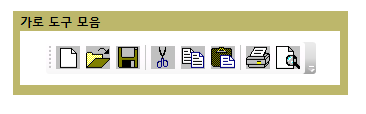
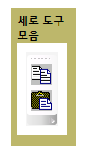

# ToolBarToolBar
<xref:System.Windows.Controls.ToolBar> 컨트롤은 명령 또는 해당 함수에서 일반적으로 관련 된 컨트롤의 그룹에 대 한 컨테이너입니다.The <xref:System.Windows.Controls.ToolBar> control is a container for a group of commands or controls that are typically related in their function.  
  
 다음 그림에서는 가로 및 세로 보여 <xref:System.Windows.Controls.ToolBar> 컨트롤입니다.The following illustrations show horizontal and vertical <xref:System.Windows.Controls.ToolBar> controls.  
  
   
가로 도구 모음Horizontal Toolbar  
  
   
세로 도구 모음Vertical Toolbar  
  
## 섹션 내용In This Section  
 [도구 모음 개요ToolBar Overview](../../../../docs/framework/wpf/controls/toolbar-overview.md)  
  [ToolBar 컨트롤의 스타일 지정Style Controls on a ToolBar](../../../../docs/framework/wpf/controls/how-to-style-controls-on-a-toolbar.md)  
  
## 참조Reference  
 <xref:System.Windows.Controls.ToolBar>  
  <xref:System.Windows.Controls.ToolBarTray>  
  
## 관련 단원Related Sections
