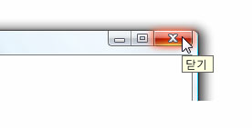

# 도구 설명ToolTip
도구 설명 같은 요소를 위로 마우스 포인터를 놓을 때 표시 되는 작은 팝업 창인은는 <xref:System.Windows.Controls.Button>합니다.A tooltip is a small pop-up window that appears when a user pauses the mouse pointer over an element, such as over a <xref:System.Windows.Controls.Button>.  
  
 다음 그림과 가리키는 마우스 포인터는 **닫기**<xref:System.Windows.Controls.Button>, 그러면 해당 식별 표시 <xref:System.Windows.Controls.ToolTip>합니다.The following illustration shows a mouse pointer that points to the **Close**<xref:System.Windows.Controls.Button>, which then displays its identifying <xref:System.Windows.Controls.ToolTip>.  
  
 도구 설명이 표시 된 닫기 단추Close button with its tooltip displayed  
  
   
  
## 단원 내용In This Section  
 [도구 설명 개요ToolTip Overview](../../../../docs/framework/wpf/controls/tooltip-overview.md)  
  [방법 항목How-to Topics](../../../../docs/framework/wpf/controls/tooltip-how-to-topics.md)  
  
## 참조Reference  
 <xref:System.Windows.Controls.ToolTip>  
  <xref:System.Windows.Controls.ToolTipService>  
  <xref:System.Windows.Controls.Primitives.Popup>  
  
## 관련 단원Related Sections  
 [팝업 개요Popup Overview](../../../../docs/framework/wpf/controls/popup-overview.md)  
  [방법 항목How-to Topics](../../../../docs/framework/wpf/controls/popup-how-to-topics.md)
