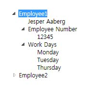

# TreeViewTreeView
<xref:System.Windows.Controls.TreeView> 컨트롤 계층 구조에서 축소 가능한 노드를 사용 하 여 정보를 표시 합니다.The <xref:System.Windows.Controls.TreeView> control displays information in a hierarchical structure by using collapsible nodes.  
  
 다음 그림은의 예는 <xref:System.Windows.Controls.TreeView> 에 중첩 된 컨트롤 <xref:System.Windows.Controls.TreeViewItem> 컨트롤입니다.The following illustration is an example of a <xref:System.Windows.Controls.TreeView> control that has nested <xref:System.Windows.Controls.TreeViewItem> controls.  
  
   
  
## 섹션 내용In This Section  
 [TreeView 개요TreeView Overview](../../../../docs/framework/wpf/controls/treeview-overview.md)  
 [방법 항목How-to Topics](../../../../docs/framework/wpf/controls/treeview-how-to-topics.md)  
  
## 참조Reference  
 <xref:System.Windows.Controls.TreeView>  
  <xref:System.Windows.Controls.TreeViewItem>  
  
## 관련 단원Related Sections  
 [데이터 바인딩 개요Data Binding Overview](../../../../docs/framework/wpf/data/data-binding-overview.md)  
  [데이터 템플릿 개요Data Templating Overview](../../../../docs/framework/wpf/data/data-templating-overview.md)
