# 연습: Microsoft Expression Blend를 사용하여 단추 만들기
이 연습에서는 Microsoft Expression Blend를 사용하여 [!INCLUDE[TLA2#tla_wpf](../../../../includes/tla2sharptla-wpf-md.md)] 사용자 지정 단추를 만드는 과정을 단계별로 설명합니다.  
  
> [!IMPORTANT]
>  Microsoft Expression Blend는 실행 프로그램을 만들기 위해 컴파일되는 [!INCLUDE[TLA#tla_xaml](../../../../includes/tlasharptla-xaml-md.md)]을 생성하여 작동합니다.  직접 [!INCLUDE[TLA#tla_xaml](../../../../includes/tlasharptla-xaml-md.md)]을 사용하려는 경우에는 Blend 대신 [!INCLUDE[vs_current_short](../../../../includes/vs-current-short-md.md)]에서 [!INCLUDE[TLA#tla_xaml](../../../../includes/tlasharptla-xaml-md.md)]을 사용하여 동일한 응용 프로그램을 만드는 다른 연습을 진행할 수 있습니다.  자세한 내용은 [XAML을 사용하여 단추 만들기](../../../../docs/framework/wpf/controls/walkthrough-create-a-button-by-using-xaml.md)를 참조하십시오.  
  
 다음 그림에서는 사용자가 만들 사용자 지정 단추를 보여 줍니다.  
  
   
  
## 모양을 단추로 변환  
 이 연습의 첫 번째 부분에서는 사용자 지정 단추의 사용자 지정 모양을 만듭니다.  이렇게 하려면 먼저 사각형을 단추로 변환합니다.  그런 다음 단추 템플릿에 다른 모양을 추가하여 보다 복잡한 단추를 만듭니다.  처음부터 일반 단추를 사용하여 사용자 지정하지 않는 이유는  단추에는 사용자가 필요로 하지 않는 기본 제공 기능이 포함되어 있기 때문이며 사각형을 사용하여 시작하는 것이 더 쉽습니다.  
  
#### Expression Blend에서 새 프로젝트를 만들려면  
  
1.  Expression Blend를 시작합니다.  **시작**을 클릭하고 **모든 프로그램**, **Microsoft Expression**을 차례로 가리킨 다음 **Microsoft Expression Blend**를 클릭하여 Expression Blend를 시작합니다.  
  
2.  필요한 경우 응용 프로그램을 최대화합니다.  
  
3.  **파일** 메뉴에서 **새 프로젝트**를 클릭합니다.  
  
4.  **표준 응용 프로그램\(.exe\)**을 선택합니다.  
  
5.  프로젝트 이름을 `CustomButton`으로 지정하고 **확인**을 누릅니다.  
  
 그러면 빈 [!INCLUDE[TLA2#tla_wpf](../../../../includes/tla2sharptla-wpf-md.md)] 프로젝트가 표시됩니다.  F5 키를 눌러 응용 프로그램을 실행합니다.  예상대로 응용 프로그램이 빈 창으로만 구성됩니다.  다음으로 모퉁이가 둥근 사각형을 만들어 단추로 변환합니다.  
  
#### 사각형을 단추로 변환하려면  
  
1.  **창 배경 속성을 검정으로 설정.** 창을 선택하고 **속성** 탭을 클릭한 다음 <xref:System.Windows.Controls.Control.Background%2A> 속성을 `Black`으로 설정합니다.  
  
     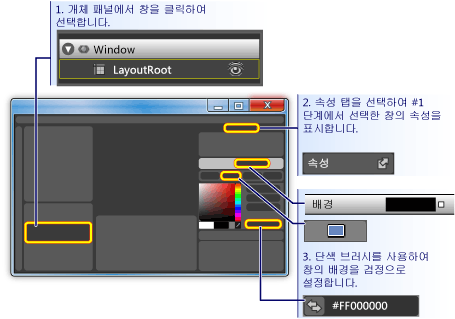  
  
2.  **창에서 단추 크기에 가깝게 사각형 그리기.** 왼쪽 도구 패널에서 사각형 도구를 선택하고 사각형을 창으로 끌어 옵니다.  
  
     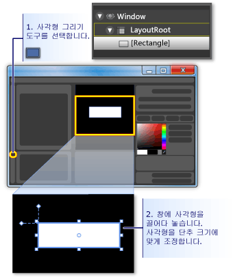  
  
3.  **사각형의 모퉁이를 둥글게 만들기.** 사각형의 제어점을 끌거나 <xref:System.Windows.Shapes.Rectangle.RadiusX%2A> 및 <xref:System.Windows.Shapes.Rectangle.RadiusY%2A> 속성을 직접 설정합니다.  <xref:System.Windows.Shapes.Rectangle.RadiusX%2A> 및 <xref:System.Windows.Shapes.Rectangle.RadiusY%2A>의 값을 20으로 설정합니다.  
  
     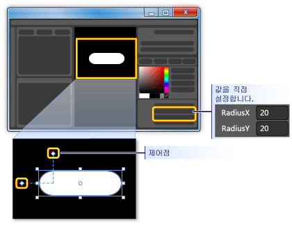  
  
4.  **사각형을 단추로 변경.** 사각형을 선택합니다.  **도구** 메뉴에서 **단추 만들기**를 클릭합니다.  
  
     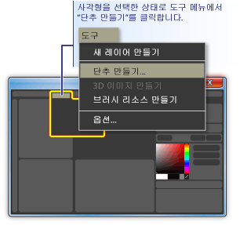  
  
5.  **스타일\/템플릿의 범위 지정.** 다음과 같은 대화 상자가 나타납니다.  
  
     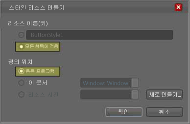  
  
     **리소스 이름\(키\)**에 대해 **모든 항목에 적용**을 선택합니다.  그러면 결과 스타일 및 단추 템플릿이 모든 단추 개체에 적용됩니다.  **정의 위치**에 대해 **응용 프로그램**을 선택합니다.  그러면 결과 스타일 및 단추 템플릿의 범위가 전체 응용 프로그램이 됩니다.  이러한 두 상자에 값을 설정하면 단추 스타일 및 템플릿이 전체 응용 프로그램 내에 있는 모든 단추에 적용되고 응용 프로그램에서 만드는 모든 단추는 기본적으로 이 템플릿을 사용하게 됩니다.  
  
## 단추 템플릿 편집  
 이제 단추로 변경된 사각형이 만들어졌습니다.  이 단원에서는 단추의 템플릿을 수정하고 모양을 추가적으로 사용자 지정합니다.  
  
#### 단추 템플릿을 편집하여 단추 모양을 변경하려면  
  
1.  **템플릿 편집 뷰로 이동.** 단추의 모양을 추가적으로 사용자 지정하려면 단추 템플릿을 편집해야 합니다.  이 템플릿은 사각형을 단추로 변환할 때 만들었습니다.  단추 템플릿을 편집하려면 단추를 마우스 오른쪽 단추로 클릭하고 **컨트롤 구성 요소\(템플릿\) 편집**을 선택한 다음 **템플릿 편집**을 클릭합니다.  
  
     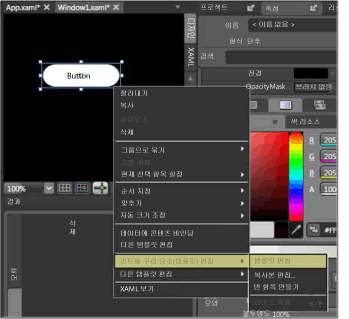  
  
     템플릿 편집기에서 이제 단추가 <xref:System.Windows.Shapes.Rectangle>과 <xref:System.Windows.Controls.ContentPresenter>로 분리된 것을 확인할 수 있습니다.  <xref:System.Windows.Controls.ContentPresenter>는 "Button"이라는 문자열과 같은 콘텐츠를 단추 내에 표시하는 데 사용됩니다.  사각형과 <xref:System.Windows.Controls.ContentPresenter>는 모두 <xref:System.Windows.Controls.Grid> 내에 배치됩니다.  
  
     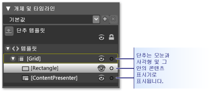  
  
2.  **템플릿 구성 요소의 이름 변경.** 템플릿 인벤터리에서 사각형을 마우스 오른쪽 단추로 클릭한 다음 <xref:System.Windows.Shapes.Rectangle> 이름을 "\[Rectangle\]"에서 "outerRectangle"로 변경하고 "\[ContentPresenter\]"를 "myContentPresenter"로 변경합니다.  
  
     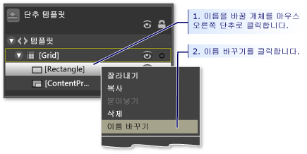  
  
3.  **도넛처럼 안이 비도록 사각형 변경.** **outerRectangle**을 선택한 다음 <xref:System.Windows.Shapes.Shape.Fill%2A>을 "Transparent"로 설정하고 <xref:System.Windows.Shapes.Shape.StrokeThickness%2A>를 5로 설정합니다.  
  
     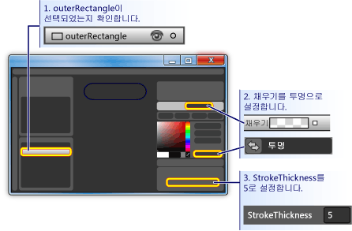  
  
     그런 다음 <xref:System.Windows.Shapes.Shape.Stroke%2A>를 변경될 템플릿의 색으로 설정합니다.  이렇게 하려면 **스트로크** 옆에 있는 작은 흰색 상자를 클릭하고 **CustomExpression**을 선택한 다음 대화 상자에 "{TemplateBinding Background}"를 입력합니다.  
  
     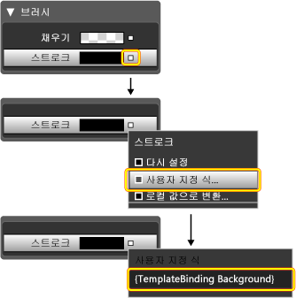  
  
4.  **안쪽 사각형 만들기.** 이제 "innerRectangle"이라는 다른 사각형을 만들고 **outerRectangle** 내부에 대칭적으로 배치합니다.  이러한 종류의 작업을 수행할 때는 편집 영역에서 단추가 보다 크게 표시되도록 확대할 수 있습니다.  
  
    > [!NOTE]
    >  사용자가 만드는 사각형은 모퉁이가 둥근 등 그림의 사각형과 모양이 다를 수 있습니다.  
  
     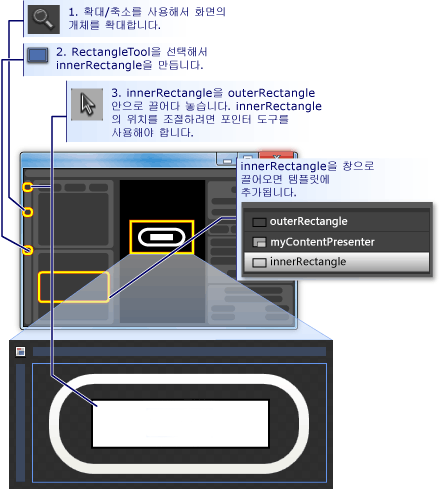  
  
5.  **ContentPresenter를 위로 이동.** 이 시점에서는 "Button"이라는 텍스트가 더 이상 표시되지 않을 수 있습니다.  그 이유는 **innerRectangle**이 **myContentPresenter** 위에 있기 때문입니다.  이 문제를 수정하려면 **myContentPresenter**를 **innerRectangle** 아래로 끌어 옵니다.  아래와 같이 보이도록 사각형과 **myContentPresenter**의 위치를 조정합니다.  
  
    > [!NOTE]
    >  **myContentPresenter**를 마우스 오른쪽 단추로 클릭하고 **앞으로 가져오기**을 눌러 해당 개체를 위에 배치할 수도 있습니다.  
  
     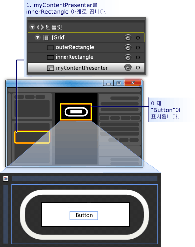  
  
6.  **innerRectangle의 모양 변경:** <xref:System.Windows.Shapes.Rectangle.RadiusX%2A>, <xref:System.Windows.Shapes.Rectangle.RadiusY%2A> 및 <xref:System.Windows.Shapes.Shape.StrokeThickness%2A> 값을 20으로 설정합니다.  또한 사용자 지정 식 "{TemplateBinding Background}"를 사용하여 <xref:System.Windows.Shapes.Shape.Fill%2A>을 템플릿의 배경으로 설정하고 <xref:System.Windows.Shapes.Shape.Stroke%2A>를 "transparent"로 설정합니다.  **innerRectangle**의 <xref:System.Windows.Shapes.Shape.Fill%2A> 및 <xref:System.Windows.Shapes.Shape.Stroke%2A>에 대한 설정은 **outerRectangle**의 해당 설정과 반대입니다.  
  
     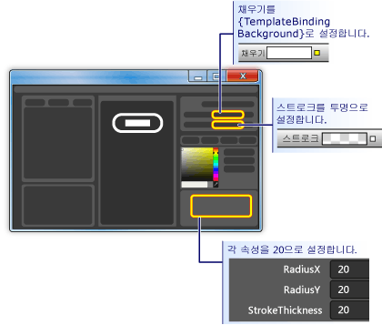  
  
7.  **위에 투명 효과 레이어 추가.** 단추의 모양을 사용자 지정하는 마지막 단계에서는 위에 투명 효과 레이어를 추가합니다.  이 투명 효과 레이어는 세 번째 사각형을 구성합니다.  투명 효과는 전체 단추를 덮어야 하므로 투명 효과 사각형이 차원적으로 **outerRectangle**과 유사합니다.  따라서 간단하게 **outerRectangle**을 복사하여 사각형을 만듭니다.  **outerRectangle**을 강조 표시하고 Ctrl\+C 및 Ctrl\+V를 사용하여 복사본을 만듭니다.  이 새 사각형의 이름을 "glassCube"로 지정합니다.  
  
8.  **필요한 경우 glassCube의 위치 조정.** 아직 전체 단추가 덮이도록 **glassCube**를 배치하지 않은 경우에는 끌어 와서 적절하게 배치합니다.  
  
9. **glassCube의 모양을 outerRectangle과 약간 다르게 지정.** **glassCube**의 속성을 변경합니다.  먼저 <xref:System.Windows.Shapes.Rectangle.RadiusX%2A> 및 <xref:System.Windows.Shapes.Rectangle.RadiusY%2A> 속성을 10으로 변경하고 <xref:System.Windows.Shapes.Shape.StrokeThickness%2A>를 2로 변경합니다.  
  
     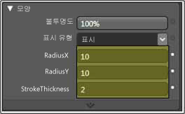  
  
10. **glassCube에 투명 효과 적용.** 불투명도가 75%인 선형 그라데이션을 사용하여 <xref:System.Windows.Shapes.Shape.Fill%2A>에 투명 효과를 적용하고 거의 균일한 6개의 간격을 따라 White와 Transparent를 번갈아 적용합니다.  그라데이션 중지점의 설정 값은 다음과 같습니다.  
  
    -   그라데이션 중지점 1: 알파 값이 75%인 White  
  
    -   그라데이션 중지점 2: 투명  
  
    -   그라데이션 중지점 3: 알파 값이 75%인 White  
  
    -   그라데이션 중지점 4: 투명  
  
    -   그라데이션 중지점 5: 알파 값이 75%인 White  
  
    -   그라데이션 중지점 6: 투명  
  
     이렇게 하면 "물결치는" 투명 효과 모양이 만들어집니다.  
  
     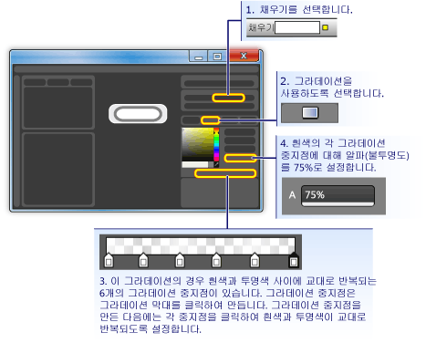  
  
11. **투명 효과 레이어 숨기기.** 투명 효과 레이어를 만들어 보았으니 이제 **속성** 패널의 **모양** 창으로 이동하고 불투명도를 0%로 설정하여 해당 레이어를 숨겨 봅니다.  다음 단원에서는 속성 트리거 및 이벤트를 사용하여 투명 효과 레이어를 표시하고 조작합니다.  
  
     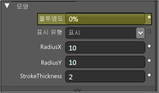  
  
## 단추 동작 사용자 지정  
 이 시점에서는 해당 템플릿을 편집하여 단추 표시를 사용자 지정했음에도 불구하고 마우스를 해당 항목 위로 이동하거나, 포커스를 받거나, 클릭할 때 모양이 변경되는 일반적인 단추처럼 해당 단추가 사용자 작업에 반응하지 않습니다. 다음 두 절차에서는 이러한 동작을 사용자 지정 단추에 빌드하는 방법을 보여 줍니다.  먼저 간단한 속성 트리거를 사용하고 이벤트 트리거 및 애니메이션을 추가합니다.  
  
#### 속성 트리거를 설정하려면  
  
1.  **새 속성 트리거 만들기.** **glassCube**가 선택된 상태에서 다음 단계 아래의 그림과 같이 **트리거** 패널에서 **\+ 속성**을 클릭합니다.  이렇게 하면 기본 속성 트리거를 사용하여 속성 트리거가 만들어집니다.  
  
2.  **트리거에서 IsMouseOver 속성을 사용하도록 만들기.** 속성을 <xref:System.Windows.UIElement.IsMouseOver%2A>로 변경합니다.  이렇게 하면 <xref:System.Windows.UIElement.IsMouseOver%2A> 속성이 `true`인 경우, 즉 사용자가 마우스로 단추를 가리키는 경우 속성 트리거가 활성화됩니다.  
  
     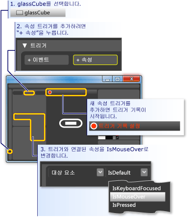  
  
3.  **glassCube에 대해 IsMouseOver 트리거의 불투명도를 100%로 지정.** **트리거 기록 설정**\(위 그림 참조\)을 확인합니다.  이는 기록이 진행되는 동안 **glassCube**의 속성 값에 대해 변경하는 내용이 <xref:System.Windows.UIElement.IsMouseOver%2A>가 `true`인 경우 발생하는 작업이 됨을 의미합니다.  기록이 진행되는 동안 **glassCube**의 <xref:System.Windows.UIElement.Opacity%2A>를 100%로 변경합니다.  
  
     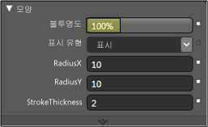  
  
     이제 첫 번째 속성 트리거가 만들어졌습니다.  편집기의 **트리거** 패널에서 100%로 변경되는 <xref:System.Windows.UIElement.Opacity%2A>가 기록됨을 확인할 수 있습니다.  
  
     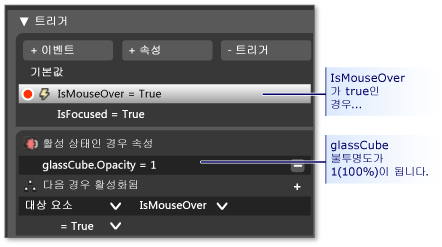  
  
     F5 키를 눌러 응용 프로그램을 실행하고 마우스 포인터를 단추 위 및 외부로 이동합니다.  이때 마우스를 단추 위로 이동하면 투명 효과 레이어가 나타나고 포인터를 단추 외부로 이동하면 투명 효과 레이어가 사라져야 합니다.  
  
4.  **IsMouseOver 트리거의 스트로크 값 변경.** 이제 <xref:System.Windows.UIElement.IsMouseOver%2A> 트리거에 몇 가지 다른 작업을 연결합니다.  기록이 계속되는 동안 선택 항목을 **glassCube**에서 **outerRectangle**로 전환합니다.  그런 다음 **outerRectangle**의 <xref:System.Windows.Shapes.Shape.Stroke%2A>를 사용자 지정 식 "{DynamicResource {x:Static SystemColors.HighlightBrushKey}}"로 설정합니다.  이렇게 하면 <xref:System.Windows.Shapes.Shape.Stroke%2A>가 단추에 사용되는 일반적인 강조 색으로 설정됩니다.  F5 키를 눌러 마우스를 단추 위로 이동할 때의 효과를 확인합니다.  
  
     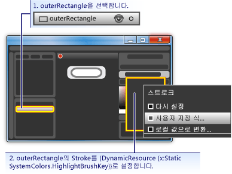  
  
5.  **IsMouseOver 트리거의 흐린 텍스트.** 이제 <xref:System.Windows.UIElement.IsMouseOver%2A> 속성 트리거에 한 가지 작업을 더 연결합니다.  단추 위에 투명 효과가 나타날 때 단추의 콘텐츠가 약간 흐리게 나타나도록 만듭니다.  이렇게 하려면 <xref:System.Windows.Controls.ContentPresenter>\(**myContentPresenter**\)에 흐림 <xref:System.Windows.Media.Effects.BitmapEffect>를 적용합니다.  
  
     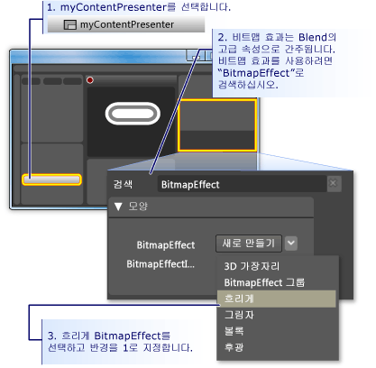  
  
    > [!NOTE]
    >  **속성** 패널을 <xref:System.Windows.Media.Effects.BitmapEffect>를 검색하기 이전 상태로 되돌리려면 **검색** 상자에서 텍스트를 지우십시오.  
  
     지금까지 몇 가지 작업이 연결된 속성 트리거를 사용하여 마우스 포인터가 단추 영역으로 들어오고 나갈 때 강조 표시가 되는 동작을 만들었습니다.  단추의 또 다른 일반적인 동작은 단추를 클릭하고 난 후처럼 단추가 포커스를 받을 때 강조 표시를 하는 것입니다.  <xref:System.Windows.UIElement.IsFocused%2A> 속성에 대해 다른 속성 트리거를 추가하여 이러한 동작을 추가할 수 있습니다.  
  
6.  **IsFocused에 대한 속성 트리거 만들기.** <xref:System.Windows.UIElement.IsMouseOver%2A>\(이 단원의 첫 번째 단계 참조\)와 같은 절차를 사용하여 <xref:System.Windows.UIElement.IsFocused%2A> 속성에 대해 다른 속성 트리거를 만듭니다.  **트리거 기록 설정**이 설정되어 있는 상태에서 트리거에 다음 작업을 추가합니다.  
  
    -   **glassCube**에 100%의 <xref:System.Windows.UIElement.Opacity%2A> 지정  
  
    -   **outerRectangle**의 <xref:System.Windows.Shapes.Shape.Stroke%2A>를 사용자 지정 식 값 "{DynamicResource {x:Static SystemColors.HighlightBrushKey}}"로 설정  
  
 이 연습의 마지막 단계에서는 단추에 애니메이션을 추가합니다.  이러한 애니메이션은 특히 <xref:System.Windows.UIElement.MouseEnter> 및 <xref:System.Windows.Controls.Primitives.ButtonBase.Click> 이벤트와 같은 이벤트에 의해 트리거됩니다.  
  
#### 이벤트 트리거 및 애니메이션을 사용하여 대화형 작업을 추가하려면  
  
1.  **MouseEnter 이벤트 트리거 만들기.** 새 이벤트 트리거를 추가하고 트리거에 사용할 이벤트로 <xref:System.Windows.UIElement.MouseEnter>를 선택합니다.  
  
     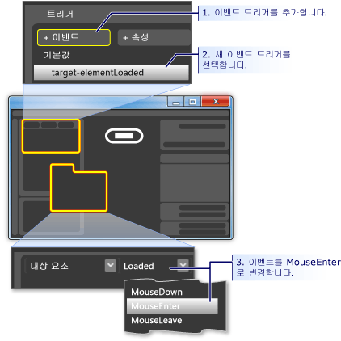  
  
2.  **애니메이션 시간 표시 막대 만들기.** 다음으로 애니메이션 시간 표시 막대를 <xref:System.Windows.UIElement.MouseEnter> 이벤트에 연결합니다.  
  
     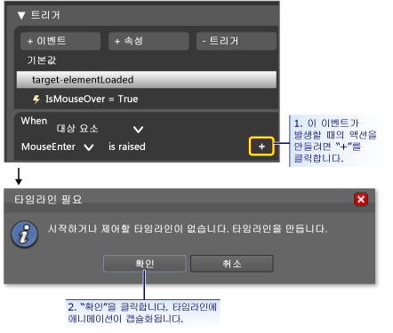  
  
     **확인**을 눌러 새 시간 표시 막대를 만들면 **시간 표시 막대** 패널이 나타나고 "시간 표시 막대 기록 설정"이 디자인 패널에 표시됩니다.  이는 시간 표시 막대에서 속성 변경 내용을 기록하여 속성 변경 내용에 애니메이션 효과를 줄 수 있음을 의미합니다.  
  
    > [!NOTE]
    >  표시되는 창 및\/또는 패널의 크기를 조정해야 할 수 있습니다.  
  
     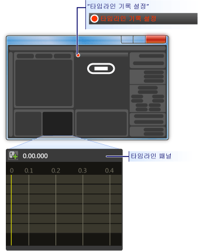  
  
3.  **키프레임 만들기.** 애니메이션을 만들려면 애니메이션 효과를 줄 개체를 선택하고 시간 표시 막대에서 둘 이상의 키프레임을 만든 다음 해당 키프레임에 대해 애니메이션의 보간 속성 값을 설정합니다.  다음 그림에서는 키프레임을 만드는 과정을 보여 줍니다.  
  
     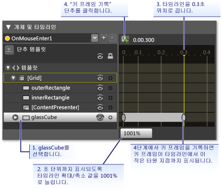  
  
4.  **이 키프레임의 glassCube 축소.** 두 번째 키프레임이 선택된 상태에서 **크기 변형**을 사용하여 **glassCube**의 크기를 전체 크기의 90%로 축소합니다.  
  
     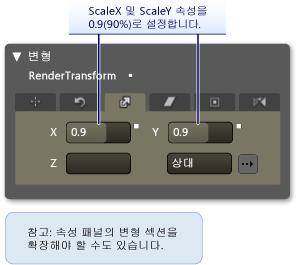  
  
     F5 키를 눌러 응용 프로그램을 실행합니다.  마우스 포인터를 단추 위로 이동합니다.  투명 효과 레이어가 단추 위에서 축소되는 것을 확인할 수 있습니다.  
  
5.  **다른 이벤트 트리거를 만들어 다양한 애니메이션에 연결.** 이제 다른 애니메이션을 하나 더 추가합니다.  이전 이벤트 트리거 애니메이션을 만드는 데 사용한 것과 유사한 절차를 사용하여 다음을 수행합니다.  
  
    1.  <xref:System.Windows.Controls.Primitives.ButtonBase.Click> 이벤트를 사용하여 새 이벤트 트리거를 만듭니다.  
  
    2.  <xref:System.Windows.Controls.Primitives.ButtonBase.Click> 이벤트에 새 시간 표시 막대를 연결합니다.  
  
     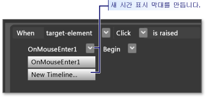  
  
    1.  이 시간 표시 막대에 대해 각각 0.0초 및 0.3초에 키프레임을 만듭니다.  
  
    2.  0.3초의 키프레임이 강조 표시된 상태에서 **회전 변형 각도**를 360도로 설정합니다.  
  
     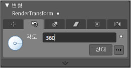  
  
    1.  F5 키를 눌러 응용 프로그램을 실행합니다.  단추를 클릭합니다.  투명 효과 레이어가 회전되는 것을 확인할 수 있습니다.  
  
## 결론  
 사용자 지정 단추를 완성하였습니다.  이러한 작업은 응용 프로그램의 모든 단추에 적용되는 단추 템플릿을 사용하여 수행했습니다.  템플릿 편집 모드를 종료\(다음 그림 참조\)하고 추가로 단추를 만들면 해당 단추는 기본 단추가 아닌 사용자 지정 단추처럼 표시되고 동작합니다.  
  
 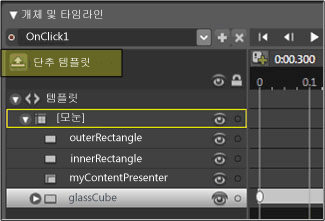  
  
 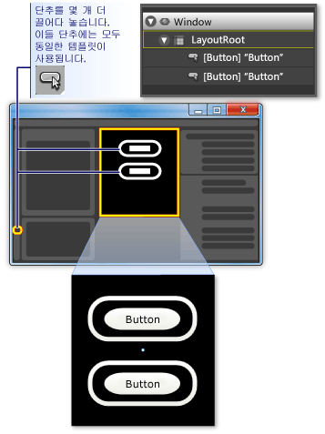  
  
 F5 키를 눌러 응용 프로그램을 실행합니다.  단추를 클릭하여 모든 단추가 동일하게 동작하는 방식을 확인합니다.  
  
 템플릿을 사용자 지정하는 동안에 **innerRectangle**의 <xref:System.Windows.Shapes.Shape.Fill%2A> 속성과 **outerRectangle**의 <xref:System.Windows.Shapes.Shape.Stroke%2A> 속성을 템플릿 배경\({TemplateBinding Background}\)으로 설정했습니다.  따라서 개별 단추의 배경색을 설정하면 설정한 배경이 이러한 각 속성에 사용됩니다.  배경을 지금 변경해 봅니다.  다음 그림에서는 다양한 그라데이션이 사용되었습니다.  따라서 단추와 같은 컨트롤에 대한 전반적인 사용자 지정 작업에 템플릿을 사용하면 유용하지만 템플릿이 있는 여러 컨트롤을 수정하여 컨트롤이 서로 다르게 표시되도록 만들 수도 있습니다.  
  
   
  
 결론적으로 단추 템플릿을 사용자 지정하는 과정을 통해 Microsoft Expression Blend에서 다음 작업을 수행하는 방법을 배웠습니다.  
  
-   컨트롤의 모양 사용자 지정  
  
-   속성 트리거 설정.  속성 트리거는 컨트롤뿐만 아니라 대부분의 개체에 사용할 수 있기 때문에 매우 유용합니다.  
  
-   이벤트 트리거 설정.  이벤트 트리거는 컨트롤뿐만 아니라 대부분의 개체에 사용할 수 있기 때문에 매우 유용합니다.  
  
-   애니메이션 만들기  
  
-   그라데이션 만들기, BitmapEffect 추가, 변환 사용 및 개체의 기본 속성 설정 등과 같은 기타 작업  
  
## 참고 항목  
 [XAML을 사용하여 단추 만들기](../../../../docs/framework/wpf/controls/walkthrough-create-a-button-by-using-xaml.md)   
 [스타일 지정 및 템플릿](../../../../docs/framework/wpf/controls/styling-and-templating.md)   
 [애니메이션 개요](../../../../docs/framework/wpf/graphics-multimedia/animation-overview.md)   
 [단색 및 그라데이션을 사용한 그리기 개요](../../../../docs/framework/wpf/graphics-multimedia/painting-with-solid-colors-and-gradients-overview.md)   
 [비트맵 효과 개요](../../../../docs/framework/wpf/graphics-multimedia/bitmap-effects-overview.md)