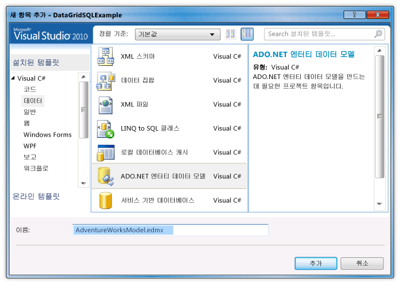
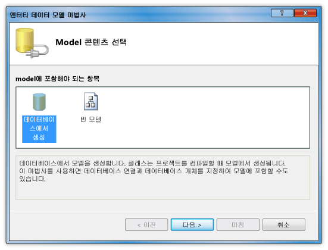
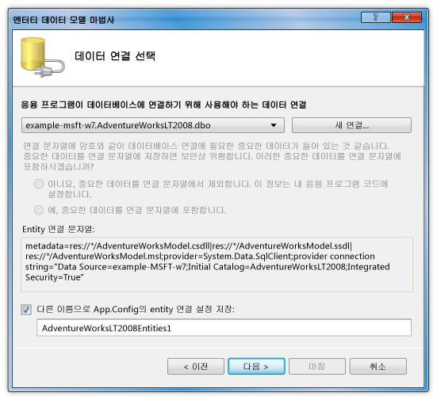
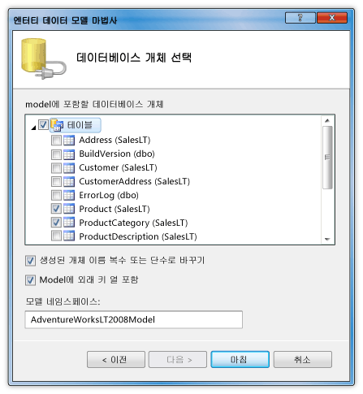
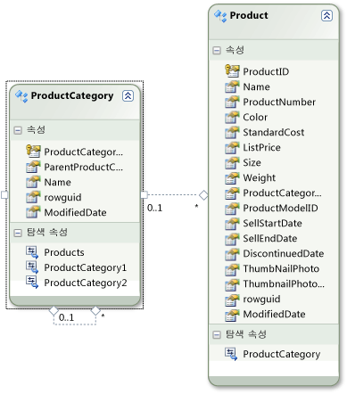

# 연습: DataGrid 컨트롤에서 SQL Server 데이터베이스의 데이터 표시
이 연습에서는 SQL Server 데이터베이스에서 데이터를 검색 하 고이 해당 데이터를 표시할는 <xref:System.Windows.Controls.DataGrid> 제어 합니다. ADO.NET Entity Framework를 사용 하 여 엔터티 클래스에서 지정된 된 데이터를 검색 하는 쿼리를 작성 하려면 LINQ를 사용 하 여 데이터를 나타내는 엔터티 클래스를 만듭니다.  
  
## 필수 구성 요소  
 이 연습을 완료하려면 다음 구성 요소가 필요합니다.  
  
-   [!INCLUDE[vs_dev11_long](../../../../includes/vs-dev11-long-md.md)].  
  
-   SQL Server 또는 첨부 된 AdventureWorks 예제 데이터베이스가 있는 SQL Server Express의 실행 중인 인스턴스 액세스 권한. AdventureWorks 데이터베이스를 다운로드할 수 있습니다는 [GitHub](https://github.com/Microsoft/sql-server-samples/releases)합니다.  
  
### 엔터티 클래스를 만들려면  
  
1.  Visual Basic 또는 C#에서 새 WPF 응용 프로그램 프로젝트를 만들고 이름을 `DataGridSQLExample`합니다.  
  
2.  솔루션 탐색기에서 프로젝트를 마우스 오른쪽 단추로, 가리킨 **추가**를 선택한 후 **새 항목**합니다.  
  
     새 항목 추가 대화 상자가 나타납니다.  
  
3.  설치 된 템플릿 창에서 선택 **데이터** 템플릿 목록에서 선택 하 고 **ADO.NET 엔터티 데이터 모델**l입니다.  
  
       
  
4.  파일 이름을 `AdventureWorksModel.edmx` 클릭 하 고 **추가**합니다.  
  
     엔터티 데이터 모델 마법사가 나타납니다.  
  
5.  모델 콘텐츠 선택 화면에서 선택 **데이터베이스에서 생성** 클릭 하 고 **다음**합니다.  
  
       
  
6.  데이터 연결 선택 화면에서 AdventureWorksLT2008 데이터베이스에 대 한 연결을 제공 합니다. 자세한 내용은 참조 [선택 하면 데이터 연결 대화 상자](http://go.microsoft.com/fwlink/?LinkId=160190)합니다.  
  
       
  
7.  이름이 있는지 확인 `AdventureWorksLT2008Entities` 하 고는 **이름으로 App.Config의 엔터티 연결 설정 저장** 확인란을 선택한 다음 클릭 **다음**합니다.  
  
8.  데이터베이스 개체 선택 화면에서 테이블 노드를 확장 하 고 선택 된 **제품** 및 **ProductCategory** 테이블입니다.  
  
     모든 테이블;에 대 한 엔터티 클래스를 생성할 수 있습니다. 그러나이 예에서에서 데이터를 검색할 테이블입니다.  
  
       
  
9. **마침**을 클릭합니다.  
  
     Product 및 ProductCategory 엔터티는 Entity Designer에 표시 됩니다.  
  
       
  
### 검색 한 데이터를 제공 하려면  
  
1.  MainWindow.xaml 파일을 엽니다.  
  
2.  설정의 <xref:System.Windows.FrameworkElement.Width%2A> 속성에는 <xref:System.Windows.Window> 450으로 합니다.  
  
3.  XAML 편집기에서 다음을 추가 <xref:System.Windows.Controls.DataGrid> 간의 태그는 `<Grid>` 및 `</Grid>` 추가할 태그는 <xref:System.Windows.Controls.DataGrid> 라는 `dataGrid1`합니다.  
  
     [!code-xaml[DataGrid_SQL_EF_Walkthrough#3](../../../../samples/snippets/csharp/VS_Snippets_Wpf/DataGrid_SQL_EF_Walkthrough/CS/MainWindow.xaml#3)]  
  
       
  
4.  <xref:System.Windows.Window>를 선택합니다.  
  
5.  에 대 한 이벤트 처리기를 만들고 속성 창이 나 XAML 편집기를 사용 하는 <xref:System.Windows.Window> 라는 `Window_Loaded` 에 대 한는 <xref:System.Windows.FrameworkElement.Loaded> 이벤트입니다. 자세한 내용은 참조 [하는 방법: 간단한 이벤트 처리기를 만들](http://msdn.microsoft.com/en-us/b1456e07-9dec-4354-99cf-18666b64f480)합니다.  
  
     다음 XAML MainWindow.xaml에 대 한 표시 합니다.  
  
    > [!NOTE]
    >  Visual Basic에서 MainWindow.xaml의 첫 번째 줄을 사용 하는 경우 대체 `x:Class="DataGridSQLExample.MainWindow"` 와 `x:Class="MainWindow"`합니다.  
  
     [!code-xaml[DataGrid_SQL_EF_Walkthrough#1](../../../../samples/snippets/csharp/VS_Snippets_Wpf/DataGrid_SQL_EF_Walkthrough/CS/MainWindow.xaml#1)]  
  
6.  에 대 한 코드 숨김 파일 (MainWindow.xaml.vb 또는 MainWindow.xaml.cs)를 열고는 <xref:System.Windows.Window>합니다.  
  
7.  조인된 된 테이블의 특정 값만 검색 하 고 설정 다음 코드를 추가 <xref:System.Windows.Controls.ItemsControl.ItemsSource%2A> 의 속성은 <xref:System.Windows.Controls.DataGrid> 쿼리의 결과를 합니다.  
  
     [!code-csharp[DataGrid_SQL_EF_Walkthrough#2](../../../../samples/snippets/csharp/VS_Snippets_Wpf/DataGrid_SQL_EF_Walkthrough/CS/MainWindow.xaml.cs#2)]
     [!code-vb[DataGrid_SQL_EF_Walkthrough#2](../../../../samples/snippets/visualbasic/VS_Snippets_Wpf/DataGrid_SQL_EF_Walkthrough/VB/MainWindow.xaml.vb#2)]  
  
8.  예제를 실행합니다.  
  
     표시 됩니다는 <xref:System.Windows.Controls.DataGrid> 데이터를 표시입니다.  
  
       
  
## 다음 단계  
  
## 참고 항목  
 <xref:System.Windows.Controls.DataGrid>  
 [어떻게 할까요?: 가져오기 시작 WPF 응용 프로그램에서 Entity Framework와 함께?](http://go.microsoft.com/fwlink/?LinkId=159868)
