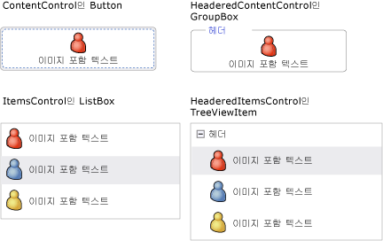
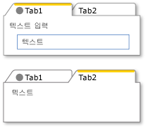
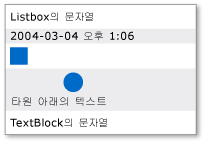
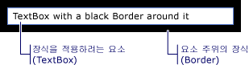

# WPF 콘텐츠 모델
[!INCLUDE[TLA#tla_winclient](../../../../includes/tlasharptla-winclient-md.md)]는 다양한 형식의 콘텐츠를 표시하는 것을 기본 용도로 하는 많은 컨트롤 형식 및 컨트롤과 유사한 형식을 제공하는 프레젠테이션 플랫폼입니다.  사용할 컨트롤이나 파생시킬 컨트롤을 결정하려면 특정 컨트롤이 가장 잘 표시할 수 있는 개체 유형을 이해해야 합니다.  
  
 이 항목에서는 [!INCLUDE[TLA2#tla_winclient](../../../../includes/tla2sharptla-winclient-md.md)] 컨트롤 형식 및 컨트롤과 비슷한 형식에 대한 콘텐츠 모델을 요약하여 보여 줍니다.  콘텐츠 모델은 컨트롤에 사용될 수 있는 컨트롤에 대해 설명합니다. 또한 이 항목에서는 각 컨트롤 모델에 대한 콘텐츠 속성을 보여 줍니다.  콘텐츠 속성은 개체의 콘텐츠를 저장하는 데 사용되는 속성입니다.  
  
   
  
   
## 임의의 콘텐츠가 들어 있는 클래스  
 일부 컨트롤은 문자열, <xref:System.DateTime> 개체, 추가 항목에 대한 컨테이너로 사용되는 <xref:System.Windows.UIElement> 등과 같은 모든 형식의 개체를 포함할 수 있습니다.  예를 들어 <xref:System.Windows.Controls.Button>은 이미지와 일부 텍스트를 포함할 수 있고 <xref:System.Windows.Controls.CheckBox>는 <xref:System.DateTime.Now%2A?displayProperty=fullName> 값을 포함할 수 있습니다.  
  
 [!INCLUDE[TLA2#tla_winclient](../../../../includes/tla2sharptla-winclient-md.md)]에는 임의의 콘텐츠가 들어 있는 네 개의 클래스가 있습니다.  다음 표에서는 <xref:System.Windows.Controls.Control>에서 상속하는 클래스를 보여 줍니다.  
  
|임의의 콘텐츠가 들어 있는 클래스|Content|  
|------------------------|-------------|  
|<xref:System.Windows.Controls.ContentControl>|임의의 단일 개체입니다.|  
|<xref:System.Windows.Controls.HeaderedContentControl>|헤더 및 단일 항목이며 둘 모두 임의의 개체입니다.|  
|<xref:System.Windows.Controls.ItemsControl>|임의 개체의 컬렉션입니다.|  
|<xref:System.Windows.Controls.HeaderedItemsControl>|헤더와 항목 컬렉션이며 모두 임의의 개체입니다.|  
  
 이러한 클래스에서 상속하는 컨트롤은 동일한 형식의 콘텐츠를 포함하며 콘텐츠를 동일한 방식으로 처리할 수 있습니다.  다음 그림에서는 이미지와 일부 텍스트를 포함하는 각 콘텐츠 모델의 컨트롤을 하나씩 보여 줍니다.  
  
   
  
### 임의의 단일 개체가 들어 있는 컨트롤  
 <xref:System.Windows.Controls.ContentControl> 클래스는 임의의 단일 콘텐츠를 포함합니다.  해당 콘텐츠 속성은 <xref:System.Windows.Controls.ContentControl.Content%2A>입니다.  다음 컨트롤은 <xref:System.Windows.Controls.ContentControl>에서 상속하며 해당 콘텐츠 모델을 사용합니다.  
  
-   <xref:System.Windows.Controls.Button>  
  
-   <xref:System.Windows.Controls.Primitives.ButtonBase>  
  
-   <xref:System.Windows.Controls.CheckBox>  
  
-   <xref:System.Windows.Controls.ComboBoxItem>  
  
-   <xref:System.Windows.Controls.ContentControl>  
  
-   <xref:System.Windows.Controls.Frame>  
  
-   <xref:System.Windows.Controls.GridViewColumnHeader>  
  
-   <xref:System.Windows.Controls.GroupItem>  
  
-   <xref:System.Windows.Controls.Label>  
  
-   <xref:System.Windows.Controls.ListBoxItem>  
  
-   <xref:System.Windows.Controls.ListViewItem>  
  
-   <xref:System.Windows.Navigation.NavigationWindow>  
  
-   <xref:System.Windows.Controls.RadioButton>  
  
-   <xref:System.Windows.Controls.Primitives.RepeatButton>  
  
-   <xref:System.Windows.Controls.ScrollViewer>  
  
-   <xref:System.Windows.Controls.Primitives.StatusBarItem>  
  
-   <xref:System.Windows.Controls.Primitives.ToggleButton>  
  
-   <xref:System.Windows.Controls.ToolTip>  
  
-   <xref:System.Windows.Controls.UserControl>  
  
-   <xref:System.Windows.Window>  
  
 다음 그림에서는 <xref:System.Windows.Controls.ContentControl.Content%2A>가 문자열, <xref:System.DateTime> 개체, <xref:System.Windows.Shapes.Rectangle> 및 <xref:System.Windows.Shapes.Ellipse> 및 <xref:System.Windows.Controls.TextBlock>을 포함하는 <xref:System.Windows.Controls.Panel>로 설정된 네 단추를 보여 줍니다.  
  
   
다양한 형식의 내용을 가진 네 개의 단추  
  
 <xref:System.Windows.Controls.ContentControl.Content%2A> 속성을 설정하는 방법에 대한 예제는 <xref:System.Windows.Controls.ContentControl>을 참조하십시오.  
  
### 헤더와 임의의 단일 개체가 들어 있는 컨트롤  
 <xref:System.Windows.Controls.HeaderedContentControl> 클래스는 <xref:System.Windows.Controls.ContentControl>에서 상속하며 콘텐츠를 헤더와 함께 표시합니다.  또한 콘텐츠 속성 <xref:System.Windows.Controls.ContentControl.Content%2A>를 <xref:System.Windows.Controls.ContentControl>에서 상속하고 <xref:System.Windows.Controls.HeaderedContentControl.Header%2A> 속성을 <xref:System.Object> 형식으로 정의하여 둘 모두 임의의 개체가 될 수 있도록 합니다.  
  
 다음 컨트롤은 <xref:System.Windows.Controls.HeaderedContentControl>에서 상속하며 해당 콘텐츠 모델을 사용합니다.  
  
-   <xref:System.Windows.Controls.Expander>  
  
-   <xref:System.Windows.Controls.GroupBox>  
  
-   <xref:System.Windows.Controls.TabItem>  
  
 다음 그림은 두 <xref:System.Windows.Controls.TabItem> 개체를 보여 줍니다.  첫 번째 <xref:System.Windows.Controls.TabItem>에서는 <xref:System.Windows.UIElement> 개체가 <xref:System.Windows.Controls.HeaderedContentControl.Header%2A> 및 <xref:System.Windows.Controls.ContentControl.Content%2A>로 사용됩니다.  <xref:System.Windows.Controls.HeaderedContentControl.Header%2A>는 <xref:System.Windows.Shapes.Ellipse> 및 <xref:System.Windows.Controls.TextBlock>을 포함하는 <xref:System.Windows.Controls.StackPanel>로 설정됩니다.  <xref:System.Windows.Controls.ContentControl.Content%2A>는 <xref:System.Windows.Controls.TextBlock> 및 <xref:System.Windows.Controls.Label>을 포함하는 <xref:System.Windows.Controls.StackPanel>로 설정됩니다.  두 번째 <xref:System.Windows.Controls.TabItem>에는 <xref:System.Windows.Controls.HeaderedContentControl.Header%2A>의 문자열과 <xref:System.Windows.Controls.ContentControl.Content%2A>의 <xref:System.Windows.Controls.TextBlock>이 있습니다.  
  
   
헤더 속성에서 다양한 형식을 사용하는 TabControl  
  
 <xref:System.Windows.Controls.TabItem> 개체를 만드는 방법에 대한 예제는 <xref:System.Windows.Controls.HeaderedContentControl>을 참조하십시오.  
  
### 임의 개체의 컬렉션을 포함하는 컨트롤  
 <xref:System.Windows.Controls.ItemsControl> 클래스는 <xref:System.Windows.Controls.Control>에서 상속하며 문자열, 개체 또는 기타 요소와 같은 여러 항목을 포함할 수 있습니다.  콘텐츠 속성은 <xref:System.Windows.Controls.ItemsControl.ItemsSource%2A> 및 <xref:System.Windows.Controls.ItemsControl.Items%2A>입니다.  <xref:System.Windows.Controls.ItemsControl.ItemsSource%2A>는 일반적으로 데이터 컬렉션으로 <xref:System.Windows.Controls.ItemsControl>을 채우는 데 사용됩니다.  컬렉션을 사용하여 <xref:System.Windows.Controls.ItemsControl>을 채우지 않으려면 <xref:System.Windows.Controls.ItemsControl.Items%2A> 속성을 사용하여 항목을 추가할 수 있습니다.  
  
 다음 컨트롤은 <xref:System.Windows.Controls.ItemsControl>에서 상속하며 해당 콘텐츠 모델을 사용합니다.  
  
-   <xref:System.Windows.Controls.Menu>  
  
-   <xref:System.Windows.Controls.Primitives.MenuBase>  
  
-   <xref:System.Windows.Controls.ContextMenu>  
  
-   <xref:System.Windows.Controls.ComboBox>  
  
-   <xref:System.Windows.Controls.ItemsControl>  
  
-   <xref:System.Windows.Controls.ListBox>  
  
-   <xref:System.Windows.Controls.ListView>  
  
-   <xref:System.Windows.Controls.TabControl>  
  
-   <xref:System.Windows.Controls.TreeView>  
  
-   <xref:System.Windows.Controls.Primitives.Selector>  
  
-   <xref:System.Windows.Controls.Primitives.StatusBar>  
  
 다음 그림에서는 다음과 같은 형식의 항목이 들어 있는 <xref:System.Windows.Controls.ListBox>를 보여 줍니다.  
  
-   문자열  
  
-   <xref:System.DateTime> 개체  
  
-   <xref:System.Windows.UIElement>  
  
-   <xref:System.Windows.Shapes.Ellipse> 및 <xref:System.Windows.Controls.TextBlock>이 들어 있는 <xref:System.Windows.Controls.Panel>  
  
   
여러 개체 형식이 들어 있는 목록 상자  
  
### 헤더와 임의 개체의 컬렉션을 포함하는 컨트롤  
 <xref:System.Windows.Controls.HeaderedItemsControl> 클래스는 <xref:System.Windows.Controls.ItemsControl>에서 상속하며 문자열, 개체 또는 기타 요소와 헤더를 포함할 수 있습니다.  또한 <xref:System.Windows.Controls.ItemsControl> 콘텐츠 속성, <xref:System.Windows.Controls.ItemsControl.ItemsSource%2A> 및 <xref:System.Windows.Controls.ItemsControl.Items%2A>를 상속하고 <xref:System.Windows.Controls.HeaderedItemsControl.Header%2A> 속성을 임의의 개체가 될 수 있도록 정의합니다.  
  
 다음 컨트롤은 <xref:System.Windows.Controls.HeaderedItemsControl>에서 상속하며 해당 콘텐츠 모델을 사용합니다.  
  
-   <xref:System.Windows.Controls.MenuItem>  
  
-   <xref:System.Windows.Controls.ToolBar>  
  
-   <xref:System.Windows.Controls.TreeViewItem>  
  
   
## UIElement 개체 컬렉션을 포함하는 클래스  
 <xref:System.Windows.Controls.Panel> 클래스는 자식 <xref:System.Windows.UIElement> 개체를 배치하고 정렬합니다.  해당 콘텐츠 속성은 <xref:System.Windows.Controls.Panel.Children%2A>입니다.  
  
 다음 클래스는 <xref:System.Windows.Controls.Panel> 클래스에서 상속하며 해당 콘텐츠 모델을 사용합니다.  
  
-   <xref:System.Windows.Controls.Canvas>  
  
-   <xref:System.Windows.Controls.DockPanel>  
  
-   <xref:System.Windows.Controls.Grid>  
  
-   <xref:System.Windows.Controls.Primitives.TabPanel>  
  
-   <xref:System.Windows.Controls.Primitives.ToolBarOverflowPanel>  
  
-   <xref:System.Windows.Controls.Primitives.ToolBarPanel>  
  
-   <xref:System.Windows.Controls.Primitives.UniformGrid>  
  
-   <xref:System.Windows.Controls.StackPanel>  
  
-   <xref:System.Windows.Controls.VirtualizingPanel>  
  
-   <xref:System.Windows.Controls.VirtualizingStackPanel>  
  
-   <xref:System.Windows.Controls.WrapPanel>  
  
 자세한 내용은 [Panel 개요](../../../../docs/framework/wpf/controls/panels-overview.md)를 참조하십시오.  
  
   
## UIElement의 모양에 영향을 주는 클래스  
 <xref:System.Windows.Controls.Decorator> 클래스는 단일의 자식 <xref:System.Windows.UIElement> 또는 그 주위에 시각적 효과를 적용합니다.  해당 콘텐츠 속성은 <xref:System.Windows.Controls.Decorator.Child%2A>입니다.  다음 클래스는 <xref:System.Windows.Controls.Decorator>에서 상속하며 해당 콘텐츠 모델을 사용합니다.  
  
-   <xref:System.Windows.Documents.AdornerDecorator>  
  
-   <xref:System.Windows.Controls.Border>  
  
-   <xref:System.Windows.Controls.Primitives.BulletDecorator>  
  
-   <xref:Microsoft.Windows.Themes.ButtonChrome>  
  
-   <xref:Microsoft.Windows.Themes.ClassicBorderDecorator>  
  
-   <xref:System.Windows.Controls.InkPresenter>  
  
-   <xref:Microsoft.Windows.Themes.ListBoxChrome>  
  
-   <xref:Microsoft.Windows.Themes.SystemDropShadowChrome>  
  
-   <xref:System.Windows.Controls.Viewbox>  
  
 다음 그림에서는 주위가 <xref:System.Windows.Controls.Border>로 데코레이팅된 <xref:System.Windows.Controls.TextBox>를 보여 줍니다.  
  
   
테두리가 있는 TextBlock  
  
   
## UIElement에 대한 시각적 피드백을 제공하는 클래스  
 <xref:System.Windows.Documents.Adorner> 클래스는 사용자에게 시각적 큐를 제공합니다.  예를 들어 <xref:System.Windows.Documents.Adorner>를 사용하여 함수 핸들을 요소에 추가하거나 컨트롤에 대한 상태 정보를 제공할 수 있습니다.  <xref:System.Windows.Documents.Adorner> 클래스는 사용자 표시기를 만들 수 있도록 프레임워크를 제공합니다.  [!INCLUDE[TLA2#tla_winclient](../../../../includes/tla2sharptla-winclient-md.md)]는 구현된 표시기를 제공하지 않습니다.  자세한 내용은 [표시기 개요](../../../../docs/framework/wpf/controls/adorners-overview.md)를 참조하십시오.  
  
   
## 사용자가 텍스트를 입력할 수 있는 클래스  
 WPF는 사용자가 텍스트를 입력할 수 있는 세 개의 기본 컨트롤을 제공합니다.  각 컨트롤에는 텍스트가 다르게 표시됩니다.  다음 표에서는 이 세 가지 텍스트 관련 컨트롤과 텍스트를 표시할 때의 기능 및 컨트롤 텍스트를 포함하는 속성을 보여 줍니다.  
  
|컨트롤|텍스트 표시|콘텐츠 속성|  
|---------|------------|------------|  
|<xref:System.Windows.Controls.TextBox>|일반 텍스트|<xref:System.Windows.Controls.TextBox.Text%2A>|  
|<xref:System.Windows.Controls.RichTextBox>|서식이 지정된 텍스트|<xref:System.Windows.Controls.RichTextBox.Document%2A>|  
|<xref:System.Windows.Controls.PasswordBox>|숨겨진 텍스트\(문자가 마스킹됨\)|<xref:System.Windows.Controls.PasswordBox.Password%2A>|  
  
   
## 텍스트를 표시하는 클래스  
 여러 클래스를 사용하여 일반 텍스트나 서식이 지정된 텍스트를 표시할 수 있습니다.  <xref:System.Windows.Controls.TextBlock>을 사용하여 적은 양의 텍스트를 표시할 수 있습니다.  많은 양의 텍스트를 표시하려면 <xref:System.Windows.Controls.FlowDocumentReader>, <xref:System.Windows.Controls.FlowDocumentPageViewer> 또는 <xref:System.Windows.Controls.FlowDocumentScrollViewer> 컨트롤을 사용합니다.  
  
 <xref:System.Windows.Controls.TextBlock>에는 <xref:System.Windows.Controls.TextBlock.Text%2A> 및 <xref:System.Windows.Controls.TextBlock.Inlines%2A>라는 두 개의 콘텐츠 속성이 있습니다.  일관된 서식을 사용하는 텍스트를 표시하려면 <xref:System.Windows.Controls.TextBlock.Text%2A> 속성을 선택하는 것이 좋습니다.  텍스트 전체에서 다른 서식을 사용하려면 <xref:System.Windows.Controls.TextBlock.Inlines%2A> 속성을 사용합니다.  <xref:System.Windows.Controls.TextBlock.Inlines%2A> 속성은 텍스트 서식을 지정하는 방법을 설정하는 <xref:System.Windows.Documents.Inline> 개체 컬렉션입니다.  
  
 다음 표에서는 <xref:System.Windows.Controls.FlowDocumentReader>, <xref:System.Windows.Controls.FlowDocumentPageViewer> 및 <xref:System.Windows.Controls.FlowDocumentScrollViewer> 클래스의 콘텐츠 속성을 보여 줍니다.  
  
|컨트롤|콘텐츠 속성|콘텐츠 속성 형식|  
|---------|------------|---------------|  
|<xref:System.Windows.Controls.FlowDocumentPageViewer>|Document|<xref:System.Windows.Documents.IDocumentPaginatorSource>|  
|<xref:System.Windows.Controls.FlowDocumentReader>|Document|<xref:System.Windows.Documents.FlowDocument>|  
|<xref:System.Windows.Controls.FlowDocumentScrollViewer>|Document|<xref:System.Windows.Documents.FlowDocument>|  
  
 <xref:System.Windows.Documents.FlowDocument>는 <xref:System.Windows.Documents.IDocumentPaginatorSource> 인터페이스를 구현하므로 세 클래스 모두에서 <xref:System.Windows.Documents.FlowDocument>를 콘텐츠로 사용할 수 있습니다.  
  
   
## 텍스트 서식을 지정하는 클래스  
 <xref:System.Windows.Documents.TextElement>와 관련 클래스를 사용하여 텍스트의 서식을 지정할 수 있습니다.  <xref:System.Windows.Documents.TextElement> 개체는 <xref:System.Windows.Controls.TextBlock> 및 <xref:System.Windows.Documents.FlowDocument> 개체의 텍스트를 포함하고 서식을 지정합니다.  <xref:System.Windows.Documents.TextElement> 개체의 두 가지 기본 형식은 <xref:System.Windows.Documents.Block> 요소 및 <xref:System.Windows.Documents.Inline> 요소입니다.  <xref:System.Windows.Documents.Block> 요소는 단락, 목록 등과 같은 텍스트 블록을 나타냅니다.  <xref:System.Windows.Documents.Inline> 요소는 텍스트의 일부를 블록으로 나타냅니다.  다양한 <xref:System.Windows.Documents.Inline> 클래스를 사용하여 해당 클래스가 적용되는 텍스트의 서식을 지정할 수 있습니다.  각 <xref:System.Windows.Documents.TextElement>마다 자체 콘텐츠 모델이 있습니다.  자세한 내용은 [TextElement 콘텐츠 모델 개요](../../../../docs/framework/wpf/advanced/textelement-content-model-overview.md)을 참조하십시오.  
  
## 참고 항목  
 [고급](../../../../docs/framework/wpf/advanced/index.md)