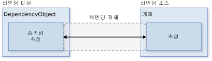
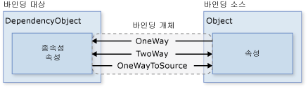
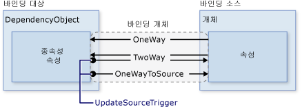
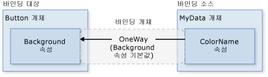
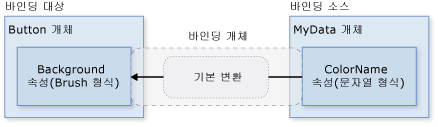
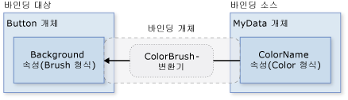
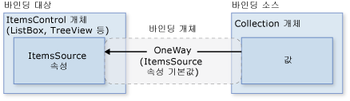

# <a name="data-binding-overview"></a><span data-ttu-id="80cc6-102">데이터 바인딩 개요</span><span class="sxs-lookup"><span data-stu-id="80cc6-102">Data Binding Overview</span></span>
[!INCLUDE[TLA#tla_winclient](../../../../includes/tlasharptla-winclient-md.md)]<span data-ttu-id="80cc6-103"> 데이터 바인딩은 응용 프로그램이 데이터를 제공하고 상호 작용할 수 있는 간단하고 일관된 방법을 제공합니다.</span><span class="sxs-lookup"><span data-stu-id="80cc6-103"> data binding provides a simple and consistent way for applications to present and interact with data.</span></span> <span data-ttu-id="80cc6-104">다양한 데이터 소스에서 [!INCLUDE[TLA#tla_clr](../../../../includes/tlasharptla-clr-md.md)] 개체 및 [!INCLUDE[TLA#tla_xml](../../../../includes/tlasharptla-xml-md.md)]의 형태로 데이터에 요소를 바인딩할 수 있습니다.</span><span class="sxs-lookup"><span data-stu-id="80cc6-104">Elements can be bound to data from a variety of data sources in the form of [!INCLUDE[TLA#tla_clr](../../../../includes/tlasharptla-clr-md.md)] objects and [!INCLUDE[TLA#tla_xml](../../../../includes/tlasharptla-xml-md.md)].</span></span> <span data-ttu-id="80cc6-105"><xref:System.Windows.Controls.ContentControl>와 같은 s <xref:System.Windows.Controls.Button> 및 <xref:System.Windows.Controls.ItemsControl>같은 <xref:System.Windows.Controls.ListBox> 및 <xref:System.Windows.Controls.ListView> 단일 데이터 항목의 스타일을 유연한 또는 데이터 항목의 컬렉션을 사용 하도록 기능이 기본 제공 합니다.</span><span class="sxs-lookup"><span data-stu-id="80cc6-105"><xref:System.Windows.Controls.ContentControl>s such as <xref:System.Windows.Controls.Button> and <xref:System.Windows.Controls.ItemsControl>s such as <xref:System.Windows.Controls.ListBox> and <xref:System.Windows.Controls.ListView> have built-in functionality to enable flexible styling of single data items or collections of data items.</span></span> <span data-ttu-id="80cc6-106">데이터를 기반으로 정렬, 필터 및 그룹 보기를 생성할 수 있습니다.</span><span class="sxs-lookup"><span data-stu-id="80cc6-106">Sort, filter, and group views can be generated on top of the data.</span></span>  
  
 <span data-ttu-id="80cc6-107">[!INCLUDE[TLA2#tla_winclient](../../../../includes/tla2sharptla-winclient-md.md)]의 데이터 바인딩 기능은 기본적으로 데이터 바인딩을 지원하는 광범위한 속성, 데이터의 유연한 [!INCLUDE[TLA2#tla_ui](../../../../includes/tla2sharptla-ui-md.md)] 표현 및 [!INCLUDE[TLA2#tla_ui](../../../../includes/tla2sharptla-ui-md.md)]와 비즈니스 논리의 분명한 분리와 같은 기존 모델에 비해 여러 가지 이점이 있습니다.</span><span class="sxs-lookup"><span data-stu-id="80cc6-107">The data binding functionality in [!INCLUDE[TLA2#tla_winclient](../../../../includes/tla2sharptla-winclient-md.md)] has several advantages over traditional models, including a broad range of properties that inherently support data binding, flexible [!INCLUDE[TLA2#tla_ui](../../../../includes/tla2sharptla-ui-md.md)] representation of data, and clean separation of business logic from [!INCLUDE[TLA2#tla_ui](../../../../includes/tla2sharptla-ui-md.md)].</span></span>  
  
 <span data-ttu-id="80cc6-108">이 항목에서는 먼저 대 한 핵심 개념을 설명 [!INCLUDE[TLA2#tla_winclient](../../../../includes/tla2sharptla-winclient-md.md)] 데이터 바인딩 및의 사용에는 다음이 되는 <xref:System.Windows.Data.Binding> 클래스 및 기타 기능 데이터 바인딩.</span><span class="sxs-lookup"><span data-stu-id="80cc6-108">This topic first discusses concepts fundamental to [!INCLUDE[TLA2#tla_winclient](../../../../includes/tla2sharptla-winclient-md.md)] data binding and then goes into the usage of the <xref:System.Windows.Data.Binding> class and other features of data binding.</span></span>  
  
  
<a name="what_is_data_binding"></a>   
## <a name="what-is-data-binding"></a><span data-ttu-id="80cc6-109">데이터 바인딩이란?</span><span class="sxs-lookup"><span data-stu-id="80cc6-109">What Is Data Binding?</span></span>  
 <span data-ttu-id="80cc6-110">데이터 바인딩은 응용 프로그램 [!INCLUDE[TLA2#tla_ui](../../../../includes/tla2sharptla-ui-md.md)]와 비즈니스 논리를 연결하는 프로세스입니다.</span><span class="sxs-lookup"><span data-stu-id="80cc6-110">Data binding is the process that establishes a connection between the application [!INCLUDE[TLA2#tla_ui](../../../../includes/tla2sharptla-ui-md.md)] and business logic.</span></span> <span data-ttu-id="80cc6-111">바인딩 설정이 올바르고 데이터가 적절한 알림을 제공하는 경우에는 데이터의 값이 변경될 때 데이터에 바인딩된 요소에 변경 내용이 자동으로 반영됩니다.</span><span class="sxs-lookup"><span data-stu-id="80cc6-111">If the binding has the correct settings and the data provides the proper notifications, then, when the data changes its value, the elements that are bound to the data reflect changes automatically.</span></span> <span data-ttu-id="80cc6-112">또한 요소에서 데이터의 외부 표현이 변경되면 내부 데이터가 자동으로 업데이트되어 변경 내용이 반영될 수 있습니다.</span><span class="sxs-lookup"><span data-stu-id="80cc6-112">Data binding can also mean that if an outer representation of the data in an element changes, then the underlying data can be automatically updated to reflect the change.</span></span> <span data-ttu-id="80cc6-113">예를 들어, 값을 편집 하는 사용자는 <xref:System.Windows.Controls.TextBox> 기본 데이터 값을 사용 하는 요소는 해당 변경 내용을 반영 하도록 자동으로 업데이트 됩니다.</span><span class="sxs-lookup"><span data-stu-id="80cc6-113">For example, if the user edits the value in a <xref:System.Windows.Controls.TextBox> element, the underlying data value is automatically updated to reflect that change.</span></span>  
  
 <span data-ttu-id="80cc6-114">데이터 바인딩은 일반적으로 서버 또는 로컬 구성 데이터를 폼이나 기타 [!INCLUDE[TLA2#tla_ui](../../../../includes/tla2sharptla-ui-md.md)] 컨트롤에 배치하는 데 사용됩니다.</span><span class="sxs-lookup"><span data-stu-id="80cc6-114">A typical use of data binding is to place server or local configuration data into forms or other [!INCLUDE[TLA2#tla_ui](../../../../includes/tla2sharptla-ui-md.md)] controls.</span></span> <span data-ttu-id="80cc6-115">[!INCLUDE[TLA2#tla_winclient](../../../../includes/tla2sharptla-winclient-md.md)]에서 이 개념은 광범위한 속성을 다양한 데이터 소스에 바인딩하는 기능을 포함하도록 확장됩니다.</span><span class="sxs-lookup"><span data-stu-id="80cc6-115">In [!INCLUDE[TLA2#tla_winclient](../../../../includes/tla2sharptla-winclient-md.md)], this concept is expanded to include the binding of a broad range of properties to a variety of data sources.</span></span> <span data-ttu-id="80cc6-116">[!INCLUDE[TLA2#tla_winclient](../../../../includes/tla2sharptla-winclient-md.md)]에서 요소의 종속성 속성은 [!INCLUDE[TLA2#tla_clr](../../../../includes/tla2sharptla-clr-md.md)] 개체([!INCLUDE[TLA#tla_adonet](../../../../includes/tlasharptla-adonet-md.md)] 개체 또는 웹 서비스와 웹 속성에 연결된 개체 포함) 및 [!INCLUDE[TLA2#tla_xml](../../../../includes/tla2sharptla-xml-md.md)] 데이터에 바인딩될 수 있습니다.</span><span class="sxs-lookup"><span data-stu-id="80cc6-116">In [!INCLUDE[TLA2#tla_winclient](../../../../includes/tla2sharptla-winclient-md.md)], dependency properties of elements can be bound to [!INCLUDE[TLA2#tla_clr](../../../../includes/tla2sharptla-clr-md.md)] objects (including [!INCLUDE[TLA#tla_adonet](../../../../includes/tlasharptla-adonet-md.md)] objects or objects associated with Web Services and Web properties) and [!INCLUDE[TLA2#tla_xml](../../../../includes/tla2sharptla-xml-md.md)] data.</span></span>  
  
 <span data-ttu-id="80cc6-117">데이터 바인딩의 예는 [Data Binding Demo](http://go.microsoft.com/fwlink/?LinkID=163703)(데이터 바인딩 데모)에서 다음 응용 프로그램 [!INCLUDE[TLA2#tla_ui](../../../../includes/tla2sharptla-ui-md.md)]를 살펴보세요.</span><span class="sxs-lookup"><span data-stu-id="80cc6-117">For an example of data binding, take a look at the following application [!INCLUDE[TLA2#tla_ui](../../../../includes/tla2sharptla-ui-md.md)] from the [Data Binding Demo](http://go.microsoft.com/fwlink/?LinkID=163703):</span></span>  
  
 <span data-ttu-id="80cc6-118"></span><span class="sxs-lookup"><span data-stu-id="80cc6-118"></span></span>  
  
 <span data-ttu-id="80cc6-119">위 그림은 작업 항목 목록을 표시하는 응용 프로그램의 [!INCLUDE[TLA2#tla_ui](../../../../includes/tla2sharptla-ui-md.md)]입니다.</span><span class="sxs-lookup"><span data-stu-id="80cc6-119">The above is the [!INCLUDE[TLA2#tla_ui](../../../../includes/tla2sharptla-ui-md.md)] of an application that displays a list of auction items.</span></span> <span data-ttu-id="80cc6-120">응용 프로그램은 데이터 바인딩의 다음 기능을 보여 줍니다.</span><span class="sxs-lookup"><span data-stu-id="80cc6-120">The application demonstrates the following features of data binding:</span></span>  
  
-   <span data-ttu-id="80cc6-121">콘텐츠는 <xref:System.Windows.Controls.ListBox> 의 컬렉션에 바인딩된 *AuctionItem* 개체입니다.</span><span class="sxs-lookup"><span data-stu-id="80cc6-121">The content of the <xref:System.Windows.Controls.ListBox> is bound to a collection of *AuctionItem* objects.</span></span> <span data-ttu-id="80cc6-122">*AuctionItem* 개체에는 *Description*, *StartPrice*, *StartDate*, *Category*, *SpecialFeatures* 등의 속성이 있습니다.</span><span class="sxs-lookup"><span data-stu-id="80cc6-122">An *AuctionItem* object has properties such as *Description*, *StartPrice*, *StartDate*, *Category*, *SpecialFeatures*, etc.</span></span>  
  
-   <span data-ttu-id="80cc6-123">데이터 (*AuctionItem* 개체)에 표시 되는 <xref:System.Windows.Controls.ListBox> 한 각 항목에 대 한 설명과 현재 가격이 표시 됩니다.</span><span class="sxs-lookup"><span data-stu-id="80cc6-123">The data (*AuctionItem* objects) displayed in the <xref:System.Windows.Controls.ListBox> is templated so that the description and the current price are shown for each item.</span></span> <span data-ttu-id="80cc6-124">이렇게 사용 하는 <xref:System.Windows.DataTemplate>합니다.</span><span class="sxs-lookup"><span data-stu-id="80cc6-124">This is done using a <xref:System.Windows.DataTemplate>.</span></span> <span data-ttu-id="80cc6-125">또한 각 항목의 모양은 표시되는 *AuctionItem*의 *SpecialFeatures* 값에 따라 달라집니다.</span><span class="sxs-lookup"><span data-stu-id="80cc6-125">In addition, the appearance of each item depends on the *SpecialFeatures* value of the *AuctionItem* being displayed.</span></span> <span data-ttu-id="80cc6-126">*AuctionItem*의 *SpecialFeatures* 값이 *Color*이면 항목에는 파란색 테두리가 포함됩니다.</span><span class="sxs-lookup"><span data-stu-id="80cc6-126">If the *SpecialFeatures* value of the *AuctionItem* is *Color*, the item has a blue border.</span></span> <span data-ttu-id="80cc6-127">*Highlight* 값이면 항목에는 주황색 테두리와 별모양이 포함됩니다.</span><span class="sxs-lookup"><span data-stu-id="80cc6-127">If the value is *Highlight*, the item has an orange border and a star.</span></span> <span data-ttu-id="80cc6-128">[데이터 템플릿](#data_templating) 섹션에서는 데이터 템플릿을 살펴봅니다.</span><span class="sxs-lookup"><span data-stu-id="80cc6-128">The [Data Templating](#data_templating) section provides information about data templating.</span></span>  
  
-   <span data-ttu-id="80cc6-129">사용자 그룹, 필터링 하거나, 사용 하 여 데이터를 정렬할 수는 <xref:System.Windows.Controls.CheckBox>es 제공 합니다.</span><span class="sxs-lookup"><span data-stu-id="80cc6-129">The user can group, filter, or sort the data using the <xref:System.Windows.Controls.CheckBox>es provided.</span></span> <span data-ttu-id="80cc6-130">위, 이미지 "그룹 범주별" 및 "범주와 날짜 기준 정렬" <xref:System.Windows.Controls.CheckBox>es 선택 됩니다.</span><span class="sxs-lookup"><span data-stu-id="80cc6-130">In the image above, the "Group by category" and "Sort by category and date" <xref:System.Windows.Controls.CheckBox>es are selected.</span></span> <span data-ttu-id="80cc6-131">데이터가 제품 범주에 따라 그룹화되고 범주 이름이 사전순으로 표시되어 있음을 알 수 있습니다.</span><span class="sxs-lookup"><span data-stu-id="80cc6-131">You may have noticed that the data is grouped based on the category of the product, and the category name is in alphabetical order.</span></span> <span data-ttu-id="80cc6-132">그림에서 확인하기는 어렵지만 항목은 각 범주 내에서 시작 날짜별로 정렬됩니다.</span><span class="sxs-lookup"><span data-stu-id="80cc6-132">It is difficult to notice from the image but the items are also sorted by the start date within each category.</span></span> <span data-ttu-id="80cc6-133">이 작업에는 *컬렉션 뷰*가 사용됩니다.</span><span class="sxs-lookup"><span data-stu-id="80cc6-133">This is done using a *collection view*.</span></span> <span data-ttu-id="80cc6-134">[컬렉션에 바인딩](#binding_to_collections) 섹션에서는 컬렉션 뷰를 살펴봅니다.</span><span class="sxs-lookup"><span data-stu-id="80cc6-134">The [Binding to Collections](#binding_to_collections) section discusses collection views.</span></span>  
  
-   <span data-ttu-id="80cc6-135">사용자가 항목을 선택 된 <xref:System.Windows.Controls.ContentControl> 선택한 항목의 세부 정보가 표시 됩니다.</span><span class="sxs-lookup"><span data-stu-id="80cc6-135">When the user selects an item, the <xref:System.Windows.Controls.ContentControl> displays the details of the selected item.</span></span> <span data-ttu-id="80cc6-136">이를 *마스터-세부 시나리오*라고 합니다.</span><span class="sxs-lookup"><span data-stu-id="80cc6-136">This is called the *Master-Detail scenario*.</span></span> <span data-ttu-id="80cc6-137">[마스터-세부 시나리오Scenario](#master_detail_scenario) 섹션에서는 바인딩 시나리오 유형을 살펴봅니다.</span><span class="sxs-lookup"><span data-stu-id="80cc6-137">The [Master-Detail Scenario](#master_detail_scenario) section provides information about this type of binding scenario.</span></span>  
  
-   <span data-ttu-id="80cc6-138">유형의 *StartDate* 속성은 <xref:System.DateTime>을 밀리초 단위로 시간을 포함 하는 날짜를 반환 하는 합니다.</span><span class="sxs-lookup"><span data-stu-id="80cc6-138">The type of the *StartDate* property is <xref:System.DateTime>, which returns a date that includes the time to the millisecond.</span></span> <span data-ttu-id="80cc6-139">이 응용 프로그램에는 더 짧은 날짜 문자열이 표시되도록 사용자 지정 변환기가 사용되었습니다.</span><span class="sxs-lookup"><span data-stu-id="80cc6-139">In this application, a custom converter has been used so that a shorter date string is displayed.</span></span> <span data-ttu-id="80cc6-140">[데이터 변환](#data_conversion) 섹션에서는 변환기를 살펴봅니다.</span><span class="sxs-lookup"><span data-stu-id="80cc6-140">The [Data Conversion](#data_conversion) section provides information about converters.</span></span>  
  
 <span data-ttu-id="80cc6-141">사용자가 *Add Product* 단추를 클릭하면 다음과 같이 표시됩니다.</span><span class="sxs-lookup"><span data-stu-id="80cc6-141">When the user clicks the *Add Product* button, the following form comes up:</span></span>  
  
 <span data-ttu-id="80cc6-142"></span><span class="sxs-lookup"><span data-stu-id="80cc6-142"></span></span>  
  
 <span data-ttu-id="80cc6-143">사용자는 폼에 있는 필드를 편집하고, 짧은 미리 보기와 더 자세한 미리 보기 창을 사용하여 제품 목록을 미리 보고, *submit*을 클릭하여 새 제품 목록을 추가할 수 있습니다.</span><span class="sxs-lookup"><span data-stu-id="80cc6-143">The user can edit the fields in the form, preview the product listing using the short preview and the more detailed preview panes, and then click *submit* to add the new product listing.</span></span> <span data-ttu-id="80cc6-144">기존 그룹화, 필터링 및 정렬 기능이 새 항목에 적용됩니다.</span><span class="sxs-lookup"><span data-stu-id="80cc6-144">Any existing grouping, filtering and sorting functionalities will apply to the new entry.</span></span> <span data-ttu-id="80cc6-145">이 경우 위 그림에 입력된 항목은 *Computer* 범주에서 두 번째 항목으로 표시됩니다.</span><span class="sxs-lookup"><span data-stu-id="80cc6-145">In this particular case, the item entered in the above image will be displayed as the second item within the *Computer* category.</span></span>  
  
 <span data-ttu-id="80cc6-146">이 이미지에 표시 되지 않음은에서 제공 하는 유효성 검사 논리는 *시작 날짜* <xref:System.Windows.Controls.TextBox>합니다.</span><span class="sxs-lookup"><span data-stu-id="80cc6-146">Not shown in this image is the validation logic provided in the *Start Date* <xref:System.Windows.Controls.TextBox>.</span></span> <span data-ttu-id="80cc6-147">사용자가 잘못 된 입력 날짜 (잘못 된 서식 지정 또는 과거 날짜)와 사용자 알림이 표시 됩니다는 <xref:System.Windows.Controls.ToolTip> 및 옆에 빨간색 느낌표가 <xref:System.Windows.Controls.TextBox>합니다.</span><span class="sxs-lookup"><span data-stu-id="80cc6-147">If the user enters an invalid date (invalid formatting or a past date), the user will be notified with a <xref:System.Windows.Controls.ToolTip> and a red exclamation point next to the <xref:System.Windows.Controls.TextBox>.</span></span> <span data-ttu-id="80cc6-148">[데이터 유효성 검사](#data_validation) 섹션에서는 유효성 검사 논리를 만드는 방법을 설명합니다.</span><span class="sxs-lookup"><span data-stu-id="80cc6-148">The [Data Validation](#data_validation) section discusses how to create validation logic.</span></span>  
  
 <span data-ttu-id="80cc6-149">위에서 간략히 설명한 데이터 바인딩의 다른 기능을 살펴보기 전에 먼저 다음 섹션에서는 [!INCLUDE[TLA2#tla_winclient](../../../../includes/tla2sharptla-winclient-md.md)] 데이터 바인딩 이해에 필수적인 기본 개념을 설명합니다.</span><span class="sxs-lookup"><span data-stu-id="80cc6-149">Before going into the different features of data binding outlined above, we will first discuss in the next section the fundamental concepts that are critical to understanding [!INCLUDE[TLA2#tla_winclient](../../../../includes/tla2sharptla-winclient-md.md)] data binding.</span></span>  
  
## <a name="basic-data-binding-concepts"></a><span data-ttu-id="80cc6-150">기본 데이터 바인딩 개념</span><span class="sxs-lookup"><span data-stu-id="80cc6-150">Basic Data Binding Concepts</span></span>  
  
 <span data-ttu-id="80cc6-151">바인딩할 요소 및 데이터 소스의 특성에 관계없이 각 바인딩은 항상 다음 그림에 나와 있는 모델을 따릅니다.</span><span class="sxs-lookup"><span data-stu-id="80cc6-151">Regardless of what element you are binding and the nature of your data source, each binding always follows the model illustrated by the following figure:</span></span>  
  
 <span data-ttu-id="80cc6-152"></span><span class="sxs-lookup"><span data-stu-id="80cc6-152"></span></span>  
  
 <span data-ttu-id="80cc6-153">위 그림과 같이 데이터 바인딩은 기본적으로 바인딩 대상과 바인딩 소스를 연결합니다.</span><span class="sxs-lookup"><span data-stu-id="80cc6-153">As illustrated by the above figure, data binding is essentially the bridge between your binding target and your binding source.</span></span> <span data-ttu-id="80cc6-154">그림에서는 다음 기본 [!INCLUDE[TLA2#tla_winclient](../../../../includes/tla2sharptla-winclient-md.md)] 데이터 바인딩 개념을 보여 줍니다.</span><span class="sxs-lookup"><span data-stu-id="80cc6-154">The figure demonstrates the following fundamental [!INCLUDE[TLA2#tla_winclient](../../../../includes/tla2sharptla-winclient-md.md)] data binding concepts:</span></span>  
  
-   <span data-ttu-id="80cc6-155">일반적으로 각 바인딩에는 네 가지 구성 요소인 바인딩 대상 개체, 대상 속성, 바인딩 소스 및 사용할 바인딩 소스의 값 경로가 있습니다.</span><span class="sxs-lookup"><span data-stu-id="80cc6-155">Typically, each binding has these four components: a binding target object, a target property, a binding source, and a path to the value in the binding source to use.</span></span> <span data-ttu-id="80cc6-156">콘텐츠를 바인딩할 경우 등는 <xref:System.Windows.Controls.TextBox> 에 *이름* 속성은 *직원* 대상 개체는 개체는 <xref:System.Windows.Controls.TextBox>, target 속성이 <xref:System.Windows.Controls.TextBox.Text%2A> 속성을 사용 하 여 값은 *이름*, 원본 개체와 *직원* 개체입니다.</span><span class="sxs-lookup"><span data-stu-id="80cc6-156">For example, if you want to bind the content of a <xref:System.Windows.Controls.TextBox> to the *Name* property of an *Employee* object, your target object is the <xref:System.Windows.Controls.TextBox>, the target property is the <xref:System.Windows.Controls.TextBox.Text%2A> property, the value to use is *Name*, and the source object is the *Employee* object.</span></span>  
  
-   <span data-ttu-id="80cc6-157">대상 속성은 종속성 속성이어야 합니다.</span><span class="sxs-lookup"><span data-stu-id="80cc6-157">The target property must be a dependency property.</span></span> <span data-ttu-id="80cc6-158">대부분 <xref:System.Windows.UIElement> 속성은 종속성 속성 및 읽기 전용 것을 제외한 대부분의 종속성 속성을 기본적으로 데이터 바인딩을 지원 합니다.</span><span class="sxs-lookup"><span data-stu-id="80cc6-158">Most <xref:System.Windows.UIElement> properties are dependency properties and most dependency properties, except read-only ones, support data binding by default.</span></span> <span data-ttu-id="80cc6-159">(만 <xref:System.Windows.DependencyObject> 종속성 속성 및 모든 형식을 정의할 수 <xref:System.Windows.UIElement>에서 파생 <xref:System.Windows.DependencyObject>.)</span><span class="sxs-lookup"><span data-stu-id="80cc6-159">(Only <xref:System.Windows.DependencyObject> types can define dependency properties and all <xref:System.Windows.UIElement>s derive from <xref:System.Windows.DependencyObject>.)</span></span>  
  
-   <span data-ttu-id="80cc6-160">그림에는 지정되지 않았지만 바인딩 소스 개체는 사용자 지정 [!INCLUDE[TLA2#tla_clr](../../../../includes/tla2sharptla-clr-md.md)] 개체로 제한되지 않습니다.</span><span class="sxs-lookup"><span data-stu-id="80cc6-160">Although not specified in the figure, it should be noted that the binding source object is not restricted to being a custom [!INCLUDE[TLA2#tla_clr](../../../../includes/tla2sharptla-clr-md.md)] object.</span></span> [!INCLUDE[TLA2#tla_winclient](../../../../includes/tla2sharptla-winclient-md.md)]<span data-ttu-id="80cc6-161"> 데이터 바인딩은 [!INCLUDE[TLA2#tla_clr](../../../../includes/tla2sharptla-clr-md.md)] 개체 및 [!INCLUDE[TLA2#tla_xml](../../../../includes/tla2sharptla-xml-md.md)] 형식의 데이터를 지원합니다.</span><span class="sxs-lookup"><span data-stu-id="80cc6-161"> data binding supports data in the form of [!INCLUDE[TLA2#tla_clr](../../../../includes/tla2sharptla-clr-md.md)] objects and [!INCLUDE[TLA2#tla_xml](../../../../includes/tla2sharptla-xml-md.md)].</span></span> <span data-ttu-id="80cc6-162">바인딩 소스 몇 가지 예를 제공 하는 것을 <xref:System.Windows.UIElement>, 목록 개체는 [!INCLUDE[TLA2#tla_clr](../../../../includes/tla2sharptla-clr-md.md)] 연결 된 개체에 [!INCLUDE[TLA#tla_adonet](../../../../includes/tlasharptla-adonet-md.md)] 데이터 또는 웹 서비스 또는 들어 있는 XmlNode 프로그램 [!INCLUDE[TLA2#tla_xml](../../../../includes/tla2sharptla-xml-md.md)] 데이터입니다.</span><span class="sxs-lookup"><span data-stu-id="80cc6-162">To provide some examples, your binding source may be a <xref:System.Windows.UIElement>, any list object, a [!INCLUDE[TLA2#tla_clr](../../../../includes/tla2sharptla-clr-md.md)] object that is associated with [!INCLUDE[TLA#tla_adonet](../../../../includes/tlasharptla-adonet-md.md)] data or Web Services, or an XmlNode that contains your [!INCLUDE[TLA2#tla_xml](../../../../includes/tla2sharptla-xml-md.md)] data.</span></span> <span data-ttu-id="80cc6-163">자세한 내용은 [바인딩 소스 개요](../../../../docs/framework/wpf/data/binding-sources-overview.md)를 참조하세요.</span><span class="sxs-lookup"><span data-stu-id="80cc6-163">For more information, see [Binding Sources Overview](../../../../docs/framework/wpf/data/binding-sources-overview.md).</span></span>  
  
 <span data-ttu-id="80cc6-164">다른 [!INCLUDE[TLA#tla_sdk](../../../../includes/tlasharptla-sdk-md.md)] 항목을 읽을 때 바인딩을 설정하고 있다면 바인딩 소스*에* 바인딩 대상을 바인딩하고 있다는 것을 기억하세요.</span><span class="sxs-lookup"><span data-stu-id="80cc6-164">As you read through other [!INCLUDE[TLA#tla_sdk](../../../../includes/tlasharptla-sdk-md.md)] topics, it is important to remember that when you are establishing a binding, you are binding a binding target *to* a binding source.</span></span> <span data-ttu-id="80cc6-165">예를 들어, 일부 내부 표시 하는 경우 [!INCLUDE[TLA2#tla_xml](../../../../includes/tla2sharptla-xml-md.md)] 의 데이터는 <xref:System.Windows.Controls.ListBox> 바인딩하는 데이터 바인딩을 사용 하 여, 프로그램 <xref:System.Windows.Controls.ListBox> 에 [!INCLUDE[TLA2#tla_xml](../../../../includes/tla2sharptla-xml-md.md)] 데이터입니다.</span><span class="sxs-lookup"><span data-stu-id="80cc6-165">For example, if you are displaying some underlying [!INCLUDE[TLA2#tla_xml](../../../../includes/tla2sharptla-xml-md.md)] data in a <xref:System.Windows.Controls.ListBox> using data binding, you are binding your <xref:System.Windows.Controls.ListBox> to the [!INCLUDE[TLA2#tla_xml](../../../../includes/tla2sharptla-xml-md.md)] data.</span></span>  
  
 <span data-ttu-id="80cc6-166">사용 하면 바인딩을 설정 하는 <xref:System.Windows.Data.Binding> 개체입니다.</span><span class="sxs-lookup"><span data-stu-id="80cc6-166">To establish a binding, you use the <xref:System.Windows.Data.Binding> object.</span></span> <span data-ttu-id="80cc6-167">이 항목의 나머지 부분에서는 다양 한 관련 된 개념 및 일부 속성 및 사용에 설명 된 <xref:System.Windows.Data.Binding> 개체입니다.</span><span class="sxs-lookup"><span data-stu-id="80cc6-167">The rest of this topic discusses many of the concepts associated with and some of the properties and usage of the <xref:System.Windows.Data.Binding> object.</span></span>  
  
<a name="direction_of_data_flow"></a>   
### <a name="direction-of-the-data-flow"></a><span data-ttu-id="80cc6-168">데이터 흐름 방향</span><span class="sxs-lookup"><span data-stu-id="80cc6-168">Direction of the Data Flow</span></span>  
 <span data-ttu-id="80cc6-169">바인딩 소스에 바인딩 대상에서 바인딩 데이터 흐름 이동할 수 설명한 것 처럼 및 위 그림에 화살표로 표시 됨 (사용자의 값을 편집 하는 경우이 소스 값이 변경 되는 예를 들어 한 <xref:System.Windows.Controls.TextBox>) 및/또는 바인딩 소스에서 바인딩 대상 (예를 들어 프로그램 <xref:System.Windows.Controls.TextBox> 콘텐츠 바인딩 소스에서 변경 내용으로 업데이트) 하 여 바인딩 소스에 적절 한 알림을 제공 하는 경우.</span><span class="sxs-lookup"><span data-stu-id="80cc6-169">As mentioned previously and as indicated by the arrow in the figure above, the data flow of a binding can go from the binding target to the binding source (for example, the source value changes when a user edits the value of a <xref:System.Windows.Controls.TextBox>) and/or from the binding source to the binding target (for example, your <xref:System.Windows.Controls.TextBox> content gets updated with changes in the binding source) if the binding source provides the proper notifications.</span></span>  
  
 <span data-ttu-id="80cc6-170">응용 프로그램에서 사용자가 데이터를 변경하고 다시 소스 개체에 전파할 수 있도록 해야 할 수 있습니다.</span><span class="sxs-lookup"><span data-stu-id="80cc6-170">You may want your application to enable users to change the data and propagate it back to the source object.</span></span> <span data-ttu-id="80cc6-171">또는 사용자가 소스 데이터를 업데이트할 수 없도록 해야 할 수 있습니다.</span><span class="sxs-lookup"><span data-stu-id="80cc6-171">Or you may not want to enable users to update the source data.</span></span> <span data-ttu-id="80cc6-172">설정 하 여이 제어할 수 있습니다는 <xref:System.Windows.Data.Binding.Mode%2A> 속성의 프로그램 <xref:System.Windows.Data.Binding> 개체입니다.</span><span class="sxs-lookup"><span data-stu-id="80cc6-172">You can control this by setting the <xref:System.Windows.Data.Binding.Mode%2A> property of your <xref:System.Windows.Data.Binding> object.</span></span> <span data-ttu-id="80cc6-173">다음 그림은 다양한 유형의 데이터 흐름을 보여 줍니다.</span><span class="sxs-lookup"><span data-stu-id="80cc6-173">The following figure illustrates the different types of data flow:</span></span>  
  
 <span data-ttu-id="80cc6-174"></span><span class="sxs-lookup"><span data-stu-id="80cc6-174"></span></span>  
  
-   <span data-ttu-id="80cc6-175"><xref:System.Windows.Data.BindingMode.OneWay>바인딩에서는 변경 내용이 자동으로 대상 속성을 업데이트 하려면 소스 속성에 있지만 대상 속성에 대 한 변경 내용을 원본 속성에 다시 전파 되지 않습니다.</span><span class="sxs-lookup"><span data-stu-id="80cc6-175"><xref:System.Windows.Data.BindingMode.OneWay> binding causes changes to the source property to automatically update the target property, but changes to the target property are not propagated back to the source property.</span></span> <span data-ttu-id="80cc6-176">이 바인딩 유형은 바인드되는 컨트롤이 암시적으로 읽기 전용인 경우에 적합합니다.</span><span class="sxs-lookup"><span data-stu-id="80cc6-176">This type of binding is appropriate if the control being bound is implicitly read-only.</span></span> <span data-ttu-id="80cc6-177">예를 들어 주식 시세표시기와 같은 원본에 바인드할 수 있거나 대상 속성에는 테이블의 데이터 바인딩된 배경색과 같이 변경을 위해 제공된 컨트롤 인터페이스가 없을 수 있습니다.</span><span class="sxs-lookup"><span data-stu-id="80cc6-177">For instance, you may bind to a source such as a stock ticker or perhaps your target property has no control interface provided for making changes, such as a data-bound background color of a table.</span></span> <span data-ttu-id="80cc6-178">대상 속성의 변경 내용을 모니터링할 필요가 없는 경우 <xref:System.Windows.Data.BindingMode.OneWay> 바인딩 모드를 사용하면 <xref:System.Windows.Data.BindingMode.TwoWay> 바인딩 모드의 오버헤드가 방지됩니다.</span><span class="sxs-lookup"><span data-stu-id="80cc6-178">If there is no need to monitor the changes of the target property, using the <xref:System.Windows.Data.BindingMode.OneWay> binding mode avoids the overhead of the <xref:System.Windows.Data.BindingMode.TwoWay> binding mode.</span></span>  
  
-   <span data-ttu-id="80cc6-179"><xref:System.Windows.Data.BindingMode.TwoWay>바인딩에서는 원본 속성 또는 자동으로 다른 업데이트에 대 한 대상 속성을 변경 합니다.</span><span class="sxs-lookup"><span data-stu-id="80cc6-179"><xref:System.Windows.Data.BindingMode.TwoWay> binding causes changes to either the source property or the target property to automatically update the other.</span></span> <span data-ttu-id="80cc6-180">이 바인딩 유형은 편집 가능한 폼이나 기타 완전한 대화형 [!INCLUDE[TLA2#tla_ui](../../../../includes/tla2sharptla-ui-md.md)] 시나리오에 적합합니다.</span><span class="sxs-lookup"><span data-stu-id="80cc6-180">This type of binding is appropriate for editable forms or other fully-interactive [!INCLUDE[TLA2#tla_ui](../../../../includes/tla2sharptla-ui-md.md)] scenarios.</span></span> <span data-ttu-id="80cc6-181">대부분의 속성을 기본값 <xref:System.Windows.Data.BindingMode.OneWay> 바인딩, 하지만 일부 종속성 속성 (일반적으로 같은 사용자가 편집 가능한 컨트롤의 속성을는 <xref:System.Windows.Controls.TextBox.Text%2A> 의 속성 <xref:System.Windows.Controls.TextBox> 및 <xref:System.Windows.Controls.Primitives.ToggleButton.IsChecked%2A> 의 속성 <xref:System.Windows.Controls.CheckBox>) 기본값으로<xref:System.Windows.Data.BindingMode.TwoWay> 바인딩.</span><span class="sxs-lookup"><span data-stu-id="80cc6-181">Most properties default to <xref:System.Windows.Data.BindingMode.OneWay> binding, but some dependency properties (typically properties of user-editable controls such as the <xref:System.Windows.Controls.TextBox.Text%2A> property of <xref:System.Windows.Controls.TextBox> and the <xref:System.Windows.Controls.Primitives.ToggleButton.IsChecked%2A> property of <xref:System.Windows.Controls.CheckBox>) default to <xref:System.Windows.Data.BindingMode.TwoWay> binding.</span></span> <span data-ttu-id="80cc6-182">종속성 속성이 기본적으로 단방향 또는 양방향으로 바인드되는지를 프로그래밍 방식으로 결정하려면 <xref:System.Windows.DependencyProperty.GetMetadata%2A>를 사용하여 속성의 속성 메타데이터를 가져온 후 <xref:System.Windows.FrameworkPropertyMetadata.BindsTwoWayByDefault%2A> 속성의 부울 값을 확인합니다.</span><span class="sxs-lookup"><span data-stu-id="80cc6-182">A programmatic way to determine whether a dependency property binds one-way or two-way by default is to get the property metadata of the property using <xref:System.Windows.DependencyProperty.GetMetadata%2A> and then check the Boolean value of the <xref:System.Windows.FrameworkPropertyMetadata.BindsTwoWayByDefault%2A> property.</span></span>  
  
-   <span data-ttu-id="80cc6-183"><xref:System.Windows.Data.BindingMode.OneWayToSource>반대 <xref:System.Windows.Data.BindingMode.OneWay> 바인딩; 원본 속성이 업데이트 대상 속성이 변경 될 때입니다.</span><span class="sxs-lookup"><span data-stu-id="80cc6-183"><xref:System.Windows.Data.BindingMode.OneWayToSource> is the reverse of <xref:System.Windows.Data.BindingMode.OneWay> binding; it updates the source property when the target property changes.</span></span> <span data-ttu-id="80cc6-184">[!INCLUDE[TLA2#tla_ui](../../../../includes/tla2sharptla-ui-md.md)]에서 소스 값을 다시 평가하면 되는 경우가 한 가지 예제 시나리오입니다.</span><span class="sxs-lookup"><span data-stu-id="80cc6-184">One example scenario is if you only need to re-evaluate the source value from the [!INCLUDE[TLA2#tla_ui](../../../../includes/tla2sharptla-ui-md.md)].</span></span>  
  
-   <span data-ttu-id="80cc6-185">그림에서 설명 하지는 <xref:System.Windows.Data.BindingMode.OneTime> 바인딩 대상 속성을 초기화 한 source 속성 때문에 있지만 후속 변경 내용이 전파 되지 않습니다.</span><span class="sxs-lookup"><span data-stu-id="80cc6-185">Not illustrated in the figure is <xref:System.Windows.Data.BindingMode.OneTime> binding, which causes the source property to initialize the target property, but subsequent changes do not propagate.</span></span> <span data-ttu-id="80cc6-186">이는 데이터 컨텍스트가 변경되고 있거나 데이터 컨텍스트의 개체가 변경될 경우 변경 내용이 대상 속성에 반영되지 않습니다.</span><span class="sxs-lookup"><span data-stu-id="80cc6-186">This means that if the data context undergoes a change or the object in the data context changes, then the change is not reflected in the target property.</span></span> <span data-ttu-id="80cc6-187">이 바인딩 유형은 현재 상태의 스냅숏이 사용하기에 적절하거나 데이터가 실제로 정적인 상황에서 데이터를 사용하는 경우에 적합합니다.</span><span class="sxs-lookup"><span data-stu-id="80cc6-187">This type of binding is appropriate if you are using data where either a snapshot of the current state is appropriate to use or the data is truly static.</span></span> <span data-ttu-id="80cc6-188">또한 이 바인딩 유형은 원본 속성의 일부 값으로 대상 속성을 초기화하려고 하며 데이터 컨텍스트가 사전에 알려지지 않은 경우에도 유용합니다.</span><span class="sxs-lookup"><span data-stu-id="80cc6-188">This type of binding is also useful if you want to initialize your target property with some value from a source property and the data context is not known in advance.</span></span> <span data-ttu-id="80cc6-189">이는 기본적으로 원본 값이 변경되지 않은 경우에 더 나은 성능을 제공하는 <xref:System.Windows.Data.BindingMode.OneWay> 바인딩의 더 간단한 형태입니다.</span><span class="sxs-lookup"><span data-stu-id="80cc6-189">This is essentially a simpler form of <xref:System.Windows.Data.BindingMode.OneWay> binding that provides better performance in cases where the source value does not change.</span></span>  
  
 <span data-ttu-id="80cc6-190">소스 변경 내용을 검색 하려면 해당 (적용할 <xref:System.Windows.Data.BindingMode.OneWay> 및 <xref:System.Windows.Data.BindingMode.TwoWay> 바인딩), 소스와 같은 적절 한 속성 변경 알림 메커니즘을 구현 해야 <xref:System.ComponentModel.INotifyPropertyChanged>합니다.</span><span class="sxs-lookup"><span data-stu-id="80cc6-190">Note that to detect source changes (applicable to <xref:System.Windows.Data.BindingMode.OneWay> and <xref:System.Windows.Data.BindingMode.TwoWay> bindings), the source must implement a suitable property change notification mechanism such as <xref:System.ComponentModel.INotifyPropertyChanged>.</span></span> <span data-ttu-id="80cc6-191">참조 [속성 변경 알림을 구현](../../../../docs/framework/wpf/data/how-to-implement-property-change-notification.md) 의 예는 <xref:System.ComponentModel.INotifyPropertyChanged> 구현 합니다.</span><span class="sxs-lookup"><span data-stu-id="80cc6-191">See [Implement Property Change Notification](../../../../docs/framework/wpf/data/how-to-implement-property-change-notification.md) for an example of an <xref:System.ComponentModel.INotifyPropertyChanged> implementation.</span></span>  
  
 <span data-ttu-id="80cc6-192"><xref:System.Windows.Data.Binding.Mode%2A> 속성 페이지에서는 바인딩 모드와 바인딩 방향을 지정 하는 방법의 예에 대 한 자세한 정보를 제공 합니다.</span><span class="sxs-lookup"><span data-stu-id="80cc6-192">The <xref:System.Windows.Data.Binding.Mode%2A> property page provides more information about binding modes and an example of how to specify the direction of a binding.</span></span>  
  
<a name="what_triggers_source_updates"></a>   
### <a name="what-triggers-source-updates"></a><span data-ttu-id="80cc6-193">소스 업데이트를 트리거하는 항목</span><span class="sxs-lookup"><span data-stu-id="80cc6-193">What Triggers Source Updates</span></span>  
 <span data-ttu-id="80cc6-194">바인딩 <xref:System.Windows.Data.BindingMode.TwoWay> 또는 <xref:System.Windows.Data.BindingMode.OneWayToSource> 대상 속성에 대 한 변경 내용을 수신 대기 하 고 소스 전파 합니다.</span><span class="sxs-lookup"><span data-stu-id="80cc6-194">Bindings that are <xref:System.Windows.Data.BindingMode.TwoWay> or <xref:System.Windows.Data.BindingMode.OneWayToSource> listen for changes in the target property and propagate them back to the source.</span></span> <span data-ttu-id="80cc6-195">이를 소스 업데이트라고 합니다.</span><span class="sxs-lookup"><span data-stu-id="80cc6-195">This is known as updating the source.</span></span> <span data-ttu-id="80cc6-196">예를 들어 TextBox의 텍스트를 편집하여 기본 소스 값을 변경할 수 있습니다.</span><span class="sxs-lookup"><span data-stu-id="80cc6-196">For example, you may edit the text of a TextBox to change the underlying source value.</span></span> <span data-ttu-id="80cc6-197">데이터 흐름의 방향을 값에 의해 결정 됩니다 마지막 섹션에서 설명한는 <xref:System.Windows.Data.Binding.Mode%2A> 바인딩의 속성입니다.</span><span class="sxs-lookup"><span data-stu-id="80cc6-197">As described in the last section, the direction of the data flow is determined by the value of the <xref:System.Windows.Data.Binding.Mode%2A> property of the binding.</span></span>  
  
 <span data-ttu-id="80cc6-198">하지만 텍스트를 편집하는 동안이나 텍스트 편집을 마치고 마우스를 TextBox 외부로 이동한 후 소스 값이 업데이트될까요?</span><span class="sxs-lookup"><span data-stu-id="80cc6-198">However, does your source value get updated while you are editing the text or after you finish editing the text and point your mouse away from the TextBox?</span></span> <span data-ttu-id="80cc6-199"><xref:System.Windows.Data.Binding.UpdateSourceTrigger%2A> 바인딩의 속성 원본의 업데이트를 트리거할 항목을 결정 합니다.</span><span class="sxs-lookup"><span data-stu-id="80cc6-199">The <xref:System.Windows.Data.Binding.UpdateSourceTrigger%2A> property of the binding determines what triggers the update of the source.</span></span> <span data-ttu-id="80cc6-200">다음 그림에서 오른쪽 화살표의 점의 역할을 보여 줍니다.는 <xref:System.Windows.Data.Binding.UpdateSourceTrigger%2A> 속성:</span><span class="sxs-lookup"><span data-stu-id="80cc6-200">The dots of the right arrows in the following figure illustrate the role of the <xref:System.Windows.Data.Binding.UpdateSourceTrigger%2A> property:</span></span>  
  
 <span data-ttu-id="80cc6-201"></span><span class="sxs-lookup"><span data-stu-id="80cc6-201"></span></span>  
  
 <span data-ttu-id="80cc6-202">경우는 <xref:System.Windows.Data.Binding.UpdateSourceTrigger%2A> 값은 <xref:System.Windows.Data.UpdateSourceTrigger.PropertyChanged>, 값에 의해 가리킵니다의 오른쪽 화살표 <xref:System.Windows.Data.BindingMode.TwoWay> 또는 <xref:System.Windows.Data.BindingMode.OneWayToSource> 바인딩 대상 속성이 변경 되는 즉시 업데이트 됩니다.</span><span class="sxs-lookup"><span data-stu-id="80cc6-202">If the <xref:System.Windows.Data.Binding.UpdateSourceTrigger%2A> value is <xref:System.Windows.Data.UpdateSourceTrigger.PropertyChanged>, then the value pointed to by the right arrow of <xref:System.Windows.Data.BindingMode.TwoWay> or the <xref:System.Windows.Data.BindingMode.OneWayToSource> bindings gets updated as soon as the target property changes.</span></span> <span data-ttu-id="80cc6-203">그러나 경우는 <xref:System.Windows.Data.Binding.UpdateSourceTrigger%2A> 값은 <xref:System.Windows.Data.UpdateSourceTrigger.LostFocus>, 후 해당 값만 가져옵니다 업데이트 새 값으로 대상 속성 포커스를 잃을 때.</span><span class="sxs-lookup"><span data-stu-id="80cc6-203">However, if the <xref:System.Windows.Data.Binding.UpdateSourceTrigger%2A> value is <xref:System.Windows.Data.UpdateSourceTrigger.LostFocus>, then that value only gets updated with the new value when the target property loses focus.</span></span>  
  
 <span data-ttu-id="80cc6-204">비슷합니다는 <xref:System.Windows.Data.Binding.Mode%2A> 속성을 다른 종속성 속성에는 서로 다른 기본 <xref:System.Windows.Data.Binding.UpdateSourceTrigger%2A> 값입니다.</span><span class="sxs-lookup"><span data-stu-id="80cc6-204">Similar to the <xref:System.Windows.Data.Binding.Mode%2A> property, different dependency properties have different default <xref:System.Windows.Data.Binding.UpdateSourceTrigger%2A> values.</span></span> <span data-ttu-id="80cc6-205">대부분의 종속성 속성에 대한 기본값이 <xref:System.Windows.Data.UpdateSourceTrigger.PropertyChanged>인 반면 <xref:System.Windows.Controls.TextBox.Text%2A> 속성의 기본값은 <xref:System.Windows.Data.UpdateSourceTrigger.LostFocus>입니다.</span><span class="sxs-lookup"><span data-stu-id="80cc6-205">The default value for most dependency properties is <xref:System.Windows.Data.UpdateSourceTrigger.PropertyChanged>, while the <xref:System.Windows.Controls.TextBox.Text%2A> property has a default value of <xref:System.Windows.Data.UpdateSourceTrigger.LostFocus>.</span></span> <span data-ttu-id="80cc6-206">즉, 소스 업데이트 될 때마다 수행 하는 이것으로 충분 하는 대상 속성이 변경 <xref:System.Windows.Controls.CheckBox>es 및 다른 단순 컨트롤입니다.</span><span class="sxs-lookup"><span data-stu-id="80cc6-206">This means that source updates usually happen whenever the target property changes, which is fine for <xref:System.Windows.Controls.CheckBox>es and other simple controls.</span></span> <span data-ttu-id="80cc6-207">하지만 텍스트 필드의 경우 키 입력이 있을 때마다 업데이트하면 성능이 저하될 수 있고 새 값으로 커밋하기 전에 사용자가 백스페이스 키를 누르고 입력 오류를 수정할 수 있는 기회가 사라집니다.</span><span class="sxs-lookup"><span data-stu-id="80cc6-207">However, for text fields, updating after every keystroke can diminish performance and it denies the user the usual opportunity to backspace and fix typing errors before committing to the new value.</span></span> <span data-ttu-id="80cc6-208">바로 이러한 이유로 <xref:System.Windows.Controls.TextBox.Text%2A> 속성의 기본값은 <xref:System.Windows.Data.UpdateSourceTrigger.LostFocus> 대신 <xref:System.Windows.Data.UpdateSourceTrigger.PropertyChanged>합니다.</span><span class="sxs-lookup"><span data-stu-id="80cc6-208">That is why the <xref:System.Windows.Controls.TextBox.Text%2A> property has a default value of <xref:System.Windows.Data.UpdateSourceTrigger.LostFocus> instead of <xref:System.Windows.Data.UpdateSourceTrigger.PropertyChanged>.</span></span>  
  
 <span data-ttu-id="80cc6-209">참조는 <xref:System.Windows.Data.Binding.UpdateSourceTrigger%2A> 기본값을 확인 하는 방법에 대 한 정보에 대 한 속성 페이지 <xref:System.Windows.Data.Binding.UpdateSourceTrigger%2A> 종속성 속성의 값입니다.</span><span class="sxs-lookup"><span data-stu-id="80cc6-209">See the <xref:System.Windows.Data.Binding.UpdateSourceTrigger%2A> property page for information about how to find the default <xref:System.Windows.Data.Binding.UpdateSourceTrigger%2A> value of a dependency property.</span></span>  
  
 <span data-ttu-id="80cc6-210">다음 표에서 각각에 대 한 예제 시나리오에서는 <xref:System.Windows.Data.Binding.UpdateSourceTrigger%2A> 를 사용 하 여 값의 <xref:System.Windows.Controls.TextBox> 예:</span><span class="sxs-lookup"><span data-stu-id="80cc6-210">The following table provides an example scenario for each <xref:System.Windows.Data.Binding.UpdateSourceTrigger%2A> value using the <xref:System.Windows.Controls.TextBox> as an example:</span></span>  
  
|<span data-ttu-id="80cc6-211">UpdateSourceTrigger 값</span><span class="sxs-lookup"><span data-stu-id="80cc6-211">UpdateSourceTrigger value</span></span>|<span data-ttu-id="80cc6-212">소스 값이 업데이트될 때</span><span class="sxs-lookup"><span data-stu-id="80cc6-212">When the Source Value Gets Updated</span></span>|<span data-ttu-id="80cc6-213">TextBox의 예제 시나리오</span><span class="sxs-lookup"><span data-stu-id="80cc6-213">Example Scenario for TextBox</span></span>|  
|-------------------------------|----------------------------------------|----------------------------------|  
|<span data-ttu-id="80cc6-214">LostFocus (에 대 한 기본 <xref:System.Windows.Controls.TextBox.Text%2A?displayProperty=nameWithType>)</span><span class="sxs-lookup"><span data-stu-id="80cc6-214">LostFocus (default for <xref:System.Windows.Controls.TextBox.Text%2A?displayProperty=nameWithType>)</span></span>|<span data-ttu-id="80cc6-215">TextBox 컨트롤이 포커스를 잃을 때</span><span class="sxs-lookup"><span data-stu-id="80cc6-215">When the TextBox control loses focus</span></span>|<span data-ttu-id="80cc6-216">A <xref:System.Windows.Controls.TextBox> 유효성 검사 논리와 연결 된 (데이터 유효성 검사 섹션 참조)</span><span class="sxs-lookup"><span data-stu-id="80cc6-216">A <xref:System.Windows.Controls.TextBox> that is associated with validation logic (see Data Validation section)</span></span>|  
|<span data-ttu-id="80cc6-217">PropertyChanged</span><span class="sxs-lookup"><span data-stu-id="80cc6-217">PropertyChanged</span></span>|<span data-ttu-id="80cc6-218">에 입력으로<xref:System.Windows.Controls.TextBox></span><span class="sxs-lookup"><span data-stu-id="80cc6-218">As you type into the <xref:System.Windows.Controls.TextBox></span></span>|<span data-ttu-id="80cc6-219"><xref:System.Windows.Controls.TextBox>대화방 창에서 컨트롤</span><span class="sxs-lookup"><span data-stu-id="80cc6-219"><xref:System.Windows.Controls.TextBox> controls in a chat room window</span></span>|  
|<span data-ttu-id="80cc6-220">명시적 방법</span><span class="sxs-lookup"><span data-stu-id="80cc6-220">Explicit</span></span>|<span data-ttu-id="80cc6-221">응용 프로그램 호출 하는 경우<xref:System.Windows.Data.BindingExpression.UpdateSource%2A></span><span class="sxs-lookup"><span data-stu-id="80cc6-221">When the application calls <xref:System.Windows.Data.BindingExpression.UpdateSource%2A></span></span>|<span data-ttu-id="80cc6-222"><xref:System.Windows.Controls.TextBox>(제출 단추를 클릭할 때에 소스 값을 업데이트) 편집 가능한 폼의 컨트롤</span><span class="sxs-lookup"><span data-stu-id="80cc6-222"><xref:System.Windows.Controls.TextBox> controls in an editable form (updates the source values only when the user clicks the submit button)</span></span>|  
  
 <span data-ttu-id="80cc6-223">예제를 보려면 [TextBox 텍스트의 소스를 업데이트하는 시점 제어](../../../../docs/framework/wpf/data/how-to-control-when-the-textbox-text-updates-the-source.md)를 참조하세요.</span><span class="sxs-lookup"><span data-stu-id="80cc6-223">For an example, see [Control When the TextBox Text Updates the Source](../../../../docs/framework/wpf/data/how-to-control-when-the-textbox-text-updates-the-source.md).</span></span>  
  
<a name="creating_a_binding"></a>   
## <a name="creating-a-binding"></a><span data-ttu-id="80cc6-224">바인딩 만들기</span><span class="sxs-lookup"><span data-stu-id="80cc6-224">Creating a Binding</span></span>  
  
 <span data-ttu-id="80cc6-225">이전 섹션에 설명 된 개념 중 일부를 만들며, 바인딩 사용 설정에서 <xref:System.Windows.Data.Binding> 개체 및 각 바인딩에 일반적으로 4 구성: 대상, 대상 속성, 바인딩 소스 및 경로 사용 하려면 소스 값에 바인딩.</span><span class="sxs-lookup"><span data-stu-id="80cc6-225">To recapitulate some of the concepts discussed in the previous sections, you establish a binding using the <xref:System.Windows.Data.Binding> object, and each binding usually has four components: binding target, target property, binding source, and a path to the source value to use.</span></span> <span data-ttu-id="80cc6-226">이 섹션에서는 바인딩을 설정하는 방법을 설명합니다.</span><span class="sxs-lookup"><span data-stu-id="80cc6-226">This section discusses how to set up a binding.</span></span>  
  
 <span data-ttu-id="80cc6-227">바인딩 소스 개체가 *SDKSample* 네임스페이스에 정의된 *MyData* 클래스인 다음 예제를 살펴볼 수 있습니다.</span><span class="sxs-lookup"><span data-stu-id="80cc6-227">Consider the following example, in which the binding source object is a class named *MyData* that is defined in the *SDKSample* namespace.</span></span> <span data-ttu-id="80cc6-228">설명을 위해 *MyData* 클래스에는 값이 "Red"로 설정된 *ColorName* 문자열 속성이 있습니다.</span><span class="sxs-lookup"><span data-stu-id="80cc6-228">For demonstration purposes, *MyData* class has a string property named *ColorName*, of which the value is set to "Red".</span></span> <span data-ttu-id="80cc6-229">따라서 이 예제에서는 빨간색 배경이 있는 단추를 생성합니다.</span><span class="sxs-lookup"><span data-stu-id="80cc6-229">Thus, this example generates a button with a red background.</span></span>  
  
 [!code-xaml[BindNonTextProperty#1](../../../../samples/snippets/csharp/VS_Snippets_Wpf/BindNonTextProperty/CS/Page1.xaml#1)]  
  
 <span data-ttu-id="80cc6-230">바인딩 선언 구문에 대한 자세한 설명과 코드에서 바인딩을 설정하는 방법의 예제는 [바인딩 선언 개요](../../../../docs/framework/wpf/data/binding-declarations-overview.md)를 참조하세요.</span><span class="sxs-lookup"><span data-stu-id="80cc6-230">For more details on the binding declaration syntax and for examples of how to set up a binding in code, see [Binding Declarations Overview](../../../../docs/framework/wpf/data/binding-declarations-overview.md).</span></span>  
  
 <span data-ttu-id="80cc6-231">이 예제를 기본 다이어그램에 적용하면 결과 그림은 다음과 같이 표시됩니다.</span><span class="sxs-lookup"><span data-stu-id="80cc6-231">If we apply this example to our basic diagram, the resulting figure looks like the following.</span></span> <span data-ttu-id="80cc6-232">이 한 <xref:System.Windows.Data.BindingMode.OneWay> Background 속성을 지원 하기 때문에 바인딩 <xref:System.Windows.Data.BindingMode.OneWay> 기본적으로 바인딩.</span><span class="sxs-lookup"><span data-stu-id="80cc6-232">This is a <xref:System.Windows.Data.BindingMode.OneWay> binding because the Background property supports <xref:System.Windows.Data.BindingMode.OneWay> binding by default.</span></span>  
  
 <span data-ttu-id="80cc6-233"></span><span class="sxs-lookup"><span data-stu-id="80cc6-233"></span></span>  
  
 <span data-ttu-id="80cc6-234">작동 하는 이유가 하더라도 궁금할는 *ColorName* 하는 동안 형식 문자열의 속성은는 <xref:System.Windows.Controls.Control.Background%2A> 속성은 형식이 <xref:System.Windows.Media.Brush>합니다.</span><span class="sxs-lookup"><span data-stu-id="80cc6-234">You may wonder why this works even though the *ColorName* property is of type string while the <xref:System.Windows.Controls.Control.Background%2A> property is of type <xref:System.Windows.Media.Brush>.</span></span> <span data-ttu-id="80cc6-235">기본 형식 변환이 작동하기 때문이고 이 기능은 [데이터 변환](#data_conversion) 섹션에서 설명합니다.</span><span class="sxs-lookup"><span data-stu-id="80cc6-235">This is default type conversion at work and is discussed in the [Data Conversion](#data_conversion) section.</span></span>  
  
<a name="specifying_the_binding_source"></a>   
### <a name="specifying-the-binding-source"></a><span data-ttu-id="80cc6-236">바인딩 소스 지정</span><span class="sxs-lookup"><span data-stu-id="80cc6-236">Specifying the Binding Source</span></span>  
 <span data-ttu-id="80cc6-237">이전 예제에서 바인딩 소스로 설정 하 여 지정 됩니다는 <xref:System.Windows.FrameworkElement.DataContext%2A> 속성에는 <xref:System.Windows.Controls.DockPanel> 요소입니다.</span><span class="sxs-lookup"><span data-stu-id="80cc6-237">Notice that in the previous example, the binding source is specified by setting the <xref:System.Windows.FrameworkElement.DataContext%2A> property on the <xref:System.Windows.Controls.DockPanel> element.</span></span> <span data-ttu-id="80cc6-238"><xref:System.Windows.Controls.Button> 다음 상속는 <xref:System.Windows.FrameworkElement.DataContext%2A> 에서 값의 <xref:System.Windows.Controls.DockPanel>, 부모 요소는 합니다.</span><span class="sxs-lookup"><span data-stu-id="80cc6-238">The <xref:System.Windows.Controls.Button> then inherits the <xref:System.Windows.FrameworkElement.DataContext%2A> value from the <xref:System.Windows.Controls.DockPanel>, which is its parent element.</span></span> <span data-ttu-id="80cc6-239">다시 말하지만, 바인딩 소스 개체는 바인딩의 네 가지 필수 구성 요소 중 하나입니다.</span><span class="sxs-lookup"><span data-stu-id="80cc6-239">To reiterate, the binding source object is one of the four necessary components of a binding.</span></span> <span data-ttu-id="80cc6-240">따라서 바인딩 소스 개체를 지정하지 않으면 바인딩은 아무 작업도 하지 않습니다.</span><span class="sxs-lookup"><span data-stu-id="80cc6-240">Therefore, without the binding source object being specified, the binding would do nothing.</span></span>  
  
 <span data-ttu-id="80cc6-241">바인딩 소스 개체를 지정하는 여러 가지 방법이 있습니다.</span><span class="sxs-lookup"><span data-stu-id="80cc6-241">There are several ways to specify the binding source object.</span></span> <span data-ttu-id="80cc6-242">사용 하 여 <xref:System.Windows.FrameworkElement.DataContext%2A> 부모 요소에 대해 속성은 여러 속성 동일한 소스에 바인딩하는 경우 유용 합니다.</span><span class="sxs-lookup"><span data-stu-id="80cc6-242">Using the <xref:System.Windows.FrameworkElement.DataContext%2A> property on a parent element is useful when you are binding multiple properties to the same source.</span></span> <span data-ttu-id="80cc6-243">하지만 개별 바인딩 선언에서 바인딩 소스를 지정하는 방법이 더 적절한 경우도 있습니다.</span><span class="sxs-lookup"><span data-stu-id="80cc6-243">However, sometimes it may be more appropriate to specify the binding source on individual binding declarations.</span></span> <span data-ttu-id="80cc6-244">이전 예제를 사용 하는 대신는 <xref:System.Windows.FrameworkElement.DataContext%2A> 속성을 설정 하 여 바인딩 소스를 지정할 수 있습니다는 <xref:System.Windows.Data.Binding.Source%2A> 다음 예제와 같이 단추의 바인딩 선언에서 직접 속성:</span><span class="sxs-lookup"><span data-stu-id="80cc6-244">For the previous example, instead of using the <xref:System.Windows.FrameworkElement.DataContext%2A> property, you can specify the binding source by setting the <xref:System.Windows.Data.Binding.Source%2A> property directly on the binding declaration of the button, as in the following example:</span></span>  
  
 [!code-xaml[BindNonTextProperty#BackgroundBindingCompact](../../../../samples/snippets/csharp/VS_Snippets_Wpf/BindNonTextProperty/CS/Page2.xaml#backgroundbindingcompact)]  
  
 <span data-ttu-id="80cc6-245">아닌 다른 설정의 <xref:System.Windows.FrameworkElement.DataContext%2A> 속성 요소에 직접, 상속 하는 <xref:System.Windows.FrameworkElement.DataContext%2A> (예: 단추 첫 번째 예제에서)를 상위 항목에서 값 및 명시적으로 설정 하 여 바인딩 소스를 지정 하는 <xref:System.Windows.Data.Binding.Source%2A> 는 속성<xref:System.Windows.Data.Binding> (예: 단추 마지막 예제)를 사용할 수도 있습니다는 <xref:System.Windows.Data.Binding.ElementName%2A> 속성 또는 <xref:System.Windows.Data.Binding.RelativeSource%2A> 속성을 바인딩 소스를 지정 합니다.</span><span class="sxs-lookup"><span data-stu-id="80cc6-245">Other than setting the <xref:System.Windows.FrameworkElement.DataContext%2A> property on an element directly, inheriting the <xref:System.Windows.FrameworkElement.DataContext%2A> value from an ancestor (such as the button in the first example), and explicitly specifying the binding source by setting the <xref:System.Windows.Data.Binding.Source%2A> property on the <xref:System.Windows.Data.Binding> (such as the button the last example), you can also use the <xref:System.Windows.Data.Binding.ElementName%2A> property or the <xref:System.Windows.Data.Binding.RelativeSource%2A> property to specify the binding source.</span></span> <span data-ttu-id="80cc6-246"><xref:System.Windows.Data.Binding.ElementName%2A> 속성은 단추의 너비를 조정 하려면 슬라이더를 사용할 경우 같은 응용 프로그램에서 다른 요소에 바인딩하는 경우 유용 합니다.</span><span class="sxs-lookup"><span data-stu-id="80cc6-246">The <xref:System.Windows.Data.Binding.ElementName%2A> property is useful when you are binding to other elements in your application, such as when you are using a slider to adjust the width of a button.</span></span> <span data-ttu-id="80cc6-247"><xref:System.Windows.Data.Binding.RelativeSource%2A> 에 바인딩이 지정 되는 경우 속성이 유용 합니다.는 <xref:System.Windows.Controls.ControlTemplate> 또는 <xref:System.Windows.Style>합니다.</span><span class="sxs-lookup"><span data-stu-id="80cc6-247">The <xref:System.Windows.Data.Binding.RelativeSource%2A> property is useful when the binding is specified in a <xref:System.Windows.Controls.ControlTemplate> or a <xref:System.Windows.Style>.</span></span> <span data-ttu-id="80cc6-248">자세한 내용은 [바인딩 소스 지정](../../../../docs/framework/wpf/data/how-to-specify-the-binding-source.md)을 참조하세요.</span><span class="sxs-lookup"><span data-stu-id="80cc6-248">For more information, see [Specify the Binding Source](../../../../docs/framework/wpf/data/how-to-specify-the-binding-source.md).</span></span>  
  
<a name="specifying_the_path_to_the_value"></a>   
### <a name="specifying-the-path-to-the-value"></a><span data-ttu-id="80cc6-249">값 경로 지정</span><span class="sxs-lookup"><span data-stu-id="80cc6-249">Specifying the Path to the Value</span></span>  
 <span data-ttu-id="80cc6-250">사용 하 여 바인딩 소스 개체 이면의 <xref:System.Windows.Data.Binding.Path%2A> 속성을 통해 바인딩에 사용할 값을 지정 합니다.</span><span class="sxs-lookup"><span data-stu-id="80cc6-250">If your binding source is an object, you use the <xref:System.Windows.Data.Binding.Path%2A> property to specify the value to use for your binding.</span></span> <span data-ttu-id="80cc6-251">바인딩하는 경우 [!INCLUDE[TLA2#tla_xml](../../../../includes/tla2sharptla-xml-md.md)] 사용 데이터는 <xref:System.Windows.Data.Binding.XPath%2A> 속성 값을 지정 합니다.</span><span class="sxs-lookup"><span data-stu-id="80cc6-251">If you are binding to [!INCLUDE[TLA2#tla_xml](../../../../includes/tla2sharptla-xml-md.md)] data, you use the <xref:System.Windows.Data.Binding.XPath%2A> property to specify the value.</span></span> <span data-ttu-id="80cc6-252">경우에 따라 사용 하도록 적용할 수는 <xref:System.Windows.Data.Binding.Path%2A> 속성 데이터를 가져온 경우에 [!INCLUDE[TLA2#tla_xml](../../../../includes/tla2sharptla-xml-md.md)]합니다.</span><span class="sxs-lookup"><span data-stu-id="80cc6-252">In some cases, it may be applicable to use the <xref:System.Windows.Data.Binding.Path%2A> property even when your data is [!INCLUDE[TLA2#tla_xml](../../../../includes/tla2sharptla-xml-md.md)].</span></span> <span data-ttu-id="80cc6-253">예를 들어 XPath 쿼리) (결과로 반환 된 XmlNode의 Name 속성에 액세스 하려는 경우 사용 해야는 <xref:System.Windows.Data.Binding.Path%2A> 속성 외에 <xref:System.Windows.Data.Binding.XPath%2A> 속성입니다.</span><span class="sxs-lookup"><span data-stu-id="80cc6-253">For example, if you want to access the Name property of a returned XmlNode (as a result of an XPath query), you should use the <xref:System.Windows.Data.Binding.Path%2A> property in addition to the <xref:System.Windows.Data.Binding.XPath%2A> property.</span></span>  
  
 <span data-ttu-id="80cc6-254">구문 정보 및 예제에 대 한 참조는 <xref:System.Windows.Data.Binding.Path%2A> 및 <xref:System.Windows.Data.Binding.XPath%2A> 속성 페이지.</span><span class="sxs-lookup"><span data-stu-id="80cc6-254">For syntax information and examples, see the <xref:System.Windows.Data.Binding.Path%2A> and <xref:System.Windows.Data.Binding.XPath%2A> property pages.</span></span>  
  
 <span data-ttu-id="80cc6-255">강조 했지만 하지만 <xref:System.Windows.Data.Binding.Path%2A> 사용할 값에는 전체 개체에 바인딩하려는 경우에는 바인딩의 4 개의 필수 구성 요소 중 하나 이면 사용할 값을는 바인딩 소스 개체와 동일 합니다.</span><span class="sxs-lookup"><span data-stu-id="80cc6-255">Note that although we have emphasized that the <xref:System.Windows.Data.Binding.Path%2A> to the value to use is one of the four necessary components of a binding, in the scenarios which you want to bind to an entire object, the value to use would be the same as the binding source object.</span></span> <span data-ttu-id="80cc6-256">이 경우 지정 하지에 적용 됩니다는 <xref:System.Windows.Data.Binding.Path%2A>합니다.</span><span class="sxs-lookup"><span data-stu-id="80cc6-256">In those cases, it is applicable to not specify a <xref:System.Windows.Data.Binding.Path%2A>.</span></span> <span data-ttu-id="80cc6-257">다음 예제를 참조하세요.</span><span class="sxs-lookup"><span data-stu-id="80cc6-257">Consider the following example:</span></span>  
  
 [!code-xaml[MasterDetail#EmptyBinding](../../../../samples/snippets/csharp/VS_Snippets_Wpf/MasterDetail/CSharp/Page1.xaml#emptybinding)]  
  
 <span data-ttu-id="80cc6-258">위의 예제에서는 빈 바인딩 구문인 {Binding}을 사용합니다.</span><span class="sxs-lookup"><span data-stu-id="80cc6-258">The above example uses the empty binding syntax: {Binding}.</span></span> <span data-ttu-id="80cc6-259">이 경우에 <xref:System.Windows.Controls.ListBox> DataContext (이 예제에 표시 되지 않음) 부모 DockPanel 요소 로부터 상속 받습니다.</span><span class="sxs-lookup"><span data-stu-id="80cc6-259">In this case, the <xref:System.Windows.Controls.ListBox> inherits the DataContext from a parent DockPanel element (not shown in this example).</span></span> <span data-ttu-id="80cc6-260">경로를 지정하지 않으면 기본적으로 전체 개체에 바인딩됩니다.</span><span class="sxs-lookup"><span data-stu-id="80cc6-260">When the path is not specified, the default is to bind to the entire object.</span></span> <span data-ttu-id="80cc6-261">즉,이 예제에서는 경로 생략 되었습니다 바인딩하는 것 때문에 <xref:System.Windows.Controls.ItemsControl.ItemsSource%2A> 전체 개체 속성입니다.</span><span class="sxs-lookup"><span data-stu-id="80cc6-261">In other words, in this example, the path has been left out because we are binding the <xref:System.Windows.Controls.ItemsControl.ItemsSource%2A> property to the entire object.</span></span> <span data-ttu-id="80cc6-262">자세한 내용은 [컬렉션에 바인딩](#binding_to_collections) 섹션을 참조하세요.</span><span class="sxs-lookup"><span data-stu-id="80cc6-262">(See the [Binding to Collections](#binding_to_collections) section for an in-depth discussion.)</span></span>  
  
 <span data-ttu-id="80cc6-263">컬렉션에 바인딩 외에 개체의 단일 속성만이 아닌 전체 개체에 바인딩하려는 경우에도 이 시나리오가 유용합니다.</span><span class="sxs-lookup"><span data-stu-id="80cc6-263">Other than binding to a collection, this scenario is also useful when you want to bind to an entire object instead of just a single property of an object.</span></span> <span data-ttu-id="80cc6-264">예를 들면 소스 개체가 문자열 형식이고 문자열 자체에 바인딩하려는 경우입니다.</span><span class="sxs-lookup"><span data-stu-id="80cc6-264">For example, if your source object is of type string and you simply want to bind to the string itself.</span></span> <span data-ttu-id="80cc6-265">또 다른 일반적인 시나리오는 여러 속성이 있는 개체에 요소를 바인딩하려는 경우입니다.</span><span class="sxs-lookup"><span data-stu-id="80cc6-265">Another common scenario is when you want to bind an element to an object with several properties.</span></span>  
  
 <span data-ttu-id="80cc6-266">바인딩된 대상 속성에서 데이터가 의미를 가지려면 사용자 지정 논리를 적용해야 할 수 있습니다.</span><span class="sxs-lookup"><span data-stu-id="80cc6-266">Note that you may need to apply custom logic so that the data is meaningful to your bound target property.</span></span> <span data-ttu-id="80cc6-267">사용자 지정 논리는 사용자 지정 변환기 형식일 수 있습니다(기본 형식 변환이 없는 경우).</span><span class="sxs-lookup"><span data-stu-id="80cc6-267">The custom logic may be in the form of a custom converter (if default type conversion does not exist).</span></span> <span data-ttu-id="80cc6-268">변환기에 대한 자세한 내용은 [데이터 변환](#data_conversion)을 참조하세요.</span><span class="sxs-lookup"><span data-stu-id="80cc6-268">See [Data Conversion](#data_conversion) for information about converters.</span></span>  
  
<a name="binding_bindingexpression"></a>   
### <a name="binding-and-bindingexpression"></a><span data-ttu-id="80cc6-269">Binding 및 BindingExpression</span><span class="sxs-lookup"><span data-stu-id="80cc6-269">Binding and BindingExpression</span></span>  
 <span data-ttu-id="80cc6-270">다른 기능 및 데이터 바인딩 사용을 가져오기 전에 소개 하기 위한 유용한 것은 <xref:System.Windows.Data.BindingExpression> 클래스입니다.</span><span class="sxs-lookup"><span data-stu-id="80cc6-270">Before getting into other features and usages of data binding, it would be useful to introduce the <xref:System.Windows.Data.BindingExpression> class.</span></span> <span data-ttu-id="80cc6-271">이전 섹션에서 설명한 것 처럼는 <xref:System.Windows.Data.Binding> 클래스는 바인딩; 선언에 대 한 높은 수준의 클래스는 <xref:System.Windows.Data.Binding> 클래스 바인딩 특성을 지정할 수 있는 여러 속성을 제공 합니다.</span><span class="sxs-lookup"><span data-stu-id="80cc6-271">As you have seen in previous sections, the <xref:System.Windows.Data.Binding> class is the high-level class for the declaration of a binding; the <xref:System.Windows.Data.Binding> class provides many properties that allow you to specify the characteristics of a binding.</span></span> <span data-ttu-id="80cc6-272">관련된 클래스 <xref:System.Windows.Data.BindingExpression>, 원본과 대상 간의 연결을 유지 하는 기본 개체입니다.</span><span class="sxs-lookup"><span data-stu-id="80cc6-272">A related class, <xref:System.Windows.Data.BindingExpression>, is the underlying object that maintains the connection between the source and the target.</span></span> <span data-ttu-id="80cc6-273">바인딩에는 여러 바인딩 식에서 공유될 수 있는 모든 정보가 포함됩니다.</span><span class="sxs-lookup"><span data-stu-id="80cc6-273">A binding contains all the information that can be shared across several binding expressions.</span></span> <span data-ttu-id="80cc6-274">A <xref:System.Windows.Data.BindingExpression> 공유할 수 없는 인스턴스 식의 모든 인스턴스 정보를 포함 하는 <xref:System.Windows.Data.Binding>합니다.</span><span class="sxs-lookup"><span data-stu-id="80cc6-274">A <xref:System.Windows.Data.BindingExpression> is an instance expression that cannot be shared and contains all the instance information of the <xref:System.Windows.Data.Binding>.</span></span>  
  
 <span data-ttu-id="80cc6-275">예를 들어 다음을 있는 *myDataObject* 의 인스턴스가 *MyData* 클래스 *myBinding* 원본인 <xref:System.Windows.Data.Binding> 개체 및 *MyData* 클래스는 문자열 속성을 포함 하는 정의 된 클래스 *MyDataProperty*합니다.</span><span class="sxs-lookup"><span data-stu-id="80cc6-275">For example, consider the following, where *myDataObject* is an instance of *MyData* class, *myBinding* is the source <xref:System.Windows.Data.Binding> object, and *MyData* class is a defined class that contains a string property named *MyDataProperty*.</span></span> <span data-ttu-id="80cc6-276">텍스트 내용을 바인딩하는이 예제 *mytext*, 인스턴스의 <xref:System.Windows.Controls.TextBlock>을 *MyDataProperty*합니다.</span><span class="sxs-lookup"><span data-stu-id="80cc6-276">This example binds the text content of *mytext*, an instance of <xref:System.Windows.Controls.TextBlock>, to *MyDataProperty*.</span></span>  
  
 [!code-csharp[CodeOnlyBinding#1](../../../../samples/snippets/csharp/VS_Snippets_Wpf/CodeOnlyBinding/CSharp/binding.cs#1)]
 [!code-vb[CodeOnlyBinding#1](../../../../samples/snippets/visualbasic/VS_Snippets_Wpf/CodeOnlyBinding/VisualBasic/App.vb#1)]  
  
 <span data-ttu-id="80cc6-277">같은 *myBinding* 개체를 사용하여 다른 바인딩을 만들 수 있습니다.</span><span class="sxs-lookup"><span data-stu-id="80cc6-277">You can use the same *myBinding* object to create other bindings.</span></span> <span data-ttu-id="80cc6-278">예를 들어 *myBinding* 개체를 사용하여 확인란의 텍스트 컨텍스트를 *MyDataProperty*에 바인딩할 수 있습니다.</span><span class="sxs-lookup"><span data-stu-id="80cc6-278">For example, you may use *myBinding* object to bind the text content of a check box to *MyDataProperty*.</span></span> <span data-ttu-id="80cc6-279">이 시나리오의 두 인스턴스 됩니다 <xref:System.Windows.Data.BindingExpression> 공유는 *myBinding* 개체입니다.</span><span class="sxs-lookup"><span data-stu-id="80cc6-279">In that scenario, there will be two instances of <xref:System.Windows.Data.BindingExpression> sharing the *myBinding* object.</span></span>  
  
 <span data-ttu-id="80cc6-280">A <xref:System.Windows.Data.BindingExpression> 호출의 반환 값을 통해 개체를 가져올 수 <xref:System.Windows.Data.BindingOperations.GetBindingExpression%2A> 데이터 바인딩된 개체에 있습니다.</span><span class="sxs-lookup"><span data-stu-id="80cc6-280">A <xref:System.Windows.Data.BindingExpression> object can be obtained through the return value of calling <xref:System.Windows.Data.BindingOperations.GetBindingExpression%2A> on a data-bound object.</span></span> <span data-ttu-id="80cc6-281">다음 항목에서는 설명의 사용 중 일부는 <xref:System.Windows.Data.BindingExpression> 클래스:</span><span class="sxs-lookup"><span data-stu-id="80cc6-281">The following topics demonstrate some of the usages of the <xref:System.Windows.Data.BindingExpression> class:</span></span>  
  
-   [<span data-ttu-id="80cc6-282">바인딩된 대상 속성에서 바인딩 개체 가져오기</span><span class="sxs-lookup"><span data-stu-id="80cc6-282">Get the Binding Object from a Bound Target Property</span></span>](../../../../docs/framework/wpf/data/how-to-get-the-binding-object-from-a-bound-target-property.md)  
  
-   [<span data-ttu-id="80cc6-283">TextBox 텍스트의 소스를 업데이트하는 시점 제어</span><span class="sxs-lookup"><span data-stu-id="80cc6-283">Control When the TextBox Text Updates the Source</span></span>](../../../../docs/framework/wpf/data/how-to-control-when-the-textbox-text-updates-the-source.md)  
  
<a name="data_conversion"></a>   
## <a name="data-conversion"></a><span data-ttu-id="80cc6-284">데이터 변환</span><span class="sxs-lookup"><span data-stu-id="80cc6-284">Data Conversion</span></span>  
 <span data-ttu-id="80cc6-285">이전 예에서 단추는 빨간색 때문에 해당 <xref:System.Windows.Controls.Control.Background%2A> 속성 값이 "Red"는 문자열 속성에 바인딩되어 있습니다.</span><span class="sxs-lookup"><span data-stu-id="80cc6-285">In the previous example, the button is red because its <xref:System.Windows.Controls.Control.Background%2A> property is bound to a string property with the value "Red".</span></span> <span data-ttu-id="80cc6-286">에 형식 변환기가 하므로이 작업이 <xref:System.Windows.Media.Brush> 문자열 값을 변환할 대상 형식은 <xref:System.Windows.Media.Brush>합니다.</span><span class="sxs-lookup"><span data-stu-id="80cc6-286">This works because a type converter is present on the <xref:System.Windows.Media.Brush> type to convert the string value to a <xref:System.Windows.Media.Brush>.</span></span>  
  
 <span data-ttu-id="80cc6-287">[바인딩 만들기](#creating_a_binding) 섹션의 그림에 이 정보를 추가하려는 경우 다이어그램은 다음과 같이 표시됩니다.</span><span class="sxs-lookup"><span data-stu-id="80cc6-287">To add this information to the figure in the [Creating a Binding](#creating_a_binding) section, the diagram looks like the following:</span></span>  
  
 <span data-ttu-id="80cc6-288"></span><span class="sxs-lookup"><span data-stu-id="80cc6-288"></span></span>  
  
 <span data-ttu-id="80cc6-289">그러나,이 경우 어떻게 하는 대신 바인딩 소스 개체에 형식 문자열의 속성을 *색* 형식의 속성이 <xref:System.Windows.Media.Color>?</span><span class="sxs-lookup"><span data-stu-id="80cc6-289">However, what if instead of having a property of type string your binding source object has a *Color* property of type <xref:System.Windows.Media.Color>?</span></span> <span data-ttu-id="80cc6-290">이 경우 작동 하도록 바인딩을 위해 해야 처음 설정 하는 *색* 항목으로 속성 값 하는 <xref:System.Windows.Controls.Control.Background%2A> 속성은 허용 합니다.</span><span class="sxs-lookup"><span data-stu-id="80cc6-290">In that case, in order for the binding to work you would need to first turn the *Color* property value into something that the <xref:System.Windows.Controls.Control.Background%2A> property accepts.</span></span> <span data-ttu-id="80cc6-291">사용자 지정 변환기를 구현 하 여 만들 해야는 <xref:System.Windows.Data.IValueConverter> 다음 예제와 같이 인터페이스:</span><span class="sxs-lookup"><span data-stu-id="80cc6-291">You would need to create a custom converter by implementing the <xref:System.Windows.Data.IValueConverter> interface, as in the following example:</span></span>  
  
 [!code-csharp[ColorPicker_snip#16](../../../../samples/snippets/csharp/VS_Snippets_Wpf/ColorPicker_snip/CSharp/ColorPickerLib/ColorPicker.cs#16)]
 [!code-vb[ColorPicker_snip#16](../../../../samples/snippets/visualbasic/VS_Snippets_Wpf/ColorPicker_snip/visualbasic/colorpickerlib/colorpicker.vb#16)]  
  
 <span data-ttu-id="80cc6-292"><xref:System.Windows.Data.IValueConverter> 참조 페이지는 자세한 정보를 제공 합니다.</span><span class="sxs-lookup"><span data-stu-id="80cc6-292">The <xref:System.Windows.Data.IValueConverter> reference page provides more information.</span></span>  
  
 <span data-ttu-id="80cc6-293">이제 기본 변환 대신 사용자 지정 변환기가 사용되고 다이어그램이 다음과 같이 표시됩니다.</span><span class="sxs-lookup"><span data-stu-id="80cc6-293">Now the custom converter is used instead of default conversion, and our diagram looks like this:</span></span>  
  
 <span data-ttu-id="80cc6-294"></span><span class="sxs-lookup"><span data-stu-id="80cc6-294"></span></span>  
  
 <span data-ttu-id="80cc6-295">다시 말하지만, 바인딩되는 형식에 있는 형식 변환기 때문에 기본 변환을 사용할 수 있습니다.</span><span class="sxs-lookup"><span data-stu-id="80cc6-295">To reiterate, default conversions may be available because of type converters that are present in the type being bound to.</span></span> <span data-ttu-id="80cc6-296">이 동작은 대상에서 사용할 수 있는 형식 변환기에 따라 결정됩니다.</span><span class="sxs-lookup"><span data-stu-id="80cc6-296">This behavior will depend on which type converters are available in the target.</span></span> <span data-ttu-id="80cc6-297">확실하지 않으면 사용자 지정 변환기를 만듭니다.</span><span class="sxs-lookup"><span data-stu-id="80cc6-297">If in doubt, create your own converter.</span></span>  
  
 <span data-ttu-id="80cc6-298">데이터 변환기를 구현하는 것이 좋은 몇 가지 일반적인 시나리오는 다음과 같습니다.</span><span class="sxs-lookup"><span data-stu-id="80cc6-298">Following are some typical scenarios where it makes sense to implement a data converter:</span></span>  
  
-   <span data-ttu-id="80cc6-299">데이터를 문화권에 따라 다르게 표시해야 하는 경우.</span><span class="sxs-lookup"><span data-stu-id="80cc6-299">Your data should be displayed differently, depending on culture.</span></span> <span data-ttu-id="80cc6-300">예를 들어 특정 문화권에서 사용되는 값 또는 표준에 따라 통화 변환기 또는 달력 날짜/시간 변환기를 구현해야 할 수 있습니다.</span><span class="sxs-lookup"><span data-stu-id="80cc6-300">For instance, you might want to implement a currency converter or a calendar date/time converter based on the values or standards used in a particular culture.</span></span>  
  
-   <span data-ttu-id="80cc6-301">사용되는 데이터가 반드시 속성의 텍스트 값을 변경하는 데 사용될 필요는 없지만, 이미지의 소스 또는 표시 텍스트의 색이나 스타일과 같은 몇 가지 다른 값을 변경하는 데 사용되는 경우.</span><span class="sxs-lookup"><span data-stu-id="80cc6-301">The data being used is not necessarily intended to change the text value of a property, but is instead intended to change some other value, such as the source for an image, or the color or style of the display text.</span></span> <span data-ttu-id="80cc6-302">텍스트 필드를 표 셀의 Background 속성에 바인딩하는 것과 같이 적절해 보이지 않는 속성의 바인딩을 변환하는 방식으로 이 인스턴스에서 변환기를 사용할 수 있습니다.</span><span class="sxs-lookup"><span data-stu-id="80cc6-302">Converters can be used in this instance by converting the binding of a property that might not seem to be appropriate, such as binding a text field to the Background property of a table cell.</span></span>  
  
-   <span data-ttu-id="80cc6-303">두 개 이상의 컨트롤 또는 컨트롤의 여러 속성이 같은 데이터에 바인딩됩니다.</span><span class="sxs-lookup"><span data-stu-id="80cc6-303">More than one control or to multiple properties of controls are bound to the same data.</span></span> <span data-ttu-id="80cc6-304">이 경우 기본 바인딩은 텍스트만 표시할 수 있는 반면, 기타 바인딩은 특정 표시 문제를 처리하지만 소스 정보와 같은 바인딩을 사용합니다.</span><span class="sxs-lookup"><span data-stu-id="80cc6-304">In this case, the primary binding might just display the text, whereas other bindings handle specific display issues but still use the same binding as source information.</span></span>  
  
-   <span data-ttu-id="80cc6-305">지금까지 하지 아직 설명한 <xref:System.Windows.Data.MultiBinding>, 대상 속성에 바인딩의 컬렉션이 있습니다.</span><span class="sxs-lookup"><span data-stu-id="80cc6-305">So far we have not yet discussed <xref:System.Windows.Data.MultiBinding>, where a target property has a collection of bindings.</span></span> <span data-ttu-id="80cc6-306">경우에 <xref:System.Windows.Data.MultiBinding>, 사용자 지정을 사용 하 여 <xref:System.Windows.Data.IMultiValueConverter> 바인딩의 값의 최종 값을 생성 합니다.</span><span class="sxs-lookup"><span data-stu-id="80cc6-306">In the case of a <xref:System.Windows.Data.MultiBinding>, you use a custom <xref:System.Windows.Data.IMultiValueConverter> to produce a final value from the values of the bindings.</span></span> <span data-ttu-id="80cc6-307">예를 들어 빨간색, 파란색 및 녹색 값을 기준으로 색을 계산할 수 있고 이러한 값은 같거나 다른 바인딩 소스 개체의 값일 수 있습니다.</span><span class="sxs-lookup"><span data-stu-id="80cc6-307">For example, color may be computed from red, blue, and green values, which can be values from the same or different binding source objects.</span></span> <span data-ttu-id="80cc6-308">참조는 <xref:System.Windows.Data.MultiBinding> 예제와 정보에 대 한 클래스 페이지입니다.</span><span class="sxs-lookup"><span data-stu-id="80cc6-308">See the <xref:System.Windows.Data.MultiBinding> class page for examples and information.</span></span>  
  
<a name="binding_to_collections"></a>   
## <a name="binding-to-collections"></a><span data-ttu-id="80cc6-309">컬렉션에 바인딩</span><span class="sxs-lookup"><span data-stu-id="80cc6-309">Binding to Collections</span></span>  
  
 <span data-ttu-id="80cc6-310">바인딩 소스는 속성에 데이터가 포함된 단일 개체로 처리되거나 종종 함께 그룹화되는 다형 개체의 데이터 컬렉션(예: 데이터베이스에 대한 쿼리의 결과)으로 처리될 수 있습니다.</span><span class="sxs-lookup"><span data-stu-id="80cc6-310">A binding source object can be treated either as a single object of which the properties contain data or as a data collection of polymorphic objects that are often grouped together (such as the result of a query to a database).</span></span> <span data-ttu-id="80cc6-311">지금까지 단일 개체에 대한 바인딩만 설명했지만 일반적인 시나리오는 데이터 컬렉션에 대한 바인딩입니다.</span><span class="sxs-lookup"><span data-stu-id="80cc6-311">So far we've only discussed binding to single objects, however, binding to a data collection is a common scenario.</span></span> <span data-ttu-id="80cc6-312">일반적인 시나리오를 사용 하는 예를 들어는 <xref:System.Windows.Controls.ItemsControl> 와 같은 한 <xref:System.Windows.Controls.ListBox>, <xref:System.Windows.Controls.ListView>, 또는 <xref:System.Windows.Controls.TreeView> 에 표시 된 응용 프로그램에서 같은 데이터 컬렉션을 표시 하는 [데이터 바인딩의?](#what_is_data_binding) 섹션.</span><span class="sxs-lookup"><span data-stu-id="80cc6-312">For example, a common scenario is to use an <xref:System.Windows.Controls.ItemsControl> such as a <xref:System.Windows.Controls.ListBox>, <xref:System.Windows.Controls.ListView>, or <xref:System.Windows.Controls.TreeView> to display a data collection, such as in the application shown in the [What Is Data Binding?](#what_is_data_binding) section.</span></span>  
  
 <span data-ttu-id="80cc6-313">다행히도 기본 다이어그램이 적용됩니다.</span><span class="sxs-lookup"><span data-stu-id="80cc6-313">Fortunately, our basic diagram still applies.</span></span> <span data-ttu-id="80cc6-314">바인딩하는 경우는 <xref:System.Windows.Controls.ItemsControl> 를 컬렉션에 다이어그램은 다음과 같습니다.</span><span class="sxs-lookup"><span data-stu-id="80cc6-314">If you are binding an <xref:System.Windows.Controls.ItemsControl> to a collection, the diagram looks like this:</span></span>  
  
 <span data-ttu-id="80cc6-315"></span><span class="sxs-lookup"><span data-stu-id="80cc6-315"></span></span>  
  
 <span data-ttu-id="80cc6-316">바인딩할이 다이어그램에 나와 있는 것 처럼는 <xref:System.Windows.Controls.ItemsControl> 컬렉션 개체에 <xref:System.Windows.Controls.ItemsControl.ItemsSource%2A> 속성은 사용 하는 속성입니다.</span><span class="sxs-lookup"><span data-stu-id="80cc6-316">As shown in this diagram, to bind an <xref:System.Windows.Controls.ItemsControl> to a collection object, <xref:System.Windows.Controls.ItemsControl.ItemsSource%2A> property is the property to use.</span></span> <span data-ttu-id="80cc6-317">생각할 수 있으며 <xref:System.Windows.Controls.ItemsControl.ItemsSource%2A> 속성의 내용으로는 <xref:System.Windows.Controls.ItemsControl>합니다.</span><span class="sxs-lookup"><span data-stu-id="80cc6-317">You can think of <xref:System.Windows.Controls.ItemsControl.ItemsSource%2A> property as the content of the <xref:System.Windows.Controls.ItemsControl>.</span></span> <span data-ttu-id="80cc6-318">바인딩은 참고 <xref:System.Windows.Data.BindingMode.OneWay> 때문에 <xref:System.Windows.Controls.ItemsControl.ItemsSource%2A> 속성은 지원 <xref:System.Windows.Data.BindingMode.OneWay> 기본적으로 바인딩.</span><span class="sxs-lookup"><span data-stu-id="80cc6-318">Note that the binding is <xref:System.Windows.Data.BindingMode.OneWay> because the <xref:System.Windows.Controls.ItemsControl.ItemsSource%2A> property supports <xref:System.Windows.Data.BindingMode.OneWay> binding by default.</span></span>  
  
<a name="how_to_implement_collections"></a>   
### <a name="how-to-implement-collections"></a><span data-ttu-id="80cc6-319">컬렉션을 구현하는 방법</span><span class="sxs-lookup"><span data-stu-id="80cc6-319">How to Implement Collections</span></span>  
 <span data-ttu-id="80cc6-320">구현 하는 컬렉션을 열거할 수는 <xref:System.Collections.IEnumerable> 인터페이스입니다.</span><span class="sxs-lookup"><span data-stu-id="80cc6-320">You can enumerate over any collection that implements the <xref:System.Collections.IEnumerable> interface.</span></span> <span data-ttu-id="80cc6-321">그러나 삽입 또는 삭제 컬렉션에서 업데이트할 수 있도록 동적 바인딩을 설정 하는 [!INCLUDE[TLA2#tla_ui](../../../../includes/tla2sharptla-ui-md.md)] 컬렉션은 자동으로 구현 해야 합니다는 <xref:System.Collections.Specialized.INotifyCollectionChanged> 인터페이스입니다.</span><span class="sxs-lookup"><span data-stu-id="80cc6-321">However, to set up dynamic bindings so that insertions or deletions in the collection update the [!INCLUDE[TLA2#tla_ui](../../../../includes/tla2sharptla-ui-md.md)] automatically, the collection must implement the <xref:System.Collections.Specialized.INotifyCollectionChanged> interface.</span></span> <span data-ttu-id="80cc6-322">이 인터페이스는 기본 컬렉션이 변경될 때마다 발생해야 하는 이벤트를 노출합니다.</span><span class="sxs-lookup"><span data-stu-id="80cc6-322">This interface exposes an event that should be raised whenever the underlying collection changes.</span></span>  
  
 [!INCLUDE[TLA2#tla_winclient](../../../../includes/tla2sharptla-winclient-md.md)]<span data-ttu-id="80cc6-323">제공 된 <xref:System.Collections.ObjectModel.ObservableCollection%601> 클래스를 노출 하는 데이터 컬렉션을 구현 하는 기본 제공는 <xref:System.Collections.Specialized.INotifyCollectionChanged> 인터페이스입니다.</span><span class="sxs-lookup"><span data-stu-id="80cc6-323"> provides the <xref:System.Collections.ObjectModel.ObservableCollection%601> class, which is a built-in implementation of a data collection that exposes the <xref:System.Collections.Specialized.INotifyCollectionChanged> interface.</span></span> <span data-ttu-id="80cc6-324">완전 하 게 지원 대상에 소스 개체의 현재 전송 데이터 값을 지 원하는 바인딩 가능한 속성 컬렉션에 있는 각 개체 구현 해야 참고는 <xref:System.ComponentModel.INotifyPropertyChanged> 인터페이스입니다.</span><span class="sxs-lookup"><span data-stu-id="80cc6-324">Note that to fully support transferring data values from source objects to targets, each object in your collection that supports bindable properties must also implement the <xref:System.ComponentModel.INotifyPropertyChanged> interface.</span></span> <span data-ttu-id="80cc6-325">자세한 내용은 [바인딩 소스 개요](../../../../docs/framework/wpf/data/binding-sources-overview.md)를 참조하세요.</span><span class="sxs-lookup"><span data-stu-id="80cc6-325">For more information, see [Binding Sources Overview](../../../../docs/framework/wpf/data/binding-sources-overview.md).</span></span>  
  
 <span data-ttu-id="80cc6-326">고유한 컬렉션을 구현 하기 전에 사용 하 여 것이 좋습니다 <xref:System.Collections.ObjectModel.ObservableCollection%601> 또는 같은 기존 컬렉션 중 하나가 클래스 <xref:System.Collections.Generic.List%601>, <xref:System.Collections.ObjectModel.Collection%601>, 및 <xref:System.ComponentModel.BindingList%601>, 다양 한 기타.</span><span class="sxs-lookup"><span data-stu-id="80cc6-326">Before implementing your own collection, consider using <xref:System.Collections.ObjectModel.ObservableCollection%601> or one of the existing collection classes, such as <xref:System.Collections.Generic.List%601>, <xref:System.Collections.ObjectModel.Collection%601>, and <xref:System.ComponentModel.BindingList%601>, among many others.</span></span> <span data-ttu-id="80cc6-327">고급 시나리오에 있고 컬렉션을 직접 구현 하는 것이 좋습니다를 사용 하 여 <xref:System.Collections.IList>, 인덱스 및 최적의 성능을 개별적으로 액세스할 수 있는 개체의 제네릭이 아닌 컬렉션을 제공 하는 합니다.</span><span class="sxs-lookup"><span data-stu-id="80cc6-327">If you have an advanced scenario and want to implement your own collection, consider using <xref:System.Collections.IList>, which provides a non-generic collection of objects that can be individually accessed by index and thus the best performance.</span></span>  
  
<a name="collection_views"></a>   
### <a name="collection-views"></a><span data-ttu-id="80cc6-328">컬렉션 뷰</span><span class="sxs-lookup"><span data-stu-id="80cc6-328">Collection Views</span></span>  
 <span data-ttu-id="80cc6-329">한 번에 <xref:System.Windows.Controls.ItemsControl> 에 바인딩된 데이터 컬렉션을 정렬, 필터링 또는 데이터를 그룹화 하는 것이 좋습니다.</span><span class="sxs-lookup"><span data-stu-id="80cc6-329">Once your <xref:System.Windows.Controls.ItemsControl> is bound to a data collection, you may want to sort, filter, or group the data.</span></span> <span data-ttu-id="80cc6-330">컬렉션 뷰를 구현 하는 클래스를 사용 하는 작업을 수행 하는 <xref:System.ComponentModel.ICollectionView> 인터페이스입니다.</span><span class="sxs-lookup"><span data-stu-id="80cc6-330">To do that, you use collection views, which are classes that implement the <xref:System.ComponentModel.ICollectionView> interface.</span></span>  
  
  
#### <a name="what-are-collection-views"></a><span data-ttu-id="80cc6-331">컬렉션 뷰란?</span><span class="sxs-lookup"><span data-stu-id="80cc6-331">What Are Collection Views?</span></span>  
 <span data-ttu-id="80cc6-332">컬렉션 뷰는 기본 소스 컬렉션 자체를 변경할 필요 없이 정렬, 필터 및 그룹화 쿼리에 따라 소스 컬렉션을 탐색하고 표시할 수 있는 바인딩 소스 컬렉션의 최상위에 있는 레이어입니다.</span><span class="sxs-lookup"><span data-stu-id="80cc6-332">A collection view is a layer on top of a binding source collection that allows you to navigate and display the source collection based on sort, filter, and group queries, without having to change the underlying source collection itself.</span></span> <span data-ttu-id="80cc6-333">컬렉션 뷰에서는 컬렉션의 현재 항목에 대한 포인터도 유지 관리합니다.</span><span class="sxs-lookup"><span data-stu-id="80cc6-333">A collection view also maintains a pointer to the current item in the collection.</span></span> <span data-ttu-id="80cc6-334">소스 컬렉션에서 구현 하는 경우는 <xref:System.Collections.Specialized.INotifyCollectionChanged> 인터페이스에 의해 발생 한 변경 내용을 <xref:System.Collections.Specialized.INotifyCollectionChanged.CollectionChanged> 이벤트 보기에 전파 됩니다.</span><span class="sxs-lookup"><span data-stu-id="80cc6-334">If the source collection implements the <xref:System.Collections.Specialized.INotifyCollectionChanged> interface, the changes raised by the <xref:System.Collections.Specialized.INotifyCollectionChanged.CollectionChanged> event are propagated to the views.</span></span>  
  
 <span data-ttu-id="80cc6-335">뷰는 기본 소스 컬렉션을 변경하지 않으므로 각 소스 컬렉션에는 연결된 여러 뷰가 있을 수 있습니다.</span><span class="sxs-lookup"><span data-stu-id="80cc6-335">Because views do not change the underlying source collections, each source collection can have multiple views associated with it.</span></span> <span data-ttu-id="80cc6-336">예를 들어 *Task* 개체의 컬렉션이 있을 수 있습니다.</span><span class="sxs-lookup"><span data-stu-id="80cc6-336">For example, you may have a collection of *Task* objects.</span></span> <span data-ttu-id="80cc6-337">뷰를 사용하여 같은 데이터를 다양한 방식으로 표시할 수 있습니다.</span><span class="sxs-lookup"><span data-stu-id="80cc6-337">With the use of views, you can display that same data in different ways.</span></span> <span data-ttu-id="80cc6-338">예를 들어 페이지 왼쪽에는 우선 순위별로 정렬된 작업을 표시하고 오른쪽에는 영역별로 그룹화된 작업을 표시해야 할 수 있습니다.</span><span class="sxs-lookup"><span data-stu-id="80cc6-338">For example, on the left side of your page you may want to show tasks sorted by priority, and on the right side, grouped by area.</span></span>  
  
<a name="how_to_create_a_view"></a>   
#### <a name="how-to-create-a-view"></a><span data-ttu-id="80cc6-339">뷰를 만드는 방법</span><span class="sxs-lookup"><span data-stu-id="80cc6-339">How to Create a View</span></span>  
 <span data-ttu-id="80cc6-340">뷰를 만들고 사용하는 한 가지 방법은 뷰 개체를 인스턴스화하고 이를 바인딩 소스로 사용하는 것입니다.</span><span class="sxs-lookup"><span data-stu-id="80cc6-340">One way to create and use a view is to instantiate the view object directly and then use it as the binding source.</span></span> <span data-ttu-id="80cc6-341">예를 들어 [데이터 바인딩이란?](#what_is_data_binding) 섹션에 나와 있는 [Data Binding Demo](http://go.microsoft.com/fwlink/?LinkID=163703)(데이터 바인딩 데모) 응용 프로그램을 살펴보겠습니다.</span><span class="sxs-lookup"><span data-stu-id="80cc6-341">For example, consider the [Data Binding Demo](http://go.microsoft.com/fwlink/?LinkID=163703) application shown in the [What Is Data Binding?](#what_is_data_binding) section.</span></span> <span data-ttu-id="80cc6-342">구현 된 되도록는 <xref:System.Windows.Controls.ListBox> 직접 데이터 수집 하는 대신 데이터 컬렉션에 대 한 뷰를 바인딩합니다.</span><span class="sxs-lookup"><span data-stu-id="80cc6-342">The application is implemented such that the <xref:System.Windows.Controls.ListBox> binds to a view over the data collection instead of the data collection directly.</span></span> <span data-ttu-id="80cc6-343">다음 예제는 [Data Binding Demo](http://go.microsoft.com/fwlink/?LinkID=163703)(데이터 바인딩 데모) 응용 프로그램에서 추출됩니다.</span><span class="sxs-lookup"><span data-stu-id="80cc6-343">The following example is extracted from the [Data Binding Demo](http://go.microsoft.com/fwlink/?LinkID=163703) application.</span></span> <span data-ttu-id="80cc6-344"><xref:System.Windows.Data.CollectionViewSource> 클래스는는 [!INCLUDE[TLA#tla_xaml](../../../../includes/tlasharptla-xaml-md.md)] 에서 상속 되는 클래스의 프록시 <xref:System.Windows.Data.CollectionView>합니다.</span><span class="sxs-lookup"><span data-stu-id="80cc6-344">The <xref:System.Windows.Data.CollectionViewSource> class is the [!INCLUDE[TLA#tla_xaml](../../../../includes/tlasharptla-xaml-md.md)] proxy of a class that inherits from <xref:System.Windows.Data.CollectionView>.</span></span> <span data-ttu-id="80cc6-345">이 특정 예제는 <xref:System.Windows.Data.CollectionViewSource.Source%2A> 뷰의 바인딩된는 *AuctionItems* 컬렉션 (형식의 <xref:System.Collections.ObjectModel.ObservableCollection%601>) 현재 응용 프로그램 개체입니다.</span><span class="sxs-lookup"><span data-stu-id="80cc6-345">In this particular example, the <xref:System.Windows.Data.CollectionViewSource.Source%2A> of the view is bound to the *AuctionItems* collection (of type <xref:System.Collections.ObjectModel.ObservableCollection%601>) of the current application object.</span></span>  
  
 [!code-xaml[DataBindingLab#WindowResources1](../../../../samples/snippets/csharp/VS_Snippets_Wpf/DataBindingLab/CSharp/MainWindow.xaml#windowresources1)]  
[!code-xaml[DataBindingLab#CollectionViewSource](../../../../samples/snippets/csharp/VS_Snippets_Wpf/DataBindingLab/CSharp/MainWindow.xaml#collectionviewsource)]  
[!code-xaml[DataBindingLab#WindowResources2](../../../../samples/snippets/csharp/VS_Snippets_Wpf/DataBindingLab/CSharp/MainWindow.xaml#windowresources2)]  
  
 <span data-ttu-id="80cc6-346">리소스 *listingDataView* 등 역할 요소는 응용 프로그램에 대 한 바인딩 소스로 <xref:System.Windows.Controls.ListBox>:</span><span class="sxs-lookup"><span data-stu-id="80cc6-346">The resource *listingDataView* then serves as the binding source for elements in the application, such as the <xref:System.Windows.Controls.ListBox>:</span></span>  
  
 [!code-xaml[DataBindingLab#Master1](../../../../samples/snippets/csharp/VS_Snippets_Wpf/DataBindingLab/CSharp/MainWindow.xaml#master1)]  
[!code-xaml[DataBindingLab#Master2](../../../../samples/snippets/csharp/VS_Snippets_Wpf/DataBindingLab/CSharp/MainWindow.xaml#master2)]  
  
 <span data-ttu-id="80cc6-347">동일한 컬렉션에 대 한 다른 보기를 만들려면 다른 만들 수 있습니다 <xref:System.Windows.Data.CollectionViewSource> 인스턴스 하 고 다른 `x:Key` 이름입니다.</span><span class="sxs-lookup"><span data-stu-id="80cc6-347">To create another view for the same collection, you can create another <xref:System.Windows.Data.CollectionViewSource> instance and give it a different `x:Key` name.</span></span>  
  
 <span data-ttu-id="80cc6-348">다음 표에서 뷰 데이터 형식을 기본 컬렉션 뷰로 또는 만들어집니다 <xref:System.Windows.Data.CollectionViewSource> 소스 컬렉션 형식을 기반으로 합니다.</span><span class="sxs-lookup"><span data-stu-id="80cc6-348">The following table shows which view data types are created as the default collection view or by <xref:System.Windows.Data.CollectionViewSource> based on the source collection type.</span></span>  
  
|<span data-ttu-id="80cc6-349">소스 컬렉션 형식</span><span class="sxs-lookup"><span data-stu-id="80cc6-349">Source collection type</span></span>|<span data-ttu-id="80cc6-350">컬렉션 뷰 형식</span><span class="sxs-lookup"><span data-stu-id="80cc6-350">Collection view type</span></span>|<span data-ttu-id="80cc6-351">참고</span><span class="sxs-lookup"><span data-stu-id="80cc6-351">Notes</span></span>|  
|----------------------------|--------------------------|-----------|  
|<xref:System.Collections.IEnumerable>|<span data-ttu-id="80cc6-352">내부 형식에 따라<xref:System.Windows.Data.CollectionView></span><span class="sxs-lookup"><span data-stu-id="80cc6-352">An internal type based on <xref:System.Windows.Data.CollectionView></span></span>|<span data-ttu-id="80cc6-353">항목을 그룹화할 수 없습니다.</span><span class="sxs-lookup"><span data-stu-id="80cc6-353">Cannot group items.</span></span>|  
|<xref:System.Collections.IList>|<xref:System.Windows.Data.ListCollectionView>|<span data-ttu-id="80cc6-354">가장 빠릅니다.</span><span class="sxs-lookup"><span data-stu-id="80cc6-354">Fastest.</span></span>|  
|<xref:System.ComponentModel.IBindingList>|<xref:System.Windows.Data.BindingListCollectionView>||  
  
##### <a name="using-a-default-view"></a><span data-ttu-id="80cc6-355">기본 뷰 사용</span><span class="sxs-lookup"><span data-stu-id="80cc6-355">Using a Default View</span></span>  
 <span data-ttu-id="80cc6-356">컬렉션 뷰를 만들고 사용하는 한 가지 방법은 컬렉션 뷰를 바인딩 소스로 지정하는 것입니다.</span><span class="sxs-lookup"><span data-stu-id="80cc6-356">Specifying a collection view as a binding source is one way to create and use a collection view.</span></span> <span data-ttu-id="80cc6-357">WPF에서도 바인딩 소스로 사용되는 모든 컬렉션에 대한 기본 컬렉션 뷰를 만듭니다.</span><span class="sxs-lookup"><span data-stu-id="80cc6-357">WPF also creates a default collection view for every collection used as a binding source.</span></span> <span data-ttu-id="80cc6-358">컬렉션에 직접 바인딩할 경우 WPF는 기본 뷰에 바인딩됩니다.</span><span class="sxs-lookup"><span data-stu-id="80cc6-358">If you bind directly to a collection, WPF binds to its default view.</span></span> <span data-ttu-id="80cc6-359">같은 컬렉션에 대한 모든 바인딩이 이 기본 뷰를 공유하므로 하나의 바인딩된 컨트롤이나 코드(예: 뒷부분에 설명되는 현재 항목 포인터에 대한 정렬 또는 변경)를 통해 기본 뷰에 적용된 변경 내용은 같은 컬렉션에 대한 모든 다른 바인딩에 반영됩니다.</span><span class="sxs-lookup"><span data-stu-id="80cc6-359">Note that this default view is shared by all bindings to the same collection, so a change made to a default view by one bound control or code (such as sorting or a change to the current item pointer, discussed later) is reflected in all other bindings to the same collection.</span></span>  
  
 <span data-ttu-id="80cc6-360">사용 하면 기본 보기를 가져오려면는 <xref:System.Windows.Data.CollectionViewSource.GetDefaultView%2A> 메서드.</span><span class="sxs-lookup"><span data-stu-id="80cc6-360">To get the default view, you use the <xref:System.Windows.Data.CollectionViewSource.GetDefaultView%2A> method.</span></span> <span data-ttu-id="80cc6-361">예제를 보려면 [데이터 수집의 기본 뷰 가져오기](../../../../docs/framework/wpf/data/how-to-get-the-default-view-of-a-data-collection.md)를 참조하세요.</span><span class="sxs-lookup"><span data-stu-id="80cc6-361">For an example, see [Get the Default View of a Data Collection](../../../../docs/framework/wpf/data/how-to-get-the-default-view-of-a-data-collection.md).</span></span>  
  
##### <a name="collection-views-with-adonet-datatables"></a><span data-ttu-id="80cc6-362">ADO.NET DataTable이 있는 컬렉션 뷰</span><span class="sxs-lookup"><span data-stu-id="80cc6-362">Collection Views with ADO.NET DataTables</span></span>  
 <span data-ttu-id="80cc6-363">성능을 향상 시키기 위해 ADO.NET에 대 한 컬렉션 뷰 <xref:System.Data.DataTable> 또는 <xref:System.Data.DataView> 개체 정렬 및 필터링을 대리자는 <xref:System.Data.DataView>합니다.</span><span class="sxs-lookup"><span data-stu-id="80cc6-363">To improve performance, collection views for ADO.NET <xref:System.Data.DataTable> or <xref:System.Data.DataView> objects delegate sorting and filtering to the <xref:System.Data.DataView>.</span></span> <span data-ttu-id="80cc6-364">이렇게 하면 정렬 및 필터링이 데이터 소스의 모든 컬렉션 뷰에서 공유됩니다.</span><span class="sxs-lookup"><span data-stu-id="80cc6-364">This causes sorting and filtering to be shared across all collection views of the data source.</span></span> <span data-ttu-id="80cc6-365">정렬 하 고 독립적으로 필터링 컬렉션 뷰를 사용 하도록 설정 하는 자체 컬렉션 뷰를 초기화 <xref:System.Data.DataView> 개체입니다.</span><span class="sxs-lookup"><span data-stu-id="80cc6-365">To enable each collection view to sort and filter independently, initialize each collection view with its own <xref:System.Data.DataView> object.</span></span>  
  
#### <a name="sorting"></a><span data-ttu-id="80cc6-366">정렬</span><span class="sxs-lookup"><span data-stu-id="80cc6-366">Sorting</span></span>  
 <span data-ttu-id="80cc6-367">앞에서 설명한 대로 뷰에서는 컬렉션에 정렬 순서를 적용할 수 있습니다.</span><span class="sxs-lookup"><span data-stu-id="80cc6-367">As mentioned before, views can apply a sort order to a collection.</span></span> <span data-ttu-id="80cc6-368">기본 컬렉션에 있는 데이터에는 관련 상속 순서가 있거나 없을 수도 있습니다.</span><span class="sxs-lookup"><span data-stu-id="80cc6-368">As it exists in the underlying collection, your data may or may not have a relevant, inherent order.</span></span> <span data-ttu-id="80cc6-369">컬렉션에 대한 뷰를 통해 제공한 비교 기준에 따라 순서를 적용하거나 기본 순서를 변경할 수 있습니다.</span><span class="sxs-lookup"><span data-stu-id="80cc6-369">The view over the collection allows you to impose an order, or change the default order, based on comparison criteria that you supply.</span></span> <span data-ttu-id="80cc6-370">이는 데이터의 클라이언트 기반 뷰이므로 일반적으로 열과 일치하는 값에 따라 표 형식 데이터의 열을 정렬해야 할 수 있습니다.</span><span class="sxs-lookup"><span data-stu-id="80cc6-370">Because it is a client-based view of the data, a common scenario is that the user might want to sort columns of tabular data per the value that the column corresponds to.</span></span> <span data-ttu-id="80cc6-371">뷰를 사용하면 기본 컬렉션을 변경하거나 컬렉션 콘텐츠를 다시 쿼리할 필요 없이 이 사용자 기반 정렬을 적용할 수 있습니다.</span><span class="sxs-lookup"><span data-stu-id="80cc6-371">Using views, this user-driven sort can be applied, again without making any changes to the underlying collection or even having to requery for the collection content.</span></span> <span data-ttu-id="80cc6-372">예제를 보려면 [머리글을 클릭할 때 GridView 열 정렬](../../../../docs/framework/wpf/controls/how-to-sort-a-gridview-column-when-a-header-is-clicked.md)을 참조하세요.</span><span class="sxs-lookup"><span data-stu-id="80cc6-372">For an example, see [Sort a GridView Column When a Header Is Clicked](../../../../docs/framework/wpf/controls/how-to-sort-a-gridview-column-when-a-header-is-clicked.md).</span></span>  
  
 <span data-ttu-id="80cc6-373">다음 예제에서는 "Sort 범주 및 날짜"의 정렬 논리 <xref:System.Windows.Controls.CheckBox> 응용 프로그램의 [!INCLUDE[TLA2#tla_ui](../../../../includes/tla2sharptla-ui-md.md)] 에 [데이터 바인딩의?](#what_is_data_binding) 섹션:</span><span class="sxs-lookup"><span data-stu-id="80cc6-373">The following example shows the sorting logic of the "Sort by category and date" <xref:System.Windows.Controls.CheckBox> of the application [!INCLUDE[TLA2#tla_ui](../../../../includes/tla2sharptla-ui-md.md)] in the [What Is Data Binding?](#what_is_data_binding) section:</span></span>  
  
 [!code-csharp[DataBindingLab#8](../../../../samples/snippets/csharp/VS_Snippets_Wpf/DataBindingLab/CSharp/MainWindow.xaml.cs#8)]
 [!code-vb[DataBindingLab#8](../../../../samples/snippets/visualbasic/VS_Snippets_Wpf/DataBindingLab/VisualBasic/MainWindow.xaml.vb#8)]  
  
#### <a name="filtering"></a><span data-ttu-id="80cc6-374">필터링</span><span class="sxs-lookup"><span data-stu-id="80cc6-374">Filtering</span></span>  
 <span data-ttu-id="80cc6-375">컬렉션에 필터를 적용할 수도 있습니다.</span><span class="sxs-lookup"><span data-stu-id="80cc6-375">Views can also apply a filter to a collection.</span></span> <span data-ttu-id="80cc6-376">이는 항목이 컬렉션에 있을 수 있지만 이 특정 뷰는 전체 컬렉션의 특정 하위 집합만 표시하는 데 사용됨을 의미합니다.</span><span class="sxs-lookup"><span data-stu-id="80cc6-376">This means that although an item might exist in the collection, this particular view is intended to show only a certain subset of the full collection.</span></span> <span data-ttu-id="80cc6-377">데이터에서 조건에 따라 필터링할 수 있습니다.</span><span class="sxs-lookup"><span data-stu-id="80cc6-377">You might filter on a condition in the data.</span></span> <span data-ttu-id="80cc6-378">예를 들어, 응용 프로그램에서 단원의 [데이터 바인딩의?](#what_is_data_binding) 섹션 "표시만 세우고" <xref:System.Windows.Controls.CheckBox> 하 여 가격이 $25 개 이상의 항목을 필터링 하기 위한 논리가 포함 합니다.</span><span class="sxs-lookup"><span data-stu-id="80cc6-378">For instance, as is done by the application in the [What Is Data Binding?](#what_is_data_binding) section, the "Show only bargains" <xref:System.Windows.Controls.CheckBox> contains logic to filter out items that cost $25 or more.</span></span> <span data-ttu-id="80cc6-379">설정 하려면 다음 코드를 실행 하는 *ShowOnlyBargainsFilter* 로 <xref:System.Windows.Data.CollectionViewSource.Filter> 이벤트 처리기 때는 <xref:System.Windows.Controls.CheckBox> 선택:</span><span class="sxs-lookup"><span data-stu-id="80cc6-379">The following code is executed to set *ShowOnlyBargainsFilter* as the <xref:System.Windows.Data.CollectionViewSource.Filter> event handler when that <xref:System.Windows.Controls.CheckBox> is selected:</span></span>  
  
 [!code-csharp[DataBindingLab#10](../../../../samples/snippets/csharp/VS_Snippets_Wpf/DataBindingLab/CSharp/MainWindow.xaml.cs#10)]
 [!code-vb[DataBindingLab#10](../../../../samples/snippets/visualbasic/VS_Snippets_Wpf/DataBindingLab/VisualBasic/MainWindow.xaml.vb#10)]  
  
 <span data-ttu-id="80cc6-380">*ShowOnlyBargainsFilter* 이벤트 처리기에는 다음과 같은 구현이 있습니다.</span><span class="sxs-lookup"><span data-stu-id="80cc6-380">The *ShowOnlyBargainsFilter* event handler has the following implementation:</span></span>  
  
 [!code-csharp[DataBindingLab#5](../../../../samples/snippets/csharp/VS_Snippets_Wpf/DataBindingLab/CSharp/MainWindow.xaml.cs#5)]
 [!code-vb[DataBindingLab#5](../../../../samples/snippets/visualbasic/VS_Snippets_Wpf/DataBindingLab/VisualBasic/MainWindow.xaml.vb#5)]  
  
 <span data-ttu-id="80cc6-381">중 하나를 사용 하는 경우는 <xref:System.Windows.Data.CollectionView> 직접 대신의 클래스 <xref:System.Windows.Data.CollectionViewSource>를 사용 하 여는 <xref:System.Windows.Data.CollectionView.Filter%2A> 속성을 통해는 콜백을 지정 합니다.</span><span class="sxs-lookup"><span data-stu-id="80cc6-381">If you are using one of the <xref:System.Windows.Data.CollectionView> classes directly instead of <xref:System.Windows.Data.CollectionViewSource>, you would use the <xref:System.Windows.Data.CollectionView.Filter%2A> property to specify a callback.</span></span> <span data-ttu-id="80cc6-382">예제를 보려면 [뷰에서 데이터 필터링](../../../../docs/framework/wpf/data/how-to-filter-data-in-a-view.md)을 참조하세요.</span><span class="sxs-lookup"><span data-stu-id="80cc6-382">For an example, see [Filter Data in a View](../../../../docs/framework/wpf/data/how-to-filter-data-in-a-view.md).</span></span>  
  
#### <a name="grouping"></a><span data-ttu-id="80cc6-383">그룹화</span><span class="sxs-lookup"><span data-stu-id="80cc6-383">Grouping</span></span>  
 <span data-ttu-id="80cc6-384">내부 클래스를 제외 하 고는 <xref:System.Collections.IEnumerable> 컬렉션, 모든 컬렉션 뷰를 논리 그룹으로 컬렉션 뷰에서의 컬렉션을 분할할 수 있도록 그룹화의 기능을 지원 합니다.</span><span class="sxs-lookup"><span data-stu-id="80cc6-384">Except for the internal class that views an <xref:System.Collections.IEnumerable> collection, all collection views support the functionality of grouping, which allows the user to partition the collection in the collection view into logical groups.</span></span> <span data-ttu-id="80cc6-385">그룹은 사용자가 그룹 목록을 제공하는 경우 명시적 그룹이고 데이터에 따라 그룹이 동적으로 생성되는 경우 암시적 그룹입니다.</span><span class="sxs-lookup"><span data-stu-id="80cc6-385">The groups can be explicit, where the user supplies a list of groups, or implicit, where the groups are generated dynamically depending on the data.</span></span>  
  
 <span data-ttu-id="80cc6-386">다음 예제에서는 "범주별 그룹"의 논리를 보여 줍니다. <xref:System.Windows.Controls.CheckBox>:</span><span class="sxs-lookup"><span data-stu-id="80cc6-386">The following example shows the logic of the "Group by category" <xref:System.Windows.Controls.CheckBox>:</span></span>  
  
 [!code-csharp[DataBindingLab#6](../../../../samples/snippets/csharp/VS_Snippets_Wpf/DataBindingLab/CSharp/MainWindow.xaml.cs#6)]
 [!code-vb[DataBindingLab#6](../../../../samples/snippets/visualbasic/VS_Snippets_Wpf/DataBindingLab/VisualBasic/MainWindow.xaml.vb#6)]  
  
 <span data-ttu-id="80cc6-387">다른 그룹화 예제를 보려면 [GridView를 구현하는 ListView의 항목 그룹화](../../../../docs/framework/wpf/controls/how-to-group-items-in-a-listview-that-implements-a-gridview.md)를 참조하세요.</span><span class="sxs-lookup"><span data-stu-id="80cc6-387">For another grouping example, see [Group Items in a ListView That Implements a GridView](../../../../docs/framework/wpf/controls/how-to-group-items-in-a-listview-that-implements-a-gridview.md).</span></span>  
  
#### <a name="current-item-pointers"></a><span data-ttu-id="80cc6-388">현재 항목 포인터</span><span class="sxs-lookup"><span data-stu-id="80cc6-388">Current Item Pointers</span></span>  
 <span data-ttu-id="80cc6-389">뷰는 현재 항목의 개념도 지원합니다.</span><span class="sxs-lookup"><span data-stu-id="80cc6-389">Views also support the notion of a current item.</span></span> <span data-ttu-id="80cc6-390">컬렉션 뷰에서 개체를 탐색할 수 있습니다.</span><span class="sxs-lookup"><span data-stu-id="80cc6-390">You can navigate through the objects in a collection view.</span></span> <span data-ttu-id="80cc6-391">탐색할 때 컬렉션의 특정 위치에 있는 개체를 검색할 수 있는 항목 포인터를 이동합니다.</span><span class="sxs-lookup"><span data-stu-id="80cc6-391">As you navigate, you are moving an item pointer that allows you to retrieve the object that exists at that particular location in the collection.</span></span> <span data-ttu-id="80cc6-392">예제를 보려면 [데이터 수집 뷰의 개체 탐색](../../../../docs/framework/wpf/data/how-to-navigate-through-the-objects-in-a-data-collectionview.md)을 참조하세요.</span><span class="sxs-lookup"><span data-stu-id="80cc6-392">For an example, see [Navigate Through the Objects in a Data CollectionView](../../../../docs/framework/wpf/data/how-to-navigate-through-the-objects-in-a-data-collectionview.md).</span></span>  
  
 <span data-ttu-id="80cc6-393">WPF는 뷰(지정한 뷰 또는 컬렉션의 기본 뷰)를 통해 컬렉션에 바인딩되므로 컬렉션에 대한 모든 바인딩에는 현재 항목 포인터가 포함됩니다.</span><span class="sxs-lookup"><span data-stu-id="80cc6-393">Because WPF binds to a collection only by using a view (either a view you specify, or the collection's default view), all bindings to collections have a current item pointer.</span></span> <span data-ttu-id="80cc6-394">뷰에 바인딩할 때 `Path` 값의 슬래시("/") 문자는 뷰의 현재 항목을 지정합니다.</span><span class="sxs-lookup"><span data-stu-id="80cc6-394">When binding to a view, the slash ("/") character in a `Path` value designates the current item of the view.</span></span> <span data-ttu-id="80cc6-395">다음 예제에서 데이터 컨텍스트는 컬렉션 뷰입니다.</span><span class="sxs-lookup"><span data-stu-id="80cc6-395">In the following example, the data context is a collection view.</span></span> <span data-ttu-id="80cc6-396">첫 줄은 컬렉션에 바인딩됩니다.</span><span class="sxs-lookup"><span data-stu-id="80cc6-396">The first line binds to the collection.</span></span> <span data-ttu-id="80cc6-397">두 번째 줄은 컬렉션의 현재 항목에 바인딩됩니다.</span><span class="sxs-lookup"><span data-stu-id="80cc6-397">The second line binds to the current item in the collection.</span></span> <span data-ttu-id="80cc6-398">세 번째 줄은 컬렉션에 있는 현재 항목의 `Description` 속성에 바인딩됩니다.</span><span class="sxs-lookup"><span data-stu-id="80cc6-398">The third line binds to the `Description` property of the current item in the collection.</span></span>  
  
```xaml  
<Button Content="{Binding }" />  
<Button Content="{Binding Path=/}" />  
<Button Content="{Binding Path=/Description}" />   
```  
  
 <span data-ttu-id="80cc6-399">컬렉션 계층 구조를 트래버스하도록 슬래시와 속성 구문을 쌓을 수도 있습니다.</span><span class="sxs-lookup"><span data-stu-id="80cc6-399">The slash and property syntax can also be stacked to traverse a hierarchy of collections.</span></span> <span data-ttu-id="80cc6-400">다음 예제에서는 소스 컬렉션의 현재 항목 속성인 `Offices`라는 컬렉션의 현재 항목에 바인딩합니다.</span><span class="sxs-lookup"><span data-stu-id="80cc6-400">The following example binds to the current item of a collection named `Offices`, which is a property of the current item of the source collection.</span></span>  
  
```xaml  
<Button Content="{Binding /Offices/}" />  
```  
  
 <span data-ttu-id="80cc6-401">컬렉션에 적용되는 정렬이나 필터링이 현재 항목 포인터에 영향을 미칠 수 있습니다.</span><span class="sxs-lookup"><span data-stu-id="80cc6-401">The current item pointer can be affected by any sorting or filtering that is applied to the collection.</span></span> <span data-ttu-id="80cc6-402">정렬은 현재 항목 포인터를 선택된 마지막 항목에 유지하지만 이제 컬렉션 뷰는 포인터를 중심으로 재구성됩니다.</span><span class="sxs-lookup"><span data-stu-id="80cc6-402">Sorting preserves the current item pointer on the last item selected, but the collection view is now restructured around it.</span></span> <span data-ttu-id="80cc6-403">이전에는 선택된 항목이 목록의 시작 부분에 있었을 수 있지만 이제 선택된 항목이 가운데 부분에 있을 수 있습니다. 필터링은 필터링한 후 선택 항목이 뷰에 남아 있으면 선택된 항목을 유지합니다.</span><span class="sxs-lookup"><span data-stu-id="80cc6-403">(Perhaps the selected item was at the beginning of the list before, but now the selected item might be somewhere in the middle.) Filtering preserves the selected item if that selection remains in view after the filtering.</span></span> <span data-ttu-id="80cc6-404">남아 있지 않으면 현재 항목 포인터는 필터링된 컬렉션 뷰의 첫 번째 항목으로 설정됩니다.</span><span class="sxs-lookup"><span data-stu-id="80cc6-404">Otherwise, the current item pointer is set to the first item of the filtered collection view.</span></span>  
  
<a name="master_detail_scenario"></a>   
#### <a name="master-detail-binding-scenario"></a><span data-ttu-id="80cc6-405">마스터-세부 바인딩 시나리오</span><span class="sxs-lookup"><span data-stu-id="80cc6-405">Master-Detail Binding Scenario</span></span>  
 <span data-ttu-id="80cc6-406">현재 항목의 개념은 컬렉션에서 항목을 탐색하는 경우뿐 아니라 마스터-세부 바인딩 시나리오에도 유용합니다.</span><span class="sxs-lookup"><span data-stu-id="80cc6-406">The notion of a current item is useful not only for navigation of items in a collection, but also for the master-detail binding scenario.</span></span> <span data-ttu-id="80cc6-407">다시 [데이터 바인딩이란?](#what_is_data_binding) 섹션의 응용 프로그램 [!INCLUDE[TLA2#tla_ui](../../../../includes/tla2sharptla-ui-md.md)]를 살펴보겠습니다.</span><span class="sxs-lookup"><span data-stu-id="80cc6-407">Consider the application [!INCLUDE[TLA2#tla_ui](../../../../includes/tla2sharptla-ui-md.md)] in the [What Is Data Binding?](#what_is_data_binding) section again.</span></span> <span data-ttu-id="80cc6-408">해당 응용 프로그램 내에서 선택 영역에에서는 <xref:System.Windows.Controls.ListBox> 결정에 표시 되는 콘텐츠는 <xref:System.Windows.Controls.ContentControl>합니다.</span><span class="sxs-lookup"><span data-stu-id="80cc6-408">In that application, the selection within the <xref:System.Windows.Controls.ListBox> determines the content shown in the <xref:System.Windows.Controls.ContentControl>.</span></span> <span data-ttu-id="80cc6-409">또 다른 방법은에 배치할 때는 <xref:System.Windows.Controls.ListBox> 항목을 선택 하면는 <xref:System.Windows.Controls.ContentControl> 선택한 항목의 세부 정보를 표시 합니다.</span><span class="sxs-lookup"><span data-stu-id="80cc6-409">To put it in another way, when a <xref:System.Windows.Controls.ListBox> item is selected, the <xref:System.Windows.Controls.ContentControl> shows the details of the selected item.</span></span>  
  
 <span data-ttu-id="80cc6-410">간단히 두 개 이상의 컨트롤을 같은 뷰에 바인딩하여 마스터-세부 시나리오를 구현할 수 있습니다.</span><span class="sxs-lookup"><span data-stu-id="80cc6-410">You can implement the master-detail scenario simply by having two or more controls bound to the same view.</span></span> <span data-ttu-id="80cc6-411">다음 예제는 [데이터 바인딩 데모](http://go.microsoft.com/fwlink/?LinkID=163703) 의 태그를 보여 줍니다.는 <xref:System.Windows.Controls.ListBox> 및 <xref:System.Windows.Controls.ContentControl> 응용 프로그램에 참조 [!INCLUDE[TLA2#tla_ui](../../../../includes/tla2sharptla-ui-md.md)] 에 [데이터 바인딩의?](#what_is_data_binding) 섹션:</span><span class="sxs-lookup"><span data-stu-id="80cc6-411">The following example from the [Data Binding Demo](http://go.microsoft.com/fwlink/?LinkID=163703) shows the markup of the <xref:System.Windows.Controls.ListBox> and the <xref:System.Windows.Controls.ContentControl> you see on the application [!INCLUDE[TLA2#tla_ui](../../../../includes/tla2sharptla-ui-md.md)] in the [What Is Data Binding?](#what_is_data_binding) section:</span></span>  
  
 [!code-xaml[DataBindingLab#Master1](../../../../samples/snippets/csharp/VS_Snippets_Wpf/DataBindingLab/CSharp/MainWindow.xaml#master1)]  
[!code-xaml[DataBindingLab#Master2](../../../../samples/snippets/csharp/VS_Snippets_Wpf/DataBindingLab/CSharp/MainWindow.xaml#master2)]  
[!code-xaml[DataBindingLab#Detail](../../../../samples/snippets/csharp/VS_Snippets_Wpf/DataBindingLab/CSharp/MainWindow.xaml#detail)]  
  
 <span data-ttu-id="80cc6-412">컨트롤이 둘 다 같은 소스인 *listingDataView* 정적 리소스에 바인딩되어 있습니다([뷰를 만드는 방법 섹션](#how_to_create_a_view)에서 이 리소스의 정의 참조).</span><span class="sxs-lookup"><span data-stu-id="80cc6-412">Notice that both of the controls are bound to the same source, the *listingDataView* static resource (see the definition of this resource in the [How to Create a View section](#how_to_create_a_view)).</span></span> <span data-ttu-id="80cc6-413">하므로이 작업이 singleton 개체 (의 <xref:System.Windows.Controls.ContentControl> 이 예제의) 바인딩된 컬렉션 뷰에 자동으로에 바인딩되기는 <xref:System.Windows.Data.CollectionView.CurrentItem%2A> 보기의 합니다.</span><span class="sxs-lookup"><span data-stu-id="80cc6-413">This works because when a singleton object (the <xref:System.Windows.Controls.ContentControl> in this case) is bound to a collection view, it automatically binds to the <xref:System.Windows.Data.CollectionView.CurrentItem%2A> of the view.</span></span> <span data-ttu-id="80cc6-414"><xref:System.Windows.Data.CollectionViewSource> 개체는 통화 및 선택 영역에 자동으로 동기화 합니다.</span><span class="sxs-lookup"><span data-stu-id="80cc6-414">Note that <xref:System.Windows.Data.CollectionViewSource> objects automatically synchronize currency and selection.</span></span> <span data-ttu-id="80cc6-415">목록 컨트롤에 바인딩되지 않은 경우는 <xref:System.Windows.Data.CollectionViewSource> 설정 해야 하는 다음이 예제와 같이 개체 해당 <xref:System.Windows.Controls.Primitives.Selector.IsSynchronizedWithCurrentItem%2A> 속성을 `true` 이 수행 합니다.</span><span class="sxs-lookup"><span data-stu-id="80cc6-415">If your list control is not bound to a <xref:System.Windows.Data.CollectionViewSource> object as in this example, then you would need to set its <xref:System.Windows.Controls.Primitives.Selector.IsSynchronizedWithCurrentItem%2A> property to `true` for this to work.</span></span>  
  
 <span data-ttu-id="80cc6-416">다른 예제를 보려면 [선택에 따라 수집 및 표시 정보에 바인딩](../../../../docs/framework/wpf/data/how-to-bind-to-a-collection-and-display-information-based-on-selection.md) 및 [계층적 데이터에 마스터-세부 패턴 사용](../../../../docs/framework/wpf/data/how-to-use-the-master-detail-pattern-with-hierarchical-data.md)을 참조하세요.</span><span class="sxs-lookup"><span data-stu-id="80cc6-416">For other examples, see [Bind to a Collection and Display Information Based on Selection](../../../../docs/framework/wpf/data/how-to-bind-to-a-collection-and-display-information-based-on-selection.md) and [Use the Master-Detail Pattern with Hierarchical Data](../../../../docs/framework/wpf/data/how-to-use-the-master-detail-pattern-with-hierarchical-data.md).</span></span>  
  
 <span data-ttu-id="80cc6-417">위 예제에서는 템플릿을 사용합니다.</span><span class="sxs-lookup"><span data-stu-id="80cc6-417">You may have noticed that the above example uses a template.</span></span> <span data-ttu-id="80cc6-418">실제로 데이터가 표시 되지 않는 서식 파일을 사용 하지 않고도 원하는 대로 (에서 명시적으로 사용 하는 <xref:System.Windows.Controls.ContentControl> 및 암시적으로 사용 되는 것은 <xref:System.Windows.Controls.ListBox>).</span><span class="sxs-lookup"><span data-stu-id="80cc6-418">In fact, the data would not be displayed the way we wish without the use of templates (the one explicitly used by the <xref:System.Windows.Controls.ContentControl> and the one implicitly used by the <xref:System.Windows.Controls.ListBox>).</span></span> <span data-ttu-id="80cc6-419">이제 다음 섹션에서 데이터 템플릿을 살펴보겠습니다.</span><span class="sxs-lookup"><span data-stu-id="80cc6-419">We now turn to data templating in the next section.</span></span>  
  
<a name="data_templating"></a>   
## <a name="data-templating"></a><span data-ttu-id="80cc6-420">데이터 템플릿</span><span class="sxs-lookup"><span data-stu-id="80cc6-420">Data Templating</span></span>  
 <span data-ttu-id="80cc6-421">데이터 템플릿을 사용하지 않으면 [데이터 바인딩이란?](#what_is_data_binding) 섹션의 응용 프로그램 [!INCLUDE[TLA2#tla_ui](../../../../includes/tla2sharptla-ui-md.md)]가 다음과 같이 표시됩니다.</span><span class="sxs-lookup"><span data-stu-id="80cc6-421">Without the use of data templates, our application [!INCLUDE[TLA2#tla_ui](../../../../includes/tla2sharptla-ui-md.md)] in the [What Is Data Binding?](#what_is_data_binding) section would look like the following:</span></span>  
  
 <span data-ttu-id="80cc6-422"></span><span class="sxs-lookup"><span data-stu-id="80cc6-422"></span></span>  
  
 <span data-ttu-id="80cc6-423">이전 섹션의 예제에 나와 있는 것 처럼 모두는 <xref:System.Windows.Controls.ListBox> 제어 및 <xref:System.Windows.Controls.ContentControl> 의 전체 컬렉션 개체 (또는 보다 구체적으로, 컬렉션 개체에 대해 보기)에 바인딩된 *AuctionItem*s입니다.</span><span class="sxs-lookup"><span data-stu-id="80cc6-423">As shown in the example in the previous section, both the <xref:System.Windows.Controls.ListBox> control and the <xref:System.Windows.Controls.ContentControl> are bound to the entire collection object (or more specifically, the view over the collection object) of *AuctionItem*s.</span></span> <span data-ttu-id="80cc6-424">데이터 컬렉션을 표시 하는 방법에 특정 한 지침이 없으면는 <xref:System.Windows.Controls.ListBox> 기본 컬렉션의 각 개체의 문자열 표현을 표시 및 <xref:System.Windows.Controls.ContentControl> 에 바인딩되는 개체의 문자열 표현을 표시 합니다.</span><span class="sxs-lookup"><span data-stu-id="80cc6-424">Without specific instructions of how to display the data collection, the <xref:System.Windows.Controls.ListBox> is displaying a string representation of each object in the underlying collection and the <xref:System.Windows.Controls.ContentControl> is displaying a string representation of the object it is bound to.</span></span>  
  
 <span data-ttu-id="80cc6-425">이러한 문제를 해결 하기 위해 응용 프로그램 정의 <xref:System.Windows.DataTemplate>s입니다.</span><span class="sxs-lookup"><span data-stu-id="80cc6-425">To solve that problem, the application defines <xref:System.Windows.DataTemplate>s.</span></span> <span data-ttu-id="80cc6-426">이전 섹션의 예제에 나와 있는 것 처럼는 <xref:System.Windows.Controls.ContentControl> 명시적으로 사용 하 여는 *detailsProductListingTemplate*<xref:System.Windows.DataTemplate>합니다.</span><span class="sxs-lookup"><span data-stu-id="80cc6-426">As shown in the example in the previous section, the <xref:System.Windows.Controls.ContentControl> explicitly uses the *detailsProductListingTemplate*<xref:System.Windows.DataTemplate>.</span></span> <span data-ttu-id="80cc6-427"><xref:System.Windows.Controls.ListBox> 컨트롤이 암시적으로 사용 하 여 다음 <xref:System.Windows.DataTemplate> 표시할 때의 *AuctionItem* 컬렉션의 개체:</span><span class="sxs-lookup"><span data-stu-id="80cc6-427">The <xref:System.Windows.Controls.ListBox> control implicitly uses the following <xref:System.Windows.DataTemplate> when displaying the *AuctionItem* objects in the collection:</span></span>  
  
 [!code-xaml[DataBindingLab#AuctionItemDataTemplate](../../../../samples/snippets/csharp/VS_Snippets_Wpf/DataBindingLab/CSharp/DataBindingLabApp.xaml#auctionitemdatatemplate)]  
  
 <span data-ttu-id="80cc6-428">이 두를 사용 하 여 <xref:System.Windows.DataTemplate>s, UI에 표시 된 것은는 [데이터 바인딩의?](#what_is_data_binding) 섹션.</span><span class="sxs-lookup"><span data-stu-id="80cc6-428">With the use of those two <xref:System.Windows.DataTemplate>s, the resulting UI is the one shown in the [What Is Data Binding?](#what_is_data_binding) section.</span></span> <span data-ttu-id="80cc6-429">해당 스크린 샷 알 수 있듯이 있을 뿐만 아니라 데이터의에서 넣으면 컨트롤 <xref:System.Windows.DataTemplate>s를 사용 하면 데이터에 대 한 매력적인 시각적 개체를 정의할 수 있습니다.</span><span class="sxs-lookup"><span data-stu-id="80cc6-429">As you can see from that screenshot, in addition to letting you place data in your controls, <xref:System.Windows.DataTemplate>s allow you to define compelling visuals for your data.</span></span> <span data-ttu-id="80cc6-430">예를 들어 <xref:System.Windows.DataTrigger> 는 위의 <xref:System.Windows.DataTemplate> 에서 사용되므로 *HighLight* 값이 *SpecialFeatures*인 *AuctionItem*에는 주황색 테두리와 별모양이 함께 표시됩니다.</span><span class="sxs-lookup"><span data-stu-id="80cc6-430">For example, <xref:System.Windows.DataTrigger>s are used in the above <xref:System.Windows.DataTemplate> so that *AuctionItem*s with *SpecialFeatures* value of *HighLight* would be displayed with an orange border and a star.</span></span>  
  
 <span data-ttu-id="80cc6-431">데이터 템플릿에 대한 자세한 내용은 [데이터 템플릿 개요](../../../../docs/framework/wpf/data/data-templating-overview.md)를 참조하세요.</span><span class="sxs-lookup"><span data-stu-id="80cc6-431">For more information about data templates, see the [Data Templating Overview](../../../../docs/framework/wpf/data/data-templating-overview.md).</span></span>  
  
<a name="data_validation"></a>   
## <a name="data-validation"></a><span data-ttu-id="80cc6-432">데이터 유효성 검사</span><span class="sxs-lookup"><span data-stu-id="80cc6-432">Data Validation</span></span>  
  
 <span data-ttu-id="80cc6-433">사용자 입력을 사용하는 대부분 응용 프로그램에는 사용자가 필요한 정보를 입력했는지 확인할 수 있는 유효성 검사 논리가 있어야 합니다.</span><span class="sxs-lookup"><span data-stu-id="80cc6-433">Most applications that take user input need to have validation logic to ensure that the user has entered the expected information.</span></span> <span data-ttu-id="80cc6-434">유효성 검사는 형식, 범위, 서식 또는 기타 응용 프로그램별 요구 사항에 따라 달라질 수 있습니다.</span><span class="sxs-lookup"><span data-stu-id="80cc6-434">The validation checks can be based on type, range, format, or other application-specific requirements.</span></span> <span data-ttu-id="80cc6-435">이 섹션에서는 [!INCLUDE[TLA2#tla_winclient](../../../../includes/tla2sharptla-winclient-md.md)]에서 데이터 유효성 검사를 사용하는 방법을 설명합니다.</span><span class="sxs-lookup"><span data-stu-id="80cc6-435">This section discusses how data validation works in the [!INCLUDE[TLA2#tla_winclient](../../../../includes/tla2sharptla-winclient-md.md)].</span></span>  
  
### <a name="associating-validation-rules-with-a-binding"></a><span data-ttu-id="80cc6-436">유효성 검사 규칙과 바인딩 연결</span><span class="sxs-lookup"><span data-stu-id="80cc6-436">Associating Validation Rules with a Binding</span></span>  
 <span data-ttu-id="80cc6-437">[!INCLUDE[TLA2#tla_winclient](../../../../includes/tla2sharptla-winclient-md.md)] 데이터 바인딩 모델에 연결할 수 있습니다. <xref:System.Windows.Data.Binding.ValidationRules%2A> 와 프로그램 <xref:System.Windows.Data.Binding> 개체입니다.</span><span class="sxs-lookup"><span data-stu-id="80cc6-437">The [!INCLUDE[TLA2#tla_winclient](../../../../includes/tla2sharptla-winclient-md.md)] data binding model allows you to associate <xref:System.Windows.Data.Binding.ValidationRules%2A> with your <xref:System.Windows.Data.Binding> object.</span></span> <span data-ttu-id="80cc6-438">예를 들어 다음 예제에서는 <xref:System.Windows.Controls.TextBox> 라는 속성을 `StartPrice` 추가 <xref:System.Windows.Controls.ExceptionValidationRule> 개체는 <xref:System.Windows.Data.Binding.ValidationRules%2A?displayProperty=nameWithType> 속성입니다.</span><span class="sxs-lookup"><span data-stu-id="80cc6-438">For example, the following example binds a <xref:System.Windows.Controls.TextBox> to a property named `StartPrice` and adds a <xref:System.Windows.Controls.ExceptionValidationRule> object to the <xref:System.Windows.Data.Binding.ValidationRules%2A?displayProperty=nameWithType> property.</span></span>  
  
 [!code-xaml[DataBindingLab#DefaultValidation](../../../../samples/snippets/csharp/VS_Snippets_Wpf/DataBindingLab/CSharp/AddProductWindow.xaml#defaultvalidation)]  
  
 <span data-ttu-id="80cc6-439">A <xref:System.Windows.Controls.ValidationRule> 개체 속성의 값이 유효한 지 확인 합니다.</span><span class="sxs-lookup"><span data-stu-id="80cc6-439">A <xref:System.Windows.Controls.ValidationRule> object checks whether the value of a property is valid.</span></span> [!INCLUDE[TLA2#tla_winclient](../../../../includes/tla2sharptla-winclient-md.md)]<span data-ttu-id="80cc6-440">에 다음 두 가지 유형의 기본 제공 <xref:System.Windows.Controls.ValidationRule> 개체:</span><span class="sxs-lookup"><span data-stu-id="80cc6-440"> has the following two types of built-in <xref:System.Windows.Controls.ValidationRule> objects:</span></span>  
  
-   <span data-ttu-id="80cc6-441">A <xref:System.Windows.Controls.ExceptionValidationRule> 바인딩 소스 속성을 업데이트 하는 동안 throw 된 예외를 확인 합니다.</span><span class="sxs-lookup"><span data-stu-id="80cc6-441">A <xref:System.Windows.Controls.ExceptionValidationRule> checks for exceptions thrown during the update of the binding source property.</span></span> <span data-ttu-id="80cc6-442">이전 예제에서 `StartPrice`는 정수 형식입니다.</span><span class="sxs-lookup"><span data-stu-id="80cc6-442">In the previous example, `StartPrice` is of type integer.</span></span> <span data-ttu-id="80cc6-443">사용자가 정수로 변환될 수 없는 값을 입력하면 예외가 throw되어 바인딩이 잘못된 것으로 표시됩니다.</span><span class="sxs-lookup"><span data-stu-id="80cc6-443">When the user enters a value that cannot be converted to an integer, an exception is thrown, causing the binding to be marked as invalid.</span></span> <span data-ttu-id="80cc6-444">설정 하는 대체 구문은 <xref:System.Windows.Controls.ExceptionValidationRule> 명시적으로 설정 하는 것은 <xref:System.Windows.Data.Binding.ValidatesOnExceptions%2A> 속성을 `true` 에 프로그램 <xref:System.Windows.Data.Binding> 또는 <xref:System.Windows.Data.MultiBinding> 개체입니다.</span><span class="sxs-lookup"><span data-stu-id="80cc6-444">An alternative syntax to setting the <xref:System.Windows.Controls.ExceptionValidationRule> explicitly is to set the <xref:System.Windows.Data.Binding.ValidatesOnExceptions%2A> property to `true` on your <xref:System.Windows.Data.Binding> or <xref:System.Windows.Data.MultiBinding> object.</span></span>  
  
-   <span data-ttu-id="80cc6-445">A <xref:System.Windows.Controls.DataErrorValidationRule> 구현 하는 개체에 의해 발생 하는 오류를 확인 하는 개체는 <xref:System.ComponentModel.IDataErrorInfo> 인터페이스입니다.</span><span class="sxs-lookup"><span data-stu-id="80cc6-445">A <xref:System.Windows.Controls.DataErrorValidationRule> object checks for errors that are raised by objects that implement the <xref:System.ComponentModel.IDataErrorInfo> interface.</span></span> <span data-ttu-id="80cc6-446">이 유효성 검사 규칙을 사용 하 여 예제를 보려면 <xref:System.Windows.Controls.DataErrorValidationRule>합니다.</span><span class="sxs-lookup"><span data-stu-id="80cc6-446">For an example of using this validation rule, see <xref:System.Windows.Controls.DataErrorValidationRule>.</span></span> <span data-ttu-id="80cc6-447">설정 하는 대체 구문은 <xref:System.Windows.Controls.DataErrorValidationRule> 명시적으로 설정 하는 것은 <xref:System.Windows.Data.Binding.ValidatesOnDataErrors%2A> 속성을 `true` 에 프로그램 <xref:System.Windows.Data.Binding> 또는 <xref:System.Windows.Data.MultiBinding> 개체입니다.</span><span class="sxs-lookup"><span data-stu-id="80cc6-447">An alternative syntax to setting the <xref:System.Windows.Controls.DataErrorValidationRule> explicitly is to set the <xref:System.Windows.Data.Binding.ValidatesOnDataErrors%2A> property to `true` on your <xref:System.Windows.Data.Binding> or <xref:System.Windows.Data.MultiBinding> object.</span></span>  
  
 <span data-ttu-id="80cc6-448">파생 하 여 고유한 유효성 검사 규칙을 만들 수도 있습니다는 <xref:System.Windows.Controls.ValidationRule> 클래스 및 구현 된 <xref:System.Windows.Controls.ValidationRule.Validate%2A> 메서드.</span><span class="sxs-lookup"><span data-stu-id="80cc6-448">You can also create your own validation rule by deriving from the <xref:System.Windows.Controls.ValidationRule> class and implementing the <xref:System.Windows.Controls.ValidationRule.Validate%2A> method.</span></span> <span data-ttu-id="80cc6-449">다음 예제에서 사용 하는 규칙을 보여 줍니다.는 *제품 목록 추가* "시작 날짜" <xref:System.Windows.Controls.TextBox> 에서 [데이터 바인딩의?](#what_is_data_binding) 섹션:</span><span class="sxs-lookup"><span data-stu-id="80cc6-449">The following example shows the rule used by the *Add Product Listing* "Start Date" <xref:System.Windows.Controls.TextBox> from the [What Is Data Binding?](#what_is_data_binding) section:</span></span>  
  
 [!code-csharp[DataBindingLab#2](../../../../samples/snippets/csharp/VS_Snippets_Wpf/DataBindingLab/CSharp/FutureDateRule.cs#2)]
 [!code-vb[DataBindingLab#2](../../../../samples/snippets/visualbasic/VS_Snippets_Wpf/DataBindingLab/VisualBasic/FutureDateRule.vb#2)]  
  
 <span data-ttu-id="80cc6-450">*StartDateEntryForm* <xref:System.Windows.Controls.TextBox> 이 사용 하 여 *FutureDateRule*다음 예제에 나온 것 처럼:</span><span class="sxs-lookup"><span data-stu-id="80cc6-450">The *StartDateEntryForm* <xref:System.Windows.Controls.TextBox> uses this *FutureDateRule*, as shown in the following example:</span></span>  
  
 [!code-xaml[DataBindingLab#CustomValidation](../../../../samples/snippets/csharp/VS_Snippets_Wpf/DataBindingLab/CSharp/AddProductWindow.xaml#customvalidation)]  
  
 <span data-ttu-id="80cc6-451">되므로 <xref:System.Windows.Data.Binding.UpdateSourceTrigger%2A> 값은 <xref:System.Windows.Data.UpdateSourceTrigger.PropertyChanged>, 바인딩 엔진에서 모든 규칙 즉 것도 검사 페이지가 활성화 소스 값이 업데이트는 <xref:System.Windows.Data.Binding.ValidationRules%2A> 이기 합니다.</span><span class="sxs-lookup"><span data-stu-id="80cc6-451">Note that because the <xref:System.Windows.Data.Binding.UpdateSourceTrigger%2A> value is <xref:System.Windows.Data.UpdateSourceTrigger.PropertyChanged>, the binding engine updates the source value on every keystroke, which means it also checks every rule in the <xref:System.Windows.Data.Binding.ValidationRules%2A> collection on every keystroke.</span></span> <span data-ttu-id="80cc6-452">이 내용은 유효성 검사 프로세스 섹션에서 자세히 설명합니다.</span><span class="sxs-lookup"><span data-stu-id="80cc6-452">We discuss this further in the Validation Process section.</span></span>  
  
<a name="invalidation_feedback"></a>   
### <a name="providing-visual-feedback"></a><span data-ttu-id="80cc6-453">시각적 피드백 제공</span><span class="sxs-lookup"><span data-stu-id="80cc6-453">Providing Visual Feedback</span></span>  
 <span data-ttu-id="80cc6-454">사용자가 잘못된 값을 입력할 경우 응용 프로그램 [!INCLUDE[TLA2#tla_ui](../../../../includes/tla2sharptla-ui-md.md)]에 오류에 대한 피드백을 표시해야 할 수 있습니다.</span><span class="sxs-lookup"><span data-stu-id="80cc6-454">If the user enters an invalid value, you may want to provide some feedback about the error on the application [!INCLUDE[TLA2#tla_ui](../../../../includes/tla2sharptla-ui-md.md)].</span></span> <span data-ttu-id="80cc6-455">설정 하는 이러한 의견을 제공 하는 한 가지 방법은 <xref:System.Windows.Controls.Validation.ErrorTemplate%2A?displayProperty=nameWithType> 연결 된 속성을 사용자 지정 <xref:System.Windows.Controls.ControlTemplate>합니다.</span><span class="sxs-lookup"><span data-stu-id="80cc6-455">One way to provide such feedback is to set the <xref:System.Windows.Controls.Validation.ErrorTemplate%2A?displayProperty=nameWithType> attached property to a custom <xref:System.Windows.Controls.ControlTemplate>.</span></span> <span data-ttu-id="80cc6-456">이전 하위 섹션에 나와 있는 것 처럼는 *StartDateEntryForm* <xref:System.Windows.Controls.TextBox> 사용 하 여 프로그램 <xref:System.Windows.Controls.Validation.ErrorTemplate%2A> 호출 *validationTemplate*합니다.</span><span class="sxs-lookup"><span data-stu-id="80cc6-456">As shown in the previous subsection, the *StartDateEntryForm* <xref:System.Windows.Controls.TextBox> uses an <xref:System.Windows.Controls.Validation.ErrorTemplate%2A> called *validationTemplate*.</span></span> <span data-ttu-id="80cc6-457">다음 예제에서는 *validationTemplate*의 정의를 보여 줍니다.</span><span class="sxs-lookup"><span data-stu-id="80cc6-457">The following example shows the definition of *validationTemplate*:</span></span>  
  
 [!code-xaml[DataBindingLab#1](../../../../samples/snippets/csharp/VS_Snippets_Wpf/DataBindingLab/CSharp/AddProductWindow.xaml#1)]  
  
 <span data-ttu-id="80cc6-458"><xref:System.Windows.Controls.AdornedElementPlaceholder> 요소 장식 되는 컨트롤을 배치할 위치를 지정 합니다.</span><span class="sxs-lookup"><span data-stu-id="80cc6-458">The <xref:System.Windows.Controls.AdornedElementPlaceholder> element specifies where the control being adorned should be placed.</span></span>  
  
 <span data-ttu-id="80cc6-459">또한 사용할 수도 있습니다는 <xref:System.Windows.Controls.ToolTip> 오류 메시지를 표시 합니다.</span><span class="sxs-lookup"><span data-stu-id="80cc6-459">In addition, you may also use a <xref:System.Windows.Controls.ToolTip> to display the error message.</span></span> <span data-ttu-id="80cc6-460">두는 *StartDateEntryForm* 및 *StartPriceEntryForm*<xref:System.Windows.Controls.TextBox>es 스타일을 사용 하 여 *textStyleTextBox*, 만듦는 <xref:System.Windows.Controls.ToolTip> 하 오류 메시지를 표시 합니다.</span><span class="sxs-lookup"><span data-stu-id="80cc6-460">Both the *StartDateEntryForm* and the *StartPriceEntryForm*<xref:System.Windows.Controls.TextBox>es use the style *textStyleTextBox*, which creates a <xref:System.Windows.Controls.ToolTip> that displays the error message.</span></span> <span data-ttu-id="80cc6-461">다음 예제에서는 *textStyleTextBox*의 정의를 보여 줍니다.</span><span class="sxs-lookup"><span data-stu-id="80cc6-461">The following example shows the definition of *textStyleTextBox*.</span></span> <span data-ttu-id="80cc6-462">연결 된 속성 <xref:System.Windows.Controls.Validation.HasError%2A?displayProperty=nameWithType> 은 `true` 바인딩된 요소의 속성에는 바인딩 중 하나 이상이 있는 경우 오류입니다.</span><span class="sxs-lookup"><span data-stu-id="80cc6-462">The attached property <xref:System.Windows.Controls.Validation.HasError%2A?displayProperty=nameWithType> is `true` when one or more of the bindings on the properties of the bound element are in error.</span></span>  
  
 [!code-xaml[DataBindingLab#14](../../../../samples/snippets/csharp/VS_Snippets_Wpf/DataBindingLab/CSharp/DataBindingLabApp.xaml#14)]  
  
 <span data-ttu-id="80cc6-463">사용자 지정 <xref:System.Windows.Controls.Validation.ErrorTemplate%2A> 및 <xref:System.Windows.Controls.ToolTip>, *StartDateEntryForm* <xref:System.Windows.Controls.TextBox> 유효성 검사 오류가 있을 때 다음과 같은:</span><span class="sxs-lookup"><span data-stu-id="80cc6-463">With the custom <xref:System.Windows.Controls.Validation.ErrorTemplate%2A> and the <xref:System.Windows.Controls.ToolTip>, the *StartDateEntryForm* <xref:System.Windows.Controls.TextBox> looks like the following when there is a validation error:</span></span>  
  
 <span data-ttu-id="80cc6-464"></span><span class="sxs-lookup"><span data-stu-id="80cc6-464"></span></span>  
  
 <span data-ttu-id="80cc6-465">경우에 <xref:System.Windows.Data.Binding> 유효성 검사 규칙에 연결 된 지정 하지 않으면는 <xref:System.Windows.Controls.Validation.ErrorTemplate%2A> 바인딩된 컨트롤을 기본 <xref:System.Windows.Controls.Validation.ErrorTemplate%2A> 유효성 검사 오류가 있을 때 사용자가 알리는 데 사용 됩니다.</span><span class="sxs-lookup"><span data-stu-id="80cc6-465">If your <xref:System.Windows.Data.Binding> has associated validation rules but you do not specify an <xref:System.Windows.Controls.Validation.ErrorTemplate%2A> on the bound control, a default <xref:System.Windows.Controls.Validation.ErrorTemplate%2A> will be used to notify users when there is a validation error.</span></span> <span data-ttu-id="80cc6-466">기본 <xref:System.Windows.Controls.Validation.ErrorTemplate%2A> 빨간색 테두리가 표시기 계층에서 정의 하는 컨트롤 서식 파일입니다.</span><span class="sxs-lookup"><span data-stu-id="80cc6-466">The default <xref:System.Windows.Controls.Validation.ErrorTemplate%2A> is a control template that defines a red border in the adorner layer.</span></span> <span data-ttu-id="80cc6-467">기본 <xref:System.Windows.Controls.Validation.ErrorTemplate%2A> 및 <xref:System.Windows.Controls.ToolTip>, [!INCLUDE[TLA2#tla_ui](../../../../includes/tla2sharptla-ui-md.md)] 의 *StartPriceEntryForm* <xref:System.Windows.Controls.TextBox> 유효성 검사 오류가 있을 때 다음과 같은:</span><span class="sxs-lookup"><span data-stu-id="80cc6-467">With the default <xref:System.Windows.Controls.Validation.ErrorTemplate%2A> and the <xref:System.Windows.Controls.ToolTip>, the [!INCLUDE[TLA2#tla_ui](../../../../includes/tla2sharptla-ui-md.md)] of the *StartPriceEntryForm* <xref:System.Windows.Controls.TextBox> looks like the following when there is a validation error:</span></span>  
  
 <span data-ttu-id="80cc6-468"></span><span class="sxs-lookup"><span data-stu-id="80cc6-468"></span></span>  
  
 <span data-ttu-id="80cc6-469">대화 상자에서 모든 컨트롤의 유효성을 검사하는 논리를 제공하는 방법의 예제를 보려면 [대화 상자 개요](../../../../docs/framework/wpf/app-development/dialog-boxes-overview.md)에서 사용자 지정 대화 상자 섹션을 참조하세요.</span><span class="sxs-lookup"><span data-stu-id="80cc6-469">For an example of how to provide logic to validate all controls in a dialog box, see the Custom Dialog Boxes section in the [Dialog Boxes Overview](../../../../docs/framework/wpf/app-development/dialog-boxes-overview.md).</span></span>  
  
### <a name="validation-process"></a><span data-ttu-id="80cc6-470">유효성 검사 프로세스</span><span class="sxs-lookup"><span data-stu-id="80cc6-470">Validation Process</span></span>  
 <span data-ttu-id="80cc6-471">유효성 검사는 대개 대상 값이 바인딩 소스 속성에 전송될 때 수행됩니다.</span><span class="sxs-lookup"><span data-stu-id="80cc6-471">Validation usually occurs when the value of a target is transferred to the binding source property.</span></span> <span data-ttu-id="80cc6-472">으로 수행 <xref:System.Windows.Data.BindingMode.TwoWay> 및 <xref:System.Windows.Data.BindingMode.OneWayToSource> 바인딩.</span><span class="sxs-lookup"><span data-stu-id="80cc6-472">This occurs on <xref:System.Windows.Data.BindingMode.TwoWay> and <xref:System.Windows.Data.BindingMode.OneWayToSource> bindings.</span></span> <span data-ttu-id="80cc6-473">다시 말해,의 값에 따라 소스 업데이트가 발생 원인는 <xref:System.Windows.Data.Binding.UpdateSourceTrigger%2A> 속성에 설명 된 대로 [트리거 소스 업데이트 항목](#what_triggers_source_updates) 섹션.</span><span class="sxs-lookup"><span data-stu-id="80cc6-473">To reiterate, what causes a source update depends on the value of the <xref:System.Windows.Data.Binding.UpdateSourceTrigger%2A> property, as described in the [What Triggers Source Updates](#what_triggers_source_updates) section.</span></span>  
  
 <span data-ttu-id="80cc6-474">*유효성 검사* 프로세스에 대한 설명은 다음과 같습니다.</span><span class="sxs-lookup"><span data-stu-id="80cc6-474">The following describes the *validation* process.</span></span> <span data-ttu-id="80cc6-475">이 프로세스 중에 유효성 검사 오류나 기타 오류가 발생하면 프로세스가 중단됩니다.</span><span class="sxs-lookup"><span data-stu-id="80cc6-475">Note that if a validation error or other type of error occurs at any time during this process, the process is halted.</span></span>  
  
1.  <span data-ttu-id="80cc6-476">바인딩 엔진에 사용자 지정 되어 있는지 확인 <xref:System.Windows.Controls.ValidationRule> 개체는 정의 된 <xref:System.Windows.Controls.ValidationRule.ValidationStep%2A> 로 설정 된 <xref:System.Windows.Controls.ValidationStep.RawProposedValue> 해당 <xref:System.Windows.Data.Binding>를 호출 하는 경우는 <xref:System.Windows.Controls.ValidationRule.Validate%2A> 각 메서드 <xref:System.Windows.Controls.ValidationRule> 오류 중 하나가 실행 될 때까지 되거나 모두 통과 합니다.</span><span class="sxs-lookup"><span data-stu-id="80cc6-476">The binding engine checks if there are any custom <xref:System.Windows.Controls.ValidationRule> objects defined whose <xref:System.Windows.Controls.ValidationRule.ValidationStep%2A> is set to <xref:System.Windows.Controls.ValidationStep.RawProposedValue> for that <xref:System.Windows.Data.Binding>, in which case it calls the <xref:System.Windows.Controls.ValidationRule.Validate%2A> method on each <xref:System.Windows.Controls.ValidationRule> until one of them runs into an error or until all of them pass.</span></span>  
  
2.  <span data-ttu-id="80cc6-477">그런 다음 바인딩 엔진은 변환기를 호출합니다(있는 경우).</span><span class="sxs-lookup"><span data-stu-id="80cc6-477">The binding engine then calls the converter, if one exists.</span></span>  
  
3.  <span data-ttu-id="80cc6-478">바인딩 엔진에는 사용자 지정 되어 있는지 확인 하는 변환기에 성공 하면 <xref:System.Windows.Controls.ValidationRule> 개체는 정의 된 <xref:System.Windows.Controls.ValidationRule.ValidationStep%2A> 로 설정 된 <xref:System.Windows.Controls.ValidationStep.ConvertedProposedValue> 해당 <xref:System.Windows.Data.Binding>를 호출 하는 경우는 <xref:System.Windows.Controls.ValidationRule.Validate%2A> 각 메서드 <xref:System.Windows.Controls.ValidationRule> 있는 <xref:System.Windows.Controls.ValidationRule.ValidationStep%2A> 로 설정 <xref:System.Windows.Controls.ValidationStep.ConvertedProposedValue> 모두 통과 하거나 해당 개체 중 하나는 동안 오류가 발생 될 때까지 합니다.</span><span class="sxs-lookup"><span data-stu-id="80cc6-478">If the converter succeeds, the binding engine checks if there are any custom <xref:System.Windows.Controls.ValidationRule> objects defined whose <xref:System.Windows.Controls.ValidationRule.ValidationStep%2A> is set to <xref:System.Windows.Controls.ValidationStep.ConvertedProposedValue> for that <xref:System.Windows.Data.Binding>, in which case it calls the <xref:System.Windows.Controls.ValidationRule.Validate%2A> method on each <xref:System.Windows.Controls.ValidationRule> that has <xref:System.Windows.Controls.ValidationRule.ValidationStep%2A> set to <xref:System.Windows.Controls.ValidationStep.ConvertedProposedValue> until one of them runs into an error or until all of them pass.</span></span>  
  
4.  <span data-ttu-id="80cc6-479">바인딩 엔진은 소스 속성을 설정합니다.</span><span class="sxs-lookup"><span data-stu-id="80cc6-479">The binding engine sets the source property.</span></span>  
  
5.  <span data-ttu-id="80cc6-480">바인딩 엔진에 사용자 지정 되어 있는지 확인 <xref:System.Windows.Controls.ValidationRule> 개체는 정의 된 <xref:System.Windows.Controls.ValidationRule.ValidationStep%2A> 로 설정 되어 <xref:System.Windows.Controls.ValidationStep.UpdatedValue> 해당 <xref:System.Windows.Data.Binding>를 호출 하는 경우는 <xref:System.Windows.Controls.ValidationRule.Validate%2A> 각 메서드 <xref:System.Windows.Controls.ValidationRule> 올려진 <xref:System.Windows.Controls.ValidationRule.ValidationStep%2A> 로 설정 <xref:System.Windows.Controls.ValidationStep.UpdatedValue> 모두 통과 하거나 해당 개체 중 하나는 동안 오류가 발생 될 때까지 합니다.</span><span class="sxs-lookup"><span data-stu-id="80cc6-480">The binding engine checks if there are any custom <xref:System.Windows.Controls.ValidationRule> objects defined whose <xref:System.Windows.Controls.ValidationRule.ValidationStep%2A> is set to <xref:System.Windows.Controls.ValidationStep.UpdatedValue> for that <xref:System.Windows.Data.Binding>, in which case it calls the <xref:System.Windows.Controls.ValidationRule.Validate%2A> method on each <xref:System.Windows.Controls.ValidationRule> that has <xref:System.Windows.Controls.ValidationRule.ValidationStep%2A> set to <xref:System.Windows.Controls.ValidationStep.UpdatedValue> until one of them runs into an error or until all of them pass.</span></span> <span data-ttu-id="80cc6-481">경우는 <xref:System.Windows.Controls.DataErrorValidationRule> 는 바인딩과 연결 된 및 해당 <xref:System.Windows.Controls.ValidationRule.ValidationStep%2A> 기본값으로 설정 되어 <xref:System.Windows.Controls.ValidationStep.UpdatedValue>, <xref:System.Windows.Controls.DataErrorValidationRule> 이 시점에서 확인 됩니다.</span><span class="sxs-lookup"><span data-stu-id="80cc6-481">If a <xref:System.Windows.Controls.DataErrorValidationRule> is associated with a binding and its <xref:System.Windows.Controls.ValidationRule.ValidationStep%2A> is set to the default, <xref:System.Windows.Controls.ValidationStep.UpdatedValue>, the <xref:System.Windows.Controls.DataErrorValidationRule> is checked at this point.</span></span> <span data-ttu-id="80cc6-482">지점 이기도 때 포함 된 바인딩이 <xref:System.Windows.Data.Binding.ValidatesOnDataErrors%2A> 로 설정 `true` 확인 됩니다.</span><span class="sxs-lookup"><span data-stu-id="80cc6-482">This is also the point when bindings that have the <xref:System.Windows.Data.Binding.ValidatesOnDataErrors%2A> set to `true` are checked.</span></span>  
  
6.  <span data-ttu-id="80cc6-483">바인딩 엔진에 사용자 지정 되어 있는지 확인 <xref:System.Windows.Controls.ValidationRule> 개체는 정의 된 <xref:System.Windows.Controls.ValidationRule.ValidationStep%2A> 로 설정 되어 <xref:System.Windows.Controls.ValidationStep.CommittedValue> 해당 <xref:System.Windows.Data.Binding>를 호출 하는 경우는 <xref:System.Windows.Controls.ValidationRule.Validate%2A> 각 메서드 <xref:System.Windows.Controls.ValidationRule> 올려진 <xref:System.Windows.Controls.ValidationRule.ValidationStep%2A> 로 설정 <xref:System.Windows.Controls.ValidationStep.CommittedValue> 모두 통과 하거나 해당 개체 중 하나는 동안 오류가 발생 될 때까지 합니다.</span><span class="sxs-lookup"><span data-stu-id="80cc6-483">The binding engine checks if there are any custom <xref:System.Windows.Controls.ValidationRule> objects defined whose <xref:System.Windows.Controls.ValidationRule.ValidationStep%2A> is set to <xref:System.Windows.Controls.ValidationStep.CommittedValue> for that <xref:System.Windows.Data.Binding>, in which case it calls the <xref:System.Windows.Controls.ValidationRule.Validate%2A> method on each <xref:System.Windows.Controls.ValidationRule> that has <xref:System.Windows.Controls.ValidationRule.ValidationStep%2A> set to <xref:System.Windows.Controls.ValidationStep.CommittedValue> until one of them runs into an error or until all of them pass.</span></span>  
  
 <span data-ttu-id="80cc6-484">경우는 <xref:System.Windows.Controls.ValidationRule> 통과 하지 못하면이 프로세스 전체에서 언제 든 바인딩 엔진을 만듭니다는 <xref:System.Windows.Controls.ValidationError> 개체에 추가 합니다는 <xref:System.Windows.Controls.Validation.Errors%2A?displayProperty=nameWithType> 바인딩된 요소의 컬렉션입니다.</span><span class="sxs-lookup"><span data-stu-id="80cc6-484">If a <xref:System.Windows.Controls.ValidationRule> does not pass at any time throughout this process, the binding engine creates a <xref:System.Windows.Controls.ValidationError> object and adds it to the <xref:System.Windows.Controls.Validation.Errors%2A?displayProperty=nameWithType> collection of the bound element.</span></span> <span data-ttu-id="80cc6-485">엔진이 실행 되는 바인딩 전에 <xref:System.Windows.Controls.ValidationRule> 제거 된 지정된 된 단계에서 개체 <xref:System.Windows.Controls.ValidationError> 추가 된는 <xref:System.Windows.Controls.Validation.Errors%2A?displayProperty=nameWithType> 해당 단계에서 연결 된 바인딩된 요소의 속성입니다.</span><span class="sxs-lookup"><span data-stu-id="80cc6-485">Before the binding engine runs the <xref:System.Windows.Controls.ValidationRule> objects at any given step, it removes any <xref:System.Windows.Controls.ValidationError> that was added to the <xref:System.Windows.Controls.Validation.Errors%2A?displayProperty=nameWithType> attached property of the bound element during that step.</span></span> <span data-ttu-id="80cc6-486">예를 들어 경우는 <xref:System.Windows.Controls.ValidationRule> 인 <xref:System.Windows.Controls.ValidationRule.ValidationStep%2A> 로 설정 된 <xref:System.Windows.Controls.ValidationStep.UpdatedValue> 실패, 유효성 검사 프로세스가 발생 바인딩 엔진을 제거 하는 다음에 <xref:System.Windows.Controls.ValidationError> 하나를 호출 하기 전에 즉시 <xref:System.Windows.Controls.ValidationRule> 올려진 <xref:System.Windows.Controls.ValidationRule.ValidationStep%2A> 로 설정 <xref:System.Windows.Controls.ValidationStep.UpdatedValue>.</span><span class="sxs-lookup"><span data-stu-id="80cc6-486">For example, if a <xref:System.Windows.Controls.ValidationRule> whose <xref:System.Windows.Controls.ValidationRule.ValidationStep%2A> is set to <xref:System.Windows.Controls.ValidationStep.UpdatedValue> failed, the next time the validation process occurs, the binding engine removes that <xref:System.Windows.Controls.ValidationError> immediately before it calls any <xref:System.Windows.Controls.ValidationRule> that has <xref:System.Windows.Controls.ValidationRule.ValidationStep%2A> set to <xref:System.Windows.Controls.ValidationStep.UpdatedValue>.</span></span>  
  
 <span data-ttu-id="80cc6-487">때 <xref:System.Windows.Controls.Validation.Errors%2A?displayProperty=nameWithType> 비어 있지 않으면는 <xref:System.Windows.Controls.Validation.HasError%2A?displayProperty=nameWithType> 요소의 연결된 속성이로 설정 되어 `true`합니다.</span><span class="sxs-lookup"><span data-stu-id="80cc6-487">When <xref:System.Windows.Controls.Validation.Errors%2A?displayProperty=nameWithType> is not empty, the <xref:System.Windows.Controls.Validation.HasError%2A?displayProperty=nameWithType> attached property of the element is set to `true`.</span></span> <span data-ttu-id="80cc6-488">또한 경우는 <xref:System.Windows.Data.Binding.NotifyOnValidationError%2A> 속성의는 <xref:System.Windows.Data.Binding> 로 설정 되어 `true`, 바인딩 엔진에서 발생 한 후의 <xref:System.Windows.Controls.Validation.Error?displayProperty=nameWithType> 요소에서 연결 된 이벤트입니다.</span><span class="sxs-lookup"><span data-stu-id="80cc6-488">Also, if the <xref:System.Windows.Data.Binding.NotifyOnValidationError%2A> property of the <xref:System.Windows.Data.Binding> is set to `true`, then the binding engine raises the <xref:System.Windows.Controls.Validation.Error?displayProperty=nameWithType> attached event on the element.</span></span>  
  
 <span data-ttu-id="80cc6-489">유효한 값을 전송 (원본이 나 대상에는 원본 또는 대상) 어느 방향으로든에서 지웁니다 참고도는 <xref:System.Windows.Controls.Validation.Errors%2A?displayProperty=nameWithType> 연결 된 속성입니다.</span><span class="sxs-lookup"><span data-stu-id="80cc6-489">Also note that a valid value transfer in either direction (target to source or source to target) clears the <xref:System.Windows.Controls.Validation.Errors%2A?displayProperty=nameWithType> attached property.</span></span>  
  
 <span data-ttu-id="80cc6-490">바인딩에 중 하나는 다음과 같은 경우는 <xref:System.Windows.Controls.ExceptionValidationRule> 연관 되거나는 <xref:System.Windows.Data.Binding.ValidatesOnExceptions%2A> 속성이 `true` 바인딩 엔진이 소스를 설정 하는 경우 예외가 throw 됩니다, 바인딩 엔진 확인 하는 경우 및는 <xref:System.Windows.Data.Binding.UpdateSourceExceptionFilter%2A>합니다.</span><span class="sxs-lookup"><span data-stu-id="80cc6-490">If the binding either has an <xref:System.Windows.Controls.ExceptionValidationRule> associated with it, or had the <xref:System.Windows.Data.Binding.ValidatesOnExceptions%2A> property is set to `true` and an exception is thrown when the binding engine sets the source, the binding engine checks to see if there is a <xref:System.Windows.Data.Binding.UpdateSourceExceptionFilter%2A>.</span></span> <span data-ttu-id="80cc6-491">사용 하는 옵션이 고 <xref:System.Windows.Data.Binding.UpdateSourceExceptionFilter%2A> 예외를 처리 하기 위한 사용자 지정 처리기를 제공 하는 콜백 합니다.</span><span class="sxs-lookup"><span data-stu-id="80cc6-491">You have the option to use the <xref:System.Windows.Data.Binding.UpdateSourceExceptionFilter%2A> callback to provide a custom handler for handling exceptions.</span></span> <span data-ttu-id="80cc6-492">경우는 <xref:System.Windows.Data.Binding.UpdateSourceExceptionFilter%2A> 에 지정 되어 있지는 <xref:System.Windows.Data.Binding>, 바인딩 엔진을 만듭니다는 <xref:System.Windows.Controls.ValidationError> 예외와에 추가 <xref:System.Windows.Controls.Validation.Errors%2A?displayProperty=nameWithType> 바인딩된 요소의 컬렉션입니다.</span><span class="sxs-lookup"><span data-stu-id="80cc6-492">If an <xref:System.Windows.Data.Binding.UpdateSourceExceptionFilter%2A> is not specified on the <xref:System.Windows.Data.Binding>, the binding engine creates a <xref:System.Windows.Controls.ValidationError> with the exception and adds it to the <xref:System.Windows.Controls.Validation.Errors%2A?displayProperty=nameWithType> collection of the bound element.</span></span>  
  
## <a name="debugging-mechanism"></a><span data-ttu-id="80cc6-493">디버깅 메커니즘</span><span class="sxs-lookup"><span data-stu-id="80cc6-493">Debugging Mechanism</span></span>  
 <span data-ttu-id="80cc6-494">연결 된 속성을 설정할 수 있습니다 <xref:System.Diagnostics.PresentationTraceSources.TraceLevel%2A?displayProperty=nameWithType> 특정 바인딩 상태에 대 한 정보를 받을 바인딩 관련 개체에 있습니다.</span><span class="sxs-lookup"><span data-stu-id="80cc6-494">You can set the attached property <xref:System.Diagnostics.PresentationTraceSources.TraceLevel%2A?displayProperty=nameWithType> on a binding-related object to receive information about the status of a specific binding.</span></span>  
  
## <a name="see-also"></a><span data-ttu-id="80cc6-495">참고 항목</span><span class="sxs-lookup"><span data-stu-id="80cc6-495">See Also</span></span>  
 <xref:System.Windows.Controls.DataErrorValidationRule>  
 [<span data-ttu-id="80cc6-496">WPF 버전 4.5의 새로운 기능</span><span class="sxs-lookup"><span data-stu-id="80cc6-496">What's New in WPF Version 4.5</span></span>](../../../../docs/framework/wpf/getting-started/whats-new.md)  
 [<span data-ttu-id="80cc6-497">LINQ 쿼리 결과에 바인딩</span><span class="sxs-lookup"><span data-stu-id="80cc6-497">Bind to the Results of a LINQ Query</span></span>](../../../../docs/framework/wpf/data/how-to-bind-to-the-results-of-a-linq-query.md)  
 [<span data-ttu-id="80cc6-498">데이터 바인딩</span><span class="sxs-lookup"><span data-stu-id="80cc6-498">Data Binding</span></span>](../../../../docs/framework/wpf/advanced/optimizing-performance-data-binding.md)  
 [<span data-ttu-id="80cc6-499">데이터 바인딩 데모</span><span class="sxs-lookup"><span data-stu-id="80cc6-499">Data Binding Demo</span></span>](http://go.microsoft.com/fwlink/?LinkID=163703)  
 [<span data-ttu-id="80cc6-500">방법 항목</span><span class="sxs-lookup"><span data-stu-id="80cc6-500">How-to Topics</span></span>](../../../../docs/framework/wpf/data/data-binding-how-to-topics.md)  
 [<span data-ttu-id="80cc6-501">ADO.NET 데이터 소스 바인딩</span><span class="sxs-lookup"><span data-stu-id="80cc6-501">Bind to an ADO.NET Data Source</span></span>](../../../../docs/framework/wpf/data/how-to-bind-to-an-ado-net-data-source.md)
