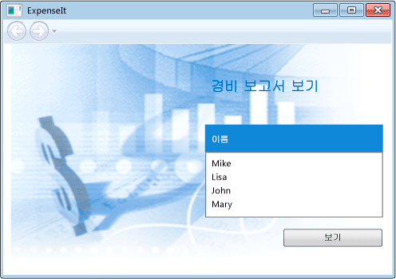
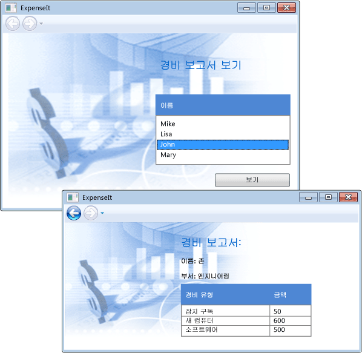

# 연습: WPF 시작
 이 연습에서는 [!INCLUDE[TLA#tla_xaml](../../../../includes/tlasharptla-xaml-md.md)] 태그, 코드 숨김, 응용 프로그램 정의, 컨트롤, 레이아웃, 데이터 바인딩, 스타일 등 대부분의 [!INCLUDE[TLA2#tla_wpf](../../../../includes/tla2sharptla-wpf-md.md)] 응용 프로그램에 공통적인 요소를 포함하는 [!INCLUDE[TLA#tla_wpf](../../../../includes/tlasharptla-wpf-md.md)] 응용 프로그램의 개발에 대해 소개합니다.  
  
 이 연습에서는 다음 단계에 따라 간단한 [!INCLUDE[TLA2#tla_wpf](../../../../includes/tla2sharptla-wpf-md.md)] 응용 프로그램을 개발하는 과정을 보여 줍니다.  
  
-   [!INCLUDE[TLA2#tla_xaml](../../../../includes/tla2sharptla-xaml-md.md)]을 정의하여 응용 프로그램의 [!INCLUDE[TLA#tla_ui](../../../../includes/tlasharptla-ui-md.md)] 모양 디자인  
  
-   코드를 작성하여 응용 프로그램 동작 빌드  
  
-   응용 프로그램 정의를 만들어 응용 프로그램 관리  
  
-   컨트롤을 추가하고 레이아웃을 만들어 응용 프로그램 [!INCLUDE[TLA2#tla_ui](../../../../includes/tla2sharptla-ui-md.md)] 구성  
  
-   스타일을 만들어 응용 프로그램 [!INCLUDE[TLA2#tla_ui](../../../../includes/tla2sharptla-ui-md.md)] 전체에서 일관된 모양 유지  
  
-   [!INCLUDE[TLA2#tla_ui](../../../../includes/tla2sharptla-ui-md.md)]를 데이터에 바인딩하여 데이터에서 [!INCLUDE[TLA2#tla_ui](../../../../includes/tla2sharptla-ui-md.md)]를 채우고 데이터와 [!INCLUDE[TLA2#tla_ui](../../../../includes/tla2sharptla-ui-md.md)]를 동기화된 상태로 유지  
  
 이 연습을 마치면 사용자가 선택한 사람에 대한 비용 보고서를 보는 데 사용할 수 있는 독립 실행형 [!INCLUDE[TLA#tla_mswin](../../../../includes/tlasharptla-mswin-md.md)] 응용 프로그램이 빌드됩니다.  이 응용 프로그램은 브라우저 스타일 창에 호스팅되는 여러 [!INCLUDE[TLA2#tla_wpf](../../../../includes/tla2sharptla-wpf-md.md)] 페이지로 구성됩니다.  
  
 이 연습을 빌드하는 데 사용되는 샘플 코드는 [!INCLUDE[TLA#tla_visualb](../../../../includes/tlasharptla-visualb-md.md)] 및 [!INCLUDE[TLA#tla_cshrp](../../../../includes/tlasharptla-cshrp-md.md)]에서 모두 사용할 수 있습니다. [Introduction to Building WPF Applications](http://go.microsoft.com/fwlink/?LinkID=160008)를 참조하십시오.  
  
   
## 사전 요구 사항  
 이 연습을 완료하려면 다음 구성 요소가 필요합니다.  
  
-   [!INCLUDE[vs_dev11_long](../../../../includes/vs-dev11-long-md.md)]  
  
 [!INCLUDE[TLA2#tla_visualstu](../../../../includes/tla2sharptla-visualstu-md.md)] 설치에 대한 자세한 내용은 [Visual Studio 설치](../Topic/Install%20Visual%20Studio%202015.md)를 참조하십시오.  
  
   
## 응용 프로그램 프로젝트 만들기  
 이 단원에서는 응용 프로그램 정의, 두 개의 페이지 및 이미지를 포함하는 응용 프로그램 인프라를 만듭니다.  
  
1.  Visual Basic 또는 Visual C\#에서 `ExpenseIt`라는 새 WPF 응용 프로그램 프로젝트를 만듭니다.  자세한 내용은 [방법: 새 WPF 응용 프로그램 프로젝트 만들기](http://msdn.microsoft.com/ko-kr/1f6aea7a-33e1-4d3f-8555-1daa42e95d82)를 참조하십시오.  
  
    > [!NOTE]
    >  이 연습에서는 .NET Framework 4에서 사용할 수 있는 <xref:System.Windows.Controls.DataGrid> 컨트롤을 사용합니다.  따라서 프로젝트의 대상이 .NET Framework 4여야 합니다.  자세한 내용은 [방법: 한 버전의 .NET Framework를 대상으로 지정](../Topic/How%20to:%20Target%20a%20Version%20of%20the%20.NET%20Framework.md)을 참조하십시오.  
  
2.  Application.xaml\(Visual Basic\) 또는 App.xaml\(C\#\)을 엽니다.  
  
     이 [!INCLUDE[TLA2#tla_xaml](../../../../includes/tla2sharptla-xaml-md.md)] 파일은 [!INCLUDE[TLA2#tla_wpf](../../../../includes/tla2sharptla-wpf-md.md)] 응용 프로그램과 응용 프로그램 리소스를 정의합니다. 이 파일을 사용하여 응용 프로그램 시작 시 자동으로 표시되는 [!INCLUDE[TLA2#tla_ui](../../../../includes/tla2sharptla-ui-md.md)]\(이 예제의 경우 MainWindow.xaml\)를 지정할 수도 있습니다.  
  
     [!INCLUDE[TLA2#tla_xaml](../../../../includes/tla2sharptla-xaml-md.md)]은 Visual Basic에서 다음과 같이 나타납니다.  
  
     [!code-xml[ExpenseIt#1_A](../../../../samples/snippets/visualbasic/VS_Snippets_Wpf/ExpenseIt/VB/ExpenseIt1_A/Application.xaml#1_a)]  
  
     C\#에서는 다음과 같이 나타납니다.  
  
     [!code-xml[ExpenseIt#1](../../../../samples/snippets/csharp/VS_Snippets_Wpf/ExpenseIt/CSharp/ExpenseIt/App.xaml#1)]  
  
3.  MainWindow.xaml을 엽니다.  
  
     이 [!INCLUDE[TLA2#tla_xaml](../../../../includes/tla2sharptla-xaml-md.md)] 파일은 응용 프로그램의 주 창이며 여러 페이지에서 만들어지는 콘텐츠를 표시합니다.  <xref:System.Windows.Window> 클래스에서는 제목, 크기 또는 아이콘 같은 창의 속성을 정의하고 닫기 또는 숨기기 같은 이벤트를 처리합니다.  
  
4.  <xref:System.Windows.Window> 요소를 <xref:System.Windows.Navigation.NavigationWindow>로 변경합니다.  
  
     이 응용 프로그램은 사용자 상호 작용에 따라 다른 콘텐츠를 탐색합니다.  따라서 주 <xref:System.Windows.Window>는 <xref:System.Windows.Navigation.NavigationWindow>로 변경되어야 합니다.  <xref:System.Windows.Navigation.NavigationWindow>는 <xref:System.Windows.Window>의 모든 속성을 상속합니다.  XAML 파일에서 <xref:System.Windows.Navigation.NavigationWindow> 요소는 <xref:System.Windows.Navigation.NavigationWindow> 클래스의 인스턴스를 만듭니다.  자세한 내용은 [탐색 개요](../../../../docs/framework/wpf/app-development/navigation-overview.md)를 참조하십시오.  
  
5.  <xref:System.Windows.Navigation.NavigationWindow> 요소의 다음 속성을 변경합니다.  
  
    -   <xref:System.Windows.Window.Title%2A> 속성을 "ExpenseIt"로 설정합니다.  
  
    -   <xref:System.Windows.FrameworkElement.Width%2A> 속성을 500픽셀로 설정합니다.  
  
    -   <xref:System.Windows.FrameworkElement.Height%2A> 속성을 350픽셀로 설정합니다.  
  
    -   <xref:System.Windows.Navigation.NavigationWindow> 태그 사이에 있는 <xref:System.Windows.Controls.Grid> 요소를 제거합니다.  
  
     [!INCLUDE[TLA2#tla_xaml](../../../../includes/tla2sharptla-xaml-md.md)]은 Visual Basic에서 다음과 같이 나타납니다.  
  
     [!code-xml[ExpenseIt#2_A](../../../../samples/snippets/visualbasic/VS_Snippets_Wpf/ExpenseIt/VB/ExpenseIt/MainWindow.xaml#2_a)]  
  
     C\#에서는 다음과 같이 나타납니다.  
  
     [!code-xml[ExpenseIt#2](../../../../samples/snippets/csharp/VS_Snippets_Wpf/ExpenseIt/CSharp/ExpenseIt/MainWindow.xaml#2)]  
  
6.  MainWindow.xaml.vb 또는 MainWindow.xaml.cs를 엽니다.  
  
     이 파일은 MainWindow.xaml에 선언된 이벤트를 처리할 코드를 포함하는 코드 숨김 파일입니다.  이 파일에는 XAML로 정의된 창에 대한 partial 클래스가 포함되어 있습니다.  
  
7.  C\#을 사용하는 경우에는 `MainWindow` 클래스가 <xref:System.Windows.Navigation.NavigationWindow>에서 파생되도록 변경합니다.  
  
     Visual Basic에서는 창을 XAML에서 변경하면 자동으로 이와 같이 변경됩니다.  
  
     코드는 다음과 같습니다.  
  
     [!code-csharp[ExpenseIt#3](../../../../samples/snippets/csharp/VS_Snippets_Wpf/ExpenseIt/CSharp/ExpenseIt/MainWindow.xaml.cs#3)]
     [!code-vb[ExpenseIt#3](../../../../samples/snippets/visualbasic/VS_Snippets_Wpf/ExpenseIt/VB/ExpenseIt1_A/MainWindow.xaml.vb#3)]  
  
   
## 응용 프로그램에 파일 추가  
 이 단원에서는 두 페이지와 이미지를 응용 프로그램에 추가합니다.  
  
1.  새 페이지\(WPF\)를 `ExpenseItHome.xaml`이라는 프로젝트에 추가합니다.  자세한 내용은 [방법: WPF 프로젝트에 새 항목 추가](http://msdn.microsoft.com/ko-kr/17e6b238-fc32-4385-98ef-2f66ca09d9ad)를 참조하십시오.  
  
     이 페이지는 응용 프로그램이 시작될 때 가장 먼저 표시됩니다.  이 페이지에서는 사용자가 비용 보고서를 표시할 사람을 선택할 수 있는 사람 목록을 표시합니다.  
  
2.  ExpenseItHome.xaml을 엽니다.  
  
3.  <xref:System.Windows.Controls.Page.Title%2A>을 "ExpenseIt \- Home"으로 설정합니다.  
  
     [!INCLUDE[TLA2#tla_xaml](../../../../includes/tla2sharptla-xaml-md.md)]은 Visual Basic에서 다음과 같이 나타납니다.  
  
     [!code-xml[ExpenseIt#6_A](../../../../samples/snippets/visualbasic/VS_Snippets_Wpf/ExpenseIt/VB/ExpenseIt1_A/ExpenseItHome.xaml#6_a)]  
  
     C\#에서는 다음과 같이 나타납니다.  
  
     [!code-xml[ExpenseIt#6](../../../../samples/snippets/csharp/VS_Snippets_Wpf/ExpenseIt/CSharp/ExpenseIt2/ExpenseItHome.xaml#6)]  
  
4.  MainWindow.xaml을 엽니다.  
  
5.  <xref:System.Windows.Navigation.NavigationWindow>의 <xref:System.Windows.Navigation.NavigationWindow.Source%2A> 속성을 "ExpenseItHome.xaml"로 설정합니다.  
  
     이렇게 설정하면 응용 프로그램 시작 시 ExpenseItHome.xaml 페이지가 첫 번째로 열리게 됩니다.  [!INCLUDE[TLA2#tla_xaml](../../../../includes/tla2sharptla-xaml-md.md)]은 Visual Basic에서 다음과 같이 나타납니다.  
  
     [!code-xml[ExpenseIt#7_A](../../../../samples/snippets/visualbasic/VS_Snippets_Wpf/ExpenseIt/VB/ExpenseIt1_A/MainWindow.xaml#7_a)]  
  
     C\#에서는 다음과 같이 나타납니다.  
  
     [!code-xml[ExpenseIt#7](../../../../samples/snippets/csharp/VS_Snippets_Wpf/ExpenseIt/CSharp/ExpenseIt2/MainWindow.xaml#7)]  
  
6.  새 페이지\(WPF\)를 `ExpenseReportPage.xaml`이라는 프로젝트에 추가합니다.  
  
     이 페이지는 ExpenseItHome.xaml에서 선택한 사람의 비용 보고서를 표시합니다.  
  
7.  ExpenseReportPage.xaml을 엽니다.  
  
8.  <xref:System.Windows.Controls.Page.Title%2A>을 "ExpenseIt \- View Expense"로 설정합니다.  
  
     [!INCLUDE[TLA2#tla_xaml](../../../../includes/tla2sharptla-xaml-md.md)]은 Visual Basic에서 다음과 같이 나타납니다.  
  
     [!code-xml[ExpenseIt#4_A](../../../../samples/snippets/visualbasic/VS_Snippets_Wpf/ExpenseIt/VB/ExpenseIt1_A/ExpenseReportPage.xaml#4_a)]  
  
     C\#에서는 다음과 같이 나타납니다.  
  
     [!code-xml[ExpenseIt#4](../../../../samples/snippets/csharp/VS_Snippets_Wpf/ExpenseIt/CSharp/ExpenseIt/ExpenseReportPage.xaml#4)]  
  
9. ExpenseItHome.xaml.vb 및 ExpenseReportPage.xaml.vb를 열거나 ExpenseItHome.xaml.cs 및 ExpenseReportPage.xaml.cs를 엽니다.  
  
     새 페이지 파일을 만들면 Visual Studio에서 자동으로 코드 숨김 파일을 만듭니다.  이러한 코드 숨김 파일은 사용자 입력에 응답하는 논리를 처리합니다.  
  
     코드는 다음과 같습니다.  
  
     [!code-csharp[ExpenseIt#2_5](../../../../samples/snippets/csharp/VS_Snippets_Wpf/ExpenseIt/CSharp/ExpenseIt2/ExpenseItHome.xaml.cs#2_5)]
     [!code-vb[ExpenseIt#2_5](../../../../samples/snippets/visualbasic/VS_Snippets_Wpf/ExpenseIt/VB/ExpenseIt1_A/ExpenseItHome.xaml.vb#2_5)]  
  
     [!code-csharp[ExpenseIt#5](../../../../samples/snippets/csharp/VS_Snippets_Wpf/ExpenseIt/CSharp/ExpenseIt/ExpenseReportPage.xaml.cs#5)]
     [!code-vb[ExpenseIt#5](../../../../samples/snippets/visualbasic/VS_Snippets_Wpf/ExpenseIt/VB/ExpenseIt1_A/ExpenseReportPage.xaml.vb#5)]  
  
10. watermark.png라는 이미지를 프로젝트에 추가합니다.  이미지를 직접 만들거나 샘플 코드에서 파일을 복사할 수 있습니다.  자세한 내용은 [NIB:How to: Add Existing Items to a Project](http://msdn.microsoft.com/ko-kr/15f4cfb7-78ab-457f-9f14-099a25a6a2d3)를 참조하십시오.  
  
   
## 응용 프로그램 빌드 및 실행  
 이 단원에서는 응용 프로그램을 빌드하고 실행합니다.  
  
1.  F5 키를 눌러 응용 프로그램을 빌드 및 실행하거나 **디버그** 메뉴에서 **디버깅 시작**을 선택합니다.  
  
     다음 그림에서는 <xref:System.Windows.Navigation.NavigationWindow> 단추가 있는 응용 프로그램을 보여 줍니다.  
  
       
  
2.  응용 프로그램을 닫고 [!INCLUDE[vsprvs](../../../../includes/vsprvs-md.md)]로 돌아갑니다.  
  
   
## 레이아웃 만들기  
 레이아웃을 사용하면 [!INCLUDE[TLA2#tla_ui](../../../../includes/tla2sharptla-ui-md.md)] 요소를 순서대로 배치하고 [!INCLUDE[TLA2#tla_ui](../../../../includes/tla2sharptla-ui-md.md)]의 크기 조정 시 이러한 요소의 크기와 위치를 관리할 수 있습니다.  일반적으로 다음과 같은 레이아웃 컨트롤 중 하나를 사용하여 레이아웃을 만듭니다.  
  
-   <xref:System.Windows.Controls.Canvas>  
  
-   <xref:System.Windows.Controls.DockPanel>  
  
-   <xref:System.Windows.Controls.Grid>  
  
-   <xref:System.Windows.Controls.StackPanel>  
  
-   <xref:System.Windows.Controls.VirtualizingStackPanel>  
  
-   <xref:System.Windows.Controls.WrapPanel>  
  
 이러한 각 레이아웃 컨트롤은 해당 자식 요소에 대해 특수 레이아웃 형식을 지원합니다.  ExpenseIt 페이지는 크기를 조정할 수 있으며 각 페이지의 요소는 다른 요소와 수평 및 수직으로 정렬됩니다.  따라서 <xref:System.Windows.Controls.Grid>가 응용 프로그램에 적합한 레이아웃 요소입니다.  
  
> [!NOTE]
>  <xref:System.Windows.Controls.Panel> 요소에 대한 자세한 내용은 [Panel 개요](../../../../docs/framework/wpf/controls/panels-overview.md)를 참조하십시오.  레이아웃에 대한 자세한 내용은 [레이아웃](../../../../docs/framework/wpf/advanced/layout.md)을 참조하십시오.  
  
 이 단원에서는 ExpenseItHome.xaml의 <xref:System.Windows.Controls.Grid>에 열 및 행 정의를 추가하여 여백이 10픽셀이고 행이 3개인 단일 열 테이블을 만듭니다.  
  
1.  ExpenseItHome.xaml을 엽니다.  
  
2.  <xref:System.Windows.Controls.Grid> 요소의 <xref:System.Windows.FrameworkElement.Margin%2A> 속성을 왼쪽, 위쪽, 오른쪽 및 아래쪽 여백에 해당하는 값인 "10,0,10,10"으로 설정합니다.  
  
3.  <xref:System.Windows.Controls.Grid> 태그 사이에 다음 [!INCLUDE[TLA2#tla_xaml](../../../../includes/tla2sharptla-xaml-md.md)]을 추가하여 행 및 열 정의를 만듭니다.  
  
     [!code-xml[ExpenseIt#8](../../../../samples/snippets/csharp/VS_Snippets_Wpf/ExpenseIt/CSharp/ExpenseIt3/ExpenseItHome.xaml#8)]  
  
     두 행의 <xref:System.Windows.Controls.RowDefinition.Height%2A>는 행의 크기가 해당 행의 콘텐츠에 따라 결정됨을 의미하는 <xref:System.Windows.GridLength.Auto%2A>로 설정됩니다.  기본 <xref:System.Windows.Controls.RowDefinition.Height%2A>는 사용 가능한 공간에 대한 가중치에 따라 행의 높이가 결정됨을 의미하는 <xref:System.Windows.GridUnitType> 크기 조정입니다.  예를 들어 두 행의 높이가 각각 "\*"이면 사용 가능한 공간의 절반에 해당하는 높이를 갖게 됩니다.  
  
     이제 <xref:System.Windows.Controls.Grid>는 다음 XAML과 같습니다.  
  
     [!code-xml[ExpenseIt#9](../../../../samples/snippets/csharp/VS_Snippets_Wpf/ExpenseIt/CSharp/ExpenseIt3/ExpenseItHome.xaml#9)]  
  
   
## 컨트롤 추가  
 이 단원에서는 사용자가 선택한 사람에 대한 비용 보고서를 표시하기 위해 선택할 수 있는 사람 목록이 표시되도록 홈 페이지 [!INCLUDE[TLA2#tla_ui](../../../../includes/tla2sharptla-ui-md.md)]를 업데이트합니다.  컨트롤은 사용자가 응용 프로그램과 상호 작용할 수 있게 하는 UI 개체입니다.  자세한 내용은 [컨트롤](../../../../docs/framework/wpf/controls/index.md)를 참조하십시오.  
  
 이 [!INCLUDE[TLA2#tla_ui](../../../../includes/tla2sharptla-ui-md.md)]를 만들려면 ExpenseItHome.xaml에 다음 요소를 추가합니다.  
  
-   <xref:System.Windows.Controls.ListBox>\(사람 목록에 사용\)  
  
-   <xref:System.Windows.Controls.Label>\(목록 머리글에 사용\)  
  
-   <xref:System.Windows.Controls.Button>\(목록에서 선택한 사람의 비용 보고서를 보기 위해 클릭하는 데 사용\)  
  
 각 컨트롤은 연결된 속성 <xref:System.Windows.Controls.Grid.Row%2A?displayProperty=fullName>를 설정하여 <xref:System.Windows.Controls.Grid>의 행에 배치됩니다.  연결된 속성에 대한 자세한 내용은 [연결된 속성 개요](../../../../docs/framework/wpf/advanced/attached-properties-overview.md)를 참조하십시오.  
  
1.  ExpenseItHome.xaml을 엽니다.  
  
2.  다음 [!INCLUDE[TLA2#tla_xaml](../../../../includes/tla2sharptla-xaml-md.md)]을 <xref:System.Windows.Controls.Grid> 태그 사이에 추가합니다.  
  
     [!code-xml[ExpenseIt#10](../../../../samples/snippets/csharp/VS_Snippets_Wpf/ExpenseIt/CSharp/ExpenseIt4/ExpenseItHome.xaml#10)]  
  
3.  응용 프로그램을 빌드하고 실행합니다.  
  
 다음 그림에서는 XAML을 사용하여 이 단원에서 만든 컨트롤을 보여 줍니다.  
  
   
  
   
## 이미지 및 제목 추가  
 이 단원에서는 이미지와 페이지 제목을 사용하여 홈 페이지 [!INCLUDE[TLA2#tla_ui](../../../../includes/tla2sharptla-ui-md.md)]를 업데이트합니다.  
  
1.  ExpenseItHome.xaml을 엽니다.  
  
2.  <xref:System.Windows.Controls.ColumnDefinition.Width%2A>가 230픽셀로 고정된 <xref:System.Windows.Controls.Grid.ColumnDefinitions%2A>에 또 다른 열을 추가합니다.  
  
     [!code-xml[ExpenseIt#11](../../../../samples/snippets/csharp/VS_Snippets_Wpf/ExpenseIt/CSharp/ExpenseIt5/ExpenseItHome.xaml#11)]  
  
3.  <xref:System.Windows.Controls.Grid.RowDefinitions%2A>에 다른 열을 추가합니다.  
  
     [!code-xml[ExpenseIt#11b](../../../../samples/snippets/csharp/VS_Snippets_Wpf/ExpenseIt/CSharp/ExpenseIt5/ExpenseItHome.xaml#11b)]  
  
4.  <xref:System.Windows.Controls.Grid.Column%2A?displayProperty=fullName>을 1로 설정하여 컨트롤을 두 번째 열로 이동합니다.  <xref:System.Windows.Controls.Grid.Row%2A?displayProperty=fullName>를 1로 늘려 행 아래로 각 컨트롤을 이동합니다.  
  
     [!code-xml[ExpenseIt#12](../../../../samples/snippets/csharp/VS_Snippets_Wpf/ExpenseIt/CSharp/ExpenseIt5/ExpenseItHome.xaml#12)]  
  
5.  <xref:System.Windows.Controls.Grid>의 <xref:System.Windows.Controls.Panel.Background%2A>를 watermark.png 이미지 파일로 설정합니다.  
  
     [!code-xml[ExpenseIt#14](../../../../samples/snippets/csharp/VS_Snippets_Wpf/ExpenseIt/CSharp/ExpenseIt5/ExpenseItHome.xaml#14)]  
  
6.  <xref:System.Windows.Controls.Border> 앞에 콘텐츠가 "View Expense Report"인 <xref:System.Windows.Controls.Label>을 추가하여 해당 페이지의 제목으로 지정합니다.  
  
     [!code-xml[ExpenseIt#13](../../../../samples/snippets/csharp/VS_Snippets_Wpf/ExpenseIt/CSharp/ExpenseIt5/ExpenseItHome.xaml#13)]  
  
7.  응용 프로그램을 빌드하고 실행합니다.  
  
 다음 그림에서는 이 단원의 결과를 보여 줍니다.  
  
   
  
   
## 이벤트 처리 코드 추가  
  
1.  ExpenseItHome.xaml을 엽니다.  
  
2.  <xref:System.Windows.Controls.Button> 요소에 <xref:System.Windows.Controls.Primitives.ButtonBase.Click> 이벤트 처리기를 추가합니다.  자세한 내용은 [방법: 단순한 이벤트 처리기 만들기](http://msdn.microsoft.com/ko-kr/b1456e07-9dec-4354-99cf-18666b64f480)를 참조하십시오.  
  
     [!code-xml[ExpenseIt#15](../../../../samples/snippets/csharp/VS_Snippets_Wpf/ExpenseIt/CSharp/ExpenseIt6/ExpenseItHome.xaml#15)]  
  
3.  ExpenseItHome.xaml.vb 또는 ExpenseItHome.xaml.cs를 엽니다.  
  
4.  창이 ExpenseReportPage.xaml 파일을 탐색하도록 하는 다음 코드를 <xref:System.Windows.Controls.Primitives.ButtonBase.Click> 이벤트 처리기에 추가합니다.  
  
     [!code-csharp[ExpenseIt#16](../../../../samples/snippets/csharp/VS_Snippets_Wpf/ExpenseIt/CSharp/ExpenseIt6/ExpenseItHome.xaml.cs#16)]
     [!code-vb[ExpenseIt#16](../../../../samples/snippets/visualbasic/VS_Snippets_Wpf/ExpenseIt/VB/ExpenseIt6/ExpenseItHome.xaml.vb#16)]  
  
   
## ExpenseReportPage의 UI 만들기  
 ExpenseReportPage.xaml은 ExpenseItHome.xaml에서 선택한 사람의 비용 보고서를 표시합니다.  이 단원에서는 컨트롤을 추가하고 ExpenseReportPage.xaml 관련 [!INCLUDE[TLA2#tla_ui](../../../../includes/tla2sharptla-ui-md.md)]를 만듭니다.  또한 이 단원에서는 [!INCLUDE[TLA2#tla_ui](../../../../includes/tla2sharptla-ui-md.md)] 요소에 배경 및 채우기 색도 추가합니다.  
  
1.  ExpenseReportPage.xaml을 엽니다.  
  
2.  <xref:System.Windows.Controls.Grid> 태그 사이에 다음 XAML을 추가합니다.  
  
     이 UI는 보고서 데이터가 <xref:System.Windows.Controls.DataGrid>에 표시된다는 점을 제외하고는 ExpenseItHome.xaml에 만든 UI와 비슷합니다.  
  
     [!code-xml[ExpenseIt#17](../../../../samples/snippets/csharp/VS_Snippets_Wpf/ExpenseIt/CSharp/ExpenseIt6/ExpenseReportPage.xaml#17)]  
  
3.  응용 프로그램을 빌드하고 실행합니다.  
  
    > [!NOTE]
    >  <xref:System.Windows.Controls.DataGrid>를 찾지 못했다거나 이 컨트롤이 없다는 오류가 나타나면 프로젝트의 대상이 .NET Framework 4인지 확인합니다.  자세한 내용은 [방법: 한 버전의 .NET Framework를 대상으로 지정](../Topic/How%20to:%20Target%20a%20Version%20of%20the%20.NET%20Framework.md)을 참조하십시오.  
  
4.  **View** 단추를 클릭합니다.  
  
     비용 보고서 페이지가 나타납니다.  
  
 다음 그림에서는 ExpenseReportPage.xaml에 추가된 [!INCLUDE[TLA2#tla_ui](../../../../includes/tla2sharptla-ui-md.md)] 요소를 보여 줍니다.  뒤로 탐색 단추는 사용할 수 없습니다.  
  
   
  
   
## 컨트롤 스타일 설정  
 [!INCLUDE[TLA2#tla_ui](../../../../includes/tla2sharptla-ui-md.md)]에서는 같은 형식의 모든 요소에 대해 다양한 요소의 모양이 동일한 경우가 많습니다.  [!INCLUDE[TLA2#tla_ui](../../../../includes/tla2sharptla-ui-md.md)]에서는 스타일을 통해 여러 요소에서 모양을 다시 사용할 수 있습니다.  다시 사용 가능한 스타일을 통해 [!INCLUDE[TLA2#tla_xaml](../../../../includes/tla2sharptla-xaml-md.md)] 만들기 및 관리 작업이 간단해집니다.  스타일에 대한 자세한 내용은 [스타일 지정 및 템플릿](../../../../docs/framework/wpf/controls/styling-and-templating.md)을 참조하십시오.  이 단원에서는 이전 단계에서 정의한 요소별 특성을 스타일로 바꿉니다.  
  
1.  Application.xaml 또는 App.xaml을 엽니다.  
  
2.  <xref:System.Windows.Application.Resources%2A?displayProperty=fullName> 태그 사이에 다음 XAML을 추가합니다.  
  
     [!code-xml[ExpenseIt#18](../../../../samples/snippets/csharp/VS_Snippets_Wpf/ExpenseIt/CSharp/ExpenseIt7/App.xaml#18)]  
  
     이 [!INCLUDE[TLA2#tla_xaml](../../../../includes/tla2sharptla-xaml-md.md)]에서는 다음 스타일을 추가합니다.  
  
    -   `headerTextStyle`: 페이지 제목 <xref:System.Windows.Controls.Label>의 서식을 지정합니다.  
  
    -   `labelStyle`: <xref:System.Windows.Controls.Label> 컨트롤의 서식을 지정합니다.  
  
    -   `columnHeaderStyle`: <xref:System.Windows.Controls.Primitives.DataGridColumnHeader>의 서식을 지정합니다.  
  
    -   `listHeaderStyle`: 목록 머리글 <xref:System.Windows.Controls.Border> 컨트롤의 서식을 지정합니다.  
  
    -   `listHeaderTextStyle`: 목록 머리글 <xref:System.Windows.Controls.Label>의 서식을 지정합니다.  
  
    -   `buttonStyle`: ExpenseItHome.xaml에 있는 <xref:System.Windows.Controls.Button>의 서식을 지정합니다.  
  
     스타일은 <xref:System.Windows.Application.Resources%2A?displayProperty=fullName> 속성 요소의 자식이며 리소스입니다.  이 위치의 스타일은 응용 프로그램의 모든 요소에 적용됩니다.  [!INCLUDE[TLA2#tla_winfx](../../../../includes/tla2sharptla-winfx-md.md)] 응용 프로그램의 리소스를 사용하는 예제는 [응용 프로그램 리소스 사용](../../../../docs/framework/wpf/advanced/how-to-use-application-resources.md)을 참조하십시오.  
  
3.  ExpenseItHome.xaml을 엽니다.  
  
4.  <xref:System.Windows.Controls.Grid> 요소 사이의 모든 내용을 다음 XAML로 바꿉니다.  
  
     [!code-xml[ExpenseIt#19](../../../../samples/snippets/csharp/VS_Snippets_Wpf/ExpenseIt/CSharp/ExpenseIt7/ExpenseItHome.xaml#19)]  
  
     각 컨트롤의 모양을 정의하는 <xref:System.Windows.VerticalAlignment> 및 <xref:System.Windows.Media.FontFamily> 같은 속성은 스타일을 적용하면 제거 및 대체됩니다.  예를 들어 `headerTextStyle`은 <xref:System.Windows.Controls.Label> "View Expense Report"에 적용됩니다.  
  
5.  ExpenseReportPage.xaml을 엽니다.  
  
6.  <xref:System.Windows.Controls.Grid> 요소 사이의 모든 내용을 다음 XAML로 바꿉니다.  
  
     [!code-xml[ExpenseIt#20](../../../../samples/snippets/csharp/VS_Snippets_Wpf/ExpenseIt/CSharp/ExpenseIt7/ExpenseReportPage.xaml#20)]  
  
     이렇게 하면 <xref:System.Windows.Controls.Label> 및 <xref:System.Windows.Controls.Border> 요소에 스타일이 추가됩니다.  
  
7.  응용 프로그램을 빌드하고 실행합니다.  
  
     이 단원에서 [!INCLUDE[TLA2#tla_xaml](../../../../includes/tla2sharptla-xaml-md.md)]을 추가하면 응용 프로그램의 모양이 스타일을 사용하여 업데이트하기 전과 동일해집니다.  
  
   
## 컨트롤에 데이터 바인딩  
 이 단원에서는 다양한 컨트롤에 바인딩되는 [!INCLUDE[TLA#tla_xml](../../../../includes/tlasharptla-xml-md.md)] 데이터를 만듭니다.  
  
1.  ExpenseItHome.xaml을 엽니다.  
  
2.  <xref:System.Windows.Controls.Grid> 요소를 연 후 다음 XAML을 추가하여 각 개인에 대한 데이터를 포함하는 <xref:System.Windows.Data.XmlDataProvider>를 만듭니다.  
  
     데이터는 <xref:System.Windows.Controls.Grid> 리소스로 만들어집니다.  일반적으로 이 데이터는 파일로 로드되지만 간단하게 인라인으로 추가될 수도 있습니다.  
  
     [!code-xml[ExpenseIt#21](../../../../samples/snippets/csharp/VS_Snippets_Wpf/ExpenseIt/CSharp/ExpenseIt8/ExpenseItHome.xaml#21)]  
    [!code-xml[ExpenseIt#23](../../../../samples/snippets/csharp/VS_Snippets_Wpf/ExpenseIt/CSharp/ExpenseIt8/ExpenseItHome.xaml#23)]  
    [!code-xml[ExpenseIt#22](../../../../samples/snippets/csharp/VS_Snippets_Wpf/ExpenseIt/CSharp/ExpenseIt8/ExpenseItHome.xaml#22)]  
  
3.  <xref:System.Windows.Controls.Grid> 리소스에서 다음 <xref:System.Windows.DataTemplate>을 추가하여 <xref:System.Windows.Controls.ListBox>에서 데이터가 표시되는 방식을 정의합니다.  데이터 템플릿에 대한 자세한 내용은 [데이터 템플릿 개요](../../../../docs/framework/wpf/data/data-templating-overview.md)를 참조하십시오.  
  
     [!code-xml[ExpenseIt#21](../../../../samples/snippets/csharp/VS_Snippets_Wpf/ExpenseIt/CSharp/ExpenseIt8/ExpenseItHome.xaml#21)]  
    [!code-xml[ExpenseIt#24](../../../../samples/snippets/csharp/VS_Snippets_Wpf/ExpenseIt/CSharp/ExpenseIt8/ExpenseItHome.xaml#24)]  
    [!code-xml[ExpenseIt#22](../../../../samples/snippets/csharp/VS_Snippets_Wpf/ExpenseIt/CSharp/ExpenseIt8/ExpenseItHome.xaml#22)]  
  
4.  기존 <xref:System.Windows.Controls.ListBox>를 다음 XAML로 바꿉니다.  
  
     [!code-xml[ExpenseIt#25](../../../../samples/snippets/csharp/VS_Snippets_Wpf/ExpenseIt/CSharp/ExpenseIt8/ExpenseItHome.xaml#25)]  
  
     이 XAML은 <xref:System.Windows.Controls.ListBox>의 <xref:System.Windows.Controls.ItemsControl.ItemsSource%2A> 속성을 데이터 소스에 바인딩하고 데이터 템플릿을 <xref:System.Windows.Controls.ItemsControl.ItemTemplate%2A>으로 적용합니다.  
  
   
## 컨트롤에 데이터 연결  
 이 단원에서는 ExpenseItHome.xaml의 사람 목록에서 선택한 현재 항목을 검색하는 코드를 작성하고 인스턴스화 중 이에 대한 참조를 `ExpenseReportPage`의 생성자에 전달합니다.  `ExpenseReportPage`는 전달된 항목을 사용하여 해당 데이터 컨텍스트를 설정하고 ExpenseReportPage.xaml에서 정의한 컨트롤을 이 컨텍스트에 바인딩합니다.  
  
1.  ExpenseReportPage.xaml.vb 또는 ExpenseReportPage.xaml.cs를 엽니다.  
  
2.  선택한 사람의 비용 보고서 데이터를 전달할 수 있도록 개체를 받아들이는 생성자를 추가합니다.  
  
     [!code-csharp[ExpenseIt#26](../../../../samples/snippets/csharp/VS_Snippets_Wpf/ExpenseIt/CSharp/ExpenseIt8/ExpenseReportPage.xaml.cs#26)]
     [!code-vb[ExpenseIt#26](../../../../samples/snippets/visualbasic/VS_Snippets_Wpf/ExpenseIt/VB/ExpenseIt8/ExpenseReportPage.xaml.vb#26)]  
  
3.  ExpenseItHome.xaml.vb 또는 ExpenseItHome.xaml.cs를 엽니다.  
  
4.  선택한 사람의 비용 보고서 데이터를 전달하는 새 생성자를 호출하도록 <xref:System.Windows.Controls.Primitives.ButtonBase.Click> 이벤트 처리기를 변경합니다.  
  
     [!code-csharp[ExpenseIt#27](../../../../samples/snippets/csharp/VS_Snippets_Wpf/ExpenseIt/CSharp/ExpenseIt8/ExpenseItHome.xaml.cs#27)]
     [!code-vb[ExpenseIt#27](../../../../samples/snippets/visualbasic/VS_Snippets_Wpf/ExpenseIt/VB/ExpenseIt8/ExpenseItHome.xaml.vb#27)]  
  
   
## 데이터 템플릿을 사용하여 데이터에 스타일 지정  
 이 단원에서는 데이터 바인딩된 목록의 각 항목에 대한 [!INCLUDE[TLA2#tla_ui](../../../../includes/tla2sharptla-ui-md.md)]를 데이터 템플릿을 사용하여 업데이트합니다.  
  
1.  ExpenseReportPage.xaml을 엽니다.  
  
2.  "Name" 및 "Department" <xref:System.Windows.Controls.Label> 요소의 콘텐츠를 해당하는 데이터 소스에 올바르게 바인딩합니다.  데이터 바인딩에 대한 자세한 내용은 [데이터 바인딩 개요](../../../../docs/framework/wpf/data/data-binding-overview.md)를 참조하십시오.  
  
     [!code-xml[ExpenseIt#31](../../../../samples/snippets/csharp/VS_Snippets_Wpf/ExpenseIt/CSharp/ExpenseIt9/ExpenseReportPage.xaml#31)]  
  
3.  <xref:System.Windows.Controls.Grid> 요소를 연 후 비용 보고서 데이터 표시 방법을 정의하는 다음 데이터 템플릿을 추가합니다.  
  
     [!code-xml[ExpenseIt#30](../../../../samples/snippets/csharp/VS_Snippets_Wpf/ExpenseIt/CSharp/ExpenseIt9/ExpenseReportPage.xaml#30)]  
  
4.  비용 보고서 데이터를 표시하는 템플릿을 <xref:System.Windows.Controls.DataGrid> 열에 추가합니다.  
  
     [!code-xml[ExpenseIt#32](../../../../samples/snippets/csharp/VS_Snippets_Wpf/ExpenseIt/CSharp/ExpenseIt9/ExpenseReportPage.xaml#32)]  
  
5.  응용 프로그램을 빌드하고 실행합니다.  
  
6.  사람을 선택하고 **View** 단추를 클릭합니다.  
  
 다음 그림에서는 컨트롤, 레이아웃, 스타일, 데이터 바인딩 및 데이터 템플릿을 적용한 ExpenseIt 응용 프로그램의 두 페이지를 보여 줍니다.  
  
   
  
   
## 최선의 구현 방법  
 이 샘플에서는 WPF의 특정 기능에 대해 설명하므로 최선의 응용 프로그램 개발 방법을 따르지 않습니다.  [!INCLUDE[TLA2#tla_winclient](../../../../includes/tla2sharptla-winclient-md.md)] 및 [!INCLUDE[TLA2#tla_winfx](../../../../includes/tla2sharptla-winfx-md.md)] 응용 프로그램 개발을 위한 최선의 방법에 대한 자세한 내용은 다음에서 적절한 항목을 참조하십시오.  
  
-   내게 필요한 옵션 \- [액세스 가능성에 대한 유용한 정보](../../../../docs/framework/ui-automation/accessibility-best-practices.md)  
  
-   보안 \- [보안](../../../../docs/framework/wpf/security-wpf.md)  
  
-   지역화 \- [WPF 전역화 및 지역화 개요](../../../../docs/framework/wpf/advanced/wpf-globalization-and-localization-overview.md)  
  
-   성능 \- [WPF 응용 프로그램 성능 최적화](../../../../docs/framework/wpf/advanced/optimizing-wpf-application-performance.md)  
  
   
## 새로운 기능  
 [!INCLUDE[TLA#tla_winclient](../../../../includes/tlasharptla-winclient-md.md)]을 사용하여 [!INCLUDE[TLA2#tla_ui](../../../../includes/tla2sharptla-ui-md.md)]를 만들 수 있는 여러 기술을 배웠습니다.  이제 데이터 바인딩된 [!INCLUDE[TLA2#tla_winfx](../../../../includes/tla2sharptla-winfx-md.md)] 응용 프로그램의 기본 빌딩 블록에 대해 잘 이해할 것입니다.  이 항목에서는 모든 내용을 다루지는 않지만 이 항목에 제공된 기술 이외의 새로운 가능성을 탐색하는 계기를 스스로 마련해 볼 수 있습니다.  
  
 WPF 아키텍처 및 프로그래밍 모델에 대한 자세한 내용은 다음 항목을 참조하십시오.  
  
-   [WPF 아키텍처](../../../../docs/framework/wpf/advanced/wpf-architecture.md)  
  
-   [XAML 개요\(WPF\)](../../../../docs/framework/wpf/advanced/xaml-overview-wpf.md)  
  
-   [종속성 속성 개요](../../../../docs/framework/wpf/advanced/dependency-properties-overview.md)  
  
-   [레이아웃](../../../../docs/framework/wpf/advanced/layout.md)  
  
 응용 프로그램 만들기에 대한 자세한 내용은 다음 도움말 항목을 참조하십시오.  
  
-   [응용 프로그램 개발](../../../../docs/framework/wpf/app-development/index.md)  
  
-   [컨트롤](../../../../docs/framework/wpf/controls/index.md)  
  
-   [데이터 바인딩 개요](../../../../docs/framework/wpf/data/data-binding-overview.md)  
  
-   [그래픽 및 멀티미디어](../../../../docs/framework/wpf/graphics-multimedia/index.md)  
  
-   [WPF의 문서](../../../../docs/framework/wpf/advanced/documents-in-wpf.md)  
  
## 참고 항목  
 [Panel 개요](../../../../docs/framework/wpf/controls/panels-overview.md)   
 [데이터 템플릿 개요](../../../../docs/framework/wpf/data/data-templating-overview.md)   
 [WPF 응용 프로그램 만들기](../../../../docs/framework/wpf/app-development/building-a-wpf-application-wpf.md)   
 [스타일 및 템플릿](../../../../docs/framework/wpf/controls/styles-and-templates.md)