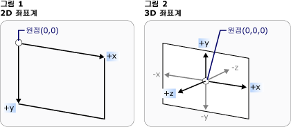
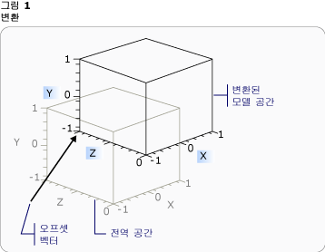
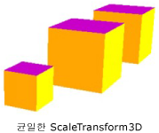
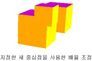
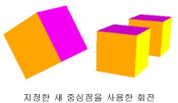
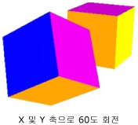

# 3차원 변환 개요
이 항목에서는 [!INCLUDE[TLA#tla_winclient](../../../../includes/tlasharptla-winclient-md.md)] 그래픽 시스템에서 3차원 모델에 변환을 적용하는 방법을 설명합니다. 변환을 사용하면 개발자가 해당 항목을 정의하는 기준 값을 변경하지 않고도 모델의 위치, 크기 및 방향을 변경할 수 있습니다.  
  

  
## 3차원 좌표 공간  
 3 차원 그래픽 콘텐츠 [!INCLUDE[TLA#tla_winclient](../../../../includes/tlasharptla-winclient-md.md)] 요소에는 캡슐화 된 <xref:System.Windows.Controls.Viewport3D>, 2 차원 요소 구조에 참여할 수 있는 합니다. 그래픽 시스템에서는 Viewport3D를 [!INCLUDE[TLA#tla_winclient](../../../../includes/tlasharptla-winclient-md.md)]의 다른 많은 요소처럼 2차원 시각적 요소로 처리합니다. Viewport3D는 3차원 장면을 보여 주는 창(뷰포트)으로 작동합니다. 보다 정확히 말해 이는 3차원 장면이 프로젝션되는 표면입니다.  동일한 장면 그래프에서 Viewport3D를 다른 2차원 그리기 개체와 함께 사용할 수 있지만 Viewport3D 내에서 2차원 및 3차원 개체가 상호 침투할 수 없습니다. 다음에서 설명하는 좌표 공간은 Viewport3D 요소에 의해 포함됩니다.  
  
 2차원 그래픽의 [!INCLUDE[TLA#tla_winclient](../../../../includes/tlasharptla-winclient-md.md)] 좌표계는 렌더링 표면(일반적으로 화면)의 왼쪽 위에서 원점을 찾습니다. 2차원 시스템에서 양의 x-축 값은 오른쪽으로 진행되고 양의 y-축 값은 아래로 진행됩니다. 그러나 3차원 좌표계에서는 원점이 화면의 중앙에 있습니다. 여기서 양의 x-축 값은 오른쪽으로 진행되고 양의 y-축 값은 위로 진행되며 양의 z-축 값은 원점에서 뷰어를 향해 바깥쪽으로 진행됩니다.  
  
   
좌표계 비교  
  
 이러한 축으로 정의되는 공간은 [!INCLUDE[TLA#tla_winclient](../../../../includes/tlasharptla-winclient-md.md)]의 3차원 개체에 대한 고정 참조 프레임입니다. 이 공간에서 모델을 빌드하고 이를 보기 위한 광원과 카메라를 만들 때는 변환 적용 시 각 모델에 대해 만드는 로컬 참조 프레임을 이 고정 참조 프레임 또는 "월드 공간"과 구분하면 유용합니다. 또한 월드 공간의 개체는 광원 및 카메라 설정에 따라 완전히 다르게 보이거나 전혀 보이지 않을 수 있지만 카메라의 위치는 월드 공간에서 개체의 위치를 변경하지 않습니다.  
  
## 모델 변환  
 모델을 만들 때 모델에는 장면에서의 특정 위치가 지정됩니다. 장면에서 이러한 모델을 이동하거나, 회전하거나, 크기를 변경하기 위해 모델 자체를 정의하는 꼭짓점을 변경하는 것은 비효율적입니다. 대신 2차원에서와 같이 모델에 변환을 적용합니다.  
  
 각 모델 개체에는 <xref:System.Windows.Media.Media3D.Model3D.Transform%2A> 속성을 이동할 수, 방향을 다시 지정 하거나 모델의 크기를 조정 합니다. 변환을 적용할 때는 변환에 의해 지정된 벡터 또는 값이 무엇이든 실제적으로 모델의 모든 점을 오프셋합니다. 즉, 모델이 정의된 좌표 공간("모델 공간")은 변환하지만 장면 전체("월드 공간")의 좌표계에서 모델의 기하 도형을 구성하는 값은 변경하지 않습니다.  
  
## 좌표 이동 변환  
 3 차원 변환의 추상 기본 클래스에서 상속 <xref:System.Windows.Media.Media3D.Transform3D>; 여기에 3x3 유사 변환 클래스 <xref:System.Windows.Media.Media3D.TranslateTransform3D>, <xref:System.Windows.Media.Media3D.ScaleTransform3D>, 및 <xref:System.Windows.Media.Media3D.RotateTransform3D>합니다. [!INCLUDE[TLA#tla_winclient](../../../../includes/tlasharptla-winclient-md.md)] 3 차원 인터페이스도 제공는 <xref:System.Windows.Media.Media3D.MatrixTransform3D> 수 있는 클래스 보다 간결 하 게 행렬 작업에 동일한 변환을 지정 합니다.  
  
 <xref:System.Windows.Media.Media3D.TranslateTransform3D>모든 지점 방향으로 사용 하 여 지정한 오프셋된 벡터 Model3D의 이동은 <xref:System.Windows.Media.Media3D.TranslateTransform3D.OffsetX%2A>, <xref:System.Windows.Media.Media3D.TranslateTransform3D.OffsetY%2A>, 및 <xref:System.Windows.Media.Media3D.TranslateTransform3D.OffsetZ%2A> 속성. 예를 들어 큐브의 꼭짓점 하나가 (2,2,2)에 있고 오프셋 벡터가 (0,1.6,1)인 경우 해당 꼭짓점 (2,2,2)가 (2,3.6,3)으로 이동합니다. 모델 공간에서 큐브의 꼭짓점은 계속 (2,2,2)이지만 이제 모델 공간의 (2,2,2)가 월드 공간의 (2,3.6,3)이 되도록 모델 공간과 월드 공간의 관계가 변경되었습니다.  
  
   
오프셋을 사용한 좌표 이동  
  
 다음 코드 예제에서는 좌표 이동을 적용하는 방법을 보여 줍니다.  
  
 [!code-xaml[animation3dgallery_snip#Translation3DAnimationExampleWholePage](../../../../samples/snippets/csharp/VS_Snippets_Wpf/Animation3DGallery_snip/CS/Translation3DAnimationExample.xaml#translation3danimationexamplewholepage)]  
  
## 배율 변환  
 <xref:System.Windows.Media.Media3D.ScaleTransform3D>지정 된 크기 조정 벡터 중심점을 기준으로 모델의 배율을 변경합니다. X, Y 및 Z축에서 모델의 배율을 같은 값으로 조정하는 균일한 배율을 지정하면 모델의 크기를 비례적으로 변경할 수 있습니다. 예를 들어 변환 설정 <xref:System.Windows.Media.ScaleTransform.ScaleX%2A>, <xref:System.Windows.Media.ScaleTransform.ScaleY%2A>, 및 <xref:System.Windows.Media.Media3D.ScaleTransform3D.ScaleZ%2A> 분모를 모델의 크기 속성을 0.5로; 모든 세 개의 축에 배율 두 배로 만듭니다 동일한 속성을 2로 설정 합니다.  
  
   
ScaleVector 예제  
  
 균일하지 않은 배율 변환(X, Y 및 Z 값이 모두 같지 않은 배율 변환)을 지정하면 다른 모델에 영향을 주지 않으면서 모델을 1차원 또는 2차원에서 늘리거나 줄일 수 있습니다. 예를 들어 설정 <xref:System.Windows.Media.ScaleTransform.ScaleX%2A> 1로 <xref:System.Windows.Media.ScaleTransform.ScaleY%2A> 2로 및 <xref:System.Windows.Media.Media3D.ScaleTransform3D.ScaleZ%2A> 1로 인해 변형 된 모델을 높이 두 배가 있지만 X 및 Z 축을 따라 바뀌지 않습니다.  
  
 기본적으로 ScaleTransform3D에서는 꼭짓점이 원점 (0,0,0)을 기준으로 확장 또는 축소됩니다. 그러나 변환할 모델이 원점에서 그려지지 않은 경우 모델의 배율을 원점에서 조정하면 모델이 "현재 위치"에서 배율 조정되지 않습니다. 대신 모델의 꼭짓점에 배율 벡터를 곱하면 배율 조정 작업은 모델을 배율 조정할 뿐만 아니라 모델의 좌표를 이동합니다.  
  
   
ScaleCenter 예제  
  
 "에서"전체 모델의 크기를 조정 하는 ScaleTransform3D를 설정 하 여 모델의 중심을 지정 <xref:System.Windows.Media.ScaleTransform.CenterX%2A>, <xref:System.Windows.Media.ScaleTransform.CenterY%2A>, 및 <xref:System.Windows.Media.Media3D.ScaleTransform3D.CenterZ%2A> 속성입니다. 이렇게 하면 그래픽 시스템 모델 공간 크기를 조정 하 고 다음 변환에 지정 된 중점 <xref:System.Windows.Media.Media3D.Point3D>합니다. 반대로 모델을 원점을 기준으로 빌드한 경우 다른 중심점을 지정하면 모델이 원점에서 먼 쪽으로 좌표 이동합니다.  
  
## 회전 변환  
 3차원에서 모델을 여러 방법으로 회전할 수 있습니다. 일반적인 회전 변환에서는 축과 해당 축을 기준으로 하는 회전 각도를 지정합니다. <xref:System.Windows.Media.Media3D.RotateTransform3D> 클래스를 사용 하면 정의 하는 <xref:System.Windows.Media.Media3D.Rotation3D> 와 해당 <xref:System.Windows.Media.Media3D.RotateTransform3D.Rotation%2A> 속성입니다. 그런 다음 지정 <xref:System.Windows.Media.Media3D.AxisAngleRotation3D.Axis%2A> 및 <xref:System.Windows.Media.Media3D.AxisAngleRotation3D.Angle%2A> 속성 Rotation3D,이 경우에 <xref:System.Windows.Media.Media3D.AxisAngleRotation3D>, 변형을 정의 하 합니다. 다음 예제에서는 모델을 Y축을 기준으로 60도 회전시킵니다.  
  
 [!code-xaml[animation3dgallery_snip#Rotate3DUsingAxisAngleRotation3DExampleWholePage](../../../../samples/snippets/csharp/VS_Snippets_Wpf/Animation3DGallery_snip/CS/Rotat3DUsingAxisAngleRotation3DExample.xaml#rotate3dusingaxisanglerotation3dexamplewholepage)]  
  
 참고:[!INCLUDE[TLA#tla_winclient](../../../../includes/tlasharptla-winclient-md.md)] 3차원은 오른손 시스템입니다. 즉, 회전 각도 값이 양이면 축을 중심으로 시계 반대 방향으로 회전됩니다.  
  
 각도 축 회전에 대 한 값을 지정 하지 않으면 회전 원점에 대 한 가정는 <xref:System.Windows.Media.Media3D.RotateTransform3D.CenterX%2A>, <xref:System.Windows.Media.Media3D.RotateTransform3D.CenterY%2A>, 및 <xref:System.Windows.Media.Media3D.RotateTransform3D.CenterZ%2A> RotateTransform3D의 속성입니다. 배율 조정과 마찬가지로 회전도 모델의 전체 좌표 공간을 변환한다는 점에 유의합니다. 모델이 원점을 기준으로 만들어지지 않았거나 이전에 모델을 좌표 이동한 경우 회전시키면 현재 위치에서 회전되는 것이 아니라 원점을 기준으로 "피벗"할 수 있습니다.  
  
   
새 중심을 지정하여 회전  
  
 모델을 "현재 위치"에서 회전시키려면 모델의 실제 중심을 회전 중심으로 지정합니다. 기하 도형은 일반적으로 원점을 기준으로 모델링되므로 먼저 모델의 크기를 조정하고(배율 조정) 방향을 설정한 다음(회전) 마지막으로 원하는 위치로 이동하면(좌표 이동) 대부분의 경우 예상한 일련의 변환 결과를 얻을 수 있습니다.  
  
   
회전 예제  
  
 축-각도 회전은 정적 변환 및 일부 애니메이션에서 잘 작동합니다. 그러나 큐브 모델을 X축을 기준으로 60도 회전시킨 다음 Z축을 기준으로 45도 회전시키는 경우를 가정합니다. 이 변환은 두 개의 개별 유사 변환 또는 행렬로 설명할 수 있습니다. 그러나 이 방식으로 정의한 회전에 애니메이션 효과를 원활하게 적용하기가 어려울 수 있습니다. 어느 방법을 사용하든 모델의 시작 및 끝 위치는 동일하게 계산되지만 모델이 이동하는 중간 위치는 확실하게 계산되지 않습니다. 쿼터니언은 회전의 시작 및 끝 사이의 보간을 계산하는 다른 방법을 나타냅니다.  
  
 쿼터니언은 3차원 공간의 축과 해당 축을 기준으로 하는 회전을 나타냅니다. 예를 들어 쿼터니언은 (1,1,2) 축과 50도 회전을 나타낼 수 있습니다. 회전을 정의할 때 쿼터니언을 사용하면 컴퍼지션과 보간이라는 두 가지 작업을 수행할 수 있는 이점이 있습니다. 기하 도형에 두 쿼터니언의 컴퍼지션을 적용한다는 것은 "기하 도형을 axis2를 기준으로 rotation2만큼 회전시킨 다음 axis1을 기준으로 rotation1만큼 회전시키는 것"을 의미합니다. 컴퍼지션을 사용하면 기하 도형에 대해 두 가지 회전을 결합하여 결과를 나타내는 단일한 쿼터니언을 얻을 수 있습니다. 쿼터니언 보간은 한 축 및 방향에서 다른 축 및 방향으로 부드럽고 합리적인 경로를 계산할 수 있으므로 원본에서 구성된 쿼터니언으로 보간하여 한 위치에서 다른 위치로 부드럽게 전환하여 변환에 애니메이션 효과를 줄 수 있습니다. 애니메이션을 적용할 모델에 대 한 대상을 지정할 수 있습니다 <xref:System.Windows.Media.Media3D.Quaternion> 를 사용 하 여 회전에 대 한는 <xref:System.Windows.Media.Media3D.QuaternionRotation3D> 에 대 한는 <xref:System.Windows.Media.Media3D.RotateTransform3D.Rotation%2A> 속성입니다.  
  
## 변환 컬렉션 사용  
 장면을 빌드할 때 일반적으로 둘 이상의 변환을 모델에 적용합니다. 에 변환을 추가 <xref:System.Windows.Media.Media3D.Transform3DGroup.Children%2A> 의 컬렉션은 <xref:System.Windows.Media.Media3D.Transform3DGroup> 장면의 다양 한 모델에 적용할 그룹화 하는 클래스를 편리 하 게 변형 합니다. 여러 다른 그룹에서 변환을 다시 사용하면 편리한 경우가 많으며, 대부분의 경우 각 인스턴스에 여러 변환 집합을 적용하여 모델을 다시 사용할 수 있습니다. 컬렉션에 변환을 추가하는 순서는 중요합니다. 컬렉션의 변환은 추가한 순서대로 적용됩니다.  
  
## 변환에 애니메이션 효과 주기  
 [!INCLUDE[TLA#tla_winclient](../../../../includes/tlasharptla-winclient-md.md)] 3차원 구현은 2차원 그래픽과 동일한 타이밍 및 애니메이션 시스템에 참여합니다. 즉, 3차원 장면에 애니메이션 효과를 주려면 해당 모델의 속성에 애니메이션 효과를 줍니다. 기본 형식의 속성에 직접 애니메이션 효과를 줄 수도 있지만 일반적으로 모델의 위치나 모양을 변경하는 변환에 애니메이션 효과를 주는 것이 보다 쉽습니다. 변환에 적용할 수 있으므로 <xref:System.Windows.Media.Media3D.Model3DGroup> 개체와 개별 모델 한 애니메이션 집합 Model3Dgroup의 자식이 고 애니메이션 개체 그룹을 다른 집합에 적용할 수 있습니다.  [!INCLUDE[TLA#tla_winclient](../../../../includes/tlasharptla-winclient-md.md)] 타이밍 및 애니메이션 시스템에 대한 배경 정보는 [애니메이션 개요](../../../../docs/framework/wpf/graphics-multimedia/animation-overview.md) 및 [Storyboard 개요](../../../../docs/framework/wpf/graphics-multimedia/storyboards-overview.md)를 참조하세요.  
  
 [!INCLUDE[TLA#tla_winclient](../../../../includes/tlasharptla-winclient-md.md)]에서 개체에 애니메이션 효과를 주려면 타임라인을 만들고 애니메이션(시간이 지남에 따른 일부 속성 값의 변경)을 정의한 다음 애니메이션을 적용할 속성을 지정합니다. 이 속성은 FrameworkElement의 속성이어야 합니다. 3차원 장면의 모든 개체는 Viewport3D의 자식이므로 장면에 적용하려는 모든 애니메이션에 사용되는 속성은 Viewport3D의 속성입니다. 구문이 너무 길어질 수 있으므로 애니메이션의 속성 경로를 주의해서 처리해야 합니다.  
  
 개체를 현재 위치에서 회전시킬 뿐 아니라 진동 동작을 적용하여 볼 개체의 더 많은 부분을 노출하려 한다고 가정합니다. 모델에 RotateTransform3D를 적용하고 한 벡터에서 다른 벡터로 회전 축에 애니메이션 효과를 주도록 선택할 수 있습니다. 다음 코드 예제에서는 적용 한 <xref:System.Windows.Media.Animation.Vector3DAnimation> 변환의 Rotation3D 축 속성을 사용 하 여 모델에 적용 되는 여러 변환을 중 하나로 RotateTransform3D 가정는 <xref:System.Windows.Media.TransformGroup>합니다.  
  
 [!code-csharp[3doverview#3DOverview3DN1](../../../../samples/snippets/csharp/VS_Snippets_Wpf/3DOverview/CSharp/Window1.xaml.cs#3doverview3dn1)]
 [!code-vb[3doverview#3DOverview3DN1](../../../../samples/snippets/visualbasic/VS_Snippets_Wpf/3DOverview/visualbasic/window1.xaml.vb#3doverview3dn1)]  
  
 [!code-csharp[3doverview#3DOverview3DN3](../../../../samples/snippets/csharp/VS_Snippets_Wpf/3DOverview/CSharp/Window1.xaml.cs#3doverview3dn3)]
 [!code-vb[3doverview#3DOverview3DN3](../../../../samples/snippets/visualbasic/VS_Snippets_Wpf/3DOverview/visualbasic/window1.xaml.vb#3doverview3dn3)]  
  
 다른 변환 속성을 대상으로 비슷한 구문을 사용하여 개체를 이동하거나 배율 조정할 수 있습니다.  예를 들어 적용할 수 있는 한 <xref:System.Windows.Media.Animation.Point3DAnimation> ScaleCenter 속성에 모델의 셰이프는 배율 변환 합니다.  
  
 앞의 예제에서는 변환의 속성 이지만 <xref:System.Windows.Media.Media3D.GeometryModel3D>, 변환 장면의 다른 모델의 속성 수 이기도 합니다.  예를 들어 Light 개체에 적용된 변환에 애니메이션 효과를 주면 이동하는 명암 효과를 만들어 모델의 모양을 인상 깊게 변경할 수 있습니다.  
  
 카메라도 모델이므로 카메라 속성 또한 변환할 수 있습니다.  카메라 위치나 평면 거리를 변환하면 결과적으로 전체 장면 프로젝션을 변환하여 장면의 모양을 확실히 변경할 수 있지만 이와 같은 방법으로 얻는 효과 대부분은 장면에서 모델의 위치에 적용하는 변환만큼의 "시각적" 효과를 만들 수 없습니다.  
  
## 참고 항목  
 [3차원 그래픽 개요](../../../../docs/framework/wpf/graphics-multimedia/3-d-graphics-overview.md)  
 [Transform 개요](../../../../docs/framework/wpf/graphics-multimedia/transforms-overview.md)  
 [2차원 변환 샘플](http://go.microsoft.com/fwlink/?LinkID=158252)
