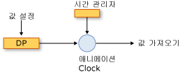
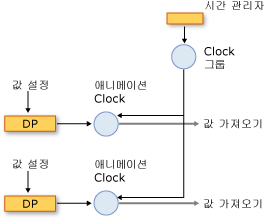
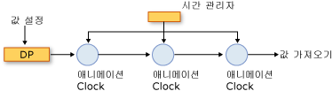

# 애니메이션 및 타이밍 시스템 개요Animation and Timing System Overview
이 항목에서는 타이밍 시스템에 애니메이션을 사용 하는 방법을 설명 <xref:System.Windows.Media.Animation.Timeline>, 및 <xref:System.Windows.Media.Animation.Clock> 속성에 애니메이션을 적용 하는 클래스입니다.This topic describes how the timing system uses the animation, <xref:System.Windows.Media.Animation.Timeline>, and <xref:System.Windows.Media.Animation.Clock> classes to animate properties.  
  
   
## 전제 조건Prerequisites  
 이 항목을 이해하려면 [애니메이션 개요](../../../../docs/framework/wpf/graphics-multimedia/animation-overview.md)에 설명된 대로 [!INCLUDE[TLA2#tla_winclient](../../../../includes/tla2sharptla-winclient-md.md)] 애니메이션을 사용하여 속성에 애니메이션 효과를 줄 수 있어야 합니다.To understand this topic, you should be able to use [!INCLUDE[TLA2#tla_winclient](../../../../includes/tla2sharptla-winclient-md.md)] animations to animate properties, as described in the [Animation Overview](../../../../docs/framework/wpf/graphics-multimedia/animation-overview.md). 종속성 속성에 익숙한 것도 도움이 됩니다. 자세한 내용은 [종속성 속성 개요](../../../../docs/framework/wpf/advanced/dependency-properties-overview.md)를 참조하세요.It also helps to be familiar with dependency properties; for more information, see the [Dependency Properties Overview](../../../../docs/framework/wpf/advanced/dependency-properties-overview.md).  
  
   
## 타임라인 및 시계Timelines and Clocks  
 [애니메이션 개요](../../../../docs/framework/wpf/graphics-multimedia/animation-overview.md) 어떻게 설명는 <xref:System.Windows.Media.Animation.Timeline> 나타냅니다는 시간과 애니메이션의 세그먼트 유형의 <xref:System.Windows.Media.Animation.Timeline> 출력 값을 생성 하는 합니다.The [Animation Overview](../../../../docs/framework/wpf/graphics-multimedia/animation-overview.md) described how a <xref:System.Windows.Media.Animation.Timeline> represents a segment of time, and an animation is a type of <xref:System.Windows.Media.Animation.Timeline> that produces output values. 자체적으로 <xref:System.Windows.Media.Animation.Timeline>, 이외의 작업도 하지 않습니다 시간 세그먼트를 설명 하는 것입니다.By itself, a <xref:System.Windows.Media.Animation.Timeline>, doesn't do anything other than just describe a segment of time. 타임 라인의는 <xref:System.Windows.Media.Animation.Clock> 실제 작업을 수행 하는 개체입니다.It's the timeline's <xref:System.Windows.Media.Animation.Clock> object that does the real work. 마찬가지로, 애니메이션 하지 않는 실제로 애니메이션 효과 줄 속성: 출력 값 계산 되는 방법을, 애니메이션 클래스에 설명 하지만 <xref:System.Windows.Media.Animation.Clock> 애니메이션 속성에 적용 하는 효과 대해 만들어진 합니다.Likewise, animation doesn't actually animate properties: an animation class describes how output values should be calculated, but it’s the <xref:System.Windows.Media.Animation.Clock> that was created for the animation that drives the animation output and applies it to properties.  
  
 A <xref:System.Windows.Media.Animation.Clock> 는 특수 한 유형의 개체에 대 한 타이밍 관련 런타임 상태를 유지 하는 <xref:System.Windows.Media.Animation.Timeline>합니다.A <xref:System.Windows.Media.Animation.Clock> is a special type of object that maintains timing-related run-time state for the <xref:System.Windows.Media.Animation.Timeline>. 애니메이션, 타이밍 시스템에 꼭 필요한 정보의 3 비트 제공: <xref:System.Windows.Media.Animation.Clock.CurrentTime%2A>, <xref:System.Windows.Media.Animation.Clock.CurrentProgress%2A>, 및 <xref:System.Windows.Media.Animation.Clock.CurrentState%2A>합니다.It provides three bits of information that are essential to the animation and timing system: <xref:System.Windows.Media.Animation.Clock.CurrentTime%2A>, <xref:System.Windows.Media.Animation.Clock.CurrentProgress%2A>, and <xref:System.Windows.Media.Animation.Clock.CurrentState%2A>. A <xref:System.Windows.Media.Animation.Clock> 으로 설명 된 타이밍 동작을 사용 하 여의 현재 시간, 진행률 및 상태를 결정 해당 <xref:System.Windows.Media.Animation.Timeline>: <xref:System.Windows.Media.Animation.Timeline.Duration%2A>, <xref:System.Windows.Media.Animation.Timeline.RepeatBehavior%2A>, <xref:System.Windows.Media.Animation.Timeline.AutoReverse%2A>등입니다.A <xref:System.Windows.Media.Animation.Clock> determines its current time, progress, and state by using the timing behaviors described by its <xref:System.Windows.Media.Animation.Timeline>: <xref:System.Windows.Media.Animation.Timeline.Duration%2A>, <xref:System.Windows.Media.Animation.Timeline.RepeatBehavior%2A>, <xref:System.Windows.Media.Animation.Timeline.AutoReverse%2A>, and so on.  
  
 대부분의 경우에는 <xref:System.Windows.Media.Animation.Clock> 일정에 대 한 자동으로 만들어집니다.In most cases, a <xref:System.Windows.Media.Animation.Clock> is created automatically for your timeline. 사용 하 여 애니메이션 효과 줄 경우는 <xref:System.Windows.Media.Animation.Storyboard> 또는 <xref:System.Windows.Media.Animation.Animatable.BeginAnimation%2A> 메서드를 시계가 자동으로 타임 라인 및 애니메이션에 대 한 만들어지고 해당 대상된 속성에 적용 합니다.When you animate by using a <xref:System.Windows.Media.Animation.Storyboard> or the <xref:System.Windows.Media.Animation.Animatable.BeginAnimation%2A> method, clocks are automatically created for your timelines and animations and applied to their targeted properties. 만들 수도 있습니다는 <xref:System.Windows.Media.Animation.Clock> 를 사용 하 여 명시적으로 <xref:System.Windows.Media.Animation.Timeline.CreateClock%2A> 방식의 프로그램 <xref:System.Windows.Media.Animation.Timeline>합니다.You can also create a <xref:System.Windows.Media.Animation.Clock> explicitly by using the <xref:System.Windows.Media.Animation.Timeline.CreateClock%2A> method of your <xref:System.Windows.Media.Animation.Timeline>. <xref:System.Windows.Media.MediaTimeline.CreateClock%2A?displayProperty=nameWithType> 메서드에 대 한 적절 한 형식의 클록 만듭니다는 <xref:System.Windows.Media.Animation.Timeline> 호출 된 합니다.The <xref:System.Windows.Media.MediaTimeline.CreateClock%2A?displayProperty=nameWithType> method creates a clock of the appropriate type for the <xref:System.Windows.Media.Animation.Timeline> on which it is called. 경우는 <xref:System.Windows.Media.Animation.Timeline> 자식 타임 라인을 포함 만듭니다 <xref:System.Windows.Media.Animation.Clock> 하 개체도 있습니다.If the <xref:System.Windows.Media.Animation.Timeline> contains child timelines, it creates <xref:System.Windows.Media.Animation.Clock> objects for them as well. 그 결과 <xref:System.Windows.Media.Animation.Clock> 개체의 구조와 일치 하는 트리로 정렬 되는 <xref:System.Windows.Media.Animation.Timeline> 에서 생성 된 개체 트리 합니다.The resulting <xref:System.Windows.Media.Animation.Clock> objects are arranged in trees that match the structure of the <xref:System.Windows.Media.Animation.Timeline> objects tree from which they are created.  
  
 다양한 유형의 타임라인에 대한 여러 유형의 시계가 있습니다.There are different types of clocks for different types of timelines. 다음 표는 <xref:System.Windows.Media.Animation.Clock> 몇 가지 다른에 해당 하는 형식을 <xref:System.Windows.Media.Animation.Timeline> 형식입니다.The following table shows the <xref:System.Windows.Media.Animation.Clock> types that correspond to some of the different <xref:System.Windows.Media.Animation.Timeline> types.  
  
|타임라인 형식Timeline type|시계 유형Clock type|시계 용도Clock purpose|  
|-------------------|----------------|-------------------|  
|애니메이션 (에서 상속 <xref:System.Windows.Media.Animation.AnimationTimeline>)Animation (inherits from <xref:System.Windows.Media.Animation.AnimationTimeline>)|<xref:System.Windows.Media.Animation.AnimationClock>|종속성 속성에 대한 출력 값을 생성합니다.Generates output values for a dependency property.|  
|<xref:System.Windows.Media.MediaTimeline>|<xref:System.Windows.Media.MediaClock>|미디어 파일을 처리합니다.Processes a media file.|  
|<xref:System.Windows.Media.Animation.ParallelTimeline>|<xref:System.Windows.Media.Animation.ClockGroup>|그룹화 하 고 해당 자식 제어 <xref:System.Windows.Media.Animation.Clock> 개체Groups and controls its child <xref:System.Windows.Media.Animation.Clock> objects|  
|<xref:System.Windows.Media.Animation.Storyboard>|<xref:System.Windows.Media.Animation.ClockGroup>|그룹화 하 고 해당 자식 제어 <xref:System.Windows.Media.Animation.Clock> 개체Groups and controls its child <xref:System.Windows.Media.Animation.Clock> objects|  
  
 적용할 수 있습니다 <xref:System.Windows.Media.Animation.AnimationClock> 호환 되는 종속성 속성을 사용 하 여 만들면 개체는 <xref:System.Windows.Media.Animation.IAnimatable.ApplyAnimationClock%2A> 메서드.You can apply any <xref:System.Windows.Media.Animation.AnimationClock> objects you create to compatible dependency properties by using the <xref:System.Windows.Media.Animation.IAnimatable.ApplyAnimationClock%2A> method.  
  
 많은 수의 유사한 개체에 애니메이션을 적용 하는 등의 성능이 시나리오에서 관리 사용자 고유의 <xref:System.Windows.Media.Animation.Clock> 사용 하 여 성능 이점을 제공할 수 있습니다.In performance-intensive scenarios, such as animating large numbers of similar objects, managing your own <xref:System.Windows.Media.Animation.Clock> use can provide performance benefits.  
  
   
## 시계 및 시간 관리자Clocks and the Time Manager  
 개체에 애니메이션 효과 주는 경우 [!INCLUDE[TLA2#tla_winclient](../../../../includes/tla2sharptla-winclient-md.md)], 관리 하는 시간 관리자는는 <xref:System.Windows.Media.MediaPlayer.Clock%2A> timeline에 대해 생성 된 개체입니다.When you animate objects in [!INCLUDE[TLA2#tla_winclient](../../../../includes/tla2sharptla-winclient-md.md)], it’s the time manager that manages the <xref:System.Windows.Media.MediaPlayer.Clock%2A> objects created for your timelines. 시간 관리자는 <xref:System.Windows.Media.MediaPlayer.Clock%2A> 개체 트리의 루트이며 해당 트리에서 시간의 흐름을 제어합니다.The time manager is the root of a tree of <xref:System.Windows.Media.MediaPlayer.Clock%2A> objects and controls the flow of time in that tree.  시간 관리자는 각 [!INCLUDE[TLA2#tla_winclient](../../../../includes/tla2sharptla-winclient-md.md)] 응용 프로그램에 대해 자동으로 만들어지며 응용 프로그램 개발자에게 표시되지 않습니다.A time manager is automatically created for each [!INCLUDE[TLA2#tla_winclient](../../../../includes/tla2sharptla-winclient-md.md)] application and is invisible to the application developer. 시간 관리자에서 매초 여러 번 "틱"이 발생하는데 초당 발생하는 실제 틱 수는 사용 가능한 시스템 리소스에 따라 다릅니다.The time manager "ticks" many times per second; the actual number of ticks that occur each second varies depending on available system resources. 시간 관리자는 각각이 틱 하는 동안 모든의 상태를 계산 <xref:System.Windows.Media.Animation.ClockState.Active> <xref:System.Windows.Media.Animation.Clock> 타이밍 트리의 개체입니다.During each one of these ticks, the time manager computes the state of all <xref:System.Windows.Media.Animation.ClockState.Active> <xref:System.Windows.Media.Animation.Clock> objects in the timing tree.  
  
 다음 그림과 시간 관리자 간의 관계 및 <xref:System.Windows.Media.Animation.AnimationClock>, 및 애니메이션 효과 준된 종속성 속성입니다.The following illustration shows the relationship between the time manager, and <xref:System.Windows.Media.Animation.AnimationClock>, and an animated dependency property.  
  
   
속성에 애니메이션 효과 주기Animating a property  
  
 시간 관리자는 틱의 시간 업데이트 모든 <xref:System.Windows.Media.Animation.ClockState.Active> <xref:System.Windows.Media.Animation.Clock> 응용 프로그램에 있습니다.When the time manager ticks, it updates the time of every <xref:System.Windows.Media.Animation.ClockState.Active> <xref:System.Windows.Media.Animation.Clock> in the application. 경우는 <xref:System.Windows.Media.Animation.Clock> 는 <xref:System.Windows.Media.Animation.AnimationClock>를 사용 하 여는 <xref:System.Windows.Media.Animation.AnimationTimeline.GetCurrentValue%2A> 의 메서드는 <xref:System.Windows.Media.Animation.AnimationTimeline> 에서 작성 된 현재 계산에 출력 값입니다.If the <xref:System.Windows.Media.Animation.Clock> is an <xref:System.Windows.Media.Animation.AnimationClock>, it uses the <xref:System.Windows.Media.Animation.AnimationTimeline.GetCurrentValue%2A> method of the <xref:System.Windows.Media.Animation.AnimationTimeline> from which it was created to calculate its current output value. <xref:System.Windows.Media.Animation.AnimationClock> 제공는 <xref:System.Windows.Media.Animation.AnimationTimeline> 현재 현지 시간, 입력된 값은 일반적으로 속성의 기본 값, 및 기본 대상 값입니다.The <xref:System.Windows.Media.Animation.AnimationClock> supplies the <xref:System.Windows.Media.Animation.AnimationTimeline> with the current local time, an input value, which is typically the base value of the property, and a default destination value. 애니메이션의 값을 검색 하는 경우 속성을 사용 하 여는 <xref:System.Windows.DependencyObject.GetValue%2A> 의 출력을 얻게 메서드 또는 해당 CLR 접근자 해당 <xref:System.Windows.Media.Animation.AnimationClock>합니다.When you retrieve the value of an animated by property using the <xref:System.Windows.DependencyObject.GetValue%2A> method or its CLR accessor, you get the output of its <xref:System.Windows.Media.Animation.AnimationClock>.  
  
#### 시계 그룹Clock Groups  
 이전 섹션 있다는 다양 한 유형의 것을 설명 <xref:System.Windows.Media.Animation.Clock> 다양 한 유형의 타임 라인에 대 한 개체입니다.The preceding section described how there are different types of <xref:System.Windows.Media.Animation.Clock> objects for different types of timelines. 다음 그림과 시간 관리자 간의 관계는 <xref:System.Windows.Media.Animation.ClockGroup>, <xref:System.Windows.Media.Animation.AnimationClock>, 및 애니메이션 효과 준된 종속성 속성입니다.The following illustration shows the relationship between the time manager, a <xref:System.Windows.Media.Animation.ClockGroup>, an <xref:System.Windows.Media.Animation.AnimationClock>, and an animated dependency property. A <xref:System.Windows.Media.Animation.ClockGroup> 와 같은 다른 타임 라인을 그룹화 하는 타임 라인에 대해 만들어집니다는 <xref:System.Windows.Media.Animation.Storyboard> 애니메이션 및 기타 타임 라인을 그룹화 하는 클래스입니다.A <xref:System.Windows.Media.Animation.ClockGroup> is created for timelines that group other timelines, such as the <xref:System.Windows.Media.Animation.Storyboard> class, which groups animations and other timelines.  
  
   
ClockGroupA ClockGroup  
  
#### 컴퍼지션Composition  
 여러 시계를 단일 속성에 연결할 수 있습니다. 이 경우 각 시계에서 이전 시계의 출력 값을 기준 값으로 사용합니다.It's possible to associate multiple clocks with a single property, in which case each clock uses the output value of the preceding clock as its base value. 다음 그림에 나와 세 개의 <xref:System.Windows.Media.Animation.AnimationClock> 개체에서 동일한 속성에 적용 합니다.The following illustration shows three <xref:System.Windows.Media.Animation.AnimationClock> objects applied to the same property. Clock1은 애니메이션 속성의 기준 값을 해당 입력으로 사용하고 이를 사용하여 출력을 생성합니다.Clock1 uses the base value of the animated property as its input and uses it to generate output. Clock2는 Clock1의 출력을 입력으로 받고 이를 사용하여 출력을 생성합니다.Clock2 takes the output from Clock1 as its input and uses it to generate output. Clock3은 Clock2의 출력을 입력으로 받고 이를 사용하여 출력을 생성합니다.Clock3 takes the output from Clock2 as its input and uses it to generate output. 여러 시계가 같은 속성에 동시에 영향을 주는 경우 컴퍼지션 체인에 있다고 합니다.When multiple clocks affect the same property simultaneously, they are said to be in a composition chain.  
  
   
컴퍼지션 체인A composition chain  
  
 입력 및 출력의 간에 관계가 생성 하지만 <xref:System.Windows.Media.Animation.AnimationClock> 개체 컴퍼지션 체인의 타이밍 미치는 영향을 받지 않습니다. <xref:System.Windows.Media.Animation.Clock> 개체 (포함 하 여 <xref:System.Windows.Media.Animation.AnimationClock> 개체)의 부모에 계층적 종속성이 있는 <xref:System.Windows.Media.Animation.Clock> 개체입니다.Note that although a relationship is created among the input and output of the <xref:System.Windows.Media.Animation.AnimationClock> objects in the composition chain, their timing behaviors are not affected; <xref:System.Windows.Media.Animation.Clock> objects (including <xref:System.Windows.Media.Animation.AnimationClock> objects) have a hierarchical dependency on their parent <xref:System.Windows.Media.Animation.Clock> objects.  
  
 같은 속성에 여러 시계를 적용 하려면 사용는 <xref:System.Windows.Media.Animation.HandoffBehavior.Compose> <xref:System.Windows.Media.Animation.HandoffBehavior> 적용 하는 경우는 <xref:System.Windows.Media.Animation.Storyboard>, 애니메이션 또는 <xref:System.Windows.Media.Animation.AnimationClock>합니다.To apply multiple clocks to the same property, use the <xref:System.Windows.Media.Animation.HandoffBehavior.Compose> <xref:System.Windows.Media.Animation.HandoffBehavior> when applying a <xref:System.Windows.Media.Animation.Storyboard>, animation, or <xref:System.Windows.Media.Animation.AnimationClock>.  
  
#### 틱 및 이벤트 통합Ticks and Event Consolidation  
 출력 값을 계산하는 것 외에도 시간 관리자는 틱을 발생시킬 때마다 다른 작업을 수행합니다. 각 시계의 상태를 결정하고 적절하게 이벤트를 발생시킵니다.In addition to calculating output values, the time manager does other work every time it ticks: it determines the state of each clock and raises events as appropriate.  
  
 틱은 자주 발생하지만 틱 간에 많은 사항이 발생할 수 있습니다.While ticks occur frequently, it's possible for a lot of things to happen between ticks. 예를 들어 한 <xref:System.Windows.Media.Animation.Clock> 중지, 시작 및 다시는 쿼리에서 중지 될 수 있습니다는 <xref:System.Windows.Media.Animation.Clock.CurrentState%2A> 값 세 번 변경 됩니다.For example, a <xref:System.Windows.Media.Animation.Clock> might be stopped, started, and stopped again, in which case its <xref:System.Windows.Media.Animation.Clock.CurrentState%2A> value will have changed three times. 이론적으로 <xref:System.Windows.Media.Animation.Clock.CurrentStateInvalidated> 타이밍 엔진은 이벤트를 통합 하는 반면; 이벤트 눈금 하나에 여러 번 발생 시킬 수 있도록는 <xref:System.Windows.Media.Animation.Clock.CurrentStateInvalidated> 이벤트가 틱 당 한 번만 발생할 수 있습니다.In theory, the <xref:System.Windows.Media.Animation.Clock.CurrentStateInvalidated> event could be raised multiple times in a single tick; however, the timing engine consolidates events, so that the <xref:System.Windows.Media.Animation.Clock.CurrentStateInvalidated> event can be raised at most once per tick. 이 모든 타이밍 이벤트에 적용: 각 유형의 최대 하나의 이벤트가 발생 한 지정 된 <xref:System.Windows.Media.Animation.Clock> 개체입니다.This is true for all timing events: at most one event of each type is raised for a given <xref:System.Windows.Media.Animation.Clock> object.  
  
 경우는 <xref:System.Windows.Media.Animation.Clock> 상태를 전환 하 고 원래 상태로 되돌리려면 틱 사이의 반환 (에서 변경 하는 등 <xref:System.Windows.Media.Animation.ClockState.Active> 를 <xref:System.Windows.Media.Animation.ClockState.Stopped> 그리고 다시 <xref:System.Windows.Media.Animation.ClockState.Active>), 연결된 된 이벤트가 계속 발생 합니다.When a <xref:System.Windows.Media.Animation.Clock> switches states and returns back to its original state between ticks (such as changing from <xref:System.Windows.Media.Animation.ClockState.Active> to <xref:System.Windows.Media.Animation.ClockState.Stopped> and back to <xref:System.Windows.Media.Animation.ClockState.Active>), the associated event still occurs.  
  
 타이밍 이벤트에 대한 자세한 내용은 [타이밍 이벤트 개요](../../../../docs/framework/wpf/graphics-multimedia/timing-events-overview.md)를 참조하세요.For more information about timing events, see the [Timing Events Overview](../../../../docs/framework/wpf/graphics-multimedia/timing-events-overview.md).  
  
   
## 속성의 현재 값 및 기준 값Current Values and Base Values of Properties  
 애니메이션 효과를 줄 수 있는 속성은 두 값(기준 값 및 현재 값)을 가질 수 있습니다.An animatable property can have two values: a base value and a current value. 해당 CLR 접근자를 사용 하 여 속성을 설정 하면 또는 <xref:System.Windows.DependencyObject.SetValue%2A> 메서드를 설정한 기준 값입니다.When you set property using its CLR accessor or the <xref:System.Windows.DependencyObject.SetValue%2A> method, you set its base value. 속성에 애니메이션 효과를 줄 수 없는 경우 해당 기준 값과 현재 값은 동일합니다.When a property is not animated, its base and current values are the same.  
  
 속성에 애니메이션을 적용할 때의 <xref:System.Windows.Media.Animation.AnimationClock> 속성의 설정 *현재* 값입니다.When you animate a property, the <xref:System.Windows.Media.Animation.AnimationClock> sets the property's *current* value. 해당 CLR 접근자를 통해 속성의 값을 검색 또는 <xref:System.Windows.DependencyObject.GetValue%2A> 의 출력을 반환 하는 메서드는 <xref:System.Windows.Media.Animation.AnimationClock> 때는 <xref:System.Windows.Media.Animation.AnimationClock> 은 <xref:System.Windows.Media.Animation.ClockState.Active> 또는 <xref:System.Windows.Media.Animation.ClockState.Filling>합니다.Retrieving the property's value through its CLR accessor or the <xref:System.Windows.DependencyObject.GetValue%2A> method returns the output of the <xref:System.Windows.Media.Animation.AnimationClock> when the <xref:System.Windows.Media.Animation.AnimationClock> is <xref:System.Windows.Media.Animation.ClockState.Active> or <xref:System.Windows.Media.Animation.ClockState.Filling>. 사용 하 여 속성의 기준 값을 검색할 수 있습니다는 <xref:System.Windows.Media.Animation.IAnimatable.GetAnimationBaseValue%2A> 메서드.You can retrieve the property's base value by using the <xref:System.Windows.Media.Animation.IAnimatable.GetAnimationBaseValue%2A> method.  
  
## 참고 항목See Also  
 [애니메이션 개요Animation Overview](../../../../docs/framework/wpf/graphics-multimedia/animation-overview.md)  
 [타이밍 이벤트 개요Timing Events Overview](../../../../docs/framework/wpf/graphics-multimedia/timing-events-overview.md)  
 [타이밍 동작 개요Timing Behaviors Overview](../../../../docs/framework/wpf/graphics-multimedia/timing-behaviors-overview.md)
