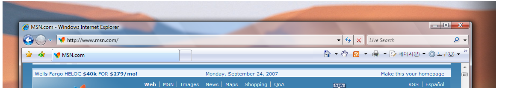

# <a name="extend-glass-frame-into-a-wpf-application"></a><span data-ttu-id="6be5d-102">투명 효과 프레임을 WPF 응용 프로그램으로 확장</span><span class="sxs-lookup"><span data-stu-id="6be5d-102">Extend Glass Frame Into a WPF Application</span></span>
<span data-ttu-id="6be5d-103">이 항목에서는 [!INCLUDE[TLA#tla_winvista](../../../../includes/tlasharptla-winvista-md.md)] 투명 효과 프레임을 [!INCLUDE[TLA#tla_wpf](../../../../includes/tlasharptla-wpf-md.md)] 응용 프로그램의 클라이언트 영역으로 확장하는 방법을 보여 줍니다.</span><span class="sxs-lookup"><span data-stu-id="6be5d-103">This topic demonstrates how to extend the [!INCLUDE[TLA#tla_winvista](../../../../includes/tlasharptla-winvista-md.md)] glass frame into the client area of a [!INCLUDE[TLA#tla_wpf](../../../../includes/tlasharptla-wpf-md.md)] application.</span></span>  
  
> [!NOTE]
>  <span data-ttu-id="6be5d-104">이 예제는 투명 효과가 사용되도록 설정된 DWM(바탕 화면 창 관리자)를 실행하는 [!INCLUDE[TLA2#tla_winvista](../../../../includes/tla2sharptla-winvista-md.md)] 컴퓨터에서만 작동합니다.</span><span class="sxs-lookup"><span data-stu-id="6be5d-104">This example will only work on a [!INCLUDE[TLA2#tla_winvista](../../../../includes/tla2sharptla-winvista-md.md)] machine running the Desktop Window Manager (DWM) with glass enabled.</span></span> [!INCLUDE[TLA2#tla_winvista](../../../../includes/tla2sharptla-winvista-md.md)]<span data-ttu-id="6be5d-105"> Home Basic Edition에서는 투명 효과를 지원하지 않습니다.</span><span class="sxs-lookup"><span data-stu-id="6be5d-105"> Home Basic edition does not support the transparent glass effect.</span></span> <span data-ttu-id="6be5d-106">일반적으로 [!INCLUDE[TLA2#tla_winvista](../../../../includes/tla2sharptla-winvista-md.md)]의 다른 버전에서 투명 효과로 렌더링되는 영역은 불투명하게 렌더링됩니다.</span><span class="sxs-lookup"><span data-stu-id="6be5d-106">Areas that would typically render with the transparent glass effect on other editions of [!INCLUDE[TLA2#tla_winvista](../../../../includes/tla2sharptla-winvista-md.md)] are rendered opaque.</span></span>  
  
## <a name="example"></a><span data-ttu-id="6be5d-107">예</span><span class="sxs-lookup"><span data-stu-id="6be5d-107">Example</span></span>  
 <span data-ttu-id="6be5d-108">다음 그림에서는 Internet Explorer 7의 주소 표시줄로 확장되는 투명 효과 프레임을 보여 줍니다.</span><span class="sxs-lookup"><span data-stu-id="6be5d-108">The following image illustrates the glass frame extended into the address bar of Internet Explorer 7.</span></span>  
  
 <span data-ttu-id="6be5d-109">**주소 표시줄 뒤로 투명 효과 프레임이 확장된 Internet Explorer**</span><span class="sxs-lookup"><span data-stu-id="6be5d-109">**Internet Explorer with extended glass frame behind address bar.**</span></span>  
  
 <span data-ttu-id="6be5d-110"></span><span class="sxs-lookup"><span data-stu-id="6be5d-110"></span></span>  
  
 <span data-ttu-id="6be5d-111">[!INCLUDE[TLA2#tla_wpf](../../../../includes/tla2sharptla-wpf-md.md)] 응용 프로그램에서 투명 효과 프레임을 확장하려면 관리되지 않는 [!INCLUDE[TLA#tla_api](../../../../includes/tlasharptla-api-md.md)]에 액세스해야 합니다.</span><span class="sxs-lookup"><span data-stu-id="6be5d-111">To extend the glass frame on a [!INCLUDE[TLA2#tla_wpf](../../../../includes/tla2sharptla-wpf-md.md)] application, access to unmanaged [!INCLUDE[TLA#tla_api](../../../../includes/tlasharptla-api-md.md)] is needed.</span></span> <span data-ttu-id="6be5d-112">다음 코드 예제에서는 프레임을 클라이언트 영역으로 확장하는 데 필요한 두 개의 [!INCLUDE[TLA2#tla_api](../../../../includes/tla2sharptla-api-md.md)]에 대해 플랫폼 호출(pinvoke)을 수행합니다.</span><span class="sxs-lookup"><span data-stu-id="6be5d-112">The following code example does a Platform Invoke (pinvoke) for the two [!INCLUDE[TLA2#tla_api](../../../../includes/tla2sharptla-api-md.md)] needed to extend the frame into the client area.</span></span> <span data-ttu-id="6be5d-113">이러한 각 [!INCLUDE[TLA2#tla_api](../../../../includes/tla2sharptla-api-md.md)]는 **NonClientRegionAPI**라는 클래스에 선언됩니다.</span><span class="sxs-lookup"><span data-stu-id="6be5d-113">Each of these [!INCLUDE[TLA2#tla_api](../../../../includes/tla2sharptla-api-md.md)] are declared in a class called **NonClientRegionAPI**.</span></span>  
  
```csharp  
[StructLayout(LayoutKind.Sequential)]  
public struct MARGINS  
{  
    public int cxLeftWidth;      // width of left border that retains its size  
    public int cxRightWidth;     // width of right border that retains its size  
    public int cyTopHeight;      // height of top border that retains its size  
    public int cyBottomHeight;   // height of bottom border that retains its size  
};  
  
[DllImport("DwmApi.dll")]  
public static extern int DwmExtendFrameIntoClientArea(  
    IntPtr hwnd,  
    ref MARGINS pMarInset);  
```  
  
```vb  
<StructLayout(LayoutKind.Sequential)>  
        Public Structure MARGINS  
            Public cxLeftWidth As Integer ' width of left border that retains its size  
            Public cxRightWidth As Integer ' width of right border that retains its size  
            Public cyTopHeight As Integer ' height of top border that retains its size  
            Public cyBottomHeight As Integer ' height of bottom border that retains its size  
        End Structure  
  
        <DllImport("DwmApi.dll")>  
        Public Shared Function DwmExtendFrameIntoClientArea(ByVal hwnd As IntPtr, ByRef pMarInset As MARGINS) As Integer  
        End Function  
```  
  
 <span data-ttu-id="6be5d-114">[DwmExtendFrameIntoClientArea](https://msdn.microsoft.com/library/aa969512.aspx)는 프레임을 클라이언트 영역으로 확장하는 DWM 함수입니다.</span><span class="sxs-lookup"><span data-stu-id="6be5d-114">[DwmExtendFrameIntoClientArea](https://msdn.microsoft.com/library/aa969512.aspx) is the DWM function that extends the frame into the client area.</span></span> <span data-ttu-id="6be5d-115">이 함수는 창 핸들 및 [MARGINS](https://msdn.microsoft.com/library/bb773244.aspx) 구조체의 두 매개 변수를 사용합니다.</span><span class="sxs-lookup"><span data-stu-id="6be5d-115">It takes two parameters; a window handle and a [MARGINS](https://msdn.microsoft.com/library/bb773244.aspx) structure.</span></span> <span data-ttu-id="6be5d-116">[MARGINS](https://msdn.microsoft.com/library/bb773244.aspx)는 프레임을 클라이언트 영역으로 얼마나 추가로 확장해야 하는지를 나타내는 데 사용됩니다.</span><span class="sxs-lookup"><span data-stu-id="6be5d-116">[MARGINS](https://msdn.microsoft.com/library/bb773244.aspx) is used to tell the DWM how much extra the frame should be extended into the client area.</span></span>  
  
## <a name="example"></a><span data-ttu-id="6be5d-117">예</span><span class="sxs-lookup"><span data-stu-id="6be5d-117">Example</span></span>  
 <span data-ttu-id="6be5d-118">[DwmExtendFrameIntoClientArea](https://msdn.microsoft.com/library/aa969512.aspx) 함수를 사용하려면 창 핸들을 가져와야 합니다.</span><span class="sxs-lookup"><span data-stu-id="6be5d-118">To use the [DwmExtendFrameIntoClientArea](https://msdn.microsoft.com/library/aa969512.aspx) function, a window handle must be obtained.</span></span> <span data-ttu-id="6be5d-119">[!INCLUDE[TLA2#tla_wpf](../../../../includes/tla2sharptla-wpf-md.md)], 창 핸들에서 얻을 수 있습니다는 <xref:System.Windows.Interop.HwndSource.Handle%2A> 속성은 <xref:System.Windows.Interop.HwndSource>합니다.</span><span class="sxs-lookup"><span data-stu-id="6be5d-119">In [!INCLUDE[TLA2#tla_wpf](../../../../includes/tla2sharptla-wpf-md.md)], the window handle can be obtained from the <xref:System.Windows.Interop.HwndSource.Handle%2A> property of an <xref:System.Windows.Interop.HwndSource>.</span></span> <span data-ttu-id="6be5d-120">다음 예에서 프레임까지 연장 됩니다 클라이언트 영역에는 <xref:System.Windows.FrameworkElement.Loaded> 창의 이벤트입니다.</span><span class="sxs-lookup"><span data-stu-id="6be5d-120">In the following example, the frame is extended into the client area on the <xref:System.Windows.FrameworkElement.Loaded> event of the window.</span></span>  
  
```csharp  
void OnLoaded(object sender, RoutedEventArgs e)  
{  
   try  
   {  
      // Obtain the window handle for WPF application  
      IntPtr mainWindowPtr = new WindowInteropHelper(this).Handle;  
      HwndSource mainWindowSrc = HwndSource.FromHwnd(mainWindowPtr);  
      mainWindowSrc.CompositionTarget.BackgroundColor = Color.FromArgb(0, 0, 0, 0);  
  
      // Get System Dpi  
      System.Drawing.Graphics desktop = System.Drawing.Graphics.FromHwnd(mainWindowPtr);  
      float DesktopDpiX = desktop.DpiX;  
      float DesktopDpiY = desktop.DpiY;  
  
      // Set Margins  
      NonClientRegionAPI.MARGINS margins = new NonClientRegionAPI.MARGINS();  
  
      // Extend glass frame into client area  
      // Note that the default desktop Dpi is 96dpi. The  margins are  
      // adjusted for the system Dpi.  
      margins.cxLeftWidth = Convert.ToInt32(5 * (DesktopDpiX / 96));  
      margins.cxRightWidth = Convert.ToInt32(5 * (DesktopDpiX / 96));  
      margins.cyTopHeight = Convert.ToInt32(((int)topBar.ActualHeight + 5) * (DesktopDpiX / 96));  
      margins.cyBottomHeight = Convert.ToInt32(5 * (DesktopDpiX / 96));  
  
      int hr = NonClientRegionAPI.DwmExtendFrameIntoClientArea(mainWindowSrc.Handle, ref margins);  
      //  
      if (hr < 0)  
      {  
         //DwmExtendFrameIntoClientArea Failed  
      }  
   }  
   // If not Vista, paint background white.  
   catch (DllNotFoundException)  
   {  
      Application.Current.MainWindow.Background = Brushes.White;  
   }  
}  
```  
  
## <a name="example"></a><span data-ttu-id="6be5d-121">예</span><span class="sxs-lookup"><span data-stu-id="6be5d-121">Example</span></span>  
 <span data-ttu-id="6be5d-122">다음 예제는 프레임이 클라이언트 영역으로 확장되는 간단한 창을 보여 줍니다.</span><span class="sxs-lookup"><span data-stu-id="6be5d-122">The following example shows a simple window in which the frame is extended into the client area.</span></span> <span data-ttu-id="6be5d-123">위쪽 테두리 뒤에서 두 가지를 포함 하는 프레임이 확장 <xref:System.Windows.Controls.TextBox> 개체입니다.</span><span class="sxs-lookup"><span data-stu-id="6be5d-123">The frame is extended behind the top border that contains the two <xref:System.Windows.Controls.TextBox> objects.</span></span>  
  
```xaml  
<Window x:Class="SDKSample.Window1"  
    xmlns="http://schemas.microsoft.com/winfx/2006/xaml/presentation"  
    xmlns:x="http://schemas.microsoft.com/winfx/2006/xaml"  
    Title="Extended Glass in WPF" Height="300" Width="400"   
    Loaded="OnLoaded" Background="Transparent"  
    >  
  <Grid ShowGridLines="True">  
    <DockPanel Name="mainDock">  
      <!-- The border is used to compute the rendered height with margins.  
           topBar contents will be displayed on the extended glass frame.-->  
      <Border Name="topBar" DockPanel.Dock="Top" >  
        <Grid Name="grid">  
          <Grid.ColumnDefinitions>  
            <ColumnDefinition MinWidth="100" Width="*"/>  
            <ColumnDefinition Width="Auto"/>  
          </Grid.ColumnDefinitions>  
          <TextBox Grid.Column="0" MinWidth="100" Margin="0,0,10,5">Path</TextBox>  
          <TextBox Grid.Column="1" MinWidth="75" Margin="0,0,0,5">Search</TextBox>  
        </Grid>  
      </Border>  
      <Grid DockPanel.Dock="Top" >  
        <Grid.ColumnDefinitions>  
          <ColumnDefinition/>  
        </Grid.ColumnDefinitions>  
        <TextBox Grid.Column="0" AcceptsReturn="True"/>  
      </Grid>  
    </DockPanel>  
  </Grid>  
</Window>  
```  
  
 <span data-ttu-id="6be5d-124">다음 그림에서는 [!INCLUDE[TLA2#tla_wpf](../../../../includes/tla2sharptla-wpf-md.md)] 응용 프로그램으로 확장되는 투명 효과 프레임을 보여 줍니다.</span><span class="sxs-lookup"><span data-stu-id="6be5d-124">The following image illustrates the glass frame extended into a [!INCLUDE[TLA2#tla_wpf](../../../../includes/tla2sharptla-wpf-md.md)] application.</span></span>  
  
 <span data-ttu-id="6be5d-125">****  [!INCLUDE[TLA2#tla_wpf](../../../../includes/tla2sharptla-wpf-md.md)]  **응용 프로그램으로 확장된 투명 효과 프레임**</span><span class="sxs-lookup"><span data-stu-id="6be5d-125">**Glass Frame Extended into a**  [!INCLUDE[TLA2#tla_wpf](../../../../includes/tla2sharptla-wpf-md.md)]  **Application.**</span></span>  
  
 <span data-ttu-id="6be5d-126"></span><span class="sxs-lookup"><span data-stu-id="6be5d-126"></span></span>  
  
## <a name="see-also"></a><span data-ttu-id="6be5d-127">참고 항목</span><span class="sxs-lookup"><span data-stu-id="6be5d-127">See Also</span></span>  
 [<span data-ttu-id="6be5d-128">바탕 화면 창 관리자 개요</span><span class="sxs-lookup"><span data-stu-id="6be5d-128">Desktop Window Manager Overview</span></span>](https://msdn.microsoft.com/library/aa969540.aspx)  
 [<span data-ttu-id="6be5d-129">바탕 화면 창 관리자 흐림 효과 개요</span><span class="sxs-lookup"><span data-stu-id="6be5d-129">Desktop Window Manager Blur Overview</span></span>](https://msdn.microsoft.com/library/aa969537.aspx)  
 [<span data-ttu-id="6be5d-130">DwmExtendFrameIntoClientArea</span><span class="sxs-lookup"><span data-stu-id="6be5d-130">DwmExtendFrameIntoClientArea</span></span>](https://msdn.microsoft.com/library/aa969512.aspx)
