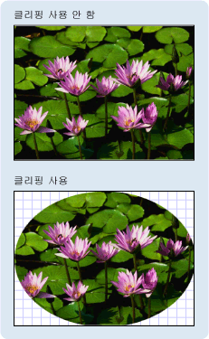

# Geometry 개요Geometry Overview
이 개요에서는 사용 하는 방법을 설명는 [!INCLUDE[TLA#tla_winclient](../../../../includes/tlasharptla-winclient-md.md)] <xref:System.Windows.Media.Geometry> 셰이프를 설명 하는 클래스입니다.This overview describes how to use the [!INCLUDE[TLA#tla_winclient](../../../../includes/tlasharptla-winclient-md.md)] <xref:System.Windows.Media.Geometry> classes to describe shapes. 이 항목은 또한 간의 차이점을 대조 <xref:System.Windows.Media.Geometry> 개체 및 <xref:System.Windows.Shapes.Shape> 요소입니다.This topic also contrasts the differences between <xref:System.Windows.Media.Geometry> objects and <xref:System.Windows.Shapes.Shape> elements.  
  
  
   
## 기하 도형이란?What Is a Geometry?  
 <xref:System.Windows.Media.Geometry> 클래스와 같은 여기에서 파생 되는 클래스 <xref:System.Windows.Media.EllipseGeometry>, <xref:System.Windows.Media.PathGeometry>, 및 <xref:System.Windows.Media.CombinedGeometry>, 2 차원 도형의 기 하 도형을 설명할 수 있도록 합니다.The <xref:System.Windows.Media.Geometry> class and the classes which derive from it, such as <xref:System.Windows.Media.EllipseGeometry>, <xref:System.Windows.Media.PathGeometry>, and <xref:System.Windows.Media.CombinedGeometry>, enable you to describe the geometry of a 2-D shape. 이러한 기하학적 설명은 화면에 그릴 도형 정의 또는 적중 테스트 및 클립 영역을 정의와 같은 다양한 용도로 사용됩니다.These geometric descriptions have many uses, such defining a shape to paint to the screen or defining hit-test and clip regions. 애니메이션 경로를 정의하는 데도 기하 도형을 사용할 수 있습니다.You can even use a geometry to define an animation path.  
  
 <xref:System.Windows.Media.Geometry>예: 사각형 및 원, 또는 합성 이미지를 두 개 이상의 geometry 개체에서 만든 개체는 단순, 수 있습니다.<xref:System.Windows.Media.Geometry> objects can be simple, such as rectangles and circles, or composite, created from two or more geometry objects.  더 복잡 한 기 하 도형을 사용 하 여 만들 수 있습니다는 <xref:System.Windows.Media.PathGeometry> 및 <xref:System.Windows.Media.StreamGeometry> 곡선을 설명 하는 수 있는 클래스입니다.More complex geometries can be created by using the <xref:System.Windows.Media.PathGeometry> and <xref:System.Windows.Media.StreamGeometry> classes, which enable you to describe arcs and curves.  
  
 때문에 <xref:System.Windows.Media.Geometry> 의 형식인 <xref:System.Windows.Freezable>, <xref:System.Windows.Media.Geometry> 몇 가지 특수 기능을 제공 하는 개체:로 선언할 수 있습니다 [리소스](../../../../docs/framework/wpf/advanced/xaml-resources.md), 복제 성능 향상을 위해 읽기 전용으로 설정 하는 여러 개체 간에 공유 하 고 스레드로부터 안전한 수 있습니다.Because a <xref:System.Windows.Media.Geometry> is a type of <xref:System.Windows.Freezable>, <xref:System.Windows.Media.Geometry> objects provide several special features: they can be declared as [resources](../../../../docs/framework/wpf/advanced/xaml-resources.md), shared among multiple objects, made read-only to improve performance, cloned, and made thread-safe. 제공 하는 다른 기능에 대 한 자세한 내용은 <xref:System.Windows.Freezable> 개체 참조는 [Freezable 개체 개요](../../../../docs/framework/wpf/advanced/freezable-objects-overview.md)합니다.For more information about the different features provided by <xref:System.Windows.Freezable> objects, see the [Freezable Objects Overview](../../../../docs/framework/wpf/advanced/freezable-objects-overview.md).  
  
   
## 기하 도형 및 도형Geometries vs. Shapes  
 <xref:System.Windows.Media.Geometry> 및 <xref:System.Windows.Shapes.Shape> 클래스와 유사할 이들이 2 차원 도형을 설명 한다는 점에서 (비교 <xref:System.Windows.Media.EllipseGeometry> 및 <xref:System.Windows.Shapes.Ellipse> 예를 들어)는 중요 한 차이점이 있습니다.The <xref:System.Windows.Media.Geometry> and <xref:System.Windows.Shapes.Shape> classes seem similar in that they both describe 2-D shapes (compare <xref:System.Windows.Media.EllipseGeometry> and <xref:System.Windows.Shapes.Ellipse> for example), but there are important differences.  
  
 첫째,는 <xref:System.Windows.Media.Geometry> 클래스에서 상속 된 <xref:System.Windows.Freezable> 동안 클래스는 <xref:System.Windows.Shapes.Shape> 클래스에서 상속 <xref:System.Windows.FrameworkElement>합니다.For one, the <xref:System.Windows.Media.Geometry> class inherits from the <xref:System.Windows.Freezable> class while the <xref:System.Windows.Shapes.Shape> class inherits from <xref:System.Windows.FrameworkElement>. 요소, 이므로 <xref:System.Windows.Shapes.Shape> 개체 자체를 렌더링할 수 및 레이아웃 시스템에 참여 하는 동안 <xref:System.Windows.Media.Geometry> 개체 수 없습니다.Because they are elements, <xref:System.Windows.Shapes.Shape> objects can render themselves and participate in the layout system, while <xref:System.Windows.Media.Geometry> objects cannot.  
  
 하지만 <xref:System.Windows.Shapes.Shape> 개체 보다 더 쉽게 사용할 수는 <xref:System.Windows.Media.Geometry> 개체 <xref:System.Windows.Media.Geometry> 개체는 다양 합니다.Although <xref:System.Windows.Shapes.Shape> objects are more readily usable than <xref:System.Windows.Media.Geometry> objects, <xref:System.Windows.Media.Geometry> objects are more versatile. 동안는 <xref:System.Windows.Shapes.Shape> 개체는 2 차원 그래픽을 렌더링 하는 데는 <xref:System.Windows.Media.Geometry> 개체의 기하학적 영역에 대 한 2 차원 그래픽, 클리핑에 영역을 정의 또는 예를 들어 적중 횟수 테스트에 대 한 영역을 정의를 사용할 수 있습니다.While a <xref:System.Windows.Shapes.Shape> object is used to render 2-D graphics, a <xref:System.Windows.Media.Geometry> object can be used to define the geometric region for 2-D graphics, define a region for clipping, or define a region for hit testing, for example.  
  
### 경로 도형The Path Shape  
 하나의 <xref:System.Windows.Shapes.Shape>, <xref:System.Windows.Shapes.Path> 클래스를 사용 하 여 실제로 <xref:System.Windows.Media.Geometry> 그 내용을 설명 하기 위해 합니다.One <xref:System.Windows.Shapes.Shape>, the <xref:System.Windows.Shapes.Path> class, actually uses a <xref:System.Windows.Media.Geometry> to describe its contents. 설정 하 여는 <xref:System.Windows.Shapes.Path.Data%2A> 속성은 <xref:System.Windows.Shapes.Path> 와 <xref:System.Windows.Media.Geometry> 설정과 해당 <xref:System.Windows.Shapes.Shape.Fill%2A> 및 <xref:System.Windows.Shapes.Shape.Stroke%2A> 렌더링할 수 속성을는 <xref:System.Windows.Media.Geometry>합니다.By setting the <xref:System.Windows.Shapes.Path.Data%2A> property of the <xref:System.Windows.Shapes.Path> with a <xref:System.Windows.Media.Geometry> and setting its <xref:System.Windows.Shapes.Shape.Fill%2A> and <xref:System.Windows.Shapes.Shape.Stroke%2A> properties, you can render a <xref:System.Windows.Media.Geometry>.  
  
   
## Geometry를 사용하는 공용 속성Common Properties That Take a Geometry  
 이전 섹션에서는 Geometry 개체를 도형 그리기, 애니메이션 효과 적용, 클리핑 등의 다양한 용도로 다른 개체와 함께 사용할 수 있다는 사실을 설명했습니다.The preceding sections mentioned that Geometry objects can be used with other objects for a variety of purposes, such as drawing shapes, animating, and clipping. 다음 표에서 몇 가지 클래스를 사용 하는 속성이 있는 <xref:System.Windows.Media.Geometry> 개체입니다.The following table lists several classes that have properties that take a <xref:System.Windows.Media.Geometry> object.  
  
|형식Type|속성Property|  
|----------|--------------|  
|<xref:System.Windows.Media.Animation.DoubleAnimationUsingPath>|<xref:System.Windows.Media.Animation.DoubleAnimationUsingPath.PathGeometry%2A>|  
|<xref:System.Windows.Media.DrawingGroup>|<xref:System.Windows.Media.DrawingGroup.ClipGeometry%2A>|  
|<xref:System.Windows.Media.GeometryDrawing>|<xref:System.Windows.Media.GeometryDrawing.Geometry%2A>|  
|<xref:System.Windows.Shapes.Path>|<xref:System.Windows.Shapes.Path.Data%2A>|  
|<xref:System.Windows.UIElement>|<xref:System.Windows.UIElement.Clip%2A>|  
  
   
## 단순 기하 도형 형식Simple Geometry Types  
 모든 기 하 도형에 대 한 기본 클래스는 추상 클래스 <xref:System.Windows.Media.Geometry>합니다.The base class for all geometries is the abstract class <xref:System.Windows.Media.Geometry>.  파생 되는 클래스는 <xref:System.Windows.Media.Geometry> 클래스 약 세 개의 범주별으로 그룹화 할 수 있습니다: 간단한 기 하 도형, 기 하 도형 경로 및 복합 기 하 도형입니다.The classes which derive from the <xref:System.Windows.Media.Geometry> class can be roughly grouped into three categories: simple geometries, path geometries, and composite geometries.  
  
 간단한 geometry 클래스에는 <xref:System.Windows.Media.LineGeometry>, <xref:System.Windows.Media.RectangleGeometry>, 및 <xref:System.Windows.Media.EllipseGeometry> 도형, 선, 사각형, 원 등 하는 데 사용 됩니다.Simple geometry classes include <xref:System.Windows.Media.LineGeometry>, <xref:System.Windows.Media.RectangleGeometry>, and <xref:System.Windows.Media.EllipseGeometry> and are used to create basic geometric shapes, such as lines, rectangles, and circles.  
  
-   A <xref:System.Windows.Media.LineGeometry> 끝점 줄의 시작 지점을 지정 하 여 정의 됩니다.A <xref:System.Windows.Media.LineGeometry> is defined by specifying the start point of the line and the end point.  
  
-   A <xref:System.Windows.Media.RectangleGeometry> 사용 하 여 정의 <xref:System.Windows.Rect> 상대 위치 및 높이 너비를 지정 하는 구조입니다.A <xref:System.Windows.Media.RectangleGeometry> is defined with a <xref:System.Windows.Rect> structure which specifies its relative position and its height and width. 모퉁이가 둥근된 사각형을 설정 하 여 만들 수 있습니다는 <xref:System.Windows.Media.RectangleGeometry.RadiusX%2A> 및 <xref:System.Windows.Media.RectangleGeometry.RadiusY%2A> 속성입니다.You can create a rounded rectangle by setting the <xref:System.Windows.Media.RectangleGeometry.RadiusX%2A> and <xref:System.Windows.Media.RectangleGeometry.RadiusY%2A> properties.  
  
-   <xref:System.Windows.Media.EllipseGeometry> 중심점, x 반경 및 y 반지름으로 정의 됩니다.An <xref:System.Windows.Media.EllipseGeometry> is defined by a center point, an x-radius and a y-radius.  다음 예제에서는 렌더링 및 클리핑을 위한 단순 기하 도형을 만드는 방법을 보여 줍니다.The following examples show how to create simple geometries for rendering and for clipping.  
  
 이러한 동일한 모양으로 보다 복잡 한 도형을 만들 수 있습니다를 사용 하는 <xref:System.Windows.Media.PathGeometry> 또는 기 하 도형 개체를 있지만 이러한 클래스를 결합 하 여 이러한 기본 기 하 도형을 생성 하기 위한 더 간단한 수단을 제공 합니다.These same shapes, as well as more complex shapes, can be created using a <xref:System.Windows.Media.PathGeometry> or by combining geometry objects together, but these classes provide a simpler means for producing these basic geometric shapes.  
  
 만들고 렌더링 하는 방법을 보여 주는 다음 예제는 <xref:System.Windows.Media.LineGeometry>합니다.The following example shows how to create and render a <xref:System.Windows.Media.LineGeometry>.  이전에 설명한 것 처럼는 <xref:System.Windows.Media.Geometry> 개체에서 자신을 그릴 수 없으면는 <xref:System.Windows.Shapes.Path> 선을 렌더링 하는 셰이프.As noted previously, a <xref:System.Windows.Media.Geometry> object is unable to draw itself, so the example uses a <xref:System.Windows.Shapes.Path> shape to render the line.  줄이 영역은 없는 이기 때문에 설정는 <xref:System.Windows.Shapes.Shape.Fill%2A> 속성은 <xref:System.Windows.Shapes.Path> 해도 아무 영향이 없습니다; 대신만 <xref:System.Windows.Shapes.Shape.Stroke%2A> 및 <xref:System.Windows.Shapes.Shape.StrokeThickness%2A> 속성을 지정 합니다.Because a line has no area, setting the <xref:System.Windows.Shapes.Shape.Fill%2A> property of the <xref:System.Windows.Shapes.Path> would have no effect; instead, only the <xref:System.Windows.Shapes.Shape.Stroke%2A> and <xref:System.Windows.Shapes.Shape.StrokeThickness%2A> properties are specified. 다음 그림에서는 예제의 출력을 보여 줍니다.The following illustration shows the output from the example.  
  
   
(10,20)부터 (100,130)까지 그린 LineGeometryA LineGeometry drawn from (10,20) to (100,130)  
  
 [!code-xaml[GeometryOverviewSamples_snip#GraphicsMMLineGeometryExample](../../../../samples/snippets/csharp/VS_Snippets_Wpf/GeometryOverviewSamples_snip/CS/GeometryExamples.xaml#graphicsmmlinegeometryexample)]  
  
 [!code-csharp[GeometryOverviewSamples_procedural_snip#GraphicsMMLineGeometryExample](../../../../samples/snippets/csharp/VS_Snippets_Wpf/GeometryOverviewSamples_procedural_snip/CSharp/GeometryExamples.cs#graphicsmmlinegeometryexample)]
 [!code-vb[GeometryOverviewSamples_procedural_snip#GraphicsMMLineGeometryExample](../../../../samples/snippets/visualbasic/VS_Snippets_Wpf/GeometryOverviewSamples_procedural_snip/visualbasic/geometryexamples.vb#graphicsmmlinegeometryexample)]  
  
 만들고 렌더링 하는 방법을 보여 주는 다음 예제는 <xref:System.Windows.Media.EllipseGeometry>합니다.The next example shows how to create and render an <xref:System.Windows.Media.EllipseGeometry>.  예제에서는 <xref:System.Windows.Media.EllipseGeometry.Center%2A> 의 <xref:System.Windows.Media.EllipseGeometry> 지점으로 설정 되어 `50,50` x 반경 및 y 반지름은 모두로 설정 하 고 `50`, 원 100의 지름이 생성 되어 있습니다.The examples sets the <xref:System.Windows.Media.EllipseGeometry.Center%2A> of the <xref:System.Windows.Media.EllipseGeometry> is set to the point `50,50` and the x-radius and the y-radius are both set to `50`, which creates a circle with a diameter of 100.  이 경우에 경로 요소 채우기 속성에 값을 할당 하 여 타원의 내부가 그려지는 <xref:System.Windows.Media.Brushes.Gold%2A>합니다.The interior of the ellipse is painted by assigning a value to the Path element's Fill property, in this case <xref:System.Windows.Media.Brushes.Gold%2A>. 다음 그림에서는 예제의 출력을 보여 줍니다.The following illustration shows the output from the example.  
  
   
(50,50)에 그린 EllipseGeometryAn EllipseGeometry drawn at (50,50)  
  
 [!code-xaml[GeometryOverviewSamples_snip#GraphicsMMEllipseGeometryExample](../../../../samples/snippets/csharp/VS_Snippets_Wpf/GeometryOverviewSamples_snip/CS/GeometryExamples.xaml#graphicsmmellipsegeometryexample)]  
  
 [!code-csharp[GeometryOverviewSamples_procedural_snip#GraphicsMMEllipseGeometryExample](../../../../samples/snippets/csharp/VS_Snippets_Wpf/GeometryOverviewSamples_procedural_snip/CSharp/GeometryExamples.cs#graphicsmmellipsegeometryexample)]
 [!code-vb[GeometryOverviewSamples_procedural_snip#GraphicsMMEllipseGeometryExample](../../../../samples/snippets/visualbasic/VS_Snippets_Wpf/GeometryOverviewSamples_procedural_snip/visualbasic/geometryexamples.vb#graphicsmmellipsegeometryexample)]  
  
 만들고 렌더링 하는 방법을 보여 주는 다음 예제는 <xref:System.Windows.Media.RectangleGeometry>합니다.The following example shows how to create and render a <xref:System.Windows.Media.RectangleGeometry>.  정의 된 위치와 사각형의 크기는 <xref:System.Windows.Rect> 구조입니다.The position and the dimensions of the rectangle are defined by a <xref:System.Windows.Rect> structure. 위치는 `50,50`이고 높이 및 너비 둘 다 `25`이므로 정사각형을 만듭니다.The position is `50,50` and the height and width are both `25`, which creates a square. 다음 그림에서는 예제의 출력을 보여 줍니다.The following illustration shows the output from the example.  
  
   
50,50에 그린 RectangleGeometryA RectangleGeometry drawn at 50,50  
  
 [!code-xaml[GeometryOverviewSamples_snip#GraphicsMMRectangleGeometryExample](../../../../samples/snippets/csharp/VS_Snippets_Wpf/GeometryOverviewSamples_snip/CS/GeometryExamples.xaml#graphicsmmrectanglegeometryexample)]  
  
 [!code-csharp[GeometryOverviewSamples_procedural_snip#GraphicsMMRectangleGeometryExample](../../../../samples/snippets/csharp/VS_Snippets_Wpf/GeometryOverviewSamples_procedural_snip/CSharp/GeometryExamples.cs#graphicsmmrectanglegeometryexample)]
 [!code-vb[GeometryOverviewSamples_procedural_snip#GraphicsMMRectangleGeometryExample](../../../../samples/snippets/visualbasic/VS_Snippets_Wpf/GeometryOverviewSamples_procedural_snip/visualbasic/geometryexamples.vb#graphicsmmrectanglegeometryexample)]  
  
 사용 하는 방법을 보여 주는 다음 예제는 <xref:System.Windows.Media.EllipseGeometry> 이미지에 대 한 클립 영역으로 합니다.The following example shows how to use an <xref:System.Windows.Media.EllipseGeometry> as the clip region for an image.  <xref:System.Windows.Controls.Image> 으로 정의 된 개체는 <xref:System.Windows.FrameworkElement.Width%2A> 200 및 <xref:System.Windows.FrameworkElement.Height%2A> 150입니다.An <xref:System.Windows.Controls.Image> object is defined with a <xref:System.Windows.FrameworkElement.Width%2A> of 200 and a <xref:System.Windows.FrameworkElement.Height%2A> of 150.  <xref:System.Windows.Media.EllipseGeometry> 와 <xref:System.Windows.Media.EllipseGeometry.RadiusX%2A> 값이 100는 <xref:System.Windows.Media.EllipseGeometry.RadiusY%2A> 75, 값 및 <xref:System.Windows.Media.EllipseGeometry.Center%2A> 100,75의 값으로 설정 되는 <xref:System.Windows.UIElement.Clip%2A> 이미지의 속성입니다.An <xref:System.Windows.Media.EllipseGeometry> with a <xref:System.Windows.Media.EllipseGeometry.RadiusX%2A> value of 100, a <xref:System.Windows.Media.EllipseGeometry.RadiusY%2A> value of 75, and a <xref:System.Windows.Media.EllipseGeometry.Center%2A> value of 100,75 is set to the <xref:System.Windows.UIElement.Clip%2A> property of the image.  타원 영역 내의 이미지 부분만 표시됩니다.Only the part of the image that is within the area of the ellipse will be displayed. 다음 그림에서는 예제의 출력을 보여 줍니다.The following illustration shows the output from the example.  
  
   
Image 컨트롤 클리핑에 사용되는 EllipseGeometryAn EllipseGeometry used to clip an Image control  
  
 [!code-xaml[GeometryOverviewSamples_snip#GraphicsMMImageClipGeometryExample](../../../../samples/snippets/csharp/VS_Snippets_Wpf/GeometryOverviewSamples_snip/CS/GeometryExamples.xaml#graphicsmmimageclipgeometryexample)]  
  
 [!code-csharp[GeometryOverviewSamples_procedural_snip#GraphicsMMImageClipGeometryExample](../../../../samples/snippets/csharp/VS_Snippets_Wpf/GeometryOverviewSamples_procedural_snip/CSharp/GeometryExamples.cs#graphicsmmimageclipgeometryexample)]
 [!code-vb[GeometryOverviewSamples_procedural_snip#GraphicsMMImageClipGeometryExample](../../../../samples/snippets/visualbasic/VS_Snippets_Wpf/GeometryOverviewSamples_procedural_snip/visualbasic/geometryexamples.vb#graphicsmmimageclipgeometryexample)]  
  
   
## 경로 기하 도형Path Geometries  
 <xref:System.Windows.Media.PathGeometry> 클래스 및 해당 하는 간단한은 <xref:System.Windows.Media.StreamGeometry> 클래스, 원호, 곡선 및 선 구성 된 여러 복잡 한 그림을 설명 하는 수단을 제공 합니다.The <xref:System.Windows.Media.PathGeometry> class and its light-weight equivalent, the <xref:System.Windows.Media.StreamGeometry> class, provide the means to describe multiple complex figures composed of arcs, curves, and lines.  
  
 핵심에는 <xref:System.Windows.Media.PathGeometry> 의 컬렉션인 <xref:System.Windows.Media.PathFigure> 를 의미 하에서 불연속 셰이프를 기술 하는 각 개체는 <xref:System.Windows.Media.PathGeometry>합니다.At the heart of a <xref:System.Windows.Media.PathGeometry> is a collection of <xref:System.Windows.Media.PathFigure> objects, so named because each figure describes a discrete shape in the <xref:System.Windows.Media.PathGeometry>. 각 <xref:System.Windows.Media.PathFigure> 자체로 이루어진 하나 이상의 <xref:System.Windows.Media.PathSegment> 그림의 세그먼트를 설명 하는 각 개체입니다.Each <xref:System.Windows.Media.PathFigure> is itself comprised of one or more <xref:System.Windows.Media.PathSegment> objects, each of which describes a segment of the figure.  
  
 세그먼트 형식은 다양합니다.There are many types of segments.  
  
|세그먼트 형식Segment Type|설명Description|예Example|  
|------------------|-----------------|-------------|  
|<xref:System.Windows.Media.ArcSegment>|두 점 사이에 타원형 호를 만듭니다.Creates an elliptical arc between two points.|[타원형 원호 만들기](../../../../docs/framework/wpf/graphics-multimedia/how-to-create-an-elliptical-arc.md).[Create an Elliptical Arc](../../../../docs/framework/wpf/graphics-multimedia/how-to-create-an-elliptical-arc.md).|  
|<xref:System.Windows.Media.BezierSegment>|두 점 사이에 입방형 3차원 곡선을 만듭니다.Creates a cubic Bezier curve between two points.|[입방형 3차원 곡선 만들기](../../../../docs/framework/wpf/graphics-multimedia/how-to-create-a-cubic-bezier-curve.md).[Create a Cubic Bezier Curve](../../../../docs/framework/wpf/graphics-multimedia/how-to-create-a-cubic-bezier-curve.md).|  
|<xref:System.Windows.Media.LineSegment>|두 점 사이에 선을 만듭니다.Creates a line between two points.|[PathGeometry에 LineSegment 만들기Create a LineSegment in a PathGeometry](../../../../docs/framework/wpf/graphics-multimedia/how-to-create-a-linesegment-in-a-pathgeometry.md)|  
|<xref:System.Windows.Media.PolyBezierSegment>|일련의 입방형 3차원 곡선을 만듭니다.Creates a series of cubic Bezier curves.|참조는 <xref:System.Windows.Media.PolyBezierSegment> 유형 페이지.See the <xref:System.Windows.Media.PolyBezierSegment> type page.|  
|<xref:System.Windows.Media.PolyLineSegment>|일련의 줄을 만듭니다.Creates a series of lines.|참조는 <xref:System.Windows.Media.PolyLineSegment> 유형 페이지.See the <xref:System.Windows.Media.PolyLineSegment> type page.|  
|<xref:System.Windows.Media.PolyQuadraticBezierSegment>|일련의 정방형 3차원 곡선을 만듭니다.Creates a series of quadratic Bezier curves.|참조는 <xref:System.Windows.Media.PolyQuadraticBezierSegment> 페이지.See the <xref:System.Windows.Media.PolyQuadraticBezierSegment> page.|  
|<xref:System.Windows.Media.QuadraticBezierSegment>|정방형 3차원 곡선을 만듭니다.Creates a quadratic Bezier curve.|[정방형 3차원 곡선 만들기](../../../../docs/framework/wpf/graphics-multimedia/how-to-create-a-quadratic-bezier-curve.md).[Create a Quadratic Bezier Curve](../../../../docs/framework/wpf/graphics-multimedia/how-to-create-a-quadratic-bezier-curve.md).|  
  
 내에서 세그먼트는 <xref:System.Windows.Media.PathFigure> 다음 세그먼트의 시작 지점이 될 각 세그먼트의 끝점으로는 단일 기 하 도형을로 결합 됩니다.The segments within a <xref:System.Windows.Media.PathFigure> are combined into a single geometric shape with the end point of each segment being the start point of the next segment. <xref:System.Windows.Media.PathFigure.StartPoint%2A> 속성은 <xref:System.Windows.Media.PathFigure> 첫 번째 세그먼트를 그리기 시간을 지정 합니다.The <xref:System.Windows.Media.PathFigure.StartPoint%2A> property of a <xref:System.Windows.Media.PathFigure> specifies the point from which the first segment is drawn. 각 후속 세그먼트는 이전 세그먼트의 끝점에서 시작합니다.Each subsequent segment starts at the end point of the previous segment. 예를 들어 세로 선이 `10,50` 를 `10,150` 설정 하 여 정의할 수 있습니다는 <xref:System.Windows.Media.PathFigure.StartPoint%2A> 속성을 `10,50` 및 만들기는 <xref:System.Windows.Media.LineSegment> 와 <xref:System.Windows.Media.LineSegment.Point%2A> 의 속성 설정 `10,150`합니다.For example, a vertical line from `10,50` to `10,150` can be defined by setting the <xref:System.Windows.Media.PathFigure.StartPoint%2A> property to `10,50` and creating a <xref:System.Windows.Media.LineSegment> with a <xref:System.Windows.Media.LineSegment.Point%2A> property setting of `10,150`.  
  
 다음 예제에서는 간단한 <xref:System.Windows.Media.PathGeometry> 단일 이루어진 <xref:System.Windows.Media.PathFigure> 와 <xref:System.Windows.Media.LineSegment> 사용 하 여 표시는 <xref:System.Windows.Shapes.Path> 요소입니다.The following example creates a simple <xref:System.Windows.Media.PathGeometry> comprised of a single <xref:System.Windows.Media.PathFigure> with a <xref:System.Windows.Media.LineSegment> and displays it using a <xref:System.Windows.Shapes.Path> element. <xref:System.Windows.Media.PathFigure> 개체의 <xref:System.Windows.Media.PathFigure.StartPoint%2A> 로 설정 된 `10,20` 및 <xref:System.Windows.Media.LineSegment> 끝점을 사용 하 여 정의 `100,130`합니다.The <xref:System.Windows.Media.PathFigure> object's <xref:System.Windows.Media.PathFigure.StartPoint%2A> is set to `10,20` and a <xref:System.Windows.Media.LineSegment> is defined with an end point of `100,130`. 다음 그림에서는 <xref:System.Windows.Media.PathGeometry> 이 예제에서 만든 합니다.The following illustration shows the <xref:System.Windows.Media.PathGeometry> created by this example.  
  
   
단일 LineSegment를 포함하는 PathGeometryA PathGeometry that contains a single LineSegment  
  
 [!code-xaml[GeometryOverviewSamples_snip#GraphicsMMPathGeometryLineExample](../../../../samples/snippets/csharp/VS_Snippets_Wpf/GeometryOverviewSamples_snip/CS/GeometryExamples.xaml#graphicsmmpathgeometrylineexample)]  
  
 [!code-csharp[GeometryOverviewSamples_procedural_snip#GraphicsMMPathGeometryLineExample](../../../../samples/snippets/csharp/VS_Snippets_Wpf/GeometryOverviewSamples_procedural_snip/CSharp/GeometryExamples.cs#graphicsmmpathgeometrylineexample)]
 [!code-vb[GeometryOverviewSamples_procedural_snip#GraphicsMMPathGeometryLineExample](../../../../samples/snippets/visualbasic/VS_Snippets_Wpf/GeometryOverviewSamples_procedural_snip/visualbasic/geometryexamples.vb#graphicsmmpathgeometrylineexample)]  
  
 앞으로이 예제는 <xref:System.Windows.Media.LineGeometry> 예제입니다.It is worth contrasting this example with the preceding <xref:System.Windows.Media.LineGeometry> example.  에 사용 되는 구문은 <xref:System.Windows.Media.PathGeometry> 는 단순 보다 훨씬 더 자세한 <xref:System.Windows.Media.LineGeometry>를 사용 하는 것을 만들 수는 <xref:System.Windows.Media.LineGeometry> 의 자세한 구문 있지만 경우 클래스는 <xref:System.Windows.Media.PathGeometry> 매우 복잡 하 고 복잡 한 허용 기하학적 영역입니다.The syntax used for a <xref:System.Windows.Media.PathGeometry> is much more verbose than that used for a simple <xref:System.Windows.Media.LineGeometry>, and it may make more sense to use the <xref:System.Windows.Media.LineGeometry> class in this case, but the verbose syntax of the <xref:System.Windows.Media.PathGeometry> allows for extremely intricate and complex geometric regions.  
  
 더 복잡 한 기 하 도형의 조합을 사용 하 여 만들 수 있습니다 <xref:System.Windows.Media.PathSegment> 개체입니다.More complex geometries can be created by using a combination of <xref:System.Windows.Media.PathSegment> objects.  
  
 사용 하 여 다음 예제는 <xref:System.Windows.Media.BezierSegment>, <xref:System.Windows.Media.LineSegment>, 및 <xref:System.Windows.Media.ArcSegment> 셰이프를 만듭니다.The next example uses a <xref:System.Windows.Media.BezierSegment>, a <xref:System.Windows.Media.LineSegment>, and an <xref:System.Windows.Media.ArcSegment> to create shape. 이 예에서는 먼저는 입방 형 3 차원 곡선은 점이 4 개를 정의 하 여을 만듭니다: 시작점, 끝점은 이전 세그먼트의 끝 지점 (<xref:System.Windows.Media.BezierSegment.Point3%2A>), 그리고 두 개의 제어점 (<xref:System.Windows.Media.BezierSegment.Point1%2A> 및 <xref:System.Windows.Media.BezierSegment.Point2%2A>).The example first creates a cubic Bezier curve is by defining four points: a start point, which is the end point of the previous segment, an end point (<xref:System.Windows.Media.BezierSegment.Point3%2A>), and two control points (<xref:System.Windows.Media.BezierSegment.Point1%2A> and <xref:System.Windows.Media.BezierSegment.Point2%2A>).  입방형 3차원 곡선의 두 제어점은 자석처럼 동작하여 서로를 향해서 직선 방향에 놓일 부분을 잡아당겨 곡선을 형성합니다.The two control points of a cubic Bezier curve behave like magnets, attracting portions of what would otherwise be a straight line towards themselves, producing a curve. 첫 번째 제어점 <xref:System.Windows.Media.BezierSegment.Point1%2A>, 시작 부분에 영향을 줍니다 곡선의 부분, 두 번째 제어점 <xref:System.Windows.Media.BezierSegment.Point2%2A>, 곡선의 끝 부분에 영향을 줍니다.The first control point, <xref:System.Windows.Media.BezierSegment.Point1%2A>, affects the beginning portion of the curve; the second control point, <xref:System.Windows.Media.BezierSegment.Point2%2A>, affects the ending portion of the curve.  
  
 이 예에서는 다음 추가 <xref:System.Windows.Media.LineSegment>, 앞의 끝점 사이 그려집니다는 <xref:System.Windows.Media.BezierSegment> 하 여 지정 된 지점 앞에 있는 해당 <xref:System.Windows.Media.LineSegment> 속성입니다.The example then adds a <xref:System.Windows.Media.LineSegment>, which is drawn between the end point of the preceding <xref:System.Windows.Media.BezierSegment> that preceded it to the point specified by its <xref:System.Windows.Media.LineSegment> property.  
  
 이 예에서는 다음 추가 <xref:System.Windows.Media.ArcSegment>, 앞의 끝점에서 그려질 <xref:System.Windows.Media.LineSegment> 로 지정 된 지점에 해당 <xref:System.Windows.Media.ArcSegment.Point%2A> 속성.The example then adds an <xref:System.Windows.Media.ArcSegment>, which is drawn from the end point of the preceding <xref:System.Windows.Media.LineSegment> to the point specified by its <xref:System.Windows.Media.ArcSegment.Point%2A> property. 또한이 예제에서는 원호의 x 및 y 반경을 지정 (<xref:System.Windows.Media.ArcSegment.Size%2A>), 회전 각도 (<xref:System.Windows.Media.ArcSegment.RotationAngle%2A>), 얼마나 결과 원호의 각도 커야 나타내는 플래그 (<xref:System.Windows.Media.ArcSegment.IsLargeArc%2A>), 호를 그릴 방향을 나타내는 값 (<xref:System.Windows.Media.ArcSegment.SweepDirection%2A>).The example also specifies the arc's x- and y-radius (<xref:System.Windows.Media.ArcSegment.Size%2A>), a rotation angle (<xref:System.Windows.Media.ArcSegment.RotationAngle%2A>), a flag indicating how large the angle of the resulting arc should be (<xref:System.Windows.Media.ArcSegment.IsLargeArc%2A>), and a value indicating in which direction the arc is drawn (<xref:System.Windows.Media.ArcSegment.SweepDirection%2A>). 다음 그림은 이 예제에서 만들어지는 도형을 보여 줍니다.The following illustration shows the shape created by this example.  
  
   
PathGeometryA PathGeometry  
  
 [!code-xaml[GeometryOverviewSamples_snip#GraphicsMMPathGeometryComplexExample](../../../../samples/snippets/csharp/VS_Snippets_Wpf/GeometryOverviewSamples_snip/CS/GeometryExamples.xaml#graphicsmmpathgeometrycomplexexample)]  
  
 [!code-csharp[GeometryOverviewSamples_procedural_snip#GraphicsMMPathGeometryComplexExample](../../../../samples/snippets/csharp/VS_Snippets_Wpf/GeometryOverviewSamples_procedural_snip/CSharp/GeometryExamples.cs#graphicsmmpathgeometrycomplexexample)]
 [!code-vb[GeometryOverviewSamples_procedural_snip#GraphicsMMPathGeometryComplexExample](../../../../samples/snippets/visualbasic/VS_Snippets_Wpf/GeometryOverviewSamples_procedural_snip/visualbasic/geometryexamples.vb#graphicsmmpathgeometrycomplexexample)]  
  
 여러 개 사용 하 여 훨씬 더 복잡 한 기를 만들 수 있습니다 <xref:System.Windows.Media.PathFigure> 내에서 개체는 <xref:System.Windows.Media.PathGeometry>합니다.Even more complex geometries can be created by using multiple <xref:System.Windows.Media.PathFigure> objects within a <xref:System.Windows.Media.PathGeometry>.  
  
 다음 예제에서는 한 <xref:System.Windows.Media.PathGeometry> 두 개의 <xref:System.Windows.Media.PathFigure> 개체를 여러 개 포함 되어 있으며 각 <xref:System.Windows.Media.PathSegment> 개체입니다.The following example creates a <xref:System.Windows.Media.PathGeometry> with two <xref:System.Windows.Media.PathFigure> objects, each of which contains multiple <xref:System.Windows.Media.PathSegment> objects.  <xref:System.Windows.Media.PathFigure> 위의 예 및 <xref:System.Windows.Media.PathFigure> 와 <xref:System.Windows.Media.PolyLineSegment> 및 <xref:System.Windows.Media.QuadraticBezierSegment> 사용 됩니다.The <xref:System.Windows.Media.PathFigure> from the above example and a <xref:System.Windows.Media.PathFigure> with a <xref:System.Windows.Media.PolyLineSegment> and a <xref:System.Windows.Media.QuadraticBezierSegment> are used.  A <xref:System.Windows.Media.PolyLineSegment> 점의 배열을 사용 하 여 정의 및 <xref:System.Windows.Media.QuadraticBezierSegment> 제어점과 끝점으로 정의 됩니다.A <xref:System.Windows.Media.PolyLineSegment> is defined with an array of points and the <xref:System.Windows.Media.QuadraticBezierSegment> is defined with a control point and an end point. 다음 그림은 이 예제에서 만들어지는 도형을 보여 줍니다.The following illustration shows the shape created by this example.  
  
   
여러 그림이 있는 PathGeometryA PathGeometry with multiple figures  
  
 [!code-xaml[GeometryOverviewSamples_snip#GraphicsMMPathGeometryComplexMultiExample](../../../../samples/snippets/csharp/VS_Snippets_Wpf/GeometryOverviewSamples_snip/CS/GeometryExamples.xaml#graphicsmmpathgeometrycomplexmultiexample)]  
  
 [!code-csharp[GeometryOverviewSamples_procedural_snip#GraphicsMMPathGeometryComplexMultiExample](../../../../samples/snippets/csharp/VS_Snippets_Wpf/GeometryOverviewSamples_procedural_snip/CSharp/GeometryExamples.cs#graphicsmmpathgeometrycomplexmultiexample)]
 [!code-vb[GeometryOverviewSamples_procedural_snip#GraphicsMMPathGeometryComplexMultiExample](../../../../samples/snippets/visualbasic/VS_Snippets_Wpf/GeometryOverviewSamples_procedural_snip/visualbasic/geometryexamples.vb#graphicsmmpathgeometrycomplexmultiexample)]  
  
### StreamGeometryStreamGeometry  
 마찬가지로 <xref:System.Windows.Media.PathGeometry> 클래스는 <xref:System.Windows.Media.StreamGeometry> 곡선, 타원, 및 줄을 포함할 수 있는 복잡 한 기 하 도형을 정의 합니다.Like the <xref:System.Windows.Media.PathGeometry> class, a <xref:System.Windows.Media.StreamGeometry> defines a complex geometric shape that may contain curves, arcs, and lines. 와 달리는 <xref:System.Windows.Media.PathGeometry>, 내용의 <xref:System.Windows.Media.StreamGeometry> 데이터 바인딩, 애니메이션 또는 수정을 지원 하지 않습니다.Unlike a <xref:System.Windows.Media.PathGeometry>, the contents of a  <xref:System.Windows.Media.StreamGeometry> do not support data binding, animation, or modification. 사용 하 여 한 <xref:System.Windows.Media.StreamGeometry> 복잡 기 하 도형을 설명 해야 하지만 데이터 바인딩, 애니메이션 또는 수정을 지원의 오버 헤드를 원하지 않는 합니다.Use a <xref:System.Windows.Media.StreamGeometry> when you need to describe a complex geometry but do not want the overhead of supporting data binding, animation, or modification. 효율성 인해는 <xref:System.Windows.Media.StreamGeometry> 클래스는 표시기를 설명 하기에 적합 합니다.Because of its efficiency, the <xref:System.Windows.Media.StreamGeometry> class is a good choice for describing adorners.  
  
 예제를 보려면 [StreamGeometry를 사용하여 도형 만들기](../../../../docs/framework/wpf/graphics-multimedia/how-to-create-a-shape-using-a-streamgeometry.md)를 참조하세요.For an example, see [Create a Shape Using a StreamGeometry](../../../../docs/framework/wpf/graphics-multimedia/how-to-create-a-shape-using-a-streamgeometry.md).  
  
### 경로 태그 구문Path Markup Syntax  
 <xref:System.Windows.Media.PathGeometry> 및 <xref:System.Windows.Media.StreamGeometry> 형식은 원하는 [!INCLUDE[TLA#tla_xaml](../../../../includes/tlasharptla-xaml-md.md)] 특성 특별 한 일련의 이동을 사용 하 여 구문 및 그리기 명령을 합니다.The <xref:System.Windows.Media.PathGeometry> and <xref:System.Windows.Media.StreamGeometry> types support a [!INCLUDE[TLA#tla_xaml](../../../../includes/tlasharptla-xaml-md.md)] attribute syntax using a special series of move and draw commands. 자세한 내용은 [경로 태그 구문](../../../../docs/framework/wpf/graphics-multimedia/path-markup-syntax.md)을 참조하세요.For more information, see [Path Markup Syntax](../../../../docs/framework/wpf/graphics-multimedia/path-markup-syntax.md).  
  
   
## 복합 기하 도형Composite Geometries  
 사용 하 여 복합 기 하 도형 개체를 만들 수 있습니다는 <xref:System.Windows.Media.GeometryGroup>, <xref:System.Windows.Media.CombinedGeometry>, 정적을 호출 하 여 <xref:System.Windows.Media.Geometry> 메서드 <xref:System.Windows.Media.Geometry.Combine%2A>합니다.Composite geometry objects can be created using a <xref:System.Windows.Media.GeometryGroup>, a <xref:System.Windows.Media.CombinedGeometry>, or by calling the static <xref:System.Windows.Media.Geometry> method <xref:System.Windows.Media.Geometry.Combine%2A>.  
  
-   <xref:System.Windows.Media.CombinedGeometry> 개체 및 <xref:System.Windows.Media.Geometry.Combine%2A> 메서드 두 기 하 도형을 정의 된 영역에 결합 하는 부울 연산을 수행 합니다.The <xref:System.Windows.Media.CombinedGeometry> object and the <xref:System.Windows.Media.Geometry.Combine%2A> method performs a Boolean operation to combine the area defined by two geometries. <xref:System.Windows.Media.Geometry>영역이 없는 개체는 삭제 됩니다.<xref:System.Windows.Media.Geometry> objects that have no area are discarded. 두 개의 <xref:System.Windows.Media.Geometry> (하지만, 이러한 두 기 하 도형 또한 복합 기 하 도형이) 개체를 함께 사용할 수 있습니다.Only two <xref:System.Windows.Media.Geometry> objects can be combined (although these two geometries may also be composite geometries).  
  
-   <xref:System.Windows.Media.GeometryGroup> 클래스가 생성을 결합할 때는 <xref:System.Windows.Media.Geometry> 해당 영역을 결합 하지 않고 포함 된 개체입니다.The <xref:System.Windows.Media.GeometryGroup> class creates an amalgamation of the <xref:System.Windows.Media.Geometry> objects it contains without combining their area. 개수에 관계 없이 <xref:System.Windows.Media.Geometry> 개체에 추가할 수는 <xref:System.Windows.Media.GeometryGroup>합니다.Any number of <xref:System.Windows.Media.Geometry> objects can be added to a <xref:System.Windows.Media.GeometryGroup>. 예제를 보려면 [복합 도형 만들기](../../../../docs/framework/wpf/graphics-multimedia/how-to-create-a-composite-shape.md)를 참조하세요.For an example, see [Create a Composite Shape](../../../../docs/framework/wpf/graphics-multimedia/how-to-create-a-composite-shape.md).  
  
 결합 작업을 수행 하지 않는 때문에 사용 하 여 <xref:System.Windows.Media.GeometryGroup> 개체 보다 성능상 이점이 사용 하 여 <xref:System.Windows.Media.CombinedGeometry> 개체 또는 <xref:System.Windows.Media.Geometry.Combine%2A> 메서드.Because they do not perform a combine operation, using <xref:System.Windows.Media.GeometryGroup> objects provides performance benefits over using <xref:System.Windows.Media.CombinedGeometry> objects or the <xref:System.Windows.Media.Geometry.Combine%2A> method.  
  
   
## 결합된 기하 도형Combined Geometries  
 언급 된 이전 섹션에서 <xref:System.Windows.Media.CombinedGeometry> 개체 및 <xref:System.Windows.Media.Geometry.Combine%2A> 메서드를 포함 하는 기 하 도형으로 정의 되는 영역을 결합 합니다.The preceding section mentioned the <xref:System.Windows.Media.CombinedGeometry> object and the <xref:System.Windows.Media.Geometry.Combine%2A> method combine the area defined by the geometries they contain. <xref:System.Windows.Media.GeometryCombineMode> 열거형 기 하 도형이 결합 되는 방식을 지정 합니다.The <xref:System.Windows.Media.GeometryCombineMode> enumeration specifies how the geometries are combined. 에 가능한 값은 고 <xref:System.Windows.Media.CombinedGeometry.GeometryCombineMode%2A> 속성: <xref:System.Windows.Media.GeometryCombineMode.Union>, <xref:System.Windows.Media.GeometryCombineMode.Intersect>, <xref:System.Windows.Media.GeometryCombineMode.Exclude>, 및 <xref:System.Windows.Media.GeometryCombineMode.Xor>합니다.The possible values for the <xref:System.Windows.Media.CombinedGeometry.GeometryCombineMode%2A> property are: <xref:System.Windows.Media.GeometryCombineMode.Union>, <xref:System.Windows.Media.GeometryCombineMode.Intersect>, <xref:System.Windows.Media.GeometryCombineMode.Exclude>, and <xref:System.Windows.Media.GeometryCombineMode.Xor>.  
  
 다음 예제에서는 <xref:System.Windows.Media.CombinedGeometry> 의 Union 결합 모드를 사용 하 여 정의 합니다.In the following example, a <xref:System.Windows.Media.CombinedGeometry> is defined with a combine mode of Union.  둘 다 <xref:System.Windows.Media.CombinedGeometry.Geometry1%2A> 및 <xref:System.Windows.Media.CombinedGeometry.Geometry2%2A> 50 원 반지름 하지만 센터 오프셋으로 정의 됩니다.Both <xref:System.Windows.Media.CombinedGeometry.Geometry1%2A> and the <xref:System.Windows.Media.CombinedGeometry.Geometry2%2A> are defined as circles of the same radius, but with centers offset by 50.  
  
 [!code-xaml[GeometrySample#23](../../../../samples/snippets/csharp/VS_Snippets_Wpf/GeometrySample/CS/combininggeometriesexample.xaml#23)]  
  
   
  
 다음 예제에서는 <xref:System.Windows.Media.CombinedGeometry> 의 결합 모드를 사용 하 여 정의 <xref:System.Windows.Media.GeometryCombineMode.Xor>합니다.In the following example, a <xref:System.Windows.Media.CombinedGeometry> is defined with a combine mode of <xref:System.Windows.Media.GeometryCombineMode.Xor>.  둘 다 <xref:System.Windows.Media.CombinedGeometry.Geometry1%2A> 및 <xref:System.Windows.Media.CombinedGeometry.Geometry2%2A> 50 원 반지름 하지만 센터 오프셋으로 정의 됩니다.Both <xref:System.Windows.Media.CombinedGeometry.Geometry1%2A> and the <xref:System.Windows.Media.CombinedGeometry.Geometry2%2A> are defined as circles of the same radius, but with centers offset by 50.  
  
 [!code-xaml[GeometrySample#24](../../../../samples/snippets/csharp/VS_Snippets_Wpf/GeometrySample/CS/combininggeometriesexample.xaml#24)]  
  
   
  
 추가 예제를 보려면 [복합 도형 만들기](../../../../docs/framework/wpf/graphics-multimedia/how-to-create-a-composite-shape.md) 및 [결합된 기하 도형 만들기](../../../../docs/framework/wpf/graphics-multimedia/how-to-create-a-combined-geometry.md)를 참조하세요.For additional examples, see [Create a Composite Shape](../../../../docs/framework/wpf/graphics-multimedia/how-to-create-a-composite-shape.md) and [Create a Combined Geometry](../../../../docs/framework/wpf/graphics-multimedia/how-to-create-a-combined-geometry.md).  
  
   
## Freezable 기능Freezable Features  
 상속 되므로 <xref:System.Windows.Freezable> 클래스는 <xref:System.Windows.Media.Geometry> 몇 가지 특수 기능을 제공 하는 클래스: <xref:System.Windows.Media.Geometry> 로 선언 된 개체 수 [XAML 리소스](../../../../docs/framework/wpf/advanced/xaml-resources.md)개선 하기 위해 읽기 전용으로 설정 하는 여러 개체 간에 공유 성능, 복제 및 가집니다.Because it inherits from the <xref:System.Windows.Freezable> class, the <xref:System.Windows.Media.Geometry> class  provide several special features: <xref:System.Windows.Media.Geometry> objects can be declared as [XAML Resources](../../../../docs/framework/wpf/advanced/xaml-resources.md), shared among multiple objects, made read-only to improve performance, cloned, and made thread-safe. 제공 하는 다른 기능에 대 한 자세한 내용은 <xref:System.Windows.Freezable> 개체 참조는 [Freezable 개체 개요](../../../../docs/framework/wpf/advanced/freezable-objects-overview.md)합니다.For more information about the different features provided by <xref:System.Windows.Freezable> objects, see the [Freezable Objects Overview](../../../../docs/framework/wpf/advanced/freezable-objects-overview.md).  
  
   
## 기타 기하 도형 기능Other Geometry Features  
 <xref:System.Windows.Media.Geometry> 클래스에는 다음과 같은 유용한 유틸리티 메서드를 제공 합니다.The <xref:System.Windows.Media.Geometry> class also provides useful utility methods, such as the following:  
  
-   <xref:System.Windows.Media.Geometry.GetArea%2A>-의 영역을 가져옵니다는 <xref:System.Windows.Media.Geometry>합니다.<xref:System.Windows.Media.Geometry.GetArea%2A> - Gets the area of the <xref:System.Windows.Media.Geometry>.  
  
-   <xref:System.Windows.Media.Geometry.FillContains%2A>-다른 기 하 도형을 포함 되는지 여부를 결정 <xref:System.Windows.Media.Geometry>합니다.<xref:System.Windows.Media.Geometry.FillContains%2A> - Determines whether the Geometry contains another <xref:System.Windows.Media.Geometry>.  
  
-   <xref:System.Windows.Media.Geometry.StrokeContains%2A>-결정 여부의 스트로크는 <xref:System.Windows.Media.Geometry> 지정된 위치를 포함 합니다.<xref:System.Windows.Media.Geometry.StrokeContains%2A> - Determines whether the stroke of a <xref:System.Windows.Media.Geometry> contains a specified point.  
  
 참조는 <xref:System.Windows.Media.Geometry> 메서드의 전체 목록에 대 한 클래스입니다.See the <xref:System.Windows.Media.Geometry> class for a complete listing of its methods.  
  
## 참고 항목See Also  
 <xref:System.Windows.Media.Geometry>  
 <xref:System.Windows.Media.PathGeometry>  
 <xref:System.Windows.Shapes.Path>  
 <xref:System.Windows.Media.GeometryDrawing>  
 [2차원 그래픽 및 이미징2D Graphics and Imaging](../../../../docs/framework/wpf/advanced/optimizing-performance-2d-graphics-and-imaging.md)  
 [경로 태그 구문Path Markup Syntax](../../../../docs/framework/wpf/graphics-multimedia/path-markup-syntax.md)  
 [방법 항목How-to Topics](../../../../docs/framework/wpf/graphics-multimedia/geometries-how-to-topics.md)  
 [애니메이션 개요Animation Overview](../../../../docs/framework/wpf/graphics-multimedia/animation-overview.md)  
 [WPF에서 Shape 및 기본 그리기 개요Shapes and Basic Drawing in WPF Overview](../../../../docs/framework/wpf/graphics-multimedia/shapes-and-basic-drawing-in-wpf-overview.md)  
 [Drawing 개체 개요Drawing Objects Overview](../../../../docs/framework/wpf/graphics-multimedia/drawing-objects-overview.md)
