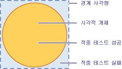
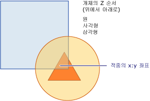

# 시각적 계층에서 적중 테스트Hit Testing in the Visual Layer
이 항목에서는 시각적 계층에서 제공하는 적중 테스트 기능의 개요를 제공합니다.This topic provides an overview of hit testing functionality provided by the visual layer. 적중 횟수 테스트 지원 기 하 도형 또는 포인트 값이의 렌더링된 콘텐츠 내에 있는지 확인할 수 있습니다는 <xref:System.Windows.Media.Visual>, 여러 개체를 선택할 선택 영역 직사각형 같은 사용자 인터페이스 동작을 구현할 수 있도록 합니다.Hit testing support allows you to determine whether a geometry or point value falls within the rendered content of a <xref:System.Windows.Media.Visual>, allowing you to implement user interface behavior such as a selection rectangle to select multiple objects.  
  
 
  
   
## 적중 테스트 시나리오Hit Testing Scenarios  
 <xref:System.Windows.UIElement> 클래스를 제공는 <xref:System.Windows.UIElement.InputHitTest%2A> 적중 지정된 된 좌표 값을 사용 하 여 테스트를 수행할 수 있는 방법입니다.The <xref:System.Windows.UIElement> class provides the <xref:System.Windows.UIElement.InputHitTest%2A> method, which allows you to hit test against an element using a given coordinate value. 대부분의 경우에서는 <xref:System.Windows.UIElement.InputHitTest%2A> 메서드에서 구현 적중 요소 테스트에 대 한 원하는 기능을 제공 합니다.In many cases, the <xref:System.Windows.UIElement.InputHitTest%2A> method provides the desired functionality for implementing hit testing of elements. 그러나 시각적 계층에서 적중 테스트를 구현해야 하는 몇 가지 시나리오가 있습니다.However, there are several scenarios in which you may need to implement hit testing at the visual layer.  
  
-   비-에 대해 적중 테스트<xref:System.Windows.UIElement> 개체: 테스트 비-적중 하는 경우이 적용 됩니다<xref:System.Windows.UIElement> 와 같은 개체 <xref:System.Windows.Media.DrawingVisual> 또는 그래픽 개체입니다.Hit testing against non-<xref:System.Windows.UIElement> objects: This applies if you are hit testing non-<xref:System.Windows.UIElement> objects, such as <xref:System.Windows.Media.DrawingVisual> or graphics objects.  
  
-   기하 도형을 사용하는 적중 테스트: 점의 좌표 값이 아닌 기하 도형 개체를 사용하여 적중 테스트를 수행해야 하는 경우에 적용됩니다.Hit testing using a geometry: This applies if you need to hit test using a geometry object rather than the coordinate value of a point.  
  
-   여러 개체에 대한 적중 테스트: 겹치는 개체와 같은 여러 개체에 대해 적중 테스트를 수행해야 하는 경우에 적용됩니다.Hit testing against multiple objects: This applies when you need to hit test against multiple objects, such as overlapping objects. 단지 첫 번째 개체만이 아니라 기하 도형 또는 점을 교차하는 모든 시각적 개체에 대한 결과를 얻을 수 있습니다.You can get results for all visuals intersecting a geometry or point, not just the first one.  
  
-   무시 하 고 <xref:System.Windows.UIElement> 적중 테스트 정책을: 무시 해야 하는 경우에 적용 됩니다는 <xref:System.Windows.UIElement> 적중 요소가 사용 되지 않는지 여부 또는 보이지 않는 같은 요소 고려 하는 정책을 테스트 합니다.Ignoring <xref:System.Windows.UIElement> hit testing policy: This applies when you need to ignore the <xref:System.Windows.UIElement> hit testing policy, which takes into consideration such factors as whether an element is disabled or invisible.  
  
> [!NOTE]
>  시각적 계층의 적중 테스트를 보여 주는 전체 코드 샘플에 대해서는 [DrawingVisuals를 사용하는 적중 테스트 샘플](http://go.microsoft.com/fwlink/?LinkID=159994) 및 [Win32 상호 운용성을 사용하는 적중 테스트 샘플](http://go.microsoft.com/fwlink/?LinkID=159995)을 참조하세요.For a complete code sample illustrating hit testing at the visual layer, see [Hit Test Using DrawingVisuals Sample](http://go.microsoft.com/fwlink/?LinkID=159994) and [Hit Test with Win32 Interoperation Sample](http://go.microsoft.com/fwlink/?LinkID=159995).  
  
   
## 적중 테스트 지원Hit Testing Support  
 용도 <xref:System.Windows.Media.VisualTreeHelper.HitTest%2A> 의 메서드는 <xref:System.Windows.Media.VisualTreeHelper> 클래스 기 하 도형 또는 점 좌표 값 컨트롤, 그래픽 요소 등의 지정된 된 개체의 렌더링 된 콘텐츠에 이내 인지 여부를 결정 하는 것입니다.The purpose of the <xref:System.Windows.Media.VisualTreeHelper.HitTest%2A> methods in the <xref:System.Windows.Media.VisualTreeHelper> class is to determine whether a geometry or point coordinate value is within the rendered content of a given object, such as a control or graphic element. 예를 들어 적중 테스트를 사용하여 개체의 경계 사각형 내부를 마우스로 클릭할 경우 기하 도형 원 내에 포함되는지 여부를 확인할 수 있습니다.For example, you could use hit testing to determine whether a mouse click within the bounding rectangle of an object falls within the geometry of a circle. 또한 적중 테스트의 기본 구현을 재정의하여 사용자 고유의 적중 테스트 계산을 사용자 지정하도록 선택할 수도 있습니다.You can also choose to override the default implementation of hit testing to perform your own custom hit test calculations.  
  
 다음 그림은 사각형이 아닌 개체의 영역 및 해당 경계 사각형 간 관계를 보여 줍니다.The following illustration shows the relationship between a non-rectangular object's region and its bounding rectangle.  
  
   
유효한 적정 테스트 영역의 다이어그램Diagram of valid hit test region  
  
   
## 적중 테스트 및 Z 순서Hit Testing and Z-Order  
 [!INCLUDE[TLA#tla_winclient](../../../../includes/tlasharptla-winclient-md.md)] 시각적 계층은 단지 최상위 개체만이 아니라 점 또는 기하 도형 아래의 모든 개체에 대한 적중 테스트를 지원합니다.The [!INCLUDE[TLA#tla_winclient](../../../../includes/tlasharptla-winclient-md.md)] visual layer supports hit testing against all objects under a point or geometry, not just the top-most object. 결과는 Z 순서대로 반환됩니다.Results are returned in z-order. 그러나에 대 한 매개 변수로 전달 하는 시각적 개체는 <xref:System.Windows.Media.VisualTreeHelper.HitTest%2A> 메서드는 부분을 결정 테스트의 시각적 트리 적중 됩니다.However, the visual object that you pass as the parameter to the <xref:System.Windows.Media.VisualTreeHelper.HitTest%2A> method determines which portion of the visual tree that will be hit test. 시각적 트리 전체 또는 일부에 대해 적중 테스트를 수행할 수 있습니다.You can hit test against the entire visual tree, or any portion of it.  
  
 다음 그림에서 원 개체는 사각형 및 삼각형 개체 위에 있습니다.In the following illustration, the circle object is on top of both the square and triangle objects. 적중 횟수 테스트의 z 좌표 값은 최상위 시각적 개체에에서만 관심이, 반환할 시각적 적중 횟수 테스트 열거형을 설정할 수 있습니다 <xref:System.Windows.Media.HitTestResultBehavior.Stop> 에서 <xref:System.Windows.Media.HitTestResultCallback> 적중 횟수 테스트 통과 첫 번째 항목 후 중지 하 합니다.If you are only interested in hit testing the visual object whose z-order value is top-most, you can set the visual hit test enumeration to return <xref:System.Windows.Media.HitTestResultBehavior.Stop> from the <xref:System.Windows.Media.HitTestResultCallback> to stop the hit test traversal after the first item.  
  
   
시각적 트리의 z 순서 다이어그램Diagram of the z-order of a visual tree  
  
 특정 데이터 요소 또는 기 하 도형에서 모든 시각적 개체를 열거 하려면 반환 <xref:System.Windows.Media.HitTestResultBehavior.Continue> 에서 <xref:System.Windows.Media.HitTestResultCallback>합니다.If you want to enumerate all visual objects under a specific point or geometry, return <xref:System.Windows.Media.HitTestResultBehavior.Continue> from the <xref:System.Windows.Media.HitTestResultCallback>. 즉 전체가 가려진 경우에도 다른 개체 아래에 있는 시각적 개체에 대한 적중 테스트를 수행할 수 있습니다.This means you can hit test for visual objects that are beneath other objects, even if they are wholly obscured. 자세한 내용은 "적중 테스트 결과 콜백 사용" 섹션의 샘플 코드를 참조하세요.See the sample code in the section "Using a Hit Test Results Callback" for more information.  
  
> [!NOTE]
>  투명한 시각적 개체에 대해서도 적중 테스트를 수행할 수 있습니다.A visual object that is transparent can also be hit test.  
  
   
## 기본 적중 테스트 사용Using Default Hit Testing  
 점을 사용 하 여 시각적 개체의 기 하 도형을 내인지 여부를 확인할 수는 <xref:System.Windows.Media.VisualTreeHelper.HitTest%2A> 메서드를 시각적 개체 및 지점이 좌표 테스트 기준으로 값을 지정 합니다.You can identify whether a point is within the geometry of a visual object, by using the <xref:System.Windows.Media.VisualTreeHelper.HitTest%2A> method to specify a visual object and a point coordinate value to test against. 시각적 개체 매개 변수는 시각적 트리에서 적중 테스트 검색의 시작점을 식별합니다.The visual object parameter identifies the starting point in the visual tree for the hit test search. 시각적 개체 시각적 트리의 기 하 도형 좌표가 포함 된 경우 설정 됩니다는 <xref:System.Windows.Media.HitTestResult.VisualHit%2A> 의 속성을 <xref:System.Windows.Media.HitTestResult> 개체입니다.If a visual object is found in the visual tree whose geometry contains the coordinate, it is set to the <xref:System.Windows.Media.HitTestResult.VisualHit%2A> property of a <xref:System.Windows.Media.HitTestResult> object. <xref:System.Windows.Media.HitTestResult> 다음에서 반환 되는 <xref:System.Windows.Media.VisualTreeHelper.HitTest%2A> 메서드.The <xref:System.Windows.Media.HitTestResult> is then returned from the <xref:System.Windows.Media.VisualTreeHelper.HitTest%2A> method. 지점은 적중 테스트, 시각적 하위 트리의와 포함 되지 않은 경우 <xref:System.Windows.Media.VisualTreeHelper.HitTest%2A> 반환 `null`합니다.If the point is not contained with the visual sub-tree you are hit testing, <xref:System.Windows.Media.VisualTreeHelper.HitTest%2A> returns `null`.  
  
> [!NOTE]
>  기본 적중 테스트는 항상 z 순서로 최상위 개체를 반환합니다.Default hit testing always returns the top-most object in the z-order. 부분적으로 또는 완전히 가려져 있더라도 모든 시각적 개체를 식별하려면 적중 테스트 결과 콜백을 사용합니다.In order to identify all visual objects, even those that may be partly or wholly obscured, use a hit test result callback.  
  
 에 대 한 지점 매개 변수로 전달 하는 좌표 값은 <xref:System.Windows.Media.VisualTreeHelper.HitTest%2A> 메서드에 적중에 대 한 테스트는 시각적 개체의 좌표 공간을 기준으로 하는 합니다.The coordinate value you pass as the point parameter for the <xref:System.Windows.Media.VisualTreeHelper.HitTest%2A> method has to be relative to the coordinate space of the visual object you are hit testing against. 예를 들어 중첩된 시각적 개체가 부모 좌표 공간에서 (100, 100)에 정의된 경우 (0, 0)의 자식 시각적 개체에 대해 적중 테스트를 수행하는 것은 부모 좌표 공간의 (100, 100)에서 적중 테스트를 수행하는 것과 같습니다.For example, if you have nested visual objects defined at (100, 100) in the parent's coordinate space, then hit testing a child visual at (0, 0) is equivalent to hit testing at (100, 100) in the parent's coordinate space.  
  
 다음 코드에 대 한 마우스 이벤트 처리기를 설정 하는 방법을 보여 줍니다는 <xref:System.Windows.UIElement> 개체에 사용 되는 이벤트를 캡처해야 하는 데 사용 되는 적중 테스트 합니다.The following code shows how to set up mouse event handlers for a <xref:System.Windows.UIElement> object that is used to capture events used for hit testing.  
  
 [!code-csharp[HitTestingOverview#100](../../../../samples/snippets/csharp/VS_Snippets_Wpf/HitTestingOverview/CSharp/Window1.xaml.cs#100)]
 [!code-vb[HitTestingOverview#100](../../../../samples/snippets/visualbasic/VS_Snippets_Wpf/HitTestingOverview/visualbasic/window1.xaml.vb#100)]  
  
### 시각적 트리가 적중 테스트에 미치는 영향How the Visual Tree Affects Hit Testing  
 시각적 트리의 시작점은 개체의 적중 테스트 열거 동안 반환되는 개체를 결정합니다.The starting point in the visual tree determines which objects are returned during the hit test enumeration of objects. 여러 개체에 대해 적중 테스트를 수행하려는 경우 시각적 트리에서 시작점으로 사용되는 시각적 개체는 관심 있는 모든 개체의 공통 상위 항목이어야 합니다.If you have multiple objects you want to hit test, the visual object used as the starting point in the visual tree must be the common ancestor of all objects of interest. 예를 들어 다음 다이어그램에서 button 요소 및 drawing visual 요소 둘 다에 대해 적중 테스트를 수행하려는 경우 시각적 트리의 시작점을 두 요소의 공통 상위 항목으로 설정해야 합니다.For example, if you were interested in hit testing both the button element and drawing visual in the following diagram, you would have to set the starting point in the visual tree to the common ancestor of both. 이 경우 canvas 요소는 button 요소 및 drawing visual의 공통 상위 항목입니다.In this case, the canvas element is the common ancestor of both the button element and the drawing visual.  
  
   
시각적 트리 계층 구조의 다이어그램Diagram of a visual tree hierarchy  
  
> [!NOTE]
>  <xref:System.Windows.UIElement.IsHitTestVisible%2A> 속성 선언 하는 값을 가져오거나 여부는 <xref:System.Windows.UIElement>-파생 된 개체 반환 될 수는 적중 횟수 테스트 결과로 렌더링 된 콘텐츠의 일부에서 합니다.The <xref:System.Windows.UIElement.IsHitTestVisible%2A> property gets or sets a value that declares whether a <xref:System.Windows.UIElement>-derived object can possibly be returned as a hit test result from some portion of its rendered content. 또한 적중 테스트와 관련된 시각적 개체를 확인하도록 시각적 트리를 선택적으로 변경할 수 있습니다.This allows you to selectively alter the visual tree to determine which visual objects are involved in a hit test.  
  
   
## 적중 테스트 결과 콜백 사용Using a Hit Test Result Callback  
 해당 기하 도형이 지정된 좌표 값을 포함하는 시각적 트리의 모든 시각적 개체를 열거할 수 있습니다.You can enumerate all visual objects in a visual tree whose geometry contains a specified coordinate value. 또한 부분적으로 또는 완전히 가려져 있더라도 모든 시각적 개체를 식별할 수 있습니다.This allows you to identify all visual objects, even those that may be partly or wholly obscured by other visual objects. 시각적 트리를 사용 하는 시각적 개체를 열거 하는 <xref:System.Windows.Media.VisualTreeHelper.HitTest%2A> 적중된 테스트 콜백 함수를 사용 하 여 메서드.To enumerate visual objects in a visual tree use the <xref:System.Windows.Media.VisualTreeHelper.HitTest%2A> method with a hit test callback function. 적중 테스트 콜백 함수는 지정한 좌표 값이 시각적 개체에 포함된 경우 시스템에 의해 호출됩니다.The hit test callback function is called by the system when the coordinate value you specify is contained in a visual object.  
  
 적중 테스트 결과 열거 동안에는 해당 시각적 트리를 수정하는 어떤 작업도 수행하면 안 됩니다.During the hit test results enumeration, you should not perform any operation that modifies the visual tree. 개체가 트래버스되는 동안 시각적 트리에 추가 또는 제거하면 예기치 않은 동작이 발생할 수 있습니다.Adding or removing an object from the visual tree while it is being traversed can result in unpredictable behavior. 후의 표시 트리를 안전 하 게 수정할 수 있습니다는 <xref:System.Windows.Media.VisualTreeHelper.HitTest%2A> 메서드 반환 합니다.You can safely modify the visual tree after the <xref:System.Windows.Media.VisualTreeHelper.HitTest%2A> method returns. 와 같은 데이터 구조를 제공 하려는 경우는 <xref:System.Collections.ArrayList>, 적중 횟수 테스트 결과 열거 하는 동안 값을 저장 하 합니다.You may want to provide a data structure, such as an <xref:System.Collections.ArrayList>, to store values during the hit test results enumeration.  
  
 [!code-csharp[HitTestingOverview#101](../../../../samples/snippets/csharp/VS_Snippets_Wpf/HitTestingOverview/CSharp/Window1.xaml.cs#101)]
 [!code-vb[HitTestingOverview#101](../../../../samples/snippets/visualbasic/VS_Snippets_Wpf/HitTestingOverview/visualbasic/window1.xaml.vb#101)]  
  
 적중 테스트 콜백 메서드는 시각적 트리의 특정 시각적 개체에서 적중 테스트가 식별될 때 수행하는 작업을 정의합니다.The hit test callback method defines the actions you perform when a hit test is identified on a particular visual object in the visual tree. 반환 된 작업을 수행한 후는 <xref:System.Windows.Media.HitTestResultBehavior> 다른 시각적 개체의 열거를 계속할지 여부를 여부를 결정 하는 값입니다.After you perform the actions, you return a <xref:System.Windows.Media.HitTestResultBehavior> value that determines whether to continue the enumeration of any other visual objects or not.  
  
 [!code-csharp[HitTestingOverview#102](../../../../samples/snippets/csharp/VS_Snippets_Wpf/HitTestingOverview/CSharp/Window1.xaml.cs#102)]
 [!code-vb[HitTestingOverview#102](../../../../samples/snippets/visualbasic/VS_Snippets_Wpf/HitTestingOverview/visualbasic/window1.xaml.vb#102)]  
  
> [!NOTE]
>  적중 시각적 개체의 열거 순서는 z 순서는 따릅니다.The order of enumeration of hit visual objects is by z-order. 최상위 z 순서 수준의 시각적 개체는 첫 번째로 열거되는 개체입니다.The visual object at the top-most z-order level is the first object enumerated. 열거되는 다른 시각적 개체는 z 순서의 내림차순으로 표시됩니다.Any other visual objects enumerated are at decreasing z-order level. 이 열거 순서는 시각적 개체의 렌더링 순서에 해당합니다.This order of enumeration corresponds to the rendering order of the visuals.  
  
 반환 하 여 언제 든 지 적중 횟수 테스트 콜백 함수에서 시각적 개체의 열거를 중지할 수 있습니다 <xref:System.Windows.Media.HitTestResultBehavior.Stop>합니다.You can stop the enumeration of visual objects at any time in the hit test callback function by returning <xref:System.Windows.Media.HitTestResultBehavior.Stop>.  
  
 [!code-csharp[HitTestingOverview#103](../../../../samples/snippets/csharp/VS_Snippets_Wpf/HitTestingOverview/CSharp/Window1.xaml.cs#103)]
 [!code-vb[HitTestingOverview#103](../../../../samples/snippets/visualbasic/VS_Snippets_Wpf/HitTestingOverview/visualbasic/window1.xaml.vb#103)]  
  
   
## 적중 테스트 필터 콜백 사용Using a Hit Test Filter Callback  
 선택적 적중 테스트 필터를 사용하여 적중 테스트 결과로 전달되는 개체를 제한할 수 있습니다.You can use an optional hit test filter to restrict the objects that are passed on to the hit test results. 이를 통해 적중 횟수 테스트 결과 처리 중 시각적 트리에서 관련이 없는 파트를 무시할 수 있습니다.This allows you to ignore parts of the visual tree that you are not interested in processing in your hit test results. 적중 횟수 테스트 필터를 구현 하려면 적중 횟수 테스트 필터 콜백 함수를 정의 하 고이 호출할 때 매개 변수 값으로 전달 된 <xref:System.Windows.Media.VisualTreeHelper.HitTest%2A> 메서드.To implement a hit test filter, you define a hit test filter callback function and pass it as a parameter value when you call the <xref:System.Windows.Media.VisualTreeHelper.HitTest%2A> method.  
  
 [!code-csharp[HitTestingOverview#104](../../../../samples/snippets/csharp/VS_Snippets_Wpf/HitTestingOverview/CSharp/Window1.xaml.cs#104)]
 [!code-vb[HitTestingOverview#104](../../../../samples/snippets/visualbasic/VS_Snippets_Wpf/HitTestingOverview/visualbasic/window1.xaml.vb#104)]  
  
 선택적 적중 횟수 테스트 필터 콜백 함수를 제공 하지 않을 경우 전달 된 `null` 값에 대 한 매개 변수로 <xref:System.Windows.Media.VisualTreeHelper.HitTest%2A> 메서드.If you do not want to supply the optional hit test filter callback function, pass a `null` value as its parameter for the <xref:System.Windows.Media.VisualTreeHelper.HitTest%2A> method.  
  
 [!code-csharp[HitTestingOverview#105](../../../../samples/snippets/csharp/VS_Snippets_Wpf/HitTestingOverview/CSharp/Window1.xaml.cs#105)]
 [!code-vb[HitTestingOverview#105](../../../../samples/snippets/visualbasic/VS_Snippets_Wpf/HitTestingOverview/visualbasic/window1.xaml.vb#105)]  
  
   
시각적 트리 정리Pruning a visual tree  
  
 적중 테스트 필터 콜백 함수를 사용하면 해당 렌더링된 콘텐츠가 지정한 좌표를 포함하는 모든 시각적 개체를 열거할 수 있습니다.The hit test filter callback function allows you to enumerate through all the visuals whose rendered content contains the coordinates you specify. 그렇지만 적중 테스트 결과 콜백 함수에서 처리하지 않으려는 시각적 트리의 특정 분기를 무시하고 싶을 수 있습니다.However, you may want to ignore certain branches of the visual tree that you are not interested in processing in your hit test results callback function. 적중 테스트 필터 콜백 함수의 반환 값은 수행해야 하는 시각적 개체의 열거 작업 유형을 결정합니다.The return value of the hit test filter callback function determines what type of action the enumeration of the visual objects should take. 예를 들어, 값을 반환 하는 경우 <xref:System.Windows.Media.HitTestFilterBehavior.ContinueSkipSelfAndChildren>, 적중 횟수 테스트 결과 열거형에서 현재 시각적 개체 및 자식 함수를 제거할 수 있습니다.For example, if you return the value, <xref:System.Windows.Media.HitTestFilterBehavior.ContinueSkipSelfAndChildren>, you can remove the current visual object and its children from the hit test results enumeration. 즉, 적중 테스트 결과 콜백 함수를 사용하면 열거에 이러한 개체가 표시되지 않습니다.This means that the hit test results callback function will not see these objects in its enumeration. 개체의 시각적 트리를 정리하면 적중 테스트 결과 열거 패스 동안 처리 양이 감소합니다.Pruning the visual tree of objects decreases the amount of processing during the hit test results enumeration pass. 다음 코드 예제에서 필터는 레이블 및 해당 하위 항목을 건너뛰고 다른 모든 항목에 대해 적중 테스트를 수행합니다.In the following code example, the filter skips labels and their descendants and hit tests everything else.  
  
 [!code-csharp[HitTestingOverview#106](../../../../samples/snippets/csharp/VS_Snippets_Wpf/HitTestingOverview/CSharp/Window1.xaml.cs#106)]
 [!code-vb[HitTestingOverview#106](../../../../samples/snippets/visualbasic/VS_Snippets_Wpf/HitTestingOverview/visualbasic/window1.xaml.vb#106)]  
  
> [!NOTE]
>  적중 테스트 결과 콜백이 호출되지 않는 경우에 적중 테스트 필터 콜백이 호출되는 경우도 있습니다.The hit test filter callback will sometimes be called in cases where the hit test results callback is not called.  
  
   
## 기본 적중 테스트 재정의Overriding Default Hit Testing  
 시각적 개체의 기본 적중 테스트 지원을 재정의 하 여 재정의할 수 있습니다는 <xref:System.Windows.Media.Visual.HitTestCore%2A> 메서드.You can override a visual object’s default hit testing support by overriding the <xref:System.Windows.Media.Visual.HitTestCore%2A> method. 즉, 호출 하는 경우는 <xref:System.Windows.Media.VisualTreeHelper.HitTest%2A> 메서드를 재정의 된 구현 <xref:System.Windows.Media.Visual.HitTestCore%2A> 호출 됩니다.This means that when you invoke the <xref:System.Windows.Media.VisualTreeHelper.HitTest%2A> method, your overridden implementation of <xref:System.Windows.Media.Visual.HitTestCore%2A> is called. 재정의된 메서드는 좌표가 시각적 개체의 렌더링된 콘텐츠 밖에 있는 경우에도 적중 테스트가 시각적 개체의 경계 사각형 내에 적용되면 호출됩니다.Your overridden method is called when a hit test falls within the bounding rectangle of the visual object, even if the coordinate falls outside the rendered content of the visual object.  
  
 [!code-csharp[HitTestingOverview#107](../../../../samples/snippets/csharp/VS_Snippets_Wpf/HitTestingOverview/CSharp/Window1.xaml.cs#107)]
 [!code-vb[HitTestingOverview#107](../../../../samples/snippets/visualbasic/VS_Snippets_Wpf/HitTestingOverview/visualbasic/window1.xaml.vb#107)]  
  
 시각적 개체의 경계 사각형과 렌더링된 콘텐츠 둘 다에 대해 적중 테스트를 수행하려는 경우가 있을 수 있습니다.There may be times when you want to hit test against both the bounding rectangle and the rendered content of a visual object. 사용 하 여는 `PointHitTestParameters` 매개 변수 값의 재정의 된 <xref:System.Windows.Media.Visual.HitTestCore%2A> 기본 메서드를 매개 변수로 <xref:System.Windows.Media.Visual.HitTestCore%2A>, 시각적 개체의 경계 사각형의 적중 횟수에 따라 작업을 수행 하 고 다음에 대 한 두 번째 적중 횟수 테스트를 수행할 수 있습니다는 시각적 개체의 콘텐츠를 렌더링 합니다.By using the `PointHitTestParameters` parameter value in your overridden <xref:System.Windows.Media.Visual.HitTestCore%2A> method as the parameter to the base method <xref:System.Windows.Media.Visual.HitTestCore%2A>, you can perform actions based on a hit of the bounding rectangle of a visual object, and then perform a second hit test against the rendered content of the visual object.  
  
 [!code-csharp[HitTestingOverview#108](../../../../samples/snippets/csharp/VS_Snippets_Wpf/HitTestingOverview/CSharp/Window1.xaml.cs#108)]
 [!code-vb[HitTestingOverview#108](../../../../samples/snippets/visualbasic/VS_Snippets_Wpf/HitTestingOverview/visualbasic/window1.xaml.vb#108)]  
  
## 참고 항목See Also  
 <xref:System.Windows.Media.VisualTreeHelper.HitTest%2A>  
 <xref:System.Windows.Media.HitTestResult>  
 <xref:System.Windows.Media.HitTestResultCallback>  
 <xref:System.Windows.Media.HitTestFilterCallback>  
 <xref:System.Windows.UIElement.IsHitTestVisible%2A>  
 [적중 횟수 테스트 DrawingVisuals 샘플을 사용 하 여Hit Test Using DrawingVisuals Sample](http://go.microsoft.com/fwlink/?LinkID=159994)  
 [적중 횟수 테스트와 Win32 상호 운용성 샘플Hit Test with Win32 Interoperation Sample](http://go.microsoft.com/fwlink/?LinkID=159995)  
 [시각적 요소의 기하 도형 적중 테스트Hit Test Geometry in a Visual](../../../../docs/framework/wpf/graphics-multimedia/how-to-hit-test-geometry-in-a-visual.md)  
 [Win32 호스트 컨테이너를 사용하여 적중 테스트Hit Test Using a Win32 Host Container](../../../../docs/framework/wpf/graphics-multimedia/how-to-hit-test-using-a-win32-host-container.md)
