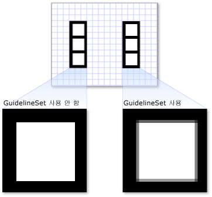

# 방법: Drawing에 GuidelineSet 적용
적용 하는 방법을 보여 주는이 예제는 <xref:System.Windows.Media.GuidelineSet> 에 <xref:System.Windows.Media.DrawingGroup>합니다.  
  
 <xref:System.Windows.Media.DrawingGroup> 클래스의 유일한 형식인 <xref:System.Windows.Media.Drawing> 올려진는 <xref:System.Windows.Media.DrawingGroup.GuidelineSet%2A> 속성입니다. 적용 하는 <xref:System.Windows.Media.GuidelineSet> 를 다른 유형의 <xref:System.Windows.Media.Drawing>에 추가 <xref:System.Windows.Media.DrawingGroup> 다음 적용는 <xref:System.Windows.Media.GuidelineSet> 에 프로그램 <xref:System.Windows.Media.DrawingGroup>합니다.  
  
## 예제  
 다음 예제에서는 두 개의 <xref:System.Windows.Media.DrawingGroup> 거의 동일한; 유일한 차이점은 개체: 두 번째 <xref:System.Windows.Media.DrawingGroup> 에 <xref:System.Windows.Media.GuidelineSet> 첫 번째 되지 않는다는 것입니다.  
  
 다음 그림에서는 예제의 출력을 보여 줍니다. 둘 사이의 차이점은 렌더링 하므로 <xref:System.Windows.Media.DrawingGroup> 개체는 여러, 그리기의 일부를 확대 합니다.  
  
   
  
 [!code-csharp[DrawingMiscSnippets_snip#GraphicsMMDrawingGroupGuidelineSetExampleWholePage](../../../../samples/snippets/csharp/VS_Snippets_Wpf/DrawingMiscSnippets_snip/CSharp/DrawingGroupGuidelineSetExample.cs#graphicsmmdrawinggroupguidelinesetexamplewholepage)]
 [!code-xaml[DrawingMiscSnippets_snip#GraphicsMMDrawingGroupGuidelineSetExampleWholePage](../../../../samples/snippets/xaml/VS_Snippets_Wpf/DrawingMiscSnippets_snip/XAML/DrawingGroupGuidelineSetExample.xaml#graphicsmmdrawinggroupguidelinesetexamplewholepage)]  
  
## 참고 항목  
 <xref:System.Windows.Media.DrawingGroup>  
 <xref:System.Windows.Media.GuidelineSet>  
 [Drawing 개체 개요](../../../../docs/framework/wpf/graphics-multimedia/drawing-objects-overview.md)
