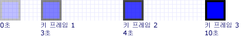
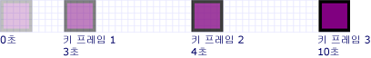
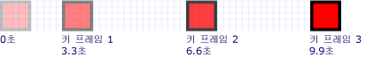
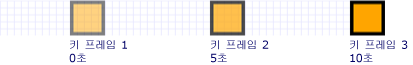

# 방법: 키 프레임 애니메이션 타이밍 제어
이 예제에는 내 키 프레임 애니메이션 키 프레임의 타이밍을 제어 하는 방법을 보여 줍니다. 마찬가지로 다른 애니메이션 키 프레임 애니메이션에는 한 <xref:System.Windows.Media.Animation.Timeline.Duration%2A> 속성입니다. 애니메이션의 지속 시간을 지정 하는 것 외에도 각 키 프레임에 할당 되어 해당 기간의 어떤 부분을 지정 해야 합니다. 지정 시간을 할당 하는 <xref:System.Windows.Media.Animation.KeyTime> 애니메이션의 각 키 프레임에 대 한 합니다.  
  
 <xref:System.Windows.Media.Animation.KeyTime> 때 키 프레임이 끝나는 시간 (키 프레임이 재생 되는 시간의 길이 지정 하지 않습니다)을 지정 하는 각 키 프레임에 대 한 합니다. 지정할 수 있습니다는 <xref:System.Windows.Media.Animation.KeyTime> 로 <xref:System.TimeSpan> 또는 백분율 값의 <xref:System.Windows.Media.Animation.KeyTime.Uniform%2A> 또는 <xref:System.Windows.Media.Animation.KeyTime.Paced%2A> 특수 값입니다.  
  
## 예제  
 다음 예제에서는 한 <xref:System.Windows.Media.Animation.DoubleAnimationUsingKeyFrames> 사각형을 화면에서 애니메이션을 적용할 합니다. 키 프레임의 키 시간으로 설정 되어 <xref:System.TimeSpan> 값입니다.  
  
 [!code-csharp[keyframes_snip#KeyTimesTimeSpanExample](../../../../samples/snippets/csharp/VS_Snippets_Wpf/keyframes_snip/CSharp/KeyTimesExample.cs#keytimestimespanexample)]
 [!code-vb[keyframes_snip#KeyTimesTimeSpanExample](../../../../samples/snippets/visualbasic/VS_Snippets_Wpf/keyframes_snip/visualbasic/keytimesexample.vb#keytimestimespanexample)]
 [!code-xaml[keyframes_snip#KeyTimesTimeSpanExample](../../../../samples/snippets/xaml/VS_Snippets_Wpf/keyframes_snip/XAML/KeyTimesExample.xaml#keytimestimespanexample)]  
  
 다음 그림에서는 각 키 프레임의 값에 도달 합니다.  
  
   
  
 다음 예제는 동일 키 프레임의 키 시간 백분율 값으로 설정 하는 애니메이션을 보여 줍니다.  
  
 [!code-csharp[keyframes_snip#KeyTimesPercentageExample](../../../../samples/snippets/csharp/VS_Snippets_Wpf/keyframes_snip/CSharp/KeyTimesExample.cs#keytimespercentageexample)]
 [!code-vb[keyframes_snip#KeyTimesPercentageExample](../../../../samples/snippets/visualbasic/VS_Snippets_Wpf/keyframes_snip/visualbasic/keytimesexample.vb#keytimespercentageexample)]
 [!code-xaml[keyframes_snip#KeyTimesPercentageExample](../../../../samples/snippets/xaml/VS_Snippets_Wpf/keyframes_snip/XAML/KeyTimesExample.xaml#keytimespercentageexample)]  
  
 다음 그림에서는 각 키 프레임의 값에 도달 합니다.  
  
   
  
 다음 예제에서는 <xref:System.Windows.Media.Animation.KeyTime.Uniform%2A> 키 시간 값입니다.  
  
 [!code-csharp[keyframes_snip#KeyTimesUniformExample](../../../../samples/snippets/csharp/VS_Snippets_Wpf/keyframes_snip/CSharp/KeyTimesExample.cs#keytimesuniformexample)]
 [!code-vb[keyframes_snip#KeyTimesUniformExample](../../../../samples/snippets/visualbasic/VS_Snippets_Wpf/keyframes_snip/visualbasic/keytimesexample.vb#keytimesuniformexample)]
 [!code-xaml[keyframes_snip#KeyTimesUniformExample](../../../../samples/snippets/xaml/VS_Snippets_Wpf/keyframes_snip/XAML/KeyTimesExample.xaml#keytimesuniformexample)]  
  
 다음 그림에서는 각 키 프레임의 값에 도달 합니다.  
  
   
  
 마지막 예에서는 사용 하 여 <xref:System.Windows.Media.Animation.KeyTime.Paced%2A> 키 시간 값입니다.  
  
 [!code-csharp[keyframes_snip#KeyTimesPacedExample](../../../../samples/snippets/csharp/VS_Snippets_Wpf/keyframes_snip/CSharp/KeyTimesExample.cs#keytimespacedexample)]
 [!code-vb[keyframes_snip#KeyTimesPacedExample](../../../../samples/snippets/visualbasic/VS_Snippets_Wpf/keyframes_snip/visualbasic/keytimesexample.vb#keytimespacedexample)]
 [!code-xaml[keyframes_snip#KeyTimesPacedExample](../../../../samples/snippets/xaml/VS_Snippets_Wpf/keyframes_snip/XAML/KeyTimesExample.xaml#keytimespacedexample)]  
  
 다음 그림에서는 각 키 프레임의 값에 도달 합니다.  
  
   
  
 간단한 설명을 위해이 예에서는 사용 하 여 로컬 애니메이션의 코드 버전 하지 storyboard를 단일 속성에 적용 되는지만 단일 애니메이션 되었지만 스토리 보드를 대신 사용 하도록 예제를 수정할 수 있습니다. 코드에서 스토리 보드를 선언 하는 방법을 보여 주는 예제를 참조 하십시오. [속성 스토리 보드를 사용 하 여 애니메이션을 적용](../../../../docs/framework/wpf/graphics-multimedia/how-to-animate-a-property-by-using-a-storyboard.md)합니다.  
  
 전체 샘플을 보려면 [키 프레임 애니메이션 샘플](http://go.microsoft.com/fwlink/?LinkID=160012)을 참조하세요. 키 프레임 애니메이션에 대 한 자세한 내용은 참조는 [키 프레임 애니메이션 개요](../../../../docs/framework/wpf/graphics-multimedia/key-frame-animations-overview.md)합니다.  
  
## 참고 항목  
 [키 프레임 애니메이션 개요](../../../../docs/framework/wpf/graphics-multimedia/key-frame-animations-overview.md)  
 [애니메이션 개요](../../../../docs/framework/wpf/graphics-multimedia/animation-overview.md)  
 [방법 항목](../../../../docs/framework/wpf/graphics-multimedia/animation-and-timing-how-to-topics.md)
