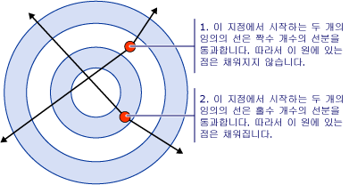
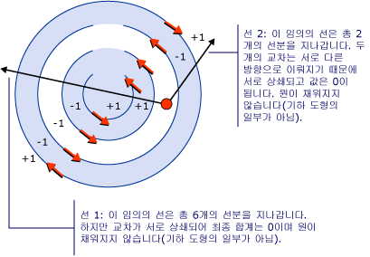
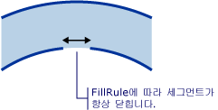

# 방법: 복합 도형의 채우기 제어How to: Control the Fill of a Composite Shape
<xref:System.Windows.Media.GeometryGroup.FillRule%2A> 속성은 <xref:System.Windows.Media.GeometryGroup> 또는 <xref:System.Windows.Media.PathGeometry>, 복합 셰이프를 사용 하 여 지정된 된 지점 기 하 도형의 일부 인지 확인할 "규칙"을 지정 합니다.The <xref:System.Windows.Media.GeometryGroup.FillRule%2A> property of a <xref:System.Windows.Media.GeometryGroup> or a <xref:System.Windows.Media.PathGeometry>, specifies a "rule" which the composite shape uses to determine whether a given point is part of the geometry. 두 개의 가능한 값에 대 한 <xref:System.Windows.Media.FillRule>: <xref:System.Windows.Media.FillRule.EvenOdd> 및 <xref:System.Windows.Media.FillRule.Nonzero>합니다.There are two possible values for <xref:System.Windows.Media.FillRule>: <xref:System.Windows.Media.FillRule.EvenOdd> and <xref:System.Windows.Media.FillRule.Nonzero>. 다음 섹션에서는 이러한 두 가지 규칙을 사용하는 방법을 설명합니다.The following sections will describe how to use these two rules.  
  
 **EvenOdd:** 이 규칙은 해당 점에서 모든 방향으로 무한대로 광선을 그리고 광선이 교차하는 지정된 도형 내에서 경로 세그먼트 수를 계산하여 채우기 영역에 점이 있는지 여부를 결정합니다.**EvenOdd:** This rule determines whether a point is in the fill region by drawing a ray from that point to infinity in any direction and counting the number of path segments within the given shape that the ray crosses. 이 숫자가 홀수이면 점이 안에 있고, 짝수이면 밖에 있습니다.If this number is odd, the point is inside; if even, the point is outside.  
  
 예를 들어 다음 XAML와 일련의 동심원 (대상) 이루어진 복합 셰이프를 만듭니다는 <xref:System.Windows.Media.GeometryGroup.FillRule%2A> 로 설정 <xref:System.Windows.Media.FillRule.EvenOdd>합니다.For example, the XAML below creates a composite shape made up of a series of concentric rings (target) with a <xref:System.Windows.Media.GeometryGroup.FillRule%2A> set to <xref:System.Windows.Media.FillRule.EvenOdd>.  
  
 [!code-xaml[GeometriesMiscSnippets_snip#FillRuleEvenOddValue](../../../../samples/snippets/xaml/VS_Snippets_Wpf/GeometriesMiscSnippets_snip/XAML/FillRuleExample.xaml#fillruleevenoddvalue)]  
  
 다음 그림은 이전 예제에서 만든 도형을 보여 줍니다.The following illustration shows the shape created in the previous example.  
  
   
  
 위의 그림에서 보면 중심 및 세 번째 링이 채워져 있지 않음을 알 수 있습니다.In the illustration above, notice that the center and 3rd ring are not filled. 두 링 중 하나에 있는 점에서 그린 광선이 짝수의 세그먼트를 통과하기 때문입니다.This is because a ray drawn from any point within either of those two rings passes through an even number of segments. 다음 그림을 참조하세요.See illustration below:  
  
   
  
 **NonZero:** 이 규칙은 해당 점에서 모든 방향으로 무한대로 광선을 그린 후 도형의 세그먼트가 광선과 교차하는 위치를 검사하여 경로의 채우기 영역에 점이 있는지 여부를 결정합니다.**NonZero:** This rule determines whether a point is in the fill region of the path by drawing a ray from that point to infinity in any direction and then examining the places where a segment of the shape crosses the ray. 0부터 시작하여 세그먼트가 왼쪽에서 오른쪽으로 광선과 교차할 때마다 1을 추가하고 경로 세그먼트가 오른쪽에서 왼쪽으로 광선과 교차할 때마다 1을 뺍니다.Starting with a count of zero, add one each time a Segment crosses the ray from left to right and subtract one each time a path segment crosses the ray from right to left. 교차 수를 계산한 후 결과가 0이면 점이 경로의 밖에 있습니다.After counting the crossings, if the result is zero then the point is outside the path. 그렇지 않으면 점이 내부에 있습니다.Otherwise, it is inside.  
  
 [!code-xaml[GeometriesMiscSnippets_snip#FillRuleNonZeroValueEllipseGeometry](../../../../samples/snippets/xaml/VS_Snippets_Wpf/GeometriesMiscSnippets_snip/XAML/FillRuleExample.xaml#fillrulenonzerovalueellipsegeometry)]  
  
 값이 위 예제를 사용 하 여 <xref:System.Windows.Media.FillRule.Nonzero> 에 대 한 <xref:System.Windows.Media.GeometryGroup.FillRule%2A> 결과적으로 다음 그림을 제공 합니다.Using the example above, a value of <xref:System.Windows.Media.FillRule.Nonzero> for <xref:System.Windows.Media.GeometryGroup.FillRule%2A> gives the following illustration as a result:  
  
   
  
 여기에서 볼 수 있듯이 모든 링이 채워집니다.As you can see, all the rings are filled. 모든 세그먼트가 같은 방향으로 실행되므로 임의 점에서 그린 광선이 하나 이상의 세그먼트와 교차하고 교차의 합계가 0이 아니기 때문입니다.This is because all the segments are running in the same direction and so a ray drawn from any point will cross one or more segments and the sum of the crossings will not equal zero. 예를 들어 아래 그림에서 빨간색 화살표는 세그먼트가 그려지는 방향을 나타내고 흰색 화살표는 가장 안쪽 링의 점에서 실행되는 임의 광선을 나타냅니다.For example, in the illustration below, the red arrows represent the direction the segments are drawn and the white arrow represents an arbitrary ray running from a point in the innermost ring. 광선이 교차하는 각 세그먼트에 대해 0 값부터 시작할 경우 세그먼트가 왼쪽에서 오른쪽으로 광선과 교차하므로 1이 추가됩니다.Starting with a value of zero, for each segment that the ray crosses, a value of one is added because the segment crosses the ray from left to right.  
  
   
  
 동작을 더 잘 보여 주기 위해 <xref:System.Windows.Media.FillRule.Nonzero> 규칙 방향을 세그먼트 더 복잡 한 도형을 필요 합니다.To better demonstrate the behavior of <xref:System.Windows.Media.FillRule.Nonzero> rule a more complex shape with segments running in different directions is required. XAML 코드에서는 앞의 예제와 제외 하 고로 생성 한 <xref:System.Windows.Media.PathGeometry> 대신는 <xref:System.Windows.Media.EllipseGeometry> 동심원 완전히 닫힐 아니라를 만듭니다.The XAML code below creates a similar shape as the previous example except that it is created with a <xref:System.Windows.Media.PathGeometry> rather then a <xref:System.Windows.Media.EllipseGeometry> which creates four concentric arcs rather then fully closed concentric circles.  
  
 [!code-xaml[GeometriesMiscSnippets_snip#FillRuleNonZeroValuePathGeometry](../../../../samples/snippets/xaml/VS_Snippets_Wpf/GeometriesMiscSnippets_snip/XAML/FillRuleExample.xaml#fillrulenonzerovaluepathgeometry)]  
  
 다음 그림은 이전 예제에서 만든 도형을 보여 줍니다.The following illustration shows the shape created in the previous example.  
  
   
  
 중심에서 세 번째 호까지는 채워지지 않습니다.Notice that the third arc from the center is not filled. 아래 그림은 그 이유를 보여 줍니다.The illustration below shows why this is. 이 그림에서 빨간색 화살표는 세그먼트가 그려진 방향을 나타냅니다.In the illustration, the red arrows represent the direction the segments are drawn. 두 개의 흰색 화살표는 “채워지지 않은” 영역의 점에서 외부로 이동되는 2개의 임의 광선을 나타냅니다.The two white arrows represent two arbitrary rays that move out from a point in the "non-filled" region. 이 그림에서 볼 수 있듯이 해당 경로에서 세그먼트를 교차하는 지정된 광선의 값 합계는 0입니다.As can be seen from the illustration, the sum of the values from a given ray crossing the segments in its path is zero. 앞에서 정의한 대로 합계가 0이 *아닌* 경우는 해당 점이 형상에 속하는 것을 의미하지만 합계가 0이라는 사실은 해당 점이 형상에 속하지 않음을 의미합니다(채우기의 일부가 아님).As defined above, a sum of zero means that the point is not part of the geometry (not part of the fill) while a sum that is *not* zero, including a negative value, is part of the geometry.  
  
   
  
 **참고:** 위해 <xref:System.Windows.Media.FillRule>, 모든 셰이프는 닫혀 있다고 간주 됩니다.**Note:** For the purposes of <xref:System.Windows.Media.FillRule>, all shapes are considered closed. 세그먼트에 틈이 있으면 가상선을 그려 닫습니다.If there is a gap in a segment, draw an imaginary line to close it. 위의 예제에서는 링에 작은 틈이 있습니다.In the example above, there are small gaps in the rings. 이점을 고려할 때 이러한 틈을 지나가는 광선이 다른 결과를 가져와 광선이 다른 방향으로 진행될 것으로 예상할 수 있습니다.Given this, one might expect a ray that runs through the gap to give a different result then a ray running in another direction. 다음은 이러한 차이가 "허수 세그먼트" 중 하나는 확대 보여 줍니다 (적용 하기 위해 그려진 세그먼트는 <xref:System.Windows.Media.FillRule>) 닫을 때.Below is an enlarged illustration of one of these gaps and the "imaginary segment" (segment that is drawn for purposes of applying the <xref:System.Windows.Media.FillRule>) that closes it.  
  
   
  
## 예제Example  
  
## 참고 항목See Also  
 [복합 도형 만들기Create a Composite Shape](../../../../docs/framework/wpf/graphics-multimedia/how-to-create-a-composite-shape.md)  
 [Geometry 개요Geometry Overview](../../../../docs/framework/wpf/graphics-multimedia/geometry-overview.md)
