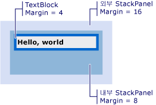

# 방법: 시각적 요소의 오프셋 가져오기
이러한 예제, 부모 또는 상위 항목 또는 하위 항목을 기준으로 하는 시각적 개체의 오프셋된 값을 검색 하는 방법을 보여 줍니다.  
  
## 예제  
 다음 예제에서는 태그는 <xref:System.Windows.Controls.TextBlock> 로 정의 된 <xref:System.Windows.FrameworkElement.Margin%2A> 4의 값입니다.  
  
 [!code-xaml[VisualSnippets#VisualSnippet1](../../../../samples/snippets/csharp/VS_Snippets_Wpf/VisualSnippets/CSharp/Window1.xaml#visualsnippet1)]  
  
 다음 코드 예제를 사용 하는 방법을 보여 줍니다는 <xref:System.Windows.Media.VisualTreeHelper.GetOffset%2A> 의 오프셋을 검색 하는 메서드는 <xref:System.Windows.Controls.TextBlock>합니다. 오프셋된 값이 포함 되어 반환 된 <xref:System.Windows.Vector> 값입니다.  
  
 [!code-csharp[VisualSnippets#VisualSnippet2](../../../../samples/snippets/csharp/VS_Snippets_Wpf/VisualSnippets/CSharp/Window1.xaml.cs#visualsnippet2)]
 [!code-vb[VisualSnippets#VisualSnippet2](../../../../samples/snippets/visualbasic/VS_Snippets_Wpf/VisualSnippets/visualbasic/window1.xaml.vb#visualsnippet2)]  
  
 오프셋은 고려는 <xref:System.Windows.FrameworkElement.Margin%2A> 값입니다. 이 경우 <xref:System.Windows.Vector.X%2A> 는 4, 및 <xref:System.Windows.Vector.Y%2A> 은 4입니다.  
  
 반환 되는 오프셋된 값은 부모에 상대적인는 <xref:System.Windows.Media.Visual>합니다. 부모에 상대적인 없는 오프셋된 값을 반환 하려는 경우는 <xref:System.Windows.Media.Visual>를 사용 하 여는 <xref:System.Windows.Media.Visual.TransformToAncestor%2A> 메서드.  
  
## 상위 요소에 상대적인 오프셋 가져오기  
 다음 예제에서는 태그는 <xref:System.Windows.Controls.TextBlock> 안에 두 개의 중첩 된 <xref:System.Windows.Controls.StackPanel> 개체입니다.  
  
 [!code-xaml[VisualSnippets#VisualSnippet7](../../../../samples/snippets/csharp/VS_Snippets_Wpf/VisualSnippets/CSharp/Window2.xaml#visualsnippet7)]  
  
 다음 그림에서는 태그의 결과 보여 줍니다.  
  
   
TextBlock 두 StackPanels 내에 중첩  
  
 다음 코드 예제를 사용 하는 방법을 보여 줍니다는 <xref:System.Windows.Media.Visual.TransformToAncestor%2A> 의 오프셋을 검색 하는 메서드는 <xref:System.Windows.Controls.TextBlock> 포함 하는 기준으로 <xref:System.Windows.Window>합니다. 오프셋된 값이 포함 되어 반환 된 <xref:System.Windows.Media.GeneralTransform> 값입니다.  
  
 [!code-csharp[VisualSnippets#VisualSnippet5](../../../../samples/snippets/csharp/VS_Snippets_Wpf/VisualSnippets/CSharp/Window1.xaml.cs#visualsnippet5)]
 [!code-vb[VisualSnippets#VisualSnippet5](../../../../samples/snippets/visualbasic/VS_Snippets_Wpf/VisualSnippets/visualbasic/window1.xaml.vb#visualsnippet5)]  
  
 오프셋은 고려는 <xref:System.Windows.FrameworkElement.Margin%2A> 내의 포함 하는 모든 개체에 대 한 값 <xref:System.Windows.Window>합니다. 이 경우 <xref:System.Windows.Vector.X%2A> 는 28입니다 (16 + 8 + 4) 및 <xref:System.Windows.Vector.Y%2A> 는 28입니다.  
  
 상위 항목을 기준으로 반환 되는 오프셋된 값은 고 <xref:System.Windows.Media.Visual>합니다. 하위 항목에 대 한 상대 오프셋된 값을 반환 하려는 경우는 <xref:System.Windows.Media.Visual>를 사용 하 여는 <xref:System.Windows.Media.Visual.TransformToDescendant%2A> 메서드.  
  
## 하위 요소에 상대적인 오프셋 가져오기  
 다음 예제에서는 태그는 <xref:System.Windows.Controls.TextBlock> 내에 포함 된는 <xref:System.Windows.Controls.StackPanel> 개체입니다.  
  
 [!code-xaml[VisualSnippets#VisualSnippet4](../../../../samples/snippets/csharp/VS_Snippets_Wpf/VisualSnippets/CSharp/Window1.xaml#visualsnippet4)]  
  
 다음 코드 예제를 사용 하는 방법을 보여 줍니다는 <xref:System.Windows.Media.Visual.TransformToDescendant%2A> 의 오프셋을 검색 하는 메서드는 <xref:System.Windows.Controls.StackPanel> 해당 자식에 상대적인 <xref:System.Windows.Controls.TextBlock>합니다. 오프셋된 값이 포함 되어 반환 된 <xref:System.Windows.Media.GeneralTransform> 값입니다.  
  
 [!code-csharp[VisualSnippets#VisualSnippet9](../../../../samples/snippets/csharp/VS_Snippets_Wpf/VisualSnippets/CSharp/Window1.xaml.cs#visualsnippet9)]
 [!code-vb[VisualSnippets#VisualSnippet9](../../../../samples/snippets/visualbasic/VS_Snippets_Wpf/VisualSnippets/visualbasic/window1.xaml.vb#visualsnippet9)]  
  
 오프셋은 고려는 <xref:System.Windows.FrameworkElement.Margin%2A> 모든 개체에 대 한 값입니다. 이 경우 <xref:System.Windows.Vector.X%2A> -4 이며, 및 <xref:System.Windows.Vector.Y%2A> 은-4입니다. 부모 개체의 자식 개체를 기준으로 음수 오프셋 때문 오프셋된 값은 음수 값으로 지정 합니다.  
  
## 참고 항목  
 <xref:System.Windows.Media.Visual>  
 <xref:System.Windows.Media.VisualTreeHelper>  
 [WPF 그래픽 렌더링 개요](../../../../docs/framework/wpf/graphics-multimedia/wpf-graphics-rendering-overview.md)
