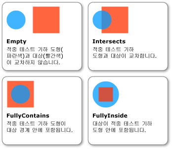

# 방법: 기하 도형을 매개 변수로 사용하여 적중 테스트
이 예제에서는 <xref:System.Windows.Media.Geometry>를 적중 테스트 매개 변수로 사용하여 시각적 개체에 대해 [적중 테스트](GTMT)를 수행하는 방법을 보여 줍니다.  
  
## 예제  
 다음 예제에서는 <xref:System.Windows.Media.VisualTreeHelper.HitTest%2A> 메서드에 대한 <xref:System.Windows.Media.GeometryHitTestParameters>를 사용하여 적중 테스트를 설정하는 방법을 보여 줍니다.  적중 테스트의 범위를 확장하기 위해 <xref:System.Windows.Media.Geometry> 개체를 만드는 데에는 `OnMouseDown` 메서드에 전달되는 <xref:System.Windows.Point> 값이 사용됩니다.  
  
 [!code-csharp[HitTestingOverview#HitTestingOverviewSnippet10](../../../../samples/snippets/csharp/VS_Snippets_Wpf/HitTestingOverview/CSharp/GeometryHitTest.cs#hittestingoverviewsnippet10)]
 [!code-vb[HitTestingOverview#HitTestingOverviewSnippet10](../../../../samples/snippets/visualbasic/VS_Snippets_Wpf/HitTestingOverview/visualbasic/geometryhittest.vb#hittestingoverviewsnippet10)]  
  
 <xref:System.Windows.Media.GeometryHitTestResult>의 <xref:System.Windows.Media.GeometryHitTestResult.IntersectionDetail%2A> 속성은 <xref:System.Windows.Media.Geometry>를 적중 테스트 매개 변수로 사용하는 적중 테스트의 결과에 대한 정보를 제공합니다.  다음 그림에서는 적중 테스트 기하 도형\(파란색 원\)과 대상 시각적 개체의 렌더링된 콘텐츠\(빨간색 사각형\) 사이의 관계를 보여 줍니다.  
  
   
적중 테스트 기하 도형과 대상 시각적 개체의 교차  
  
 다음 예제에서는 <xref:System.Windows.Media.Geometry>를 적중 테스트 매개 변수로 사용할 때 적중 테스트 콜백을 구현하는 방법을 보여 줍니다.  `result` 매개 변수는 <xref:System.Windows.Media.GeometryHitTestResult.IntersectionDetail%2A> 속성의 값을 검색하기 위해 <xref:System.Windows.Media.GeometryHitTestResult>로 캐스팅됩니다.  속성 값을 사용하면 <xref:System.Windows.Media.Geometry> 적중 테스트 매개 변수가 적중 테스트 대상의 렌더링된 콘텐츠 안에 완전히 포함되는지 부분적으로만 포함되는지 확인할 수 있습니다.  이 경우 샘플 코드는 대상 경계 내에 완전히 포함된 시각적 표시 목록에 적중 테스트 결과만 추가할 뿐입니다.  
  
 [!code-csharp[HitTestingOverview#HitTestingOverviewSnippet11](../../../../samples/snippets/csharp/VS_Snippets_Wpf/HitTestingOverview/CSharp/GeometryHitTest.cs#hittestingoverviewsnippet11)]
 [!code-vb[HitTestingOverview#HitTestingOverviewSnippet11](../../../../samples/snippets/visualbasic/VS_Snippets_Wpf/HitTestingOverview/visualbasic/geometryhittest.vb#hittestingoverviewsnippet11)]  
  
> [!NOTE]
>  교차 세부 사항이 <xref:System.Windows.Media.IntersectionDetail>인 경우에는 <xref:System.Windows.Media.HitTestResult> 콜백을 호출하지 않아야 합니다.  
  
## 참고 항목  
 [시각적 계층에서 적중 테스트](../../../../docs/framework/wpf/graphics-multimedia/hit-testing-in-the-visual-layer.md)   
 [시각적 요소의 기하 도형 적중 테스트](../../../../docs/framework/wpf/graphics-multimedia/how-to-hit-test-geometry-in-a-visual.md)