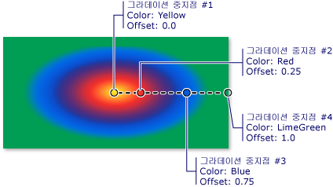

# 방법: 방사형 그라데이션으로 영역 그리기
사용 하는 방법을 보여 주는이 예제는 <xref:System.Windows.Media.RadialGradientBrush> 방사형 그라데이션으로 영역을 그리는 클래스입니다.  
  
## 예제  
 다음 예제에서는 한 <xref:System.Windows.Media.RadialGradientBrush> 노란색에서 파랑 라임 녹색으로 빨간색으로 전환 되는 방사형 그라데이션으로 여 사각형을 그립니다.  
  
 [!code-csharp[BrushesIntroduction_snip#SimpleRadialGradientExampleWholePage](../../../../samples/snippets/csharp/VS_Snippets_Wpf/BrushesIntroduction_snip/CSharp/RadialGradientBrushSnippet.cs#simpleradialgradientexamplewholepage)]
 [!code-vb[BrushesIntroduction_snip#SimpleRadialGradientExampleWholePage](../../../../samples/snippets/visualbasic/VS_Snippets_Wpf/BrushesIntroduction_snip/visualbasic/radialgradientbrushsnippet.vb#simpleradialgradientexamplewholepage)]
 [!code-xaml[BrushesIntroduction_snip#SimpleRadialGradientExampleWholePage](../../../../samples/snippets/xaml/VS_Snippets_Wpf/BrushesIntroduction_snip/XAML/RadialGradientBrushSnippet.xaml#simpleradialgradientexamplewholepage)]  
  
 다음 그림에서는 앞의 예제에서 그라데이션을 보여 줍니다. 그라데이션의 중지 강조 표시 되었습니다.  
  
   
  
> [!NOTE]
>  이 항목의 예제는 제어점을 설정 하기 위한 기본 좌표계를 사용 합니다. 경계 상자를 기준으로 기본 좌표계가: 0은 경계 상자의 0 %1의 경계 상자 100%를 나타냅니다. 이 좌표 시스템을 설정 하 여 변경할 수 있습니다는 <xref:System.Windows.Media.GradientBrush.MappingMode%2A> 속성 값을 <xref:System.Windows.Media.BrushMappingMode.Absolute>합니다. 절대 좌표계는 경계 상자를 기준으로 하지 않습니다. 값은 로컬 공간에서 직접 해석됩니다.  
  
 에 대 한 추가 <xref:System.Windows.Media.RadialGradientBrush> 예제를 보려면 참조는 [브러시 샘플](http://go.microsoft.com/fwlink/?LinkID=159973)합니다. 그라데이션 및 브러시의 다른 형식에 대 한 자세한 내용은 참조 [단색 및 그라데이션 개요 그리기](../../../../docs/framework/wpf/graphics-multimedia/painting-with-solid-colors-and-gradients-overview.md)합니다.
