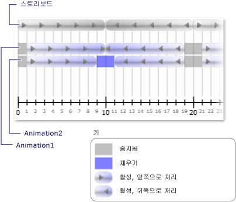

# 방법: 알림을 받을 때 클록 &#39; s 상태 변경
클록의 <xref:System.Windows.Media.Animation.Clock.CurrentStateInvalidated> 이벤트가 발생할 때 해당 <xref:System.Windows.Media.Animation.Clock.CurrentState%2A> 클록 시작 되거나 중지 될 때와 같은 유효 하지 않게 합니다. 사용 하 여 직접이 이벤트에 등록할 수는 <xref:System.Windows.Media.Animation.Clock>, 하거나 사용 하 여 등록할 수 있습니다는 <xref:System.Windows.Media.Animation.Timeline>합니다.  
  
 다음 예제에서는 <xref:System.Windows.Media.Animation.Storyboard> 와 두 개의 <xref:System.Windows.Media.Animation.DoubleAnimation> 개체는 두 개의 사각형의 너비에 애니메이션을 적용 하는 데 사용 됩니다. <xref:System.Windows.Media.Animation.Timeline.CurrentStateInvalidated> 이벤트는 클록 상태 변경 내용을 수신 대기 하는 데 사용 합니다.  
  
## 예제  
 [!code-xaml[timingbehaviors_snip#_graphicsmm_StateExampleMarkupWholePage](../../../../samples/snippets/csharp/VS_Snippets_Wpf/timingbehaviors_snip/CSharp/StateExample.xaml#_graphicsmm_stateexamplemarkupwholepage)]  
  
 [!code-csharp[timingbehaviors_snip#_graphicsmm_StateEventHandlers](../../../../samples/snippets/csharp/VS_Snippets_Wpf/timingbehaviors_snip/CSharp/StateExample.xaml.cs#_graphicsmm_stateeventhandlers)]
 [!code-vb[timingbehaviors_snip#_graphicsmm_StateEventHandlers](../../../../samples/snippets/visualbasic/VS_Snippets_Wpf/timingbehaviors_snip/visualbasic/stateexample.xaml.vb#_graphicsmm_stateeventhandlers)]  
  
 다음 그림과 부모 타임 라인으로 다양 한 상태 애니메이션 입력 (*스토리 보드*) 진행 합니다.  
  
   
  
 다음 표에서 시간을 *Animation1*의 <xref:System.Windows.Media.Animation.Timeline.CurrentStateInvalidated> 이벤트 발생:  
  
||||||||  
|-|-|-|-|-|-|-|  
|시간 (초)|1|10|19|21|30|39|  
|상태|활성|활성|중지됨|활성|활성|중지됨|  
  
 다음 표에서 시간을 *Animation2*의 <xref:System.Windows.Media.Animation.Timeline.CurrentStateInvalidated> 이벤트 발생:  
  
||||||||||  
|-|-|-|-|-|-|-|-|-|  
|시간 (초)|1|9|11|19|21|29|31|39|  
|상태|활성|채우기|활성|중지됨|활성|채우기|활성|중지됨|  
  
 다음에 유의 *Animation1*의 <xref:System.Windows.Media.Animation.Timeline.CurrentStateInvalidated> 상태로 유지 되는 경우에이 이벤트가 10 초 후에 발생 <xref:System.Windows.Media.Animation.ClockState.Active>합니다. 10 초 후에 상태가 변경에서 변경 하기 때문에 <xref:System.Windows.Media.Animation.ClockState.Active> 를 <xref:System.Windows.Media.Animation.ClockState.Filling> 다시 <xref:System.Windows.Media.Animation.ClockState.Active> 동일한 눈금에서 합니다.
